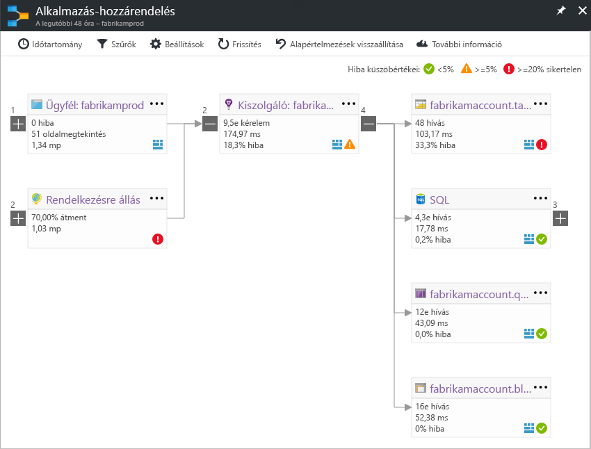

# Az Application Insightsban alkalmazás-hozzárendelésApplication Map in Application Insights
A [Azure Application Insights](app-insights-overview.md), alkalmazás-hozzárendelés az alkalmazás-összetevői közötti függőségi kapcsolatokat visual elrendezés.In [Azure Application Insights](app-insights-overview.md), Application Map is a visual layout of the dependency relationships of your application components. Minden egyes összetevő KPI-k például a terhelés, teljesítmény, hibák és figyelmeztetések, segítségével megkeresheti az adott teljesítményprobléma vagy hiba, amely összetevők közül bármelyik jeleníti meg.Each component shows KPIs such as load, performance, failures, and alerts, to help you discover any component causing a performance issue or failure. Kattintva keresztül valamelyik összetevő a részletesebb diagnosztikai, például az Application Insights események.You can click through from any component to more detailed diagnostics, such as Application Insights events. Ha az alkalmazás Azure-szolgáltatásokat használja, akkor is átkattintással is Azure Diagnostics, például az SQL Database Advisor-javaslatokra.If your app uses Azure services, you can also click through to Azure diagnostics, such as SQL Database Advisor recommendations.

Más típusú diagramokkal, például PIN-kód egy alkalmazás-hozzárendelés az Azure irányítópultot, ahol is teljes körűen használható.Like other charts, you can pin an application map to the Azure dashboard, where it is fully functional. 

## Nyissa meg az alkalmazás-hozzárendelésOpen the application map
Nyissa meg a térképen az alkalmazáshoz – Áttekintés paneljéről:Open the map from the overview blade for your application:

A térkép mutatja:The map shows:

* Rendelkezésre állási tesztekAvailability tests
* Ügyféloldali összetevő (figyeli a JavaScript SDK-val)Client-side component (monitored with the JavaScript SDK)
* Kiszolgálóoldali összetevőServer-side component
* Az ügyfél és kiszolgáló összetevők függőségeiDependencies of the client and server components

Bontsa ki, és a függőségi hivatkozás elemcsoportok:You can expand and collapse dependency link groups:

Ha egy típust (SQL, HTTP stb.) a számos függőségi, jelennek meg a csoportosított.If you have many dependencies of one type (SQL, HTTP etc.), they may appear grouped. 

## ProblémákSpot problems
Minden fürtcsomópont vonatkozó teljesítménymutatói, többek között a terhelés, teljesítmény és hiba sebesség az adott összetevő.Each node has relevant performance indicators, such as the load, performance, and failure rates for that component. 

Figyelmeztetés ikon jelölje ki a lehetséges problémákat.Warning icons highlight possible problems. Egy narancssárga figyelmeztetést azt jelenti, hogy nincsenek sikertelen kérelmek Lapmegtekintések vagy függőségi hívások esetében.An orange warning means there are failures in requests, page views or dependency calls. Piros azt jelenti, hogy egy több mint 5 % hibaaránya.Red means a failure rate above 5%. Ha azt szeretné, hogy lehetőség ezen küszöbértékek módosítására, nyissa meg a beállításokat.If you want to adjust these thresholds, open Options.

Aktív riasztásainak is megjelenítése fel:Active alerts also show up: 

SQL Azure használ, nincs-e egy ikon, amely mutatja, hogy mikor van kapcsolatos javaslatok hogyan javíthatja a teljesítményt.If you use SQL Azure, there's an icon that shows when there are recommendations on how you can improve performance. 

Kattintson a bármely ikonra a további részletek:Click any icon to get more details:

## Diagnosztikai kattintson keresztülDiagnostic click through
A csomópontok a térképen kínál a célzott kattintson ide a diagnosztika.Each of the nodes on the map offers targeted click through for diagnostics. A beállítások a csomópont típusától függően eltérnek.The options vary depending on the type of the node.

Az Azure-ban szolgáltatott összetevők a választható lehetőségek őket mutató közvetlen hivatkozásokat.For components that are hosted in Azure, the options include direct links to them.

## Szűrők és időtartományFilters and time range
Alapértelmezés szerint a térkép összes érhető el a kiválasztott időtartomány adatok összegzése látható.By default, the map summarizes all the data available for the chosen time range. De szűrheti is, hogy csak a konkrét műveletek nevének és a függőségek.But you can filter it to include only specific operation names or dependencies.

* A művelet neve: Ide tartoznak a lapmegtekintések, és kiszolgálóoldali kéréstípusok.Operation name: This includes both page views and server-side request types. Ezzel a beállítással a térkép a kiszolgáló-vagy ügyféloldali csomóponton csak a kijelölt műveletek a fő Teljesítménymutatói jelennek meg.With this option, the map shows the KPI on the server/client-side node for the selected operations only. Azt mutatja, hogy a függőségek hívása a műveletek adott kontextusban.It shows the dependencies called in the context of those specific operations.
* Függőség alapnévvel: Ez magában foglalja a AJAX böngésző és kiszolgálóoldali függőségei is.Dependency base name: This includes the AJAX browser dependencies and server-side dependencies. Ha készít jelentést az egyéni függőségi telemetria TrackDependency API-val, is szerepelnek itt.If you report custom dependency telemetry with the TrackDependency API, they also appear here. Kiválaszthatja a függőségeket a térképen megjelenítése.You can select the dependencies to show on the map. Ez a beállítás jelenleg nem végez a kiszolgálóoldali kérelmeket, vagy az ügyféloldali Lapmegtekintések.Currently this selection does not filter the server-side requests, or the client-side page views.

## Szűrők mentéseSave filters
Szeretné menteni a szűrőt, PIN-kód alakzatot szűrt nézet egy [irányítópult](app-insights-dashboards.md).To save the filters you have applied, pin the filtered view onto a [dashboard](app-insights-dashboards.md).

## Hiba ablaktáblaError pane
Ha a leképezés egy csomópont gombra kattint, egy hiba ablaktáblán a jobb oldalon, akiknél probléma van a csomópont összefoglalójához jelenik meg.When you click a node in the map, an error pane is displayed on the right-hand side summarizing failures for that node. Hibák először Műveletazonosító szerint csoportosítva, és ezután csoportosítva probléma azonosítóját.Failures are grouped first by operation ID and then grouped by problem ID.

Kattintson a hiba vesz igénybe, hogy az adott hiba utolsó példányát.Clicking on a failure takes you to the most recent instance of that failure.

## Erőforrás állapotaResource health
Az egyes erőforrástípusok erőforrás állapota a hiba ablaktábla tetején jelenik meg.For some resource types, resource health is displayed at the top of the error pane. Például egy SQL-csomópontra kattintva jelennek meg az adatbázis állapotának és az riasztások kiváltó rendelkezik.For example, clicking a SQL node will show the database health and any alerts that have fired.

Az erőforrás nevét, az adott erőforrás szabványos áttekintése metrikák megtekintéséhez rákattinthat.You can click the resource name to view standard overview metrics for that resource.

## Végpontok közötti rendszer app mapsEnd-to-end system app maps

*SDK 2.3-as vagy újabb verziója szükséges**Requires SDK version 2.3 or higher*

Ha az alkalmazás több részből áll – például egy háttér-szolgáltatás emellett a webes alkalmazás -, akkor is megjeleníthetők az összes egy integrált alkalmazás térképen.If your application has several components - for example, a back-end service in addition to the web app - then you can show them all on one integrated app map.

Az alkalmazás térkép csomópontok bármely HTTP függőségi hívások esetében az Application Insights SDK telepítve a kiszolgálók közötti következő talál.The app map finds server nodes by following any HTTP dependency calls made between servers with the Application Insights SDK installed. Minden egyes Application Insights-erőforrás feltételezett, hogy egy kiszolgálót tartalmaz.Each Application Insights resource is assumed to contain one server.

### Több szerepkör app térkép (előzetes verzió)Multi-role app map (preview)

Több szerepkör app térkép előnézet lehetővé teszi, hogy az alkalmazás térkép használja az adatok küldése az Application Insights-erőforrások több kiszolgáló / instrumentation kulcs.The preview multi-role app map feature allows you to use the app map with multiple servers sending data to the same Application Insights resource  / instrumentation key. A térkép kiszolgálók vannak szegmentált telemetriai elemek cloud_RoleName tulajdonság által.Servers in the map are segmented by the cloud_RoleName property on telemetry items. Állítsa be *alkalmazás több szerepkör-hozzárendelés* való *a* ahhoz, hogy ez a konfiguráció az előzetes verziójú funkciók paneljén.Set *Multi-role Application Map* to *On* from the Previews blade to enable this configuration.

Ez a megközelítés kívánatos lehet egy micro-szolgáltatások alkalmazás, vagy a más helyzetekben, ahol szeretné események összefüggéseket egyetlen Application Insights-erőforrás belül több kiszolgáló között.This approach may be desired in a micro-services application, or in other scenarios where you want to correlate events across multiple servers within a single Application Insights resource.

## VideóVideo

> [!VIDEO https://channel9.msdn.com/events/Connect/2016/112/player] 

## VisszajelzésFeedback
Adja meg a portál visszajelzési lehetőség visszajelzései.Please provide feedback through the portal feedback option.

## Következő lépésekNext steps

* [Azure PortalAzure portal](https://portal.azure.com)
