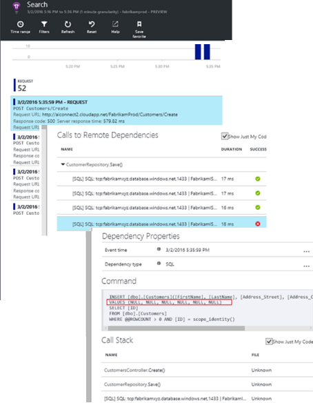

# Az Application Insights a DevOps áttekintése

A [Application Insights](app-insights-overview.md), azt gyorsan megtudhatja, hogyan működik-e az alkalmazást, és ha az élő használatban. Ha probléma van, lehetővé teszi azt, segítséget nyújt hello hatás mérje fel, és megkönnyíti annak meghatározását hello OK ismernie.

Íme egy házon belül fejlesztett alkalmazásokra webalkalmazások csoport fiókját:

* *"Nappal ezelőtt, néhány helyeztünk üzembe egy"kisebb"gyorsjavítás. Jelenleg nem futott a széles körű tesztelési fázisban, de sajnos néhány váratlan módosítási kapott hello hasznos hello első és hátsó végpontok közötti inkompatibilitás, amely egyesíti. Azonnal megnövekedett kivételek, a riasztás következik be, és azt is értesülnek hello helyzet. Azonnal a hello Application Insights portálon mindössze néhány kattintással azt elegendő információt kapott azonosítóértékeket kivétel callstacks toonarrow hello probléma le. A Microsoft szolgáltatás-profilazonosítóval azonnal, és korlátozott hello kárt. Az Application Insights által végrehajtott ezen része hello devops ciklus nagyon egyszerűen és végrehajthatóként."*

Ebben a cikkben azt kövesse, amely házon belül fejlesztett alkalmazásokra hello Fabrikam bankban csoport online banki hogyan használják a rendszer (OBS) toosee Application Insights tooquickly toocustomers válaszol és frissítéseket.  

hello team írja le a következő ábra hello DevOps ciklusban működik:

A fejlesztési (feladatlista) várakozó fájlok a hírcsatorna követelményeinek. Használhatók rövid sprints, amivel gyakran működő szoftverek – általában hello formában kidolgozott fejlesztéseit és bővítmények toohello meglévő alkalmazás. hello élő app gyakran frissül új szolgáltatásokkal. Habár élő, hello team figyeli a teljesítmény- és használati Application Insights hello segítségével. Az APM-adatok hírcsatornák újra üzembe a fejlesztési várakozó fájlok számát.

hello csapat az Application Insights toomonitor hello élő webalkalmazását szorosan használja:

* Teljesítmény. Szeretnék toounderstand hogyan válaszidők eltérő kérelem Count; milyen mértékű CPU, a hálózati, a lemez és az egyéb erőforrások használják; és hol vannak a hello szűk keresztmetszeteket.
* Hibák. Ha nincsenek kivételek sikertelen kérelmek, vagy ha a teljesítményszámláló az kényelmes tartományon kívüli kerül, hello team igények tooknow gyorsan, hogy azok hajthat végre műveleteket.
* Használat. A kiadott új funkciója, hello team szeretné, hogy a rendszer tooknow toowhat mértékben, és hogy felhasználók bármilyen nehézségbe vele.

Most összpontosítani hello visszajelzés részét hello ciklus:

## Gyenge rendelkezésre állás észlelése
Marcela Markova hello OBS csapat vezető fejlesztő, és online teljesítmény figyeléséről hello átfutási vesz igénybe. Állítja be több [rendelkezésreállás figyelésére szolgáló tesztek](app-insights-monitor-web-app-availability.md):

* Fő kezdőlapjának hello hello alkalmazást, és egyetlen-URL-cím vizsgálata http://fabrikambank.com/onlinebanking/. 200-as HTTP-kód és a szöveges feltételeinek állítja "Üdvözöljük!". Ha a teszt sikertelen, nincs kódjával súlyosan hello hálózattal vagy hello kiszolgálók vagy lehet, hogy egy központi telepítési probléma. (Vagy valaki módosította hello Üdvözöljük! üzenet hello oldalon nem saját megkaphat.)
* Egy mélyebb többlépéses teszteket, amelyek jelentkezik be, és lekérdezi a jelenlegi fiókot listázása, minden oldalon néhány kulcs adatait ellenőrzése. Ez a vizsgálat ellenőrzi, hogy működik-e, hogy hello hivatkozás toohello adatbázist. Egy fiktív felhasználói azonosítót használja: néhány őket a tesztelési célokra megmaradjanak.

Állítsa be ezeket a teszteket Marcela bizonyos abban, hogy hello team gyorsan tudni bármely kimaradás esetén.  

Hibák a hello webes teszt diagramon piros pont jelenik meg:

De ennél is fontosabb, a hibával kapcsolatos riasztást az e-mailben toohello fejlesztői csapat. Ilyen módon tudják kapcsolatos előtt szinte minden hello ügyfelek.

## Teljesítmény figyelése
Nincs a különböző megjelenítő diagram hello áttekintése lapon az Application Insightsban [metrikák kulcs](app-insights-web-monitor-performance.md).

Böngésző lapbetöltési ideje közvetlenül weblapokhoz küldött telemetriai származik. Kiszolgáló válaszideje, a helykiszolgáló kérelem száma és a sikertelen kérelmek száma az összes mért hello webkiszolgálón és tooApplication Insights onnan küldött.

Marcela némileg érintett hello kiszolgálói válasz Graph. Ez a grafikon azt ábrázolja, hello amikor hello kiszolgáló HTTP-kérést kap a felhasználó böngészőben, és ha adja vissza, hello válasz közötti átlagos idő. Mivel változik a terhelés hello rendszer szokatlan toosee változást, ez a diagram nem. Azonban ebben az esetben úgy tűnik, egy kis emelkedést hello számot kéréseket, és nagy közötti összefüggést toobe hello válaszidőt nő. Amelyek oka lehet, hogy működik-e hello rendszer csak a teljes kapacitásukkal működjenek.

Ezzel megnyitja hello kiszolgálók diagramok:

Úgy tűnik, toobe nincs bejelentkezési az erőforrás-korlátozás van, úgy, hogy esetleg hello egyenetlenségek hello kiszolgálói válasz diagramokban csak egybeesés.

## Állítson be riasztásokat toomeet célok
Ettől függetlenül ő szeretné tookeep követheti a hello válaszidejét. Ha ezek túl magas, azonnal szeretné tooknow információt.

Úgy állítja egy [riasztás](app-insights-metrics-explorer.md), a nagyobb, mint egy tipikus küszöbérték válaszidejét. Ez biztosítja, hogy az vetett bizalmat egyenként kell tudnia: azt, ha lassú a válaszidők.

Riasztások széles körét más metrikákkal állítható be. Például e-mailt kap, ha hello kivétel számának túlságosan megnő, vagy a rendelkezésre álló memória hello kerül alacsony, vagy ha nincs csúcsot ügyfélkéréseket.

## Az intelligens észlelési riasztásokat tájékozott
Másnap, figyelmeztető e-mailt az Application Insights érkeznek. De amikor megnyitja azt, hogy ő hello válasz idő riasztást, amely futtatásakor nem talál. Ehelyett, amelyből megtudja, hirtelen megnövekedhet a sikertelen kérelmek – Ez azt jelenti, hogy vissza kellett volna hibát kódok legalább 500 kérelmek történt.

Sikertelen kérelmek, ahol a felhasználók láthatta hiba – általában a következő hello kód kivételt. Lehet, hogy azok tekintse meg az üzenet jelenik meg "Sajnos nem sikerült frissíteni az adatait most." Vagy abszolút kínos legrosszabb egy Veremkiíratás hello felhasználói képernyőn hello webkiszolgáló megjelenik.

Ez a riasztás nyújtható, oka hello ő nézett, hello legutóbbi kérelem sikertelen volt encouragingly alacsony. Kis számú hiba a kiszolgáló foglaltsága a várt toobe.

Is volt rá, hogy a nyújtható bit mert ő nem volt tooconfigure ezt a riasztást. Az Application Insights intelligens észlelési tartalmazza. Tooyour app szokásos hiba mintát és egy adott oldalon, illetve nagy terhelés, vagy csatolt tooother metrikák "lekérdezi használt" hibák automatikusan igazodni. Riasztást hello riasztás csak akkor, ha van egy megnövekedhet a fent, amit a rendszergazda tooexpect származik.

Ez a nagyon hasznos e-mailt. Azt nem csak emelni egy riasztás. Túl sok hello osztályozás és diagnosztikai munkahelyi létezik.

Azt jeleníti meg, hány ügyfelet érintenének, és melyik weblap vagy a műveletek. Marcela eldöntheti, hogy elemzőnek szüksége van az tooget hello teljes csoport egy tűz részletezési, itt dolgozik, vagy e mellőzhető amíg jövő héten.

hello e-mail is mutatja, hogy egy adott kivétel történt, és - még akkor is érdekesebb - adott hello hiba társítva indított sikertelen hívások tooa adott adatbázist. Ebben a részben miért hello tartalék hirtelen megjelent annak ellenére, hogy Marcela tartozó csoport nem vezette nemrég frissítéseket.

Marcella ping-üzenetek hello vezető hello adatbázis csoport alapján az e-mailt. Ő megtanulja, hogy azok megjelent-e a gyorsjavítás hello az elmúlt mint fél óráig; és sajnos lehet, hogy előfordulhat, hogy történtek egy kisebb séma módosítása...

Ezért hello probléma hello módon toobeing rögzített azelőtt naplók vizsgálja, és az eredő 15 percen belül van. Azonban a Marcela hello hivatkozás tooopen Application Insights kattint. Ekkor megnyílik egy sikertelen kérelmek alakzatot rögtön, és áttekinthetők a adatbázis hello társított lista a függőségi hívások a hívás sikertelen.

## Kivételek észlelése
A telepítő csak egy kis [kivételek](app-insights-asp-net-exceptions.md) jelentett tooApplication Insights automatikusan. Akkor is rögzíthetők explicit módon hívások túl beszúrásával[TrackException()](app-insights-api-custom-events-metrics.md#trackexception) a hello kódra:  

    var telemetry = new TelemetryClient();
    ...
    try
    { ...
    }
    catch (Exception ex)
    {
       // Set up some properties:
       var properties = new Dictionary <string, string>
         {{"Game", currentGame.Name}};

       var measurements = new Dictionary <string, double>
         {{"Users", currentGame.Users.Count}};

       // Send hello exception telemetry:
       telemetry.TrackException(ex, properties, measurements);
    }

hello Fabrikam banki team kialakulásának hello gyakorlat mindig elküldi a kivételt, telemetriai adatokat, kivéve, ha egy nyilvánvaló helyreállítási.  

Stratégiai valójában még szélesebb körű, mint: azok a telemetriai adatokat küldhet a minden esetben, ha hello ügyfél hiúsuljon a mi végrehajthat toodo, hogy tooan kivétel fordult elő a hello kód megfelel-e. Például ha hello külső közötti banki átviteli rendszer működési valamiért (nincs hello ügyfél hibája) adja vissza egy "nem tudja végrehajtani ezt a tranzakciót" üzenet, majd azok nyomon követheti, hogy esemény.

    var successCode = AttemptTransfer(transferAmount, ...);
    if (successCode < 0)
    {
       var properties = new Dictionary <string, string>
            {{ "Code", returnCode, ... }};
       var measurements = new Dictionary <string, double>
         {{"Value", transferAmount}};
       telemetry.TrackEvent("transfer failed", properties, measurements);
    }

TrackException nem használt tooreport kivételek, mert egy hello verem példányát küldi. TrackEvent van használt tooreport az eseményeket. Minden tulajdonság, akkor lehet hasznos diagnosztikai csatolható.

Kivételeket és eseményeket jelenik meg hello [diagnosztikai keresési](app-insights-diagnostic-search.md) panelen. Elemezze toosee hello további tulajdonságok őket, és Veremkiíratás.

## Proaktív figyelésére
Marcela nem csupán elhelyezkedik körül riasztások vár. Hamarosan minden újratelepítés után azt veszi egy pillantást [válaszidők](app-insights-web-monitor-performance.md) - mindkét hello átfogó. ábra, és megjeleníti a leglassabb kérelmeket, valamint kivétel hello tábla.  

Ő felmérheti minden üzembe helyezés hello teljesítményre gyakorolt hatás általában összehasonlításával utolsó hello a minden héten. Ha hirtelen romlani, hogy riasztást, amely hello vonatkozó fejlesztőkkel.

## Osztályozás problémák
-Hello súlyossági és a probléma mértékének felmérése - osztályozás lépése hello első észlelése után. Kell igazolnia hívásához hello team éjfélkor? Vagy az maradhatnak, amíg hello következő kényelmes résnek hello hátralékos? Nincsenek az osztályozás kulcsfontosságú kérdésekre.

Milyen gyakran történik az? hello diagramok hello áttekintése panelen adjon perspektíva tooa kapcsolatos problémára. Például hello Fabrikam alkalmazást hoz létre a négy webes teszt riasztások egy éjszakai. Hello diagram megnézi a hello reggel, hello team bemutatásához, hogy történtek-e valóban egy piros pont továbbra is a legtöbb hello tesztek zöld mintha. Állapotkategóriák vizsgálatát az hello elérhetőségi diagram, világossá vált, hogy az összes ilyen időszakos probléma van egy teszt helyről. Nyilvánvalóan csak egy útvonal érintő hálózati hiba történt, és akkor nagy valószínűséggel törölje magát.  

Ezzel szemben egy drámai és állandó megnövekedhet a kivételek száma vagy válaszidők hello graph nyilvánvalóan toopanic kapcsolatban.

A hasznos osztályozás tactic próbálja azt saját maga. Ha hello ugyanazon probléma tudja, hogy azt valós.

Érintett felhasználók milyen hányada? a nyers válasz tooobtain hello hibaaránya nullával hello munkamenetek száma.

Ha lassú válaszokat, hasonlítsa össze a leglassabb válaszol kérelmek hello tábla hello használati gyakorisággal minden lapon.

Mennyire fontos a blokkolt hello forgatókönyv? Ha blokkolja egy adott felhasználó szövegegység funkcionális problémák, nem számít, hogy sokkal? Ha az ügyfelek nem kell fizetnie a váltók, akkor ez az súlyos; Ha nem módosíthatják a képernyő szín preferenciáik, lehet, hogy azt várja meg, amíg. hello hello esemény vagy a kivétel részletei vagy hello lassúlap hello identitását, megtudhatja, ahol az ügyfelek problémát tapasztal.

## Eseményadatokat
Nincs elég hello ugyanaz, mint a hibakeresési elemzés céljából. Nyomkövetés hello kód megkezdése előtt kell-e egy durva meghatározni, hogy miért, hol és mikor hello probléma jelentkezett.

**Ha nem ez történik?**  hello ügyfélállapotainak hello esemény és metrika diagramok által biztosított teszi a lehetséges okok könnyen toocorrelate hatást. Ha a válasz ideje vagy kivétel díjszabás időszakos csúcsait, nézze meg hello kérelmek száma: Ha azt csúcsaira, hello azonos idő, akkor egy erőforrás probléma úgy tűnik. Tooassign több Processzort vagy memóriát kell? Vagy nem tudja kezelni a hello terhelés függőséget?

**Ez velünk?**  Ha hirtelen csökken tartalmaz – például amikor hello ügyfél szeretne egy fiókot utasítás - kérelem egy bizonyos típusú teljesítményének akkor lehetséges, a webes alkalmazás helyett egy külső alrendszer lehet. A Metrikaböngészőben válassza ki a hello függőségi hiba sebesség és a függőségi időtartama díjszabás, és hasonlítsa össze az alábbi előzményeinek néhány óráig vagy napig hello problémát észlelt, a korábbi hello keresztül. Módosítások vannak adatok, ha egy külső alrendszer tooblame lehet.  

Bizonyos lassú függőségi problémák a földrajzi hely meghatározásának problémák. Fabrikam banki Azure virtuális gépek használ, és, hogy azok kellett véletlenül található a webkiszolgáló és a fiók-kiszolgáló a különböző országokban felderített. Egy drámai fokozása áttelepítésével újra közül.

**Mi volt végezzük?** Ha probléma hello nem jelenik meg a függőség toobe, és azt nem mindig van, az oka valószínűleg a legutóbbi változás. hello hello metrika és az esemény diagramok által biztosított korábbi perspektíva teszi, hogy könnyen toocorrelate telepítésekkel rendelkező hirtelen módosításokat. Amely típusra van szűkítve hello keresési hello probléma le.

**mi történik?** Egyes problémák csak ritkán fordul elő, és nehéz tootrack le kapcsolat nélküli környezetben végzett teszteléséhez. Tootry toocapture hello hiba összes tehetünk ennek akkor, ha a működés közbeni következik be. Hello verem memóriaképek kivétel jelentésekben vizsgálhatja meg. Ezenkívül írhat nyomkövetés hívások, a kedvenc naplózási keretrendszer vagy TrackTrace() vagy a trackevent() függvény.  

Fabrikam közötti fiók átvitelek, de csak bizonyos fióktípusok probléma volt. toounderstand jobb mi zajlik, azok TrackTrace() hívások szúrja be hello kód hello fióktípus tulajdonság tooeach hívásként csatlakoztatása kulcsfontosságú pontjain. Amely teszik ki csak a megadott nyomkövetési adatokat könnyen toofilter diagnosztikai keresési. Akkor is kapcsolt paraméterértékek tulajdonságait és a mértékek toohello nyomkövetési hívások.

## Válaszoljon toodiscovered problémák
Miután hello problémát már felderítette, hogy egy terv toofix azt. Lehet, hogy tooroll vissza a legutóbbi változás, lehet, hogy akkor is csak vagy abbahagyja megjavítani van szüksége. Ha hello javítás végzett, az Application Insights megtudhatja, hogy sikeres.  

Fabrikam banki fejlesztői csapat érvénybe strukturáltabb megközelítés tooperformance mérték, mint az általa használt Application Insights toobefore használni őket.

* Ezek célkitűzéseket teljesítmény adott intézkedések hello Application Insights – Áttekintés lapon.
* Azokat a teljesítmény mérőszámai tervezése hello alkalmazásba hello indítás, például a hello metrikák mérő felhasználói végrehajtási "tölcsérek."  

## A figyelő felhasználói tevékenység
Amikor válaszidő következetesen helyes, és néhány kivételtől eltekintve, hello fejlesztői csoport toousability lehet helyezni. Hogyan tooimprove hello felhasználói élményt, és hogyan tooencourage további felhasználók tooachieve hello szükséges gondolja is célokat.

Az Application Insights használt toolearn a felhasználók milyen elvégezni a segítségével egy alkalmazás is lehet. Ha zökkenőmentesen fut, hello team szeretné tooknow mely funkciók érhetők hello legnépszerűbb, mi felhasználók például vagy egy tudnak, és milyen gyakran lépnek vissza kell. Amelyekkel azokat a jövőbeli munkahelyi rangsorolására. És hello fejlesztési ciklus részeként toomeasure hello sikeres egyes szolgáltatások tudják tervezni. 

Például egy jellemző felhasználói út hello webhelyen keresztül rendelkezik egy törölje a jelet "a tölcsér." Sok ügyfél hello ütemben kölcsön különböző típusú hely. Kevesebb folytassa toofill hello idézőjelek formában. Néhány, aki ajánlat beolvasni, lépjen tovább, és vegye ki hello kölcsön.

Figyelembe véve, ahol hello legnagyobb számú ügyfél eldobni, hello üzleti ki hogyan tooget keresztül toohello alsó részén hello több felhasználó tölcsér is működik. Bizonyos esetekben előfordulhat, hogy a felhasználói élmény (UX) hiba történt – például hello "Tovább" gombra a rögzített toofind, vagy hello utasítások nem egyértelmű. Valószínűleg több oka is lehet jelentősebb üzleti az vetett elemek: lehet, hogy hello kölcsön túl magas.

Bármilyen hello okból hello adatok segítenek hello team kidolgozására a felhasználók tevékenységeit. További követési hívások lehet beszúrni, toowork további információkhoz juthat el. A trackevent() függvény lehet használt toocount bármely felhasználói műveletek, a hello nagy részletességgel az egyes gombra kattint, például ki kölcsön fizető toosignificant eredmények.

hello team használt toohaving információ a felhasználói tevékenység kezd. Napjainkban azok kialakítása új funkciója, amikor azok kidolgozására hogyan fogja használni a használatát visszajelzést. Ezek kialakítási hello szolgáltatást a hello start követési hívásakor. Minden fejlesztési ciklus hello visszajelzés tooimprove hello szolgáltatás használata.

[További információk használatának követéséről](app-insights-usage-overview.md).

## Hello DevOps ciklus alkalmazása
Ezért ez egy csoport használja az Application Insights nem csak toofix személy állít ki, de tooimprove a fejlesztési életciklus során. Az adott Önnek hogyan Application Insights segíthetnek az Alkalmazáskezelés teljesítmény saját alkalmazásaiban ötleteket kívánom I.

## Videó

> [!VIDEO https://channel9.msdn.com/events/Connect/2016/112/player]

## Következő lépések
Ismerkedés a több ajtózárat, attól függően, hogy az alkalmazás hello jellemzői. Válassza ki, milyen legmegfelelőbb beállítást:

* [ASP.NET-webalkalmazás](app-insights-asp-net.md)
* [Java-webalkalmazás](app-insights-java-get-started.md)
* [NODE.js-webalkalmazás](app-insights-nodejs.md)
* Már telepített alkalmazásokat, üzemeltetett [IIS](app-insights-monitor-web-app-availability.md), [J2EE](app-insights-java-live.md), vagy [Azure](app-insights-azure.md).
* [Weblapok](app-insights-javascript.md) -egyetlen oldal alkalmazást vagy szokásos weblap - használja ezt a saját vagy hozzáadása tooany hello közül.
* [Rendelkezésreállás figyelésére szolgáló tesztek](app-insights-monitor-web-app-availability.md) tootest az alkalmazását hello nyilvános internethez.
