# Mi az Application Insights?What is Application Insights?
Az Application Insights egy bővíthető és több platformon működő alkalmazásteljesítmény-felügyeleti (APM) szolgáltatás webfejlesztőknek.Application Insights is an extensible Application Performance Management (APM) service for web developers on multiple platforms. Ezzel toomonitor élő webalkalmazásokat.Use it toomonitor your live web application. Automatikusan felismeri a teljesítményanomáliákat.It will automatically detect performance anomalies. Ez magában foglalja a hatékony analytics eszközök toohelp problémákat és a felhasználók számára ténylegesen elvégezni az alkalmazás toounderstand diagnosztizálásához.It includes powerful analytics tools toohelp you diagnose issues and toounderstand what users actually do with your app.  Úgy van kialakítva, hogy folyamatosan teljesítményük és használhatóságuk javításában toohelp.It's designed toohelp you continuously improve  performance and usability. Az alkalmazások működését platformokon, beleértve a .NET, Node.js és J2EE számos, a helyben tárolt vagy hello felhőben.It works for apps on a wide variety of platforms including .NET, Node.js and J2EE, hosted on-premises or in hello cloud. Integrálható a devOps folyamat, és a csatlakozási pontok tooa különböző Fejlesztőeszközök rendelkezik.It  integrates with your devOps process, and has connection points tooa variety of development tools.

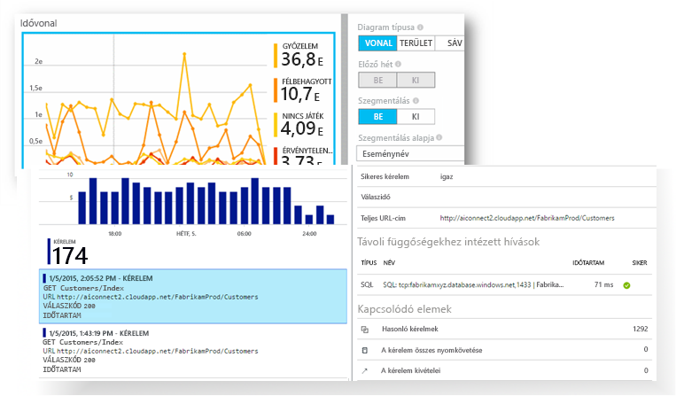

[Vessen egy pillantást hello bevezetés animáció](https://www.youtube.com/watch?v=fX2NtGrh-Y0).[Take a look at hello intro animation](https://www.youtube.com/watch?v=fX2NtGrh-Y0).

## Hogyan működik az Application Insights?How does Application Insights work?
Kis instrumentation csomag telepítése az alkalmazásban, és állítsa be az Application Insights-erőforrás hello Microsoft Azure-portálon.You install a small instrumentation package in your application, and set up an Application Insights resource in hello Microsoft Azure portal. hello instrumentation figyeli az alkalmazást, és elküldi a telemetriai adatok toohello portálon.hello instrumentation monitors your app and sends telemetry data toohello portal. (hello alkalmazások bárhol futhatnak - nem rendelkezik Azure-ban üzemeltetett toobe.)(hello application can run anywhere - it doesn't have toobe hosted in Azure.)

Nem csak hello webszolgáltatási alkalmazás, de bármely háttér összetevőket is beállíthatják, és JavaScript hello maguk hello weblapokon.You can instrument not only hello web service application, but also any background components, and hello JavaScript in hello web pages themselves. 

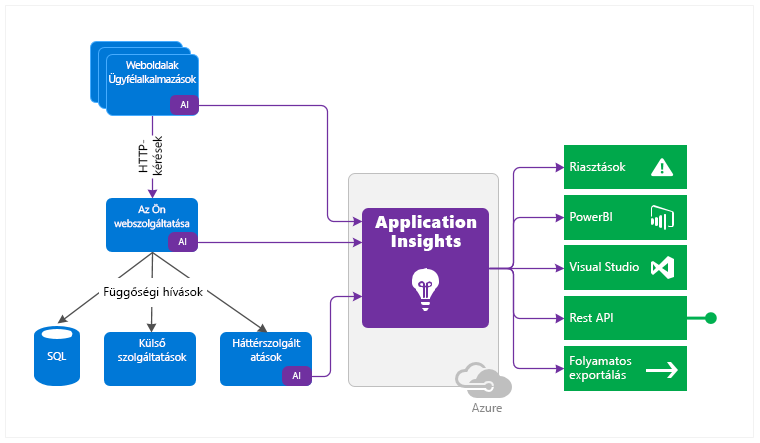

Ezenkívül Ön lekéréses a telemetriai adatok, például teljesítményszámlálók, az Azure diagnostics vagy Docker naplók hello állomás környezetből.In addition, you can pull in telemetry from hello host environments such as performance counters, Azure diagnostics, or Docker logs. Webes tesztjeinek használatát, amely rendszeresen küld szintetikus kérelmek tooyour webszolgáltatás is állíthat be.You can also set up web tests that periodically send synthetic requests tooyour web service.

Az összes telemetriai adatokat ezekbe az adatfolyamokba integrálva vannak az Azure-portálon, ahol tanúsítványszűrést alkalmazhat hatékony hello elemzési és keresési eszközök toohello nyers adatok.All these telemetry streams are integrated in hello Azure portal, where you can apply powerful analytic and search tools toohello raw data.

### Mi az a hello terhelés?What's hello overhead?
hello gyakorolt hatása az alkalmazás nem nagyon nagy.hello impact on your app's performance is very small. A nem blokkoló nyomkövetési hívásokat a rendszer kötegeli, és a küldés külön szálakon történik.Tracking calls are non-blocking, and are batched and sent in a separate thread.

## Mit figyel az Application Insights?What does Application Insights monitor?

Az Application Insights hello fejlesztőcsoportunk, hogy tudomásul veszi, hogyan működik-e az alkalmazást, és hogyan használatos toohelp célja.Application Insights is aimed at hello development team, toohelp you understand how your app is performing and how it's being used. A szolgáltatás az alábbiakat figyeli:It monitors:

* **Kérések sebessége, válaszidők és hibaarányok** – megtudhatja, hogy mely lapok, mely napszakokban a legnépszerűbbek, és hol találhatók a felhasználók.**Request rates, response times, and failure rates** - Find out which pages are most popular, at what times of day, and where your users are. Megtekintheti, hogy mely lapok teljesítenek a legjobban.See which pages perform best. Ha több kérés esetén a válaszidők és a hibaarányok értéke megnő, valószínűleg erőforrás-gazdálkodási hibáról van szó.If your response times and failure rates go high when there are more requests, then perhaps you have a resourcing problem. 
* **Függőségi értékek, válaszidők és hibaarányok** – megtudhatja, hogy mely külső szolgáltatások okoznak lassulást.**Dependency rates, response times, and failure rates** - Find out whether external services are slowing you down.
* **Kivételek** - elemzése hello összesített statisztikák, vagy válasszon olyan specifikus példányai, és elemezze hello veremkiíratási adataival és a kapcsolódó kérések.**Exceptions** - Analyse hello aggregated statistics, or pick specific instances and drill into hello stack trace and related requests. A kiszolgálói és a böngészői kivételekről egyaránt készül jelentés.Both server and browser exceptions are reported.
* **Lapmegtekintések és betöltési teljesítmény** – a felhasználói böngészők jelentése alapján készül.**Page views and load performance** - reported by your users' browsers.
* Weblapokról származó **AJAX-hívások** – értékek, válaszidők és hibaarányok.**AJAX calls** from web pages - rates, response times, and failure rates.
* **Felhasználók és munkamenetek száma**.**User and session counts**.
* Windows vagy Linux rendszerű kiszolgálói gépekről származó **teljesítményszámlálók**, például processzor-, memória- és hálózathasználat.**Performance counters** from your Windows or Linux server machines, such as CPU, memory, and network usage. 
* Dockerből vagy Azure-ból származó **gazdadiagnosztika**.**Host diagnostics** from Docker or Azure. 
* Alkalmazásból származó **nyomkövetési naplók diagnosztikája** – megállapíthatja a nyomkövetési események és a kérések korrelációját.**Diagnostic trace logs** from your app - so that you can correlate trace events with requests.
* **Egyéni események és metrikák** hogy írni saját kezűleg hello ügyfél vagy kiszolgáló-kódban, tootrack üzleti események például elemek értékesített vagy megnyert játékok.**Custom events and metrics** that you write yourself in hello client or server code, tootrack business events such as items sold or games won.

## Hol láthatók a telemetriai adatok?Where do I see my telemetry?

Nincsenek bőven módon tooexplore adatait.There are plenty of ways tooexplore your data. Olvassa el az alábbi cikkeket:Check out these articles:

|  |  |
| --- | --- |
| [**Intelligens észlelés és manuális riasztások****Smart detection and manual alerts**](app-insights-proactive-diagnostics.md) Riasztások automatikus igazítja tooyour alkalmazás normál mintákat keressen az eseményindító és telemetriai adatokat, amikor szükség van kívül hello szokásos mintát.Automatic alerts adapt tooyour app's normal patterns of telemetry and trigger when there's something outside hello usual pattern. [Riasztásokat is beállíthat](app-insights-alerts.md) egyéni vagy Standard mérőszámok adott szintjeire.You can also [set alerts](app-insights-alerts.md) on particular levels of custom or standard metrics. |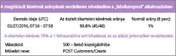 |
| [**Alkalmazástérkép****Application map**](app-insights-app-map.md) az alkalmazás metrikáit és a riasztások hello összetevői.hello components of your app, with key metrics and alerts. |  |
| [**Profilkészítő****Profiler**](app-insights-profiler.md) Vizsgálja meg a mintában szereplő kérelmek hello végrehajtási profilok.Inspect hello execution profiles of sampled requests. |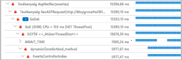 |
| [**Használatelemzés****Usage analysis**](app-insights-usage-overview.md) Felhasználószegmentálás és -megtartás elemzése.Analyze user segmentation and retention.| |
| [**Példányadatok diagnosztikai keresése****Diagnostic search for instance data**](app-insights-diagnostic-search.md) Események keresése és szűrése, például kérések, kivételek, függőségi hívások, naplókivonatok és lapmegtekintések.Search and filter events such as requests, exceptions, dependency calls, log traces, and page views.  |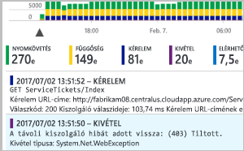 |
| [**Összesített adatok metrikaböngészője****Metrics Explorer for aggregated data**](app-insights-metrics-explorer.md) Összesített adatok – például kérés- és hibaarányok, valamint kivételek, válaszidők és lapbetöltési idők – böngészése, szűrése és szegmentálása.Explore, filter, and segment aggregated data such as rates of requests, failures, and exceptions; response times, page load times. | |
| [**Irányítópultok****Dashboards**](app-insights-dashboards.md#dashboards) Különböző erőforrásokból származó adatokat fűzhet össze és oszthat meg másokkal.Mash up data from multiple resources and share with others. Nagy több összetevőt alkalmazások, valamint a folyamatos megjelenítési hello team helyiségben.Great for multi-component applications, and for continuous display in hello team room. | |
| [**Élő metrikastream****Live Metrics Stream**](app-insights-live-stream.md) Amikor telepít egy új buildverziót, tekintse meg a közel valós idejű teljesítmény mutatók toomake meg arról, hogy minden megfelelően működik-e.When you deploy a new build, watch these near-real-time performance indicators toomake sure everything works as expected. |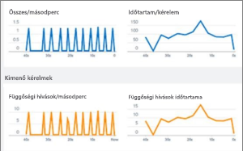 |
| [**Elemzés****Analytics**](app-insights-analytics.md) A hatékony lekérdezési nyelvnek köszönhetően válaszokat kaphat az alkalmazás teljesítményére és használatára vonatkozó legégetőbb kérdésekre.Answer tough questions about your app's performance and usage by using this powerful query language. |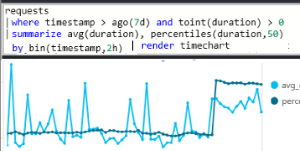 |
| [**Visual Studio****Visual Studio**](app-insights-visual-studio.md) Lásd: teljesítményadatokat hello kódban.See performance data in hello code. Nyissa meg a toocode híváslánc megjelenik az.Go toocode from stack traces.|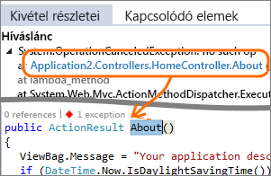 |
| [**Pillanatkép-hibakereső****Snapshot debugger**](app-insights-snapshot-debugger.md) A működés közbeni műveletekről készült pillanatképek hibakeresése paraméterértékekkel.Debug snapshots sampled from live operations, with parameter values.|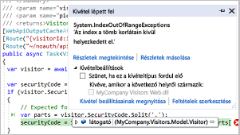 |
| [**Power BI****Power BI**](app-insights-export-power-bi.md) Integrálhatja a használati metrikákat más üzleti intelligenciával.Integrate usage metrics with other business intelligence.| 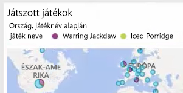|
| [**REST API****REST API**](https://dev.applicationinsights.io/) Írhat kódot toorun lekérdezések a metrikák és a nyers adatok.Write code toorun queries over your metrics and raw data.|  |
| [**Folyamatos exportálás****Continuous export**](app-insights-export-telemetry.md) Nyers adatok toostorage, amint megérkeznek tömeges exportálása.Bulk export of raw data toostorage as soon as it arrives. |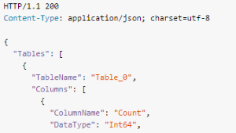 |

## Hogyan használható az Application Insights?How do I use Application Insights?

### FigyelésMonitor
Telepítse az Application Insightsot az alkalmazásba, állítsa be a [rendelkezésre állási webes teszteket](app-insights-monitor-web-app-availability.md), és az alábbiakra nyílik lehetőség:Install Application Insights in your app, set up [availability web tests](app-insights-monitor-web-app-availability.md), and:

* Állítson be egy [irányítópult](app-insights-dashboards.md) a csapat hely tookeep követheti a terhelés, válaszidejét és a függőségek hello teljesítményét egy, a lapon a terhelés és AJAX-hívások.Set up a [dashboard](app-insights-dashboards.md) for your team room tookeep an eye on load, responsiveness, and hello performance of your dependencies, page loads, and AJAX calls.
* Fedezze fel leglassabb hello és a legtöbb sikertelen kérelem.Discover which are hello slowest and most failing requests.
* A Watch [élő adatfolyam](app-insights-live-stream.md) új kiadását, azonnal kapcsolatos romlását tooknow telepítésekor.Watch [Live Stream](app-insights-live-stream.md) when you deploy a new release, tooknow immediately about any degradation.

### Észlelés, diagnosztizálásDetect, Diagnose
Riasztások fogadásakor vagy problémák észlelésekor:When you receive an alert or discover a problem:

* Felmérheti, hogy hány felhasználó érintett.Assess how many users are affected.
* Elvégezheti a kivételek, a függőségi hívások és a nyomkövetési adatok korrelációját.Correlate failures with exceptions, dependency calls and traces.
* A profilkészítő, a pillanatképek, a veremkiíratások és a nyomkövetési naplók vizsgálata.Examine profiler, snapshots, stack dumps, and trace logs.

### Fejlesztés, mérés, tapasztalatszerzésBuild, Measure, Learn
[Hello hatékonyságának mérésére](app-insights-usage-overview.md) egyes új szolgáltatások telepítése.[Measure hello effectiveness](app-insights-usage-overview.md) of each new feature that you deploy.

* Tervezze meg toomeasure hogy az ügyfelek hogyan használják az új UX vagy üzleti szolgáltatásokat.Plan toomeasure how customers use new UX or business features.
* Egyéni telemetriai adatokat vehet fel a kódba.Write custom telemetry into your code.
* Alapszintű hello következő fejlesztési ciklus a rögzített bizonyító adatok a a telemetriai adatokból.Base hello next development cycle on hard evidence from your telemetry.

## BevezetésGet started
Az Application Insights a Microsoft Azure és a telemetriai adatok gazdája számos szolgáltatás nem továbbítja a elemzés és bemutató hello egyike.Application Insights is one of hello many services hosted within Microsoft Azure, and telemetry is sent there for analysis and presentation. Így ahhoz, hogy bármi más, szüksége lesz egy előfizetés túl[Microsoft Azure](http://azure.com).So before you do anything else, you'll need a subscription too[Microsoft Azure](http://azure.com). Az ingyenes toosign működik-e, és ha úgy dönt, alapszintű hello [terv árképzési](https://azure.microsoft.com/pricing/details/application-insights/) az Application Insights használata díjmentes mindaddig, amíg az alkalmazás toohave jelentős használati nőtt.It's free toosign up, and if you choose hello basic [pricing plan](https://azure.microsoft.com/pricing/details/application-insights/) of Application Insights, there's no charge until your application has grown toohave substantial usage. Ha a szervezet már rendelkezik előfizetéssel, akkor hozzáadhatja a Microsoft-fiók tooit.If your organization already has a subscription, they could add your Microsoft account tooit.

Számos módon tooget elindult.There are several ways tooget started. Kezdje azzal, amelyik Önnek a legmegfelelőbb.Begin with whichever works best for you. Később hello mások is hozzáadhat.You can add hello others later.

* **At futásidejű: állíthatnak be a webalkalmazás hello kiszolgálón.****At run time: instrument your web app on hello server.** Ezzel elkerülheti a frissítési toohello kódja.Avoids any update toohello code. Rendszergazdai hozzáférés tooyour kiszolgálóra van szükség.You need admin access tooyour server.
  * [**IIS a helyszínen vagy egy virtuális gépen****IIS on-premises or on a VM**](app-insights-monitor-performance-live-website-now.md)
  * [**Azure-webalkalmazás vagy virtuális gép****Azure web app or VM**](app-insights-monitor-performance-live-website-now.md)
  * [**J2EE****J2EE**](app-insights-java-live.md)
* **Fejlesztési időpontban: vegye fel az Application Insights tooyour kódot.****At development time: add Application Insights tooyour code.** Lehetővé teszi a toowrite egyéni telemetria és tooinstrument háttér- és asztali alkalmazások.Allows you toowrite custom telemetry and tooinstrument back-end and desktop apps.
  * [Visual Studio](app-insights-asp-net.md) 2013 2. frissítés vagy újabb.[Visual Studio](app-insights-asp-net.md) 2013 update 2 or later.
  * Java és [Eclipse](app-insights-java-eclipse.md) vagy [más eszközök](app-insights-java-get-started.md)Java in [Eclipse](app-insights-java-eclipse.md) or [other tools](app-insights-java-get-started.md)
  * [Node.jsNode.js](app-insights-nodejs.md)
  * [Más platformokOther platforms](app-insights-platforms.md)
* **[Vizsgálhatja a weblapokat](app-insights-javascript.md)** lapmegtekintés, AJAX-használat és egyéb ügyféloldali telemetria tekintetében.**[Instrument your web pages](app-insights-javascript.md)** for page view, AJAX and other client-side telemetry.
* **[Rendelkezésre állási tesztek](app-insights-monitor-web-app-availability.md)** – rendszeresen pingelheti webhelyét kiszolgálóinkról.**[Availability tests](app-insights-monitor-web-app-availability.md)** - ping your website regularly from our servers.

## Következő lépésekNext steps
Első lépések futtatáskor:Get started at runtime with:

* [IIS-kiszolgálóIIS server](app-insights-monitor-performance-live-website-now.md)
* [J2EE-kiszolgálóJ2EE server](app-insights-java-live.md)

Első lépések fejlesztéskor:Get started at development time with:

* [ASP.NETASP.NET](app-insights-asp-net.md)
* [JavaJava](app-insights-java-get-started.md)
* [Node.jsNode.js](app-insights-nodejs.md)

## Támogatás és visszajelzésSupport and feedback
* Kérdések és problémák:Questions and Issues:
  * [Hibaelhárítás][qna][Troubleshooting][qna]
  * [MSDN-fórumMSDN Forum](https://social.msdn.microsoft.com/Forums/vstudio/home?forum=ApplicationInsights)
  * [StackOverflowStackOverflow](http://stackoverflow.com/questions/tagged/ms-application-insights)
* Javaslatok:Your suggestions:
  * [UserVoice-onUserVoice](https://visualstudio.uservoice.com/forums/357324)
* Blog:Blog:
  * [Application Insights blogApplication Insights blog](https://azure.microsoft.com/blog/tag/application-insights)

## VideókVideos

[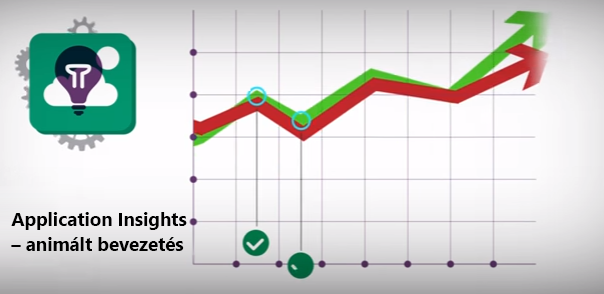](https://www.youtube.com/watch?v=fX2NtGrh-Y0)

> [!VIDEO https://channel9.msdn.com/events/Connect/2016/100/player] 

<!--Link references-->

[android]: https://github.com/Microsoft/ApplicationInsights-Android
[azure]: ../insights-perf-analytics.md
[client]: app-insights-javascript.md
[desktop]: app-insights-windows-desktop.md
[detect]: app-insights-detect-triage-diagnose.md
[greenbrown]: app-insights-asp-net.md
[ios]: https://github.com/Microsoft/ApplicationInsights-iOS
[java]: app-insights-java-get-started.md
[knowUsers]: app-insights-web-track-usage.md
[platforms]: app-insights-platforms.md
[portal]: http://portal.azure.com/
[qna]: app-insights-troubleshoot-faq.md
[redfield]: app-insights-monitor-performance-live-website-now.md
