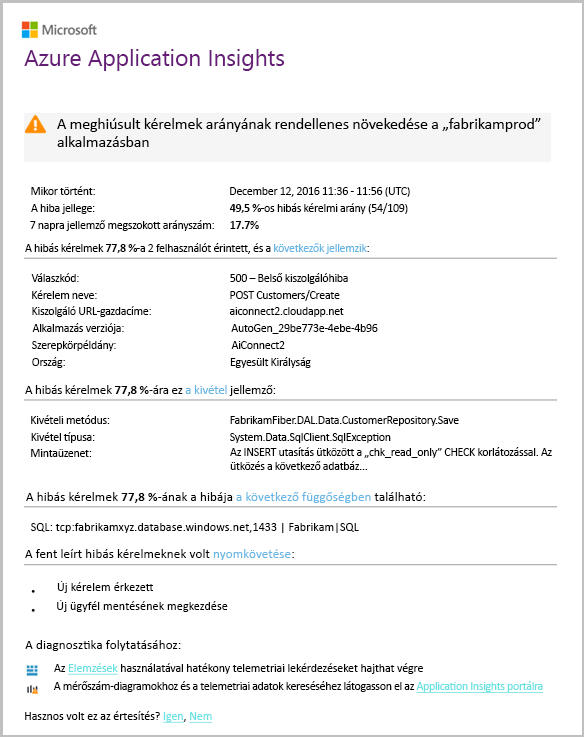

# Intelligens észlelési - hiba rendellenességek észlelésétSmart Detection - Failure Anomalies
[Az Application Insights](app-insights-overview.md) automatikusan értesíti a felhasználót közel valós idejű Ha a webalkalmazás szokatlan mértékben megnőtt a sikertelen kérelmek hello aránya.[Application Insights](app-insights-overview.md) automatically notifies you in near real time if your web app experiences an abnormal rise in hello rate of failed requests. Azt észleli, hogy egy szokatlan megnövekedhet a HTTP-kérelmek vagy sikertelenként jelentett függőségi hívások hello aránya.It detects an unusual rise in hello rate of HTTP requests or dependency calls that are reported as failed. A kéréseket a sikertelen kérelmek rendszerint rendelkező válaszkódot 400 vagy magasabb.For requests, failed requests are usually those with response codes of 400 or higher. toohelp osztályozhatja és diagnosztizálhatja hello probléma, hello jellemzői hello hibák és a kapcsolódó telemetriai adatok elemzését hello értesítési megtalálható.toohelp you triage and diagnose hello problem, an analysis of hello characteristics of hello failures and related telemetry is provided in hello notification. Van még hivatkozások toohello Application Insights portál további elemzés céljából.There are also links toohello Application Insights portal for further diagnosis. hello szolgáltatást kell nincs beállításról, sem a konfigurációban, mert gépi tanulási algoritmusok toopredict hello normál hibaaránya.hello feature needs no set-up nor configuration, as it uses machine learning algorithms toopredict hello normal failure rate.

Ez a szolgáltatás működik, Java és az ASP.NET web Apps, vagy a saját kiszolgálóit egy hello felhőben.This feature works for Java and ASP.NET web apps, hosted in hello cloud or on your own servers. Azt is működik, bármely alkalmazás, amely hoz létre a kérelem vagy függőségi telemetria - például, ha a feldolgozói szerepkör, amely behívja [TrackRequest()](app-insights-api-custom-events-metrics.md#trackrequest) vagy [TrackDependency()](app-insights-api-custom-events-metrics.md#trackdependency).It also works for any app that generates request or dependency telemetry - for example, if you have a worker role that calls [TrackRequest()](app-insights-api-custom-events-metrics.md#trackrequest) or [TrackDependency()](app-insights-api-custom-events-metrics.md#trackdependency).

Beállítása után [a projekthez az Application Insights](app-insights-overview.md), és az alkalmazás egyes minimális telemetriai adatokat állít elő, ha intelligens tegye a hiba rendellenességek észlelését tart, 24 óra toolearn hello normál az alkalmazás viselkedését, előtte bekapcsolt és riasztásokat küldhet.After setting up [Application Insights for your project](app-insights-overview.md), and provided your app generates a certain minimum amount of telemetry, Smart Detection of failure anomalies takes 24 hours toolearn hello normal behavior of your app, before it is switched on and can send alerts.

Íme egy minta riasztás.Here's a sample alert.

> [!NOTE]
> Alapértelmezés szerint egy rövidebb, mint ebben a példában formátum mail kap.By default, you get a shorter format mail than this example. Azonban úgy is [kapcsoló toothis részletes formátumban](#configure-alerts).But you can [switch toothis detailed format](#configure-alerts).
>
>

Figyelje meg, amely jelzi, hogy:Notice that it tells you:

* hello os Hibaarány, szemben toonormal alkalmazása működését.hello failure rate compared toonormal app behavior.
* Érintett felhasználók számát – így megtudhatja, hogy mekkora tooworry.How many users are affected – so you know how much tooworry.
* Hello hibák társított jellemző mintát.A characteristic pattern associated with hello failures. Ebben a példában van egy adott válaszkód, kérés neve (művelet) és az alkalmazás verziója.In this example, there’s a particular response code, request name (operation) and app version. Mely azonnal jelzi, hogy hol toostart keresése a kódban.That immediately tells you where toostart looking in your code. Egyéb lehetőségek egy megadott böngésző vagy az ügyfél operációs rendszer lehet.Other possibilities could be a specific browser or client operating system.
* hello kivétel, naplókivonatokat és függőségi hiba (adatbázisok vagy más külső összetevő) hello társított toobe megjelenő jellemző hibák.hello exception, log traces, and dependency failure (databases or other external components) that appear toobe associated with hello characterized failures.
* Az Application Insightsban hello telemetriai toorelevant keresés közvetlenül hivatkozik.Links directly toorelevant searches on hello telemetry in Application Insights.

## Intelligens észlelési előnyeiBenefits of Smart Detection
A szokványos [metrika riasztások](app-insights-alerts.md) jelzi, hogy probléma lehet.Ordinary [metric alerts](app-insights-alerts.md) tell you there might be a problem. De intelligens észlelési hello diagnosztikai megfelelőek Önnek, nagy mennyiségű hello elemzés, amelyeket egyébként külön toodo saját kezűleg végrehajtása kezdődik.But Smart Detection starts hello diagnostic work for you, performing a lot of hello analysis you would otherwise have toodo yourself. Eredményt el hello szépen csomagolása, így tooget gyorsan hello probléma toohello gyökérmappájában.You get hello results neatly packaged, helping you tooget quickly toohello root of hello problem.

## MűködésHow it works
Intelligens észlelési figyeli az alkalmazásból, és az adott hello hiba díjszabás hello telemetriai adatokat.Smart  Detection monitors hello telemetry received from your app, and in particular hello failure rates. Ez a szabály melyik hello kérelmek száma hello száma `Successful request` tulajdonság értéke HAMIS, és melyik hello hello száma függőségi hívásokat `Successful call` tulajdonság értéke "false".This rule counts hello number of requests for which hello `Successful request` property is false, and hello number of dependency calls for which hello `Successful call` property is false. A kéréseket, alapértelmezés szerint `Successful request == (resultCode < 400)` (kivéve, ha túl írt egyéni kód[szűrő](app-insights-api-filtering-sampling.md#filtering) , vagy a saját [TrackRequest](app-insights-api-custom-events-metrics.md#trackrequest) hívások).For requests, by default, `Successful request == (resultCode < 400)` (unless you have written custom code too[filter](app-insights-api-filtering-sampling.md#filtering) or generate your own [TrackRequest](app-insights-api-custom-events-metrics.md#trackrequest) calls). 

Az alkalmazás teljesítményének rendelkezik egy tipikus mintája működését.Your app’s performance has a typical pattern of behavior. Néhány kérések vagy a függőségi hívásokra lesz jobban toofailure, mint a többire; és hello általános hibaaránya előfordulhat, hogy lépjen a terhelés növekedése.Some requests or dependency calls will be more prone toofailure than others; and hello overall failure rate may go up as load increases. Intelligens észlelési használ a gépi tanulási toofind a rendellenességeket.Smart Detection uses machine learning toofind these anomalies.

Telemetriai adatokat a webalkalmazás az Application Insightsban való származik, intelligens észlelési hello jelenlegi viselkedése hello keresztül látható az elmúlt néhány nap múlva hello mintákat hasonlítja össze.As telemetry comes into Application Insights from your web app, Smart Detection compares hello current behavior with hello patterns seen over hello past few days. Ha egy szokatlan mértékben megnőtt a sikertelen korábbi teljesítmény összehasonlítva, elemzés működésbe lép.If an abnormal rise in failure rate is observed by comparison with previous performance, an analysis is triggered.

Elemzés kiváltásakor hello szolgáltatást egy fürt analysis végez hello sikertelen kérelmek, tootry tooidentify hello hibák jellemző értékek egy mintát.When an analysis is triggered, hello service performs a cluster analysis on hello failed request, tootry tooidentify a pattern of values that characterize hello failures. Hello a fenti példában a hello elemzés észlelte, hogy a legtöbb hibák készül-e egy adott eredménykódja, a kérelem neve, a kiszolgáló URL-címe gazdagépet és a szerepkör példánya.In hello example above, hello analysis has discovered that most failures are about a specific result code, request name, Server URL host, and role instance. Ezzel szemben hello analysis észlelte, hogy hello ügyfél operációs rendszer tulajdonsághoz több érték van elosztva, és ezért nem szerepel.By contrast, hello analysis has discovered that hello client operating system property is distributed over multiple values, and so it is not listed.

Ha a szolgáltatás a telemetriai adatok hívások van tagolva, hello elemző megkeresi a kivételt, és a kérelmek hello fürt állapított, együtt minden nyomkövetési napló társított azokat, például társított függőségi hiba kérelmek száma.When your service is instrumented with these telemetry calls, hello analyser looks for an exception and a dependency failure that are associated with requests in hello cluster it has identified, together with an example of any trace logs associated with those requests.

hello eredményül kapott elemzési ként legyen elküldve tooyou, riasztás, kivéve, ha nem konfigurálta.hello resulting analysis is sent tooyou as alert, unless you have configured it not to.

Például a hello [riasztást manuálisan állítsa](app-insights-alerts.md), hello riasztás hello állapotának vizsgálata, és konfigurálja az Application Insights-erőforrás hello a riasztások panelen.Like hello [alerts you set manually](app-insights-alerts.md), you can inspect hello state of hello alert and configure it in hello Alerts blade of your Application Insights resource. De egyéb értesítések eltérően nem tooset be kell, vagy intelligens észlelési konfigurálása.But unlike other alerts, you don't need tooset up or configure Smart Detection. Ha azt szeretné, tiltsa le, vagy módosítsa a cél e-mail címe.If you want, you can disable it or change its target email addresses.

## Riasztások konfigurálásaConfigure alerts
Letilthatja a intelligens észlelését, hello e-mailek címzettjeinek módosítása, a webhook létrehozása, vagy részt vevő toomore részletes üzenetek a riasztásra.You can disable Smart Detection, change hello email recipients, create a webhook, or opt in toomore detailed alert messages.

Nyissa meg a hello figyelmeztetések lapját.Open hello Alerts page. Hiba rendellenességeket megtalálható együtt minden riasztást, manuálisan van beállítva, és láthatja, hogy jelenleg hello figyelmeztetési állapotban van.Failure Anomalies is included along with any alerts that you have set manually, and you can see whether it is currently in hello alert state.

Kattintson a riasztás tooconfigure hello azt.Click hello alert tooconfigure it.

Figyelje meg, hogy az intelligens észlelési letilthatja, de nem törli (vagy hozzon létre egy újat).Notice that you can disable Smart Detection, but you can't delete it (or create another one).

#### Részletes riasztásokDetailed alerts
Ha bejelöli a "Get részletesebb diagnosztikai" hello e-mail további diagnosztikai adatokat fogja tartalmazni.If you select "Get more detailed diagnostics" then hello email will contain more diagnostic information. Egyes esetekben csak hello adatokból hello e-mailben képes toodiagnose hello probléma lesz.Sometimes you'll be able toodiagnose hello problem just from hello data in hello email.

Nincs enyhe kockázata, hogy részletesebb riasztás hello tartalmazhatnak bizalmas adatokat, mert a kivétel- és nyomkövetési üzeneteket tartalmaz.There's a slight risk that hello more detailed alert could contain sensitive information, because it includes exception and trace messages. Azonban ez csak történne a kód lehetővé teheti a bizalmas információk be azokat az üzeneteket.However, this would only happen if your code could allow sensitive information into those messages.

## Triaging és figyelmeztetés diagnosztizálásávalTriaging and diagnosing an alert
Egy riasztás azt jelzi, hogy szokatlan mértékben megnőtt a sikertelen kérések aránya hello észlelhető.An alert indicates that an abnormal rise in hello failed request rate was detected. Valószínű, hogy nincs-e az alkalmazás vagy a környezet kapcsolatos problémára.It's likely that there is some problem with your app or its environment.

A hello százalékos kérelmek és az érintett felhasználók számát mutatja, eldöntheti, hogyan sürgős hello probléma van.From hello percentage of requests and number of users affected, you can decide how urgent hello issue is. Hello a fenti példában hello sikertelenségének arányát 22,5 % 1 % a normál értéket összehasonlítja, azt jelzi, hogy valami rossz van folyamatban.In hello example above, hello failure rate of 22.5% compares with a normal rate of 1%, indicates that something bad is going on. A hello ugyanakkor, csak 11 felhasználók is hatással volt.On hello other hand, only 11 users were affected. Amennyiben az alkalmazást, akkor képes tooassess hogyan súlyos, amely lenne.If it were your app, you'd be able tooassess how serious that is.

Sok esetben fogja tudni toodiagnose hello probléma gyorsan a hello kérés nevét, a kivétel megadott függőségi hiba és a nyomkövetési adatokat.In many cases, you will be able toodiagnose hello problem quickly from hello request name, exception, dependency failure and trace data provided.

Léteznek bizonyos más keresik.There are some other clues. Például hello függőségi hibaaránya ebben a példában az hello azonos a hello kivétel gyakorisága (89.3 %).For example, hello dependency failure rate in this example is hello same as hello exception rate (89.3%). Ez azt sugallja, hogy hello kivétel ered közvetlenül hello függőségi hiba - felkínálva egy tiszta meghatározni, hogy hol toostart keresése a kódban.This suggests that hello exception arises directly from hello dependency failure - giving you a clear idea of where toostart looking in your code.

tooinvestigate további, hello egyes szakaszokban szereplő hivatkozásokkal egyenes tooa [keresőoldalt](app-insights-diagnostic-search.md) szűrt toohello vonatkozó kérések, a kivételt, a függőségekkel vagy a nyomkövetési adatokat.tooinvestigate further, hello links in each section will take you straight tooa [search page](app-insights-diagnostic-search.md) filtered toohello relevant requests, exception, dependency or traces. Vagy megnyithatja a hello [Azure-portálon](https://portal.azure.com), keresse meg az alkalmazás toohello Application Insights-erőforrás és hello hibák panel megnyitásához.Or you can open hello [Azure portal](https://portal.azure.com), navigate toohello Application Insights resource for your app, and open hello Failures blade.

Ebben a példában a gombra kattintva hello "függőség hibák részleteinek megtekintése" a hivatkozás megnyitja hello Application Insights search paneljét.In this example, clicking hello 'View dependency failures details' link opens hello Application Insights search blade. Azt mutatja, hogy hello SQL-utasításban, amely rendelkezik egy példát hello alapvető ok: NULL érték lett megadva a kötelező mezőket, és nem felelt meg az érvényesítési hello mentési művelet során.It shows hello SQL statement that has an example of hello root cause: NULLs were provided at mandatory fields and did not pass validation during hello save operation.

## Tekintse át a legújabb riasztásokReview recent alerts

Kattintson a **intelligens észlelési** tooget toohello legutóbbi riasztás:Click **Smart Detection** tooget toohello most recent alert:

## Mi az különbség a hello...What's hello difference ...
Intelligens tegye a hiba rendellenességek észlelését más hasonló kiegészíti az Application Insights de különböző funkcióit.Smart Detection of failure anomalies complements other similar but distinct features of Application Insights.

* [Metrika riasztások](app-insights-alerts.md) -beállításokat, és figyelheti azokat a metrikák például CPU Foglaltság kérelem díjszabás, lapbetöltési idők vagy stb.[Metric Alerts](app-insights-alerts.md) are set by you and can monitor a wide range of metrics such as CPU occupancy, request rates,  page load times, and so on. Használhatja őket toowarn, például, ha tooadd több erőforrást igényelnek.You can use them toowarn you, for example, if you need tooadd more resources. Ezzel szemben intelligens tegye a hiba rendellenességek észlelését hozzá van rendelve egy kis számos fontos metrikák (jelenleg csak a sikertelen kérelmek aránya), a tervezett toonotify tooweb app képest, a közel valós idejű módon után jelentősen növeli a webalkalmazásban futó sikertelen kérések aránya Normál viselkedése.By contrast, Smart Detection of failure anomalies covers a small range of critical metrics (currently only failed request rate), designed toonotify you in near real time manner once your web app's failed request rate increases significantly compared tooweb app's normal behavior.

    Intelligens észlelési automatikusan beállítja az küszöböt válasz tooprevailing feltételek.Smart Detection automatically adjusts its threshold in response tooprevailing conditions.

    Intelligens észlelési hello diagnosztikai megfelelőek Önnek kezdődik.Smart Detection starts hello diagnostic work for you.
* [A teljesítményanomáliákat észlelése intelligens](app-insights-proactive-performance-diagnostics.md) is használt számítógéphez eszközintelligencia toodiscover szokatlan minták a metrikákat, és Ön beállításokra nincs is szükség.[Smart Detection of performance anomalies](app-insights-proactive-performance-diagnostics.md) also uses machine intelligence toodiscover unusual patterns in your metrics, and no configuration by you is required. De eltérően intelligens tegye a hiba rendellenességek észlelését, hello teljesítményanomáliákat intelligens észlelése célja a használat gyűjtőcső, előfordulhat, hogy rosszul szolgáltatott – például adott lap a böngészőben egy adott típusú toofind szegmensek.But unlike Smart Detection of failure anomalies, hello purpose of Smart  Detection of performance anomalies is toofind segments of your usage manifold that might be badly served - for example, by specific pages on a specific type of browser. hello elemzés naponta történik, és az eredményt található, akkor valószínűleg toobe kevesebb sokkal sürgetőbb, mint a riasztást.hello analysis is performed daily, and if any result is found, it's likely toobe much less urgent than an alert. Ezzel szemben a hiba rendellenességeket hello elemzés a bejövő telemetria folyamatosan történik, és értesítést fog kapni percen belül a vártnál nagyobb server hiba sebesség esetén.By contrast, hello analysis for failure anomalies is performed continuously on incoming telemetry, and you will be notified within minutes if server failure rates are greater than expected.

## Ha egy intelligens észleléséről szóló figyelmeztetés jelenik megIf you receive a Smart Detection alert
*Miért megkapta a riasztást?**Why have I received this alert?*

* Szokatlan mértékben megnőtt a sikertelen kérelmek képest toohello normál alapterv az időszak megelőző hello észleltük.We detected an abnormal rise in failed requests rate compared toohello normal baseline of hello preceding period. Az elemzést hello hibák és kapcsolódó telemetriai úgy tűnik, hogy probléma merül fel, hogy be kell keresnie.After analysis of hello failures and associated telemetry, we think that there is a problem that you should look into.

*Hello értesítés jelent problémát mindenképpen rendelkezik?**Does hello notification mean I definitely have a problem?*

* Az alkalmazás megszakítása vagy teljesítménycsökkenése tooalert próbálja azt, de csak is teljes mértékben tisztában hello szemantikáját és hello gyakorolt hatása hello alkalmazás vagy a felhasználók.We try tooalert on app disruption or degradation, but only you can fully understand hello semantics and hello impact on hello app or users.

*Igen guys megnézzük adataimat?**So, you guys look at my data?*

* Nem.No. hello szolgáltatás egy teljesen automatikus.hello service is entirely automatic. Csak hello értesítéseket kap.Only you get hello notifications. Az adatok [titkos](app-insights-data-retention-privacy.md).Your data is [private](app-insights-data-retention-privacy.md).

*Toosubscribe toothis riasztás van?**Do I have toosubscribe toothis alert?*

* Nem.No. Minden egyes alkalmazás, hogy a küld telemetriai kérelem hello intelligens észlelési riasztási szabályt tartalmaz.Every application that sends request telemetry has hello Smart Detection alert rule.

*Leiratkozhat vagy toomy, munkatársakat helyette küldött hello értesítéseket?**Can I unsubscribe or get hello notifications sent toomy colleagues instead?*

* Igen, a riasztási szabályok kattintson hello intelligens észlelési szabály tooconfigure azt.Yes, In Alert rules, click hello Smart Detection rule tooconfigure it. Hello értesítések letiltása vagy módosítása hello értesítés címzettjeit.You can disable hello alert, or change recipients for hello alert.

*Hello e-mail elvész. Hol találok hello értesítések hello portálon?**I lost hello email. Where can I find hello notifications in hello portal?*

* A hello tevékenységi naplóit.In hello Activity logs. Az Azure nyissa meg a hello Application Insights-erőforrást az alkalmazáshoz, majd válassza ki a tevékenységi naplóit.In Azure, open hello Application Insights resource for your app, then select Activity logs.

*Néhány hello riasztásokat is ismert problémákról, és most nem kívánok tooreceive őket.**Some of hello alerts are about known issues and I do not want tooreceive them.*

* A várakozó fájlok számát a riasztás letiltását van.We have alert suppression on our backlog.

## Következő lépésekNext steps
A diagnosztikai eszközök segítségével vizsgálja meg az alkalmazásból hello telemetriai:These diagnostic tools help you inspect hello telemetry from your app:

* [Metrika explorerMetric explorer](app-insights-metrics-explorer.md)
* [Keresési ablakSearch explorer](app-insights-diagnostic-search.md)
* [Elemzés - hatékony lekérdezési nyelvAnalytics - powerful query language](app-insights-analytics-tour.md)

Intelligens észlelések rendszer teljesen automatikus.Smart detections are completely automatic. De lehet, hogy milyen tooset fel néhány további riasztások?But maybe you'd like tooset up some more alerts?

* [Manuálisan konfigurált metrika riasztásokManually configured metric alerts](app-insights-alerts.md)
* [A webteszt rendelkezésre állásaAvailability web tests](app-insights-monitor-web-app-availability.md)
