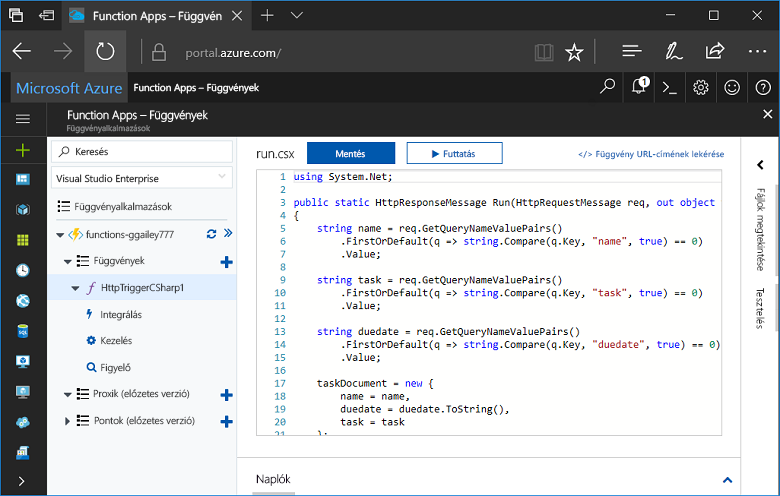
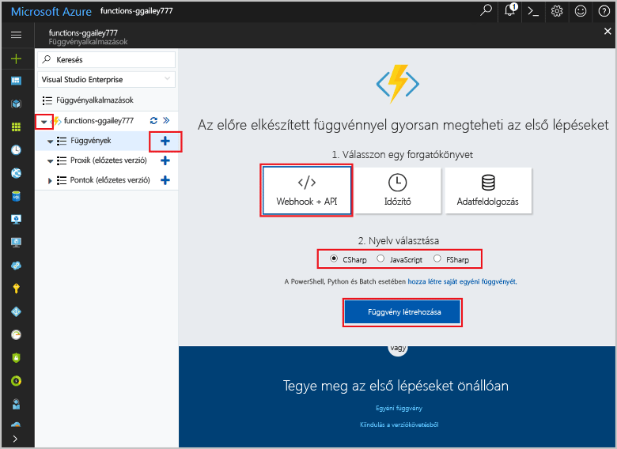
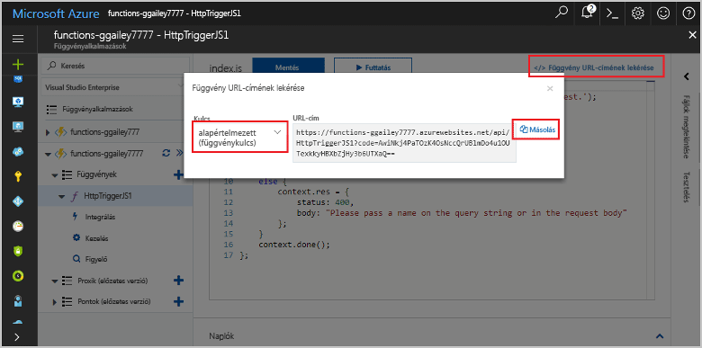
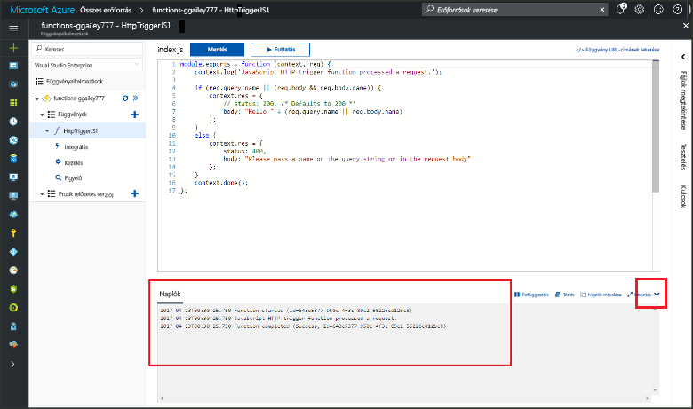

# A hello Azure-portálon az első függvény létrehozása

Az Azure Functions lehetővé teszi, hogy a kód egy kiszolgáló nélküli környezetben anélkül, hogy hozzon létre egy virtuális Gépet, vagy tegye közzé a webalkalmazást toofirst hajtható végre. Ebben a témakörben elsajátíthatja toouse működését toocreate hello Azure-portálon a "hello world" függvényt.

[!INCLUDE [quickstarts-free-trial-note](../../includes/quickstarts-free-trial-note.md)]

## Jelentkezzen be tooAzure

Jelentkezzen be toohello [Azure-portálon](https://portal.azure.com/).

## Függvényalkalmazás létrehozása

Rendelkeznie kell egy függvény app toohost hello a függvények végrehajtásához szükséges. A függvényalkalmazás lehetővé teszi, hogy logikai egységbe csoportosítsa a függvényeket az erőforrások egyszerűbb felügyelete, telepítése és megosztása érdekében. 

[!INCLUDE [Create function app Azure portal](../../includes/functions-create-function-app-portal.md)]

[!INCLUDE [functions-portal-favorite-function-apps](../../includes/functions-portal-favorite-function-apps.md)]

A függvény a következő alkalmazásban hello új függvény létrehozása.

## HTTP által aktivált függvény létrehozása

1. Bontsa ki az új függvény alkalmazást, majd kattintson az hello  **+**  gomb melletti túl**funkciók**.

2.  A hello **gyorsan** lapon jelölje be **WebHook + API**, **válassza ki a nyelvet** a függvény, és kattintson a **Ez a függvény létrehozása** . 
   
    

A következő függvényt egy indított HTTP függvény hello sablonnal a választott nyelven jön létre. HTTP-kérelem küldésével hello új funkció is futtathatja.

## Hello függvény tesztelése

1. Az új függvényben kattintson a **< /> Függvény URL-címének beolvasása** elemre, válassza a **default (Function key)** (alapértelmezett (funkcióbillentyű)) lehetőséget, majd kattintson a **Másolás** gombra. 

    

2. Hello függvény URL-cím illessze be a böngésző címsorába. Hello lekérdezési karakterlánc hozzáfűzése `&name=<yourname>` toothis URL-címet, és nyomja le az hello `Enter` kulcs a billentyűzet tooexecute hello kérésre. hello az alábbiakban látható egy példa az Edge böngészőben hello hello függvény által visszaadott hello választ:

    

    hello kérelem URL-cím szükséges, alapértelmezés szerint tooaccess kulcsot tartalmaz, a függvény HTTP Protokollon keresztül.   

3. A függvény futásakor nyomkövetési adatok írása toohello naplókat. toosee hello nyomkövetési kimenetét hello előző végrehajtási, térjen vissza a tooyour függvény hello portálon, és kattintson a felfelé mutató nyíl hello képernyő tooexpand hello alján hello **naplók**. 

   

## Az erőforrások eltávolítása

[!INCLUDE [Clean up resources](../../includes/functions-quickstart-cleanup.md)]

## Következő lépések

Létrehozott egy függvényalkalmazást és egy HTTP által aktivált egyszerű függvényt.  

[!INCLUDE [Next steps note](../../includes/functions-quickstart-next-steps.md)]

További információ: [Azure Functions – HTTP- és webhookkötések](functions-bindings-http-webhook.md).

