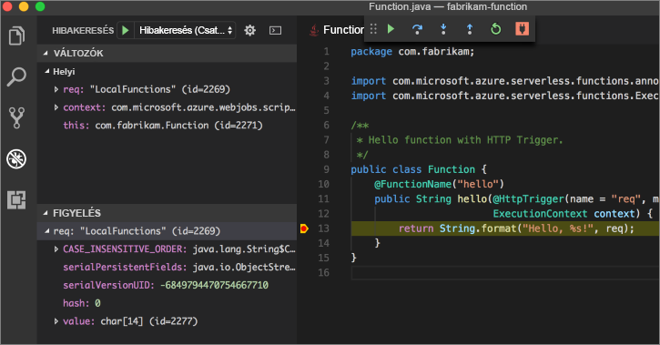

# <a name="create-your-first-function-with-java-and-maven-preview"></a>Az első függvény létrehozása a Java és a Maven használatával (előzetes verzió)

> [!NOTE] 
> A Java for Azure Functions jelenleg előzetes verzióban érhető el.

Ez a rövid útmutató végigvezeti a [kiszolgáló nélküli](https://azure.microsoft.com/overview/serverless-computing/) függvények a Maven használatával való létrehozásának, a helyszíni tesztelésnek és az Azure Functionsben való üzembe helyezésének lépésein. Az oktatóanyag eredménye egy, az Azure-ban futó HTTP-triggert használó függvényalkalmazás lesz.


[!INCLUDE [quickstarts-free-trial-note](../../includes/quickstarts-free-trial-note.md)]

## <a name="prerequisites"></a>Előfeltételek
Ha függvényalkalmazást szeretne létrehozni a Java használatával, akkor a számítógépre a következőket kell telepíteni:

-  A [.NET Core](https://www.microsoft.com/net/core) legújabb verziója.
-  A [Java Developer Kit](https://www.azul.com/downloads/zulu/) 8-as verziója.
-  [Azure CLI](https://docs.microsoft.com/cli/azure)
-  Az [Apache Maven](https://maven.apache.org) 3.0-s vagy újabb verziója.
-  A [Node.js](https://nodejs.org/download/) 8.6-os vagy újabb verziója.

> [!IMPORTANT] 
> A rövid útmutató befejezéséhez a JAVA_HOME környezeti változót a JDK telepítési helyére kell beállítani.

## <a name="install-the-azure-functions-core-tools"></a>Az Azure Functions Core Tools telepítése

Az [Azure Functions Core Tools 2.0](https://www.npmjs.com/package/azure-functions-core-tools) helyi fejlesztési környezetet biztosít az Azure-függvények írásához, futtatásához és a hibakereséshez. Telepítse az eszközöket az [npm](https://www.npmjs.com/) használatával, amely a [Node.js](https://nodejs.org/) részét képezi.

```
npm install -g azure-functions-core-tools@core
```

> [!NOTE]
> Ha az Azure Functions Core Tools 2.0-s verziójának telepítése során problémába ütközik, tekintse meg a [2.x-es verziók futtatókörnyezetével](/azure/azure-functions/functions-run-local#version-2x-runtime) foglalkozó részt.

## <a name="generate-a-new-functions-project"></a>Új Functions-projekt létrehozása

Egy üres mappában futtassa a következő parancsot a Functions-projekt [Maven archetype](https://maven.apache.org/guides/introduction/introduction-to-archetypes.html)-ból való létrehozásához.

### <a name="linuxmacos"></a>Linux/MacOS

```bash
mvn archetype:generate \
    -DarchetypeGroupId=com.microsoft.azure \
    -DarchetypeArtifactId=azure-functions-archetype 
```

### <a name="windows-cmd"></a>Windows (parancssor)
```cmd
mvn archetype:generate ^
    -DarchetypeGroupId=com.microsoft.azure ^
    -DarchetypeArtifactId=azure-functions-archetype
```

A Maven kéri a projekt létrehozásához szükséges értékeket. A _groupId_, _artifactId_ és _version_ értékek a [Maven elnevezési konvenciókra](https://maven.apache.org/guides/mini/guide-naming-conventions.html) vonatkozó referenciákban találhatók. Az _appName_ értékének egyedinek kell lennie az Azure-ban, ezért a Maven alapértelmezés szerint az előzőleg megadott _artifactId_ érték alapján létrehoz egy alkalmazásnevet. A _packageName_ érték meghatározza a Java-csomagot a létrehozott függvénykódhoz.

```Output
Define value for property 'groupId': com.fabrikam.functions
Define value for property 'artifactId' : fabrikam-functions
Define value for property 'version' 1.0-SNAPSHOT : 
Define value for property 'package': com.fabrikam.functions
Define value for property 'appName' fabrikam-functions-20170927220323382:
Confirm properties configuration: Y
```

A Maven egy _artifactId_ nevű új mappában hozza létre a projektfájlokat. A projekten belül létrehozott kód egy egyszerű [HTTP-triggert](/azure/azure-functions/functions-bindings-http-webhook) használó függvény, amely a kérés törzsét adja vissza.

```java
public class Function {
    /**
     * This function listens at endpoint "/api/hello". Two ways to invoke it using "curl" command in bash:
     * 1. curl -d "HTTP Body" {your host}/api/hello
     * 2. curl {your host}/api/hello?name=HTTP%20Query
     */
    @FunctionName("hello")
    public HttpResponseMessage<String> hello(
            @HttpTrigger(name = "req", methods = {"get", "post"}, authLevel = AuthorizationLevel.ANONYMOUS) HttpRequestMessage<Optional<String>> request,
            final ExecutionContext context) {
        context.getLogger().info("Java HTTP trigger processed a request.");

        // Parse query parameter
        String query = request.getQueryParameters().get("name");
        String name = request.getBody().orElse(query);

        if (name == null) {
            return request.createResponse(400, "Please pass a name on the query string or in the request body");
        } else {
            return request.createResponse(200, "Hello, " + name);
        }
    }
}

```

## <a name="run-the-function-locally"></a>Függvény helyi futtatása

Módosítsa a könyvtárt az újonnan létrehozott projektmappára, majd hozza létre és futtassa a függvényt a Maven használatával:

```
cd fabrikam-function
mvn clean package 
mvn azure-functions:run
```

> [!NOTE]
> Ha Java 9 használata esetén a `javax.xml.bind.JAXBException` kivételt észleli, tekintse meg a megkerülő megoldást a [GitHubon](https://github.com/jOOQ/jOOQ/issues/6477).

A függvény futásakor a következő kimenet látható:

```Output
Listening on http://localhost:7071
Hit CTRL-C to exit...

Http Functions:

   hello: http://localhost:7071/api/hello
```

Aktiválja a függvényt a parancssorból egy új terminálablakban a Curl használatával:

```
curl -w '\n' -d LocalFunction http://localhost:7071/api/hello
```

```Output
Hello LocalFunction!
```

A `Ctrl-C` billentyűparanccsal állítsa le a függvénykódot a terminálablakban.

## <a name="deploy-the-function-to-azure"></a>A függvény üzembe helyezése az Azure-ban

Az Azure Functions üzembehelyezési folyamata az Azure parancssori felületről származó fiókhitelesítő-adatokat használja. [Jelentkezzen be az Azure parancssori felületre](/cli/azure/authenticate-azure-cli?view=azure-cli-latest), majd helyezze üzembe a kódot egy új függvényalkalmazásban az `azure-functions:deploy` Maven-cél használatával.

```
az login
mvn azure-functions:deploy
```

Az üzembe helyezés végén megjelenik az URL-cím, amellyel bejelentkezhet az Azure-függvényalkalmazásba:

```output
[INFO] Successfully deployed Function App with package.
[INFO] Deleting deployment package from Azure Storage...
[INFO] Successfully deleted deployment package fabrikam-function-20170920120101928.20170920143621915.zip
[INFO] Successfully deployed Function App at https://fabrikam-function-20170920120101928.azurewebsites.net
[INFO] ------------------------------------------------------------------------
```

Tesztelje az Azure-ban futó függvényalkalmazást a Curl használatával:

```
curl -w '\n' https://fabrikam-function-20170920120101928.azurewebsites.net/api/hello -d AzureFunctions
```

```Output
Hello AzureFunctions!
```

## <a name="next-steps"></a>További lépések

Létrehozott egy Java-függvényalkalmazást egy egyszerű HTTP-triggerrel, és üzembe helyezte azt az Azure Functionsben.

- Ha további információra van szüksége a Java-függvények létrehozásával kapcsolatban, tekintse át a [Java-függvények fejlesztői útmutatóját](functions-reference-java.md).
- Adjon hozzá különböző triggereket használó további funkciókat a projekthez az `azure-functions:add` Maven-cél használatával.
- Végezze el a függvények helyi hibakeresését a Visual Studio Code-dal. Ha elkészült a [Java-bővítménycsomag](https://marketplace.visualstudio.com/items?itemName=vscjava.vscode-java-pack) telepítésével, és a Functions-projekt meg van nyitva a Visual Studio Code-ban, [társítsa a hibakeresőt](https://code.visualstudio.com/Docs/editor/debugging#_launch-configurations) az 5005-ös számú porthoz. Ezt követően állítson be egy töréspontot a szerkesztőben, és aktiválja a függvényt, miközben az helyileg fut: 


