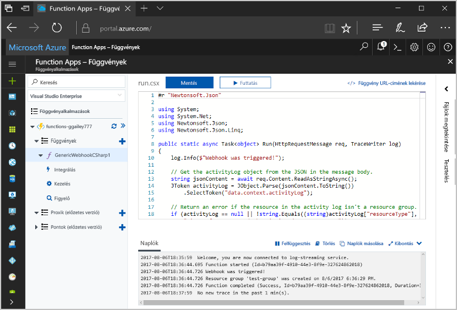
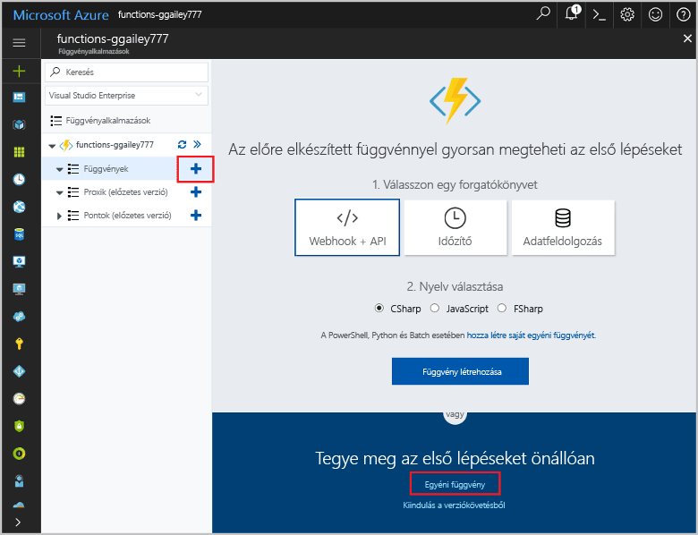
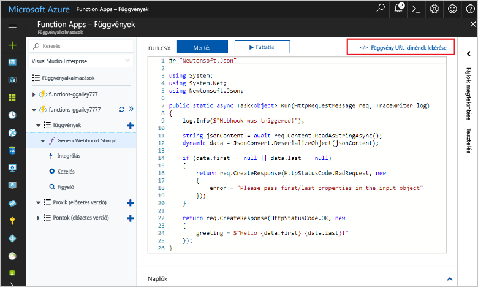
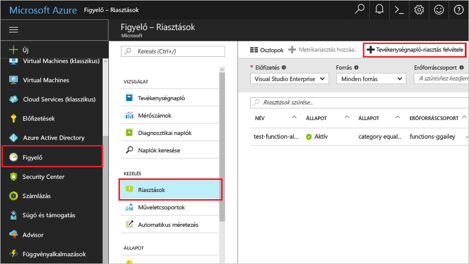
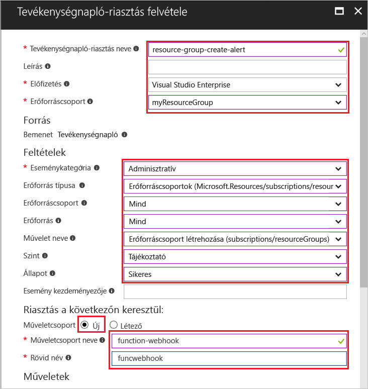
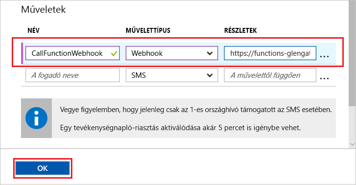
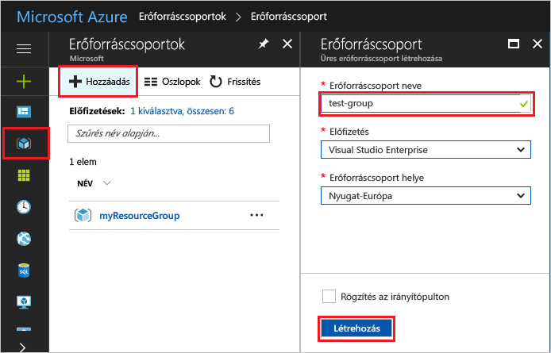
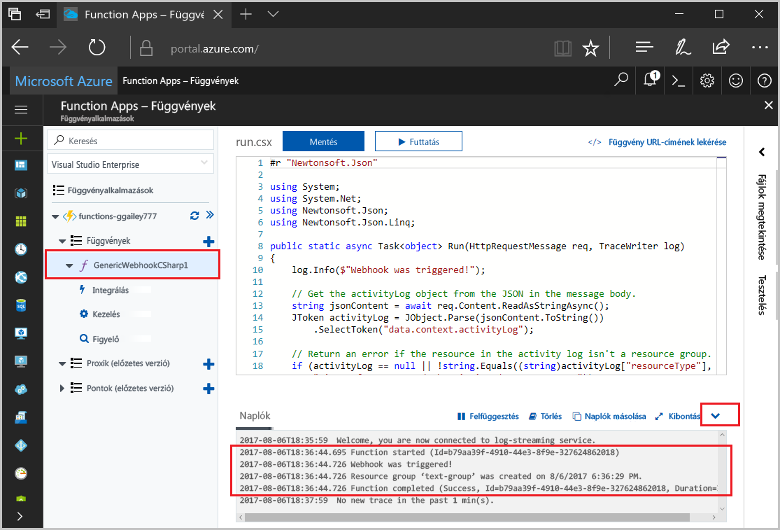

# <a name="create-a-function-triggered-by-a-generic-webhook"></a><span data-ttu-id="fd1e9-103">Általános webhook által indított függvény létrehozása</span><span class="sxs-lookup"><span data-stu-id="fd1e9-103">Create a function triggered by a generic webhook</span></span>

<span data-ttu-id="fd1e9-104">Az Azure Functions lehetővé teszi, hogy a kód egy kiszolgáló nélküli környezetben anélkül, hogy hozzon létre egy virtuális Gépet, vagy tegye közzé a webalkalmazást toofirst hajtható végre.</span><span class="sxs-lookup"><span data-stu-id="fd1e9-104">Azure Functions lets you execute your code in a serverless environment without having toofirst create a VM or publish a web application.</span></span> <span data-ttu-id="fd1e9-105">Konfigurálhatja például, egy Azure-figyelő által kiváltott riasztást által indított függvény toobe.</span><span class="sxs-lookup"><span data-stu-id="fd1e9-105">For example, you can configure a function toobe triggered by an alert raised by Azure Monitor.</span></span> <span data-ttu-id="fd1e9-106">Ez a témakör bemutatja, hogyan tooexecute C#-kódban erőforráscsoport esetén hozzáadott tooyour előfizetés.</span><span class="sxs-lookup"><span data-stu-id="fd1e9-106">This topic shows you how tooexecute C# code when a resource group is added tooyour subscription.</span></span>   



## <a name="prerequisites"></a><span data-ttu-id="fd1e9-108">Előfeltételek</span><span class="sxs-lookup"><span data-stu-id="fd1e9-108">Prerequisites</span></span> 

<span data-ttu-id="fd1e9-109">toocomplete Ez az oktatóanyag:</span><span class="sxs-lookup"><span data-stu-id="fd1e9-109">toocomplete this tutorial:</span></span>

+ <span data-ttu-id="fd1e9-110">Ha nem rendelkezik Azure-előfizetéssel, mindössze néhány perc alatt létrehozhat egy [ingyenes fiókot](https://azure.microsoft.com/free/?WT.mc_id=A261C142F) a virtuális gép létrehozásának megkezdése előtt.</span><span class="sxs-lookup"><span data-stu-id="fd1e9-110">If you don't have an Azure subscription, create a [free account](https://azure.microsoft.com/free/?WT.mc_id=A261C142F) before you begin.</span></span>

[!INCLUDE [functions-portal-favorite-function-apps](../../includes/functions-portal-favorite-function-apps.md)]

## <a name="create-an-azure-function-app"></a><span data-ttu-id="fd1e9-111">Azure-függvényalkalmazás létrehozása</span><span class="sxs-lookup"><span data-stu-id="fd1e9-111">Create an Azure Function app</span></span>

[!INCLUDE [Create function app Azure portal](../../includes/functions-create-function-app-portal.md)]

<span data-ttu-id="fd1e9-112">A függvény a következő alkalmazásban hello új függvény létrehozása.</span><span class="sxs-lookup"><span data-stu-id="fd1e9-112">Next, you create a function in hello new function app.</span></span>

## <span data-ttu-id="fd1e9-113"><a name="create-function"></a>Általános webhook indított függvény létrehozása</span><span class="sxs-lookup"><span data-stu-id="fd1e9-113"><a name="create-function"></a>Create a generic webhook triggered function</span></span>

1. <span data-ttu-id="fd1e9-114">Bontsa ki a függvény alkalmazást, majd kattintson a hello ** + ** gomb melletti túl**funkciók**.</span><span class="sxs-lookup"><span data-stu-id="fd1e9-114">Expand your function app and click hello **+** button next too**Functions**.</span></span> <span data-ttu-id="fd1e9-115">Ha ez a függvény van hello elsőt a függvény alkalmazásban, válassza ki a **egyéni függvény**.</span><span class="sxs-lookup"><span data-stu-id="fd1e9-115">If this function is hello first one in your function app, select **Custom function**.</span></span> <span data-ttu-id="fd1e9-116">Ez a függvény sablonok teljes készletének hello jeleníti meg.</span><span class="sxs-lookup"><span data-stu-id="fd1e9-116">This displays hello complete set of function templates.</span></span>

    

2. <span data-ttu-id="fd1e9-118">Jelölje be hello **általános WebHook - C#** sablont.</span><span class="sxs-lookup"><span data-stu-id="fd1e9-118">Select hello **Generic WebHook - C#** template.</span></span> <span data-ttu-id="fd1e9-119">Adja meg a C# függvény nevét, majd válasszon **létrehozása**.</span><span class="sxs-lookup"><span data-stu-id="fd1e9-119">Type a name for your C# function, then select **Create**.</span></span>

      

2. <span data-ttu-id="fd1e9-121">Kattintson az új függvény **<> / Get függvény URL-cím**, majd másolja ki és mentse a hello érték.</span><span class="sxs-lookup"><span data-stu-id="fd1e9-121">In your new function, click **</> Get function URL**, then copy and save hello value.</span></span> <span data-ttu-id="fd1e9-122">Az érték tooconfigure hello webhook használhatja.</span><span class="sxs-lookup"><span data-stu-id="fd1e9-122">You use this value tooconfigure hello webhook.</span></span> 

    
         
<span data-ttu-id="fd1e9-124">A következő hoz létre egy webhook végpont Azure figyelése tevékenység napló riasztást.</span><span class="sxs-lookup"><span data-stu-id="fd1e9-124">Next, you create a webhook endpoint in an activity log alert in Azure Monitor.</span></span> 

## <a name="create-an-activity-log-alert"></a><span data-ttu-id="fd1e9-125">Tevékenység napló riasztás létrehozása</span><span class="sxs-lookup"><span data-stu-id="fd1e9-125">Create an activity log alert</span></span>

1. <span data-ttu-id="fd1e9-126">A hello Azure-portálon, keresse meg a toohello **figyelő** szolgáltatás, válassza **riasztások**, és kattintson a **Hozzáadás figyelmeztetés a napló**.</span><span class="sxs-lookup"><span data-stu-id="fd1e9-126">In hello Azure portal, navigate toohello **Monitor** service, select **Alerts**, and click **Add activity log alert**.</span></span>   

    

2. <span data-ttu-id="fd1e9-128">Hello beállításokkal hello táblázatban megadottak szerint:</span><span class="sxs-lookup"><span data-stu-id="fd1e9-128">Use hello settings as specified in hello table:</span></span>

    

    | <span data-ttu-id="fd1e9-130">Beállítás</span><span class="sxs-lookup"><span data-stu-id="fd1e9-130">Setting</span></span>      |  <span data-ttu-id="fd1e9-131">Ajánlott érték</span><span class="sxs-lookup"><span data-stu-id="fd1e9-131">Suggested value</span></span>   | <span data-ttu-id="fd1e9-132">Leírás</span><span class="sxs-lookup"><span data-stu-id="fd1e9-132">Description</span></span>                              |
    | ------------ |  ------- | -------------------------------------------------- |
    | <span data-ttu-id="fd1e9-133">**Tevékenység napló riasztás neve**</span><span class="sxs-lookup"><span data-stu-id="fd1e9-133">**Activity log alert name**</span></span> | <span data-ttu-id="fd1e9-134">erőforrás-csoport-létrehozása – figyelmeztetés</span><span class="sxs-lookup"><span data-stu-id="fd1e9-134">resource-group-create-alert</span></span> | <span data-ttu-id="fd1e9-135">Hello figyelmeztetés a napló nevét.</span><span class="sxs-lookup"><span data-stu-id="fd1e9-135">Name of hello activity log alert.</span></span> |
    | <span data-ttu-id="fd1e9-136">**Előfizetés**</span><span class="sxs-lookup"><span data-stu-id="fd1e9-136">**Subscription**</span></span> | <span data-ttu-id="fd1e9-137">Az Ön előfizetése</span><span class="sxs-lookup"><span data-stu-id="fd1e9-137">Your subscription</span></span> | <span data-ttu-id="fd1e9-138">hello előfizetés ehhez az oktatóanyaghoz használ.</span><span class="sxs-lookup"><span data-stu-id="fd1e9-138">hello subscription you are using for this tutorial.</span></span> | 
    |  <span data-ttu-id="fd1e9-139">**Erőforráscsoport**</span><span class="sxs-lookup"><span data-stu-id="fd1e9-139">**Resource Group**</span></span> | <span data-ttu-id="fd1e9-140">myResourceGroup</span><span class="sxs-lookup"><span data-stu-id="fd1e9-140">myResourceGroup</span></span> | <span data-ttu-id="fd1e9-141">hello riasztási erőforrások telepített hello erőforráscsoportot.</span><span class="sxs-lookup"><span data-stu-id="fd1e9-141">hello resource group that hello alert resources are deployed to.</span></span> <span data-ttu-id="fd1e9-142">Használatával hello ugyanabban az erőforráscsoportban, mivel a függvény app teszi egyszerűbbé tooclean hello az oktatóanyag befejezése után.</span><span class="sxs-lookup"><span data-stu-id="fd1e9-142">Using hello same resource group as your function app makes it easier tooclean up after you complete hello tutorial.</span></span> |
    | <span data-ttu-id="fd1e9-143">**Eseménykategória**</span><span class="sxs-lookup"><span data-stu-id="fd1e9-143">**Event category**</span></span> | <span data-ttu-id="fd1e9-144">Felügyeleti</span><span class="sxs-lookup"><span data-stu-id="fd1e9-144">Administrative</span></span> | <span data-ttu-id="fd1e9-145">Ez a kategória tooAzure erőforrások végrehajtott módosításokat tartalmazza.</span><span class="sxs-lookup"><span data-stu-id="fd1e9-145">This category includes changes made tooAzure resources.</span></span>  |
    | <span data-ttu-id="fd1e9-146">**Erőforrástípus**</span><span class="sxs-lookup"><span data-stu-id="fd1e9-146">**Resource type**</span></span> | <span data-ttu-id="fd1e9-147">Erőforráscsoportok</span><span class="sxs-lookup"><span data-stu-id="fd1e9-147">Resource groups</span></span> | <span data-ttu-id="fd1e9-148">Riasztások tooresource csoport tevékenységek szűrők.</span><span class="sxs-lookup"><span data-stu-id="fd1e9-148">Filters alerts tooresource group activities.</span></span> |
    | <span data-ttu-id="fd1e9-149">**Erőforráscsoport**</span><span class="sxs-lookup"><span data-stu-id="fd1e9-149">**Resource Group**</span></span><br/><span data-ttu-id="fd1e9-150">és **erőforrás**</span><span class="sxs-lookup"><span data-stu-id="fd1e9-150">and **Resource**</span></span> | <span data-ttu-id="fd1e9-151">Összes</span><span class="sxs-lookup"><span data-stu-id="fd1e9-151">All</span></span> | <span data-ttu-id="fd1e9-152">Figyelje az összes erőforrást.</span><span class="sxs-lookup"><span data-stu-id="fd1e9-152">Monitor all resources.</span></span> |
    | <span data-ttu-id="fd1e9-153">**A művelet neve**</span><span class="sxs-lookup"><span data-stu-id="fd1e9-153">**Operation name**</span></span> | <span data-ttu-id="fd1e9-154">Create resource group (Erőforráscsoport létrehozása)</span><span class="sxs-lookup"><span data-stu-id="fd1e9-154">Create Resource Group</span></span> | <span data-ttu-id="fd1e9-155">Riasztások toocreate műveletek szűrése.</span><span class="sxs-lookup"><span data-stu-id="fd1e9-155">Filters alerts toocreate operations.</span></span> |
    | <span data-ttu-id="fd1e9-156">**Szint**</span><span class="sxs-lookup"><span data-stu-id="fd1e9-156">**Level**</span></span> | <span data-ttu-id="fd1e9-157">Tájékoztató</span><span class="sxs-lookup"><span data-stu-id="fd1e9-157">Informational</span></span> | <span data-ttu-id="fd1e9-158">Tájékoztatási szintű riasztások tartalmazzák.</span><span class="sxs-lookup"><span data-stu-id="fd1e9-158">Include informational level alerts.</span></span> | 
    | <span data-ttu-id="fd1e9-159">**Állapot**</span><span class="sxs-lookup"><span data-stu-id="fd1e9-159">**Status**</span></span> | <span data-ttu-id="fd1e9-160">Sikeres</span><span class="sxs-lookup"><span data-stu-id="fd1e9-160">Succeeded</span></span> | <span data-ttu-id="fd1e9-161">Sikeresen befejeződött-e riasztások tooactions szűrők.</span><span class="sxs-lookup"><span data-stu-id="fd1e9-161">Filters alerts tooactions that have completed successfully.</span></span> |
    | <span data-ttu-id="fd1e9-162">**A művelet csoport**</span><span class="sxs-lookup"><span data-stu-id="fd1e9-162">**Action group**</span></span> | <span data-ttu-id="fd1e9-163">új</span><span class="sxs-lookup"><span data-stu-id="fd1e9-163">New</span></span> | <span data-ttu-id="fd1e9-164">Hozzon létre egy új művelet, amely meghatározza a hello művelet vesz igénybe, egy riasztás esetén.</span><span class="sxs-lookup"><span data-stu-id="fd1e9-164">Create a new action group, which defines hello action takes when an alert is raised.</span></span> |
    | <span data-ttu-id="fd1e9-165">**A művelet csoport neve**</span><span class="sxs-lookup"><span data-stu-id="fd1e9-165">**Action group name**</span></span> | <span data-ttu-id="fd1e9-166">függvény-webhook</span><span class="sxs-lookup"><span data-stu-id="fd1e9-166">function-webhook</span></span> | <span data-ttu-id="fd1e9-167">A név tooidentify hello művelet csoport.</span><span class="sxs-lookup"><span data-stu-id="fd1e9-167">A name tooidentify hello action group.</span></span>  | 
    | <span data-ttu-id="fd1e9-168">**Rövid név**</span><span class="sxs-lookup"><span data-stu-id="fd1e9-168">**Short name**</span></span> | <span data-ttu-id="fd1e9-169">funcwebhook</span><span class="sxs-lookup"><span data-stu-id="fd1e9-169">funcwebhook</span></span> | <span data-ttu-id="fd1e9-170">Hello művelet csoport rövid nevét.</span><span class="sxs-lookup"><span data-stu-id="fd1e9-170">A short name for hello action group.</span></span> |  

3. <span data-ttu-id="fd1e9-171">A **műveletek**, új hello beállításokkal hello táblázatban megadott művelet:</span><span class="sxs-lookup"><span data-stu-id="fd1e9-171">In **Actions**, add an action using hello settings as specified in hello table:</span></span> 

    

    | <span data-ttu-id="fd1e9-173">Beállítás</span><span class="sxs-lookup"><span data-stu-id="fd1e9-173">Setting</span></span>      |  <span data-ttu-id="fd1e9-174">Ajánlott érték</span><span class="sxs-lookup"><span data-stu-id="fd1e9-174">Suggested value</span></span>   | <span data-ttu-id="fd1e9-175">Leírás</span><span class="sxs-lookup"><span data-stu-id="fd1e9-175">Description</span></span>                              |
    | ------------ |  ------- | -------------------------------------------------- |
    | <span data-ttu-id="fd1e9-176">**Name (Név)**</span><span class="sxs-lookup"><span data-stu-id="fd1e9-176">**Name**</span></span> | <span data-ttu-id="fd1e9-177">CallFunctionWebhook</span><span class="sxs-lookup"><span data-stu-id="fd1e9-177">CallFunctionWebhook</span></span> | <span data-ttu-id="fd1e9-178">Hello művelet nevét.</span><span class="sxs-lookup"><span data-stu-id="fd1e9-178">A name for hello action.</span></span> |
    | <span data-ttu-id="fd1e9-179">**Művelet típusa**</span><span class="sxs-lookup"><span data-stu-id="fd1e9-179">**Action type**</span></span> | <span data-ttu-id="fd1e9-180">Webhook</span><span class="sxs-lookup"><span data-stu-id="fd1e9-180">Webhook</span></span> | <span data-ttu-id="fd1e9-181">hello válasz toohello riasztás, hogy a Webhook URL-cím neve.</span><span class="sxs-lookup"><span data-stu-id="fd1e9-181">hello response toohello alert is that a Webhook URL is called.</span></span> |
    | <span data-ttu-id="fd1e9-182">**Részletek**</span><span class="sxs-lookup"><span data-stu-id="fd1e9-182">**Details**</span></span> | <span data-ttu-id="fd1e9-183">Függvény URL-címe</span><span class="sxs-lookup"><span data-stu-id="fd1e9-183">Function URL</span></span> | <span data-ttu-id="fd1e9-184">Illessze be a korábban kimásolt hello függvény hello webhook URL-CÍMÉT.</span><span class="sxs-lookup"><span data-stu-id="fd1e9-184">Paste in hello webhook URL of hello function that you copied earlier.</span></span> |<span data-ttu-id="fd1e9-185">v</span><span class="sxs-lookup"><span data-stu-id="fd1e9-185">v</span></span>

4. <span data-ttu-id="fd1e9-186">Kattintson a **OK** toocreate hello riasztás és művelet csoport.</span><span class="sxs-lookup"><span data-stu-id="fd1e9-186">Click **OK** toocreate hello alert and action group.</span></span>  

<span data-ttu-id="fd1e9-187">hello webhook neve erőforráscsoport létrehozásakor az előfizetéshez.</span><span class="sxs-lookup"><span data-stu-id="fd1e9-187">hello webhook is now called when a resource group is created in your subscription.</span></span> <span data-ttu-id="fd1e9-188">A következő hello kód frissítenie a függvény toohandle hello JSON naplóadatokat hello kérelem hello törzsében.</span><span class="sxs-lookup"><span data-stu-id="fd1e9-188">Next, you update hello code in your function toohandle hello JSON log data in hello body of hello request.</span></span>   

## <a name="update-hello-function-code"></a><span data-ttu-id="fd1e9-189">Hello funkciókódot frissítése</span><span class="sxs-lookup"><span data-stu-id="fd1e9-189">Update hello function code</span></span>

1. <span data-ttu-id="fd1e9-190">Lépjen vissza tooyour függvény app hello portálon, és bontsa ki a függvény.</span><span class="sxs-lookup"><span data-stu-id="fd1e9-190">Navigate back tooyour function app in hello portal, and expand your function.</span></span> 

2. <span data-ttu-id="fd1e9-191">Hello C# parancsfájlkód hello portálon hello függvényében cserélje le a következő kód hello:</span><span class="sxs-lookup"><span data-stu-id="fd1e9-191">Replace hello C# script code in hello function in hello portal with hello following code:</span></span>

    ```csharp
    #r "Newtonsoft.Json"
    
    using System;
    using System.Net;
    using Newtonsoft.Json;
    using Newtonsoft.Json.Linq;
    
    public static async Task<object> Run(HttpRequestMessage req, TraceWriter log)
    {
        log.Info($"Webhook was triggered!");
    
        // Get hello activityLog object from hello JSON in hello message body.
        string jsonContent = await req.Content.ReadAsStringAsync();
        JToken activityLog = JObject.Parse(jsonContent.ToString())
            .SelectToken("data.context.activityLog");
    
        // Return an error if hello resource in hello activity log isn't a resource group. 
        if (activityLog == null || !string.Equals((string)activityLog["resourceType"], 
            "Microsoft.Resources/subscriptions/resourcegroups"))
        {
            log.Error("An error occured");
            return req.CreateResponse(HttpStatusCode.BadRequest, new
            {
                error = "Unexpected message payload or wrong alert received."
            });
        }
    
        // Write information about hello created resource group toohello streaming log.
        log.Info(string.Format("Resource group '{0}' was {1} on {2}.",
            (string)activityLog["resourceGroupName"],
            ((string)activityLog["subStatus"]).ToLower(), 
            (DateTime)activityLog["submissionTimestamp"]));
    
        return req.CreateResponse(HttpStatusCode.OK);    
    }
    ```

<span data-ttu-id="fd1e9-192">Hello függvény most tesztelheti az előfizetés egy új erőforráscsoport létrehozásával.</span><span class="sxs-lookup"><span data-stu-id="fd1e9-192">Now you can test hello function by creating a new resource group in your subscription.</span></span>

## <a name="test-hello-function"></a><span data-ttu-id="fd1e9-193">Hello függvény tesztelése</span><span class="sxs-lookup"><span data-stu-id="fd1e9-193">Test hello function</span></span>

1. <span data-ttu-id="fd1e9-194">Hello erőforrás csoport ikonra hello bal oldalán hello Azure portálon, válassza a **+ Hozzáadás**, adjon meg egy **erőforráscsoport-név**, és válassza ki **létrehozása** toocreate egy üres erőforráscsoporthoz.</span><span class="sxs-lookup"><span data-stu-id="fd1e9-194">Click hello resource group icon in hello left of hello Azure portal, select **+ Add**, type a **Resource group name**, and select **Create** toocreate an empty resource group.</span></span>
    
    

2. <span data-ttu-id="fd1e9-196">Lépjen vissza tooyour függvény, és bontsa ki a hello **naplók** ablak.</span><span class="sxs-lookup"><span data-stu-id="fd1e9-196">Go back tooyour function and expand hello **Logs** window.</span></span> <span data-ttu-id="fd1e9-197">Hello erőforráscsoport létrehozása után hello tevékenység napló riasztási eseményindítók hello webhook és hello függvény végrehajtása.</span><span class="sxs-lookup"><span data-stu-id="fd1e9-197">After hello resource group is created, hello activity log alert triggers hello webhook and hello function executes.</span></span> <span data-ttu-id="fd1e9-198">Hello új erőforráscsoport toohello naplók írt hello nevét láthatja.</span><span class="sxs-lookup"><span data-stu-id="fd1e9-198">You see hello name of hello new resource group written toohello logs.</span></span>  

    

3. <span data-ttu-id="fd1e9-200">(Választható) Lépjen vissza, és létrehozott hello-csoport törléséhez.</span><span class="sxs-lookup"><span data-stu-id="fd1e9-200">(Optional) Go back and delete hello resource group that you created.</span></span> <span data-ttu-id="fd1e9-201">Vegye figyelembe, hogy ez a tevékenység hello függvény nem következik.</span><span class="sxs-lookup"><span data-stu-id="fd1e9-201">Note that this activity doesn't trigger hello function.</span></span> <span data-ttu-id="fd1e9-202">Ennek az az oka törlési műveletek hello riasztás ki van szűrve.</span><span class="sxs-lookup"><span data-stu-id="fd1e9-202">This is because delete operations are filtered out by hello alert.</span></span> 

## <a name="clean-up-resources"></a><span data-ttu-id="fd1e9-203">Az erőforrások eltávolítása</span><span class="sxs-lookup"><span data-stu-id="fd1e9-203">Clean up resources</span></span>

[!INCLUDE [Next steps note](../../includes/functions-quickstart-cleanup.md)]

## <a name="next-steps"></a><span data-ttu-id="fd1e9-204">Következő lépések</span><span class="sxs-lookup"><span data-stu-id="fd1e9-204">Next steps</span></span>

<span data-ttu-id="fd1e9-205">Egy függvényt, amely akkor fut, amikor egy kérelem érkezett egy általános webhook hozott létre.</span><span class="sxs-lookup"><span data-stu-id="fd1e9-205">You have created a function that runs when a request is received from a generic webhook.</span></span> 

[!INCLUDE [Next steps note](../../includes/functions-quickstart-next-steps.md)]

<span data-ttu-id="fd1e9-206">További információt a webhook-eseményindítókról az [Azure Functions – HTTP- és webhookkötések](functions-bindings-http-webhook.md) című témakörben talál.</span><span class="sxs-lookup"><span data-stu-id="fd1e9-206">For more information about webhook triggers, see [Azure Functions HTTP and webhook bindings](functions-bindings-http-webhook.md).</span></span> <span data-ttu-id="fd1e9-207">További információ a C# funkciók fejlesztése toolearn lásd: [Azure Functions C# parancsfájl fejlesztői leírás](functions-reference-csharp.md).</span><span class="sxs-lookup"><span data-stu-id="fd1e9-207">toolearn more about developing functions in C#, see [Azure Functions C# script developer reference](functions-reference-csharp.md).</span></span>

