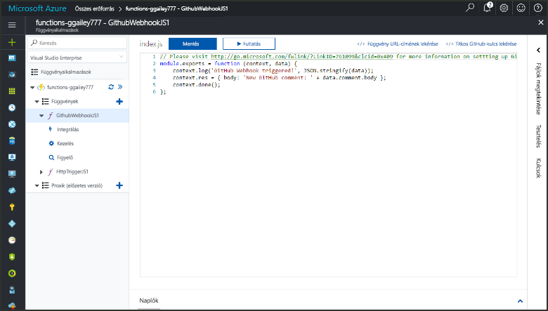
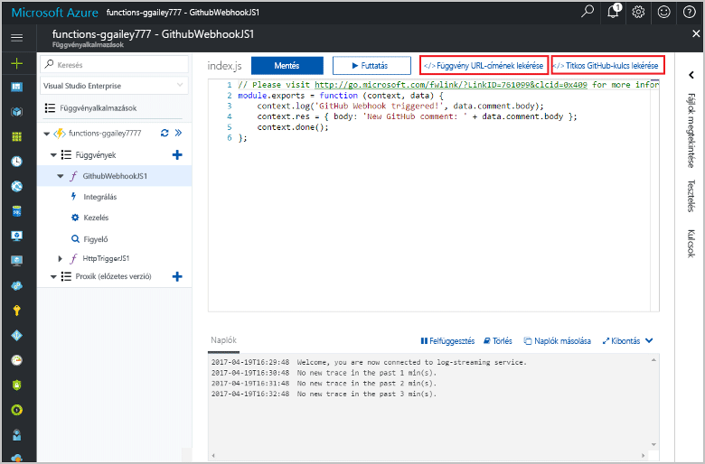
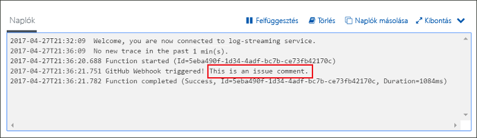

# GitHub-webhookok által meghívott függvények létrehozásaCreate a function triggered by a GitHub webhook

Megtudhatja, hogyan toocreate webhook HTTP-kérelem a GitHub-specifikus hasznos adatok között az által elindított függvényt.Learn how toocreate a function that is triggered by an HTTP webhook request with a GitHub-specific payload.

## ElőfeltételekPrerequisites

+ Legalább egy projekttel rendelkező GitHub-fiók.A GitHub account with at least one project.
+ Azure-előfizetés.An Azure subscription. Ha még nincs előfizetése, hozzon létre egy [ingyenes fiókot](https://azure.microsoft.com/free/?WT.mc_id=A261C142F), mielőtt hozzákezd.If you don't have one, create a [free account](https://azure.microsoft.com/free/?WT.mc_id=A261C142F) before you begin.

[!INCLUDE [functions-portal-favorite-function-apps](../../includes/functions-portal-favorite-function-apps.md)]

## Azure-függvényalkalmazás létrehozásaCreate an Azure Function app

[!INCLUDE [Create function app Azure portal](../../includes/functions-create-function-app-portal.md)]

A függvény a következő alkalmazásban hello új függvény létrehozása.Next, you create a function in hello new function app.

## GitHub-webhook által aktivált függvény létrehozásaCreate a GitHub webhook triggered function

1. Bontsa ki a függvény alkalmazást, majd kattintson a hello  **+**  gomb melletti túl**funkciók**.Expand your function app and click hello **+** button next too**Functions**. Ha ez az első függvényét hello az függvény alkalmazásban, válassza ki a **egyéni függvény**.If this is hello first function in your function app, select **Custom function**. Ez a függvény sablonok teljes készletének hello jeleníti meg.This displays hello complete set of function templates.

    

2. Jelölje be hello **GitHub WebHook** sablont a kívánt nyelvet.Select hello **GitHub WebHook** template for your desired language. **Nevezze el a függvényt**, majd kattintson a **Létrehozás** elemre.**Name your function**, then select **Create**.

      

3. Kattintson az új függvény **<> / Get függvény URL-cím**, majd másolja ki és mentse a hello értékeket.In your new function, click **</> Get function URL**, then copy and save hello values. Ugyanaz a hello **<> / Get GitHub titkos**.Do hello same thing for **</> Get GitHub secret**. Ezen értékek tooconfigure hello webhook használhatja a Githubon.You use these values tooconfigure hello webhook in GitHub.

    

A következő lépésben egy webhookot hoz létre a GitHub-tárban.Next, you create a webhook in your GitHub repository.

## Hello webhook konfigurálásaConfigure hello webhook

1. A github webhelyen lépjen a saját tooa tárház.In GitHub, navigate tooa repository that you own. Használhat bármely elágaztatott adattárat is.You can also use any repository that you have forked. Ha a tárház toofork van szüksége, <https://github.com/Azure-Samples/functions-quickstart>.If you need toofork a repository, use <https://github.com/Azure-Samples/functions-quickstart>.

1. Kattintson a **Settings** (Beállítások), majd a **Webhooks** (Webhookok) és végül az **Add webhook** (Webhook hozzáadása) elemre.Click **Settings**, then click **Webhooks**, and  **Add webhook**.

    

1. Hello táblázatban megadott beállításokkal, majd kattintson az **adja hozzá a webhook**.Use settings as specified in hello table, then click **Add webhook**.

    

| BeállításSetting | Ajánlott értékSuggested value | LeírásDescription |
|---|---|---|
| **Hasznos adat URL-címe****Payload URL** | Másolt értékCopied value | Hello által visszaadott értéket használja **<> / Get függvény URL-cím**.Use hello value returned by  **</> Get function URL**. |
| **Titkos kód****Secret**   | Másolt értékCopied value | Hello által visszaadott értéket használja **<> / Get GitHub titkos**.Use hello value returned by  **</> Get GitHub secret**. |
| **Tartalom típusa****Content type** | application/jsonapplication/json | hello függvényhez a JSON hasznos adatok között.hello function expects a JSON payload. |
| EseményindítókEvent triggers | Én szeretném kiválasztani az egyes eseményeketLet me select individual events | Csak szeretnénk tootrigger probléma Megjegyzés események.We only want tootrigger on issue comment events.  |
| | Probléma megjegyzéseIssue comment |  |

Most, hello webhook, akkor konfigurált tootrigger a függvény egy új probléma megjegyzés hozzáadásakor.Now, hello webhook is configured tootrigger your function when a new issue comment is added.

## Hello függvény teszteléseTest hello function

1. Nyissa meg a GitHub-tárház hello **problémák** fülre egy új böngészőablakban.In your GitHub repository, open hello **Issues** tab in a new browser window.

1. Hello új ablakban kattintson **új probléma**, írja be a címet, és kattintson a **küldje el az új probléma**.In hello new window, click **New Issue**, type a title, and then click **Submit new issue**.

1. Hello probléma, írja be egy megjegyzést, és kattintson a **Megjegyzés**.In hello issue, type a comment and click **Comment**.

    

1. Lépjen vissza toohello portálon, és a hello naplók megtekintése.Go back toohello portal and view hello logs. Meg kell jelennie egy nyomkövetési bejegyzés hello új megjegyzés szövege.You should see a trace entry with hello new comment text.

     

## Az erőforrások eltávolításaClean up resources

[!INCLUDE [Next steps note](../../includes/functions-quickstart-cleanup.md)]

## Következő lépésekNext steps

Létrehozott egy függvényt, amely akkor fut, amikor kérelem érkezik egy GitHub-webhookból.You have created a function that runs when a request is received from a GitHub webhook.

[!INCLUDE [Next steps note](../../includes/functions-quickstart-next-steps.md)]

További információt a webhook-eseményindítókról az [Azure Functions – HTTP- és webhookkötések](functions-bindings-http-webhook.md) című témakörben talál.For more information about webhook triggers, see [Azure Functions HTTP and webhook bindings](functions-bindings-http-webhook.md).
