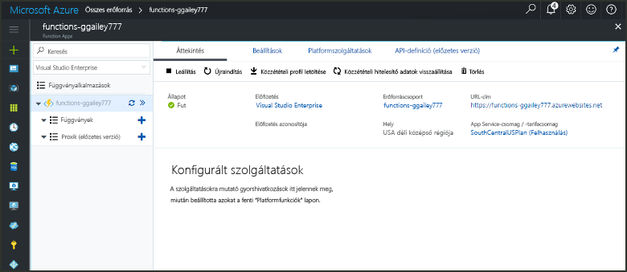
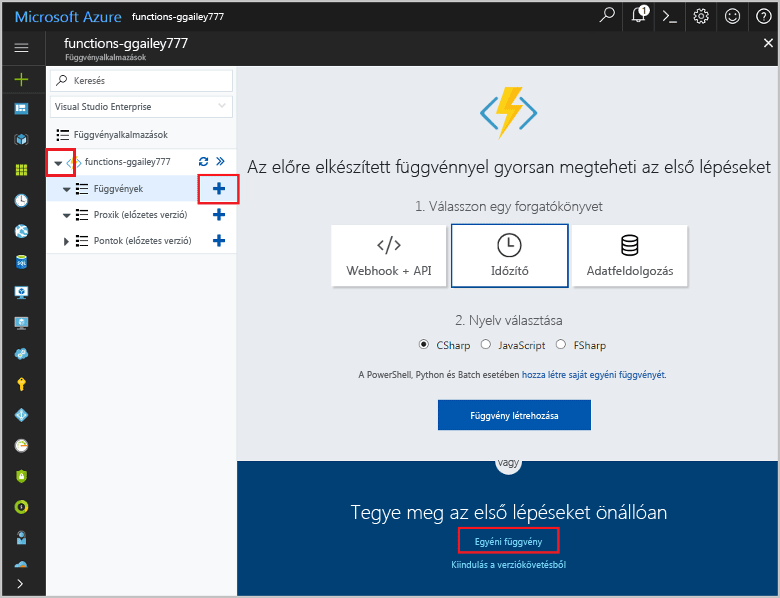

# Időzítő által aktivált függvény létrehozása az Azure-banCreate a function in Azure that is triggered by a timer

Ismerje meg, hogyan toouse Azure Functions toocreate lefutó függvény alapján meghatározott ütemezés szerint.Learn how toouse Azure Functions toocreate a function that runs based a schedule that you define.

## ElőfeltételekPrerequisites

toocomplete Ez az oktatóanyag:toocomplete this tutorial:

+ Ha nem rendelkezik Azure-előfizetéssel, mindössze néhány perc alatt létrehozhat egy [ingyenes fiókot](https://azure.microsoft.com/free/?WT.mc_id=A261C142F) a virtuális gép létrehozásának megkezdése előtt.If you don't have an Azure subscription, create a [free account](https://azure.microsoft.com/free/?WT.mc_id=A261C142F) before you begin.

[!INCLUDE [functions-portal-favorite-function-apps](../../includes/functions-portal-favorite-function-apps.md)]

## Azure-függvényalkalmazás létrehozásaCreate an Azure Function app

[!INCLUDE [Create function app Azure portal](../../includes/functions-create-function-app-portal.md)]

A függvény a következő alkalmazásban hello új függvény létrehozása.Next, you create a function in hello new function app.

## Időzítő által aktivált függvény létrehozásaCreate a timer triggered function

1. Bontsa ki a függvény alkalmazást, majd kattintson a hello  **+**  gomb melletti túl**funkciók**.Expand your function app and click hello **+** button next too**Functions**. Ha ez az első függvényét hello az függvény alkalmazásban, válassza ki a **egyéni függvény**.If this is hello first function in your function app, select **Custom function**. Ez a függvény sablonok teljes készletének hello jeleníti meg.This displays hello complete set of function templates.

    

2. Jelölje be hello **TimerTrigger** sablont a kívánt nyelvet.Select hello **TimerTrigger** template for your desired language. Majd beállításokkal hello hello táblázatban megadottak szerint:Then use hello settings as specified in hello table:

    

    | BeállításSetting | Ajánlott értékSuggested value | LeírásDescription |
    |---|---|---|
    | **A függvény neve****Name your function** | TimerTriggerCSharp1TimerTriggerCSharp1 | Az időzítő indított függvény hello nevét adja meg.Defines hello name of your timer triggered function. |
    | **[Ütemezés](http://en.wikipedia.org/wiki/Cron#CRON_expression)****[Schedule](http://en.wikipedia.org/wiki/Cron#CRON_expression)** | 0 \*/1 \* \* \* \*0 \*/1 \* \* \* \* | A hat mező [CRON-kifejezés](http://en.wikipedia.org/wiki/Cron#CRON_expression) , amely ütemezi a függvény toorun percenként.A six field [CRON expression](http://en.wikipedia.org/wiki/Cron#CRON_expression) that schedules your function toorun every minute. |

2. Kattintson a **Create** (Létrehozás) gombra.Click **Create**. Létrejön egy függvény a választott nyelven, amely minden percben futni fog.A function is created in your chosen language that runs every minute.

3. Ellenőrizze a végrehajtási toohello naplók írt nyomkövetési adatok megtekintéséhez használatos időkategóriát.Verify execution by viewing trace information written toohello logs.

    

Most módosíthatja hello függvény ütemezését, hogy kevesebb gyakran, például óránként egyszer fusson.Now, you can change hello function's schedule so that it runs less often, such as once every hour. 

## Frissítés hello időzítő ütemezéseUpdate hello timer schedule

1. Bontsa ki a függvényt, és kattintson az **Integráció** elemre.Expand your function and click **Integrate**. Ez az ahol határozza meg a bemeneti és kimeneti kötések a függvény és hello ütemezést is beállíthat.This is where you define input and output bindings for your function and also set hello schedule. 

2. Adja meg az új `0 0 */1 * * *` értéket az **Ütemezés** beállításnál, és kattintson a **Mentés** gombra.Enter a new **Schedule** value of `0 0 */1 * * *`, and then click **Save**.  

A függvény ezután óránként egyszer fog futni.You now have a function that runs once every hour. 

## Az erőforrások eltávolításaClean up resources

[!INCLUDE [Next steps note](../../includes/functions-quickstart-cleanup.md)]

## Következő lépésekNext steps

Létrehozott egy ütemezés alapján futó függvényt.You have created a function that runs based on a schedule.

[!INCLUDE [Next steps note](../../includes/functions-quickstart-next-steps.md)]

További információ az időzítési eseményindítóktól: [A kódvégrehajtás ütemezése az Azure Functions szolgáltatásban](functions-bindings-timer.md).For more information timer triggers, see [Schedule code execution with Azure Functions](functions-bindings-timer.md).