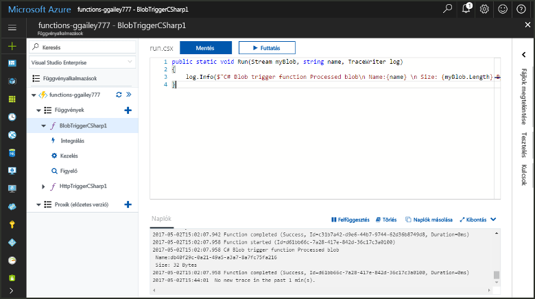
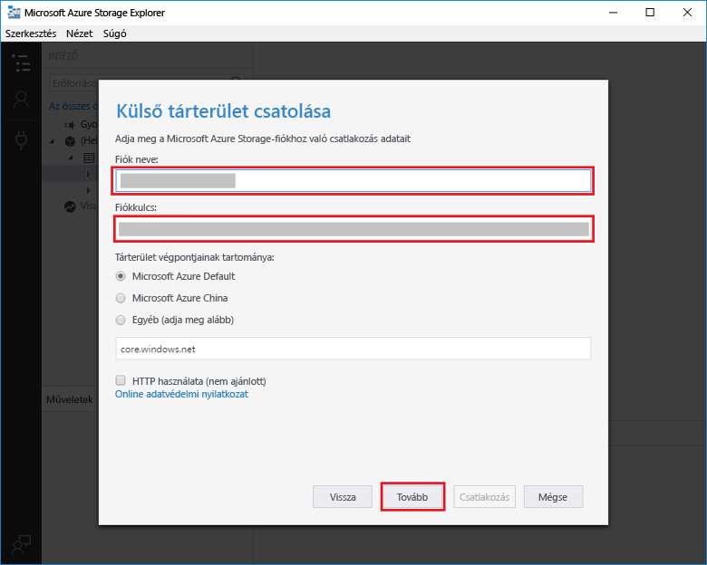
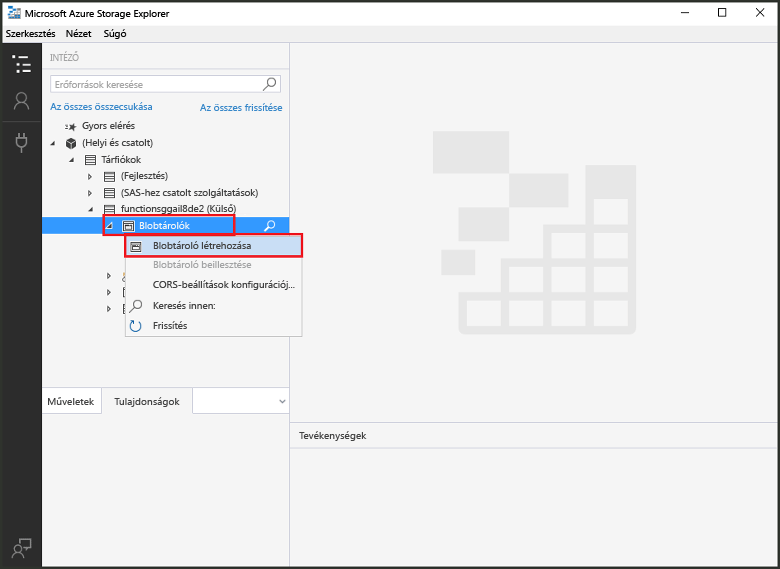
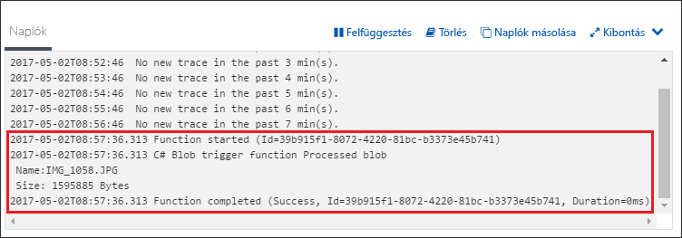

# Azure Blob-tároló által aktivált függvény létrehozása

Ismerje meg, hogyan toocreate váltódik ki, amelyek fájljai egy olyan függvényt feltöltött tooor frissítése az Azure Blob Storage tárolóban.

## Előfeltételek

+ Töltse le és telepítse a hello [Microsoft Azure Tártallózó](http://storageexplorer.com/).
+ Azure-előfizetés. Ha még nincs előfizetése, hozzon létre egy [ingyenes fiókot](https://azure.microsoft.com/free/?WT.mc_id=A261C142F), mielőtt hozzákezd.

[!INCLUDE [functions-portal-favorite-function-apps](../../includes/functions-portal-favorite-function-apps.md)]

## Azure-függvényalkalmazás létrehozása

[!INCLUDE [Create function app Azure portal](../../includes/functions-create-function-app-portal.md)]

A függvény a következő alkalmazásban hello új függvény létrehozása.

## A blobtároló által aktivált függvény létrehozása

1. Bontsa ki a függvény alkalmazást, majd kattintson a hello  **+**  gomb melletti túl**funkciók**. Ha ez az első függvényét hello az függvény alkalmazásban, válassza ki a **egyéni függvény**. Ez a függvény sablonok teljes készletének hello jeleníti meg.

    

2. Jelölje be hello **BlobTrigger** sablont a kívánt nyelvet, és a hello tábla hello-beállítások használata.

    

    | Beállítás | Ajánlott érték | Leírás |
    |---|---|---|
    | **Elérési út**   | mycontainer/{name}    | A figyelt blobtárolóban található hely. hello blob fájlnevét hello átadása hello kötésben szerint hello _neve_ paraméter.  |
    | **Tárfiók kapcsolata** | AzureWebJobStorage | A függvény alkalmazás által már használt hello tárolási fiók kapcsolat használatát, vagy hozzon létre egy újat.  |
    | **A függvény neve** | Egyedi a függvényalkalmazásban | A blob által aktivált függvény neve. |

3. Kattintson a **létrehozása** toocreate a függvény.

A következő tooyour Azure Storage-fiók csatlakozzon, és hozzon létre hello **mycontainer** tároló.

## Hello tároló létrehozása

1. A függvényben kattintson az **Integráció** elemre, bontsa ki a **Dokumentáció** elemet, és másolja a **Fiók neve** és a **Fiók kulcsa** értéket. Ezen hitelesítő adatok tooconnect toohello tárfiókot használni. Ha a tárfiók már csatlakozott, hagyja ki a toostep 4.

    

1. Hello futtatása [Microsoft Azure Tártallózó](http://storageexplorer.com/) eszköz, kattintson a hello hello bal oldali ikon csatlakozni, válassza a **használja a tárfiók nevét és a kulcs**, és kattintson a **következő**.

    

1. Adja meg a hello **fióknév** és **fiókkulcs** 1. lépésben kattintson **következő** , majd **Connect**. 

    

1. Bontsa ki a csatolt hello storage-fiókot, kattintson a jobb gombbal **Blob-tárolók**, kattintson a **létrehozás blob tároló**, típus `mycontainer`, és nyomja meg az enter.

    

Most, hogy a blob-tároló, tesztelheti hello függvény egy fájltároló toohello feltöltésével.

## Hello függvény tesztelése

1. Vissza a hello Azure-portálon, a Tallózás tooyour függvény bontsa ki a hello **naplók** hello alján lévő hello lap, és győződjön meg arról, hogy a napló streaming nem szünetel.

1. A Storage Explorerben bontsa ki a tárfiókját, a **Blobtárolók** és a **saját tároló** elemet. Kattintson a **Feltöltés**, majd a **Fájlok feltöltése...** elemre.

    

1. A hello **fájlok feltöltése** párbeszédpanelen kattintson az hello **fájlok** mező. Keresse meg a helyi számítógépen, például a képfájl tooa fájl, válassza ki azt, és kattintson a **nyitott** , majd **feltöltése**.

1. Lépjen vissza tooyour függvény naplókat, és győződjön meg arról, hogy hello a blob beolvasása megtörtént.

   

    >[!NOTE]
    > A függvény alkalmazás futtatásakor hello alapértelmezett felhasználási tervben lehet tooseveral perc közötti blob folyamatban, vagy frissített hello és hello be késleltetést működéséhez indított alatt. Ha kis késleltetésre van szüksége a blob által aktivált függvényekhez, célszerű App Service-csomagban futtatnia a függvényalkalmazást.

## Az erőforrások eltávolítása

[!INCLUDE [Next steps note](../../includes/functions-quickstart-cleanup.md)]

## Következő lépések

Létrehozott egy függvényt, amely felvételekor futnak blob frissítése tooor a Blob Storage tárolóban. 

[!INCLUDE [Next steps note](../../includes/functions-quickstart-next-steps.md)]

További információ a blobtároló eseményindítóiról: [Azure Functions – a blobtároló kötései](functions-bindings-storage-blob.md).
