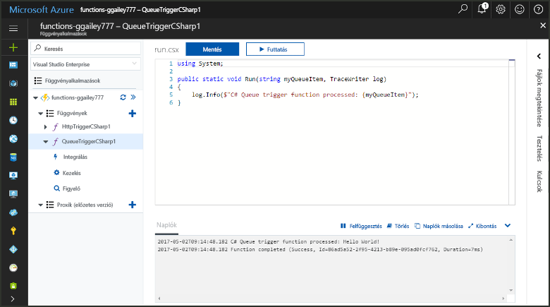
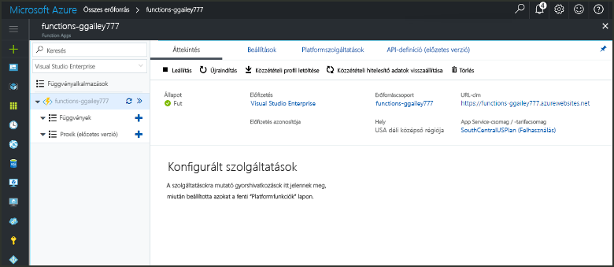
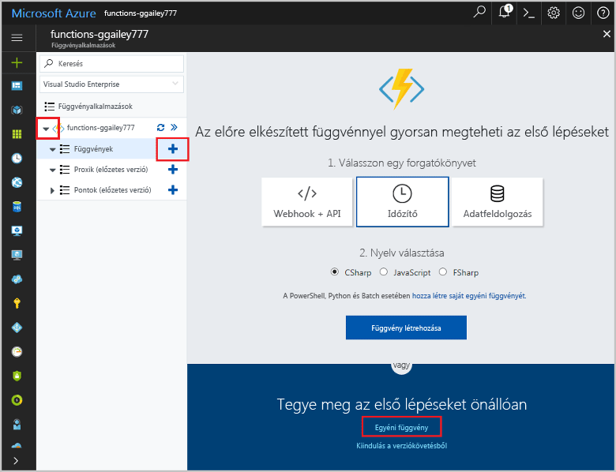
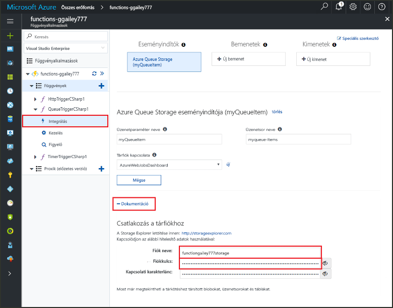
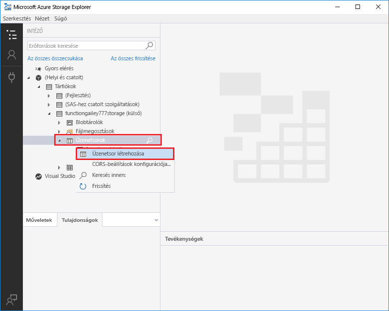
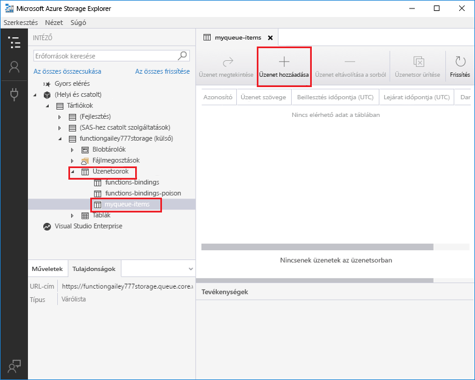
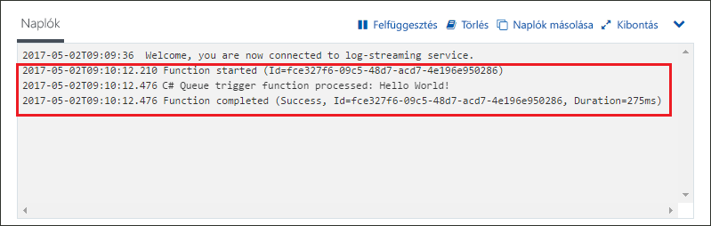

# Azure Storage-üzenetsor által aktivált függvény létrehozásaCreate a function triggered by Azure Queue storage

Ismerje meg, hogyan hozhat létre az Azure Storage üzenetsorába küldött üzenetek által aktivált függvényt.Learn how to create a function triggered when messages are submitted to an Azure Storage queue.

## ElőfeltételekPrerequisites

- A [Microsoft Azure Storage Explorer](http://storageexplorer.com/) letöltése és telepítése.Download and install the [Microsoft Azure Storage Explorer](http://storageexplorer.com/).

- Azure-előfizetés.An Azure subscription. Ha még nincs előfizetése, hozzon létre egy [ingyenes fiókot](https://azure.microsoft.com/free/?WT.mc_id=A261C142F), mielőtt hozzákezd.If you don't have one, create a [free account](https://azure.microsoft.com/free/?WT.mc_id=A261C142F) before you begin.

[!INCLUDE [functions-portal-favorite-function-apps](../../includes/functions-portal-favorite-function-apps.md)]

## Azure-függvényalkalmazás létrehozásaCreate an Azure Function app

[!INCLUDE [Create function app Azure portal](../../includes/functions-create-function-app-portal.md)]

Ezután létrehozhat egy függvényt az új függvényalkalmazásban.Next, you create a function in the new function app.

## Üzenetsor által aktivált függvény létrehozásaCreate a Queue triggered function

1. Bontsa ki a függvényalkalmazást, és kattintson a **Függvények** elem melletti **+** gombra.Expand your function app and click the **+** button next to **Functions**. Ha ez az első függvény a függvényalkalmazásban, jelölje ki az **Egyéni függvény** lehetőséget.If this is the first function in your function app, select **Custom function**. Ez megjeleníti a függvénysablonok teljes készletét.This displays the complete set of function templates.

    

2. Kattintson a választott nyelvhez tartozó **QueueTrigger** sablonra, és használja a táblázatban megadott beállításokat.Select the **QueueTrigger** template for your desired language, and  use the settings as specified in the table.

    
    
    | BeállításSetting | Ajánlott értékSuggested value | LeírásDescription |
    |---|---|---|
    | **Üzenetsor neve****Queue name**   | myqueue-itemsmyqueue-items    | A tárfiókhoz csatlakoztatni kívánt üzenetsor neve.Name of the queue to connect to in your Storage account. |
    | **Tárfiók kapcsolata****Storage account connection** | AzureWebJobStorageAzureWebJobStorage | Választhatja a függvényalkalmazás által már használt tárfiókkapcsolatot, vagy létrehozhat egy újat.You can use the storage account connection already being used by your function app, or create a new one.  |
    | **A függvény neve****Name your function** | Egyedi a függvényalkalmazásbanUnique in your function app | Az üzenetsor által aktivált függvény neve.Name of this queue triggered function. |

3. Kattintson a **Létrehozás** elemre a függvény létrehozásához.Click **Create** to create your function.

Ezután csatlakozzon az Azure Storage-fiókjához, és hozza létre a **myqueue-items** tárolót.Next, you connect to your Azure Storage account and create the **myqueue-items** storage queue.

## Az üzenetsor létrehozásaCreate the queue

1. A függvényben kattintson az **Integráció** elemre, bontsa ki a **Dokumentáció** elemet, és másolja a **Fiók neve** és a **Fiók kulcsa** értéket.In your function, click **Integrate**, expand **Documentation**, and copy both **Account name** and **Account key**. Ezekkel a hitelesítő adatokkal csatlakozhat a tárfiókhoz.You use these credentials to connect to the storage account. Ha már csatlakozott a tárfiókjához, folytassa a 4. lépéssel.If you have already connected your storage account, skip to step 4.

    vv

1. Futtassa a [Microsoft Azure Storage Explorer](http://storageexplorer.com/) eszközt, kattintson a bal oldalon található csatlakozási ikonra, válassza a **Tárfiók nevének és kulcsának használata** lehetőséget, és kattintson a **Tovább** gombra.Run the [Microsoft Azure Storage Explorer](http://storageexplorer.com/) tool, click the connect icon on the left, choose **Use a storage account name and key**, and click **Next**.

    

1. Adja meg az 1. lépésben megállapított **Fiók neve** és **Fiók kulcsa** értéket, és kattintson a **Tovább**, majd a **Csatlakozás** gombra.Enter the **Account name** and **Account key** from step 1, click **Next** and then **Connect**.

    

1. Bontsa ki a csatolt tárfiókot, kattintson a jobb gombbal az **Üzenetsorok** elemre, kattintson az **Üzenetsor létrehozása** elemre, írja be a `myqueue-items` értéket, és nyomja meg az Enter billentyűt.Expand the attached storage account, right-click **Queues**, click **Create queue**, type `myqueue-items`, and then press enter.

    

Az üzenetsor létrehozása után tesztelheti a függvényt úgy, hogy felvesz egy üzenetet az üzenetsorba.Now that you have a storage queue, you can test the function by adding a message to the queue.

## A függvény teszteléseTest the function

1. Térjen vissza az Azure Portalra, keresse meg a függvényt, bontsa ki a **Naplók** elemet a lap alján, és győződjön meg arról, hogy a naplózási adatfolyam nincs leállítva.Back in the Azure portal, browse to your function expand the **Logs** at the bottom of the page and make sure that log streaming isn't paused.

1. A Storage Explorerben bontsa ki a tárfiókot, az **Üzenetsorok**, majd az **üzenetsorelemek** elemet, és kattintson az **Üzenet hozzáadása** elemre.In Storage Explorer, expand your storage account, **Queues**, and **myqueue-items**, then click **Add message**.

    

1. Írja be a „Hello World!”Type your "Hello World!" üzenetet az **Üzenet szövege** mezőbe, és kattintson az **OK** gombra.message in **Message text** and click **OK**.

1. Várjon néhány másodpercet, majd térjen vissza a függvény naplóihoz, és győződjön meg arról, hogy megtörtént az új üzenet olvasása az üzenetsorból.Wait for a few seconds, then go back to your function logs and verify that the new message has been read from the queue.

    

1. Térjen vissza a Storage Explorerbe, kattintson a **Frissítés** elemre, és ellenőrizze, hogy megtörtént-e az üzenet feldolgozása, és hogy el lett-e távolítva az üzenetsorból.Back in Storage Explorer, click **Refresh** and verify that the message has been processed and is no longer in the queue.

## Az erőforrások eltávolításaClean up resources

[!INCLUDE [Next steps note](../../includes/functions-quickstart-cleanup.md)]

## Következő lépésekNext steps

Létrehozott egy függvényt, amely akkor fut, amikor üzenet felvétele történik a tárolási üzenetsorba.You have created a function that runs when a message is added to a storage queue.

[!INCLUDE [Next steps note](../../includes/functions-quickstart-next-steps.md)]

További információ a tárolási üzenetsor eseményindítóiról: [Azure Functions – a tárolási üzenetsor kötései](functions-bindings-storage-queue.md).For more information about Queue storage triggers, see [Azure Functions Storage queue bindings](functions-bindings-storage-queue.md).