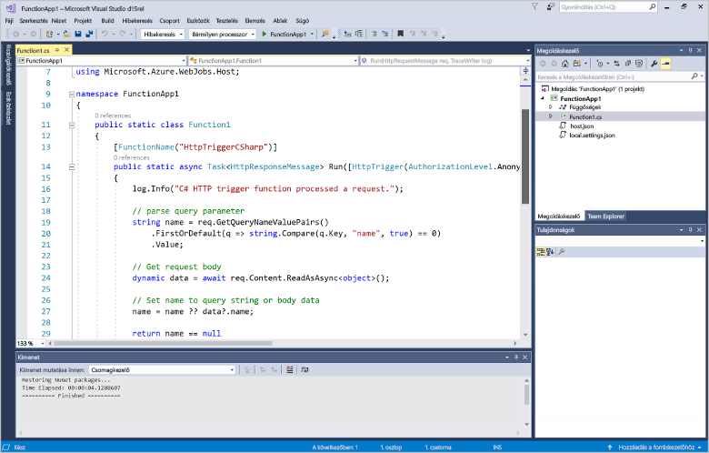
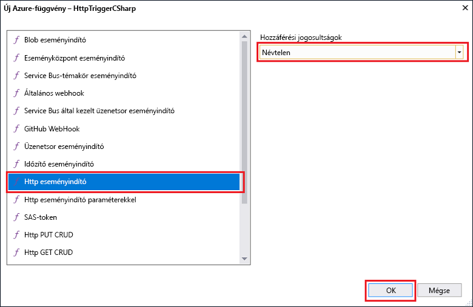

# Az első függvény létrehozása a Visual Studio használatávalCreate your first function using Visual Studio

Az Azure Functions lehetővé teszi, hogy a kód egy kiszolgáló nélküli környezetben anélkül, hogy hozzon létre egy virtuális Gépet, vagy tegye közzé a webalkalmazást toofirst hajtható végre.Azure Functions lets you execute your code in a serverless environment without having toofirst create a VM or publish a web application.

Ebben a témakörben elsajátíthatja, hogyan toouse hello Azure Functions toocreate Visual Studio 2017 eszközei és a "hello world" függvény helyi tesztelése.In this topic, you learn how toouse hello Visual Studio 2017 tools for Azure Functions toocreate and test a "hello world" function locally. Ezután a hello függvény kód tooAzure tesznek közzé.You will then publish hello function code tooAzure. Ezek az eszközök érhetők el, vagy a Visual Studio 2017 verzió 15.3 hello Azure fejlesztési munkaterhelés részeként egy újabb verziója.These tools are available as part of hello Azure development workload in Visual Studio 2017 version 15.3, or a later version.

## ElőfeltételekPrerequisites

toocomplete oktatóanyag, telepítés:toocomplete this tutorial, install:

* [A Visual Studio 2017 verzió 15.3](https://www.visualstudio.com/vs/preview/), beleértve a hello **Azure fejlesztési** munkaterhelés.[Visual Studio 2017 version 15.3](https://www.visualstudio.com/vs/preview/), including hello **Azure development** workload.

    
    
    >[!NOTE]  
    TooVisual Studio 2017 15.3 verzió frissítése vagy telepítése után szükség lehet toomanually frissítés hello Visual Studio 2017 eszközök az Azure Functions.After you install or upgrade tooVisual Studio 2017 version 15.3, you might also need toomanually update hello Visual Studio 2017 tools for Azure Functions. Frissítheti a hello hello eszközök **eszközök** menüt **bővítmények és frissítések...**   >  **Frissítések** > **Visual Studio piactér** > **az Azure Functions és webes feladatok eszközök**  >  **Frissítés**.You can update hello tools from hello **Tools** menu under **Extensions and Updates...** > **Updates** > **Visual Studio Marketplace** > **Azure Functions and Web Jobs Tools** > **Update**. 

[!INCLUDE [quickstarts-free-trial-note](../../includes/quickstarts-free-trial-note.md)] 

## Hozzon létre egy Azure Functions-projektet a Visual StudióbanCreate an Azure Functions project in Visual Studio

[!INCLUDE [Create a project using hello Azure Functions template](../../includes/functions-vstools-create.md)]

Most, hogy a létrehozott hello projekt, az első függvényét is létrehozhat.Now that you have created hello project, you can create your first function.

## Hello függvény létrehozásaCreate hello function

1. A **Solution Explorer** (Megoldáskezelő) felületén kattintson a jobb gombbal a projektcsomópontra, majd válassza az **Add** (Hozzáadás)  > **New Item** (Új elem) lehetőséget.In **Solution Explorer**, right-click on your project node and select **Add** > **New Item**. Válassza ki az **Azure Function** (Azure-függvény) elemet, majd kattintson az **Add** (Hozzáadás) lehetőségre.Select **Azure Function** and click **Add**.

2. Válassza ki a **HttpTrigger** elemet, adja meg a **Function Name** (Függvénynév) értékét, az **Access Rights** (Hozzáférési jog) lehetőségnél válassza az **Anonymous** (Névtelen) elemet, majd kattintson a **Create** (Létrehozás) lehetőségre.Select **HttpTrigger**, type a **Function Name**, select **Anonymous** for **Access Rights**, and click **Create**. bármely ügyfél HTTP-kérelem által létrehozott hello függvény érhető el.hello function created is accessed by an HTTP request from any client. 

    

    A forráskód fájlja kerül tooyour projekt, amely tartalmaz egy osztály, amely megvalósítja a funkciókódot.A code file is added tooyour project that contains a class that implements your function code. Ez a kód egy sablon, amely fogad egy név-érték és vissza Echok alapul.This code is based on a template, which receives a name value and echos it back. Hello **függvénynév** attribútum állítja be a függvény hello neve.hello **FunctionName** attribute sets hello name of your function. Hello **HttpTrigger** attribútum, amely elindítja a hello függvény üdvözlőüzenetére jelzi.hello **HttpTrigger** attribute indicates hello message that triggers hello function. 

    

Most, hogy már létrehozta a HTTP-triggerrel aktivált függvényt, tesztelheti a helyi számítógépen.Now that you have created an HTTP-triggered function, you can test it on your local computer.

## Helyileg hello függvény teszteléseTest hello function locally

Az Azure Functions Core Tools lehetővé teszi Azure Functions-projektek helyi fejlesztői számítógépen való futtatását.Azure Functions Core Tools lets you run Azure Functions project on your local development computer. Ezek az eszközök hello első indításakor függvény Visual Studio felszólító tooinstall áll.You are prompted tooinstall these tools hello first time you start a function from Visual Studio.  

1. tootest a függvény, nyomja le az F5 billentyűt.tootest your function, press F5. Ha a rendszer kéri, fogadja el a Visual Studio toodownload hello kérelmet, és telepítse az Azure Functions mag (CLI) eszközök.If prompted, accept hello request from Visual Studio toodownload and install Azure Functions Core (CLI) tools.  Szükség lehet a tooenable olyan érvényes tűzfalkivétel, hogy hello eszközök kezelni tud a HTTP-kérelmekre.You may also need tooenable a firewall exception so that hello tools can handle HTTP requests.

2. Másolás hello URL-CÍMÉT a függvényt a hello Azure Functions futtatókörnyezettel kimeneti.Copy hello URL of your function from hello Azure Functions runtime output.  

    

3. Hello URL-cím a HTTP-kérelmek hello illessze be a böngésző címsorába.Paste hello URL for hello HTTP request into your browser's address bar. Hello lekérdezési karakterlánc hozzáfűzése `&name=<yourname>` toothis URL-cím és hello kérelem végrehajtása.Append hello query string `&name=<yourname>` toothis URL and execute hello request. hello következő hello válasz hello böngésző toohello helyi GET kérelem hello függvény által visszaadott jeleníti meg:hello following shows hello response in hello browser toohello local GET request returned by hello function: 

    

4. hibakeresés, toostop kattintson hello **leállítása** hello Visual Studio gombjára.toostop debugging, click hello **Stop** button on hello Visual Studio toolbar.

Miután ellenőrizte, hogy a hello függvény megfelelően fut a helyi számítógépen, akkor idő toopublish hello projekt tooAzure.After you have verified that hello function runs correctly on your local computer, it's time toopublish hello project tooAzure.

## Hello projekt tooAzure közzétételePublish hello project tooAzure

A projekt közzétételéhez rendelkeznie kell egy függvényalkalmazással.az Azure-előfizetéséhez.You must have a function app in your Azure subscription before you can publish your project. Közvetlenül a Visual Studióból is létrehozhat függvényalkalmazást.You can create a function app right from Visual Studio.

[!INCLUDE [Publish hello project tooAzure](../../includes/functions-vstools-publish.md)]

## A függvény tesztelése az Azure-banTest your function in Azure

1. Hello alap URL-Címének másolása hello függvény alkalmazás hello közzétételi profil oldalról.Copy hello base URL of hello function app from hello Publish profile page. Cserélje le a hello `localhost:port` hello hello függvény hello új alap URL-címet a helyi tesztelése során használt URL-cím része.Replace hello `localhost:port` portion of hello URL you used when testing hello function locally with hello new base URL. Mint korábban, győződjön meg arról, hogy tooappend hello lekérdezési karakterlánc `&name=<yourname>` toothis URL-cím és hello kérelem végrehajtása.As before, make sure tooappend hello query string `&name=<yourname>` toothis URL and execute hello request.

    hello URL-címet, amely behívja a HTTP függvény néz indított:hello URL that calls your HTTP triggered function looks like this:

        http://<functionappname>.azurewebsites.net/api/<functionname>?name=<yourname> 

2. Az új URL-cím hello HTTP-kérelem illessze be a böngésző címsorába.Paste this new URL for hello HTTP request into your browser's address bar. hello következő hello válasz hello böngésző toohello távoli GET kérelem hello függvény által visszaadott jeleníti meg:hello following shows hello response in hello browser toohello remote GET request returned by hello function: 

    
 
## Következő lépésekNext steps

Visual Studio toocreate egy C# függvény alkalmazás használta egy egyszerű indított HTTP függvénnyel.You have used Visual Studio toocreate a C# function app with a simple HTTP triggered function. 

+ toolearn hogyan tooconfigure a projekt toosupport eseményindítók és kötések, más típusú, lásd: hello [konfigurálása hello projekt helyi fejlesztési](functions-develop-vs.md#configure-the-project-for-local-development) szakasz [Azure Functions Tools for Visual Studio](functions-develop-vs.md).toolearn how tooconfigure your project toosupport other types of triggers and bindings, see hello [Configure hello project for local development](functions-develop-vs.md#configure-the-project-for-local-development) section in [Azure Functions Tools for Visual Studio](functions-develop-vs.md).
+ További információ a helyi tesztelés és hibakeresés hello Azure Functions alapvető eszközökkel toolearn lásd: [kódot és az Azure Functions tesztelése helyileg](functions-run-local.md).toolearn more about local testing and debugging using hello Azure Functions Core Tools, see [Code and test Azure Functions locally](functions-run-local.md). 
+ További információ az alkalmazás, mint funkciók fejlesztése toolearn lásd [használó alkalmazás az Azure Functions](functions-dotnet-class-library.md).toolearn more about developing functions as .NET class libraries, see [Using .NET class libraries with Azure Functions](functions-dotnet-class-library.md). 

