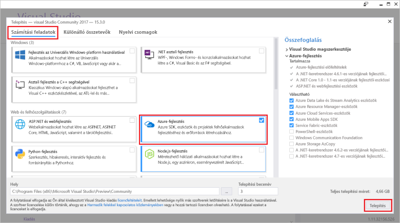

# Az első függvény létrehozása a Visual Studio használatával

Az Azure Functions lehetővé teszi, hogy a kód egy kiszolgáló nélküli környezetben anélkül, hogy hozzon létre egy virtuális Gépet, vagy tegye közzé a webalkalmazást toofirst hajtható végre.

Ebben a témakörben elsajátíthatja, hogyan toouse hello Azure Functions toocreate Visual Studio 2017 eszközei és a "hello world" függvény helyi tesztelése. Ezután a hello függvény kód tooAzure tesznek közzé. Ezek az eszközök érhetők el, vagy a Visual Studio 2017 verzió 15.3 hello Azure fejlesztési munkaterhelés részeként egy újabb verziója.

## Előfeltételek

toocomplete oktatóanyag, telepítés:

* [A Visual Studio 2017 verzió 15.3](https://www.visualstudio.com/vs/preview/), beleértve a hello **Azure fejlesztési** munkaterhelés.

    
    
    >[!NOTE]  
    TooVisual Studio 2017 15.3 verzió frissítése vagy telepítése után szükség lehet toomanually frissítés hello Visual Studio 2017 eszközök az Azure Functions. Frissítheti a hello hello eszközök **eszközök** menüt **bővítmények és frissítések...**   >  **Frissítések** > **Visual Studio piactér** > **az Azure Functions és webes feladatok eszközök**  >  **Frissítés**. 

[!INCLUDE [quickstarts-free-trial-note](../../includes/quickstarts-free-trial-note.md)] 

## Hozzon létre egy Azure Functions-projektet a Visual Studióban

[!INCLUDE [Create a project using hello Azure Functions template](../../includes/functions-vstools-create.md)]

Most, hogy a létrehozott hello projekt, az első függvényét is létrehozhat.

## Hello függvény létrehozása

1. A **Solution Explorer** (Megoldáskezelő) felületén kattintson a jobb gombbal a projektcsomópontra, majd válassza az **Add** (Hozzáadás)  > **New Item** (Új elem) lehetőséget. Válassza ki az **Azure Function** (Azure-függvény) elemet, majd kattintson az **Add** (Hozzáadás) lehetőségre.

2. Válassza ki a **HttpTrigger** elemet, adja meg a **Function Name** (Függvénynév) értékét, az **Access Rights** (Hozzáférési jog) lehetőségnél válassza az **Anonymous** (Névtelen) elemet, majd kattintson a **Create** (Létrehozás) lehetőségre. bármely ügyfél HTTP-kérelem által létrehozott hello függvény érhető el. 

    

    A forráskód fájlja kerül tooyour projekt, amely tartalmaz egy osztály, amely megvalósítja a funkciókódot. Ez a kód egy sablon, amely fogad egy név-érték és vissza Echok alapul. Hello **függvénynév** attribútum állítja be a függvény hello neve. Hello **HttpTrigger** attribútum, amely elindítja a hello függvény üdvözlőüzenetére jelzi. 

    

Most, hogy már létrehozta a HTTP-triggerrel aktivált függvényt, tesztelheti a helyi számítógépen.

## Helyileg hello függvény tesztelése

Az Azure Functions Core Tools lehetővé teszi Azure Functions-projektek helyi fejlesztői számítógépen való futtatását. Ezek az eszközök hello első indításakor függvény Visual Studio felszólító tooinstall áll.  

1. tootest a függvény, nyomja le az F5 billentyűt. Ha a rendszer kéri, fogadja el a Visual Studio toodownload hello kérelmet, és telepítse az Azure Functions mag (CLI) eszközök.  Szükség lehet a tooenable olyan érvényes tűzfalkivétel, hogy hello eszközök kezelni tud a HTTP-kérelmekre.

2. Másolás hello URL-CÍMÉT a függvényt a hello Azure Functions futtatókörnyezettel kimeneti.  

    

3. Hello URL-cím a HTTP-kérelmek hello illessze be a böngésző címsorába. Hello lekérdezési karakterlánc hozzáfűzése `&name=<yourname>` toothis URL-cím és hello kérelem végrehajtása. hello következő hello válasz hello böngésző toohello helyi GET kérelem hello függvény által visszaadott jeleníti meg: 

    

4. hibakeresés, toostop kattintson hello **leállítása** hello Visual Studio gombjára.

Miután ellenőrizte, hogy a hello függvény megfelelően fut a helyi számítógépen, akkor idő toopublish hello projekt tooAzure.

## Hello projekt tooAzure közzététele

A projekt közzétételéhez rendelkeznie kell egy függvényalkalmazással.az Azure-előfizetéséhez. Közvetlenül a Visual Studióból is létrehozhat függvényalkalmazást.

[!INCLUDE [Publish hello project tooAzure](../../includes/functions-vstools-publish.md)]

## A függvény tesztelése az Azure-ban

1. Hello alap URL-Címének másolása hello függvény alkalmazás hello közzétételi profil oldalról. Cserélje le a hello `localhost:port` hello hello függvény hello új alap URL-címet a helyi tesztelése során használt URL-cím része. Mint korábban, győződjön meg arról, hogy tooappend hello lekérdezési karakterlánc `&name=<yourname>` toothis URL-cím és hello kérelem végrehajtása.

    hello URL-címet, amely behívja a HTTP függvény néz indított:

        http://<functionappname>.azurewebsites.net/api/<functionname>?name=<yourname> 

2. Az új URL-cím hello HTTP-kérelem illessze be a böngésző címsorába. hello következő hello válasz hello böngésző toohello távoli GET kérelem hello függvény által visszaadott jeleníti meg: 

    
 
## Következő lépések

Visual Studio toocreate egy C# függvény alkalmazás használta egy egyszerű indított HTTP függvénnyel. 

+ toolearn hogyan tooconfigure a projekt toosupport eseményindítók és kötések, más típusú, lásd: hello [konfigurálása hello projekt helyi fejlesztési](functions-develop-vs.md#configure-the-project-for-local-development) szakasz [Azure Functions Tools for Visual Studio](functions-develop-vs.md).
+ További információ a helyi tesztelés és hibakeresés hello Azure Functions alapvető eszközökkel toolearn lásd: [kódot és az Azure Functions tesztelése helyileg](functions-run-local.md). 
+ További információ az alkalmazás, mint funkciók fejlesztése toolearn lásd [használó alkalmazás az Azure Functions](functions-dotnet-class-library.md). 

