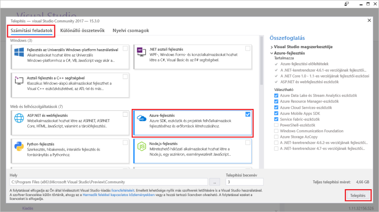

# <a name="azure-functions-tools-for-visual-studio"></a><span data-ttu-id="f79fd-103">Az Azure Functions Tools for Visual Studio</span><span class="sxs-lookup"><span data-stu-id="f79fd-103">Azure Functions Tools for Visual Studio</span></span>  

<span data-ttu-id="f79fd-104">Az Azure funkciók Tools for Visual Studio 2017 bővítménye, amely lehetővé teszi a fejlesztés, tesztelése és C# funkciók tooAzure telepítése a Visual Studio.</span><span class="sxs-lookup"><span data-stu-id="f79fd-104">Azure Functions Tools for Visual Studio 2017 is an extension for Visual Studio that lets you develop, test, and deploy C# functions tooAzure.</span></span> <span data-ttu-id="f79fd-105">Ha ez az első tapasztalattal az Azure Functions, többet is megtudhat a [egy bevezető tooAzure működik](functions-overview.md).</span><span class="sxs-lookup"><span data-stu-id="f79fd-105">If this is your first experience with Azure Functions, you can learn more at [An introduction tooAzure Functions](functions-overview.md).</span></span>

<span data-ttu-id="f79fd-106">hello Azure Functions eszközök hello a következő előnyöket biztosítja:</span><span class="sxs-lookup"><span data-stu-id="f79fd-106">hello Azure Functions Tools provides hello following benefits:</span></span> 

* <span data-ttu-id="f79fd-107">Szerkesztés, elkészítéséhez és funkciók a helyi fejlesztési számítógépen futtassa.</span><span class="sxs-lookup"><span data-stu-id="f79fd-107">Edit, build, and run functions on your local development computer.</span></span> 
* <span data-ttu-id="f79fd-108">Közzététel az Azure Functions közvetlenül a projekt tooAzure.</span><span class="sxs-lookup"><span data-stu-id="f79fd-108">Publish your Azure Functions project directly tooAzure.</span></span> 
* <span data-ttu-id="f79fd-109">Webjobs-feladatok attribútumok toodeclare függvénykötés közvetlenül hello C#-kódban helyett egy külön function.json a definíciók kötési karbantartása használja.</span><span class="sxs-lookup"><span data-stu-id="f79fd-109">Use WebJobs attributes toodeclare function bindings directly in hello C# code instead of maintaining a separate function.json for binding definitions.</span></span>
* <span data-ttu-id="f79fd-110">Fejlesztésekor, és előre lefordított függvények C# telepítésekor.</span><span class="sxs-lookup"><span data-stu-id="f79fd-110">Develop and deploy pre-compiled C# functions.</span></span> <span data-ttu-id="f79fd-111">Előre lefordított függvények teljesítményt lehet biztosítani a jobban cold indítási mint C# parancsfájlalapú funkciók.</span><span class="sxs-lookup"><span data-stu-id="f79fd-111">Pre-complied functions provide a better cold-start performance than C# script-based functions.</span></span> 
* <span data-ttu-id="f79fd-112">A funkciók a C# code során a teljes Visual Studio fejlesztői hello előnyeit.</span><span class="sxs-lookup"><span data-stu-id="f79fd-112">Code your functions in C# while having all of hello benefits of Visual Studio development.</span></span> 

<span data-ttu-id="f79fd-113">Ez a témakör bemutatja, hogyan toouse hello Azure Functions eszközök Visual Studio 2017 toodevelop C# függvényeit.</span><span class="sxs-lookup"><span data-stu-id="f79fd-113">This topic shows you how toouse hello Azure Functions Tools for Visual Studio 2017 toodevelop your functions in C#.</span></span> <span data-ttu-id="f79fd-114">Azt is megtudhatja, hogyan toopublish a projekt tooAzure, mint a .NET-szerelvény.</span><span class="sxs-lookup"><span data-stu-id="f79fd-114">You also learn how toopublish your project tooAzure as a .NET assembly.</span></span>

## <a name="prerequisites"></a><span data-ttu-id="f79fd-115">Előfeltételek</span><span class="sxs-lookup"><span data-stu-id="f79fd-115">Prerequisites</span></span>

<span data-ttu-id="f79fd-116">Az Azure Functions eszközök megtalálható hello Azure fejlesztési munkaterhelését [Visual Studio 2017 verzió 15.3](https://www.visualstudio.com/vs/), vagy újabb verziója.</span><span class="sxs-lookup"><span data-stu-id="f79fd-116">Azure Functions Tools is included in hello Azure development workload of [Visual Studio 2017 version 15.3](https://www.visualstudio.com/vs/), or a later version.</span></span> <span data-ttu-id="f79fd-117">Győződjön meg arról, hello **Azure fejlesztési** munkaterhelés a Visual Studio 2017 15.3 verzió telepítése:</span><span class="sxs-lookup"><span data-stu-id="f79fd-117">Make sure you include hello **Azure development** workload in your Visual Studio 2017 version 15.3 installation:</span></span>



<span data-ttu-id="f79fd-119">toocreate és funkciók, a rendszer szükség:</span><span class="sxs-lookup"><span data-stu-id="f79fd-119">toocreate and deploy functions, you also need:</span></span>

* <span data-ttu-id="f79fd-120">Aktív Azure-előfizetés.</span><span class="sxs-lookup"><span data-stu-id="f79fd-120">An active Azure subscription.</span></span> <span data-ttu-id="f79fd-121">Ha nem rendelkezik Azure-előfizetéssel, [fiókok szabad](https://azure.microsoft.com/free/?WT.mc_id=A261C142F) érhetők el.</span><span class="sxs-lookup"><span data-stu-id="f79fd-121">If you don't have an Azure subscription, [free accounts](https://azure.microsoft.com/free/?WT.mc_id=A261C142F) are available.</span></span>

* <span data-ttu-id="f79fd-122">Egy Azure Storage-fiókot.</span><span class="sxs-lookup"><span data-stu-id="f79fd-122">An Azure Storage account.</span></span> <span data-ttu-id="f79fd-123">a tárfiók toocreate lásd: [hozzon létre egy tárfiókot](../storage/common/storage-create-storage-account.md#create-a-storage-account).</span><span class="sxs-lookup"><span data-stu-id="f79fd-123">toocreate a storage account, see [Create a storage account](../storage/common/storage-create-storage-account.md#create-a-storage-account).</span></span>  
## <a name="create-an-azure-functions-project"></a><span data-ttu-id="f79fd-124">Az Azure Functions projekt létrehozása</span><span class="sxs-lookup"><span data-stu-id="f79fd-124">Create an Azure Functions project</span></span> 

[!INCLUDE [Create a project using hello Azure Functions](../../includes/functions-vstools-create.md)]


## <a name="configure-hello-project-for-local-development"></a><span data-ttu-id="f79fd-125">Helyi fejlesztési hello projekt konfigurálása</span><span class="sxs-lookup"><span data-stu-id="f79fd-125">Configure hello project for local development</span></span>

<span data-ttu-id="f79fd-126">Amikor egy új projektet hello Azure Functions sablonnal hoz létre, egy üres C# projekt, amely tartalmazza a következő fájlok hello elérhetővé:</span><span class="sxs-lookup"><span data-stu-id="f79fd-126">When you create a new project using hello Azure Functions template, you get an empty C# project that contains hello following files:</span></span>

* <span data-ttu-id="f79fd-127">**Host.JSON**: konfigurálását teszi lehetővé hello funkciók állomás.</span><span class="sxs-lookup"><span data-stu-id="f79fd-127">**host.json**: Lets you configure hello Functions host.</span></span> <span data-ttu-id="f79fd-128">Ezeket a beállításokat is alkalmazza, ha fut a helyi és az Azure-ban is.</span><span class="sxs-lookup"><span data-stu-id="f79fd-128">These settings apply both when running locally and in Azure.</span></span> <span data-ttu-id="f79fd-129">További információkért lásd: [host.json](https://github.com/Azure/azure-webjobs-sdk-script/wiki/host.json) áttekintésével foglalkozó cikkben.</span><span class="sxs-lookup"><span data-stu-id="f79fd-129">For more information, see [host.json](https://github.com/Azure/azure-webjobs-sdk-script/wiki/host.json) reference article.</span></span>
    
* <span data-ttu-id="f79fd-130">**Local.Settings.JSON**: funkciók a helyi futtatás során használt beállításokat tárolja.</span><span class="sxs-lookup"><span data-stu-id="f79fd-130">**local.settings.json**: Maintains settings used when running functions locally.</span></span> <span data-ttu-id="f79fd-131">Ezek a beállítások nem használhatók az Azure-ban, hello használják [Azure Functions Core eszközök](functions-run-local.md).</span><span class="sxs-lookup"><span data-stu-id="f79fd-131">These settings are not used by Azure, they are used by hello [Azure Functions Core Tools](functions-run-local.md).</span></span> <span data-ttu-id="f79fd-132">Használja a toospecify beállításai, például kapcsolati karakterláncok tooother Azure szolgáltatások.</span><span class="sxs-lookup"><span data-stu-id="f79fd-132">Use this file toospecify settings, such as connection strings tooother Azure services.</span></span> <span data-ttu-id="f79fd-133">Adja hozzá egy új kulcs toohello **értékek** tömb minden egyes funkciók a projekt által igényelt kapcsolathoz.</span><span class="sxs-lookup"><span data-stu-id="f79fd-133">Add a new key toohello **Values** array for each connection required by functions in your project.</span></span> <span data-ttu-id="f79fd-134">További információkért lásd: [helyi beállításfájl](functions-run-local.md#local-settings-file) hello Azure Functions Core eszközök témakörben.</span><span class="sxs-lookup"><span data-stu-id="f79fd-134">For more information, see [Local settings file](functions-run-local.md#local-settings-file) in hello Azure Functions Core Tools topic.</span></span>

<span data-ttu-id="f79fd-135">hello Functions futtatókörnyezete belső egy Azure Storage-fiókot használja.</span><span class="sxs-lookup"><span data-stu-id="f79fd-135">hello Functions runtime uses an Azure Storage account internally.</span></span> <span data-ttu-id="f79fd-136">Összes indítás típusú HTTP- és webhookokkal, be kell állítani hello **Values.AzureWebJobsStorage** kulcs tooa érvényes Azure tárolási fiók kapcsolati karakterlánc.</span><span class="sxs-lookup"><span data-stu-id="f79fd-136">For all trigger types other than HTTP and webhooks, you must set hello **Values.AzureWebJobsStorage** key tooa valid Azure Storage account connection string.</span></span>

[!INCLUDE [Note toonot use local storage](../../includes/functions-local-settings-note.md)]

 <span data-ttu-id="f79fd-137">tooset hello tárolási fiók kapcsolati karakterlánc:</span><span class="sxs-lookup"><span data-stu-id="f79fd-137">tooset hello storage account connection string:</span></span>

1. <span data-ttu-id="f79fd-138">A Visual Studióban nyissa meg a **Cloud Explorer**, bontsa ki a **Tárfiók** > **a Tárfiók**, majd jelölje be **tulajdonságok**és másolási hello **elsődleges kapcsolódási karakterlánc** érték.</span><span class="sxs-lookup"><span data-stu-id="f79fd-138">In Visual Studio, open **Cloud Explorer**, expand **Storage Account** > **Your Storage Account**, then select **Properties** and copy hello **Primary Connection String** value.</span></span>   

2. <span data-ttu-id="f79fd-139">A projektben nyissa meg hello local.settings.json projekt fájlt, és állítsa be hello hello **AzureWebJobsStorage** kimásolt kapcsolati karakterláncot toohello kulcsát.</span><span class="sxs-lookup"><span data-stu-id="f79fd-139">In your project, open hello local.settings.json project file and set hello value of hello **AzureWebJobsStorage** key toohello connection string you copied.</span></span>

3. <span data-ttu-id="f79fd-140">Ismételje meg a hello előző lépés tooadd egyedi kulcsok toohello **értékek** bármely más, a funkciók által igényelt kapcsolatok tömb.</span><span class="sxs-lookup"><span data-stu-id="f79fd-140">Repeat hello previous step tooadd unique keys toohello **Values** array for any other connections required by your functions.</span></span>  

## <a name="create-a-function"></a><span data-ttu-id="f79fd-141">Függvény létrehozása</span><span class="sxs-lookup"><span data-stu-id="f79fd-141">Create a function</span></span>

<span data-ttu-id="f79fd-142">A előre lefordított függvények a hello függvény által használt hello kötéseket hello kódban attribútumok alkalmazása alapján határozzák meg.</span><span class="sxs-lookup"><span data-stu-id="f79fd-142">In pre-compiled functions, hello bindings used by hello function are defined by applying attributes in hello code.</span></span> <span data-ttu-id="f79fd-143">Hello Azure Functions eszközök toocreate a megadott hello sablonok funkciókat használ, ezek az attribútumok meg válnak érvényessé.</span><span class="sxs-lookup"><span data-stu-id="f79fd-143">When you use hello Azure Functions Tools toocreate your functions from hello provided templates, these attributes are applied for you.</span></span> 

1. <span data-ttu-id="f79fd-144">A **Solution Explorer** (Megoldáskezelő) felületén kattintson a jobb gombbal a projektcsomópontra, majd válassza az **Add** (Hozzáadás)  > **New Item** (Új elem) lehetőséget.</span><span class="sxs-lookup"><span data-stu-id="f79fd-144">In **Solution Explorer**, right-click on your project node and select **Add** > **New Item**.</span></span> <span data-ttu-id="f79fd-145">Válassza ki **Azure-függvény**, adjon meg egy **neve** hello osztályt, majd kattintson a **Hozzáadás**.</span><span class="sxs-lookup"><span data-stu-id="f79fd-145">Select **Azure Function**, type a **Name** for hello class, and click **Add**.</span></span>

2. <span data-ttu-id="f79fd-146">Válassza ki az eseményindító, hello beállítása a kötési tulajdonságok, majd kattintson **létrehozása**.</span><span class="sxs-lookup"><span data-stu-id="f79fd-146">Choose your trigger, set hello binding properties, and click **Create**.</span></span> <span data-ttu-id="f79fd-147">hello következő példa bemutatja hello beállítások kiváltásakor a várólista-tároló létrehozása funkciót.</span><span class="sxs-lookup"><span data-stu-id="f79fd-147">hello following example shows hello settings when creating a Queue storage triggered function.</span></span> 

    
    
    <span data-ttu-id="f79fd-148">Nevű kapcsolati karakterlánc kulcs **QueueStorage** van megadva, amely hello local.settings.json fájlban van megadva.</span><span class="sxs-lookup"><span data-stu-id="f79fd-148">A connection string key named **QueueStorage** is supplied, which is defined in hello local.settings.json file.</span></span> 
 
3. <span data-ttu-id="f79fd-149">Vizsgálja meg hello újonnan hozzáadott osztály.</span><span class="sxs-lookup"><span data-stu-id="f79fd-149">Examine hello newly added class.</span></span> <span data-ttu-id="f79fd-150">Megjelenik a statikus **futtatása** metódus, amely a hello tudható **függvénynév** attribútum.</span><span class="sxs-lookup"><span data-stu-id="f79fd-150">You see a static **Run** method, that is attributed with hello **FunctionName** attribute.</span></span> <span data-ttu-id="f79fd-151">Ez az attribútum azt jelzi, hogy hello metódus hello függvény hello összes belépési pontjához.</span><span class="sxs-lookup"><span data-stu-id="f79fd-151">This attribute indicates that hello method is hello entry point for hello function.</span></span> 

    <span data-ttu-id="f79fd-152">A következő C# osztály hello például egy alapszintű várólista indított tárolási függvény jelöli:</span><span class="sxs-lookup"><span data-stu-id="f79fd-152">For example, hello following C# class represents a basic Queue storage triggered function:</span></span>

    ````csharp
    using System;
    using Microsoft.Azure.WebJobs;
    using Microsoft.Azure.WebJobs.Host;
    
    namespace FunctionApp1
    {
        public static class Function1
        {
            [FunctionName("QueueTriggerCSharp")]        
            public static void Run([QueueTrigger("myqueue-items", Connection = "QueueStorage")]string myQueueItem, TraceWriter log)
            {
                log.Info($"C# Queue trigger function processed: {myQueueItem}");
            }
        }
    } 
    ````
 
    <span data-ttu-id="f79fd-153">A kötés-specifikus attribútummal alkalmazott tooeach kötés a megadott paraméter toohello belépési pont metódusa.</span><span class="sxs-lookup"><span data-stu-id="f79fd-153">A binding-specific attribute is applied tooeach binding parameter supplied toohello entry point method.</span></span> <span data-ttu-id="f79fd-154">hello attribútum hello kötési információ paraméterekként vesz igénybe.</span><span class="sxs-lookup"><span data-stu-id="f79fd-154">hello attribute takes hello binding information as parameters.</span></span> <span data-ttu-id="f79fd-155">Hello előző példában hello első paraméternek egy **QueueTrigger** attribútuma, várólista indított függvény jelző.</span><span class="sxs-lookup"><span data-stu-id="f79fd-155">In hello previous example, hello first parameter has a **QueueTrigger** attribute applied, indicating queue triggered function.</span></span> <span data-ttu-id="f79fd-156">hello várólista nevét és a kapcsolati karakterlánc Beállításnév paraméterként.</span><span class="sxs-lookup"><span data-stu-id="f79fd-156">hello queue name and connection string setting name are passed as parameters.</span></span>  

## <a name="testing-functions"></a><span data-ttu-id="f79fd-157">Függvények tesztelése</span><span class="sxs-lookup"><span data-stu-id="f79fd-157">Testing functions</span></span>

<span data-ttu-id="f79fd-158">Az Azure Functions Core Tools lehetővé teszi Azure Functions-projektek helyi fejlesztői számítógépen való futtatását.</span><span class="sxs-lookup"><span data-stu-id="f79fd-158">Azure Functions Core Tools lets you run Azure Functions project on your local development computer.</span></span> <span data-ttu-id="f79fd-159">Ezek az eszközök hello első indításakor függvény Visual Studio felszólító tooinstall áll.</span><span class="sxs-lookup"><span data-stu-id="f79fd-159">You are prompted tooinstall these tools hello first time you start a function from Visual Studio.</span></span>  

<span data-ttu-id="f79fd-160">tootest a függvény, nyomja le az F5 billentyűt.</span><span class="sxs-lookup"><span data-stu-id="f79fd-160">tootest your function, press F5.</span></span> <span data-ttu-id="f79fd-161">Ha a rendszer kéri, fogadja el a Visual Studio toodownload hello kérelmet, és telepítse az Azure Functions mag (CLI) eszközök.</span><span class="sxs-lookup"><span data-stu-id="f79fd-161">If prompted, accept hello request from Visual Studio toodownload and install Azure Functions Core (CLI) tools.</span></span>  <span data-ttu-id="f79fd-162">Szükség lehet a tooenable olyan érvényes tűzfalkivétel, hogy hello eszközök kezelni tud a HTTP-kérelmekre.</span><span class="sxs-lookup"><span data-stu-id="f79fd-162">You may also need tooenable a firewall exception so that hello tools can handle HTTP requests.</span></span>

<span data-ttu-id="f79fd-163">Hello projekt fut tesztelheti a kódot, érdemes tesztelni telepített függvény.</span><span class="sxs-lookup"><span data-stu-id="f79fd-163">With hello project running, you can test your code as you would test deployed function.</span></span> <span data-ttu-id="f79fd-164">További információkért lásd: [a kódot az Azure Functions tesztelése kapcsolatos olyan stratégiák](functions-test-a-function.md).</span><span class="sxs-lookup"><span data-stu-id="f79fd-164">For more information, see [Strategies for testing your code in Azure Functions](functions-test-a-function.md).</span></span> <span data-ttu-id="f79fd-165">Hibakeresési módban fut, töréspontok az elvárt módon vannak elérte a Visual Studio.</span><span class="sxs-lookup"><span data-stu-id="f79fd-165">When running in debug mode, breakpoints are hit in Visual Studio as expected.</span></span> 

<span data-ttu-id="f79fd-166">Például egy váltódik ki, hogyan tootest várólista függvény, lásd: hello [indított várólista függvény gyors üzembe helyezési útmutató](functions-create-storage-queue-triggered-function.md#test-the-function).</span><span class="sxs-lookup"><span data-stu-id="f79fd-166">For an example of how tootest a queue triggered function, see hello [queue triggered function quickstart tutorial](functions-create-storage-queue-triggered-function.md#test-the-function).</span></span>  

<span data-ttu-id="f79fd-167">toolearn hello Azure Functions alapvető eszközökkel, bővebben lásd: [kódot és az Azure functions helyi tesztelése](functions-run-local.md).</span><span class="sxs-lookup"><span data-stu-id="f79fd-167">toolearn more about using hello Azure Functions Core Tools, see [Code and test Azure functions locally](functions-run-local.md).</span></span>

## <a name="publish-tooazure"></a><span data-ttu-id="f79fd-168">TooAzure közzététele</span><span class="sxs-lookup"><span data-stu-id="f79fd-168">Publish tooAzure</span></span>

[!INCLUDE [Publish hello project tooAzure](../../includes/functions-vstools-publish.md)]

>[!NOTE]  
><span data-ttu-id="f79fd-169">Minden hozzáadott hello local.settings.json beállítást is szerepelnie kell toohello függvény alkalmazást az Azure-ban.</span><span class="sxs-lookup"><span data-stu-id="f79fd-169">Any settings you added in hello local.settings.json must be also added toohello function app in Azure.</span></span> <span data-ttu-id="f79fd-170">Ezek a beállítások nem kerülnek be automatikusan.</span><span class="sxs-lookup"><span data-stu-id="f79fd-170">These settings are not added automatically.</span></span> <span data-ttu-id="f79fd-171">Kötelező beállítások tooyour függvény alkalmazást adhat hozzá az alábbi módszerek valamelyikével:</span><span class="sxs-lookup"><span data-stu-id="f79fd-171">You can add required settings tooyour function app in one of these ways:</span></span>
>
>* <span data-ttu-id="f79fd-172">[Az Azure portál használatával hello](functions-how-to-use-azure-function-app-settings.md#settings).</span><span class="sxs-lookup"><span data-stu-id="f79fd-172">[Using hello Azure portal](functions-how-to-use-azure-function-app-settings.md#settings).</span></span>
>* <span data-ttu-id="f79fd-173">[Hello segítségével `--publish-local-settings` publish beállítást, az Azure Functions Core eszközök hello](functions-run-local.md#publish).</span><span class="sxs-lookup"><span data-stu-id="f79fd-173">[Using hello `--publish-local-settings` publish option in hello Azure Functions Core Tools](functions-run-local.md#publish).</span></span>
>* <span data-ttu-id="f79fd-174">[Az Azure parancssori felület használatával hello](/cli/azure/functionapp/config/appsettings#set).</span><span class="sxs-lookup"><span data-stu-id="f79fd-174">[Using hello Azure CLI](/cli/azure/functionapp/config/appsettings#set).</span></span> 

## <a name="next-steps"></a><span data-ttu-id="f79fd-175">Következő lépések</span><span class="sxs-lookup"><span data-stu-id="f79fd-175">Next steps</span></span>

<span data-ttu-id="f79fd-176">További információ az Azure Functions eszközök, lásd: gyakori kérdések című hello hello [Azure Functions Visual Studio 2017 eszközök](https://blogs.msdn.microsoft.com/webdev/2017/05/10/azure-function-tools-for-visual-studio-2017/) blogbejegyzést.</span><span class="sxs-lookup"><span data-stu-id="f79fd-176">For more information about Azure Functions Tools, see hello Common Questions section of hello [Visual Studio 2017 Tools for Azure Functions](https://blogs.msdn.microsoft.com/webdev/2017/05/10/azure-function-tools-for-visual-studio-2017/) blog post.</span></span>

<span data-ttu-id="f79fd-177">toolearn hello Azure Functions Core eszközök bővebben lásd: [kódot és az Azure functions helyi tesztelése](functions-run-local.md).</span><span class="sxs-lookup"><span data-stu-id="f79fd-177">toolearn more about hello Azure Functions Core Tools, see [Code and test Azure functions locally](functions-run-local.md).</span></span>  
<span data-ttu-id="f79fd-178">További információ az alkalmazás, mint funkciók fejlesztése toolearn lásd [használó alkalmazás az Azure Functions](functions-dotnet-class-library.md).</span><span class="sxs-lookup"><span data-stu-id="f79fd-178">toolearn more about developing functions as .NET class libraries, see [Using .NET class libraries with Azure Functions](functions-dotnet-class-library.md).</span></span> <span data-ttu-id="f79fd-179">Ez a témakör is példákat hogyan toouse attribútumok toodeclare hello kötések Azure Functions által támogatott különböző típusú.</span><span class="sxs-lookup"><span data-stu-id="f79fd-179">This topic also provides examples of how toouse attributes toodeclare hello various types of bindings supported by Azure Functions.</span></span>    
