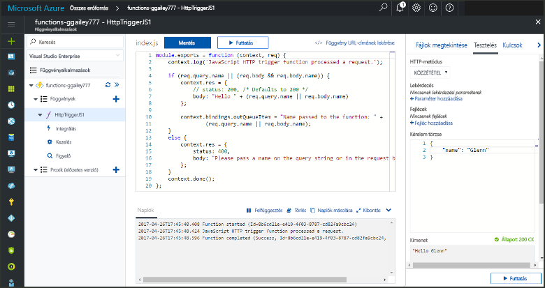
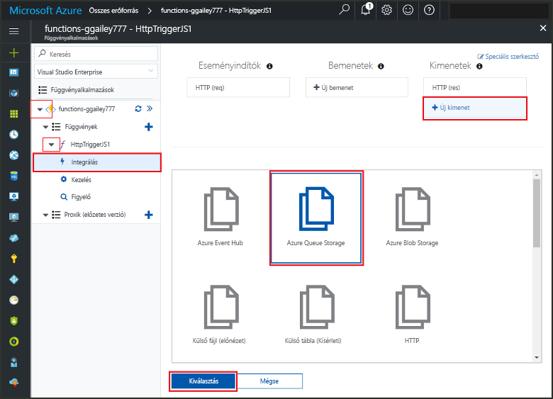
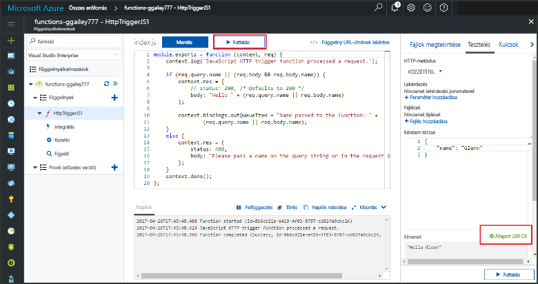
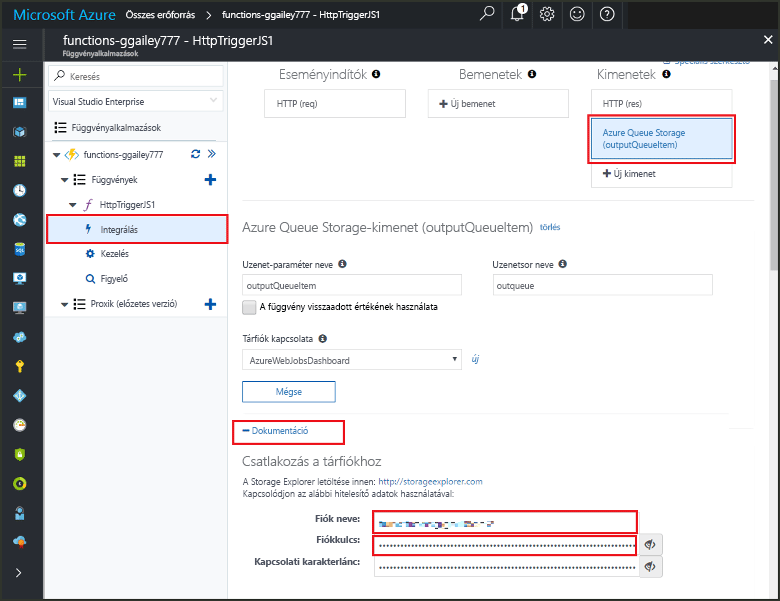
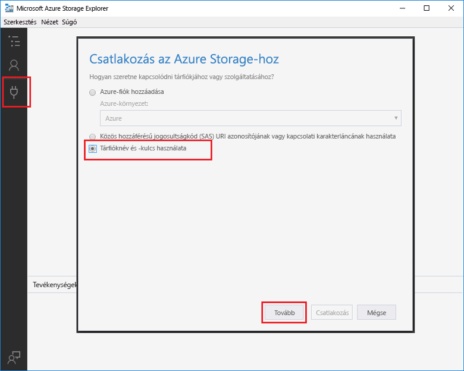

# <a name="add-messages-tooan-azure-storage-queue-using-functions"></a>Adja hozzá az üzenetek tooan Azure Storage üzenetsorába függvények használata

Az Azure Functions bemeneti és kimeneti kötések adja meg a deklaratív módon tooconnect tooexternal szolgáltatás adatait a függvény. Ebben a témakörben megtudhatja, hogyan tooupdate egy meglévő függvény adja hozzá egy kimeneti kötése, amely üzeneteket küld tooAzure a Queue storage.  



## <a name="prerequisites"></a>Előfeltételek 

[!INCLUDE [Previous topics](../../includes/functions-quickstart-previous-topics.md)]

* Telepítse a hello [Microsoft Azure Tártallózó](http://storageexplorer.com/).

## <a name="add-binding"></a>Kimeneti kötés hozzáadása
 
1. Bontsa ki a függvényalkalmazást és a függvényt.

2. Válassza ki **integráció** és **+ új kimeneti**, majd válassza **Azure Queue storage** válassza **kiválasztása**.
    
    

3. Hello beállításokkal hello táblázatban megadottak szerint: 

    

    | Beállítás      |  Ajánlott érték   | Leírás                              |
    | ------------ |  ------- | -------------------------------------------------- |
    | **Üzenetsor neve**   | myqueue-items    | hello hello neve várólista tooconnect tooin a tárfiók. |
    | **Tárfiók kapcsolata** | AzureWebJobStorage | A függvény alkalmazás által már használt hello tárolási fiók kapcsolat használatát, vagy hozzon létre egy újat.  |
    | **Üzenet-paraméter neve** | outputQueueItem | hello hello kimeneti kötési paraméter neve. | 

4. Kattintson a **mentése** tooadd hello kötés.
 
Most, hogy egy meghatározott kimeneti kötése, tooupdate hello kód toouse hello kötés tooadd üzenetek tooa várólista szüksége.  

## <a name="update-hello-function-code"></a>Hello funkciókódot frissítése

1. Válassza ki a függvény toodisplay hello függvény kódot hello szerkesztő. 

2. C# függvény, frissítse a függvénydefiníciót tooadd hello az alábbi módon **outputQueueItem** tárolási kötési paraméter. JavaScript-függvény esetében hagyja ki ezt a lépést.

    ```cs   
    public static async Task<HttpResponseMessage> Run(HttpRequestMessage req, 
        ICollector<string> outputQueueItem, TraceWriter log)
    {
        ....
    }
    ```

3. Hozzáadása előtt hello metódus visszaadja a következő kód toohello függvény hello. A függvény hello nyelvi hello megfelelő részlet használja.

    ```javascript
    context.bindings.outputQueueItem = "Name passed toohello function: " + 
                (req.query.name || req.body.name);
    ```

    ```cs
    outputQueueItem.Add("Name passed toohello function: " + name);     
    ```

4. Válassza ki **mentése** toosave módosításokat.

egy üzenetsor hozzáadott toohello toohello HTTP-eseményindítóval átadott hello érték tartalmazza.
 
## <a name="test-hello-function"></a>Hello függvény tesztelése 

1. Hello kód módosítások mentésekor után válassza ki **futtatása**. 

    

2. Ellenőrizze a hello naplók toomake meg arról, hogy sikerült-e hello függvény. Egy új sor nevű **outqueue** hozta létre a tárfiókban lévő hello funkciók runtime hello kimeneti kötése először szolgál.

A következő tooyour tárolási fiók tooverify hello új várólista és tooit hozzáadott üdvözlőüzenetére is elérheti. 

## <a name="connect-toohello-queue"></a>Csatlakozás toohello várólista

Kihagyás hello első három lépést, ha már telepítette a Tártallózó és tooyour tárfiók csatlakozna.    

1. Válassza ki a függvény **integráció** és új hello **Azure Queue storage** kimeneti kötése, majd bontsa ki a **dokumentáció**. Másolja a **Fiók neve** és a **Fiók kulcsa** értéket. Ezen hitelesítő adatok tooconnect toohello tárfiókot használni.
 
    

2. Hello futtatása [Microsoft Azure Tártallózó](http://storageexplorer.com/) eszközt, jelölje be hello hello bal oldali ikon csatlakozni, válassza a **használja a tárfiók nevét és a kulcs**, és válassza ki **következő**.

    
    
3. Beillesztés hello **fióknév** és **fiókkulcs** az 1. lépés a megfelelő mezőkbe, majd válasszon **következő**, és **Connect**. 
  
    

4. Bontsa ki a csatolt hello tárfiókot, **várólisták** , és ellenőrizze, hogy a várólista neve **Várólista_neve-elemek** létezik-e. Emellett meg kell jelennie egy üzenet már hello várólista.  
 
    
 

## <a name="clean-up-resources"></a>Az erőforrások eltávolítása

[!INCLUDE [Next steps note](../../includes/functions-quickstart-cleanup.md)]

## <a name="next-steps"></a>Következő lépések

Egy kimeneti kötése tooan meglévő függvény hozzáadását. 

[!INCLUDE [Next steps note](../../includes/functions-quickstart-next-steps.md)]

Kötési tooQueue tárolóira vonatkozó további információkért lásd: [Azure Functions tároló várólista kötések](functions-bindings-storage-queue.md). 


