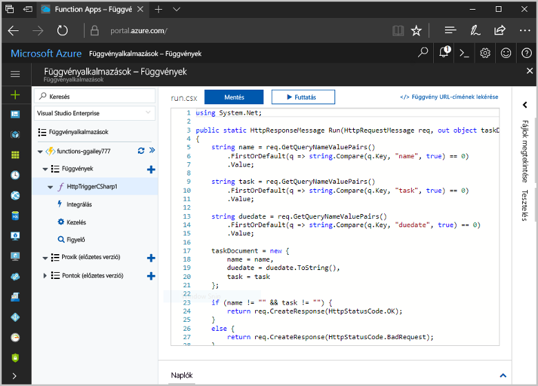
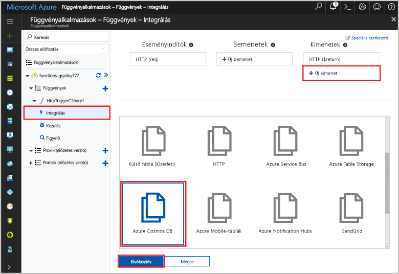
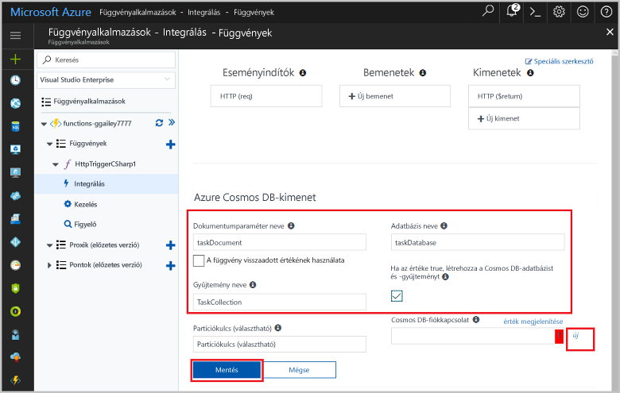
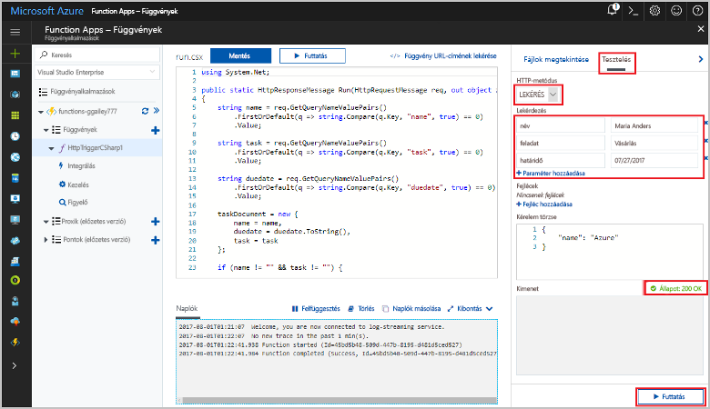
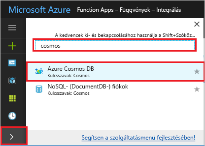
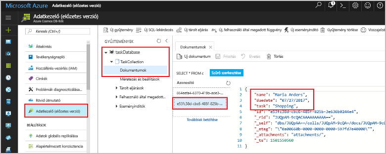

# <a name="store-unstructured-data-using-azure-functions-and-cosmos-db"></a><span data-ttu-id="adeb1-104">Strukturálatlan adatok tárolása az Azure Functions és a Cosmos DB használatával</span><span class="sxs-lookup"><span data-stu-id="adeb1-104">Store unstructured data using Azure Functions and Cosmos DB</span></span>

<span data-ttu-id="adeb1-105">[Az Azure Cosmos DB](https://azure.microsoft.com/services/cosmos-db/) egy strukturálatlan kiváló módja toostore és a JSON-adatokat.</span><span class="sxs-lookup"><span data-stu-id="adeb1-105">[Azure Cosmos DB](https://azure.microsoft.com/services/cosmos-db/) is a great way toostore unstructured and JSON data.</span></span> <span data-ttu-id="adeb1-106">A Cosmos DB, az Azure Functions szolgáltatással kombinálva felgyorsítja és megkönnyíti az adattárolást, hiszen lényegesen kevesebb kódot igényel, mint amennyi egy relációs adatbázisban történő adattároláshoz szükséges.</span><span class="sxs-lookup"><span data-stu-id="adeb1-106">Combined with Azure Functions, Cosmos DB makes storing data quick and easy with much less code than required for storing data in a relational database.</span></span>

<span data-ttu-id="adeb1-107">Az Azure Functions bemeneti és kimeneti kötések adja meg a deklaratív módon tooconnect tooexternal szolgáltatás adatait a függvény.</span><span class="sxs-lookup"><span data-stu-id="adeb1-107">In Azure Functions, input and output bindings provide a declarative way tooconnect tooexternal service data from your function.</span></span> <span data-ttu-id="adeb1-108">Ebben a témakörben megtudhatja, hogyan tooupdate meglévő C# működni tooadd egy strukturálatlan adatot tárol egy Cosmos DB dokumentum kimeneti kötése.</span><span class="sxs-lookup"><span data-stu-id="adeb1-108">In this topic, learn how tooupdate an existing C# function tooadd an output binding that stores unstructured data in a Cosmos DB document.</span></span> 



## <a name="prerequisites"></a><span data-ttu-id="adeb1-110">Előfeltételek</span><span class="sxs-lookup"><span data-stu-id="adeb1-110">Prerequisites</span></span>

<span data-ttu-id="adeb1-111">toocomplete Ez az oktatóanyag:</span><span class="sxs-lookup"><span data-stu-id="adeb1-111">toocomplete this tutorial:</span></span>

[!INCLUDE [Previous quickstart note](../../includes/functions-quickstart-previous-topics.md)]

## <a name="add-an-output-binding"></a><span data-ttu-id="adeb1-112">Kimeneti kötés hozzáadása</span><span class="sxs-lookup"><span data-stu-id="adeb1-112">Add an output binding</span></span>

1. <span data-ttu-id="adeb1-113">Bontsa ki a függvényalkalmazást és a függvényt.</span><span class="sxs-lookup"><span data-stu-id="adeb1-113">Expand both your function app and your function.</span></span>

1. <span data-ttu-id="adeb1-114">Válassza ki **integráció** és **+ új kimeneti**, amely jelenleg hello hello oldal jobb felső.</span><span class="sxs-lookup"><span data-stu-id="adeb1-114">Select **Integrate** and **+ New Output**, which is at hello top right of hello page.</span></span> <span data-ttu-id="adeb1-115">Válassza az **Azure Cosmos DB** elemet, majd kattintson a **Kiválasztás** lehetőségre.</span><span class="sxs-lookup"><span data-stu-id="adeb1-115">Choose **Azure Cosmos DB**, and click **Select**.</span></span>

    

3. <span data-ttu-id="adeb1-117">Használjon hello **Azure Cosmos DB kimeneti** beállításokat hello táblázatban megadottak szerint:</span><span class="sxs-lookup"><span data-stu-id="adeb1-117">Use hello **Azure Cosmos DB output** settings as specified in hello table:</span></span> 

    

    | <span data-ttu-id="adeb1-119">Beállítás</span><span class="sxs-lookup"><span data-stu-id="adeb1-119">Setting</span></span>      | <span data-ttu-id="adeb1-120">Ajánlott érték</span><span class="sxs-lookup"><span data-stu-id="adeb1-120">Suggested value</span></span>  | <span data-ttu-id="adeb1-121">Leírás</span><span class="sxs-lookup"><span data-stu-id="adeb1-121">Description</span></span>                                |
    | ------------ | ---------------- | ------------------------------------------ |
    | <span data-ttu-id="adeb1-122">**Dokumentumparaméter neve**</span><span class="sxs-lookup"><span data-stu-id="adeb1-122">**Document parameter name**</span></span> | <span data-ttu-id="adeb1-123">taskDocument</span><span class="sxs-lookup"><span data-stu-id="adeb1-123">taskDocument</span></span> | <span data-ttu-id="adeb1-124">A kódban toohello Cosmos DB objektum neve.</span><span class="sxs-lookup"><span data-stu-id="adeb1-124">Name that refers toohello Cosmos DB object in code.</span></span> |
    | <span data-ttu-id="adeb1-125">**Adatbázis neve**</span><span class="sxs-lookup"><span data-stu-id="adeb1-125">**Database name**</span></span> | <span data-ttu-id="adeb1-126">taskDatabase</span><span class="sxs-lookup"><span data-stu-id="adeb1-126">taskDatabase</span></span> | <span data-ttu-id="adeb1-127">Az adatbázis toosave dokumentumok neve.</span><span class="sxs-lookup"><span data-stu-id="adeb1-127">Name of database toosave documents.</span></span> |
    | <span data-ttu-id="adeb1-128">**Gyűjtemény neve**</span><span class="sxs-lookup"><span data-stu-id="adeb1-128">**Collection name**</span></span> | <span data-ttu-id="adeb1-129">TaskCollection</span><span class="sxs-lookup"><span data-stu-id="adeb1-129">TaskCollection</span></span> | <span data-ttu-id="adeb1-130">A Cosmos DB-adatbázisok gyűjteményének neve.</span><span class="sxs-lookup"><span data-stu-id="adeb1-130">Name of collection of Cosmos DB databases.</span></span> |
    | <span data-ttu-id="adeb1-131">**Igaz értéke esetén hello Cosmos DB adatbázist és a gyűjteményt hoz létre**</span><span class="sxs-lookup"><span data-stu-id="adeb1-131">**If true, creates hello Cosmos DB database and collection**</span></span> | <span data-ttu-id="adeb1-132">Bejelölve</span><span class="sxs-lookup"><span data-stu-id="adeb1-132">Checked</span></span> | <span data-ttu-id="adeb1-133">hello gyűjtemény nem már létezik, ezért hozza létre.</span><span class="sxs-lookup"><span data-stu-id="adeb1-133">hello collection doesn't already exist, so create it.</span></span> |

4. <span data-ttu-id="adeb1-134">Válassza ki **új** következő toohello **Cosmos DB dokumentum kapcsolat** címkével, és válassza a **+ új létrehozása**.</span><span class="sxs-lookup"><span data-stu-id="adeb1-134">Select **New** next toohello **Cosmos DB document connection** label, and select **+ Create new**.</span></span> 

5. <span data-ttu-id="adeb1-135">Használjon hello **új fiók** beállításokat hello táblázatban megadottak szerint:</span><span class="sxs-lookup"><span data-stu-id="adeb1-135">Use hello **New account** settings as specified in hello table:</span></span> 

    

    | <span data-ttu-id="adeb1-137">Beállítás</span><span class="sxs-lookup"><span data-stu-id="adeb1-137">Setting</span></span>      | <span data-ttu-id="adeb1-138">Ajánlott érték</span><span class="sxs-lookup"><span data-stu-id="adeb1-138">Suggested value</span></span>  | <span data-ttu-id="adeb1-139">Leírás</span><span class="sxs-lookup"><span data-stu-id="adeb1-139">Description</span></span>                                |
    | ------------ | ---------------- | ------------------------------------------ |
    | <span data-ttu-id="adeb1-140">**Azonosító**</span><span class="sxs-lookup"><span data-stu-id="adeb1-140">**ID**</span></span> | <span data-ttu-id="adeb1-141">Az adatbázis neve</span><span class="sxs-lookup"><span data-stu-id="adeb1-141">Name of database</span></span> | <span data-ttu-id="adeb1-142">Hello Cosmos DB adatbázis egyedi azonosítója</span><span class="sxs-lookup"><span data-stu-id="adeb1-142">Unique ID for hello Cosmos DB database</span></span>  |
    | <span data-ttu-id="adeb1-143">**API**</span><span class="sxs-lookup"><span data-stu-id="adeb1-143">**API**</span></span> | <span data-ttu-id="adeb1-144">SQL (DocumentDB)</span><span class="sxs-lookup"><span data-stu-id="adeb1-144">SQL (DocumentDB)</span></span> | <span data-ttu-id="adeb1-145">Hello dokumentum adatbázis az API lehetőséget választhatja.</span><span class="sxs-lookup"><span data-stu-id="adeb1-145">Select hello document database API.</span></span>  |
    | <span data-ttu-id="adeb1-146">**Előfizetés**</span><span class="sxs-lookup"><span data-stu-id="adeb1-146">**Subscription**</span></span> | <span data-ttu-id="adeb1-147">Azure-előfizetés</span><span class="sxs-lookup"><span data-stu-id="adeb1-147">Azure Subscription</span></span> | <span data-ttu-id="adeb1-148">Azure-előfizetés</span><span class="sxs-lookup"><span data-stu-id="adeb1-148">Azure Subscription</span></span>  |
    | <span data-ttu-id="adeb1-149">**Erőforráscsoport**</span><span class="sxs-lookup"><span data-stu-id="adeb1-149">**Resource Group**</span></span> | <span data-ttu-id="adeb1-150">myResourceGroup</span><span class="sxs-lookup"><span data-stu-id="adeb1-150">myResourceGroup</span></span> |  <span data-ttu-id="adeb1-151">Hello meglévő erőforráscsoportot, amely tartalmazza az függvény alkalmazás használja.</span><span class="sxs-lookup"><span data-stu-id="adeb1-151">Use hello existing resource group that contains your function app.</span></span> |
    | <span data-ttu-id="adeb1-152">**Hely**</span><span class="sxs-lookup"><span data-stu-id="adeb1-152">**Location**</span></span>  | <span data-ttu-id="adeb1-153">WestEurope</span><span class="sxs-lookup"><span data-stu-id="adeb1-153">WestEurope</span></span> | <span data-ttu-id="adeb1-154">Jelöljön ki egy helyet tooeither közelében, a függvény alkalmazás vagy hello tárolt dokumentumok használó tooother alkalmazások.</span><span class="sxs-lookup"><span data-stu-id="adeb1-154">Select a location near tooeither your function app or tooother apps that use hello stored documents.</span></span>  |

6. <span data-ttu-id="adeb1-155">Kattintson a **OK** toocreate hello adatbázis.</span><span class="sxs-lookup"><span data-stu-id="adeb1-155">Click **OK** toocreate hello database.</span></span> <span data-ttu-id="adeb1-156">Eltarthat néhány percig toocreate hello adatbázis.</span><span class="sxs-lookup"><span data-stu-id="adeb1-156">It may take a few minutes toocreate hello database.</span></span> <span data-ttu-id="adeb1-157">Hello adatbázis létrehozását követően hello adatbázis-kapcsolati karakterlánc egy függvény Alkalmazásbeállítás tárolja.</span><span class="sxs-lookup"><span data-stu-id="adeb1-157">After hello database is created, hello database connection string is stored as a function app setting.</span></span> <span data-ttu-id="adeb1-158">az Alkalmazásbeállítás neve hello behelyezi **Cosmos DB fiók kapcsolat**.</span><span class="sxs-lookup"><span data-stu-id="adeb1-158">hello name of this app setting is inserted in **Cosmos DB account connection**.</span></span> 
 
8. <span data-ttu-id="adeb1-159">Hello kapcsolati karakterlánc beállítása után válassza ki a **mentése** toocreate hello kötés.</span><span class="sxs-lookup"><span data-stu-id="adeb1-159">After hello connection string is set, select **Save** toocreate hello binding.</span></span>

## <a name="update-hello-function-code"></a><span data-ttu-id="adeb1-160">Hello funkciókódot frissítése</span><span class="sxs-lookup"><span data-stu-id="adeb1-160">Update hello function code</span></span>

<span data-ttu-id="adeb1-161">Hello meglévő C# funkciókódot cserélje le a következő kód hello:</span><span class="sxs-lookup"><span data-stu-id="adeb1-161">Replace hello existing C# function code with hello following code:</span></span>

```csharp
using System.Net;

public static HttpResponseMessage Run(HttpRequestMessage req, out object taskDocument, TraceWriter log)
{
    string name = req.GetQueryNameValuePairs()
        .FirstOrDefault(q => string.Compare(q.Key, "name", true) == 0)
        .Value;

    string task = req.GetQueryNameValuePairs()
        .FirstOrDefault(q => string.Compare(q.Key, "task", true) == 0)
        .Value;

    string duedate = req.GetQueryNameValuePairs()
        .FirstOrDefault(q => string.Compare(q.Key, "duedate", true) == 0)
        .Value;

    taskDocument = new {
        name = name,
        duedate = duedate.ToString(),
        task = task
    };

    if (name != "" && task != "") {
        return req.CreateResponse(HttpStatusCode.OK);
    }
    else {
        return req.CreateResponse(HttpStatusCode.BadRequest);
    }
}

```
<span data-ttu-id="adeb1-162">A fenti beolvassa hello HTTP-kérelem lekérdezési karakterláncok, és hozzárendeli a hello toofields `taskDocument` objektum.</span><span class="sxs-lookup"><span data-stu-id="adeb1-162">This code sample reads hello HTTP Request query strings and assigns them toofields in hello `taskDocument` object.</span></span> <span data-ttu-id="adeb1-163">Hello `taskDocument` kötés küldi hello objektumadatokat a kötési paraméter toobe hello kötött dokumentum-adatbázis tárolja.</span><span class="sxs-lookup"><span data-stu-id="adeb1-163">hello `taskDocument` binding sends hello object data from this binding parameter toobe stored in hello bound document database.</span></span> <span data-ttu-id="adeb1-164">hello adatbázis hello hello függvény első futásakor létrejön.</span><span class="sxs-lookup"><span data-stu-id="adeb1-164">hello database is created hello first time hello function runs.</span></span>

## <a name="test-hello-function-and-database"></a><span data-ttu-id="adeb1-165">Teszt hello függvény és adatbázis</span><span class="sxs-lookup"><span data-stu-id="adeb1-165">Test hello function and database</span></span>

1. <span data-ttu-id="adeb1-166">Bontsa ki a hello jobb oldali, és válassza ki **teszt**.</span><span class="sxs-lookup"><span data-stu-id="adeb1-166">Expand hello right window and select **Test**.</span></span> <span data-ttu-id="adeb1-167">A **lekérdezés**, kattintson a **+ Hozzáadás paraméter** , és adja hozzá a következő paraméterek toohello lekérdezési karakterlánc hello:</span><span class="sxs-lookup"><span data-stu-id="adeb1-167">Under **Query**, click **+ Add parameter** and add hello following parameters toohello query string:</span></span>

    + `name`
    + `task`
    + `duedate`

2. <span data-ttu-id="adeb1-168">Kattintson a **Futtatás** parancsra, és ellenőrizze, hogy a rendszer 200-as állapotüzenetet ad-e vissza.</span><span class="sxs-lookup"><span data-stu-id="adeb1-168">Click **Run** and verify that a 200 status is returned.</span></span>

    

1. <span data-ttu-id="adeb1-170">A bal oldalán található hello Azure-portálon hello, bontsa ki a hello ikon sávon típus `cosmos` hello a keresési mezőbe, majd válassza **Azure Cosmos DB**.</span><span class="sxs-lookup"><span data-stu-id="adeb1-170">On hello left side of hello Azure portal, expand hello icon bar, type `cosmos` in hello search field, and select **Azure Cosmos DB**.</span></span>

    

2. <span data-ttu-id="adeb1-172">Jelölje be hello adatbázis hozott létre, majd válassza ki **adatkezelő**.</span><span class="sxs-lookup"><span data-stu-id="adeb1-172">Select hello database you created, then select **Data Explorer**.</span></span> <span data-ttu-id="adeb1-173">Bontsa ki a hello **gyűjtemények** csomópontot, válassza ki a hello új dokumentum, és győződjön meg arról, hogy hello dokumentum a lekérdezési karakterlánc-értékek, valamint néhány további metaadatokat tartalmaz.</span><span class="sxs-lookup"><span data-stu-id="adeb1-173">Expand hello **Collections** nodes, select hello new document, and confirm that hello document contains your query string values, along with some additional metadata.</span></span> 

    

<span data-ttu-id="adeb1-175">Sikeresen hozzáadta a kötés tooyour HTTP eseményindító strukturálatlan adatokat tároló Cosmos DB adatbázisban.</span><span class="sxs-lookup"><span data-stu-id="adeb1-175">You have successfully added a binding tooyour HTTP trigger that stores unstructured data in a Cosmos DB database.</span></span>

[!INCLUDE [Clean-up section](../../includes/clean-up-section-portal.md)]

## <a name="next-steps"></a><span data-ttu-id="adeb1-176">Következő lépések</span><span class="sxs-lookup"><span data-stu-id="adeb1-176">Next steps</span></span>

[!INCLUDE [functions-quickstart-next-steps](../../includes/functions-quickstart-next-steps.md)]

<span data-ttu-id="adeb1-177">További információ a kötés tooa Cosmos DB adatbázisban: [Azure Functions Cosmos DB kötések](functions-bindings-documentdb.md).</span><span class="sxs-lookup"><span data-stu-id="adeb1-177">For more information about binding tooa Cosmos DB database, see [Azure Functions Cosmos DB bindings](functions-bindings-documentdb.md).</span></span>
