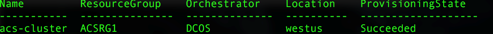

# <a name="deploy-a-docker-container-hosting-solution-using-hello-azure-cli-20"></a>Egy Docker-tároló üzemeltetési hello Azure CLI 2.0 használatával megoldás telepítése

Használjon hello `az acs` hello Azure CLI 2.0 toocreate parancsai és az Azure Tárolószolgáltatásban fürtök kezeléséhez. Az Azure Tárolószolgáltatás-fürt hello segítségével is telepíthet [Azure-portálon](container-service-deployment.md) vagy hello Azure tároló szolgáltatás API-k.

A Súgó a `az acs` parancsokat, és adja át hello `-h` paraméter tooany parancsot. Például: `az acs create -h`.


## <a name="prerequisites"></a>Előfeltételek
egy Azure Tárolószolgáltatási fürt használt toocreate hello Azure CLI 2.0, meg kell:
* szükség van egy Azure-fiókra ([ingyenes próbaverzió beszerzése](https://azure.microsoft.com/pricing/free-trial/));
* telepítette és hello beállítása [Azure CLI 2.0](/cli/azure/install-az-cli2)

## <a name="get-started"></a>Bevezetés 
### <a name="log-in-tooyour-account"></a>Jelentkezzen be tooyour fiók
```azurecli
az login 
```

Kövesse a hello kér toolog az interaktív módon. Az egyéb módszerek toolog, lásd: [Ismerkedés az Azure CLI 2.0](/cli/azure/get-started-with-az-cli2).

### <a name="set-your-azure-subscription"></a>Azure-előfizetés beállítása

Ha több Azure-előfizetéssel rendelkezik, állítsa be a hello alapértelmezett előfizetés. Példa:

```
az account set --subscription "f66xxxxx-xxxx-xxxx-xxx-zgxxxx33cha5"
```


### <a name="create-a-resource-group"></a>Hozzon létre egy erőforráscsoportot
Javasoljuk, hogy mindegyik fürthöz hozzon létre egy erőforráscsoportot. Válasszon ki egy Azure-régiót, amelyben az Azure Container Service [elérhető](https://azure.microsoft.com/en-us/regions/services/). Példa:

```azurecli
az group create -n acsrg1 -l "westus"
```
Hasonló toohello következő kimenete:


## <a name="create-an-azure-container-service-cluster"></a>Azure Container Service-fürt létrehozása

toocreate egy fürt használja `az acs create`.
Hello fürt nevét és hello előző lépésben létrehozott hello erőforráscsoport hello nevét kötelező paraméterek tartoznak. 

Más bemeneti értékei set toodefault (lásd a következő képernyő hello) kivéve, ha a megfelelő kapcsolók használata felül. Például a hello orchestrator tooDC/operációs rendszer alapértelmezett értéke. És ha nem adja meg egy, a DNS-előtagja hello fürt neve alapján jön létre.


### <a name="quick-acs-create-using-defaults"></a>Gyors `acs create` alapértelmezett beállítások használatával
Ha egy SSH-RSA nyilvános kulcsfájl `id_rsa.pub` hello alapértelmezett helyen (vagy létrehozni egy a [OS X- és Linux](../../virtual-machines/linux/mac-create-ssh-keys.md) vagy [Windows](../../virtual-machines/linux/ssh-from-windows.md)), használjon hello hasonló parancsot:

```azurecli
az acs create -n acs-cluster -g acsrg1 -d applink789
```
Ha nincs nyilvános SSH-kulcsa, használja ezt a második parancsot. Ez a parancs a hello `--generate-ssh-keys` kapcsoló létrehoz egyet.

```azurecli
az acs create -n acs-cluster -g acsrg1 -d applink789 --generate-ssh-keys
```

Hello parancs megadása után várja meg a létrehozott hello fürt toobe körülbelül 10 perc. hello parancs kimenete hello master és ügynök csomópontok és egy SSH parancs tooconnect toohello első főkiszolgálójának teljesen minősített tartománynevek (FQDN) tartalmazza. Íme egy rövidített kimenet:


> [!TIP]
> Hello [Kubernetes forgatókönyv](../kubernetes/container-service-kubernetes-walkthrough.md) bemutatja, hogyan toouse `az acs create` az alapértelmezett értékek toocreate egy Kubernetes fürt.
>

## <a name="manage-acs-clusters"></a>ACS-fürtök kezelése

További használata `az acs` parancsok toomanage a fürthöz. Néhány példa:

### <a name="list-clusters-under-a-subscription"></a>Előfizetés alá tartozó fürtök listázása

```azurecli
az acs list --output table
```

### <a name="list-clusters-in-a-resource-group"></a>Erőforráscsoportba tartozó fürtök listázása

```azurecli
az acs list -g acsrg1 --output table
```




### <a name="display-details-of-a-container-service-cluster"></a>Container Service-fürt részleteinek megjelenítése

```azurecli
az acs show -g acsrg1 -n acs-cluster --output list
```


### <a name="scale-hello-cluster"></a>Skála hello fürt
Az ügyfélcsomópontok horizontális le- és felskálázása is engedélyezett. hello paraméter `new-agent-count` hello új hello ACS fürt ügynökök száma.

```azurecli
az acs scale -g acsrg1 -n acs-cluster --new-agent-count 4
```


## <a name="delete-a-container-service-cluster"></a>Container Service-fürt törlése
```azurecli
az acs delete -g acsrg1 -n acs-cluster 
```
Ez a parancs nem törli a hello tárolószolgáltatás létrehozása során létrehozott összes erőforrás (hálózati és tárolási). toodelete összes erőforrás könnyen, ajánlott minden fürt eltérő erőforráscsoportban telepít. Ezután törölni hello erőforráscsoport hello fürt már nincs szükség.

## <a name="next-steps"></a>Következő lépések
Most, hogy működő fürtje van, tekintse meg ezeket a dokumentumokat a kapcsolatra és a felügyeletre vonatkozó részletekért:

* [Csatlakozás Azure Tárolószolgáltatás-fürt tooan](../container-service-connect.md)
* [Az Azure Container Service és a DC/OS használata](container-service-mesos-marathon-rest.md)
* [Az Azure Container Service és a Docker Swarm használata](container-service-docker-swarm.md)
* [Az Azure Container Service és a Kubernetes használata](../kubernetes/container-service-kubernetes-walkthrough.md)