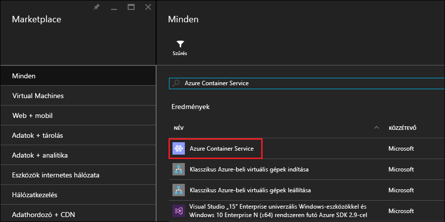
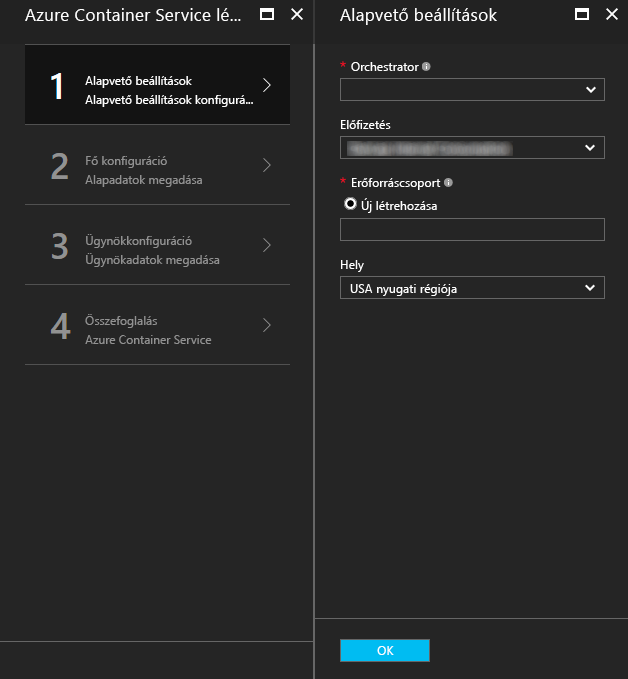
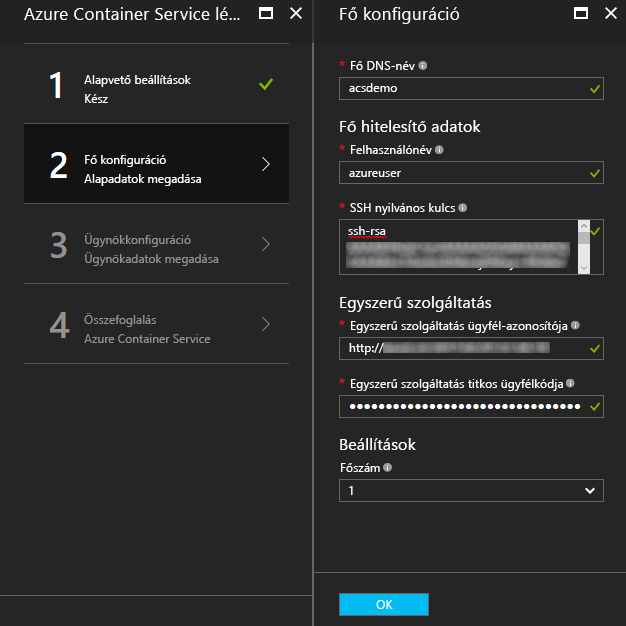
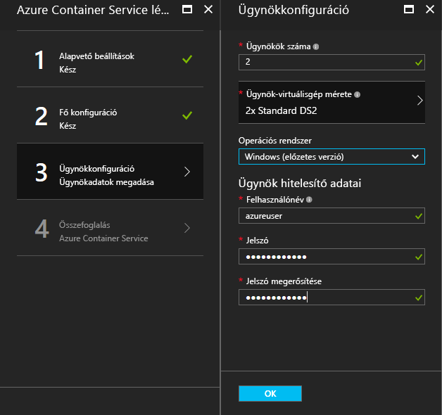
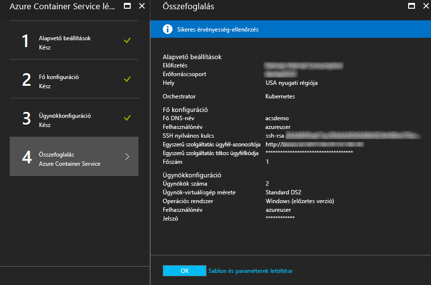
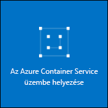

# <a name="deploy-a-docker-container-hosting-solution-using-hello-azure-portal"></a>Egy Docker-tároló üzemeltetési megoldás használatával hello Azure-portál telepítése


Az Azure tárolószolgáltatással gyorsan üzembe helyezhet népszerű nyílt forráskódú tárolófürtözési és vezénylési megoldásokat. Ez a dokumentum végigvezeti az Azure Tárolószolgáltatás-fürt telepítése hello Azure-portálon vagy az Azure Resource Manager gyorsindítási sablonon használatával. 

Az Azure Tárolószolgáltatás-fürt hello segítségével is telepíthet [Azure CLI 2.0](container-service-create-acs-cluster-cli.md) vagy hello Azure tároló szolgáltatás API-k.

Háttér-információk: [Az Azure Container Service bemutatása](../container-service-intro.md).


## <a name="prerequisites"></a>Előfeltételek

* **Azure-előfizetés**: Ha nem rendelkezik előfizetéssel, regisztrálhat az [ingyenes próbaverzióra](http://azure.microsoft.com/pricing/free-trial/?WT.mc_id=AA4C1C935). Nagyobb fürt esetében fontolja meg a használatalapú előfizetést vagy az egyéb fizetési lehetőségeket.

    > [!NOTE]
    > Az Azure-előfizetés használatának és [erőforráskvótákkal](../../azure-subscription-service-limits.md), például magok kvótákat, az korlátozhatja hello fürt központi telepítése hello méretét. a kvóta növelését, nyissa meg toorequest egy [online felhasználói támogatási kérelem](../../azure-supportability/how-to-create-azure-support-request.md) díjmentesen.
    >

* **SSH-RSA nyilvános kulcs**: hello portal vagy hello Azure gyors üzembe helyezés sablonok egyikét telepítésekor tooprovide hello nyilvános kulcsot a hitelesítéshez az Azure Tárolószolgáltatás virtuális gépek elleni szükség van. Secure Shell (SSH) RSA-kulcsok toocreate, lásd: hello [OS X- és Linux](../../virtual-machines/linux/mac-create-ssh-keys.md) vagy [Windows](../../virtual-machines/linux/ssh-from-windows.md) útmutatást. 

* **Szolgáltatás egyszerű ügyfél-azonosító és a titkos kulcs** (csak Kubernetes): további információt és útmutatást toocreate egy Azure Active Directory szolgáltatás egyszerű, lásd: [kapcsolatos hello szolgáltatás egyszerű Kubernetes fürt](../kubernetes/container-service-kubernetes-service-principal.md).


## <a name="create-a-cluster-by-using-hello-azure-portal"></a>Hozzon létre egy fürtöt hello Azure-portál használatával
1. Jelentkezzen be Azure-portálon toohello válasszon **új**, és az Azure piactér hello keresési **Azure Tárolószolgáltatás**.

      <br />

2. Kattintson az **Azure Container Service** elemre, majd kattintson a **Létrehozás** gombra.

3. A hello **alapjai** panelen adja meg a következő információ hello:

    * **Az orchestrator**: Válasszon ki egy hello tároló orchestrators toodeploy hello fürtön.
        * **DC/OS**: DC/OS fürt üzembe helyezése.
        * **Swarm**: Docker Swarm-fürt üzembe helyezése.
        * **Kubernetes**: Kubernetes-fürt üzembe helyezése.
    * **Előfizetés**: válasszon ki egy Azure-előfizetést.
    * **Erőforráscsoport**: hello központi telepítés hello egy új erőforráscsoport nevét adja meg.
    * **Hely**: válassza ki a kívánt Azure-régiót hello Azure Tárolószolgáltatás-telepítéshez. Az elérhetőségért tekintse meg a [Régiónként elérhető termékek](https://azure.microsoft.com/regions/services/) listáját.
    
      <br />
    
    Kattintson a **OK** készen tooproceed közben.

4. A hello **konfigurációs fő** panelen adja meg a következő beállítások hello Linux főcsomópont vagy (egyes beállítások, amelyek adott tooeach orchestrator) hello fürt csomópontjai hello:

    * **Fő DNS-név**: hello használt előtag toocreate egy egyedi teljesen minősített tartományneve (FQDN) hello főkiszolgáló. fő FQDN-je hello űrlap hello *előtag*felügyeleti*hely*. cloudapp.azure.com.
    * **Felhasználónév**: egy fiók egyes hello Linux virtuális gépek hello fürt hello felhasználónevét.
    * **SSH-RSA nyilvános kulcs**: hello nyilvános kulcs toobe hello Linux virtuális gépek elleni hitelesítéshez használt hozzáadása. Fontos, hogy ezt a kulcsot ne tartalmazzon sortörést, és ez magában foglalja a hello `ssh-rsa` előtag. Hello `username@domain` utótag megadása nem kötelező. hello kulcs hasonlóan kell kinéznie hello alábbi: **ssh-rsa AAAAB3Nz... <>...... UcyupgH azureuser@linuxvm** . 
    * **Szolgáltatás egyszerű**: Ha hello Kubernetes orchestrator választotta, adjon meg egy Azure Active Directory **szolgáltatás fő ügyfél-azonosító** (más néven hello appId) és **szolgáltatás egyszerű ügyfélkulcs** (jelszó). További információkért lásd: [kapcsolatos hello szolgáltatás egyszerű Kubernetes fürt](../kubernetes/container-service-kubernetes-service-principal.md).
    * **Fő száma**: hello hello fürt főkiszolgálók száma.
    * **Virtuálisgép-diagnosztika**: néhány orchestrators hello főkiszolgálók a Virtuálisgép-diagnosztika engedélyezheti.

      <br />

    Kattintson a **OK** készen tooproceed közben.

5. A hello **Gazdagépügynök-konfigurálási** panelen adja meg a következő információ hello:

    * **Ügynökök száma**: A Docker Swarm és Kubernetes, az értéke hello hello ügynökskálázási készletben lévő ügynökök kezdeti száma. A DC/OS esetén hello a privát skálázási készletekben ügynökök kezdeti száma. Ezenkívül létrejön egy nyilvános méretezési csoport a DC/OS számára, amely az ügynökök előre meghatározott számát tartalmazza. hello a nyilvános skálázási készlet ügynökök száma határozza meg hello fürt főkiszolgálók száma hello: egy fő egy nyilvános ügynököt, és három vagy öt főkiszolgálók két nyilvános ügynököt.
    * **Ügynök virtuálisgép-méret**: hello hello ügynök-virtuálisgépek mérete.
    * **Operációs rendszer**: Ez a beállítás érhető el jelenleg csak akkor, ha a kiválasztott hello Kubernetes orchestrator. Válassza a Linux-disztribúció vagy egy Windows Server operációs rendszer toorun hello ügynökökre. A beállítás meghatározza, hogy a fürt Linux vagy Windows tárolóalkalmazásokat futtathat. 

        > [!NOTE]
        > A Windows tároló támogatása előzetes verziójú kiadásban érhető el Kubernetes fürtökön. A DC/OS- és Swarm-fürtökön jelenleg csak a Linux-ügynökök támogatottak az Azure Container Service-ben.

    * **Ügynök hitelesítő adatait**: Ha hello Windows operációs rendszert választotta, adjon meg egy rendszergazdai **felhasználónév** és **jelszó** hello ügynök virtuális gépeket. 

      <br />

    Kattintson a **OK** készen tooproceed közben.

6. A szolgáltatás érvényesítésének befejeződése után kattintson az **OK** gombra.

      <br />

7. Tekintse át a hello feltételeket. toostart hello a központi telepítési folyamat kattintson **létrehozása**.

    Ha úgy döntött, hogy toopin hello telepítési toohello Azure-portálon, hello telepítés állapota látható.

      <br />

hello telepítés több percet toocomplete vesz igénybe. Ezt követően hello Azure Tárolószolgáltatás-fürt használatra készen áll.


## <a name="create-a-cluster-by-using-a-quickstart-template"></a>Fürt létrehozása gyorsindítási sablon használatával
Azure gyors üzembe helyezési sablonokat elérhető toodeploy az Azure Tárolószolgáltatásban fürt. a megadott hello gyorsindítási sablonok lehet módosított tooinclude további vagy speciális Azure konfigurálása. toocreate egy Azure Tárolószolgáltatás-fürt egy Azure gyors üzembe helyezés sablon használatával, akkor Azure-előfizetés szükséges. Ha nem rendelkezik előfizetéssel, regisztrálhat az [ingyenes próbaverzióra](http://azure.microsoft.com/pricing/free-trial/?WT.mc_id=AA4C1C935). 

Kövesse ezeket a lépéseket toodeploy sablon használatával fürt és hello Azure CLI 2.0 (lásd: [telepítési és beállítási utasításokat](/cli/azure/install-az-cli2)).

> [!NOTE] 
> Ha a számítógép Windows rendszert, használhatja a sablon Azure PowerShell használatával hasonló lépéseket toodeploy. A lépéseket lásd a szakasz későbbi részében. A sablonok hello keresztül is telepíthet [portal](../../azure-resource-manager/resource-group-template-deploy-portal.md) vagy más módszerrel.

1. a DC/OS, Docker Swarm vagy Kubernetes fürt toodeploy válasszon ki egy hello elérhető gyorsindítási sablonok a Githubról. Az alábbiakban egy részleges lista látható. hello DC/OS és Swarm sablonok hello hello alapértelmezett vezénylési kivételével azonos történik.

    * [DC/OS-sablon](https://github.com/Azure/azure-quickstart-templates/tree/master/101-acs-dcos)
    * [Swarm-sablon](https://github.com/Azure/azure-quickstart-templates/tree/master/101-acs-swarm)
    * [Kubernetes-sablon](https://github.com/Azure/azure-quickstart-templates/tree/master/101-acs-kubernetes)

2. Jelentkezzen be Azure-fiók tooyour (`az login`), és győződjön meg arról, hogy az Azure parancssori felület hello csatlakoztatott tooyour Azure-előfizetés. Megtekintheti a hello alapértelmezett előfizetés hello a következő parancs használatával:

    ```azurecli
    az account show
    ```
    
    Ha egynél több előfizetés és a szükséges tooset más alapértelmezett előfizetéssel rendelkezik, futtassa `az account set --subscription` , és adja meg a hello előfizetés-Azonosítóval vagy névvel.

3. Ajánlott eljárásként hello telepítéshez egy új erőforráscsoportot használni. egy erőforráscsoport, toocreate hello használata `az group create` parancs egy erőforráscsoport-név és hely megadása: 

    ```azurecli
    az group create --name "RESOURCE_GROUP" --location "LOCATION"
    ```

4. Hozzon létre egy JSON fájlt tartalmazó hello szükséges sablont paraméterek. Nevű letöltési hello paraméterfájl `azuredeploy.parameters.json` , amely kísérik hello Azure Tárolószolgáltatás sablon `azuredeploy.json` a Githubon. Adja meg a fürt szükséges paraméterértékeit. 

    Például toouse hello [DC/OS-sablon](https://github.com/Azure/azure-quickstart-templates/tree/master/101-acs-dcos), adja meg a paraméterértékek `dnsNamePrefix` és `sshRSAPublicKey`. Lásd: hello leírásokat `azuredeploy.json` és más paramétereket beállításokat.  
 

5. Hozzon létre egy Tárolószolgáltatás-fürt úgy, hogy hello telepítési paraméterek fájlt a hello a következő parancsot, amelyben:

    * **Erőforráscsoport** hello előző lépésben létrehozott erőforráscsoport hello hello neve.
    * **DEPLOYMENT_NAME** van egy toohello telepítési neve (nem kötelező).
    * **TEMPLATE_URI** hello hely hello telepítési fájl `azuredeploy.json`. Ezt az URI hello Raw fájlt, nem egy mutató toohello GitHub felhasználói felületén kell lennie. toofind ezt az URI, jelölje be hello `azuredeploy.json` fájlt a Githubon, majd kattintson a hello **Raw** gombra.  

    ```azurecli
    az group deployment create -g RESOURCE_GROUP -n DEPLOYMENT_NAME --template-uri TEMPLATE_URI --parameters @azuredeploy.parameters.json
    ```

    Paraméterek egy JSON-formátumú karakterlánc hello parancssorban is megadhatja. Egy hasonló toohello utáni parancsot használja:

    ```azurecli
    az group deployment create -g RESOURCE_GROUP -n DEPLOYMENT_NAME --template-uri TEMPLATE_URI --parameters "{ \"param1\": {\"value1\"} … }"
    ```

    > [!NOTE]
    > hello telepítés több percet toocomplete vesz igénybe.
    > 

### <a name="equivalent-powershell-commands"></a>Egyenértékű PowerShell-parancsok
A PowerShell használatával is üzembe helyezhet Azure Container Service-fürtöket. Ez a dokumentum hello 1.0-s verziója alapján [Azure PowerShell modul](https://azure.microsoft.com/blog/azps-1-0/).

1. a DC/OS, Docker Swarm vagy Kubernetes fürt toodeploy válasszon ki egy hello elérhető gyorsindítási sablonok a Githubról. Az alábbiakban egy részleges lista látható. Vegye figyelembe, hogy hello DC/OS és Swarm sablonok vannak hello azonos, hello alapértelmezett vezénylési hello kivételével.

    * [DC/OS-sablon](https://github.com/Azure/azure-quickstart-templates/tree/master/101-acs-dcos)
    * [Swarm-sablon](https://github.com/Azure/azure-quickstart-templates/tree/master/101-acs-swarm)
    * [Kubernetes-sablon](https://github.com/Azure/azure-quickstart-templates/tree/master/101-acs-kubernetes)

2. Mielőtt az Azure-előfizetésében létrehozna egy fürtöt, győződjön meg arról, hogy a PowerShell-munkamenet bejelentkezett az tooAzure. Ehhez a hello `Get-AzureRMSubscription` parancs:

    ```powershell
    Get-AzureRmSubscription
    ```

3. Ha a tooAzure toosign van szüksége, használja a hello `Login-AzureRMAccount` parancs:

    ```powershell
    Login-AzureRmAccount
    ```

4. Ajánlott eljárásként hello telepítéshez egy új erőforráscsoportot használni. egy erőforráscsoport, toocreate hello használata `New-AzureRmResourceGroup` parancsot, és adjon meg egy erőforrás-csoport nevét és helyét régióban:

    ```powershell
    New-AzureRmResourceGroup -Name GROUP_NAME -Location REGION
    ```

5. Miután létrehozott egy erőforráscsoport, a parancs a következő hello hozhat létre a fürt. hello URI-jának hello kívánt sablon meg van adva hello `-TemplateUri` paraméter. A parancs futtatásakor a rendszerhéj kéri az üzembehelyezési paramétereket.

    ```powershell
    New-AzureRmResourceGroupDeployment -Name DEPLOYMENT_NAME -ResourceGroupName RESOURCE_GROUP_NAME -TemplateUri TEMPLATE_URI
    ```

#### <a name="provide-template-parameters"></a>A sablon paramétereinek megadása
Ha ismeri a PowerShell-lel, biztos, hogy válthat hello parancsmag elérhető paraméterei keresztül a mínuszjel (-) beírásával, és nyomja le az hello TAB billentyűt. Ez a funkció a sablonban megadott saját paraméterekkel is működik. Amint beírja a sablonnevet hello, hello parancsmag hello sablon beolvassa hello paraméterek elemzi és hello sablon paraméterek toohello parancs dinamikusan hozzáadja. Így könnyen toospecify hello sablon-paraméterértékek. És, ha elfelejti a kötelező paraméter értékét, PowerShell hello értékhez.

Hello teljes parancs paraméterekkel együtt ez. Adja meg a saját hello erőforrások hello nevét.

```powershell
New-AzureRmResourceGroupDeployment -ResourceGroupName RESOURCE_GROUP_NAME-TemplateURI TEMPLATE_URI -adminuser value1 -adminpassword value2 ....
```

## <a name="next-steps"></a>Következő lépések
Most, hogy működő fürtje van, tekintse meg ezeket a dokumentumokat a kapcsolatra és a felügyeletre vonatkozó részletekért:

* [Csatlakozás Azure Tárolószolgáltatás-fürt tooan](../container-service-connect.md)
* [Az Azure Container Service és a DC/OS használata](container-service-mesos-marathon-rest.md)
* [Az Azure Container Service és a Docker Swarm használata](container-service-docker-swarm.md)
* [Az Azure Container Service és a Kubernetes használata](../kubernetes/container-service-kubernetes-walkthrough.md)
