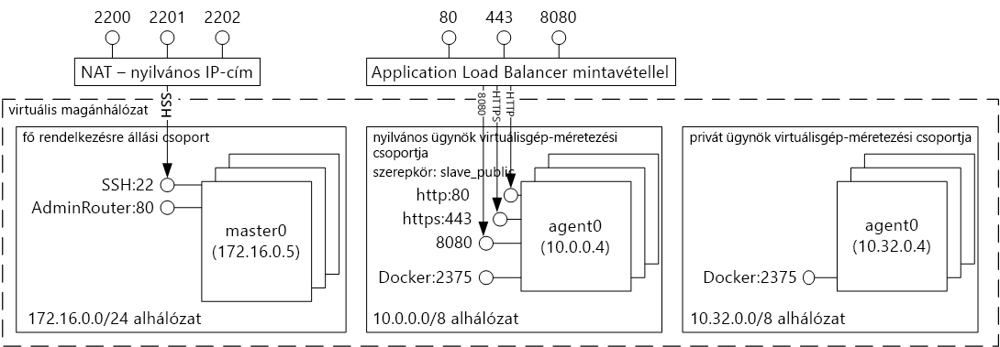
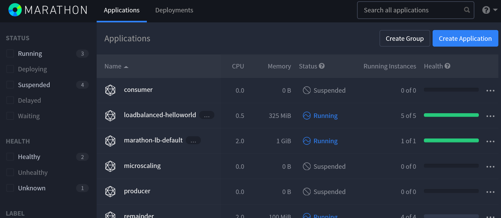
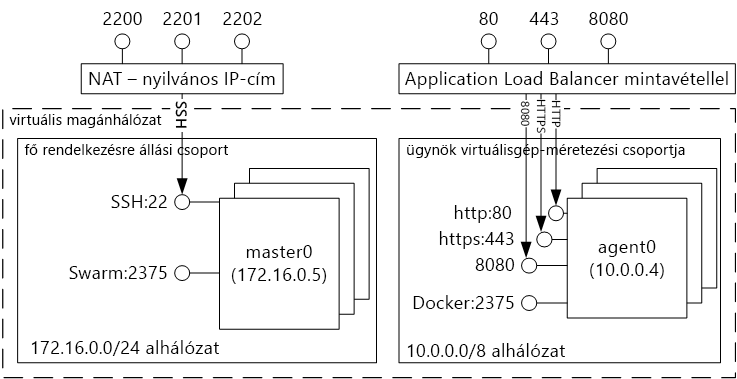
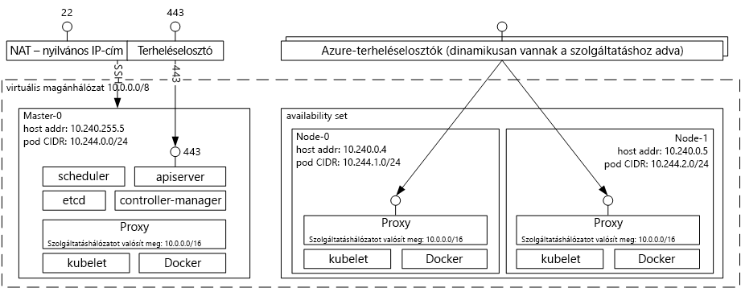

# Azure Tárolószolgáltatás-megoldások üzemeltető bemutatása tooDocker tárolóIntroduction tooDocker container hosting solutions with Azure Container Service 
Az Azure Tárolószolgáltatás egyszerűbbé teszi az Ön toocreate, konfigurálásához és egy fürt virtuális gépek, amelyek indexelése előre konfigurált toorun alkalmazásokat kezeléséhez.Azure Container Service makes it simpler for you toocreate, configure, and manage a cluster of virtual machines that are preconfigured toorun containerized applications. Ezt nyílt forráskódú ütemezési és vezénylési eszközök optimalizált konfigurációját igénybe véve teszi lehetővé.It uses an optimized configuration of popular open-source scheduling and orchestration tools. Ez lehetővé teszi, hogy a hogy toouse a meglévő ismeretei, vagy egy nagy- és az egyre növekvő törzsének közösségi szakértelmét, toodeploy épülnek, és tároló-alapú alkalmazások a Microsoft Azure kezelése.This enables you toouse your existing skills, or draw upon a large and growing body of community expertise, toodeploy and manage container-based applications on Microsoft Azure.

Az Azure Tárolószolgáltatás hello Docker tároló formátum tooensure, hogy teljes mértékben hordozhatók-e az alkalmazás tárolók kihasználja.Azure Container Service leverages hello Docker container format tooensure that your application containers are fully portable. A választott Marathon és a DC/OS, a Docker Swarm vagy Kubernetes is, hogy ezek alkalmazások toothousands tároló, vagy még akkor is, tízezreit méretezheti támogatja.It also supports your choice of Marathon and DC/OS, Docker Swarm, or Kubernetes so that you can scale these applications toothousands of containers, or even tens of thousands.

Azure Tárolószolgáltatás használatával kihasználhatja Azure, a vállalati szintű szolgáltatásait alkalmazás hordozhatóság--hordozhatóság hello vezénylési rétegek, beleértve továbbra is megőrzésével.By using Azure Container Service, you can take advantage of the enterprise-grade features of Azure, while still maintaining application portability--including portability at hello orchestration layers.

## Az Azure Container Service használataUsing Azure Container Service
Az Azure Tárolószolgáltatás célunk tooprovide tároló üzemeltetési környezet nyílt forrású eszközök és technológiák manapság népszerű, az ügyfelek között.Our goal with Azure Container Service is tooprovide a container hosting environment by using open-source tools and technologies that are popular among our customers today. toothis célból elérhetővé kell tenni hello szabványos API-végpontok a kiválasztott orchestrator (a DC/OS, a Docker Swarm, vagy a Kubernetes).toothis end, we expose hello standard API endpoints for your chosen orchestrator (DC/OS, Docker Swarm, or Kubernetes). Ezeket a végpontokat használatával teheti az olyan szoftvert, amely képes a toothose végpontok van szó.By using these endpoints, you can leverage any software that is capable of talking toothose endpoints. Például hello Docker Swarm végponthoz hello esetben választása toouse hello Docker parancssori felület (CLI).For example, in hello case of hello Docker Swarm endpoint, you might choose toouse hello Docker command-line interface (CLI). DC/os hello Vezénylőtípusú CLI akkor célszerű használni.For DC/OS, you might choose hello DCOS CLI. a Kubernetes esetében pedig a `kubectl` használata mellett.For Kubernetes, you might choose `kubectl`.

## Egy Docker-fürt létrehozása az Azure Container Service használatávalCreating a Docker cluster by using Azure Container Service
Azure Tárolószolgáltatás használatával toobegin meg az Azure Tárolószolgáltatás-fürt üzembe helyezése hello portálon (keresési hello piactér a **Azure Tárolószolgáltatás**), Azure Resource Manager-sablon használatával ([Docker Swarm](https://github.com/Azure/azure-quickstart-templates/tree/master/101-acs-swarm), [DC/OS](https://github.com/Azure/azure-quickstart-templates/tree/master/101-acs-dcos), vagy [Kubernetes](https://github.com/Azure/azure-quickstart-templates/tree/master/101-acs-kubernetes)), vagy a hello [Azure CLI 2.0](container-service-create-acs-cluster-cli.md).toobegin using Azure Container Service, you deploy an Azure Container Service cluster via hello portal (search hello Marketplace for **Azure Container Service**), by using an Azure Resource Manager template ([Docker Swarm](https://github.com/Azure/azure-quickstart-templates/tree/master/101-acs-swarm), [DC/OS](https://github.com/Azure/azure-quickstart-templates/tree/master/101-acs-dcos), or [Kubernetes](https://github.com/Azure/azure-quickstart-templates/tree/master/101-acs-kubernetes)), or with hello [Azure CLI 2.0](container-service-create-acs-cluster-cli.md). a megadott hello gyorsindítási sablonok lehet módosított tooinclude további vagy speciális Azure konfigurálása.hello provided quickstart templates can be modified tooinclude additional or advanced Azure configuration. Több információ: [Azure tárolószolgáltatás-fürt üzembe helyezése](container-service-deployment.md).For more information, see [Deploy an Azure Container Service cluster](container-service-deployment.md).

## Alkalmazás üzembe helyezéseDeploying an application
Az Azure Container Service lehetővé teszi annak eldöntését, hogy Docker Swarmot, DC/OS-t vagy Kubernetest szeretne-e használni a vezényléshez.Azure Container Service provides a choice of Docker Swarm, DC/OS, or Kubernetes for orchestration. A kiválasztott vezénylőtől függ, hogyan helyezi üzembe az alkalmazást.How you deploy your application depends on your choice of orchestrator.

### A DC/OS használataUsing DC/OS
A DC/OS egy olyan elosztott operációs rendszer, hello Apache Mesos elosztott rendszerek kernel alapján.DC/OS is a distributed operating system based on hello Apache Mesos distributed systems kernel. Apache Mesos van: hello Apache szoftver Foundation fájlban található, és néhány olyan hello [legnagyobb nevek informatikai](http://mesos.apache.org/documentation/latest/powered-by-mesos/) felhasználók és közreműködő szerepkörrel rendelkező személyek.Apache Mesos is housed at hello Apache Software Foundation and lists some of hello [biggest names in IT](http://mesos.apache.org/documentation/latest/powered-by-mesos/) as users and contributors.

A DC/OS és az Apache Mesos lenyűgöző szolgáltatáskészletet tesz elérhetővé:DC/OS and Apache Mesos include an impressive feature set:

* Bizonyított méretezhetőségProven scalability
* Apache Zookeepert használó, nagy hibatűrésű replikált főkiszolgáló és alkiszolgálókFault-tolerant replicated master and slaves using Apache ZooKeeper
* Docker formátumú tárolók támogatásaSupport for Docker-formatted containers
* Feladatok közötti natív elkülönítés Linux-tárolókkalNative isolation between tasks with Linux containers
* Többforrású ütemezés (memória, processzor, lemez és portok)Multiresource scheduling (memory, CPU, disk, and ports)
* Java, Python és C++ API-k új párhuzamos alkalmazások fejlesztéséhezJava, Python, and C++ APIs for developing new parallel applications
* Webes felhasználói felület a fürtállapot áttekintéséreA web UI for viewing cluster state

Alapértelmezés szerint futó Azure Tárolószolgáltatási DC/OS hello Marathon vezénylési platform munkaterhelések ütemezéshez foglalja magában.By default, DC/OS running on Azure Container Service includes hello Marathon orchestration platform for scheduling workloads. Hello az ACS a DC/OS központi telepítés részét képező azonban hello Mesosphere Universe szolgáltatások tooyour szolgáltatás adható hozzá.However, included with hello DC/OS deployment of ACS is hello Mesosphere Universe of services that can be added tooyour service. A hello Universe szolgáltatások közé tartoznak, Spark, Hadoop, Cassandra és még sok más.Services in hello Universe include Spark, Hadoop, Cassandra, and much more.

#### A Marathon használataUsing Marathon
A Marathon, a fürtre vonatkozó init és a szolgáltatások cgroups – vagy – hello kis-és az Azure Tárolószolgáltatás, Docker-formátumú tárolók ellenőrzési rendszer.Marathon is a cluster-wide init and control system for services in cgroups--or, in hello case of Azure Container Service, Docker-formatted containers. A Marathon egy olyan webes felhasználói felületet biztosít, ahonnan telepítheti az alkalmazásokat.Marathon provides a web UI from which you can deploy your applications. Ezt a felületet egy, a következőhöz hasonló URL-címmel érheti el: `http://DNS_PREFIX.REGION.cloudapp.azure.com`, ahol mind a DNS\_PREFIX, mind a REGION az üzembe helyezéskor van meghatározva.You can access this at a URL that looks something like `http://DNS_PREFIX.REGION.cloudapp.azure.com` where DNS\_PREFIX and REGION are both defined at deployment time. Természetesen megadhatja a saját DNS-nevét is.Of course, you can also provide your own DNS name. További információ a tároló hello Marathon webes felhasználói felület használatával, lásd: [hello Marathon webes felhasználói felület DC/OS-tárolók kezelése](container-service-mesos-marathon-ui.md).For more information on running a container using hello Marathon web UI, see [DC/OS container management through hello Marathon web UI](container-service-mesos-marathon-ui.md).

Hello REST API-k használata a marathon segítségével való kommunikációhoz.You can also use hello REST APIs for communicating with Marathon. Számos ügyfélkódtár létezik, amelyek elérhetők minden egyes eszköz számára.There are a number of client libraries that are available for each tool. A különböző nyelveken--terjed ki, és természetesen hello HTTP protokoll használható bármilyen nyelven.They cover a variety of languages--and, of course, you can use hello HTTP protocol in any language. Továbbá sok népszerű DevOps-eszköz is támogatja a Marathont.In addition, many popular DevOps tools provide support for Marathon. Ez maximális rugalmasságot biztosít a műveleti csapatnak, amikor egy Azure Container Service-fürttel dolgozik.This provides maximum flexibility for your operations team when you are working with an Azure Container Service cluster. További információ a tároló hello Marathon REST API használatával, lásd: [hello Marathon REST API-t a DC/OS-tárolók kezelése](container-service-mesos-marathon-rest.md).For more information on running a container by using hello Marathon REST API, see [DC/OS container management through hello Marathon REST API](container-service-mesos-marathon-rest.md).

### A Docker Swarm használataUsing Docker Swarm
A Docker Swarm natív fürtszolgáltatást biztosít a Docker számára.Docker Swarm provides native clustering for Docker. Mivel Docker Swarm funkcionál hello standard Docker API, bármely eszköz, amely már kommunikál a Docker démon Swarm tootransparently méretezési toomultiple állomások használhatja az Azure Tárolószolgáltatás.Because Docker Swarm serves hello standard Docker API, any tool that already communicates with a Docker daemon can use Swarm tootransparently scale toomultiple hosts on Azure Container Service.

[!INCLUDE [container-service-swarm-mode-note](../../../includes/container-service-swarm-mode-note.md)]

Támogatott eszközök a tárolók a Swarm-fürt kezeléséhez tartalmazza, azonban nem csak hello következő:Supported tools for managing containers on a Swarm cluster include, but are not limited to, hello following:

* DokkuDokku
* Docker parancssori felület (CLI) és Docker ComposeDocker CLI and Docker Compose
* KraneKrane
* JenkinsJenkins

### A Kubernetes használataUsing Kubernetes
A Kubernetes egy népszerű, nyílt forráskódú, termelési szintű tárolóvezénylő eszköz.Kubernetes is a popular open-source, production-grade container orchestrator tool. A Kubernetes automatizálja a tárolóalapú alkalmazások üzembe helyezését, méretezését és felügyeletét.Kubernetes automates deployment, scaling, and management of containerized applications. Megoldás, nyílt forráskódú, és hello nyílt forráskódú Közösség célja, mert az Azure Tárolószolgáltatás zökkenőmentesen fut, és használt toodeploy tárolók Azure tárolószolgáltatás léptékű lehet.Because it is an open-source solution and is driven by hello open-source community, it runs seamlessly on Azure Container Service and can be used toodeploy containers at scale on Azure Container Service.

Többek között a következő funkciókat tartalmazza:It has a rich set of features including:
* Vízszintes méretezésHorizontal scaling
* Szolgáltatásészlelés és terheléselosztásService discovery and load balancing
* Titkos kódok és konfigurációk kezeléseSecrets and configuration management
* API-alapú automatizált kibocsátások és visszaállításokAPI-based automated rollouts and rollbacks
* ÖnjavításSelf-healing

## VideókVideos
Bevezetés az Azure Container Service használatába (101):Getting started with Azure Container Service (101):  

> [!VIDEO https://channel9.msdn.com/Shows/Azure-Friday/Azure-Container-Service-101/player]
>
>

Épület alkalmazások használatával hello Azure Tárolószolgáltatás (Build 2016)Building Applications Using hello Azure Container Service (Build 2016)

> [!VIDEO https://channel9.msdn.com/Events/Build/2016/B822/player]
>
>

## Következő lépésekNext steps

A tárolószolgáltatási fürt hello segítségével telepítheti [portal](container-service-deployment.md) vagy [Azure CLI 2.0](container-service-create-acs-cluster-cli.md).Deploy a container service cluster using hello [portal](container-service-deployment.md) or [Azure CLI 2.0](container-service-create-acs-cluster-cli.md).
