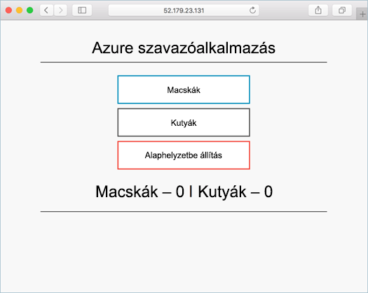

# <a name="deploy-docker-swarm-cluster"></a><span data-ttu-id="e5842-103">Docker Swarm-fürt üzembe helyezése</span><span class="sxs-lookup"><span data-stu-id="e5842-103">Deploy Docker Swarm cluster</span></span>

<span data-ttu-id="e5842-104">A gyors üzembe helyezési a Docker Swarm-fürt van telepítve hello Azure parancssori felület használatával.</span><span class="sxs-lookup"><span data-stu-id="e5842-104">In this quick start, a Docker Swarm cluster is deployed using hello Azure CLI.</span></span> <span data-ttu-id="e5842-105">Egy előtér-webkiszolgáló és a Redis példánya több tároló alkalmazás majd üzemel, és futtatása hello fürtön.</span><span class="sxs-lookup"><span data-stu-id="e5842-105">A multi-container application consisting of web front end and a Redis instance is then deployed and run on hello cluster.</span></span> <span data-ttu-id="e5842-106">Ezt követően hello alkalmazás keresztül érhető el-e hello internet.</span><span class="sxs-lookup"><span data-stu-id="e5842-106">Once completed, hello application is accessible over hello internet.</span></span>

<span data-ttu-id="e5842-107">Ha nem rendelkezik Azure-előfizetéssel, mindössze néhány perc alatt létrehozhat egy [ingyenes fiókot](https://azure.microsoft.com/free/?WT.mc_id=A261C142F) a virtuális gép létrehozásának megkezdése előtt.</span><span class="sxs-lookup"><span data-stu-id="e5842-107">If you don't have an Azure subscription, create a [free account](https://azure.microsoft.com/free/?WT.mc_id=A261C142F) before you begin.</span></span>

<span data-ttu-id="e5842-108">A gyors üzembe helyezés megköveteli, hogy verzióját hello Azure CLI 2.0.4 vagy újabb.</span><span class="sxs-lookup"><span data-stu-id="e5842-108">This quickstart requires that you are running hello Azure CLI version 2.0.4 or later.</span></span> <span data-ttu-id="e5842-109">Futtatás `az --version` toofind hello verziója.</span><span class="sxs-lookup"><span data-stu-id="e5842-109">Run `az --version` toofind hello version.</span></span> <span data-ttu-id="e5842-110">Ha tooinstall vagy frissítés van szüksége, tekintse meg [Azure CLI 2.0 telepítése]( /cli/azure/install-azure-cli).</span><span class="sxs-lookup"><span data-stu-id="e5842-110">If you need tooinstall or upgrade, see [Install Azure CLI 2.0]( /cli/azure/install-azure-cli).</span></span>

## <a name="create-a-resource-group"></a><span data-ttu-id="e5842-111">Hozzon létre egy erőforráscsoportot</span><span class="sxs-lookup"><span data-stu-id="e5842-111">Create a resource group</span></span>

<span data-ttu-id="e5842-112">Hozzon létre egy erőforráscsoportot hello [az csoport létrehozása](/cli/azure/group#create) parancsot.</span><span class="sxs-lookup"><span data-stu-id="e5842-112">Create a resource group with hello [az group create](/cli/azure/group#create) command.</span></span> <span data-ttu-id="e5842-113">Az Azure-erőforráscsoport olyan logikai csoport, amelyben az Azure-erőforrások üzembe helyezése és kezelése zajlik.</span><span class="sxs-lookup"><span data-stu-id="e5842-113">An Azure resource group is a logical group in which Azure resources are deployed and managed.</span></span>

<span data-ttu-id="e5842-114">hello alábbi példa létrehoz egy erőforráscsoportot *myResourceGroup* a hello *westus* helyét.</span><span class="sxs-lookup"><span data-stu-id="e5842-114">hello following example creates a resource group named *myResourceGroup* in hello *westus* location.</span></span>

```azurecli-interactive
az group create --name myResourceGroup --location westus
```

<span data-ttu-id="e5842-115">Kimenet:</span><span class="sxs-lookup"><span data-stu-id="e5842-115">Output:</span></span>

```json
{
  "id": "/subscriptions/00000000-0000-0000-0000-000000000000/resourceGroups/myResourceGroup",
  "location": "westcentralus",
  "managedBy": null,
  "name": "myResourceGroup",
  "properties": {
    "provisioningState": "Succeeded"
  },
  "tags": null
}
```

## <a name="create-docker-swarm-cluster"></a><span data-ttu-id="e5842-116">Docker Swarm-fürt létrehozása</span><span class="sxs-lookup"><span data-stu-id="e5842-116">Create Docker Swarm cluster</span></span>

<span data-ttu-id="e5842-117">Hozzon létre egy Docker Swarm fürtöt az Azure Tárolószolgáltatásban hello [az acs létre](/cli/azure/acs#create) parancsot.</span><span class="sxs-lookup"><span data-stu-id="e5842-117">Create a Docker Swarm cluster in Azure Container Service with hello [az acs create](/cli/azure/acs#create) command.</span></span> 

<span data-ttu-id="e5842-118">hello alábbi példakód létrehozza a fürt nevű *mySwarmCluster* egy Linux fő csomópont- és Linux-ügynök három csomópontot.</span><span class="sxs-lookup"><span data-stu-id="e5842-118">hello following example creates a cluster named *mySwarmCluster* with one Linux master node and three Linux agent nodes.</span></span>

```azurecli-interactive
az acs create --name mySwarmCluster --orchestrator-type Swarm --resource-group myResourceGroup --generate-ssh-keys
```

<span data-ttu-id="e5842-119">Pár perc múlva hello parancs befejeződött, és hello fürt json formátumú információt ad vissza.</span><span class="sxs-lookup"><span data-stu-id="e5842-119">After several minutes, hello command completes and returns json formatted information about hello cluster.</span></span>

## <a name="connect-toohello-cluster"></a><span data-ttu-id="e5842-120">Csatlakoztassa toohello fürtöt</span><span class="sxs-lookup"><span data-stu-id="e5842-120">Connect toohello cluster</span></span>

<span data-ttu-id="e5842-121">A gyors üzembe helyezési teljes kell hello Docker Swarm fő és a Docker-ügynök készlet hello hello IP-címét.</span><span class="sxs-lookup"><span data-stu-id="e5842-121">Throughout this quick start, you need hello IP address of both hello Docker Swarm master and hello Docker agent pool.</span></span> <span data-ttu-id="e5842-122">Futtassa a következő parancs tooreturn hello mindkét IP-címeket.</span><span class="sxs-lookup"><span data-stu-id="e5842-122">Run hello following command tooreturn both IP addresses.</span></span>


```bash
az network public-ip list --resource-group myResourceGroup --query '[*].{Name:name,IPAddress:ipAddress}' -o table
```

<span data-ttu-id="e5842-123">Kimenet:</span><span class="sxs-lookup"><span data-stu-id="e5842-123">Output:</span></span>

```bash
Name                                                                 IPAddress
-------------------------------------------------------------------  -------------
swarmm-agent-ip-myswarmcluster-myresourcegroup-d5b9d4agent-66066781  52.179.23.131
swarmm-master-ip-myswarmcluster-myresourcegroup-d5b9d4mgmt-66066781  52.141.37.199
```

<span data-ttu-id="e5842-124">Hozzon létre egy SSH alagút toohello Swarm fő.</span><span class="sxs-lookup"><span data-stu-id="e5842-124">Create an SSH tunnel toohello Swarm master.</span></span> <span data-ttu-id="e5842-125">Cserélje le `IPAddress` hello Swarm főkiszolgáló hello IP-címmel.</span><span class="sxs-lookup"><span data-stu-id="e5842-125">Replace `IPAddress` with hello IP address of hello Swarm master.</span></span>

```bash
ssh -p 2200 -fNL 2375:localhost:2375 azureuser@IPAddress
```

<span data-ttu-id="e5842-126">Set hello `DOCKER_HOST` környezeti változó.</span><span class="sxs-lookup"><span data-stu-id="e5842-126">Set hello `DOCKER_HOST` environment variable.</span></span> <span data-ttu-id="e5842-127">Ez lehetővé teszi toorun docker parancsok elleni Docker Swarm hello hello gazdagép toospecify hello neve nélkül.</span><span class="sxs-lookup"><span data-stu-id="e5842-127">This allows you toorun docker commands against hello Docker Swarm without having toospecify hello name of hello host.</span></span>

```bash
export DOCKER_HOST=:2375
```

<span data-ttu-id="e5842-128">Most már áll készen toorun Docker-szolgáltatásokat a Docker Swarm hello.</span><span class="sxs-lookup"><span data-stu-id="e5842-128">You are now ready toorun Docker services on hello Docker Swarm.</span></span>


## <a name="run-hello-application"></a><span data-ttu-id="e5842-129">Hello alkalmazás futtatása</span><span class="sxs-lookup"><span data-stu-id="e5842-129">Run hello application</span></span>

<span data-ttu-id="e5842-130">Hozzon létre egy fájlt `docker-compose.yaml` és a következő tartalom másolása hello bele.</span><span class="sxs-lookup"><span data-stu-id="e5842-130">Create a file named `docker-compose.yaml` and copy hello following content into it.</span></span>

```yaml
version: '3'
services:
  azure-vote-back:
    image: redis
    container_name: azure-vote-back
    ports:
        - "6379:6379"

  azure-vote-front:
    image: microsoft/azure-vote-front:redis-v1
    container_name: azure-vote-front
    environment:
      REDIS: azure-vote-back
    ports:
        - "80:80"
```

<span data-ttu-id="e5842-131">Futtassa a következő parancs toocreate hello Azure szavazattal szolgáltatás hello.</span><span class="sxs-lookup"><span data-stu-id="e5842-131">Run hello following command toocreate hello Azure Vote service.</span></span>

```bash
docker-compose up -d
```

<span data-ttu-id="e5842-132">Kimenet:</span><span class="sxs-lookup"><span data-stu-id="e5842-132">Output:</span></span>

```bash
Creating network "user_default" with hello default driver
Pulling azure-vote-front (microsoft/azure-vote-front:redis-v1)...
swarm-agent-EE873B23000005: Pulling microsoft/azure-vote-front:redis-v1...
swarm-agent-EE873B23000004: Pulling microsoft/azure-vote-front:redis-v1... : downloaded
Pulling azure-vote-back (redis:latest)...
swarm-agent-EE873B23000004: Pulling redis:latest... : downloaded
Creating azure-vote-front ... 
Creating azure-vote-back ... 
Creating azure-vote-front
Creating azure-vote-back ...
```

## <a name="test-hello-application"></a><span data-ttu-id="e5842-133">Hello alkalmazás tesztelése</span><span class="sxs-lookup"><span data-stu-id="e5842-133">Test hello application</span></span>

<span data-ttu-id="e5842-134">Keresse meg a hello Swarm ügynök készlet tootest hello Azure szavazattal alkalmazás kimenő toohello IP-címét.</span><span class="sxs-lookup"><span data-stu-id="e5842-134">Browse toohello IP address of hello Swarm agent pool tootest out hello Azure Vote application.</span></span>



## <a name="delete-cluster"></a><span data-ttu-id="e5842-136">Fürt törlése</span><span class="sxs-lookup"><span data-stu-id="e5842-136">Delete cluster</span></span>
<span data-ttu-id="e5842-137">Amikor hello fürt már nem szükséges, használhatja a hello [az csoport törlése](/cli/azure/group#delete) tooremove hello erőforráscsoport, a tárolószolgáltatás és a minden kapcsolódó erőforrások parancsot.</span><span class="sxs-lookup"><span data-stu-id="e5842-137">When hello cluster is no longer needed, you can use hello [az group delete](/cli/azure/group#delete) command tooremove hello resource group, container service, and all related resources.</span></span>

```azurecli-interactive
az group delete --name myResourceGroup --yes --no-wait
```

## <a name="get-hello-code"></a><span data-ttu-id="e5842-138">Hello kód beolvasása</span><span class="sxs-lookup"><span data-stu-id="e5842-138">Get hello code</span></span>

<span data-ttu-id="e5842-139">A gyors üzembe helyezési az előre létrehozott tároló képek használt toocreate egy Docker-szolgáltatás volt.</span><span class="sxs-lookup"><span data-stu-id="e5842-139">In this quick start, pre-created container images have been used toocreate a Docker service.</span></span> <span data-ttu-id="e5842-140">hello alkalmazáskód, Dockerfile, és a kapcsolódó új fájlt a Githubon érhetők el.</span><span class="sxs-lookup"><span data-stu-id="e5842-140">hello related application code, Dockerfile, and Compose file are available on GitHub.</span></span>

[<span data-ttu-id="e5842-141">https://github.com/Azure-Samples/azure-voting-app-redis</span><span class="sxs-lookup"><span data-stu-id="e5842-141">https://github.com/Azure-Samples/azure-voting-app-redis</span></span>](https://github.com/Azure-Samples/azure-voting-app-redis.git)

## <a name="next-steps"></a><span data-ttu-id="e5842-142">Következő lépések</span><span class="sxs-lookup"><span data-stu-id="e5842-142">Next steps</span></span>

<span data-ttu-id="e5842-143">A gyors üzembe helyezési a Docker Swarm-fürt telepítése, és a tároló több alkalmazás tooit telepítve.</span><span class="sxs-lookup"><span data-stu-id="e5842-143">In this quick start, you deployed a Docker Swarm cluster and deployed a multi-container application tooit.</span></span>

<span data-ttu-id="e5842-144">meleg Docker integrálása a Visual Studio Team Services, kapcsolatos toolearn toohello CI/CD Docker Swarm és VSTS továbbra is.</span><span class="sxs-lookup"><span data-stu-id="e5842-144">toolearn about integrating Docker warm with Visual Studio Team Services, continue toohello CI/CD with Docker Swarm and VSTS.</span></span>

> [!div class="nextstepaction"]
> [<span data-ttu-id="e5842-145">CI/CD – Docker Swarm és VSTS</span><span class="sxs-lookup"><span data-stu-id="e5842-145">CI/CD with Docker Swarm and VSTS</span></span>](./container-service-docker-swarm-setup-ci-cd.md)