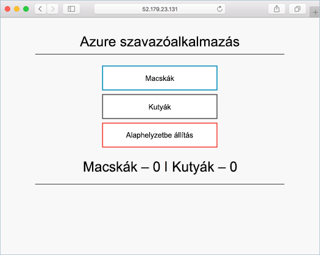

# <a name="deploy-kubernetes-cluster-for-linux-containers"></a>Kubernetes-fürt üzembe helyezése Linux-tárolók esetén

A gyors üzembe helyezési Kubernetes fürttagként van telepítve hello Azure parancssori felület használatával. Egy előtér-webkiszolgáló és a Redis példánya több tároló alkalmazás majd üzemel, és futtatása hello fürtön. Ezt követően hello alkalmazás keresztül érhető el-e hello internet. 

a dokumentumban használt hello mintaalkalmazás Python nyelven van megírva. bármely tároló kép Kubernetes fürtbe használt toodeploy lehetnek hello fogalmakat és itt részletes lépéseket. hello kódot, Dockerfile, és előre létrehozott Kubernetes jegyzékfájlt kapcsolódó toothis projekt legyenek elérhetők a [GitHub](https://github.com/Azure-Samples/azure-voting-app-redis.git).



A gyors üzembe helyezési azt feltételezi, hogy alapszinten megértse, Kubernetes fogalmakat, Kubernetes részletes információkat lásd: hello [Kubernetes dokumentáció]( https://kubernetes.io/docs/home/).

Ha nem rendelkezik Azure-előfizetéssel, mindössze néhány perc alatt létrehozhat egy [ingyenes fiókot](https://azure.microsoft.com/free/?WT.mc_id=A261C142F) a virtuális gép létrehozásának megkezdése előtt.

[!INCLUDE [cloud-shell-try-it.md](../../../includes/cloud-shell-try-it.md)]

Ha Ön tooinstall kiválasztása és hello CLI helyileg, a gyors üzembe helyezés van szükség, hogy verzióját hello Azure CLI 2.0.4 vagy újabb. Futtatás `az --version` toofind hello verziója. Ha tooinstall vagy frissítés van szüksége, tekintse meg [Azure CLI 2.0 telepítése]( /cli/azure/install-azure-cli). 

## <a name="create-a-resource-group"></a>Hozzon létre egy erőforráscsoportot

Hozzon létre egy erőforráscsoportot hello [az csoport létrehozása](/cli/azure/group#create) parancsot. Az Azure-erőforráscsoport olyan logikai csoport, amelyben az Azure-erőforrások üzembe helyezése és kezelése zajlik. 

hello alábbi példa létrehoz egy erőforráscsoportot *myResourceGroup* a hello *westeurope* helyét.

```azurecli-interactive 
az group create --name myResourceGroup --location westeurope
```

Kimenet:

```json
{
  "id": "/subscriptions/00000000-0000-0000-0000-000000000000/resourceGroups/myResourceGroup",
  "location": "westeurope",
  "managedBy": null,
  "name": "myResourceGroup",
  "properties": {
    "provisioningState": "Succeeded"
  },
  "tags": null
}
```

## <a name="create-kubernetes-cluster"></a>Kubernetes-fürt létrehozása

Hozzon létre egy Kubernetes fürtöt az Azure Tárolószolgáltatásban hello [az acs létre](/cli/azure/acs#create) parancsot. hello alábbi példakód létrehozza a fürt nevű *myK8sCluster* egy Linux fő csomópont- és Linux-ügynök három csomópontot.

```azurecli-interactive 
az acs create --orchestrator-type kubernetes --resource-group myResourceGroup --name myK8sCluster --generate-ssh-keys 
```

Pár perc múlva hello parancs befejeződött, és hello fürt json formátumú információt ad vissza. 

## <a name="connect-toohello-cluster"></a>Csatlakoztassa toohello fürtöt

toomanage Kubernetes fürt esetén használjon [kubectl](https://kubernetes.io/docs/user-guide/kubectl/), hello Kubernetes parancssori ügyfél. 

Ha az Azure CloudShellt használja, a kubectl már telepítve van. Ha azt szeretné, hogy tooinstall helyben, hogy használni tudja hello [az acs kubernetes install-cli](/cli/azure/acs/kubernetes#install-cli) parancsot.

tooconfigure kubectl tooconnect tooyour Kubernetes fürthöz, futtassa a hello [az acs kubernetes get-hitelesítő adatok](/cli/azure/acs/kubernetes#get-credentials) parancsot. Ez a lépés tölti le a hitelesítő adatokat, és konfigurálja a hello Kubernetes CLI toouse őket.

```azurecli-interactive 
az acs kubernetes get-credentials --resource-group=myResourceGroup --name=myK8sCluster
```

tooverify hello kapcsolat tooyour fürt használata hello [kubectl beolvasása](https://kubernetes.io/docs/user-guide/kubectl/v1.6/#get) parancs tooreturn hello fürtcsomópontok listáját.

```azurecli-interactive
kubectl get nodes
```

Kimenet:

```bash
NAME                    STATUS                     AGE       VERSION
k8s-agent-14ad53a1-0    Ready                      10m       v1.6.6
k8s-agent-14ad53a1-1    Ready                      10m       v1.6.6
k8s-agent-14ad53a1-2    Ready                      10m       v1.6.6
k8s-master-14ad53a1-0   Ready,SchedulingDisabled   10m       v1.6.6
```

## <a name="run-hello-application"></a>Hello alkalmazás futtatása

Kubernetes jegyzékfájlt határozza meg a kívánt állapot hello fürt, beleértve a mi tároló képek rendszerűnek kell lennie. Ebben a példában a jegyzék esetén használt toocreate szükséges toorun hello Azure szavazattal alkalmazás objektumot. 

Hozzon létre egy fájlt `azure-vote.yml` és másolja át azt a következő YAM hello. Ha az Azure Cloud Shellben dolgozik, ez a fájl a vi vagy a Nano segítségével hozható létre, ugyanúgy, mint egy virtuális vagy fizikai rendszeren.

```yaml
apiVersion: apps/v1beta1
kind: Deployment
metadata:
  name: azure-vote-back
spec:
  replicas: 1
  template:
    metadata:
      labels:
        app: azure-vote-back
    spec:
      containers:
      - name: azure-vote-back
        image: redis
        ports:
        - containerPort: 6379
          name: redis
---
apiVersion: v1
kind: Service
metadata:
  name: azure-vote-back
spec:
  ports:
  - port: 6379
  selector:
    app: azure-vote-back
---
apiVersion: apps/v1beta1
kind: Deployment
metadata:
  name: azure-vote-front
spec:
  replicas: 1
  template:
    metadata:
      labels:
        app: azure-vote-front
    spec:
      containers:
      - name: azure-vote-front
        image: microsoft/azure-vote-front:redis-v1
        ports:
        - containerPort: 80
        env:
        - name: REDIS
          value: "azure-vote-back"
---
apiVersion: v1
kind: Service
metadata:
  name: azure-vote-front
spec:
  type: LoadBalancer
  ports:
  - port: 80
  selector:
    app: azure-vote-front
```

Használjon hello [kubectl létrehozása](https://kubernetes.io/docs/user-guide/kubectl/v1.6/#create) toorun hello alkalmazás parancsot.

```azurecli-interactive
kubectl create -f azure-vote.yml
```

Kimenet:

```bash
deployment "azure-vote-back" created
service "azure-vote-back" created
deployment "azure-vote-front" created
service "azure-vote-front" created
```

## <a name="test-hello-application"></a>Hello alkalmazás tesztelése

Hello alkalmazás fut, mint egy [Kubernetes szolgáltatás](https://kubernetes.io/docs/concepts/services-networking/service/) jön létre, hogy tesz elérhetővé hello alkalmazás előtér toohello internet. A folyamat eltarthat néhány percig toocomplete. 

toomonitor folyamatban, használjon hello [kubectl beolvasása szolgáltatás](https://kubernetes.io/docs/user-guide/kubectl/v1.6/#get) hello parancsot `--watch` argumentum.

```azurecli-interactive
kubectl get service azure-vote-front --watch
```

Kezdetben hello **külső IP-** a hello *azure-szavazat-front* szolgáltatás jelenik meg *függőben lévő*. Miután hello külső IP-cím megváltozott *függőben lévő* tooan *IP-cím*, használjon `CTRL-C` toostop hello kubectl figyelési folyamat. 
  
```bash
azure-vote-front   10.0.34.242   <pending>     80:30676/TCP   7s
azure-vote-front   10.0.34.242   52.179.23.131   80:30676/TCP   2m
```

Tallózhatnak toohello külső IP cím toosee hello Azure szavazattal alkalmazást.

  

## <a name="delete-cluster"></a>Fürt törlése
Amikor hello fürt már nem szükséges, használhatja a hello [az csoport törlése](/cli/azure/group#delete) tooremove hello erőforráscsoport, a tárolószolgáltatás és a minden kapcsolódó erőforrások parancsot.

```azurecli-interactive 
az group delete --name myResourceGroup --yes --no-wait
```

## <a name="get-hello-code"></a>Hello kód beolvasása

A gyors üzembe helyezési az előre létrehozott tároló képek használt toocreate Kubernetes központi telepítés volt. hello alkalmazáskód, Dockerfile, és a kapcsolódó Kubernetes jegyzékfájl a Githubon érhetők el.

[https://github.com/Azure-Samples/azure-voting-app-redis](https://github.com/Azure-Samples/azure-voting-app-redis.git)

## <a name="next-steps"></a>Következő lépések

A gyors üzembe helyezési Kubernetes fürt telepített, és a tároló több alkalmazás tooit telepítve. 

További információ az Azure Tárolószolgáltatás és a lépésein végighaladva teljes kód toodeployment példában toolearn toohello Kubernetes fürt oktatóanyag továbbra is.

> [!div class="nextstepaction"]
> [ACS Kubernetes-fürtök kezelése](./container-service-tutorial-kubernetes-prepare-app.md)
