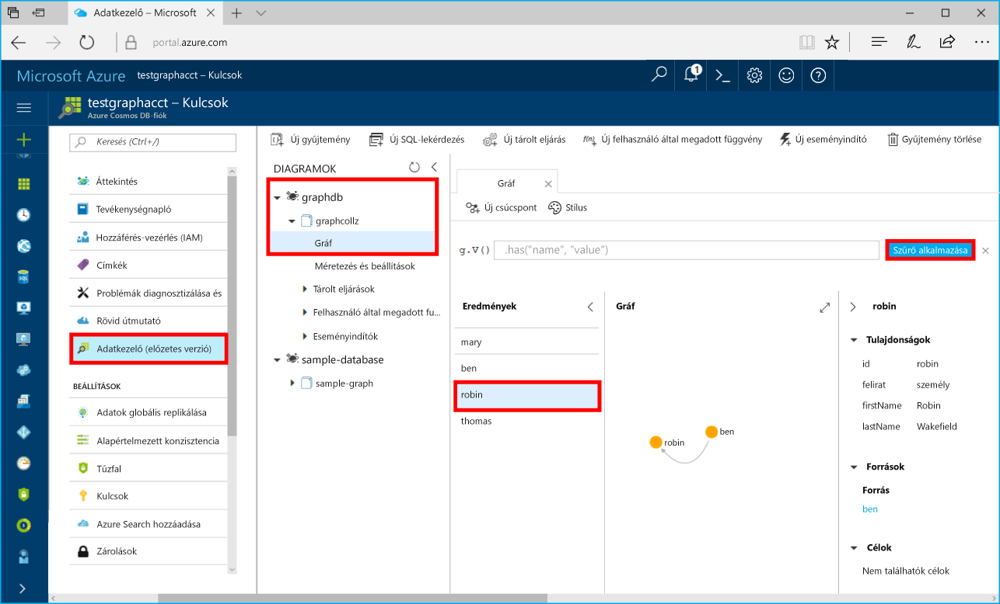

# <a name="azure-cosmos-db-build-a-net-application-using-hello-graph-api"></a><span data-ttu-id="fdf66-103">Azure Cosmos DB: Hello Graph API segítségével .NET-alkalmazás létrehozása</span><span class="sxs-lookup"><span data-stu-id="fdf66-103">Azure Cosmos DB: Build a .NET application using hello Graph API</span></span>

<span data-ttu-id="fdf66-104">Az Azure Cosmos DB a Microsoft globálisan elosztott többmodelles adatbázis-szolgáltatása.</span><span class="sxs-lookup"><span data-stu-id="fdf66-104">Azure Cosmos DB is Microsoft’s globally distributed multi-model database service.</span></span> <span data-ttu-id="fdf66-105">Gyorsan hozzon létre, és a dokumentum, a kulcs/érték és a graph adatbázisok, amelyek kihasználhassa hello globális terjesztési és horizontális skálázhatóságot képességekről az Azure-Cosmos adatbázis hello core lekérdezése.</span><span class="sxs-lookup"><span data-stu-id="fdf66-105">You can quickly create and query document, key/value, and graph databases, all of which benefit from hello global distribution and horizontal scale capabilities at hello core of Azure Cosmos DB.</span></span> 

<span data-ttu-id="fdf66-106">A gyors üzembe helyezési bemutatja, hogyan toocreate Azure Cosmos DB fiókkal, az adatbázis és a graph (tároló) használatával hello Azure-portálon.</span><span class="sxs-lookup"><span data-stu-id="fdf66-106">This quick start demonstrates how toocreate an Azure Cosmos DB account, database, and graph (container) using hello Azure portal.</span></span> <span data-ttu-id="fdf66-107">Majd létrehozása és futtatása egy konzolalkalmazás hello épülő [Graph API](graph-sdk-dotnet.md) (előzetes verzió).</span><span class="sxs-lookup"><span data-stu-id="fdf66-107">You then build and run a console app built on hello [Graph API](graph-sdk-dotnet.md) (preview).</span></span>  

## <a name="prerequisites"></a><span data-ttu-id="fdf66-108">Előfeltételek</span><span class="sxs-lookup"><span data-stu-id="fdf66-108">Prerequisites</span></span>

<span data-ttu-id="fdf66-109">Ha még nincs telepítve a Visual Studio 2017, töltse le és használja a hello **szabad** [Visual Studio 2017 Community Edition](https://www.visualstudio.com/downloads/).</span><span class="sxs-lookup"><span data-stu-id="fdf66-109">If you don’t already have Visual Studio 2017 installed, you can download and use hello **free** [Visual Studio 2017 Community Edition](https://www.visualstudio.com/downloads/).</span></span> <span data-ttu-id="fdf66-110">Győződjön meg arról, hogy engedélyezze **Azure fejlesztési** hello Visual Studio telepítése során.</span><span class="sxs-lookup"><span data-stu-id="fdf66-110">Make sure that you enable **Azure development** during hello Visual Studio setup.</span></span>

[!INCLUDE [quickstarts-free-trial-note](../../includes/quickstarts-free-trial-note.md)]

## <a name="create-a-database-account"></a><span data-ttu-id="fdf66-111">Adatbázisfiók létrehozása</span><span class="sxs-lookup"><span data-stu-id="fdf66-111">Create a database account</span></span>

[!INCLUDE [cosmos-db-create-dbaccount-graph](../../includes/cosmos-db-create-dbaccount-graph.md)]

## <a name="add-a-graph"></a><span data-ttu-id="fdf66-112">Gráf hozzáadása</span><span class="sxs-lookup"><span data-stu-id="fdf66-112">Add a graph</span></span>

[!INCLUDE [cosmos-db-create-graph](../../includes/cosmos-db-create-graph.md)]

## <a name="clone-hello-sample-application"></a><span data-ttu-id="fdf66-113">Klónozza a mintaalkalmazást hello</span><span class="sxs-lookup"><span data-stu-id="fdf66-113">Clone hello sample application</span></span>

<span data-ttu-id="fdf66-114">Most tegyük a githubból, a Klónozás egy grafikonon API app hello kapcsolati karakterlánc beállítása, és futtassa azt.</span><span class="sxs-lookup"><span data-stu-id="fdf66-114">Now let's clone a Graph API app from github, set hello connection string, and run it.</span></span> <span data-ttu-id="fdf66-115">Láthatja, milyen egyszerűen adatokkal toowork programozott módon.</span><span class="sxs-lookup"><span data-stu-id="fdf66-115">You'll see how easy it is toowork with data programmatically.</span></span> 

1. <span data-ttu-id="fdf66-116">Nyisson meg egy git terminálablakot, például a git bash eszközt, és `cd` tooa munkakönyvtárát.</span><span class="sxs-lookup"><span data-stu-id="fdf66-116">Open a git terminal window, such as git bash, and `cd` tooa working directory.</span></span>  

2. <span data-ttu-id="fdf66-117">Futtassa a következő parancs tooclone hello minta tárház hello.</span><span class="sxs-lookup"><span data-stu-id="fdf66-117">Run hello following command tooclone hello sample repository.</span></span> 

    ```bash
    git clone https://github.com/Azure-Samples/azure-cosmos-db-graph-dotnet-getting-started.git
    ```

3. <span data-ttu-id="fdf66-118">Nyissa meg a Visual Studio és a nyitott hello megoldásfájlt.</span><span class="sxs-lookup"><span data-stu-id="fdf66-118">Then open Visual Studio and open hello solution file.</span></span> 

## <a name="review-hello-code"></a><span data-ttu-id="fdf66-119">Tekintse át a hello kódot</span><span class="sxs-lookup"><span data-stu-id="fdf66-119">Review hello code</span></span>

<span data-ttu-id="fdf66-120">Most Meggyőződünk arról, mi történik a hello app gyors áttekintése.</span><span class="sxs-lookup"><span data-stu-id="fdf66-120">Let's make a quick review of what's happening in hello app.</span></span> <span data-ttu-id="fdf66-121">Nyissa meg hello Program.cs fájlt, és, hogy ezek a sorok, a kód létrehozása hello Azure Cosmos DB erőforrások találhat.</span><span class="sxs-lookup"><span data-stu-id="fdf66-121">Open hello Program.cs file and you'll find that these lines of code create hello Azure Cosmos DB resources.</span></span> 

* <span data-ttu-id="fdf66-122">hello DocumentClient inicializálva van.</span><span class="sxs-lookup"><span data-stu-id="fdf66-122">hello DocumentClient is initialized.</span></span> <span data-ttu-id="fdf66-123">A képen hello egy grafikonon bővítmény API hello Azure Cosmos DB ügyfélen hozzáadott.</span><span class="sxs-lookup"><span data-stu-id="fdf66-123">In hello preview, we added a graph extension API on hello Azure Cosmos DB client.</span></span> <span data-ttu-id="fdf66-124">Egy önálló graph ügyfél hello Azure Cosmos DB ügyfél és az erőforrások különválik dolgozunk.</span><span class="sxs-lookup"><span data-stu-id="fdf66-124">We are working on a standalone graph client decoupled from hello Azure Cosmos DB client and resources.</span></span>

    ```csharp
    using (DocumentClient client = new DocumentClient(
        new Uri(endpoint),
        authKey,
        new ConnectionPolicy { ConnectionMode = ConnectionMode.Direct, ConnectionProtocol = Protocol.Tcp }))
    ```

* <span data-ttu-id="fdf66-125">A rendszer létrehozza az új adatbázist.</span><span class="sxs-lookup"><span data-stu-id="fdf66-125">A new database is created.</span></span>

    ```csharp
    Database database = await client.CreateDatabaseIfNotExistsAsync(new Database { Id = "graphdb" });
    ```

* <span data-ttu-id="fdf66-126">A rendszer létrehozza az új gráfot.</span><span class="sxs-lookup"><span data-stu-id="fdf66-126">A new graph is created.</span></span>

    ```csharp
    DocumentCollection graph = await client.CreateDocumentCollectionIfNotExistsAsync(
        UriFactory.CreateDatabaseUri("graphdb"),
        new DocumentCollection { Id = "graph" },
        new RequestOptions { OfferThroughput = 1000 });
    ```
* <span data-ttu-id="fdf66-127">Hello Gremlin lépések egy sorozatát végrehajtása `CreateGremlinQuery` metódust.</span><span class="sxs-lookup"><span data-stu-id="fdf66-127">A series of Gremlin steps are executed using hello `CreateGremlinQuery` method.</span></span>

    ```csharp
    // hello CreateGremlinQuery method extensions allow you tooexecute Gremlin queries and iterate
    // results asychronously
    IDocumentQuery<dynamic> query = client.CreateGremlinQuery<dynamic>(graph, "g.V().count()");
    while (query.HasMoreResults)
    {
        foreach (dynamic result in await query.ExecuteNextAsync())
        {
            Console.WriteLine($"\t {JsonConvert.SerializeObject(result)}");
        }
    }

    ```

## <a name="update-your-connection-string"></a><span data-ttu-id="fdf66-128">A kapcsolati karakterlánc frissítése</span><span class="sxs-lookup"><span data-stu-id="fdf66-128">Update your connection string</span></span>

<span data-ttu-id="fdf66-129">Most lépjen vissza az Azure portál tooget toohello kapcsolati karakterlánc adatainak és hello alkalmazásba másolja.</span><span class="sxs-lookup"><span data-stu-id="fdf66-129">Now go back toohello Azure portal tooget your connection string information and copy it into hello app.</span></span>

1. <span data-ttu-id="fdf66-130">Nyissa meg a Visual Studio 2017 hello App.config fájlt.</span><span class="sxs-lookup"><span data-stu-id="fdf66-130">In Visual Studio 2017, open hello App.config file.</span></span> 

2. <span data-ttu-id="fdf66-131">Hello Azure portál Azure Cosmos DB fiókjában kattintson **kulcsok** a bal oldali navigációs hello.</span><span class="sxs-lookup"><span data-stu-id="fdf66-131">In hello Azure portal, in your Azure Cosmos DB account, click **Keys** in hello left navigation.</span></span> 

    

3. <span data-ttu-id="fdf66-133">Másolás a **URI** hello portálról értékét, és könnyebben hello az App.config fájlban hello végpont kulcs értékét. Képernyőkép toocopy hello érték megelőző hello látható módon használhatja hello Másolás gombra.</span><span class="sxs-lookup"><span data-stu-id="fdf66-133">Copy your **URI** value from hello portal and make it hello value of hello Endpoint key in App.config. You can use hello copy button as shown in hello preceding screenshot toocopy hello value.</span></span>

    `<add key="Endpoint" value="https://FILLME.documents.azure.com:443" />`

4. <span data-ttu-id="fdf66-134">Másolás a **elsődleges kulcs** hello portal értéket, és teszi hello az App.config fájlban hello AuthKey kulcs értékét, majd mentse a módosításokat.</span><span class="sxs-lookup"><span data-stu-id="fdf66-134">Copy your **PRIMARY KEY** value from hello portal, and make it hello value of hello AuthKey key in App.config, then save your changes.</span></span> 

    `<add key="AuthKey" value="FILLME" />`

<span data-ttu-id="fdf66-135">Most már frissítette az alkalmazást az Azure Cosmos DB toocommunicate szükséges összes hello információval.</span><span class="sxs-lookup"><span data-stu-id="fdf66-135">You've now updated your app with all hello info it needs toocommunicate with Azure Cosmos DB.</span></span> 

## <a name="run-hello-console-app"></a><span data-ttu-id="fdf66-136">Hello konzol alkalmazás futtatása</span><span class="sxs-lookup"><span data-stu-id="fdf66-136">Run hello console app</span></span>

1. <span data-ttu-id="fdf66-137">A Visual Studióban, kattintson a jobb gombbal a hello **GraphGetStarted** a projekt **Megoldáskezelőben** majd **NuGet-csomagok kezelése**.</span><span class="sxs-lookup"><span data-stu-id="fdf66-137">In Visual Studio, right-click on hello **GraphGetStarted** project in **Solution Explorer** and then click **Manage NuGet Packages**.</span></span> 

2. <span data-ttu-id="fdf66-138">A hello NuGet **Tallózás** mezőbe írja be *Microsoft.Azure.Graphs* , és ellenőrizze a hello **prerelease tartalmazza** mezőbe.</span><span class="sxs-lookup"><span data-stu-id="fdf66-138">In hello NuGet **Browse** box, type *Microsoft.Azure.Graphs* and check hello **Includes prerelease** box.</span></span> 

3. <span data-ttu-id="fdf66-139">Hello eredmények közül telepítse a hello **Microsoft.Azure.Graphs** könyvtárban.</span><span class="sxs-lookup"><span data-stu-id="fdf66-139">From hello results, install hello **Microsoft.Azure.Graphs** library.</span></span> <span data-ttu-id="fdf66-140">Ezzel telepít hello Azure Cosmos DB diagram bővítmény kódtár csomagja és az összes függősége.</span><span class="sxs-lookup"><span data-stu-id="fdf66-140">This installs hello Azure Cosmos DB graph extension library package and all dependencies.</span></span>

    <span data-ttu-id="fdf66-141">Ha kapcsolatos módosításokat toohello megoldás áttekintése figyelmeztető hibaüzenet jelenik meg, kattintson a **OK**.</span><span class="sxs-lookup"><span data-stu-id="fdf66-141">If you get a message about reviewing changes toohello solution, click **OK**.</span></span> <span data-ttu-id="fdf66-142">Ha a licenc elfogadásáról szóló üzenetet kap, kattintson az **Elfogadom** gombra.</span><span class="sxs-lookup"><span data-stu-id="fdf66-142">If you get a message about license acceptance, click **I accept**.</span></span>

4. <span data-ttu-id="fdf66-143">Kattintson a CTRL + F5 toorun hello alkalmazás.</span><span class="sxs-lookup"><span data-stu-id="fdf66-143">Click CTRL + F5 toorun hello application.</span></span>

   <span data-ttu-id="fdf66-144">hello konzolablak hello csomópontok és a hozzáadni kívánt toohello graph jeleníti meg.</span><span class="sxs-lookup"><span data-stu-id="fdf66-144">hello console window displays hello vertexes and edges being added toohello graph.</span></span> <span data-ttu-id="fdf66-145">Hello parancsprogram befejezését, nyomja le az ENTER kétszer tooclose hello console ablakban.</span><span class="sxs-lookup"><span data-stu-id="fdf66-145">When hello script completes, press ENTER twice tooclose hello console window.</span></span> 

## <a name="browse-using-hello-data-explorer"></a><span data-ttu-id="fdf66-146">Keresse meg a hello adatkezelő használatával</span><span class="sxs-lookup"><span data-stu-id="fdf66-146">Browse using hello Data Explorer</span></span>

<span data-ttu-id="fdf66-147">Ezután lépjen vissza tooData Explorer hello Azure-portálon a és keresse meg és az új diagram adatait kéri.</span><span class="sxs-lookup"><span data-stu-id="fdf66-147">You can now go back tooData Explorer in hello Azure portal and browse and query your new graph data.</span></span>

1. <span data-ttu-id="fdf66-148">Az adatok Explorer hello új adatbázis hello diagramjait ablaktáblán jelenik meg.</span><span class="sxs-lookup"><span data-stu-id="fdf66-148">In Data Explorer, hello new database appears in hello Graphs pane.</span></span> <span data-ttu-id="fdf66-149">Bontsa ki a **graphdb**, **graphcollz** pontokat, és kattintson a **Gráf** lehetőségre.</span><span class="sxs-lookup"><span data-stu-id="fdf66-149">Expand **graphdb**, **graphcollz**, and then click **Graph**.</span></span>

2. <span data-ttu-id="fdf66-150">Kattintson a hello **szűrés** gomb toouse hello alapértelmezett lekérdezési tooview összes hello verticies hello gráfban.</span><span class="sxs-lookup"><span data-stu-id="fdf66-150">Click hello **Apply Filter** button toouse hello default query tooview all hello verticies in hello graph.</span></span> <span data-ttu-id="fdf66-151">hello minta alkalmazás által generált hello adatok hello diagramjait ablaktáblán jelennek meg.</span><span class="sxs-lookup"><span data-stu-id="fdf66-151">hello data generated by hello sample app is displayed in hello Graphs pane.</span></span>

    <span data-ttu-id="fdf66-152">Mindkét hello graph ráközelíthet, bontsa ki a hello diagram megjelenítési terület, hozzáadhat további verticies, és helyezze át a hello verticies felületét jeleníti meg.</span><span class="sxs-lookup"><span data-stu-id="fdf66-152">You can zoom in and out of hello graph, you can expand hello graph display space, add additional verticies, and move verticies on hello display surface.</span></span>

    

## <a name="review-slas-in-hello-azure-portal"></a><span data-ttu-id="fdf66-154">Tekintse át a szolgáltatásiszint-szerződések a hello Azure-portálon</span><span class="sxs-lookup"><span data-stu-id="fdf66-154">Review SLAs in hello Azure portal</span></span>

[!INCLUDE [cosmosdb-tutorial-review-slas](../../includes/cosmos-db-tutorial-review-slas.md)]

## <a name="clean-up-resources"></a><span data-ttu-id="fdf66-155">Az erőforrások eltávolítása</span><span class="sxs-lookup"><span data-stu-id="fdf66-155">Clean up resources</span></span>

<span data-ttu-id="fdf66-156">Toocontinue toouse az alkalmazás nem fog, ha törli az összes erőforrást hozta létre a gyors üzembe helyezés hello az Azure-portálon az alábbi lépésekkel hello:</span><span class="sxs-lookup"><span data-stu-id="fdf66-156">If you're not going toocontinue toouse this app, delete all resources created by this quickstart in hello Azure portal with hello following steps:</span></span> 

1. <span data-ttu-id="fdf66-157">A hello hello Azure-portálon a bal oldali menüből, kattintson az **erőforráscsoportok** és kattintson a létrehozott hello erőforrás hello nevét.</span><span class="sxs-lookup"><span data-stu-id="fdf66-157">From hello left-hand menu in hello Azure portal, click **Resource groups** and then click hello name of hello resource you created.</span></span> 
2. <span data-ttu-id="fdf66-158">Az erőforrás csoport lapján kattintson a **törlése**, írja be a hello szövegmező hello erőforrás toodelete hello nevét, és kattintson **törlése**.</span><span class="sxs-lookup"><span data-stu-id="fdf66-158">On your resource group page, click **Delete**, type hello name of hello resource toodelete in hello text box, and then click **Delete**.</span></span>

## <a name="next-steps"></a><span data-ttu-id="fdf66-159">Következő lépések</span><span class="sxs-lookup"><span data-stu-id="fdf66-159">Next steps</span></span>

<span data-ttu-id="fdf66-160">A gyors üzembe helyezés hogy megtanulta, hogyan toocreate Azure Cosmos DB adatait, hozzon létre egy grafikonon hello adatkezelő használatával, és futtassa az alkalmazást.</span><span class="sxs-lookup"><span data-stu-id="fdf66-160">In this quickstart, you've learned how toocreate an Azure Cosmos DB account, create a graph using hello Data Explorer, and run an app.</span></span> <span data-ttu-id="fdf66-161">Most már készen áll arra, hogy a Gremlin használatával összetettebb lekérdezéseket hozzon létre és hatékony gráfbejárási logikákat implementáljon.</span><span class="sxs-lookup"><span data-stu-id="fdf66-161">You can now build more complex queries and implement powerful graph traversal logic using Gremlin.</span></span> 

> [!div class="nextstepaction"]
> [<span data-ttu-id="fdf66-162">Lekérdezés a Gremlin használatával</span><span class="sxs-lookup"><span data-stu-id="fdf66-162">Query using Gremlin</span></span>](tutorial-query-graph.md)

