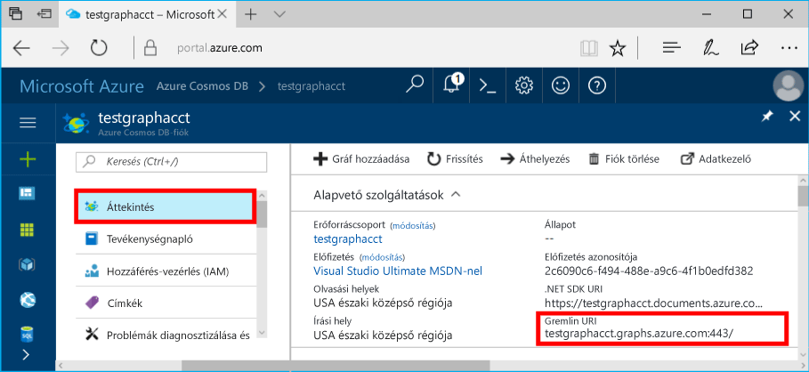
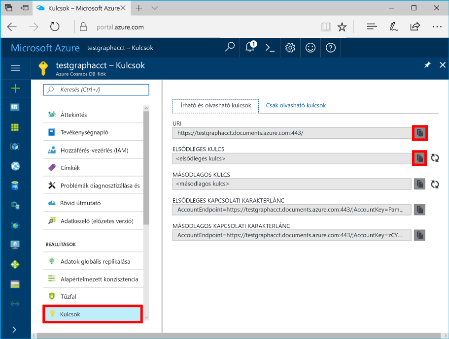

# <a name="azure-cosmos-db-create-query-and-traverse-a-graph-in-hello-gremlin-console"></a>Az Azure Cosmos DB: Hozzon létre a lekérdezést, és haladnak át egy grafikonon hello Gremlin konzolon

Az Azure Cosmos DB a Microsoft globálisan elosztott többmodelles adatbázis-szolgáltatása. Gyorsan hozzon létre, és a dokumentum, a kulcs/érték és a graph adatbázisok, amelyek kihasználhassa hello globális terjesztési és horizontális skálázhatóságot képességekről az Azure-Cosmos adatbázis hello core lekérdezése. 

A gyors üzembe helyezési bemutatja, hogyan toocreate Azure Cosmos DB fiókkal, az adatbázis és a graph (tároló) használatával hello Azure-portálon, majd használja hello [Gremlin konzol](https://tinkerpop.apache.org/docs/current/reference/#gremlin-console) a [Apache TinkerPop](http://tinkerpop.apache.org) rendelkező toowork Diagramadatok API (előzetes verzió). Ebben az oktatóanyagban, és lekérdezi a csúcsban és szélén, egy csúcsának tulajdonság csúcsban lekérdezésére, hello graph haladnak át, és dobja el a csúcspont.


hello Gremlin konzol Groovy/Java-alapú, és a Linux, Mac és Windows futtatja. Letölthető hello [Apache TinkerPop hely](https://www.apache.org/dyn/closer.lua/tinkerpop/3.2.5/apache-tinkerpop-gremlin-console-3.2.5-bin.zip).

## <a name="prerequisites"></a>Előfeltételek

A gyors üzembe helyezés toohave egy Azure-előfizetés toocreate Azure Cosmos DB fiók szükséges.

[!INCLUDE [quickstarts-free-trial-note](../../includes/quickstarts-free-trial-note.md)]

Szükség tooinstall hello [Gremlin konzol](http://tinkerpop.apache.org/). A 3.2.5-ös vagy újabb verziót használja.

## <a name="create-a-database-account"></a>Adatbázisfiók létrehozása

[!INCLUDE [cosmos-db-create-dbaccount-graph](../../includes/cosmos-db-create-dbaccount-graph.md)]

## <a name="add-a-graph"></a>Gráf hozzáadása

[!INCLUDE [cosmos-db-create-graph](../../includes/cosmos-db-create-graph.md)]

## <a id="ConnectAppService"></a>Csatlakozás tooyour app service
1. Elindítása előtt hello Gremlin konzol, hozzon létre, vagy módosítsa a hello távoli-secure.yaml konfigurációs fájl hello apache-tinkerpop-gremlin-console-3.2.5/conf könyvtárban.
2. Adja meg a *host* (gazdagép), *Port*, *username* (felhasználónév), *password* (jelszó), *ConnectionPool* (kapcsolatkészlet), és *serializer* (szerializáló) beállításokat:

    Beállítás|Ajánlott érték|Leírás
    ---|---|---
    gazdagépek|[***.graphs.azure.com]|Lásd az alábbi képernyőképet. Ez az hello Gremlin URI azonosítóját az Azure-portálon, a hello záró szögletes zárójelben hello hello áttekintése lapon: 443 / eltávolított.<br><br>Ez az érték is lekérhetők hello kulcsok lapon hello URI érték használatával https:// eltávolítása, dokumentumok toographs módosítása és eltávolítása a hello záró: 443 /.
    port|443|Állítsa be a too443.
    felhasználónév|*Az Ön felhasználóneve*|erőforrás hello űrlap hello `/dbs/<db>/colls/<coll>` ahol `<db>` az adatbázisnév és `<coll>` a gyűjtemény neve.
    jelszó|*Az Ön elsődleges kulcsa*| Lásd az alábbiakban a második képernyőképet. Ez az az elsődleges kulcs, és beolvasható hello kulcsok lapján hello hello elsődleges kulcs mezőben Azure-portálon. Hello bal oldalán hello lista toocopy hello értékét használja a hello Másolás gombra.
    kapcsolatkészlet|{enableSsl: true}|A kapcsolatkészletre vonatkozó beállítás az SSL-hez.
    szerializáló|{ className: org.apache.tinkerpop.gremlin.<br>driver.ser.GraphSONMessageSerializerV1d0,<br> config: { serializeResultToString: true }}|Toothis érték, és töröl minden `\n` oldaltörések sor hello érték beillesztéskor.

    Hello állomások értékhez, másolja a hello **Gremlin URI** hello értéket **áttekintése** lap: 

    Hello jelszó értékét, másolja a hello **elsődleges kulcs** a hello **kulcsok** lap: 


3. Futtassa a terminálon `bin/gremlin.bat` vagy `bin/gremlin.sh` toostart hello [Gremlin konzol](http://tinkerpop.apache.org/docs/3.2.5/tutorials/getting-started/).
4. Futtassa a terminálon `:remote connect tinkerpop.server conf/remote-secure.yaml` tooconnect tooyour app service.

    > [!TIP]
    > Ha hello hibaüzenet `No appenders could be found for logger` ellenőrizze, hogy a 2. lépésben leírtak hello szerializáló érték hello távoli-secure.yaml fájl frissítése. 

Remek! Most, hogy befejeztük hello beállítása, először néhány konzol parancsok futtatása.

Próbáljon ki egy egyszerű count() parancsot. Írja be a hello következő hello konzolba hello parancssorba:
```
:> g.V().count()
```

> [!TIP]
> Értesítés hello `:>` , amely megelőzi hello `g.V().count()` szöveg? 
>
> Ez tootype kell hello parancs része. Fontos hello Gremlin konzol, az Azure Cosmos DB használatakor.  
>
> Ez kihagyásával `:>` előtag utasítja hello konzol tooexecute hello parancsot helyileg, gyakran egy memórián belüli graph ellen.
> Ennek segítségével `:>` hatására hello konzol tooexecute egy távoli parancs, ebben az esetben Cosmos DB ellen (vagy hello localhost emulátor, vagy egy > Azure-példányt).


## <a name="create-vertices-and-edges"></a>Csúcsok és élek létrehozása

Először hozzon létre öt darab, egy-egy személyt jelölő csúcsot *Thomas*, *Mary Kay*, *Robin*, *Ben*, és *Jack* néven.

Bemenet (Thomas):

```
:> g.addV('person').property('firstName', 'Thomas').property('lastName', 'Andersen').property('age', 44).property('userid', 1)
```

Kimenet:

```
==>[id:796cdccc-2acd-4e58-a324-91d6f6f5ed6d,label:person,type:vertex,properties:[firstName:[[id:f02a749f-b67c-4016-850e-910242d68953,value:Thomas]],lastName:[[id:f5fa3126-8818-4fda-88b0-9bb55145ce5c,value:Andersen]],age:[[id:f6390f9c-e563-433e-acbf-25627628016e,value:44]],userid:[[id:796cdccc-2acd-4e58-a324-91d6f6f5ed6d|userid,value:1]]]]
```
Bemenet (Mary Kay):

```
:> g.addV('person').property('firstName', 'Mary Kay').property('lastName', 'Andersen').property('age', 39).property('userid', 2)

```

Kimenet:

```
==>[id:0ac9be25-a476-4a30-8da8-e79f0119ea5e,label:person,type:vertex,properties:[firstName:[[id:ea0604f8-14ee-4513-a48a-1734a1f28dc0,value:Mary Kay]],lastName:[[id:86d3bba5-fd60-4856-9396-c195ef7d7f4b,value:Andersen]],age:[[id:bc81b78d-30c4-4e03-8f40-50f72eb5f6da,value:39]],userid:[[id:0ac9be25-a476-4a30-8da8-e79f0119ea5e|userid,value:2]]]]

```

Bemenet (Robin):

```
:> g.addV('person').property('firstName', 'Robin').property('lastName', 'Wakefield').property('userid', 3)
```

Kimenet:

```
==>[id:8dc14d6a-8683-4a54-8d74-7eef1fb43a3e,label:person,type:vertex,properties:[firstName:[[id:ec65f078-7a43-4cbe-bc06-e50f2640dc4e,value:Robin]],lastName:[[id:a3937d07-0e88-45d3-a442-26fcdfb042ce,value:Wakefield]],userid:[[id:8dc14d6a-8683-4a54-8d74-7eef1fb43a3e|userid,value:3]]]]
```

Bemenet (Ben):

```
:> g.addV('person').property('firstName', 'Ben').property('lastName', 'Miller').property('userid', 4)

```

Kimenet:

```
==>[id:ee86b670-4d24-4966-9a39-30529284b66f,label:person,type:vertex,properties:[firstName:[[id:a632469b-30fc-4157-840c-b80260871e9a,value:Ben]],lastName:[[id:4a08d307-0719-47c6-84ae-1b0b06630928,value:Miller]],userid:[[id:ee86b670-4d24-4966-9a39-30529284b66f|userid,value:4]]]]
```

Bemenet (Jack):

```
:> g.addV('person').property('firstName', 'Jack').property('lastName', 'Connor').property('userid', 5)
```

Kimenet:

```
==>[id:4c835f2a-ea5b-43bb-9b6b-215488ad8469,label:person,type:vertex,properties:[firstName:[[id:4250824e-4b72-417f-af98-8034aa15559f,value:Jack]],lastName:[[id:44c1d5e1-a831-480a-bf94-5167d133549e,value:Connor]],userid:[[id:4c835f2a-ea5b-43bb-9b6b-215488ad8469|userid,value:5]]]]
```


Ezután adjunk meg éleket. Ezek a személyek közötti kapcsolatokat jelölik.

Bemenet (Thomas -> Mary Kay):

```
:> g.V().hasLabel('person').has('firstName', 'Thomas').addE('knows').to(g.V().hasLabel('person').has('firstName', 'Mary Kay'))
```

Kimenet:

```
==>[id:c12bf9fb-96a1-4cb7-a3f8-431e196e702f,label:knows,type:edge,inVLabel:person,outVLabel:person,inV:0d1fa428-780c-49a5-bd3a-a68d96391d5c,outV:1ce821c6-aa3d-4170-a0b7-d14d2a4d18c3]
```

Bemenet (Thomas -> Robin):

```
:> g.V().hasLabel('person').has('firstName', 'Thomas').addE('knows').to(g.V().hasLabel('person').has('firstName', 'Robin'))
```

Kimenet:

```
==>[id:58319bdd-1d3e-4f17-a106-0ddf18719d15,label:knows,type:edge,inVLabel:person,outVLabel:person,inV:3e324073-ccfc-4ae1-8675-d450858ca116,outV:1ce821c6-aa3d-4170-a0b7-d14d2a4d18c3]
```

Bemenet (Robin -> Ben):

```
:> g.V().hasLabel('person').has('firstName', 'Robin').addE('knows').to(g.V().hasLabel('person').has('firstName', 'Ben'))
```

Kimenet:

```
==>[id:889c4d3c-549e-4d35-bc21-a3d1bfa11e00,label:knows,type:edge,inVLabel:person,outVLabel:person,inV:40fd641d-546e-412a-abcc-58fe53891aab,outV:3e324073-ccfc-4ae1-8675-d450858ca116]
```

## <a name="update-a-vertex"></a>Csúcs frissítése

Most frissíteni hello *Thomas* rendelkező új korát csúcspont *45*.

Bemenet:
```
:> g.V().hasLabel('person').has('firstName', 'Thomas').property('age', 45)
```
Kimenet:

```
==>[id:ae36f938-210e-445a-92df-519f2b64c8ec,label:person,type:vertex,properties:[firstName:[[id:872090b6-6a77-456a-9a55-a59141d4ebc2,value:Thomas]],lastName:[[id:7ee7a39a-a414-4127-89b4-870bc4ef99f3,value:Andersen]],age:[[id:a2a75d5a-ae70-4095-806d-a35abcbfe71d,value:45]]]]
```

## <a name="query-your-graph"></a>Gráf lekérdezése

Futtassunk néhány lekérdezést a gráfon.

Első lépésként próbáljuk meg egy lekérdezést egy szűrő tooreturn csak akik régebbi, mint a 40 éves.

Bemenet (szűrőlekérdezés):

```
:> g.V().hasLabel('person').has('age', gt(40))
```

Kimenet:

```
==>[id:ae36f938-210e-445a-92df-519f2b64c8ec,label:person,type:vertex,properties:[firstName:[[id:872090b6-6a77-456a-9a55-a59141d4ebc2,value:Thomas]],lastName:[[id:7ee7a39a-a414-4127-89b4-870bc4ef99f3,value:Andersen]],age:[[id:a2a75d5a-ae70-4095-806d-a35abcbfe71d,value:45]]]]
```

Ezt követően most project hello Keresztnév régebbi, mint a 40 éves hello személyek számára.

Bemenet (szűrő- és kivetítési lekérdezés):

```
:> g.V().hasLabel('person').has('age', gt(40)).values('firstName')
```

Kimenet:

```
==>Thomas
```

## <a name="traverse-your-graph"></a>A gráf bejárása

Most bejárása hello graph tooreturn Thomas tartozó ismerősök mindegyikét.

Bemenet (Thomas barátai):

```
:> g.V().hasLabel('person').has('firstName', 'Thomas').outE('knows').inV().hasLabel('person')
```

Kimenet: 

```
==>[id:f04bc00b-cb56-46c4-a3bb-a5870c42f7ff,label:person,type:vertex,properties:[firstName:[[id:14feedec-b070-444e-b544-62be15c7167c,value:Mary Kay]],lastName:[[id:107ab421-7208-45d4-b969-bbc54481992a,value:Andersen]],age:[[id:4b08d6e4-58f5-45df-8e69-6b790b692e0a,value:39]]]]
==>[id:91605c63-4988-4b60-9a30-5144719ae326,label:person,type:vertex,properties:[firstName:[[id:f760e0e6-652a-481a-92b0-1767d9bf372e,value:Robin]],lastName:[[id:352a4caa-bad6-47e3-a7dc-90ff342cf870,value:Wakefield]]]]
```

A következő folytassuk hello következő rétege a csúcsban. Hello graph tooreturn összes hello ismerősök Thomas tartozó ismerősök haladnak át.

Bemenet (Thomas barátainak barátai):

```
:> g.V().hasLabel('person').has('firstName', 'Thomas').outE('knows').inV().hasLabel('person').outE('knows').inV().hasLabel('person')
```
Kimenet:

```
==>[id:a801a0cb-ee85-44ee-a502-271685ef212e,label:person,type:vertex,properties:[firstName:[[id:b9489902-d29a-4673-8c09-c2b3fe7f8b94,value:Ben]],lastName:[[id:e084f933-9a4b-4dbc-8273-f0171265cf1d,value:Miller]]]]
```

## <a name="drop-a-vertex"></a>Csúcs elvetése

Most most törlése csúcspont hello graph-adatbázisból.

Bemenet (a Jack csúcs elvetése):

```
:> g.V().hasLabel('person').has('firstName', 'Jack').drop()
```

## <a name="clear-your-graph"></a>Gráf adatainak törlése

Végezetül most hello adatbázisból törölni az összes csúcsban és szélén.

Bemenet:

```
:> g.E().drop()
:> g.V().drop()
```

Gratulálunk! Az Azure Cosmos DB: Graph API-oktatóanyag végére ért.

## <a name="review-slas-in-hello-azure-portal"></a>Tekintse át a szolgáltatásiszint-szerződések a hello Azure-portálon

[!INCLUDE [cosmosdb-tutorial-review-slas](../../includes/cosmos-db-tutorial-review-slas.md)]

## <a name="clean-up-resources"></a>Az erőforrások eltávolítása

Toocontinue toouse az alkalmazás nem fog, ha törli az összes erőforrást hozta létre a gyors üzembe helyezés hello az Azure-portálon az alábbi lépésekkel hello:  

1. A hello hello Azure-portálon a bal oldali menüből, kattintson az **erőforráscsoportok** és kattintson a létrehozott hello erőforrás hello nevét. 
2. Az erőforrás csoport lapján kattintson a **törlése**, írja be a hello szövegmező hello erőforrás toodelete hello nevét, és kattintson **törlése**.

## <a name="next-steps"></a>Következő lépések

A gyors üzembe helyezés hogy megtanulta, hogyan toocreate Azure Cosmos DB adatait, hozzon létre egy grafikonon hello adatkezelő használatával, és a csúcsban létrehozása és haladnak át a grafikonon hello Gremlin konzol használatával. Most már készen áll arra, hogy a Gremlin használatával összetettebb lekérdezéseket hozzon létre és hatékony gráfbejárási logikákat implementáljon. 

> [!div class="nextstepaction"]
> [Lekérdezés a Gremlin használatával](tutorial-query-graph.md)
