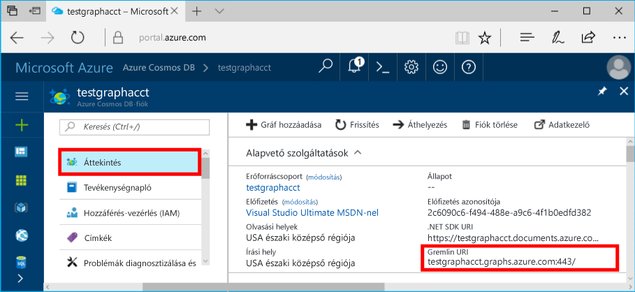

# <a name="azure-cosmos-db-create-a-graph-database-using-java-and-hello-azure-portal"></a>Azure Cosmos DB: Hozzon létre egy grafikonon adatbázist Java és hello Azure-portálon

Az Azure Cosmos DB a Microsoft globálisan elosztott többmodelles adatbázis-szolgáltatása. Gyorsan hozzon létre, és a dokumentum, a kulcs/érték és a graph adatbázisok, amelyek kihasználhassa hello globális terjesztési és horizontális skálázhatóságot képességekről az Azure-Cosmos adatbázis hello core lekérdezése. 

A gyors üzembe helyezés létrehoz egy grafikonon adatbázis használata az Azure portál eszközök hello Azure Cosmos DB. A gyors üzembe helyezés azt is bemutatja, hogyan tooquickly hozzon létre egy Java-Konzolalkalmazás használatával egy grafikonon adatbázist hello OSS [Gremlin Java](https://mvnrepository.com/artifact/org.apache.tinkerpop/gremlin-driver) illesztőprogram. hello utasításait a gyors üzembe helyezés követhetők bármely operációs rendszeren, amely alkalmas a Java futtatására. A gyors üzembe helyezés familiarizes létrehozásával és módosításával vagy hello felhasználói felületén, vagy programozott módon, amelyik igény szerint a graph-erőforrások. 

## <a name="prerequisites"></a>Előfeltételek

* [Java fejlesztői készlet (JDK) 1.7+](http://www.oracle.com/technetwork/java/javase/downloads/jdk8-downloads-2133151.html)
    * Ubuntu, futtassa `apt-get install default-jdk` tooinstall hello JDK.
    * Lehet, hogy tooset hello JAVA_HOME környezeti változó toopoint toohello mappa hello JDK futtató.
* [Maven](http://maven.apache.org/download.cgi) bináris archívum [letöltése](http://maven.apache.org/install.html) és [telepítése](http://maven.apache.org/)
    * Ubuntu, futtathatja `apt-get install maven` tooinstall Maven.
* [Git](https://www.git-scm.com/)
    * Ubuntu, futtathatja `sudo apt-get install git` tooinstall Git.

[!INCLUDE [quickstarts-free-trial-note](../../includes/quickstarts-free-trial-note.md)]

## <a name="create-a-database-account"></a>Adatbázisfiók létrehozása

Egy grafikonon adatbázist hozhat létre, meg kell toocreate egy Azure Cosmos DB Gremlin (diagramhoz) adatbázis fiókot.

[!INCLUDE [cosmos-db-create-dbaccount-graph](../../includes/cosmos-db-create-dbaccount-graph.md)]

## <a name="add-a-graph"></a>Gráf hozzáadása

Hello Data Explorer eszköz már használhatja, ha az Azure portál toocreate egy grafikonon adatbázis hello. 

1. Hello hello bal oldali navigációs menü, Azure-portálon kattintson **adatok kezelővel (előzetes verzió)**. 
2. A hello **adatok kezelővel (előzetes verzió)** panelen kattintson a **új Graph**, használja a következő információ hello hello lapon töltse ki:

    

    Beállítás|Ajánlott érték|Leírás
    ---|---|---
    Adatbázis-azonosító|sample-database|az új adatbázis hello azonosítója. Az adatbázis neve 1–255 karakter hosszúságú lehet, és nem tartalmazhat `/ \ # ?` karaktereket vagy záró szóközt.
    Gráfazonosító|sample-graph|az új diagram hello azonosítója. Graph nevek rendelkezik hello azonos követelmények karakter, adatbázis-azonosító.
    Tárkapacitás| 10 GB|Hagyja hello alapértelmezett értéket. Ez a hello tárolási kapacitás hello adatbázis.
    Teljesítmény|400 kérelemegység|Hagyja hello alapértelmezett értéket. Legfeljebb hello átviteli később Ha azt szeretné, hogy tooreduce késés.
    Partíciókulcs|Hagyja üresen|Hello célja a gyors üzembe helyezés hagyja üresen hello partíciós kulcs.

3. Amikor hello űrlap ki van töltve, kattintson a **OK**.

## <a name="clone-hello-sample-application"></a>Klónozza a mintaalkalmazást hello

Most tegyük klónozni egy grafikonon alkalmazást a githubból, állítsa be a hello kapcsolati karakterláncot, és futtassa azt. Ön meg, milyen egyszerűen adatokkal toowork programozott módon. 

1. Nyisson meg egy git terminálablakot, például a git bash eszközt, és `cd` tooa munkakönyvtárát.  

2. Futtassa a következő parancs tooclone hello minta tárház hello. 

    ```bash
    git clone https://github.com/Azure-Samples/azure-cosmos-db-graph-java-getting-started.git
    ```

## <a name="review-hello-code"></a>Tekintse át a hello kódot

Most Meggyőződünk arról, mi történik a hello app gyors áttekintése. Nyissa meg hello `Program.java` hello \src\GetStarted mappából fájlt, és ezek a sorok, a kód található. 

* hello Gremlin `Client` inicializálva van a hello konfigurációból `src/remote.yaml`.

    ```java
    cluster = Cluster.build(new File("src/remote.yaml")).create();
    ...
    client = cluster.connect();
    ```

* Hello Gremlin lépések egy sorozatát végrehajtása `client.submit` metódust.

    ```java
    ResultSet results = client.submit(gremlin);

    CompletableFuture<List<Result>> completableFutureResults = results.all();
    List<Result> resultList = completableFutureResults.get();

    for (Result result : resultList) {
        System.out.println(result.toString());
    }
    ```

## <a name="update-your-connection-string"></a>A kapcsolati karakterlánc frissítése

1. Nyissa meg hello src/remote.yaml fájlt. 

3. Töltse ki a *állomások*, *felhasználónév*, és *jelszó* hello src/remote.yaml fájl értékeit. hello részeinek hello-beállítások nem kell módosítani toobe.

    Beállítás|Ajánlott érték|Leírás
    ---|---|---
    Hosts|[***.graphs.azure.com]|Tekintse meg a táblázat utáni hello képernyőképet. Ez az érték hello Gremlin URI azonosítóját az Azure-portálon, a hello záró szögletes zárójelben hello hello áttekintése lapon: 443 / eltávolított.<br><br>Ez az érték is lekérhetők hello kulcsok lapon hello URI érték használatával https:// eltávolítása, dokumentumok toographs módosítása és eltávolítása a hello záró: 443 /.
    Felhasználónév|/dbs/sample-database/colls/sample-graph|erőforrás hello űrlap hello `/dbs/<db>/colls/<coll>` ahol `<db>` a meglévő adatbázis neve és `<coll>` a meglévő gyűjtemény neve.
    Jelszó|*Az Ön elsődleges főkulcsa*|Tekintse meg a táblázatot követő hello második képernyőképet. Ezt az értéket az elsődleges kulcs, és kérhetnek le hello kulcsok lapján hello Azure-portálon, hello elsődleges kulcs mezőjében. Másolja a hello Másolás gombra kattintva hello mező hello jobb oldalán a hello értékét.

    Hello állomások értékhez, másolja a hello **Gremlin URI** hello értéket **áttekintése** lap. Ha üres, tudnivalókat hello tábla létrehozása hello Gremlin URI hello kulcsok paneljén megelőző hello hello állomások sorában.


    Hello jelszó értékét, másolja a hello **elsődleges kulcs** a hello **kulcsok** panel: 

## <a name="run-hello-console-app"></a>Hello konzol alkalmazás futtatása

1. A hello git terminálablakot `cd` toohello azure-cosmos-db-graph-java-getting-started mappa.

2. Írja be a hello git terminálablakot, `mvn package` tooinstall hello szükséges Java-csomagok.

3. Hello git terminál-ablakban futtassa `mvn exec:java -D exec.mainClass=GetStarted.Program` a hello terminálablakot toostart a Java-alkalmazást.

hello terminálablakot toohello graph hozzáadott hello csúcsban jeleníti meg. Hello program befejeztét követően az internetböngésző kapcsoló hátsó toohello Azure-portálon. 

<a id="add-sample-data"></a>
## <a name="review-and-add-sample-data"></a>Áttekintés és mintaadatok hozzáadása

Ezután térjen vissza tooData Explorer és hello csúcsban toohello graph hozzá, és adja hozzá a további adatok pontokat.

1. Az adatok Explorerben bontsa ki a hello **-mintaadatbázist**/**minta-grafikon**, kattintson **Graph**, és kattintson a **Szűrés**. 

   

2. A hello **eredmények** listában, figyelje meg, hogy hozzá toohello graph hello új felhasználókat. Válassza ki **ben** és figyelje meg, hogy csatlakozott-e általa toorobin. Hello graph explorer hello csúcsban helyezhetik, nagyítás növelésére és csökkentésére, és bontsa ki a hello graph explorer felület hello mérete. 

   

3. Adjunk néhány új felhasználók toohello graph hello Data Explorer használatával. Kattintson a hello **új csúcspont** gomb tooadd adatok tooyour grafikon.

   

4. Adjon meg egy címkét a *személy* írja be a következő kulcsok és értékek toocreate hello első csúcspont hello Graph hello. Egyedi tulajdonságokat hozhat létre a gráfban található minden egyes személy számára. Csak a hello azonosító kulcsot meg kell adni.

    kulcs|érték|Megjegyzések
    ----|----|----
    id|ashley|hello hello csúcspont egyedi azonosítója. Ha nem ad meg azonosítót, a rendszer létrehoz egyet.
    gender|female| 
    tech | java | 

    > [!NOTE]
    > Ebben a rövid útmutatóban egy nem particionált gyűjteményt hozunk létre. Azonban ha egy particionált gyűjtemény hoz létre a partíciós kulcs megadása hello webhelycsoport létrehozása során, akkor szüksége tooinclude hello partíciós kulcs lesz a kulcs minden új csomópont. 

5. Kattintson az **OK** gombra. Szükség lehet tooexpand a képernyő toosee **OK** a hello hello képernyő aljára.

6. Kattintson ismét az **Új csúcspont** lehetőségre, és adjon hozzá még egy új felhasználót. Adjon meg egy címkét a *személy* majd írja be a hello következő kulcsokat és értékeket:

    kulcs|érték|Megjegyzések
    ----|----|----
    id|rakesh|hello hello csúcspont egyedi azonosítója. Ha nem ad meg azonosítót, a rendszer létrehoz egyet.
    gender|male| 
    school|MIT| 

7. Kattintson az **OK** gombra. 

8. Kattintson a **szűrés** hello alapértelmezett `g.V()` szűrő. Hello felhasználói hello most megjelenítése **eredmények** listája. További adatok hozzáadása, használhatja az eredményeket szűrők toolimit. Alapértelmezés szerint adatkezelő használja `g.V()` tooretrieve egy grafikonon, de minden csúcsban módosíthatja, hogy különböző tooa [graph lekérdezés](tutorial-query-graph.md), például a `g.V().count()`, tooreturn hello Graph JSON formátumban minden hello csúcsban számát.

9. Most már összekapcsolhatjuk a rakesh és az ashley elemet. Győződjön meg arról **Pálfi** a kiválasztott hello **eredmények** listában, majd kattintson a Szerkesztés gomb hello tovább túl**célok** a jobb alsó. Szükség lehet toowiden az ablak toosee hello **tulajdonságok** területen.

   

10. A hello **cél** mezőbe írja be *rakesh*, és a hello **peremhálózati címke** mezőbe írja be *tudja*, és kattintson a hello jelölőnégyzetet.

   

11. Immár **rakesh** a hello eredmények listájában, és ellenőrizze, hogy Pálfi és rakesh csatlakoztatva. 

   

    Is használhatja adatkezelő toocreate tárolt eljárások, felhasználó által megadott függvények és eseményindítók tooperform kiszolgálóoldali üzleti logikát is mint méretezési átviteli sebesség. Adatkezelő mutatja meg az összes hello beépített programozott adatelérési hello API-k érhető el, de hello Azure-portálon található egyszerű a hozzáférés tooyour adatokat biztosít.


## <a name="review-slas-in-hello-azure-portal"></a>Tekintse át a szolgáltatásiszint-szerződések a hello Azure-portálon

[!INCLUDE [cosmosdb-tutorial-review-slas](../../includes/cosmos-db-tutorial-review-slas.md)]

## <a name="clean-up-resources"></a>Az erőforrások eltávolítása

Toocontinue toouse az alkalmazás nem fog, ha törli az összes erőforrást hozta létre a gyors üzembe helyezés hello az Azure-portálon az alábbi lépésekkel hello: 

1. A hello hello Azure-portálon a bal oldali menüből, kattintson az **erőforráscsoportok** és kattintson a létrehozott hello erőforrás hello nevét. 
2. Az erőforrás csoport lapján kattintson a **törlése**, írja be a hello szövegmező hello erőforrás toodelete hello nevét, és kattintson **törlése**.

## <a name="next-steps"></a>Következő lépések

A gyors üzembe helyezés hogy megtanulta, hogyan toocreate Azure Cosmos DB adatait, hozzon létre egy grafikonon hello adatkezelő használatával, és futtassa az alkalmazást. Most már készen áll arra, hogy a Gremlin használatával összetettebb lekérdezéseket hozzon létre és hatékony gráfbejárási logikákat implementáljon. 

> [!div class="nextstepaction"]
> [Lekérdezés a Gremlin használatával](tutorial-query-graph.md)

