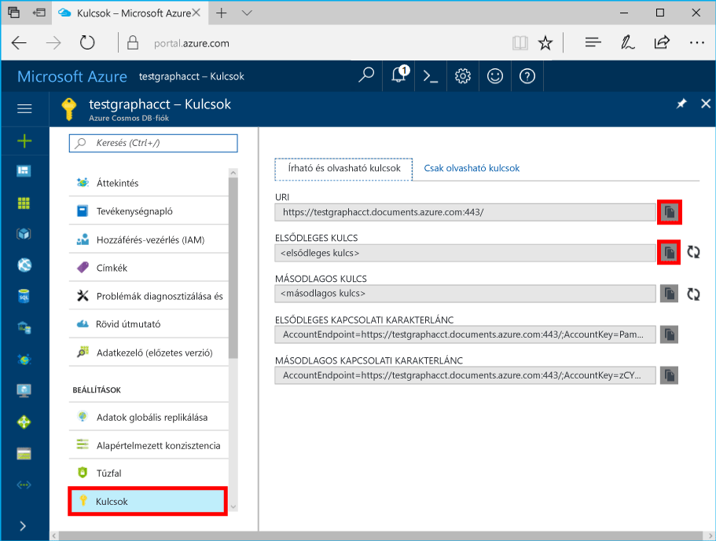

# <a name="azure-cosmos-db-build-a-nodejs-application-by-using-graph-api"></a>Azure Cosmos DB: Node.js-alkalmazás létrehozása a Graph API-val

Azure Cosmos-adatbázis a Microsoft hello globálisan elosztott több modellre adatbázis-szolgáltatás. Gyorsan hozzon létre, és a dokumentum, a kulcs/érték és a graph adatbázisok, amelyek kihasználhassa hello globális terjesztési és horizontális skálázhatóságot képességekről az Azure-Cosmos adatbázis hello core lekérdezése. 

Ez gyors üzembe helyezési a cikk bemutatja, hogyan toocreate egy Azure Cosmos DB fiókot a Graph API-val (előzetes verzió), az adatbázis és a graph hello Azure-portál használatával. Majd létrehozása és futtatása egy konzolalkalmazás hello nyílt forráskódú használatával [Gremlin Node.js](https://www.npmjs.com/package/gremlin-secure) illesztőprogram.  

> [!NOTE]
> hello npm modult `gremlin-secure` egy módosított verziója `gremlin` modul támogatja az SSL és SASL Azure Cosmos DB való csatlakozáshoz szükséges. A forráskód elérhető a [GitHubon](https://github.com/CosmosDB/gremlin-javascript).
>

## <a name="prerequisites"></a>Előfeltételek

Ez a minta futtatásához, a következő előfeltételek hello kell rendelkeznie:
* [Node.js](https://nodejs.org/en/)-verzió: 0.10.29-es vagy újabb
* [Git](http://git-scm.com/)

[!INCLUDE [quickstarts-free-trial-note](../../includes/quickstarts-free-trial-note.md)]

## <a name="create-a-database-account"></a>Adatbázisfiók létrehozása

[!INCLUDE [cosmos-db-create-dbaccount-graph](../../includes/cosmos-db-create-dbaccount-graph.md)]

## <a name="add-a-graph"></a>Gráf hozzáadása

[!INCLUDE [cosmos-db-create-graph](../../includes/cosmos-db-create-graph.md)]

## <a name="clone-hello-sample-application"></a>Klónozza a mintaalkalmazást hello

Most tegyük a Githubból, a Klónozás egy grafikonon API app hello kapcsolati karakterlánc beállítása, és futtassa azt. Láthatja, milyen egyszerűen adatokkal toowork programozott módon. 

1. Nyissa meg a Git terminálablakot, például a Git bash eszközt, és módosítsa (keresztül `cd` parancs) tooa munkakönyvtárát.  

2. Futtassa a következő parancs tooclone hello minta tárház hello. 

    ```bash
    git clone https://github.com/Azure-Samples/azure-cosmos-db-graph-nodejs-getting-started.git
    ```

3. Nyissa meg a hello megoldásfájlt a Visual Studióban. 

## <a name="review-hello-code"></a>Tekintse át a hello kódot

Most Meggyőződünk arról, mi történik a hello app gyors áttekintése. Nyissa meg hello `app.js` fájlt, és a következő sornyi kód hello találhat. 

* hello Gremlin ügyfelet jön létre.

    ```nodejs
    const client = Gremlin.createClient(
        443, 
        config.endpoint, 
        { 
            "session": false, 
            "ssl": true, 
            "user": `/dbs/${config.database}/colls/${config.collection}`,
            "password": config.primaryKey
        });
    ```

  hello konfigurációk tartoznak `config.js`, amely azt a szakasz a következő hello szerkesztése.

* Gremlin lépések egy sorozatát hello hajtja végre `client.execute` metódust.

    ```nodejs
    console.log('Running Count'); 
    client.execute("g.V().count()", { }, (err, results) => {
        if (err) return console.error(err);
        console.log(JSON.stringify(results));
        console.log();
    });
    ```

## <a name="update-your-connection-string"></a>A kapcsolati karakterlánc frissítése

1. Nyissa meg hello config.js fájl. 

2. A config.js, töltse ki hello config.endpoint kulcsot hello **Gremlin URI** hello értéket **áttekintése** hello Azure-portálon oldalán. 

    `config.endpoint = "GRAPHENDPOINT";`

    

   Ha hello **Gremlin URI** nincs megadva érték, hello érték generálása hello **kulcsok** hello portálon, hello lap **URI** érték, https:// eltávolítását és módosítását dokumentumok toographs.

   hello Gremlin végpont például kell nélkül hello protokoll/portszámát, amelyet csak hello állomásnév `mygraphdb.graphs.azure.com` (nem `https://mygraphdb.graphs.azure.com` vagy `mygraphdb.graphs.azure.com:433`).

3. A config.js, töltse ki kell jelentkezniük az hello hello config.primaryKey érték **elsődleges kulcs** hello értéket **kulcsok** hello Azure-portálon oldalán. 

    `config.primaryKey = "PRIMARYKEY";`

   

4. Adja meg a hello adatbázis nevét, és hello érték config.database és config.collection graph (tároló) nevét. 

Az elkészült config.js fájl olyan lesz, ahogy az alábbi példában látható:

```nodejs
var config = {}

// Note that this must not have HTTPS or hello port number
config.endpoint = "testgraphacct.graphs.azure.com";
config.primaryKey = "Pams6e7LEUS7LJ2Qk0fjZf3eGo65JdMWHmyn65i52w8ozPX2oxY3iP0yu05t9v1WymAHNcMwPIqNAEv3XDFsEg==";
config.database = "graphdb"
config.collection = "Persons"

module.exports = config;
```

## <a name="run-hello-console-app"></a>Hello konzol alkalmazás futtatása

1. Nyisson meg egy terminálablakot, és módosítsa (keresztül `cd` parancs) toohello telepítési könyvtárában található hello projekt hello package.json fájl.  

2. Futtatás `npm install` tooinstall hello npm modult, beleértve a szükséges `gremlin-secure`.

3. Futtatás `node app.js` a Terminálszolgáltatások toostart a node.js-alkalmazásokban.

## <a name="browse-with-data-explorer"></a>Tallózás az Adatkezelővel

Ezután lépjen vissza az Azure portál tooview hello Explorer tooData, lekérdezése, módosítása, és az új diagram adatokkal dolgozni.

Az adatok Explorer hello új adatbázis megjelenik hello **diagramjait** ablaktáblán. Bontsa ki a hello adatbázis hello gyűjtemény követ, majd kattintson az **Graph**.

hello minta alkalmazás által generált hello adatai megjelennének hello következő ablaktábla belül hello **Graph** fülre kattintva **szűrés**.

Próbálja befejezése `g.V()` rendelkező `.has('firstName', 'Thomas')` tootest hello szűrő. Vegye figyelembe, hogy hello érték kis-és nagybetűket.

## <a name="review-slas-in-hello-azure-portal"></a>Tekintse át a szolgáltatásiszint-szerződések a hello Azure-portálon

[!INCLUDE [cosmosdb-tutorial-review-slas](../../includes/cosmos-db-tutorial-review-slas.md)]

## <a name="clean-up-your-resources"></a>Az erőforrások törlése

Ha nem tervezi meg az alkalmazás használatával toocontinue, törli az összes erőforrást, létrehozott ebben a cikkben hello következő tevékenységek végrehajtásával: 

1. Hello Azure-portálon, hello bal oldali navigációs menüjében kattintson **erőforráscsoportok**, majd kattintson a létrehozott hello erőforrás hello nevét. 
2. Az erőforrás csoport lapján kattintson a **törlése**, írja be a törölt hello erőforrás toobe hello nevét, és kattintson **törlése**.

## <a name="next-steps"></a>Következő lépések

A cikkben hogy megismerte hogyan toocreate Azure Cosmos DB adatait, hozzon létre egy grafikonon adatkezelő használatával, és futtassa az alkalmazást. Mostantól a Gremlin használatával összetettebb lekérdezéseket is létrehozhat, és hatékony gráfbejárási logikákat implementálhat. 

> [!div class="nextstepaction"]
> [Lekérdezés a Gremlin használatával](tutorial-query-graph.md)
