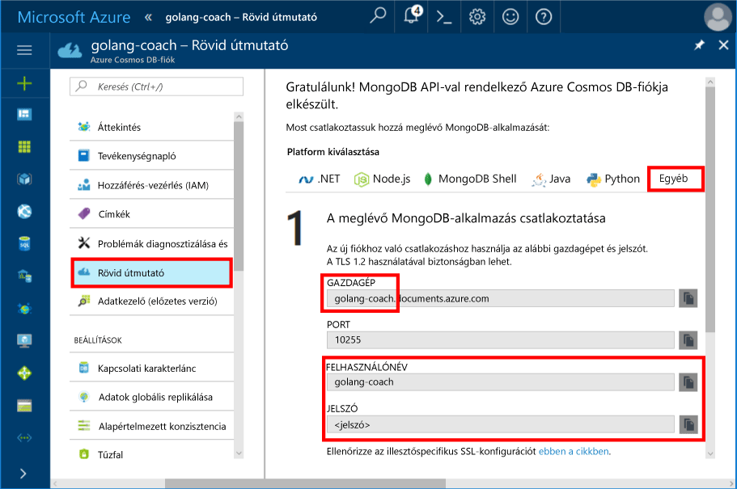
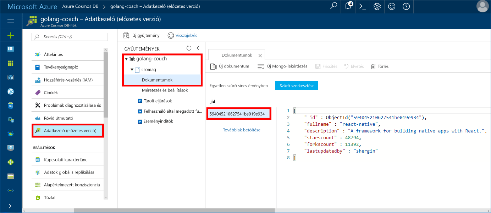

# <a name="azure-cosmos-db-build-a-mongodb-api-console-app-with-golang-and-hello-azure-portal"></a><span data-ttu-id="2c598-103">Azure Cosmos DB: Egy Golang a MongoDB API-Konzolalkalmazás létrehozása és hello Azure-portálon</span><span class="sxs-lookup"><span data-stu-id="2c598-103">Azure Cosmos DB: Build a MongoDB API console app with Golang and hello Azure portal</span></span>

<span data-ttu-id="2c598-104">Az Azure Cosmos DB a Microsoft globálisan elosztott többmodelles adatbázis-szolgáltatása.</span><span class="sxs-lookup"><span data-stu-id="2c598-104">Azure Cosmos DB is Microsoft’s globally distributed multi-model database service.</span></span> <span data-ttu-id="2c598-105">Gyorsan hozzon létre, és a dokumentum, a kulcs/érték és a graph adatbázisok, amelyek kihasználhassa hello globális terjesztési és horizontális skálázhatóságot képességekről az Azure-Cosmos adatbázis hello core lekérdezése.</span><span class="sxs-lookup"><span data-stu-id="2c598-105">You can quickly create and query document, key/value, and graph databases, all of which benefit from hello global distribution and horizontal scale capabilities at hello core of Azure Cosmos DB.</span></span>

<span data-ttu-id="2c598-106">A gyors üzembe helyezési bemutatja, hogyan egy meglévő toouse [MongoDB](https://docs.microsoft.com/en-us/azure/cosmos-db/mongodb-introduction) írt app [Golang](https://golang.org/) , és csatlakoztassa tooyour Azure Cosmos DB adatbázis, amely támogatja a MongoDB-ügyfélkapcsolatokat.</span><span class="sxs-lookup"><span data-stu-id="2c598-106">This quick-start demonstrates how toouse an existing [MongoDB](https://docs.microsoft.com/en-us/azure/cosmos-db/mongodb-introduction) app written in [Golang](https://golang.org/) and connect it tooyour Azure Cosmos DB database, which supports MongoDB client connections.</span></span>

<span data-ttu-id="2c598-107">Más szóval a Golang alkalmazás csak tudja, hogy az tooa adatbázis MongoDB API-k használatával csatlakoznak.</span><span class="sxs-lookup"><span data-stu-id="2c598-107">In other words, your Golang application only knows that it's connecting tooa database using MongoDB APIs.</span></span> <span data-ttu-id="2c598-108">Áttetsző toohello alkalmazás, amely adatok hello Azure Cosmos DB van tárolva.</span><span class="sxs-lookup"><span data-stu-id="2c598-108">It is transparent toohello application that hello data is stored in Azure Cosmos DB.</span></span>

## <a name="prerequisites"></a><span data-ttu-id="2c598-109">Előfeltételek</span><span class="sxs-lookup"><span data-stu-id="2c598-109">Prerequisites</span></span>

- <span data-ttu-id="2c598-110">Azure-előfizetés.</span><span class="sxs-lookup"><span data-stu-id="2c598-110">An Azure subscription.</span></span> <span data-ttu-id="2c598-111">Ha nem rendelkezik Azure-előfizetéssel, mindössze néhány perc alatt létrehozhat egy [ingyenes fiókot](https://azure.microsoft.com/free) a virtuális gép létrehozásának megkezdése előtt.</span><span class="sxs-lookup"><span data-stu-id="2c598-111">If you don’t have an Azure subscription, create a [free account](https://azure.microsoft.com/free) before you begin.</span></span>
- <span data-ttu-id="2c598-112">[Nyissa meg](https://golang.org/dl/) és hello vonatkozó általános ismeretekre [Ugrás](https://golang.org/) nyelv.</span><span class="sxs-lookup"><span data-stu-id="2c598-112">[Go](https://golang.org/dl/) and a basic knowledge of hello [Go](https://golang.org/) language.</span></span>
- <span data-ttu-id="2c598-113">Egy IDE– [Gogland](https://www.jetbrains.com/go/) a Jetbrains-től, [Visual Studio Code](https://code.visualstudio.com/) a Microsofttól vagy [Atom](https://atom.io/).</span><span class="sxs-lookup"><span data-stu-id="2c598-113">An IDE — [Gogland](https://www.jetbrains.com/go/) by Jetbrains, [Visual Studio Code](https://code.visualstudio.com/) by Microsoft, or [Atom](https://atom.io/).</span></span> <span data-ttu-id="2c598-114">Ebben az oktatóanyagban a Goglang használatára kerül sor.</span><span class="sxs-lookup"><span data-stu-id="2c598-114">In this tutorial, I'm using Goglang.</span></span>

<a id="create-account"></a>
## <a name="create-a-database-account"></a><span data-ttu-id="2c598-115">Adatbázisfiók létrehozása</span><span class="sxs-lookup"><span data-stu-id="2c598-115">Create a database account</span></span>

[!INCLUDE [cosmos-db-create-dbaccount](../../includes/cosmos-db-create-dbaccount-mongodb.md)]

## <a name="clone-hello-sample-application"></a><span data-ttu-id="2c598-116">Klónozza a mintaalkalmazást hello</span><span class="sxs-lookup"><span data-stu-id="2c598-116">Clone hello sample application</span></span>

<span data-ttu-id="2c598-117">Klónozza a mintaalkalmazást hello, és telepítse a szükséges hello csomagok.</span><span class="sxs-lookup"><span data-stu-id="2c598-117">Clone hello sample application and install hello required packages.</span></span>

1. <span data-ttu-id="2c598-118">Hozza létre a CosmosDBSample hello GOROOT\src mappába, amely C:\Go\ alapértelmezés szerint.</span><span class="sxs-lookup"><span data-stu-id="2c598-118">Create a folder named CosmosDBSample inside hello GOROOT\src folder, which is C:\Go\ by default.</span></span>
2. <span data-ttu-id="2c598-119">Futtassa a következő parancsot a git terminálablakot használatával például a git bash tooclone hello minta tárház hello CosmosDBSample mappába hello.</span><span class="sxs-lookup"><span data-stu-id="2c598-119">Run hello following command using a git terminal window such as git bash tooclone hello sample repository into hello CosmosDBSample folder.</span></span> 

    ```bash
    git clone https://github.com/Azure-Samples/azure-cosmos-db-mongodb-golang-getting-started.git
    ```
3.  <span data-ttu-id="2c598-120">Futtassa a következő parancs tooget hello mgo csomag hello.</span><span class="sxs-lookup"><span data-stu-id="2c598-120">Run hello following command tooget hello mgo package.</span></span> 

    ```
    go get gopkg.in/mgo.v2
    ```

<span data-ttu-id="2c598-121">Hello [mgo](http://labix.org/mgo) illesztőprogram (mint hangsúlyozottan *mango*) van egy [MongoDB](http://www.mongodb.org/) hello illesztőprogramját [nyelvi lépjen](http://golang.org/) , amely megvalósítja a gazdag, és jól tesztelése a következő ugrás szabványos idioms nagyon egyszerű API-t a szolgáltatások kiválasztása.</span><span class="sxs-lookup"><span data-stu-id="2c598-121">hello [mgo](http://labix.org/mgo) driver (pronounced as *mango*) is a [MongoDB](http://www.mongodb.org/) driver for hello [Go language](http://golang.org/) that implements a rich and well tested selection of features under a very simple API following standard Go idioms.</span></span>

<a id="connection-string"></a>

## <a name="update-your-connection-string"></a><span data-ttu-id="2c598-122">A kapcsolati karakterlánc frissítése</span><span class="sxs-lookup"><span data-stu-id="2c598-122">Update your connection string</span></span>

<span data-ttu-id="2c598-123">Most lépjen vissza az Azure portál tooget toohello kapcsolati karakterlánc adatainak és hello alkalmazásba másolja.</span><span class="sxs-lookup"><span data-stu-id="2c598-123">Now go back toohello Azure portal tooget your connection string information and copy it into hello app.</span></span>

1. <span data-ttu-id="2c598-124">Kattintson a **gyors üzembe helyezési** a bal oldali navigációs menü hello, és kattintson a **más** tooview hello kapcsolati karakterlánc által kért információkat hello Ugrás alkalmazás.</span><span class="sxs-lookup"><span data-stu-id="2c598-124">Click **Quick start** in hello left navigation menu, and then click **Other** tooview hello connection string information required by hello Go application.</span></span>

2. <span data-ttu-id="2c598-125">A Goglang nyissa meg a hello main.go fájl hello GOROOT\CosmosDBSample könyvtárban, és frissítse az alábbi kódsorokat hello kapcsolati karakterlánc adatait hello Azure-portál használatával, ahogy az alábbi képernyőfelvétel a hello hello.</span><span class="sxs-lookup"><span data-stu-id="2c598-125">In Goglang, open hello main.go file in hello GOROOT\CosmosDBSample directory and update hello following lines of code using hello connection string information from hello Azure portal as shown in hello following screenshot.</span></span> 

    <span data-ttu-id="2c598-126">hello adatbázis nevének megadása hello hello előtagja **állomás** érték hello Azure portál kapcsolati karakterlánc ablaktáblán.</span><span class="sxs-lookup"><span data-stu-id="2c598-126">hello Database name is hello prefix of hello **Host** value in hello Azure portal connection string pane.</span></span> <span data-ttu-id="2c598-127">Hello fiók hello az alábbi képen látható a hello adatbázis nevének megadása golang-véleményvezérek.</span><span class="sxs-lookup"><span data-stu-id="2c598-127">For hello account shown in hello image below, hello Database name is golang-coach.</span></span>

    ```go
    Database: "hello prefix of hello Host value in hello Azure portal",
    Username: "hello Username in hello Azure portal",
    Password: "hello Password in hello Azure portal",
    ```

    

3. <span data-ttu-id="2c598-129">Hello main.go fájl mentéséhez.</span><span class="sxs-lookup"><span data-stu-id="2c598-129">Save hello main.go file.</span></span>

## <a name="review-hello-code"></a><span data-ttu-id="2c598-130">Tekintse át a hello kódot</span><span class="sxs-lookup"><span data-stu-id="2c598-130">Review hello code</span></span>

<span data-ttu-id="2c598-131">Most Meggyőződünk arról, mi történik a hello main.go fájlban gyors áttekintése.</span><span class="sxs-lookup"><span data-stu-id="2c598-131">Let's make a quick review of what's happening in hello main.go file.</span></span> 

### <a name="connecting-hello-go-app-tooazure-cosmos-db"></a><span data-ttu-id="2c598-132">Nyissa meg app tooAzure Cosmos DB hello csatlakozás</span><span class="sxs-lookup"><span data-stu-id="2c598-132">Connecting hello Go app tooAzure Cosmos DB</span></span>

<span data-ttu-id="2c598-133">Azure Cosmos DB hello SSL Protokollt használó MongoDB támogatja.</span><span class="sxs-lookup"><span data-stu-id="2c598-133">Azure Cosmos DB supports hello SSL-enabled MongoDB.</span></span> <span data-ttu-id="2c598-134">tooconnect tooan MongoDB SSL engedélyezve van, szüksége toodefine hello **DialServer** működni [mgo. DialInfo](http://gopkg.in/mgo.v2#DialInfo), és hogy hello használata [tls. *Telefonos kapcsolat* ](http://golang.org/pkg/crypto/tls#Dial) tooperform hello kapcsolat működik.</span><span class="sxs-lookup"><span data-stu-id="2c598-134">tooconnect tooan SSL-enabled MongoDB, you need toodefine hello **DialServer** function in [mgo.DialInfo](http://gopkg.in/mgo.v2#DialInfo), and make use of hello [tls.*Dial*](http://golang.org/pkg/crypto/tls#Dial) function tooperform hello connection.</span></span>

<span data-ttu-id="2c598-135">a következő kódrészletet Golang hello Azure Cosmos DB MongoDB API hello Ugrás app kapcsolódik.</span><span class="sxs-lookup"><span data-stu-id="2c598-135">hello following Golang code snippet connects hello Go app with Azure Cosmos DB MongoDB API.</span></span> <span data-ttu-id="2c598-136">Hello *DialInfo* osztály tartalmaz egy MongoDB fürttel munkamenet létrehozásának beállításai.</span><span class="sxs-lookup"><span data-stu-id="2c598-136">hello *DialInfo* class holds options for establishing a session with a MongoDB cluster.</span></span>

```go
// DialInfo holds options for establishing a session with a MongoDB cluster.
dialInfo := &mgo.DialInfo{
    Addrs:    []string{"golang-couch.documents.azure.com:10255"}, // Get HOST + PORT
    Timeout:  60 * time.Second,
    Database: "database", // It can be anything
    Username: "username", // Username
    Password: "Azure database connect password from Azure Portal", // PASSWORD
    DialServer: func(addr *mgo.ServerAddr) (net.Conn, error) {
        return tls.Dial("tcp", addr.String(), &tls.Config{})
    },
}

// Create a session which maintains a pool of socket connections
// tooour Azure Cosmos DB MongoDB database.
session, err := mgo.DialWithInfo(dialInfo)

if err != nil {
    fmt.Printf("Can't connect toomongo, go error %v\n", err)
    os.Exit(1)
}

defer session.Close()

// SetSafe changes hello session safety mode.
// If hello safe parameter is nil, hello session is put in unsafe mode, 
// and writes become fire-and-forget,
// without error checking. hello unsafe mode is faster since operations won't hold on waiting for a confirmation.
// 
session.SetSafe(&mgo.Safe{})
```

<span data-ttu-id="2c598-137">Hello **mgo. Dial()** módszert használja, amikor nincs SSL-kapcsolatot.</span><span class="sxs-lookup"><span data-stu-id="2c598-137">hello **mgo.Dial()** method is used when there is no SSL connection.</span></span> <span data-ttu-id="2c598-138">Az SSL-kapcsolat hello **mgo. DialWithInfo()** módszerre szükség.</span><span class="sxs-lookup"><span data-stu-id="2c598-138">For an SSL connection, hello **mgo.DialWithInfo()** method is required.</span></span>

<span data-ttu-id="2c598-139">Hello példányának **DialWIthInfo {}** használt toocreate hello munkamenet-objektumok.</span><span class="sxs-lookup"><span data-stu-id="2c598-139">An instance of hello **DialWIthInfo{}** object is used toocreate hello session object.</span></span> <span data-ttu-id="2c598-140">Hello munkamenet, miután a hello gyűjteményhez a következő kódrészletet hello segítségével végezheti el:</span><span class="sxs-lookup"><span data-stu-id="2c598-140">Once hello session is established, you can access hello collection by using hello following code snippet:</span></span>

```go
collection := session.DB(“database”).C(“package”)
```

<a id="create-document"></a>

### <a name="create-a-document"></a><span data-ttu-id="2c598-141">Dokumentum létrehozása</span><span class="sxs-lookup"><span data-stu-id="2c598-141">Create a document</span></span>

```go
// Model
type Package struct {
    Id bson.ObjectId  `bson:"_id,omitempty"`
    FullName      string
    Description   string
    StarsCount    int
    ForksCount    int
    LastUpdatedBy string
}

// insert Document in collection
err = collection.Insert(&Package{
    FullName:"react",
    Description:"A framework for building native apps with React.",
    ForksCount: 11392,
    StarsCount:48794,
    LastUpdatedBy:"shergin",

})

if err != nil {
    log.Fatal("Problem inserting data: ", err)
    return
}
```

### <a name="query-or-read-a-document"></a><span data-ttu-id="2c598-142">Dokumentum lekérdezése vagy olvasása</span><span class="sxs-lookup"><span data-stu-id="2c598-142">Query or read a document</span></span>

<span data-ttu-id="2c598-143">Az Azure Cosmos DB támogatja az egyes gyűjteményekben tárolt JSON-dokumentumokon végzett részletes lekérdezéseket.</span><span class="sxs-lookup"><span data-stu-id="2c598-143">Azure Cosmos DB supports rich queries against JSON documents stored in each collection.</span></span> <span data-ttu-id="2c598-144">hello alábbi mintakód bemutatja egy lekérdezést, amely alapján futtathatók hello dokumentumok a gyűjteményben.</span><span class="sxs-lookup"><span data-stu-id="2c598-144">hello following sample code shows a query that you can run against hello documents in your collection.</span></span>

```go
// Get a Document from hello collection
result := Package{}
err = collection.Find(bson.M{"fullname": "react"}).One(&result)
if err != nil {
    log.Fatal("Error finding record: ", err)
    return
}

fmt.Println("Description:", result.Description)
```


### <a name="update-a-document"></a><span data-ttu-id="2c598-145">Dokumentum frissítése</span><span class="sxs-lookup"><span data-stu-id="2c598-145">Update a document</span></span>

```go
// Update a document
updateQuery := bson.M{"_id": result.Id}
change := bson.M{"$set": bson.M{"fullname": "react-native"}}
err = collection.Update(updateQuery, change)
if err != nil {
    log.Fatal("Error updating record: ", err)
    return
}
```

### <a name="delete-a-document"></a><span data-ttu-id="2c598-146">Dokumentum törlése</span><span class="sxs-lookup"><span data-stu-id="2c598-146">Delete a document</span></span>

<span data-ttu-id="2c598-147">Az Azure Cosmos DB támogatja a JSON-dokumentumok törlését.</span><span class="sxs-lookup"><span data-stu-id="2c598-147">Azure Cosmos DB supports deleting JSON documents.</span></span>

```go
// Delete a document
query := bson.M{"_id": result.Id}
err = collection.Remove(query)
if err != nil {
   log.Fatal("Error deleting record: ", err)
   return
}
```
    
## <a name="run-hello-app"></a><span data-ttu-id="2c598-148">Hello alkalmazás futtatása</span><span class="sxs-lookup"><span data-stu-id="2c598-148">Run hello app</span></span>

1. <span data-ttu-id="2c598-149">Goglang, győződjön meg arról, hogy a GOPATH (kategóriában elérhető **fájl**, **beállítások**, **lépjen**, **GOPATH**) adnia hello helyet mely hello gopkg lett telepíti, amely USERPROFILE\go alapértelmezés szerint.</span><span class="sxs-lookup"><span data-stu-id="2c598-149">In Goglang, ensure that your GOPATH (available under **File**, **Settings**, **Go**, **GOPATH**) include hello location in which hello gopkg was installed, which is USERPROFILE\go by default.</span></span> 
2. <span data-ttu-id="2c598-150">Hello sorokat törölni hello dokumentumot, 91-96, sorok megjegyzéssé, hogy láthatóvá hello dokumentum után hello futó alkalmazást.</span><span class="sxs-lookup"><span data-stu-id="2c598-150">Comment out hello lines that delete hello document, lines 91-96, so that you can see hello document after running hello app.</span></span>
3. <span data-ttu-id="2c598-151">A Goglangban kattintson a **Run** (Futtatás), majd a **Run 'Build main.go and run'** (A main.go létrehozása és futtatás) parancsra.</span><span class="sxs-lookup"><span data-stu-id="2c598-151">In Goglang, click **Run**, and then click **Run 'Build main.go and run'**.</span></span>

    <span data-ttu-id="2c598-152">hello app befejeződik, és megjeleníti a létrehozott hello dokumentum hello leírását [dokumentum létrehozása](#create-document).</span><span class="sxs-lookup"><span data-stu-id="2c598-152">hello app finishes and displays hello description of hello document created in [Create a document](#create-document).</span></span>
    
    ```
    Description: A framework for building native apps with React.
    
    Process finished with exit code 0
    ```

    
    
## <a name="review-your-document-in-data-explorer"></a><span data-ttu-id="2c598-154">A dokumentum ellenőrzése az Adatkezelőben</span><span class="sxs-lookup"><span data-stu-id="2c598-154">Review your document in Data Explorer</span></span>

<span data-ttu-id="2c598-155">Lépjen vissza az Azure portál toosee toohello adatkezelő a dokumentumot.</span><span class="sxs-lookup"><span data-stu-id="2c598-155">Go back toohello Azure portal toosee your document in Data Explorer.</span></span>

1. <span data-ttu-id="2c598-156">Kattintson a **adatok kezelővel (előzetes verzió)** hello bal oldali navigációs menü, bontsa ki a **golang-véleményvezérek**, **csomag**, és kattintson a **dokumentumok**.</span><span class="sxs-lookup"><span data-stu-id="2c598-156">Click **Data Explorer (Preview)** in hello left navigation menu, expand **golang-coach**, **package**, and then click **Documents**.</span></span> <span data-ttu-id="2c598-157">A hello **dokumentumok** lapra, majd hello \_azonosító toodisplay hello dokumentum hello jobb oldali ablaktáblán.</span><span class="sxs-lookup"><span data-stu-id="2c598-157">In hello **Documents** tab, click hello \_id toodisplay hello document in hello right pane.</span></span> 

    
    
2. <span data-ttu-id="2c598-159">Ezután hello dokumentum beágyazott dolgozni, és kattintson a **frissítés** toosave azt.</span><span class="sxs-lookup"><span data-stu-id="2c598-159">You can then work with hello document inline and click **Update** toosave it.</span></span> <span data-ttu-id="2c598-160">Hello dokumentum törlése, vagy hozzon létre új dokumentumok és lekérdezések is.</span><span class="sxs-lookup"><span data-stu-id="2c598-160">You can also delete hello document, or create new documents or queries.</span></span>

## <a name="review-slas-in-hello-azure-portal"></a><span data-ttu-id="2c598-161">Tekintse át a szolgáltatásiszint-szerződések a hello Azure-portálon</span><span class="sxs-lookup"><span data-stu-id="2c598-161">Review SLAs in hello Azure portal</span></span>

[!INCLUDE [cosmosdb-tutorial-review-slas](../../includes/cosmos-db-tutorial-review-slas.md)]

## <a name="clean-up-resources"></a><span data-ttu-id="2c598-162">Az erőforrások eltávolítása</span><span class="sxs-lookup"><span data-stu-id="2c598-162">Clean up resources</span></span>

<span data-ttu-id="2c598-163">Toocontinue toouse az alkalmazás nem fog, ha törli az összes erőforrást hozta létre a gyors üzembe helyezés hello az Azure-portálon az alábbi lépésekkel hello:</span><span class="sxs-lookup"><span data-stu-id="2c598-163">If you're not going toocontinue toouse this app, delete all resources created by this quickstart in hello Azure portal with hello following steps:</span></span>

1. <span data-ttu-id="2c598-164">A hello hello Azure-portálon a bal oldali menüből, kattintson az **erőforráscsoportok** és kattintson a létrehozott hello erőforrás hello nevét.</span><span class="sxs-lookup"><span data-stu-id="2c598-164">From hello left-hand menu in hello Azure portal, click **Resource groups** and then click hello name of hello resource you created.</span></span> 
2. <span data-ttu-id="2c598-165">Az erőforrás csoport lapján kattintson a **törlése**, írja be a hello szövegmező hello erőforrás toodelete hello nevét, és kattintson **törlése**.</span><span class="sxs-lookup"><span data-stu-id="2c598-165">On your resource group page, click **Delete**, type hello name of hello resource toodelete in hello text box, and then click **Delete**.</span></span>

## <a name="next-steps"></a><span data-ttu-id="2c598-166">Következő lépések</span><span class="sxs-lookup"><span data-stu-id="2c598-166">Next steps</span></span>

<span data-ttu-id="2c598-167">A gyors üzembe helyezés mér megismerte, hogyan toocreate Azure Cosmos DB fiók és futtatható a Golang app hello API mongodb-protokolltámogatással.</span><span class="sxs-lookup"><span data-stu-id="2c598-167">In this quickstart, you've learned how toocreate an Azure Cosmos DB account and run a Golang app using hello API for MongoDB.</span></span> <span data-ttu-id="2c598-168">További adatok tooyour Cosmos DB fiókot most importálhatja.</span><span class="sxs-lookup"><span data-stu-id="2c598-168">You can now import additional data tooyour Cosmos DB account.</span></span> 

> [!div class="nextstepaction"]
> [<span data-ttu-id="2c598-169">Adatok importálása az Azure Cosmos DB a hello MongoDB API</span><span class="sxs-lookup"><span data-stu-id="2c598-169">Import data into Azure Cosmos DB for hello MongoDB API</span></span>](mongodb-migrate.md)
