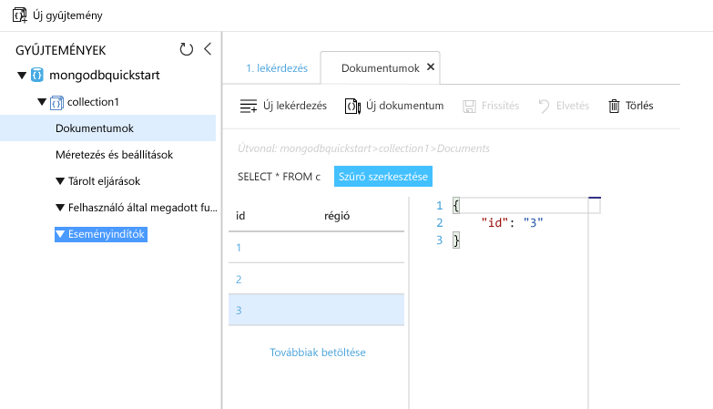

# <a name="azure-cosmos-db-migrate-an-existing-nodejs-mongodb-web-app"></a>Azure Cosmos DB: Meglévő Node.js MongoDB-webalkalmazás migrálása 

Az Azure Cosmos DB a Microsoft globálisan elosztott többmodelles adatbázis-szolgáltatása. Gyorsan hozzon létre, és a dokumentum, a kulcs/érték és a graph adatbázisok, amelyek kihasználhassa hello globális terjesztési és horizontális skálázhatóságot képességekről az Azure-Cosmos adatbázis hello core lekérdezése. 

A gyors üzembe helyezés bemutatja, hogyan toouse egy meglévő [MongoDB](mongodb-introduction.md) írt Node.js alkalmazást, és csatlakoztassa tooyour Azure Cosmos DB adatbázis, amely támogatja a MongoDB-ügyfélkapcsolatokat. Más szóval a Node.js-alkalmazás csak tudja, hogy az tooa adatbázis MongoDB API-k használatával csatlakoznak. Áttetsző toohello alkalmazás, amely adatok hello Azure Cosmos DB van tárolva.

Az útmutató végére MEAN-alkalmazása (MongoDB, Express, AngularJS és Node.js) az [Azure Cosmos DB](https://azure.microsoft.com/services/cosmos-db/) rendszert használva fog futni. 


[!INCLUDE [cloud-shell-try-it](../../includes/cloud-shell-try-it.md)]

Ha Ön tooinstall kiválasztása és hello CLI helyileg, ebben a témakörben van szükség, hogy hello Azure CLI verzióját futtatja, 2.0-s vagy újabb. Futtatás `az --version` toofind hello verziója. Ha tooinstall vagy frissítés van szüksége, tekintse meg [Azure CLI 2.0 telepítése]( /cli/azure/install-azure-cli). 

## <a name="prerequisites"></a>Előfeltételek 
Parancssori felület tooAzure, meg kell továbbá [Node.js](https://nodejs.org/) és [Git](http://www.git-scm.com/downloads) telepítve helyileg toorun `npm` és `git` parancsok.

Emellett ajánlott rendelkeznie a Node.js használatához szükséges ismeretekkel. A gyors üzembe helyezés nincs tervezett toohelp általában a Node.js-alkalmazások fejlesztésével kapcsolatos.

## <a name="clone-hello-sample-application"></a>Klónozza a mintaalkalmazást hello

Nyisson meg egy git terminálablakot, például a git bash eszközt, és `cd` tooa munkakönyvtárát.  

Futtassa a következő parancsok tooclone hello minta tárház hello. Ez a minta-tárház tartalmaz hello alapértelmezett [MEAN.js](http://meanjs.org/) alkalmazás. 

```bash
git clone https://github.com/prashanthmadi/mean
```

## <a name="run-hello-application"></a>Hello alkalmazás futtatása

Telepítse a szükséges hello csomagok, és indítsa el a hello alkalmazás.

```bash
cd mean
npm install
npm start
```

## <a name="log-in-tooazure"></a>Jelentkezzen be tooAzure

Ha egy telepített Azure CLI-t használ, jelentkezzen be Azure előfizetés hello tooyour [az bejelentkezési](/cli/azure/#login) parancsot, és kövesse hello képernyőn megjelenő utasításokat. Ezt a lépést kihagyhatja, ha a hello Azure Cloud rendszerhéj használata.

```azurecli
az login 
``` 
   
## <a name="add-hello-azure-cosmos-db-module"></a>Hello Azure Cosmos DB modul hozzá lesz adva

Ha egy telepített Azure CLI használata esetén ellenőrizze toosee, ha hello `cosmosdb` összetevője már telepítve van a hello futtatásával `az` parancsot. Ha `cosmosdb` a hello alap parancsok listáját, akkor folytassa a következő toohello parancs. Ezt a lépést kihagyhatja, ha a hello Azure Cloud rendszerhéj használata.

Ha `cosmosdb` nincs a hello alap parancsok listáját, telepítse újra [Azure CLI 2.0]( /cli/azure/install-azure-cli).

## <a name="create-a-resource-group"></a>Hozzon létre egy erőforráscsoportot

Hozzon létre egy [erőforráscsoport](../azure-resource-manager/resource-group-overview.md) a hello [az csoport létrehozása](/cli/azure/group#create). Az Azure-erőforráscsoport olyan logikai tároló, amelyben a rendszer üzembe helyezi és kezeli az Azure-erőforrásokat (például webappokat, adatbázisokat és tárfiókokat). 

hello alábbi példa létrehoz egy erőforráscsoport hello Nyugat-Európában régióban. Adjon egyedi nevet az hello erőforráscsoport.

Ha Azure-felhő rendszerhéj használ, kattintson a **azt próbálja**, kövesse a képernyőn megjelenő utasításokat toologin hello, majd hello parancs átmásolja hello parancssort.

```azurecli-interactive
az group create --name myResourceGroup --location "West Europe"
```

## <a name="create-an-azure-cosmos-db-account"></a>Azure Cosmos DB-fiók létrehozása

Hozzon létre egy Azure Cosmos DB fiókot hello [az cosmosdb létrehozása](/cli/azure/cosmosdb#create) parancsot.

A hello adja a következő parancsot, helyettesítse a saját egyedi Azure Cosmos DB fióknév hello megtapasztalhatja `<cosmosdb-name>` helyőrző. A egyedi név az Azure Cosmos DB végpontjának részeként használható (`https://<cosmosdb-name>.documents.azure.com/`), így a hello nevének kell toobe egyedi összes Azure Cosmos DB fiók az Azure-ban. 

```azurecli-interactive
az cosmosdb create --name <cosmosdb-name> --resource-group myResourceGroup --kind MongoDB
```

Hello `--kind MongoDB` paraméter lehetővé teszi, hogy a MongoDB-ügyfélkapcsolatokat.

Hello Azure Cosmos DB fiók létrehozásakor a hello Azure CLI információkat a következő példa hasonló toohello jeleníti meg. 

> [!NOTE]
> A példa JSON hello alapértelmezett hello Azure CLI kimeneti formátumban. egy másik kimeneti toouse formátum, lásd: [kimeneti formátumot az Azure CLI 2.0 parancsok](https://docs.microsoft.com/cli/azure/format-output-azure-cli).

```json
{
  "databaseAccountOfferType": "Standard",
  "documentEndpoint": "https://<cosmosdb-name>.documents.azure.com:443/",
  "id": "/subscriptions/00000000-0000-0000-0000-000000000000/resourceGroups/myResourceGroup/providers/Microsoft.Document
DB/databaseAccounts/<cosmosdb-name>",
  "kind": "MongoDB",
  "location": "West Europe",
  "name": "<cosmosdb-name>",
  "readLocations": [
    {
      "documentEndpoint": "https://<cosmosdb-name>-westeurope.documents.azure.com:443/",
      "failoverPriority": 0,
      "id": "<cosmosdb-name>-westeurope",
      "locationName": "West Europe",
      "provisioningState": "Succeeded"
    }
  ],
  "resourceGroup": "myResourceGroup",
  "type": "Microsoft.DocumentDB/databaseAccounts",
  "writeLocations": [
    {
      "documentEndpoint": "https://<cosmosdb-name>-westeurope.documents.azure.com:443/",
      "failoverPriority": 0,
      "id": "<cosmosdb-name>-westeurope",
      "locationName": "West Europe",
      "provisioningState": "Succeeded"
    }
  ]
} 
```

## <a name="connect-your-nodejs-application-toohello-database"></a>Csatlakozás a Node.js-alkalmazás toohello adatbázis

Ebben a lépésben csatlakoztatja a MEAN.js alkalmazás tooan Azure Cosmos DB mintaadatbázis imént létrehozott, a MongoDB-kapcsolati karakterlánc használatával. 

<a name="devconfig"></a>
## <a name="configure-hello-connection-string-in-your-nodejs-application"></a>Node.js-alkalmazásában hello kapcsolati karakterlánc konfigurálása

A MEAN.js-tárházban nyissa meg a `config/env/local-development.js` fájlt.

Cserélje le a következő kód hello hello fájl tartalma. Ne feledje tooalso cserélje le a két hello `<cosmosdb-name>` helyőrzőt a Azure Cosmos DB fióknevet.

```javascript
'use strict';

module.exports = {
  db: {
    uri: 'mongodb://<cosmosdb-name>:<primary_master_key>@<cosmosdb-name>.documents.azure.com:10255/mean-dev?ssl=true&sslverifycertificate=false'
  }
};
```

## <a name="retrieve-hello-key"></a>Hello kulcs beolvasása

A sorrend tooconnect tooan Azure Cosmos DB adatbázisban be kell hello adatbázis kulcsot. Használjon hello [az cosmosdb lista-kulcsok](/cli/azure/cosmosdb#list-keys) parancs tooretrieve hello elsődleges kulcs.

```azurecli-interactive
az cosmosdb list-keys --name <cosmosdb-name> --resource-group myResourceGroup --query "primaryMasterKey"
```

hello Azure CLI információkat a következő példa hasonló toohello kimenete. 

```json
"RUayjYjixJDWG5xTqIiXjC..."
```

Másolja a hello értékének `primaryMasterKey`. Illessze be a hello keresztül `<primary_master_key>` a `local-development.js`.

Mentse a módosításokat.

### <a name="run-hello-application-again"></a>Futtassa újból a hello alkalmazást.

Futtassa ismét az `npm start` parancsot. 

```bash
npm start
```

Konzolüzenet kell most közli, hogy hello fejlesztési környezet megfelelően működik, és. 

Keresse meg a túl`http://localhost:3000` a böngészőben. Kattintson a **regisztráció** hello felső menüre, és próbálja meg toocreate két üres a felhasználók. 

hello MEAN.js mintaalkalmazás felhasználói adatok hello adatbázisban tárolja. Ha sikeres, és automatikusan bejelentkezik MEAN.js hello létrehozott felhasználó, majd a Azure Cosmos DB kapcsolat működik. 


## <a name="view-data-in-data-explorer"></a>Adatok megtekintése az Adatkezelőben

Egy Azure Cosmos DB által tárolt adatok elérhető tooview, a lekérdezés és a futási logikájának be hello Azure-portálon.

tooview, lekérdezni, és az előző lépésben létrehozott hello, bejelentkezési toohello hello felhasználói adatok együttműködve [Azure-portálon](https://portal.azure.com) a böngészőben.

Hello felső keresési mezőbe írja be Azure Cosmos DB. Amikor megnyílik a Cosmos DB-fiók panelje, válassza ki Cosmos DB-fiókját. A bal oldali navigációs hello kattintson a Data Explorer. Bontsa ki a gyűjteményt hello Gyűjtemények ablaktáblán, és ezután hello dokumentumok megtekintése hello gyűjteményben, hello adatait, és még létrehozása és tárolt eljárások, eseményindítók és felhasználó által megadott függvények futtatása. 




## <a name="deploy-hello-nodejs-application-tooazure"></a>Node.js-alkalmazás tooAzure hello telepítése

Ebben a lépésben a MongoDB-csatlakoztatott Node.js-alkalmazás tooAzure Cosmos DB telepít.

Talán észrevette, hogy módosultak a korábbi hello konfigurációs fájl van hello fejlesztőkörnyezet (`/config/env/local-development.js`). Ha az alkalmazás tooApp szolgáltatást telepíti, akkor fog futni hello éles környezetben alapértelmezés szerint. Ezért most kell toomake hello azonos toohello megfelelő konfigurációs fájl módosítása.

A MEAN.js-tárházban nyissa meg a `config/env/production.js` fájlt.

A hello `db` objektumazonosító, cserélje le a hello értékének `uri` regisztrációja, mivel a következő példa hello megjelenítése. Lehet, hogy tooreplace hello helyőrzők mint előtt.

```javascript
'mongodb://<cosmosdb-name>:<primary_master_key>@<cosmosdb-name>.documents.azure.com:10255/mean?ssl=true&sslverifycertificate=false',
```

> [!NOTE] 
> Hello `ssl=true` beállítás fontos, mert [Azure Cosmos DB SSL megkövetelése](connect-mongodb-account.md#connection-string-requirements). 
>
>

A Terminálszolgáltatások hello minden a módosítások véglegesítése a Git. Mindkét parancsok toorun másolhatja azokat együtt.

```bash
git add .
git commit -m "configured MongoDB connection string"
```
## <a name="clean-up-resources"></a>Az erőforrások eltávolítása

Toocontinue toouse az alkalmazás nem fog, ha törli az összes erőforrást hozta létre a gyors üzembe helyezés hello az Azure-portálon az alábbi lépésekkel hello:

1. A hello hello Azure-portálon a bal oldali menüből, kattintson az **erőforráscsoportok** és kattintson a létrehozott hello erőforrás hello nevét. 
2. Az erőforrás csoport lapján kattintson a **törlése**, írja be a hello szövegmező hello erőforrás toodelete hello nevét, és kattintson **törlése**.

## <a name="next-steps"></a>Következő lépések

Az a gyors üzembe helyezés, hogy megismerte hogyan toocreate egy Azure Cosmos DB fiókot, és hozzon létre egy hello adatkezelő használatával MongoDB-gyűjteményt. Most már telepítheti át a MongoDB-adatok tooAzure Cosmos DB.  

> [!div class="nextstepaction"]
> [MongoDB adatok importálása az Azure Cosmos DB-be](mongodb-migrate.md)
