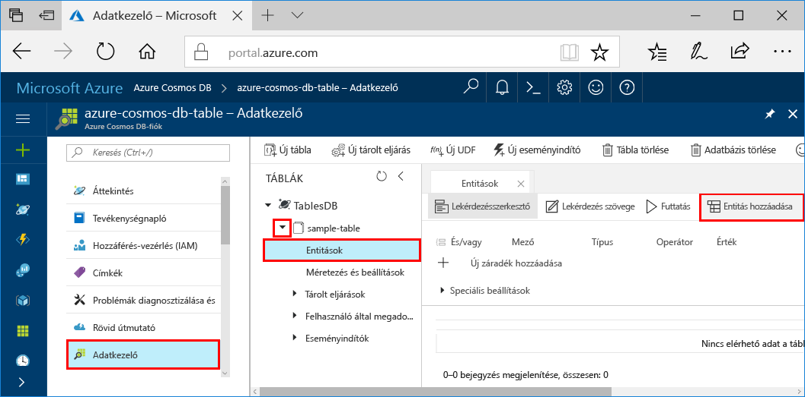

# <a name="azure-cosmos-db-build-a-net-application-using-the-table-api"></a><span data-ttu-id="a1e8c-103">Azure Cosmos DB: .NET-alkalmazás létrehozása a Table API-val</span><span class="sxs-lookup"><span data-stu-id="a1e8c-103">Azure Cosmos DB: Build a .NET application using the Table API</span></span>

<span data-ttu-id="a1e8c-104">Az Azure Cosmos DB a Microsoft globálisan elosztott, többmodelles adatbázis-szolgáltatása.</span><span class="sxs-lookup"><span data-stu-id="a1e8c-104">Azure Cosmos DB is Microsoft’s globally distributed multi-model database service.</span></span> <span data-ttu-id="a1e8c-105">Segítségével gyorsan létrehozhat és lekérdezhet dokumentum, kulcs/érték és gráf típusú adatbázisokat, amelyek mindegyike felhasználja az Azure Cosmos DB középpontjában álló globális elosztási és horizontális skálázhatósági képességeket.</span><span class="sxs-lookup"><span data-stu-id="a1e8c-105">You can quickly create and query document, key/value, and graph databases, all of which benefit from the global distribution and horizontal scale capabilities at the core of Azure Cosmos DB.</span></span> 

<span data-ttu-id="a1e8c-106">Ez a rövid útmutató bemutatja, hogyan hozhat létre az Azure Portal segítségével egy Azure Cosmos DB-fiókot, majd abban egy táblát.</span><span class="sxs-lookup"><span data-stu-id="a1e8c-106">This quick start demonstrates how to create an Azure Cosmos DB account, and create a table within that account using the Azure portal.</span></span> <span data-ttu-id="a1e8c-107">Ezután kódot írunk az entitások beillesztésére, frissítésére és törlésére és futtatunk pár lekérdezést az új [Windows Azure Storage prémium tábla](https://aka.ms/premiumtablenuget) NuGet-csomag előzetes verziójának használatával.</span><span class="sxs-lookup"><span data-stu-id="a1e8c-107">You'll then write code to insert, update, and delete entities, and run some queries using the new [Windows Azure Storage Premium Table](https://aka.ms/premiumtablenuget) (preview) package from NuGet.</span></span> <span data-ttu-id="a1e8c-108">Ennek a függvénytárnak az osztályai és a metódusainak aláírásai megegyeznek a nyilvános [Windows Azure Storage SDK-ban](https://www.nuget.org/packages/WindowsAzure.Storage) elérhetőkkel, de ez a verzió ezenfelül képes Azure Cosmos DB-fiókokhoz is kapcsolódni a [Table API](table-introduction.md) előzetes verziójának használatával.</span><span class="sxs-lookup"><span data-stu-id="a1e8c-108">This library has the same classes and method signatures as the public [Windows Azure Storage SDK](https://www.nuget.org/packages/WindowsAzure.Storage), but also has the ability to connect to Azure Cosmos DB accounts using the [Table API](table-introduction.md) (preview).</span></span> 

## <a name="prerequisites"></a><span data-ttu-id="a1e8c-109">Előfeltételek</span><span class="sxs-lookup"><span data-stu-id="a1e8c-109">Prerequisites</span></span>

<span data-ttu-id="a1e8c-110">Ha nincs telepítve a Visual Studio 2017, letöltheti és használhatja az **ingyenes** [Visual Studio 2017 Community Edition](https://www.visualstudio.com/downloads/)t.</span><span class="sxs-lookup"><span data-stu-id="a1e8c-110">If you don’t already have Visual Studio 2017 installed, you can download and use the **free** [Visual Studio 2017 Community Edition](https://www.visualstudio.com/downloads/).</span></span> <span data-ttu-id="a1e8c-111">Ügyeljen arra, hogy engedélyezze az **Azure Development** használatát a Visual Studio telepítése során.</span><span class="sxs-lookup"><span data-stu-id="a1e8c-111">Make sure that you enable **Azure development** during the Visual Studio setup.</span></span>

[!INCLUDE [quickstarts-free-trial-note](../../includes/quickstarts-free-trial-note.md)]

## <a name="create-a-database-account"></a><span data-ttu-id="a1e8c-112">Adatbázisfiók létrehozása</span><span class="sxs-lookup"><span data-stu-id="a1e8c-112">Create a database account</span></span>

[!INCLUDE [cosmos-db-create-dbaccount-table](../../includes/cosmos-db-create-dbaccount-table.md)]

## <a name="add-a-table"></a><span data-ttu-id="a1e8c-113">Tábla hozzáadása</span><span class="sxs-lookup"><span data-stu-id="a1e8c-113">Add a table</span></span>

[!INCLUDE [cosmos-db-create-table](../../includes/cosmos-db-create-table.md)]

## <a name="add-sample-data"></a><span data-ttu-id="a1e8c-114">Mintaadatok hozzáadása</span><span class="sxs-lookup"><span data-stu-id="a1e8c-114">Add sample data</span></span>

<span data-ttu-id="a1e8c-115">Az Adatkezelő előzetes verziójának segítségével adatokat adhat hozzá az új táblához.</span><span class="sxs-lookup"><span data-stu-id="a1e8c-115">You can now add data to your new table using Data Explorer (Preview).</span></span>

1. <span data-ttu-id="a1e8c-116">Az Adatkezelőben bontsa ki a **minta tábla** pontot, és kattintson az **Entitások**, ezután pedig az **Entitás hozzáadása** lehetőségre.</span><span class="sxs-lookup"><span data-stu-id="a1e8c-116">In Data Explorer, expand **sample-table**, click **Entities**, and then click **Add Entity**.</span></span>

   
2. <span data-ttu-id="a1e8c-118">Adja meg a PartitionKey és a RowKey mező adatait és kattintson az **Entitás hozzáadása** lehetőségre.</span><span class="sxs-lookup"><span data-stu-id="a1e8c-118">Now add data to the PartitionKey value box and RowKey value box, and click **Add Entity**.</span></span>

   
  
    <span data-ttu-id="a1e8c-120">Most már az Adatkezelővel további entitásokat is hozzá tud adni a táblához, szerkesztheti őket, és lekérdezéseket is indíthat.</span><span class="sxs-lookup"><span data-stu-id="a1e8c-120">You can now add more entities to your table, edit your entities, or query your data in Data Explorer.</span></span> <span data-ttu-id="a1e8c-121">Az Adatkezelőben továbbá skálázhatja az átviteli sebességet, és tárolt eljárásokat, felhasználói függvényeket és triggereket adhat hozzá a táblához.</span><span class="sxs-lookup"><span data-stu-id="a1e8c-121">Data Explorer is also where you can scale your throughput and add stored procedures, user defined functions, and triggers to your table.</span></span>

## <a name="clone-the-sample-application"></a><span data-ttu-id="a1e8c-122">A mintaalkalmazás klónozása</span><span class="sxs-lookup"><span data-stu-id="a1e8c-122">Clone the sample application</span></span>

<span data-ttu-id="a1e8c-123">Most pedig klónozunk egy Table-alkalmazást a GitHubról, beállítjuk a kapcsolati karakterláncot, majd futtatni fogjuk az alkalmazást.</span><span class="sxs-lookup"><span data-stu-id="a1e8c-123">Now let's clone a Table app from github, set the connection string, and run it.</span></span> <span data-ttu-id="a1e8c-124">Látni fogja, milyen egyszerű az adatokkal programozott módon dolgozni.</span><span class="sxs-lookup"><span data-stu-id="a1e8c-124">You'll see how easy it is to work with data programmatically.</span></span> 

1. <span data-ttu-id="a1e8c-125">Nyisson meg egy git terminálablakot, például a git bash eszközt, és a `cd` paranccsal lépjen egy munkakönyvtárba.</span><span class="sxs-lookup"><span data-stu-id="a1e8c-125">Open a git terminal window, such as git bash, and `cd` to a working directory.</span></span>  

2. <span data-ttu-id="a1e8c-126">Futtassa a következő parancsot a mintatárház klónozásához.</span><span class="sxs-lookup"><span data-stu-id="a1e8c-126">Run the following command to clone the sample repository.</span></span> 

    ```bash
    git clone https://github.com/Azure-Samples/azure-cosmos-db-table-dotnet-getting-started.git
    ```

3. <span data-ttu-id="a1e8c-127">Ezután nyissa meg a megoldásfájlt a Visual Studióban.</span><span class="sxs-lookup"><span data-stu-id="a1e8c-127">Then open the solution file in Visual Studio.</span></span> 

## <a name="review-the-code"></a><span data-ttu-id="a1e8c-128">A kód áttekintése</span><span class="sxs-lookup"><span data-stu-id="a1e8c-128">Review the code</span></span>

<span data-ttu-id="a1e8c-129">Tekintsük át, hogy mi történik az alkalmazásban.</span><span class="sxs-lookup"><span data-stu-id="a1e8c-129">Let's make a quick review of what's happening in the app.</span></span> <span data-ttu-id="a1e8c-130">Nyissa meg a Program.cs fájlt: az itt található kódsorok hozzák létre az Azure Cosmos DB erőforrásokat.</span><span class="sxs-lookup"><span data-stu-id="a1e8c-130">Open the Program.cs file and you'll find that these lines of code create the Azure Cosmos DB resources.</span></span> 

* <span data-ttu-id="a1e8c-131">A CloudTableClient inicializálásra kerül.</span><span class="sxs-lookup"><span data-stu-id="a1e8c-131">The CloudTableClient is initialized.</span></span>

    ```csharp
    CloudStorageAccount storageAccount = CloudStorageAccount.Parse(connectionString); 
    CloudTableClient tableClient = storageAccount.CreateCloudTableClient();
    ```

* <span data-ttu-id="a1e8c-132">Új táblázat jön létre, ha még nem létezik.</span><span class="sxs-lookup"><span data-stu-id="a1e8c-132">A new table is created if it does not exist.</span></span>

    ```csharp
    CloudTable table = tableClient.GetTableReference("people");
    table.CreateIfNotExists();
    ```

* <span data-ttu-id="a1e8c-133">Létrejön egy új táblázattároló.</span><span class="sxs-lookup"><span data-stu-id="a1e8c-133">A new Table container is created.</span></span> <span data-ttu-id="a1e8c-134">Láthatja, hogy ez a kód nagyon hasonló a normál Azure Table Storage SDK-hoz.</span><span class="sxs-lookup"><span data-stu-id="a1e8c-134">You will notice this code very similar to regular Azure Table storage SDK.</span></span> 

    ```csharp
    CustomerEntity item = new CustomerEntity()
                {
                    PartitionKey = Guid.NewGuid().ToString(),
                    RowKey = Guid.NewGuid().ToString(),
                    Email = $"{GetRandomString(6)}@contoso.com",
                    PhoneNumber = "425-555-0102",
                    Bio = GetRandomString(1000)
                };
    ```

## <a name="update-your-connection-string"></a><span data-ttu-id="a1e8c-135">A kapcsolati karakterlánc frissítése</span><span class="sxs-lookup"><span data-stu-id="a1e8c-135">Update your connection string</span></span>

<span data-ttu-id="a1e8c-136">Most pedig frissítjük a kapcsolati karakterláncot, hogy az alkalmazása kommunikálni tudjon az Azure Cosmos DB-szolgáltatással.</span><span class="sxs-lookup"><span data-stu-id="a1e8c-136">Now we'll update the connection string information so your app can talk to Azure Cosmos DB.</span></span> 

1. <span data-ttu-id="a1e8c-137">Nyissa meg az app.config fájlt a Visual Studióban.</span><span class="sxs-lookup"><span data-stu-id="a1e8c-137">In Visual Studio, open the app.config file.</span></span> 

2. <span data-ttu-id="a1e8c-138">Az [Azure Portalon](http://portal.azure.com/) az Azure Cosmos DB bal oldali navigációs menüjében kattintson a **Kapcsolati karakterlánc** elemre.</span><span class="sxs-lookup"><span data-stu-id="a1e8c-138">In the [Azure portal](http://portal.azure.com/), in the Azure Cosmos DB left navigation menu, click **Connection String**.</span></span> <span data-ttu-id="a1e8c-139">Ezután az új panelen kattintson a kapcsolati karakterlánc másolás gombjára.</span><span class="sxs-lookup"><span data-stu-id="a1e8c-139">Then in the new pane click the copy button for the connection string.</span></span> 

    

3. <span data-ttu-id="a1e8c-141">Az értéket illessze be az app.config fájlba a PremiumStorageConnectionString értékéhez.</span><span class="sxs-lookup"><span data-stu-id="a1e8c-141">Paste the value into the app.config file as the value of the PremiumStorageConnectionString.</span></span> 

    `<add key="PremiumStorageConnectionString" 
        value="DefaultEndpointsProtocol=https;AccountName=MYSTORAGEACCOUNT;AccountKey=AUTHKEY;TableEndpoint=https://COSMOSDB.documents.azure.com" />`    

    <span data-ttu-id="a1e8c-142">A StandardStorageConnectionString értékét nem szükséges megváltoztatnia.</span><span class="sxs-lookup"><span data-stu-id="a1e8c-142">You can leave the StandardStorageConnectionString as is.</span></span>

<span data-ttu-id="a1e8c-143">Ezzel frissítette az alkalmazást az összes olyan információval, amely az Azure Cosmos DB-vel való kommunikációhoz szükséges.</span><span class="sxs-lookup"><span data-stu-id="a1e8c-143">You've now updated your app with all the info it needs to communicate with Azure Cosmos DB.</span></span> 

## <a name="run-the-web-app"></a><span data-ttu-id="a1e8c-144">A webalkalmazás futtatása</span><span class="sxs-lookup"><span data-stu-id="a1e8c-144">Run the web app</span></span>

1. <span data-ttu-id="a1e8c-145">A Visual Studióban kattintson a jobb gombbal a **PremiumTableGetStarted** projektre a **Megoldáskezelőben**, majd kattintson a **NuGet-csomagok kezelése** elemre.</span><span class="sxs-lookup"><span data-stu-id="a1e8c-145">In Visual Studio, right-click on the **PremiumTableGetStarted** project in **Solution Explorer** and then click **Manage NuGet Packages**.</span></span> 

2. <span data-ttu-id="a1e8c-146">A NuGet **Tallózás** mezőjébe írja be a *WindowsAzure.Storage-PremiumTable* kifejezést.</span><span class="sxs-lookup"><span data-stu-id="a1e8c-146">In the NuGet **Browse** box, type *WindowsAzure.Storage-PremiumTable*.</span></span>

3. <span data-ttu-id="a1e8c-147">Jelölje be az **Előzetes verzió is** jelölőnégyzetet.</span><span class="sxs-lookup"><span data-stu-id="a1e8c-147">Check the **Include prerelease** box.</span></span> 

4. <span data-ttu-id="a1e8c-148">Az eredmények közül telepítse a **WindowsAzure.Storage-PremiumTable** függvénytárat.</span><span class="sxs-lookup"><span data-stu-id="a1e8c-148">From the results, install the **WindowsAzure.Storage-PremiumTable** library.</span></span> <span data-ttu-id="a1e8c-149">Ez telepíti az Azure Cosmos DB Table API csomag előzetes verzióját és annak összes függőségét.</span><span class="sxs-lookup"><span data-stu-id="a1e8c-149">This installs the preview Azure Cosmos DB Table API package as well as all dependencies.</span></span> <span data-ttu-id="a1e8c-150">Vegye figyelembe, hogy ez a NuGet-csomag eltér az Azure Table Storage által használt Windows Azure Storage csomagtól.</span><span class="sxs-lookup"><span data-stu-id="a1e8c-150">Note that this is a different NuGet package than the Windows Azure Storage package used by Azure Table storage.</span></span> 

5. <span data-ttu-id="a1e8c-151">Az alkalmazás futtatásához nyomja le a CTRL + F5 billentyűkombinációt.</span><span class="sxs-lookup"><span data-stu-id="a1e8c-151">Click CTRL + F5 to run the application.</span></span>

    <span data-ttu-id="a1e8c-152">A konzolablakban követheti az adatok hozzáadásának, beolvasásának, lekérdezésének, cseréjének és a táblából történő törlésének folyamatait.</span><span class="sxs-lookup"><span data-stu-id="a1e8c-152">The console window displays the data being added, retrieved, queried, replaced and deleted from the table.</span></span> <span data-ttu-id="a1e8c-153">Miután a parancsfájl futása befejeződött, nyomjon le egy tetszőleges billentyűt a konzolablak bezárásához.</span><span class="sxs-lookup"><span data-stu-id="a1e8c-153">When the script completes, press any key to close the console window.</span></span> 
    
    

6. <span data-ttu-id="a1e8c-155">Ha meg szeretné tekinteni az új entitásokat az Adatkezelőben, tegye megjegyzésbe a program.cs fájl 188-208. sorait – így azokat nem kell törölni – , majd ezután futtassa újra a mintakódot.</span><span class="sxs-lookup"><span data-stu-id="a1e8c-155">If you want to see the new entities in Data Explorer, just comment out lines 188-208 in program.cs so they aren't deleted, then run the sample again.</span></span> 

    <span data-ttu-id="a1e8c-156">Ezután lépjen vissza az Adatkezelőbe, kattintson a **Frissítés** gombra, bontsa ki a **people** táblát, kattintson az **Entitások** elemre és máris munkához láthat az új adatokkal.</span><span class="sxs-lookup"><span data-stu-id="a1e8c-156">You can now go back to Data Explorer, click **Refresh**, expand the **people** table and click **Entities**, and then work with this new data.</span></span> 

    

## <a name="review-slas-in-the-azure-portal"></a><span data-ttu-id="a1e8c-158">Tekintse át az SLA-kat az Azure Portalon</span><span class="sxs-lookup"><span data-stu-id="a1e8c-158">Review SLAs in the Azure portal</span></span>

[!INCLUDE [cosmosdb-tutorial-review-slas](../../includes/cosmos-db-tutorial-review-slas.md)]

## <a name="clean-up-resources"></a><span data-ttu-id="a1e8c-159">Az erőforrások eltávolítása</span><span class="sxs-lookup"><span data-stu-id="a1e8c-159">Clean up resources</span></span>

<span data-ttu-id="a1e8c-160">Ha az alkalmazást már nem használja, akkor a következő lépésekkel a mintaalkalmazás által létrehozott összes erőforrást törölheti az Azure Portalon:</span><span class="sxs-lookup"><span data-stu-id="a1e8c-160">If you're not going to continue to use this app, delete all resources created by this quickstart in the Azure portal with the following steps:</span></span> 

1. <span data-ttu-id="a1e8c-161">Az Azure Portal bal oldali menüjében kattintson az **Erőforráscsoportok** lehetőségre, majd kattintson a létrehozott erőforrás nevére.</span><span class="sxs-lookup"><span data-stu-id="a1e8c-161">From the left-hand menu in the Azure portal, click **Resource groups** and then click the name of the resource you created.</span></span> 
2. <span data-ttu-id="a1e8c-162">Az erőforráscsoport lapján kattintson a **Törlés** elemre, írja be a törölni kívánt erőforrás nevét a szövegmezőbe, majd kattintson a **Törlés** gombra.</span><span class="sxs-lookup"><span data-stu-id="a1e8c-162">On your resource group page, click **Delete**, type the name of the resource to delete in the text box, and then click **Delete**.</span></span>

## <a name="next-steps"></a><span data-ttu-id="a1e8c-163">Következő lépések</span><span class="sxs-lookup"><span data-stu-id="a1e8c-163">Next steps</span></span>

<span data-ttu-id="a1e8c-164">Ebben a rövid útmutatóban bemutattuk, hogyan lehet Azure Cosmos DB-fiókot létrehozni, hogyan lehet az Adatkezelő segítségével táblát készíteni, és hogyan lehet futtatni az alkalmazást.</span><span class="sxs-lookup"><span data-stu-id="a1e8c-164">In this quickstart, you've learned how to create an Azure Cosmos DB account, create a table using the Data Explorer, and run an app.</span></span>  <span data-ttu-id="a1e8c-165">Most már le tudja kérdezni adatait a Table API segítségével.</span><span class="sxs-lookup"><span data-stu-id="a1e8c-165">Now you can query your data using the Table API.</span></span>  

> [!div class="nextstepaction"]
> [<span data-ttu-id="a1e8c-166">Lekérdezés a Table API használatával</span><span class="sxs-lookup"><span data-stu-id="a1e8c-166">Query using the Table API</span></span>](tutorial-query-table.md)

