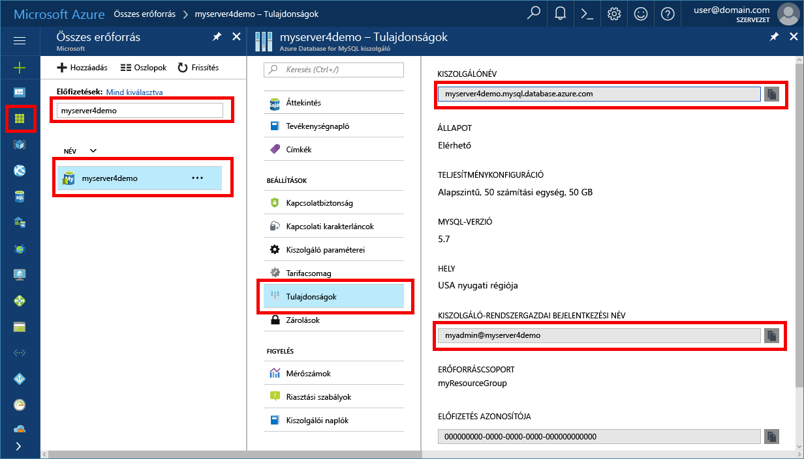

# <a name="migrate-your-mysql-database-by-using-import-and-export"></a><span data-ttu-id="e21f4-103">A MySQL-adatbázis áttelepítéséhez importálása és exportálása</span><span class="sxs-lookup"><span data-stu-id="e21f4-103">Migrate your MySQL database by using import and export</span></span>
<span data-ttu-id="e21f4-104">Ez a cikk ismerteti a két gyakori módszer tooimporting és exportáló adatok tooan Azure adatbázis MySQL kiszolgáló MySQL munkaterület használatával.</span><span class="sxs-lookup"><span data-stu-id="e21f4-104">This article explains two common approaches tooimporting and exporting data tooan Azure Database for MySQL server by using MySQL Workbench.</span></span> 

## <a name="before-you-begin"></a><span data-ttu-id="e21f4-105">Előkészületek</span><span class="sxs-lookup"><span data-stu-id="e21f4-105">Before you begin</span></span>
<span data-ttu-id="e21f4-106">Ez hogyan tooguide keresztül toostep, lesz szüksége:</span><span class="sxs-lookup"><span data-stu-id="e21f4-106">toostep through this how-tooguide, you need:</span></span>
- <span data-ttu-id="e21f4-107">Egy Azure-adatbázis MySQL-kiszolgáló következő [hozzon létre egy Azure-portál használatával MySQL-kiszolgálóhoz tartozó Azure-adatbázis](quickstart-create-mysql-server-database-using-azure-portal.md).</span><span class="sxs-lookup"><span data-stu-id="e21f4-107">An Azure Database for MySQL server, by following [Create an Azure Database for MySQL server using Azure portal](quickstart-create-mysql-server-database-using-azure-portal.md).</span></span>
- <span data-ttu-id="e21f4-108">MySQL-munkaterület [letöltött](https://dev.mysql.com/downloads/workbench/), vagy egy másik MySQL eszköz tooimport és exportálása.</span><span class="sxs-lookup"><span data-stu-id="e21f4-108">MySQL Workbench [downloaded](https://dev.mysql.com/downloads/workbench/), or another MySQL tool tooimport and export.</span></span>

## <a name="use-common-tools"></a><span data-ttu-id="e21f4-109">Általános eszközök használata</span><span class="sxs-lookup"><span data-stu-id="e21f4-109">Use common tools</span></span>
<span data-ttu-id="e21f4-110">Közös eszközök például a MySQL-munkaterületet, varangy vagy Navicat tooremotely csatlakozás és importálhat, illetve exportálhatja az adatokat az Azure-adatbázisba a MySQL.</span><span class="sxs-lookup"><span data-stu-id="e21f4-110">Use common tools such as MySQL Workbench, Toad, or Navicat tooremotely connect and import or export data into Azure Database for MySQL.</span></span> 

<span data-ttu-id="e21f4-111">Az ilyen eszközök használatát az Internet kapcsolat tooconnect tooAzure adatbázis az ügyfélgépre MySQL.</span><span class="sxs-lookup"><span data-stu-id="e21f4-111">Use such tools on your client machine with an Internet connection tooconnect tooAzure Database for MySQL.</span></span> <span data-ttu-id="e21f4-112">Egy SSL titkosítású kapcsolat használata ajánlott biztonsági eljárások a [MySQL az Azure-adatbázis konfigurálása az SSL-kapcsolat](concepts-ssl-connection-security.md).</span><span class="sxs-lookup"><span data-stu-id="e21f4-112">Use an SSL-encrypted connection for best security practices, as described in [Configure SSL connectivity in Azure Database for MySQL](concepts-ssl-connection-security.md).</span></span>

<span data-ttu-id="e21f4-113">Nem kell toomove az importálás és exportálás a fájlok tooany különleges felhő helye, MySQL adatbázis tooAzure áttelepítésekor.</span><span class="sxs-lookup"><span data-stu-id="e21f4-113">You do not need toomove your import and export files tooany special cloud location when migrating tooAzure Database for MySQL.</span></span> 

## <a name="create-a-database-on-hello-azure-database-for-mysql-server"></a><span data-ttu-id="e21f4-114">Adatbázis létrehozására az Azure-adatbázis hello MySQL-kiszolgáló</span><span class="sxs-lookup"><span data-stu-id="e21f4-114">Create a database on hello Azure Database for MySQL server</span></span>
<span data-ttu-id="e21f4-115">Hozzon létre egy üres adatbázist hello Azure adatbázis MySQL-kiszolgáló, ahová toomigrate hello adatokat.</span><span class="sxs-lookup"><span data-stu-id="e21f4-115">Create an empty database on hello Azure Database for MySQL server where you want toomigrate hello data.</span></span> <span data-ttu-id="e21f4-116">Segítségével például MySQL munkaterület, varangy vagy Navicat toocreate hello adatbázis.</span><span class="sxs-lookup"><span data-stu-id="e21f4-116">Use a tool such as MySQL Workbench, Toad, or Navicat toocreate hello database.</span></span> <span data-ttu-id="e21f4-117">hello adatbázis rendelkezhet hello azonos kiírt hello adatok, vagy tartalmazó hello adatbázist hozhat létre adatbázist egy eltérő nevű nevet.</span><span class="sxs-lookup"><span data-stu-id="e21f4-117">hello database can have hello same name as hello database that contains hello dumped data, or you can create a database with a different name.</span></span>

<span data-ttu-id="e21f4-118">tooget csatlakoztatva, keresse meg a hello kapcsolati információk hello **tulajdonságok** MySQL az Azure-adatbázis paneljén.</span><span class="sxs-lookup"><span data-stu-id="e21f4-118">tooget connected, locate hello connection information on hello **Properties** pane in Azure Database for MySQL.</span></span>



<span data-ttu-id="e21f4-120">Adja hozzá a hello kapcsolati információk tooMySQL munkaterületet.</span><span class="sxs-lookup"><span data-stu-id="e21f4-120">Add hello connection information tooMySQL Workbench.</span></span>


## <a name="determine-when-toouse-import-and-export-techniques-instead-of-a-dump-and-restore"></a><span data-ttu-id="e21f4-122">Toouse importálása és exportálása technikák helyett egy biztonsági másolat és helyreállítás</span><span class="sxs-lookup"><span data-stu-id="e21f4-122">Determine when toouse import and export techniques instead of a dump and restore</span></span>
<span data-ttu-id="e21f4-123">MySQL eszközök tooimport használja, és az Azure-beli MySQL Database adatbázisok exportálása a következő forgatókönyvek hello.</span><span class="sxs-lookup"><span data-stu-id="e21f4-123">Use MySQL tools tooimport and export databases into Azure MySQL Database in hello following scenarios.</span></span> <span data-ttu-id="e21f4-124">Más esetekben előfordulhat, hogy kihasználhatja a hello segítségével [dump és visszaállítási](concepts-migrate-dump-restore.md) közelítik meg helyette.</span><span class="sxs-lookup"><span data-stu-id="e21f4-124">In other scenarios, you might benefit from using hello [dump and restore](concepts-migrate-dump-restore.md) approach instead.</span></span> 

- <span data-ttu-id="e21f4-125">Ha tooselectively van szüksége az Azure-beli MySQL Database néhány táblák tooimport választhat meglévő MySQL-adatbázis, az ajánlott toouse hello importálása és exportálása technika.</span><span class="sxs-lookup"><span data-stu-id="e21f4-125">When you need tooselectively choose a few tables tooimport from an existing MySQL database into Azure MySQL Database, it's best toouse hello import and export technique.</span></span>  <span data-ttu-id="e21f4-126">Ezzel a módszerrel hagyja ki ezt a felesleges táblázatra hello toosave időt és erőforrásokat.</span><span class="sxs-lookup"><span data-stu-id="e21f4-126">By doing so, you can omit any unneeded tables from hello migration toosave time and resources.</span></span> <span data-ttu-id="e21f4-127">Például, használja a hello `--include-tables` vagy `--exclude-tables` kapcsoló [mysqlpump](https://dev.mysql.com/doc/refman/5.7/en/mysqlpump.html#option_mysqlpump_include-tables) és hello `--tables` kapcsoló [mysqldump](https://dev.mysql.com/doc/refman/5.7/en/mysqldump.html#option_mysqldump_tables).</span><span class="sxs-lookup"><span data-stu-id="e21f4-127">For example, use hello `--include-tables` or `--exclude-tables` switch with [mysqlpump](https://dev.mysql.com/doc/refman/5.7/en/mysqlpump.html#option_mysqlpump_include-tables) and hello `--tables` switch with [mysqldump](https://dev.mysql.com/doc/refman/5.7/en/mysqldump.html#option_mysqldump_tables).</span></span>
- <span data-ttu-id="e21f4-128">Adatbázis-objektumok hello táblák nem telepít át, ha explicit módon hozza létre azokat.</span><span class="sxs-lookup"><span data-stu-id="e21f4-128">When you're moving hello database objects other than tables, explicitly create those.</span></span> <span data-ttu-id="e21f4-129">Megkötések (elsődleges kulcs, külső kulcs, indexek), nézetek, Funkciók, eljárások, eseményindítók tartalmazza, és bármely más adatbázis-objektumhoz, amelyet az toomigrate.</span><span class="sxs-lookup"><span data-stu-id="e21f4-129">Include constraints (primary key, foreign key, indexes), views, functions, procedures, triggers, and any other database objects that you want toomigrate.</span></span>
- <span data-ttu-id="e21f4-130">A MySQL-adatbázis nem külső adatforrások, amelybe migrálna adatokat, amikor egybesimított fájlok létrehozása, és importálja a [mysqlimport](https://dev.mysql.com/doc/refman/5.7/en/mysqlimport.html).</span><span class="sxs-lookup"><span data-stu-id="e21f4-130">When you're migrating data from external data sources other than a MySQL database, create flat files and import them by using [mysqlimport](https://dev.mysql.com/doc/refman/5.7/en/mysqlimport.html).</span></span>

<span data-ttu-id="e21f4-131">Győződjön meg arról, hogy minden táblájára hello adatbázis felhasználhatja a hello InnoDB tárolóprogramot tölt be adatokat az Azure-adatbázisba a MySQL.</span><span class="sxs-lookup"><span data-stu-id="e21f4-131">Make sure that all tables in hello database use hello InnoDB storage engine when you're loading data into Azure Database for MySQL.</span></span> <span data-ttu-id="e21f4-132">Azure MySQL-adatbázis csak hello InnoDB tárolóprogramot, támogatja, így a másodlagos tárolási motorok nem támogatja.</span><span class="sxs-lookup"><span data-stu-id="e21f4-132">Azure Database for MySQL supports only hello InnoDB storage engine, so it doesn't support alternative storage engines.</span></span> <span data-ttu-id="e21f4-133">Ha a táblák alternatív tárolási motorok van szükség, lehet, hogy tooconvert őket toouse hello InnoDB motor formátum hello áttelepítési tooAzure MySQL adatbázis előtt.</span><span class="sxs-lookup"><span data-stu-id="e21f4-133">If your tables require alternative storage engines, be sure tooconvert them toouse hello InnoDB engine format before hello migration tooAzure Database for MySQL.</span></span> 

<span data-ttu-id="e21f4-134">Például ha egy WordPress vagy webes alkalmazás hello MyISAM motort használja, először alakítsa át hello táblák hello adatok áttelepítése által InnoDB táblákba.</span><span class="sxs-lookup"><span data-stu-id="e21f4-134">For example, if you have a WordPress or web app that uses hello MyISAM engine, first convert hello tables by migrating hello data into InnoDB tables.</span></span> <span data-ttu-id="e21f4-135">Majd állítsa vissza a MySQL adatbázis tooAzure.</span><span class="sxs-lookup"><span data-stu-id="e21f4-135">Then restore tooAzure Database for MySQL.</span></span> <span data-ttu-id="e21f4-136">Használjon hello záradék `ENGINE=INNODB` tooset hello motor a tábla létrehozása, és majd hello adatátvitelt hello kompatibilis táblába hello áttelepítés előtt.</span><span class="sxs-lookup"><span data-stu-id="e21f4-136">Use hello clause `ENGINE=INNODB` tooset hello engine for creating a table, and then transfer hello data into hello compatible table before hello migration.</span></span> 

   ```sql
   INSERT INTO innodb_table SELECT * FROM myisam_table ORDER BY primary_key_columns
   ```

## <a name="performance-recommendations-for-import-and-export"></a><span data-ttu-id="e21f4-137">Teljesítmény javaslatok importálása és exportálása</span><span class="sxs-lookup"><span data-stu-id="e21f4-137">Performance recommendations for import and export</span></span>
-   <span data-ttu-id="e21f4-138">Adatok betöltése előtt hozzon létre a fürtözött indexek és az elsődleges kulcsok.</span><span class="sxs-lookup"><span data-stu-id="e21f4-138">Create clustered indexes and primary keys before loading data.</span></span> <span data-ttu-id="e21f4-139">Az elsődleges kulcs sorrendben adatok betöltése.</span><span class="sxs-lookup"><span data-stu-id="e21f4-139">Load data in primary key order.</span></span> 
-   <span data-ttu-id="e21f4-140">Adatok után másodlagos indexek létrehozását késleltetés be van töltve.</span><span class="sxs-lookup"><span data-stu-id="e21f4-140">Delay creation of secondary indexes until after data is loaded.</span></span> <span data-ttu-id="e21f4-141">Minden másodlagos indexek létrehozása betöltése után.</span><span class="sxs-lookup"><span data-stu-id="e21f4-141">Create all secondary indexes after loading.</span></span> 
-   <span data-ttu-id="e21f4-142">Tiltsa le a külső kulcsra vonatkozó megkötések betöltés előtt.</span><span class="sxs-lookup"><span data-stu-id="e21f4-142">Disable foreign key constraints before loading.</span></span> <span data-ttu-id="e21f4-143">Teljesítménynövekedéshez idegen kulcs ellenőrzések letiltása biztosít.</span><span class="sxs-lookup"><span data-stu-id="e21f4-143">Disabling foreign key checks provides significant performance gains.</span></span> <span data-ttu-id="e21f4-144">Hello megkötések engedélyezéséhez és hello adatok ellenőrzése után hello terhelés tooensure a hivatkozási integritás.</span><span class="sxs-lookup"><span data-stu-id="e21f4-144">Enable hello constraints and verify hello data after hello load tooensure referential integrity.</span></span>
-   <span data-ttu-id="e21f4-145">Az adatok párhuzamos betöltése.</span><span class="sxs-lookup"><span data-stu-id="e21f4-145">Load data in parallel.</span></span> <span data-ttu-id="e21f4-146">Ne használjon túl sok párhuzamos, amely ehhez miatt a toohit erőforrás korlátozni, és figyelje az erőforrások hello metrikák hello Azure-portál érhető el.</span><span class="sxs-lookup"><span data-stu-id="e21f4-146">Avoid too much parallelism that would cause you toohit a resource limit, and monitor resources by using hello metrics available in hello Azure portal.</span></span> 
-   <span data-ttu-id="e21f4-147">Használja a particionált táblákat, amikor szükséges.</span><span class="sxs-lookup"><span data-stu-id="e21f4-147">Use partitioned tables when appropriate.</span></span>

## <a name="import-and-export-by-using-mysql-workbench"></a><span data-ttu-id="e21f4-148">Importálás és exportálás MySQL munkaterület használatával</span><span class="sxs-lookup"><span data-stu-id="e21f4-148">Import and export by using MySQL Workbench</span></span>
<span data-ttu-id="e21f4-149">Két módon tooexport-importálási adatok MySQL munkaterület.</span><span class="sxs-lookup"><span data-stu-id="e21f4-149">There are two ways tooexport and import data in MySQL Workbench.</span></span> <span data-ttu-id="e21f4-150">Minden más célt szolgál.</span><span class="sxs-lookup"><span data-stu-id="e21f4-150">Each serves a different purpose.</span></span> 

### <a name="table-data-export-and-import-wizards-from-hello-object-browsers-context-menu"></a><span data-ttu-id="e21f4-151">Tábla adatai exportálása és importálása a varázslók hello objektum böngésző helyi menüből</span><span class="sxs-lookup"><span data-stu-id="e21f4-151">Table data export and import wizards from hello object browser's context menu</span></span>


<span data-ttu-id="e21f4-153">a tábla adatai hello varázslók támogatott importálás, és műveletek exportálása CSV és a JSON-fájlok használatával.</span><span class="sxs-lookup"><span data-stu-id="e21f4-153">hello wizards for table data support import and export operations by using CSV and JSON files.</span></span> <span data-ttu-id="e21f4-154">Több konfigurációs beállítások, például az szerepel, az oszlop kiválasztása és a kódolási kiválasztása tartalmaznak.</span><span class="sxs-lookup"><span data-stu-id="e21f4-154">They include several configuration options, such as separators, column selection, and encoding selection.</span></span> <span data-ttu-id="e21f4-155">Egyes varázslók helyi vagy távoli csatlakoztatott MySQL-kiszolgálók alapján végezheti el.</span><span class="sxs-lookup"><span data-stu-id="e21f4-155">You can perform each wizard against local or remotely connected MySQL servers.</span></span> <span data-ttu-id="e21f4-156">hello importálási művelet tartalmaz a táblázatok, oszlopok és leképezésének.</span><span class="sxs-lookup"><span data-stu-id="e21f4-156">hello import action includes table, column, and type mapping.</span></span> 

<span data-ttu-id="e21f4-157">Kattintson a jobb gombbal egy táblát a varázslók hello objektum böngésző helyi menüből érheti el.</span><span class="sxs-lookup"><span data-stu-id="e21f4-157">You can access these wizards from hello object browser's context menu by right-clicking a table.</span></span> <span data-ttu-id="e21f4-158">Válasszon **adatok exportálása varázsló** vagy **tábla adatok importálása varázsló**.</span><span class="sxs-lookup"><span data-stu-id="e21f4-158">Then choose either **Table Data Export Wizard** or **Table Data Import Wizard**.</span></span> 

#### <a name="table-data-export-wizard"></a><span data-ttu-id="e21f4-159">Adatok exportálása varázsló</span><span class="sxs-lookup"><span data-stu-id="e21f4-159">Table Data Export Wizard</span></span>
<span data-ttu-id="e21f4-160">a következő példa kivitel hello tábla tooa CSV-fájl hello:</span><span class="sxs-lookup"><span data-stu-id="e21f4-160">hello following example exports hello table tooa CSV file:</span></span> 
1. <span data-ttu-id="e21f4-161">Kattintson a jobb gombbal az exportált hello adatbázis toobe hello tábla.</span><span class="sxs-lookup"><span data-stu-id="e21f4-161">Right-click hello table of hello database toobe exported.</span></span> 
2. <span data-ttu-id="e21f4-162">Válassza ki **adatok exportálása varázsló tábla**.</span><span class="sxs-lookup"><span data-stu-id="e21f4-162">Select **Table Data Export Wizard**.</span></span> <span data-ttu-id="e21f4-163">Válassza ki a hello oszlopok toobe exportált, soreltolást (ha van ilyen) és count (ha van ilyen).</span><span class="sxs-lookup"><span data-stu-id="e21f4-163">Select hello columns toobe exported, row offset (if any), and count (if any).</span></span> 
3. <span data-ttu-id="e21f4-164">A hello **jelölje ki az exportált adatokat** kattintson **következő**.</span><span class="sxs-lookup"><span data-stu-id="e21f4-164">On hello **Select data for export** page, click **Next**.</span></span> <span data-ttu-id="e21f4-165">Válassza ki a hello fájl elérési útját, CSV vagy JSON fájltípust.</span><span class="sxs-lookup"><span data-stu-id="e21f4-165">Select hello file path, CSV, or JSON file type.</span></span> <span data-ttu-id="e21f4-166">Kiválaszthatja a hello sor elválasztó, a befoglaló karakterláncok és mezőhatároló metódust.</span><span class="sxs-lookup"><span data-stu-id="e21f4-166">Also select hello line separator, method of enclosing strings, and field separator.</span></span> 
4. <span data-ttu-id="e21f4-167">A hello **válassza kimeneti fájl helye** kattintson **következő**.</span><span class="sxs-lookup"><span data-stu-id="e21f4-167">On hello **Select output file location** page, click **Next**.</span></span> 
5. <span data-ttu-id="e21f4-168">A hello **adatok exportálása** kattintson **következő**.</span><span class="sxs-lookup"><span data-stu-id="e21f4-168">On hello **Export data** page, click **Next**.</span></span>

#### <a name="table-data-import-wizard"></a><span data-ttu-id="e21f4-169">Adatok importálása varázsló</span><span class="sxs-lookup"><span data-stu-id="e21f4-169">Table Data Import Wizard</span></span>
<span data-ttu-id="e21f4-170">hello alábbi példa importálja hello tábla CSV-fájlból:</span><span class="sxs-lookup"><span data-stu-id="e21f4-170">hello following example imports hello table from a CSV file:</span></span>
1. <span data-ttu-id="e21f4-171">Kattintson a jobb gombbal hello adatbázis toobe importált hello táblájában.</span><span class="sxs-lookup"><span data-stu-id="e21f4-171">Right-click hello table of hello database toobe imported.</span></span> 
2. <span data-ttu-id="e21f4-172">Tallózás tooand válassza hello importálása CSV-fájl toobe, és kattintson a **következő**.</span><span class="sxs-lookup"><span data-stu-id="e21f4-172">Browse tooand select hello CSV file toobe imported, and then click **Next**.</span></span> 
3. <span data-ttu-id="e21f4-173">Válassza ki a céltábla hello (új vagy meglévő), és válassza ki, vagy törölje a jelet hello **importálás előtt Truncate table** jelölőnégyzetet.</span><span class="sxs-lookup"><span data-stu-id="e21f4-173">Select hello destination table (new or existing), and select or clear hello **Truncate table before import** check box.</span></span> <span data-ttu-id="e21f4-174">Kattintson a **Tovább** gombra.</span><span class="sxs-lookup"><span data-stu-id="e21f4-174">Click **Next**.</span></span>
4. <span data-ttu-id="e21f4-175">Válassza ki a kódolás és hello oszlopok toobe importálva, és kattintson a **következő**.</span><span class="sxs-lookup"><span data-stu-id="e21f4-175">Select encoding and hello columns toobe imported, and then click **Next**.</span></span> 
5. <span data-ttu-id="e21f4-176">A hello **adatimportálás** kattintson **következő**.</span><span class="sxs-lookup"><span data-stu-id="e21f4-176">On hello **Import data** page, click **Next**.</span></span> <span data-ttu-id="e21f4-177">hello varázsló ennek megfelelően hello adatok importálására.</span><span class="sxs-lookup"><span data-stu-id="e21f4-177">hello wizard imports hello data accordingly.</span></span>

### <a name="sql-data-export-and-import-wizards-from-hello-navigator-pane"></a><span data-ttu-id="e21f4-178">SQL adatok exportálása, majd importálja a varázslók hello Navigator panelről</span><span class="sxs-lookup"><span data-stu-id="e21f4-178">SQL data export and import wizards from hello Navigator pane</span></span>
<span data-ttu-id="e21f4-179">A varázsló tooexport használja, vagy importáljon MySQL munkaterület előállított vagy hello mysqldump parancs által létrehozott SQL.</span><span class="sxs-lookup"><span data-stu-id="e21f4-179">Use a wizard tooexport or import SQL generated from MySQL Workbench or generated from hello mysqldump command.</span></span> <span data-ttu-id="e21f4-180">Ezekben a varázslókban elérje hello **Navigator** ablaktáblán vagy kiválasztásával **Server** hello főmenüből.</span><span class="sxs-lookup"><span data-stu-id="e21f4-180">Access these wizards from hello **Navigator** pane or by selecting **Server** from hello main menu.</span></span> <span data-ttu-id="e21f4-181">Válassza ki **adatok exportálása** vagy **adatimportálás**.</span><span class="sxs-lookup"><span data-stu-id="e21f4-181">Then select **Data Export** or **Data Import**.</span></span> 

#### <a name="data-export"></a><span data-ttu-id="e21f4-182">Adatok exportálása</span><span class="sxs-lookup"><span data-stu-id="e21f4-182">Data Export</span></span>


<span data-ttu-id="e21f4-184">Használhatja a hello **adatok exportálása** lapon tooexport MySQL adatait.</span><span class="sxs-lookup"><span data-stu-id="e21f4-184">You can use hello **Data Export** tab tooexport your MySQL data.</span></span> 
1. <span data-ttu-id="e21f4-185">Válassza ki, hogy szeretné, hogy tooexport, opcionálisan választja adott séma objektumok/táblák minden sémájából, és hello exportálási készítése minden sémát.</span><span class="sxs-lookup"><span data-stu-id="e21f4-185">Select each schema that you want tooexport, optionally choose specific schema objects/tables from each schema, and generate hello export.</span></span> <span data-ttu-id="e21f4-186">Konfigurációs beállítások exportálása tooa projektmappa vagy önálló SQL-fájl tartalmazza, tárolt eljárások és események dump vagy hagyja ki a tábla adatai.</span><span class="sxs-lookup"><span data-stu-id="e21f4-186">Configuration options include export tooa project folder or self-contained SQL file, dump stored routines and events, or skip table data.</span></span> 
 
   <span data-ttu-id="e21f4-187">Másik megoldásként használhatja **exportálása eredményhalmaz** hello SQL szerkesztő tooanother formátumban, például CSV, JSON, HTML és XML beállítása az adott eredmény tooexport.</span><span class="sxs-lookup"><span data-stu-id="e21f4-187">Alternatively, use **Export a Result Set** tooexport a specific result set in hello SQL editor tooanother format, such as CSV, JSON, HTML, and XML.</span></span> 
3. <span data-ttu-id="e21f4-188">Válassza ki a hello adatbázis objektumok tooexport, és konfigurálja hello kapcsolódó beállításokat.</span><span class="sxs-lookup"><span data-stu-id="e21f4-188">Select hello database objects tooexport, and configure hello related options.</span></span>
4. <span data-ttu-id="e21f4-189">Kattintson a **frissítése** tooload hello aktuális objektumok.</span><span class="sxs-lookup"><span data-stu-id="e21f4-189">Click **Refresh** tooload hello current objects.</span></span>
5. <span data-ttu-id="e21f4-190">Szükség esetén nyissa meg a hello **speciális beállítások** toorefine hello az exportálási művelet fülre.</span><span class="sxs-lookup"><span data-stu-id="e21f4-190">Optionally, open hello **Advanced Options** tab toorefine hello export operation.</span></span> <span data-ttu-id="e21f4-191">Adja hozzá például a táblázat zárolásokat, használja a név felülírandó insert utasításokban, és ajánlat azonosítók backtick karakterekkel helyett.</span><span class="sxs-lookup"><span data-stu-id="e21f4-191">For example, add table locks, use replace instead of insert statements, and quote identifiers with backtick characters.</span></span>
6. <span data-ttu-id="e21f4-192">Kattintson a **Start exportálása** toobegin hello exportálás során.</span><span class="sxs-lookup"><span data-stu-id="e21f4-192">Click **Start Export** toobegin hello export process.</span></span>


#### <a name="data-import"></a><span data-ttu-id="e21f4-193">Adatok importálása</span><span class="sxs-lookup"><span data-stu-id="e21f4-193">Data Import</span></span>


<span data-ttu-id="e21f4-195">Használhatja a hello **adatimportálás** tooimport lapon, vagy állítsa vissza az exportált adatokat, hello adatok az exportálási művelet vagy hello mysqldump parancs.</span><span class="sxs-lookup"><span data-stu-id="e21f4-195">You can use hello **Data Import** tab tooimport or restore exported data from hello data export operation or from hello mysqldump command.</span></span> 
1. <span data-ttu-id="e21f4-196">Válassza a projektmappa hello vagy önálló SQL-fájl, válassza ki a hello séma tooimport be, vagy válassza **új** toodefine új sémát.</span><span class="sxs-lookup"><span data-stu-id="e21f4-196">Choose hello project folder or self-contained SQL file, choose hello schema tooimport into, or choose **New** toodefine a new schema.</span></span> 
2. <span data-ttu-id="e21f4-197">Kattintson a **Start importálása** toobegin hello az importálási folyamat.</span><span class="sxs-lookup"><span data-stu-id="e21f4-197">Click **Start Import** toobegin hello import process.</span></span>

## <a name="next-steps"></a><span data-ttu-id="e21f4-198">Következő lépések</span><span class="sxs-lookup"><span data-stu-id="e21f4-198">Next steps</span></span>
<span data-ttu-id="e21f4-199">Egy másik áttelepítési módszert használja, mint olvasási [áttelepítése a MySQL adatbázis használatával dump és MySQL az Azure-adatbázis visszaállítása](concepts-migrate-dump-restore.md).</span><span class="sxs-lookup"><span data-stu-id="e21f4-199">As another migration approach, read [Migrate your MySQL database using dump and restore in Azure Database for MySQL](concepts-migrate-dump-restore.md).</span></span> 
