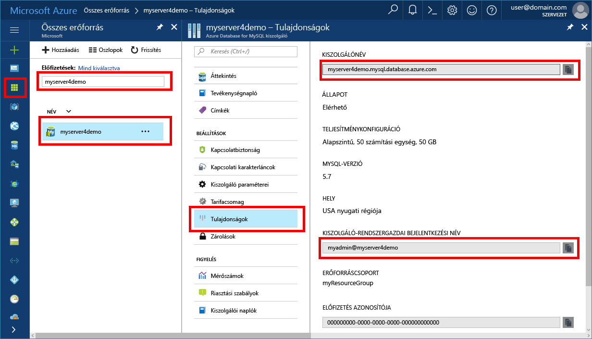

# <a name="azure-database-for-mysql-use-connectorc-tooconnect-and-query-data"></a><span data-ttu-id="fc4f9-103">MySQL az Azure-adatbázishoz: használata összekötő/C++ tooconnect és lekérdezési adatok</span><span class="sxs-lookup"><span data-stu-id="fc4f9-103">Azure Database for MySQL: Use Connector/C++ tooconnect and query data</span></span>
<span data-ttu-id="fc4f9-104">A gyors üzembe helyezés bemutatja, hogyan tooconnect tooan Azure adatbázis a MySQL C++ alkalmazást használ.</span><span class="sxs-lookup"><span data-stu-id="fc4f9-104">This quickstart demonstrates how tooconnect tooan Azure Database for MySQL using a C++ application.</span></span> <span data-ttu-id="fc4f9-105">Azt illusztrálja, hogyan toouse SQL utasítás tooquery beszúrási, frissítési és törlési hello adatbázis adatait.</span><span class="sxs-lookup"><span data-stu-id="fc4f9-105">It shows how toouse SQL statements tooquery, insert, update, and delete data in hello database.</span></span> <span data-ttu-id="fc4f9-106">hello cikkben leírt lépések azt feltételezik, hogy jártas C++ használatával történő fejlesztéséhez, és szeretné új tooworking MySQL az Azure-adatbázissal.</span><span class="sxs-lookup"><span data-stu-id="fc4f9-106">hello steps in this article assume that you are familiar with developing using C++, and that you are new tooworking with Azure Database for MySQL.</span></span>

## <a name="prerequisites"></a><span data-ttu-id="fc4f9-107">Előfeltételek</span><span class="sxs-lookup"><span data-stu-id="fc4f9-107">Prerequisites</span></span>
<span data-ttu-id="fc4f9-108">A gyors üzembe helyezés kiindulási pontként ezek az útmutatók valamelyikével létrehozott hello erőforrást használ:</span><span class="sxs-lookup"><span data-stu-id="fc4f9-108">This quickstart uses hello resources created in either of these guides as a starting point:</span></span>
- [<span data-ttu-id="fc4f9-109">Azure-adatbázis létrehozása MySQL-kiszolgálóhoz az Azure Portal használatával</span><span class="sxs-lookup"><span data-stu-id="fc4f9-109">Create an Azure Database for MySQL server using Azure portal</span></span>](./quickstart-create-mysql-server-database-using-azure-portal.md)
- [<span data-ttu-id="fc4f9-110">Azure-adatbázis létrehozása MySQL-kiszolgálóhoz az Azure CLI használatával</span><span class="sxs-lookup"><span data-stu-id="fc4f9-110">Create an Azure Database for MySQL server using Azure CLI</span></span>](./quickstart-create-mysql-server-database-using-azure-cli.md)

<span data-ttu-id="fc4f9-111">Emellett a következőket kell elvégezni:</span><span class="sxs-lookup"><span data-stu-id="fc4f9-111">You also need to:</span></span>
- <span data-ttu-id="fc4f9-112">A [.NET-keretrendszer](https://www.microsoft.com/net/download) telepítése</span><span class="sxs-lookup"><span data-stu-id="fc4f9-112">Install [.NET Framework](https://www.microsoft.com/net/download)</span></span>
- <span data-ttu-id="fc4f9-113">A [Visual Studio](https://www.visualstudio.com/downloads/) telepítése</span><span class="sxs-lookup"><span data-stu-id="fc4f9-113">Install [Visual Studio](https://www.visualstudio.com/downloads/)</span></span>
- <span data-ttu-id="fc4f9-114">A [MySQL-összekötő/C++](https://dev.mysql.com/downloads/connector/cpp/) telepítése</span><span class="sxs-lookup"><span data-stu-id="fc4f9-114">Install [MySQL Connector/C++](https://dev.mysql.com/downloads/connector/cpp/)</span></span> 
- <span data-ttu-id="fc4f9-115">A [Boost](http://www.boost.org/) telepítése</span><span class="sxs-lookup"><span data-stu-id="fc4f9-115">Install [Boost](http://www.boost.org/)</span></span>

## <a name="install-visual-studio-and-net"></a><span data-ttu-id="fc4f9-116">A Visual Studio és a .NET telepítése</span><span class="sxs-lookup"><span data-stu-id="fc4f9-116">Install Visual Studio and .NET</span></span>
<span data-ttu-id="fc4f9-117">Ebben a szakaszban hello lépések feltételezik, hogy ismeri a .NET használatával történő fejlesztéséhez.</span><span class="sxs-lookup"><span data-stu-id="fc4f9-117">hello steps in this section assume that you are familiar with developing using .NET.</span></span>

### <a name="windows"></a><span data-ttu-id="fc4f9-118">**Windows**</span><span class="sxs-lookup"><span data-stu-id="fc4f9-118">**Windows**</span></span>
1. <span data-ttu-id="fc4f9-119">Telepítse a Visual Studio 2017 Communityt, amely egy minden funkcióval ellátott, bővíthető, ingyenes IDE, és amellyel korszerű alkalmazásokat hozhat létre Android, iOS és Windows operációs rendszerre, valamint webes illetve adatbázis-alkalmazásokhoz és felhőszolgáltatásokhoz.</span><span class="sxs-lookup"><span data-stu-id="fc4f9-119">Install Visual Studio 2017 Community, which is a full featured, extensible, free IDE for creating modern applications for Android, iOS, Windows, as well as web & database applications and cloud services.</span></span> <span data-ttu-id="fc4f9-120">Teljes .NET-keretrendszer hello, vagy csak a .NET Core telepítése.</span><span class="sxs-lookup"><span data-stu-id="fc4f9-120">You can install either hello full .NET Framework or just .NET Core.</span></span> <span data-ttu-id="fc4f9-121">a gyors üzembe helyezés hello hello kódrészletek sem működik.</span><span class="sxs-lookup"><span data-stu-id="fc4f9-121">hello code snippets in hello Quickstart work with either.</span></span> <span data-ttu-id="fc4f9-122">Ha már rendelkezik a Visual Studio, a gépen telepítve van, hagyja ki a hello következő két lépést.</span><span class="sxs-lookup"><span data-stu-id="fc4f9-122">If you already have Visual Studio installed on your machine, skip hello next two steps.</span></span>
   - <span data-ttu-id="fc4f9-123">Töltse le a hello [Visual Studio 2017 telepítő](https://www.visualstudio.com/thank-you-downloading-visual-studio/?sku=Community&rel=15).</span><span class="sxs-lookup"><span data-stu-id="fc4f9-123">Download hello [Visual Studio 2017 installer](https://www.visualstudio.com/thank-you-downloading-visual-studio/?sku=Community&rel=15).</span></span> 
   - <span data-ttu-id="fc4f9-124">Hello telepítő futtatásához, és kövesse a hello telepítési utasításokat toocomplete hello telepítését.</span><span class="sxs-lookup"><span data-stu-id="fc4f9-124">Run hello installer and follow hello installation prompts toocomplete hello installation.</span></span>

### <a name="configure-visual-studio"></a><span data-ttu-id="fc4f9-125">**A Visual Studio konfigurálása**</span><span class="sxs-lookup"><span data-stu-id="fc4f9-125">**Configure Visual Studio**</span></span>
1. <span data-ttu-id="fc4f9-126">A Visual Studio projekt tulajdonság > konfigurációs tulajdonságok > C/C++ > linker > Általános > további könyvtár könyvtárak hello lib\opt könyvtár hozzáadása (pl.: C:\Program Files (x86) \MySQL\MySQL összekötő C++ 1.1.9\lib\opt) a hello c ++ összekötő.</span><span class="sxs-lookup"><span data-stu-id="fc4f9-126">From Visual Studio, project property > configuration properties > C/C++ > linker > general > additional library directories, add hello lib\opt directory (i.e.: C:\Program Files (x86)\MySQL\MySQL Connector C++ 1.1.9\lib\opt) of hello c++ connector.</span></span>
2. <span data-ttu-id="fc4f9-127">A Visual Studióban a project property (projekttulajdonság) > configuration properties (konfigurációs tulajdonságok) > C/C++ > general (általános) > additional include directories (további belefoglalt könyvtárak) menüpontban</span><span class="sxs-lookup"><span data-stu-id="fc4f9-127">From Visual Studio, project property > configuration properties > C/C++ > general > additional include directories</span></span>
   - <span data-ttu-id="fc4f9-128">Adja hozzá a c++-összekötő \include könyvtárát (pl.: C:\Program Files (x86)\MySQL\MySQL Connector C++ 1.1.9\include\)</span><span class="sxs-lookup"><span data-stu-id="fc4f9-128">Add include/ directory of c++ connector (i.e.: C:\Program Files (x86)\MySQL\MySQL Connector C++ 1.1.9\include\)</span></span>
   - <span data-ttu-id="fc4f9-129">Adja hozzá a Boost kódtár gyökérkönyvtárát (pl.: C:\boost_1_64_0\)</span><span class="sxs-lookup"><span data-stu-id="fc4f9-129">Add Boost library's root directory (i.e.: C:\boost_1_64_0\)</span></span>
3. <span data-ttu-id="fc4f9-130">A Visual Studio projekt tulajdonság > konfigurációs tulajdonságok > C/C++ > linker > bemeneti > További függőségek, vegyen fel mysqlcppconn.lib hello szövegmező</span><span class="sxs-lookup"><span data-stu-id="fc4f9-130">From Visual Studio, project property > configuration properties > C/C++ > linker > Input > Additional Dependencies, add mysqlcppconn.lib into hello text field</span></span>
4. <span data-ttu-id="fc4f9-131">Hello c ++ összekötő könyvtár mappából a 3. lépés toohello vagy másolási mysqlcppconn.dll végrehajtható hello alkalmazás könyvtárába, vagy felveheti Ön toohello környezeti változó, az alkalmazás találja meg.</span><span class="sxs-lookup"><span data-stu-id="fc4f9-131">Either copy mysqlcppconn.dll from hello c++ connector library folder in step 3 toohello same directory as hello application executable or add it toohello environment variable so your application can find it.</span></span>

## <a name="get-connection-information"></a><span data-ttu-id="fc4f9-132">Kapcsolatadatok lekérése</span><span class="sxs-lookup"><span data-stu-id="fc4f9-132">Get connection information</span></span>
<span data-ttu-id="fc4f9-133">MySQL hello kapcsolat szükséges információkat tooconnect toohello Azure adatbázis beolvasása.</span><span class="sxs-lookup"><span data-stu-id="fc4f9-133">Get hello connection information needed tooconnect toohello Azure Database for MySQL.</span></span> <span data-ttu-id="fc4f9-134">Teljesen minősített kiszolgáló nevét és a bejelentkezési hitelesítő adatokat hello van szüksége.</span><span class="sxs-lookup"><span data-stu-id="fc4f9-134">You need hello fully qualified server name and login credentials.</span></span>

1. <span data-ttu-id="fc4f9-135">Jelentkezzen be toohello [Azure-portálon](https://portal.azure.com/).</span><span class="sxs-lookup"><span data-stu-id="fc4f9-135">Log in toohello [Azure portal](https://portal.azure.com/).</span></span>
2. <span data-ttu-id="fc4f9-136">A hello Azure-portálon a bal oldali menüből, kattintson az **összes erőforrás** , és keressen a létrehozott, például a hello server **myserver4demo**.</span><span class="sxs-lookup"><span data-stu-id="fc4f9-136">From hello left-hand menu in Azure portal, click **All resources** and search for hello server you have created, such as **myserver4demo**.</span></span>
3. <span data-ttu-id="fc4f9-137">Hello kiszolgáló nevére kattint.</span><span class="sxs-lookup"><span data-stu-id="fc4f9-137">Click hello server name.</span></span>
4. <span data-ttu-id="fc4f9-138">Jelölje be hello server **tulajdonságok** lap.</span><span class="sxs-lookup"><span data-stu-id="fc4f9-138">Select hello server's **Properties** page.</span></span> <span data-ttu-id="fc4f9-139">Jegyezze fel a hello **kiszolgálónév** és **kiszolgálói rendszergazda bejelentkezési név**.</span><span class="sxs-lookup"><span data-stu-id="fc4f9-139">Make a note of hello **Server name** and **Server admin login name**.</span></span>
 <span data-ttu-id="fc4f9-140"></span><span class="sxs-lookup"><span data-stu-id="fc4f9-140"></span></span>
5. <span data-ttu-id="fc4f9-141">Ha elfelejti a kiszolgálói bejelentkezési adatok, keresse meg a toohello **áttekintése** tooview hello kiszolgálói rendszergazda bejelentkezési név lapon, és ha szükséges, állítsa vissza a hello jelszót.</span><span class="sxs-lookup"><span data-stu-id="fc4f9-141">If you forget your server login information, navigate toohello **Overview** page tooview hello Server admin login name and, if necessary, reset hello password.</span></span>

## <a name="connect-create-table-and-insert-data"></a><span data-ttu-id="fc4f9-142">Csatlakozás, táblák létrehozása és adatok beszúrása</span><span class="sxs-lookup"><span data-stu-id="fc4f9-142">Connect, create table, and insert data</span></span>
<span data-ttu-id="fc4f9-143">Használjon hello következő code tooconnect, és betölti a hello használatával végzett **CREATE TABLE** és **INSERT INTO** SQL-utasításokat.</span><span class="sxs-lookup"><span data-stu-id="fc4f9-143">Use hello following code tooconnect and load hello data using **CREATE TABLE** and  **INSERT INTO** SQL statements.</span></span> <span data-ttu-id="fc4f9-144">hello kód sql::Driver osztály hello csatlakozás metódus tooestablish egy kapcsolat tooMySQL használ.</span><span class="sxs-lookup"><span data-stu-id="fc4f9-144">hello code uses sql::Driver class with hello connect() method tooestablish a connection tooMySQL.</span></span> <span data-ttu-id="fc4f9-145">Majd hello kód metódus createStatement() és az execute() metódus toorun hello adatbázis parancsokat használja.</span><span class="sxs-lookup"><span data-stu-id="fc4f9-145">Then hello code uses method createStatement() and execute() toorun hello database commands.</span></span> 

<span data-ttu-id="fc4f9-146">Cserélje le a hello gazdagép, a DBName, a felhasználó és a jelszó paraméterek hello kiszolgáló és az adatbázis létrehozásakor adott hello értékekkel.</span><span class="sxs-lookup"><span data-stu-id="fc4f9-146">Replace hello Host, DBName, User, and Password parameters with hello values that you specified when you created hello server and database.</span></span> 

```c++
#include <stdlib.h>
#include <iostream>
#include "stdafx.h"

#include "mysql_connection.h"
#include <cppconn/driver.h>
#include <cppconn/exception.h>
#include <cppconn/prepared_statement.h>
using namespace std;

int main()
{
    sql::Driver *driver;
    sql::Connection *con;
    sql::Statement *stmt;
    sql::PreparedStatement *pstmt;

    try
    {
        driver = get_driver_instance();
        //for demonstration only. never save password in hello code!
        con = driver>connect("tcp://myserver4demo.mysql.database.azure.com:3306/quickstartdb", "myadmin@myserver4demo", "server_admin_password");
    }
    catch (sql::SQLException e)
    {
        cout << "Could not connect toodatabase. Error message: " << e.what() << endl;
        system("pause");
        exit(1);
    }

    stmt = con>createStatement();
    stmt>execute("DROP TABLE IF EXISTS inventory");
    cout << "Finished dropping table (if existed)" << endl;
    stmt>execute("CREATE TABLE inventory (id serial PRIMARY KEY, name VARCHAR(50), quantity INTEGER);");
    cout << "Finished creating table" << endl;
    delete stmt;

    pstmt = con>prepareStatement("INSERT INTO inventory(name, quantity) VALUES(?,?)");
    pstmt>setString(1, "banana");
    pstmt>setInt(2, 150);
    pstmt>execute();
    cout << "One row inserted." << endl;

    pstmt>setString(1, "orange");
    pstmt>setInt(2, 154);
    pstmt>execute();
    cout << "One row inserted." << endl;

    pstmt>setString(1, "apple");
    pstmt>setInt(2, 100);
    pstmt>execute();
    cout << "One row inserted." << endl;
    
    delete pstmt;   
    delete con;
    system("pause");
    return 0;

```

## <a name="read-data"></a><span data-ttu-id="fc4f9-147">Adatok olvasása</span><span class="sxs-lookup"><span data-stu-id="fc4f9-147">Read data</span></span>

<span data-ttu-id="fc4f9-148">Használjon hello alábbi code tooconnect, és hello adatok segítségével olvassa a **kiválasztása** SQL-utasításban.</span><span class="sxs-lookup"><span data-stu-id="fc4f9-148">Use hello following code tooconnect and read hello data using a **SELECT** SQL statement.</span></span> <span data-ttu-id="fc4f9-149">hello kód sql::Driver osztály hello csatlakozás metódus tooestablish egy kapcsolat tooMySQL használ.</span><span class="sxs-lookup"><span data-stu-id="fc4f9-149">hello code uses sql::Driver class with hello connect() method tooestablish a connection tooMySQL.</span></span> <span data-ttu-id="fc4f9-150">Ezután hello kód metódus prepareStatement() használja, és executeQuery() toorun hello válassza ki a parancsokat.</span><span class="sxs-lookup"><span data-stu-id="fc4f9-150">Then hello code uses method prepareStatement() and executeQuery() toorun hello select commands.</span></span> <span data-ttu-id="fc4f9-151">Végül hello kód next() tooadvance toohello rekordok hello eredmények használ.</span><span class="sxs-lookup"><span data-stu-id="fc4f9-151">Finally hello code uses next() tooadvance toohello records in hello results.</span></span> <span data-ttu-id="fc4f9-152">Majd hello kód getInt() és használja getString() tooparse hello hello rekordban.</span><span class="sxs-lookup"><span data-stu-id="fc4f9-152">Then hello code uses getInt() and getString() tooparse hello values in hello record.</span></span>

<span data-ttu-id="fc4f9-153">Cserélje le a hello gazdagép, a DBName, a felhasználó és a jelszó paraméterek hello kiszolgáló és az adatbázis létrehozásakor adott hello értékekkel.</span><span class="sxs-lookup"><span data-stu-id="fc4f9-153">Replace hello Host, DBName, User, and Password parameters with hello values that you specified when you created hello server and database.</span></span> 

```csharp
#include <stdlib.h>
#include <iostream>
#include "stdafx.h"

#include "mysql_connection.h"
#include <cppconn/driver.h>
#include <cppconn/exception.h>
#include <cppconn/resultset.h>
#include <cppconn/prepared_statement.h>
using namespace std;

int main()
{
    sql::Driver *driver;
    sql::Connection *con;
    sql::PreparedStatement *pstmt;
    sql::ResultSet *result;

    try
    {
        driver = get_driver_instance();
        //for demonstration only. never save password in hello code!
        con = driver>connect("tcp://myserver4demo.mysql.database.azure.com:3306/quickstartdb", "myadmin@myserver4demo", "server_admin_password");
    }
    catch (sql::SQLException e)
    {
        cout << "Could not connect toodatabase. Error message: " << e.what() << endl;
        system("pause");
        exit(1);
    }   

//  select  
    pstmt = con>prepareStatement("SELECT * FROM inventory;");
    result = pstmt>executeQuery();  
    
    while (result>next())
        printf("Reading from table=(%d, %s, %d)\n", result>getInt(1), result>getString(2).c_str(), result>getInt(3));   
    
    delete result;
    delete pstmt;   
    delete con;
    system("pause");
    return 0;
}
```

## <a name="update-data"></a><span data-ttu-id="fc4f9-154">Adatok frissítése</span><span class="sxs-lookup"><span data-stu-id="fc4f9-154">Update data</span></span>
<span data-ttu-id="fc4f9-155">Használjon hello alábbi code tooconnect, és olvasott hello adatok egy **frissítés** SQL-utasításban.</span><span class="sxs-lookup"><span data-stu-id="fc4f9-155">Use hello following code tooconnect and read hello data using a **UPDATE** SQL statement.</span></span> <span data-ttu-id="fc4f9-156">hello kód sql::Driver osztály hello csatlakozás metódus tooestablish egy kapcsolat tooMySQL használ.</span><span class="sxs-lookup"><span data-stu-id="fc4f9-156">hello code uses sql::Driver class with hello connect() method tooestablish a connection tooMySQL.</span></span> <span data-ttu-id="fc4f9-157">Majd hello kód metódus prepareStatement() és executeQuery() toorun hello frissítés parancsokat használja.</span><span class="sxs-lookup"><span data-stu-id="fc4f9-157">Then hello code uses method prepareStatement() and executeQuery() toorun hello update commands.</span></span> 

<span data-ttu-id="fc4f9-158">Cserélje le a hello gazdagép, a DBName, a felhasználó és a jelszó paraméterek hello kiszolgáló és az adatbázis létrehozásakor adott hello értékekkel.</span><span class="sxs-lookup"><span data-stu-id="fc4f9-158">Replace hello Host, DBName, User, and Password parameters with hello values that you specified when you created hello server and database.</span></span> 

```csharp
#include <stdlib.h>
#include <iostream>
#include "stdafx.h"

#include "mysql_connection.h"
#include <cppconn/driver.h>
#include <cppconn/exception.h>
#include <cppconn/prepared_statement.h>
using namespace std;

int main()
{
    sql::Driver *driver;
    sql::Connection *con;
    sql::PreparedStatement *pstmt;

    try
    {
        driver = get_driver_instance();
        //for demonstration only. never save password in hello code!
        con = driver>connect("tcp://myserver4demo.mysql.database.azure.com:3306/quickstartdb", "myadmin@myserver4demo", "server_admin_password");
    }
    catch (sql::SQLException e)
    {
        cout << "Could not connect toodatabase. Error message: " << e.what() << endl;
        system("pause");
        exit(1);
    }   

    //update
    pstmt = con>prepareStatement("UPDATE inventory SET quantity = ? WHERE name = ?");
    pstmt>setInt(1, 200);
    pstmt>setString(2, "banana");
    pstmt>executeQuery();
    printf("Row updated\n");
    
    delete con;
    delete pstmt;
    system("pause");
    return 0;
}
```


## <a name="delete-data"></a><span data-ttu-id="fc4f9-159">Adat törlése</span><span class="sxs-lookup"><span data-stu-id="fc4f9-159">Delete data</span></span>
<span data-ttu-id="fc4f9-160">Használjon hello alábbi code tooconnect, és olvasott hello adatok egy **törlése** SQL-utasításban.</span><span class="sxs-lookup"><span data-stu-id="fc4f9-160">Use hello following code tooconnect and read hello data using a **DELETE** SQL statement.</span></span> <span data-ttu-id="fc4f9-161">hello kód sql::Driver osztály hello csatlakozás metódus tooestablish egy kapcsolat tooMySQL használ.</span><span class="sxs-lookup"><span data-stu-id="fc4f9-161">hello code uses sql::Driver class with hello connect() method tooestablish a connection tooMySQL.</span></span> <span data-ttu-id="fc4f9-162">Hello kód metódus prepareStatement() használja, és executeQuery() toorun hello törlési parancs.</span><span class="sxs-lookup"><span data-stu-id="fc4f9-162">Then hello code uses method prepareStatement() and executeQuery() toorun hello delete commands.</span></span>

<span data-ttu-id="fc4f9-163">Cserélje le a hello gazdagép, a DBName, a felhasználó és a jelszó paraméterek hello kiszolgáló és az adatbázis létrehozásakor adott hello értékekkel.</span><span class="sxs-lookup"><span data-stu-id="fc4f9-163">Replace hello Host, DBName, User, and Password parameters with hello values that you specified when you created hello server and database.</span></span> 

```csharp
#include <stdlib.h>
#include <iostream>
#include "stdafx.h"

#include "mysql_connection.h"
#include <cppconn/driver.h>
#include <cppconn/exception.h>
#include <cppconn/resultset.h>
#include <cppconn/prepared_statement.h>
using namespace std;

int main()
{
    sql::Driver *driver;
    sql::Connection *con;
    sql::PreparedStatement *pstmt;
    sql::ResultSet *result;

    try
    {
        driver = get_driver_instance();
        //for demonstration only. never save password in hello code!
        con = driver>connect("tcp://myserver4demo.mysql.database.azure.com:3306/quickstartdb", "myadmin@myserver4demo", "server_admin_password");
    }
    catch (sql::SQLException e)
    {
        cout << "Could not connect toodatabase. Error message: " << e.what() << endl;
        system("pause");
        exit(1);
    }
        
    //delete
    pstmt = con>prepareStatement("DELETE FROM inventory WHERE name = ?");
    pstmt>setString(1, "orange");
    result = pstmt>executeQuery();
    printf("Row deleted\n");    
    
    delete pstmt;
    delete con;
    delete result;
    system("pause");
    return 0;
}
```

## <a name="next-steps"></a><span data-ttu-id="fc4f9-164">Következő lépések</span><span class="sxs-lookup"><span data-stu-id="fc4f9-164">Next steps</span></span>
> [!div class="nextstepaction"]
> [<span data-ttu-id="fc4f9-165">A MySQL-adatbázis tooAzure adatbázis áttelepítése a MySQL használata a biztonsági másolat és helyreállítás</span><span class="sxs-lookup"><span data-stu-id="fc4f9-165">Migrate your MySQL database tooAzure Database for MySQL using dump and restore</span></span>](concepts-migrate-dump-restore.md)
