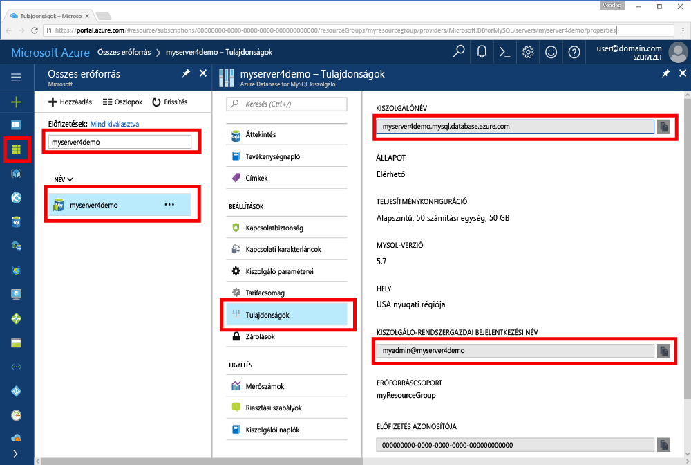

# <a name="azure-database-for-mysql-use-go-language-tooconnect-and-query-data"></a>MySQL az Azure-adatbázishoz: nyelvi tooconnect és lekérdezési adatok használata nyissa meg
A gyors üzembe helyezés bemutatja, hogyan tooconnect tooan Azure adatbázis MySQL használatára vonatkozó code nyelven írt hello [lépjen](https://golang.org/) Windows, az Ubuntu Linux és az Apple macOS platformok nyelvet. Azt illusztrálja, hogyan toouse SQL utasítás tooquery beszúrási, frissítési és törlési hello adatbázis adatait. Ez a cikk feltételezi, hogy jártas használatával nyissa meg, azonban, hogy új tooworking MySQL az Azure-adatbázissal.

## <a name="prerequisites"></a>Előfeltételek
A gyors üzembe helyezés kiindulási pontként ezek az útmutatók valamelyikével létrehozott hello erőforrást használ:
- [Azure-adatbázis létrehozása MySQL-kiszolgálóhoz az Azure Portal használatával](./quickstart-create-mysql-server-database-using-azure-portal.md)
- [Azure-adatbázis létrehozása MySQL-kiszolgálóhoz az Azure CLI használatával](./quickstart-create-mysql-server-database-using-azure-cli.md)

## <a name="install-go-and-mysql-connector"></a>A Go és a MySQL-összekötő telepítése
Telepítse [lépjen](https://golang.org/doc/install) és hello [Ugrás-sql-illesztőprogramját MySQL](https://github.com/go-sql-driver/mysql#installation) a saját számítógépén. Attól függően, hogy a platform a hello lépésekkel:

### <a name="windows"></a>Windows
1. [Töltse le](https://golang.org/dl/) és nyissa meg a Microsoft Windows toohello szerint telepítse [telepítési utasításokat](https://golang.org/doc/install).
2. Indítsa el a parancssor hello hello start menüből.
3. Hozzon létre egy mappát a projekt számára, például `mkdir  %USERPROFILE%\go\src\mysqlgo`.
4. Például módosítsa a könyvtárat hello projekt mappába `cd %USERPROFILE%\go\src\mysqlgo`.
5. Állítsa be a hello környezeti változó GOPATH kód toopoint toohello forráskönyvtár keresése. `set GOPATH=%USERPROFILE%\go`.
6. Telepítse a hello [nyissa meg az sql-illesztőprogram a mysql](https://github.com/go-sql-driver/mysql#installation) hello futtatásával `go get github.com/go-sql-driver/mysql` parancs.

   Összefoglalva nyissa meg telepítette, akkor a hello parancssorban futtassa az alábbi parancsokat:
   ```cmd
   mkdir  %USERPROFILE%\go\src\mysqlgo
   cd %USERPROFILE%\go\src\mysqlgo
   set GOPATH=%USERPROFILE%\go
   go get github.com/go-sql-driver/mysql
   ```

### <a name="linux-ubuntu"></a>Linux (Ubuntu)
1. Indítsa el a hello Bash rendszerhéjat. 
2. Telepítse a Go-t a `sudo apt-get install golang-go` parancs futtatásával.
3. Hozzon létre egy mappát a projekt számára a kezdőkönyvtárban (például `mkdir -p ~/go/src/mysqlgo/`).
4. Például módosítsa a könyvtárat hello mappába `cd ~/go/src/mysqlgo/`.
5. Set hello GOPATH környezeti változó toopoint tooa érvényes forrás címtár, például az aktuális otthoni könyvtár mappában nyissa meg. Hello rendszerhéjakba, futni `export GOPATH=~/go` tooadd hello GOPATH hello hello aktuális rendszerhéj munkamenetet, nyissa meg könyvtár.
6. Telepítse a hello [nyissa meg az sql-illesztőprogram a mysql](https://github.com/go-sql-driver/mysql#installation) hello futtatásával `go get github.com/go-sql-driver/mysql` parancs.

   Összefoglalva, futtassa ezeket a bash-parancsokat:
   ```bash
   sudo apt-get install golang-go
   mkdir -p ~/go/src/mysqlgo/
   cd ~/go/src/mysqlgo/
   export GOPATH=~/go/
   go get github.com/go-sql-driver/mysql
   ```

### <a name="apple-macos"></a>Apple macOS
1. Töltse le és telepítse a Go szerint toohello [telepítési utasításokat](https://golang.org/doc/install) a platformhoz megfelelő. 
2. Indítsa el a hello Bash rendszerhéjat. 
3. Hozzon létre egy mappát a projekt számára a kezdőkönyvtárban (például `mkdir -p ~/go/src/mysqlgo/`).
4. Például módosítsa a könyvtárat hello mappába `cd ~/go/src/mysqlgo/`.
5. Set hello GOPATH környezeti változó toopoint tooa érvényes forrás címtár, például az aktuális otthoni könyvtár mappában nyissa meg. Hello rendszerhéjakba, futni `export GOPATH=~/go` tooadd hello GOPATH hello hello aktuális rendszerhéj munkamenetet, nyissa meg könyvtár.
6. Telepítse a hello [nyissa meg az sql-illesztőprogram a mysql](https://github.com/go-sql-driver/mysql#installation) hello futtatásával `go get github.com/go-sql-driver/mysql` parancs.

   Összefoglalva, telepítse a Go-t, majd futtassa ezeket a bash-parancsokat:
   ```bash
   mkdir -p ~/go/src/mysqlgo/
   cd ~/go/src/mysqlgo/
   export GOPATH=~/go/
   go get github.com/go-sql-driver/mysql
   ```

## <a name="get-connection-information"></a>Kapcsolatadatok lekérése
MySQL hello kapcsolat szükséges információkat tooconnect toohello Azure adatbázis beolvasása. Teljesen minősített kiszolgáló nevét és a bejelentkezési hitelesítő adatokat hello van szüksége.

1. Jelentkezzen be toohello [Azure-portálon](https://portal.azure.com/).
2. A hello Azure-portálon a bal oldali menüből, kattintson az **összes erőforrás** , és keresse meg rendelkezik gyűrött, például a hello kiszolgáló **myserver4demo**.
3. Hello kiszolgáló nevére kattint **myserver4demo**.
4. Jelölje be hello server **tulajdonságok** lap. Jegyezze fel a hello **kiszolgálónév** és **kiszolgálói rendszergazda bejelentkezési név**.
 
5. Ha elfelejti a kiszolgálói bejelentkezési adatok, keresse meg a toohello **áttekintése** tooview hello kiszolgálói rendszergazda bejelentkezési név lapon, és ha szükséges, állítsa vissza a hello jelszót.
   

## <a name="build-and-run-go-code"></a>Go kód felépítése és futtatása 
1. toowrite Golang kódot, használhatja egy egyszerű szövegszerkesztőben, például a Jegyzettömbben a Microsoft Windows [vi](http://manpages.ubuntu.com/manpages/xenial/man1/nvi.1.html#contenttoc5) vagy [Nano](https://www.nano-editor.org/) Ubuntu, vagy a macOS TextEdit. Ha a funkciógazdagabb interaktív fejlesztési környezeteket (IDE-ket) részesít előnyben, próbálja ki a Jetbrains [Gogland](https://www.jetbrains.com/go/) a Microsoft [Visual Studio Code](https://code.visualstudio.com/) vagy az [Atom](https://atom.io/) eszközt.
2. Illessze be a hello hello szakaszokat kódot nyissa meg a szövegfájlok, és mentse a projekt mappába kiterjesztésű \*.go, például a Windows útvonalhoz `%USERPROFILE%\go\src\mysqlgo\createtable.go` vagy Linux elérési `~/go/src/mysqlgo/createtable.go`.
3. Keresse meg a hello `HOST`, `DATABASE`, `USER`, és `PASSWORD` konstansok hello kódot, és a név felülírandó hello példaértékeket a saját értékekkel. 
4. Indítsa el a hello parancssort, vagy a bash rendszerhéjat. Lépjen a projektmappára. Windows rendszer például a következővel: `cd %USERPROFILE%\go\src\mysqlgo\`. Linuxon: `cd ~/go/src/mysqlgo/`.  Néhány hello IDE szerkesztők említett ajánlatot hibakeresési és futásidejű képességek anélkül, hogy a rendszerhéj-parancsok.
5. A kódra hello hello parancs beírásával `go run createtable.go` toocompile hello alkalmazást, és futtassa azt. 
6. Másik lehetőségként toobuild hello kód natív alkalmazásba `go build createtable.go`, majd indítsa el `createtable.exe` toorun hello alkalmazás.

## <a name="connect-create-table-and-insert-data"></a>Csatlakozás, táblák létrehozása és adatok beszúrása
Használja hello alábbi tooconnect toohello server code, hozzon létre egy táblát, és hello használatával végzett betölteni egy **BESZÚRÁSA** SQL-utasításban. 

hello kód importálja három csomagot: hello [sql csomag](https://golang.org/pkg/database/sql/), hello [mysql nyissa meg az sql-illesztőprogramját](https://github.com/go-sql-driver/mysql#installation) , egy illesztőprogram toocommunicate hello MySQL az Azure-adatbázis és hello [fmt csomag](https://golang.org/pkg/fmt/)nyomtatott bemeneti és kimeneti hello parancssorban.

hello kód metódus meghívja [sql. Open()](http://go-database-sql.org/accessing.html) tooconnect tooAzure MySQL és az ellenőrzések hello kapcsolat metódussal adatbázis [db. Ping()](https://golang.org/pkg/database/sql/#DB.Ping). A [adatbázis-leíró](https://golang.org/pkg/database/sql/#DB) használja a rendszer keresztül, hello kapcsolatkészlet hello adatbázis-kiszolgáló rendelkezik. hello kód hívások hello [Exec()](https://golang.org/pkg/database/sql/#DB.Exec) metódus többször toorun több DDL-parancsok. hello kódot is használ hello [Prepare()](http://go-database-sql.org/prepared.html) és Exec() toorun előkészített utasítás eltérő paraméterekkel rendelkező tooinsert három sort. Minden alkalommal, amikor egy egyéni checkError() módszer esetén használt toocheck hiba történt, és tooexit vészhelyzeti.

Cserélje le a hello `host`, `database`, `user`, és `password` állandók saját értékekkel. 

```Go
package main

import (
    "database/sql"
    "fmt"

    _ "github.com/go-sql-driver/mysql"
)

const (
    host     = "myserver4demo.mysql.database.azure.com"
    database = "quickstartdb"
    user     = "myadmin@myserver4demo"
    password = "yourpassword"
)

func checkError(err error) {
    if err != nil {
        panic(err)
    }
}

func main() {

    // Initialize connection string.
    var connectionString = fmt.Sprintf("%s:%s@tcp(%s:3306)/%s?allowNativePasswords=true", user, password, host, database)

    // Initialize connection object.
    db, err := sql.Open("mysql", connectionString)
    checkError(err)
    defer db.Close()

    err = db.Ping()
    checkError(err)
    fmt.Println("Successfully created connection toodatabase.")

    // Drop previous table of same name if one exists.
    _, err = db.Exec("DROP TABLE IF EXISTS inventory;")
    checkError(err)
    fmt.Println("Finished dropping table (if existed).")

    // Create table.
    _, err = db.Exec("CREATE TABLE inventory (id serial PRIMARY KEY, name VARCHAR(50), quantity INTEGER);")
    checkError(err)
    fmt.Println("Finished creating table.")

    // Insert some data into table.
    sqlStatement, err := db.Prepare("INSERT INTO inventory (name, quantity) VALUES (?, ?);")
    res, err := sqlStatement.Exec("banana", 150)
    checkError(err)
    rowCount, err := res.RowsAffected()
    fmt.Printf("Inserted %d row(s) of data.\n", rowCount)

    res, err = sqlStatement.Exec("orange", 154)
    checkError(err)
    rowCount, err = res.RowsAffected()
    fmt.Printf("Inserted %d row(s) of data.\n", rowCount)

    res, err = sqlStatement.Exec("apple", 100)
    checkError(err)
    rowCount, err = res.RowsAffected()
    fmt.Printf("Inserted %d row(s) of data.\n", rowCount)
    fmt.Println("Done.")
}

```

## <a name="read-data"></a>Adatok olvasása
Használjon hello alábbi code tooconnect, és hello adatok segítségével olvassa a **kiválasztása** SQL-utasításban. 

hello kód importálja három csomagot: hello [sql csomag](https://golang.org/pkg/database/sql/), hello [mysql nyissa meg az sql-illesztőprogramját](https://github.com/go-sql-driver/mysql#installation) , egy illesztőprogram toocommunicate hello MySQL az Azure-adatbázis és hello [fmt csomag](https://golang.org/pkg/fmt/)nyomtatott bemeneti és kimeneti hello parancssorban.

hello kód metódus meghívja [sql. Open()](http://go-database-sql.org/accessing.html) tooconnect tooAzure MySQL és az ellenőrzések hello kapcsolat metódussal adatbázis [db. Ping()](https://golang.org/pkg/database/sql/#DB.Ping). A [adatbázis-leíró](https://golang.org/pkg/database/sql/#DB) használja a rendszer keresztül, hello kapcsolatkészlet hello adatbázis-kiszolgáló rendelkezik. hello kód hívások hello [Query()](https://golang.org/pkg/database/sql/#DB.Query) metódus toorun hello kijelölési parancs. Majd futása [Next()](https://golang.org/pkg/database/sql/#Rows.Next) keresztül hello eredménykészlet tooiterate és [Scan()](https://golang.org/pkg/database/sql/#Rows.Scan) tooparse hello oszlop értékek, a változók hello érték mentése. Minden alkalommal, amikor egy egyéni checkError() módszer esetén használt toocheck hiba történt, és tooexit vészhelyzeti.

Cserélje le a hello `host`, `database`, `user`, és `password` állandók saját értékekkel. 

```Go
package main

import (
    "database/sql"
    "fmt"

    _ "github.com/go-sql-driver/mysql"
)

const (
    host     = "myserver4demo.mysql.database.azure.com"
    database = "quickstartdb"
    user     = "myadmin@myserver4demo"
    password = "yourpassword"
)

func checkError(err error) {
    if err != nil {
        panic(err)
    }
}

func main() {

    // Initialize connection string.
    var connectionString = fmt.Sprintf("%s:%s@tcp(%s:3306)/%s?allowNativePasswords=true", user, password, host, database)

    // Initialize connection object.
    db, err := sql.Open("mysql", connectionString)
    checkError(err)
    defer db.Close()

    err = db.Ping()
    checkError(err)
    fmt.Println("Successfully created connection toodatabase.")

    // Variables for printing column data when scanned.
    var (
        id       int
        name     string
        quantity int
    )

    // Read some data from hello table.
    rows, err := db.Query("SELECT id, name, quantity from inventory;")
    checkError(err)
    defer rows.Close()
    fmt.Println("Reading data:")
    for rows.Next() {
        err := rows.Scan(&id, &name, &quantity)
        checkError(err)
        fmt.Printf("Data row = (%d, %s, %d)\n", id, name, quantity)
    }
    err = rows.Err()
    checkError(err)
    fmt.Println("Done.")
}
```

## <a name="update-data"></a>Adatok frissítése
Használjon hello következő code tooconnect, és frissítse a hello adatok segítségével egy **frissítése** SQL-utasításban. 

hello kód importálja három csomagot: hello [sql csomag](https://golang.org/pkg/database/sql/), hello [mysql nyissa meg az sql-illesztőprogramját](https://github.com/go-sql-driver/mysql#installation) , egy illesztőprogram toocommunicate hello MySQL az Azure-adatbázis és hello [fmt csomag](https://golang.org/pkg/fmt/)nyomtatott bemeneti és kimeneti hello parancssorban.

hello kód metódus meghívja [sql. Open()](http://go-database-sql.org/accessing.html) tooconnect tooAzure MySQL és az ellenőrzések hello kapcsolat metódussal adatbázis [db. Ping()](https://golang.org/pkg/database/sql/#DB.Ping). A [adatbázis-leíró](https://golang.org/pkg/database/sql/#DB) használja a rendszer keresztül, hello kapcsolatkészlet hello adatbázis-kiszolgáló rendelkezik. hello kód hívások hello [Exec()](https://golang.org/pkg/database/sql/#DB.Exec) metódus toorun hello frissítés parancsot. Minden alkalommal, amikor egy egyéni checkError() módszer esetén használt toocheck hiba történt, és tooexit vészhelyzeti.

Cserélje le a hello `host`, `database`, `user`, és `password` állandók saját értékekkel. 

```Go
package main

import (
    "database/sql"
    "fmt"

    _ "github.com/go-sql-driver/mysql"
)

const (
    host     = "myserver4demo.mysql.database.azure.com"
    database = "quickstartdb"
    user     = "myadmin@myserver4demo"
    password = "yourpassword"
)

func checkError(err error) {
    if err != nil {
        panic(err)
    }
}

func main() {

    // Initialize connection string.
    var connectionString = fmt.Sprintf("%s:%s@tcp(%s:3306)/%s?allowNativePasswords=true", user, password, host, database)

    // Initialize connection object.
    db, err := sql.Open("mysql", connectionString)
    checkError(err)
    defer db.Close()

    err = db.Ping()
    checkError(err)
    fmt.Println("Successfully created connection toodatabase.")

    // Modify some data in table.
    rows, err := db.Exec("UPDATE inventory SET quantity = ? WHERE name = ?", 200, "banana")
    checkError(err)
    rowCount, err := rows.RowsAffected()
    fmt.Printf("Deleted %d row(s) of data.\n", rowCount)
    fmt.Println("Done.")
}
```

## <a name="delete-data"></a>Adat törlése
Használjon hello alábbi code tooconnect, és távolítsa el az adatokat egy **törlése** SQL-utasításban. 

hello kód importálja három csomagot: hello [sql csomag](https://golang.org/pkg/database/sql/), hello [mysql nyissa meg az sql-illesztőprogramját](https://github.com/go-sql-driver/mysql#installation) , egy illesztőprogram toocommunicate hello MySQL az Azure-adatbázis és hello [fmt csomag](https://golang.org/pkg/fmt/)nyomtatott bemeneti és kimeneti hello parancssorban.

hello kód metódus meghívja [sql. Open()](http://go-database-sql.org/accessing.html) tooconnect tooAzure MySQL és az ellenőrzések hello kapcsolat metódussal adatbázis [db. Ping()](https://golang.org/pkg/database/sql/#DB.Ping). A [adatbázis-leíró](https://golang.org/pkg/database/sql/#DB) használja a rendszer keresztül, hello kapcsolatkészlet hello adatbázis-kiszolgáló rendelkezik. hello kód hívások hello [Exec()](https://golang.org/pkg/database/sql/#DB.Exec) metódus toorun hello törlése paranccsal. Minden alkalommal, amikor egy egyéni checkError() módszer esetén használt toocheck hiba történt, és tooexit vészhelyzeti.

Cserélje le a hello `host`, `database`, `user`, és `password` állandók saját értékekkel. 

```Go
package main

import (
    "database/sql"
    "fmt"
    _ "github.com/go-sql-driver/mysql"
)

const (
    host     = "myserver4demo.mysql.database.azure.com"
    database = "quickstartdb"
    user     = "myadmin@myserver4demo"
    password = "yourpassword"
)

func checkError(err error) {
    if err != nil {
        panic(err)
    }
}

func main() {

    // Initialize connection string.
    var connectionString = fmt.Sprintf("%s:%s@tcp(%s:3306)/%s?allowNativePasswords=true", user, password, host, database)

    // Initialize connection object.
    db, err := sql.Open("mysql", connectionString)
    checkError(err)
    defer db.Close()

    err = db.Ping()
    checkError(err)
    fmt.Println("Successfully created connection toodatabase.")

    // Modify some data in table.
    rows, err := db.Exec("DELETE FROM inventory WHERE name = ?", "orange")
    checkError(err)
    rowCount, err := rows.RowsAffected()
    fmt.Printf("Deleted %d row(s) of data.\n", rowCount)
    fmt.Println("Done.")
}
```

## <a name="next-steps"></a>Következő lépések
> [!div class="nextstepaction"]
> [Adatbázis migrálása exportálással és importálással](./concepts-migrate-import-export.md)
