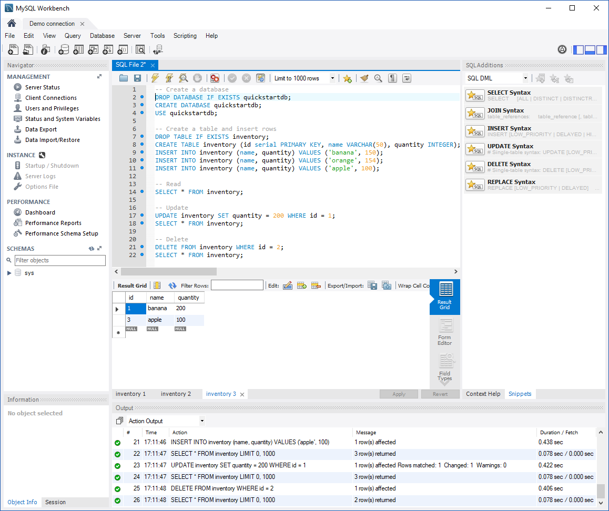

# <a name="azure-database-for-mysql-use-mysql-workbench-tooconnect-and-query-data"></a>MySQL az Azure-adatbázishoz: használata MySQL munkaterület tooconnect és lekérdezési adatok
A gyors üzembe helyezés bemutatja, hogyan tooconnect tooan Azure adatbázis MySQL használatára vonatkozó hello MySQL munkaterület alkalmazás. 

## <a name="prerequisites"></a>Előfeltételek
A gyors üzembe helyezés kiindulási pontként ezek az útmutatók valamelyikével létrehozott hello erőforrást használ:
- [Azure-adatbázis létrehozása MySQL-kiszolgálóhoz az Azure Portal használatával](./quickstart-create-mysql-server-database-using-azure-portal.md)
- [Azure-adatbázis létrehozása MySQL-kiszolgálóhoz az Azure CLI használatával](./quickstart-create-mysql-server-database-using-azure-cli.md)

## <a name="install-mysql-workbench"></a>Telepítse a MySQL munkaterület
Töltse le és telepítse a MySQL munkaterület a számítógépen található [hello MySQL webhely](https://dev.mysql.com/downloads/workbench/).

## <a name="get-connection-information"></a>Kapcsolatadatok lekérése
MySQL hello kapcsolat szükséges információkat tooconnect toohello Azure adatbázis beolvasása. Teljesen minősített kiszolgáló nevét és a bejelentkezési hitelesítő adatokat hello van szüksége.

1. Jelentkezzen be toohello [Azure-portálon](https://portal.azure.com/).

2. A hello Azure-portálon a bal oldali menüből, kattintson az **összes erőforrás** , és keressen a létrehozott, például a hello server **myserver4demo**.

3. Hello kiszolgáló nevére kattint.

4. Jelölje be hello server **tulajdonságok** lap. Jegyezze fel a hello **kiszolgálónév** és **kiszolgálói rendszergazda bejelentkezési név**.

 
 
5. Ha elfelejti a kiszolgálói bejelentkezési adatok, keresse meg a toohello **áttekintése** tooview hello kiszolgálói rendszergazda bejelentkezési név lapon, és ha szükséges, állítsa vissza a hello jelszót.

## <a name="connect-toohello-server-using-mysql-workbench"></a>Csatlakoztassa a kiszolgálót MySQL munkaterület használatával toohello 
tooconnect tooAzure MySQL kiszolgáló grafikus felhasználói Felülettel hello eszközzel MySQL-munkaterületet:

1.  Indítsa el a hello MySQL munkaterület alkalmazás a számítógépre. 

2.  A **új kapcsolat beállítása** párbeszédpanelen adja meg a következő információ a hello hello **paraméterek** lapon:

    

    | **Beállítás** | **Ajánlott érték** | **Mező leírása** |
    |---|---|---|
    |   Kapcsolat neve | Bemutató kapcsolat | Adjon meg egy címkét a kapcsolathoz. |
    | Kapcsolati módszer | Standard (TCP/IP) | A Standard (TCP/IP) elégséges. |
    | Gazdanév | *kiszolgáló neve* | Adja meg a hello kiszolgálónév hello Azure adatbázis MySQL a korábban létrehozott használt. Az itt látható példakiszolgáló a myserver4demo.mysql.database.azure.com. Hello teljesen minősített tartománynevét használja (\*. mysql.database.azure.com) hello példában látható módon. Kövesse hello hello előző szakasz tooget hello kapcsolati adatokat, ha nem emlékszik a kiszolgáló nevét.  |
    | Port | 3306 | Mindig használjon port 3306 MySQL adatbázis tooAzure kapcsolódáskor. |
    | Felhasználónév |  *kiszolgáló-rendszergazdai bejelentkezési név* | Írja be a hello server admin bejelentkezési felhasználónevének megadni, ha az Azure-adatbázis hello MySQL a korábban létrehozott. A példában szereplő felhasználónév a következő: myadmin@myserver4demo. Ha nem emlékszik hello felhasználónév, kövesse a hello előző szakasz tooget hello kapcsolatadatok hello lépéseit. hello formátuma  *username@servername* .
    | Jelszó | az ön jelszava | Kattintson a **Store tárolóban...**  gomb toosave hello jelszót. |

3.   Kattintson a **kapcsolat tesztelése** tootest, ha az összes paraméter megfelelően vannak konfigurálva. 

4.   Kattintson a **OK** toosave hello kapcsolat. 

5.   A hello listája **MySQL kapcsolatok**, hello megfelelő tooyour mozaikkiszolgálóról kattintson, majd várja meg a létrehozott hello kapcsolat toobe.

6.   Új SQL lapon nyílik meg egy üres szerkesztő, ahová beírhatja a lekérdezéseket.

    > [!NOTE]
    > Alapértelmezés szerint az SSL-kapcsolat biztonsági szükséges, és a MySQL-kiszolgálóhoz tartozó Azure-adatbázis érvényes. Általában nem SSL-tanúsítványokkal nincs szükség további konfigurációra MySQL munkaterület tooconnect tooyour kiszolgáló. Az SSL további információkért lásd: [konfigurálása az SSL-kapcsolat az alkalmazás toosecurely a MySQL adatbázis tooAzure kapcsolati](./howto-configure-ssl.md).  Ha toodisable SSL van szüksége, látogasson el a hello Azure-portálon, és kattintson hello kapcsolat biztonsági lap toodisable hello kényszerítése SSL kapcsolat váltása gombra.

## <a name="create-a-table-insert-data-read-data-update-data-delete-data"></a>Hozzon létre egy táblát, adatokat beszúrni, olvassa el az adatok, adatainak frissítése, adatok törlése
1. Másolja és mintakódot hello SQL egy üres SQL lapon tooillustrate néhány adatot.

    Ez a kód egy quickstartdb nevű üres adatbázist hoz létre, és majd a készlet nevű minta táblázat létrehozása. Néhány sor beszúrása, majd hello sorok beolvasása. Módosítja az update utasításban hello adatok, és olvasási műveletek hello sorok újra. Végül azt töröl egy sort, és olvassa be újra hello sorokat.
    
    ```sql
    -- Create a database
    -- DROP DATABASE IF EXISTS quickstartdb;
    CREATE DATABASE quickstartdb;
    USE quickstartdb;
    
    -- Create a table and insert rows
    DROP TABLE IF EXISTS inventory;
    CREATE TABLE inventory (id serial PRIMARY KEY, name VARCHAR(50), quantity INTEGER);
    INSERT INTO inventory (name, quantity) VALUES ('banana', 150);
    INSERT INTO inventory (name, quantity) VALUES ('orange', 154);
    INSERT INTO inventory (name, quantity) VALUES ('apple', 100);
    
    -- Read
    SELECT * FROM inventory;
    
    -- Update
    UPDATE inventory SET quantity = 200 WHERE id = 1;
    SELECT * FROM inventory;
    
    -- Delete
    DELETE FROM inventory WHERE id = 2;
    SELECT * FROM inventory;
    ```

    képernyőfelvétel a hello szemléltet hello SQL-kódot SQL munkaterület és hello kimenet után futott.
    
    

2. toorun hello minta SQL-kódot, kattintson a hello hello eszköztárán bolt ikonra könnyítve hello **SQL fájl** fülre.
3. Figyelje meg, hello három lapokra eredményez hello **eredmény rács** hello lap hello középső részében. 
4. Értesítés hello **kimeneti** lista alján hello hello. az egyes parancsok hello állapota jelenik meg. 

Most akkor tooAzure adatbázis csatlakozott a MySQL MySQL munkaterület használatával, és felhasználói adatok hello SQL-nyelv használatával.

## <a name="next-steps"></a>Következő lépések
> [!div class="nextstepaction"]
> [Adatbázis migrálása exportálással és importálással](./concepts-migrate-import-export.md)
