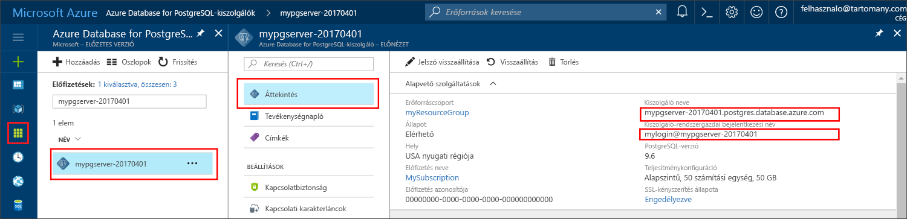

# <a name="azure-database-for-postgresql-use-net-c-tooconnect-and-query-data"></a><span data-ttu-id="69785-103">Azure PostgreSQL-adatbázishoz: használata .NET (C#) tooconnect és lekérdezési adatok</span><span class="sxs-lookup"><span data-stu-id="69785-103">Azure Database for PostgreSQL: Use .NET (C#) tooconnect and query data</span></span>
<span data-ttu-id="69785-104">A gyors üzembe helyezés bemutatja, hogyan tooconnect tooan Azure adatbázis a PostgreSQL C#-alkalmazás használatával.</span><span class="sxs-lookup"><span data-stu-id="69785-104">This quickstart demonstrates how tooconnect tooan Azure Database for PostgreSQL using a C# application.</span></span> <span data-ttu-id="69785-105">Azt illusztrálja, hogyan toouse SQL utasítás tooquery beszúrási, frissítési és törlési hello adatbázis adatait.</span><span class="sxs-lookup"><span data-stu-id="69785-105">It shows how toouse SQL statements tooquery, insert, update, and delete data in hello database.</span></span> <span data-ttu-id="69785-106">hello cikkben leírt lépések azt feltételezik, hogy ismeri a C# használatával történő fejlesztéséhez, és, hogy-e új tooworking PostgreSQL az Azure-adatbázissal.</span><span class="sxs-lookup"><span data-stu-id="69785-106">hello steps in this article assume that you are familiar with developing using C#, and that you are new tooworking with Azure Database for PostgreSQL.</span></span>

## <a name="prerequisites"></a><span data-ttu-id="69785-107">Előfeltételek</span><span class="sxs-lookup"><span data-stu-id="69785-107">Prerequisites</span></span>
<span data-ttu-id="69785-108">A gyors üzembe helyezés kiindulási pontként ezek az útmutatók valamelyikével létrehozott hello erőforrást használ:</span><span class="sxs-lookup"><span data-stu-id="69785-108">This quickstart uses hello resources created in either of these guides as a starting point:</span></span>
- [<span data-ttu-id="69785-109">DB létrehozása – portál</span><span class="sxs-lookup"><span data-stu-id="69785-109">Create DB - Portal</span></span>](quickstart-create-server-database-portal.md)
- [<span data-ttu-id="69785-110">DB létrehozása – CLI</span><span class="sxs-lookup"><span data-stu-id="69785-110">Create DB - CLI</span></span>](quickstart-create-server-database-azure-cli.md)

<span data-ttu-id="69785-111">Emellett a következőket kell elvégezni:</span><span class="sxs-lookup"><span data-stu-id="69785-111">You also need to:</span></span>
- <span data-ttu-id="69785-112">Telepítse a [.NET-keretrendszert](https://www.microsoft.com/net/download).</span><span class="sxs-lookup"><span data-stu-id="69785-112">Install [.NET Framework](https://www.microsoft.com/net/download).</span></span> <span data-ttu-id="69785-113">Kövesse hello kapcsolódó hello cikk tooinstall .NET kimondottan a platform (Windows, Ubuntu Linux vagy macOS).</span><span class="sxs-lookup"><span data-stu-id="69785-113">Follow hello steps in hello linked article tooinstall .NET specifically for your platform (Windows, Ubuntu Linux, or macOS).</span></span> 
- <span data-ttu-id="69785-114">Telepítés [Visual Studio](https://www.visualstudio.com/downloads/) vagy a Visual Studio Code tootype és Szerkesztés kódot.</span><span class="sxs-lookup"><span data-stu-id="69785-114">Install [Visual Studio](https://www.visualstudio.com/downloads/) or Visual Studio Code tootype and edit code.</span></span>
- <span data-ttu-id="69785-115">Telepítse az [Npgsql](http://www.npgsql.org/doc/index.html) könyvtárat az alábbiakban leírtak szerint.</span><span class="sxs-lookup"><span data-stu-id="69785-115">Install [Npgsql](http://www.npgsql.org/doc/index.html) library as described below.</span></span>

## <a name="install-npgsql-references-into-your-visual-studio-solution"></a><span data-ttu-id="69785-116">Telepítse az Npgsql-hivatkozásokat Visual Studio megoldásába</span><span class="sxs-lookup"><span data-stu-id="69785-116">Install Npgsql references into your Visual Studio solution</span></span>
<span data-ttu-id="69785-117">a C# alkalmazás tooPostgreSQL, hello tooconnect hello nyílt forráskódú ADO.NET könyvtár Npgsql nevű használatára.</span><span class="sxs-lookup"><span data-stu-id="69785-117">tooconnect from hello C# application tooPostgreSQL, use hello open source ADO.NET library called Npgsql.</span></span> <span data-ttu-id="69785-118">NuGet segítségével töltse le és könnyen kezelése hello hivatkozik.</span><span class="sxs-lookup"><span data-stu-id="69785-118">NuGet helps download and manage hello references easily.</span></span>

1. <span data-ttu-id="69785-119">Hozzon létre egy új C#-megoldást, vagy nyisson meg egy meglévőt:</span><span class="sxs-lookup"><span data-stu-id="69785-119">Create a new C# solution, or open an existing one:</span></span> 
   - <span data-ttu-id="69785-120">A Visual Studióban hozzon létre egy megoldást a Fájl menü **Új** > **Projekt** parancsára kattintva.</span><span class="sxs-lookup"><span data-stu-id="69785-120">Within Visual Studio, create a solution, by clicking File menu **New** > **Project**.</span></span>
   - <span data-ttu-id="69785-121">Új projekt párbeszéd hello, bontsa ki **sablonok** > **Visual C#**.</span><span class="sxs-lookup"><span data-stu-id="69785-121">In hello New Project dialogue, expand **Templates** > **Visual C#**.</span></span> 
   - <span data-ttu-id="69785-122">Válasszon egy megfelelő sablont, például **Konzolalkalmazás (.NET Core)**.</span><span class="sxs-lookup"><span data-stu-id="69785-122">Choose an appropriate template such as **Console App (.NET Core)**.</span></span>

2. <span data-ttu-id="69785-123">Nuget-Csomagkezelő tooinstall Npgsql hello használata:</span><span class="sxs-lookup"><span data-stu-id="69785-123">Use hello Nuget Package Manager tooinstall Npgsql:</span></span>
   - <span data-ttu-id="69785-124">Kattintson a hello **eszközök** menü > **NuGet-Csomagkezelő** > **Csomagkezelő konzol**.</span><span class="sxs-lookup"><span data-stu-id="69785-124">Click hello **Tools** menu > **NuGet Package Manager** > **Package Manager Console**.</span></span>
   - <span data-ttu-id="69785-125">A hello **Csomagkezelő konzol**, típusa`Install-Package Npgsql`</span><span class="sxs-lookup"><span data-stu-id="69785-125">In hello **Package Manager Console**, type `Install-Package Npgsql`</span></span>
   - <span data-ttu-id="69785-126">hello parancs letöltések hello Npgsql.dll és a kapcsolódó szerelvények telepítése, és hozzáadja őket szerint függőségeinek hello megoldásban.</span><span class="sxs-lookup"><span data-stu-id="69785-126">hello install command downloads hello Npgsql.dll and related assemblies and adds them as dependencies in hello solution.</span></span>

## <a name="get-connection-information"></a><span data-ttu-id="69785-127">Kapcsolatadatok lekérése</span><span class="sxs-lookup"><span data-stu-id="69785-127">Get connection information</span></span>
<span data-ttu-id="69785-128">Hello kapcsolat szükséges információkat tooconnect toohello Azure adatbázis beolvasása PostgreSQL.</span><span class="sxs-lookup"><span data-stu-id="69785-128">Get hello connection information needed tooconnect toohello Azure Database for PostgreSQL.</span></span> <span data-ttu-id="69785-129">Teljesen minősített kiszolgáló nevét és a bejelentkezési hitelesítő adatokat hello van szüksége.</span><span class="sxs-lookup"><span data-stu-id="69785-129">You need hello fully qualified server name and login credentials.</span></span>

1. <span data-ttu-id="69785-130">Jelentkezzen be toohello [Azure-portálon](https://portal.azure.com/).</span><span class="sxs-lookup"><span data-stu-id="69785-130">Log in toohello [Azure portal](https://portal.azure.com/).</span></span>
2. <span data-ttu-id="69785-131">A hello Azure-portálon a bal oldali menüből, kattintson az **összes erőforrás** , és keressen a létrehozott, például a hello server **mypgserver-20170401**.</span><span class="sxs-lookup"><span data-stu-id="69785-131">From hello left-hand menu in Azure portal, click **All resources** and search for hello server you have created, such as **mypgserver-20170401**.</span></span>
3. <span data-ttu-id="69785-132">Hello kiszolgáló nevére kattint **mypgserver-20170401**.</span><span class="sxs-lookup"><span data-stu-id="69785-132">Click hello server name **mypgserver-20170401**.</span></span>
4. <span data-ttu-id="69785-133">Jelölje be hello server **áttekintése** lap.</span><span class="sxs-lookup"><span data-stu-id="69785-133">Select hello server's **Overview** page.</span></span> <span data-ttu-id="69785-134">Jegyezze fel a hello **kiszolgálónév** és **kiszolgálói rendszergazda bejelentkezési név**.</span><span class="sxs-lookup"><span data-stu-id="69785-134">Make a note of hello **Server name** and **Server admin login name**.</span></span>
 <span data-ttu-id="69785-135"></span><span class="sxs-lookup"><span data-stu-id="69785-135"></span></span>
5. <span data-ttu-id="69785-136">Ha elfelejti a kiszolgálói bejelentkezési adatok, keresse meg a toohello **áttekintése** tooview hello kiszolgálói rendszergazda bejelentkezési név lapon, és ha szükséges, állítsa vissza a hello jelszót.</span><span class="sxs-lookup"><span data-stu-id="69785-136">If you forget your server login information, navigate toohello **Overview** page tooview hello Server admin login name and, if necessary, reset hello password.</span></span>

## <a name="connect-create-table-and-insert-data"></a><span data-ttu-id="69785-137">Csatlakozás, táblák létrehozása és adatok beszúrása</span><span class="sxs-lookup"><span data-stu-id="69785-137">Connect, create table, and insert data</span></span>
<span data-ttu-id="69785-138">Használjon hello következő code tooconnect, és betölti a hello használatával végzett **CREATE TABLE** és **INSERT INTO** SQL-utasításokat.</span><span class="sxs-lookup"><span data-stu-id="69785-138">Use hello following code tooconnect and load hello data using **CREATE TABLE** and  **INSERT INTO** SQL statements.</span></span> <span data-ttu-id="69785-139">hello kód módszert használ, NpgsqlCommand osztály [Open()](http://www.npgsql.org/api/Npgsql.NpgsqlConnection.html#Npgsql_NpgsqlConnection_Open) tooestablish egy kapcsolat tooPostgreSQL.</span><span class="sxs-lookup"><span data-stu-id="69785-139">hello code uses NpgsqlCommand class with method [Open()](http://www.npgsql.org/api/Npgsql.NpgsqlConnection.html#Npgsql_NpgsqlConnection_Open) tooestablish a connection tooPostgreSQL.</span></span> <span data-ttu-id="69785-140">Hello kód módszert használ majd [CreateCommand()](http://www.npgsql.org/api/Npgsql.NpgsqlConnection.html#Npgsql_NpgsqlConnection_CreateCommand)hello a CommandText tulajdonság beállítása és metódust [ExecuteNonQuery()](http://www.npgsql.org/api/Npgsql.NpgsqlCommand.html#Npgsql_NpgsqlCommand_ExecuteNonQuery) toorun hello adatbázis parancsok.</span><span class="sxs-lookup"><span data-stu-id="69785-140">Then hello code uses method [CreateCommand()](http://www.npgsql.org/api/Npgsql.NpgsqlConnection.html#Npgsql_NpgsqlConnection_CreateCommand), sets hello CommandText property, and calls method [ExecuteNonQuery()](http://www.npgsql.org/api/Npgsql.NpgsqlCommand.html#Npgsql_NpgsqlCommand_ExecuteNonQuery) toorun hello database commands.</span></span> 

<span data-ttu-id="69785-141">Cserélje le a hello gazdagép, a DBName, a felhasználó és a jelszó paraméterek hello kiszolgáló és az adatbázis létrehozásakor adott hello értékekkel.</span><span class="sxs-lookup"><span data-stu-id="69785-141">Replace hello Host, DBName, User, and Password parameters with hello values that you specified when you created hello server and database.</span></span> 

```csharp
using System;
using System.Collections.Generic;
using System.Linq;
using System.Text;
using System.Threading.Tasks;
using Npgsql;

namespace Driver
{
    public class AzurePostgresCreate
    {
        // Obtain connection string information from hello portal
        //
        private static string Host = "mypgserver-20170401.postgres.database.azure.com";
        private static string User = "mylogin@mypgserver-20170401";
        private static string DBname = "mypgsqldb";
        private static string Password = "<server_admin_password>";
        private static string Port = "5432";

        static void Main(string[] args)
        {
            // Build connection string using parameters from portal
            //
            string connString =
                String.Format(
                    "Server={0}; User Id={1}; Database={2}; Port={3}; Password={4}; SSL Mode=Prefer; Trust Server Certificate=true",
                    Host,
                    User,
                    DBname,
                    Port,
                    Password);

            var conn = new NpgsqlConnection(connString);

            Console.Out.WriteLine("Opening connection");
            conn.Open();

            var command = conn.CreateCommand();
            command.CommandText = "DROP TABLE IF EXISTS inventory;";
            command.ExecuteNonQuery();
            Console.Out.WriteLine("Finished dropping table (if existed)");

            command.CommandText = "CREATE TABLE inventory (id serial PRIMARY KEY, name VARCHAR(50), quantity INTEGER);";
            command.ExecuteNonQuery();
            Console.Out.WriteLine("Finished creating table");

            command.CommandText =
                String.Format(
                    @"
                                INSERT INTO inventory (name, quantity) VALUES ({0}, {1});
                                INSERT INTO inventory (name, quantity) VALUES ({2}, {3});
                                INSERT INTO inventory (name, quantity) VALUES ({4}, {5});
                            ",
                    "\'banana\'", 150,
                    "\'orange\'", 154,
                    "\'apple\'", 100
                    );

            int nRows = command.ExecuteNonQuery();
            Console.Out.WriteLine(String.Format("Number of rows inserted={0}", nRows));

            Console.Out.WriteLine("Closing connection");
            conn.Close();

            Console.WriteLine("Press RETURN tooexit");
            Console.ReadLine();
        }
    }
}
```

## <a name="read-data"></a><span data-ttu-id="69785-142">Adatok olvasása</span><span class="sxs-lookup"><span data-stu-id="69785-142">Read data</span></span>
<span data-ttu-id="69785-143">Használjon hello alábbi code tooconnect, és hello adatok segítségével olvassa a **kiválasztása** SQL-utasításban.</span><span class="sxs-lookup"><span data-stu-id="69785-143">Use hello following code tooconnect and read hello data using a **SELECT** SQL statement.</span></span> <span data-ttu-id="69785-144">hello kód módszert használ, NpgsqlCommand osztály [Open()](http://www.npgsql.org/api/Npgsql.NpgsqlConnection.html#Npgsql_NpgsqlConnection_Open) tooestablish egy kapcsolat tooPostgreSQL.</span><span class="sxs-lookup"><span data-stu-id="69785-144">hello code uses NpgsqlCommand class with method [Open()](http://www.npgsql.org/api/Npgsql.NpgsqlConnection.html#Npgsql_NpgsqlConnection_Open) tooestablish a connection tooPostgreSQL.</span></span> <span data-ttu-id="69785-145">Hello kód módszert használ majd [CreateCommand()](http://www.npgsql.org/api/Npgsql.NpgsqlConnection.html#Npgsql_NpgsqlConnection_CreateCommand) és metódus [ExecuteReader()](http://www.npgsql.org/api/Npgsql.NpgsqlCommand.html#Npgsql_NpgsqlCommand_ExecuteReader) toorun hello adatbázis parancsok.</span><span class="sxs-lookup"><span data-stu-id="69785-145">Then hello code uses method [CreateCommand()](http://www.npgsql.org/api/Npgsql.NpgsqlConnection.html#Npgsql_NpgsqlConnection_CreateCommand) and method [ExecuteReader()](http://www.npgsql.org/api/Npgsql.NpgsqlCommand.html#Npgsql_NpgsqlCommand_ExecuteReader) toorun hello database commands.</span></span> <span data-ttu-id="69785-146">Ezután a kódot használja hello [Read()](http://www.npgsql.org/api/Npgsql.NpgsqlDataReader.html#Npgsql_NpgsqlDataReader_Read) tooadvance toohello rögzíti a hello eredményei között.</span><span class="sxs-lookup"><span data-stu-id="69785-146">Next hello code uses [Read()](http://www.npgsql.org/api/Npgsql.NpgsqlDataReader.html#Npgsql_NpgsqlDataReader_Read) tooadvance toohello records in hello results.</span></span> <span data-ttu-id="69785-147">Hello kód használja majd [GetInt32()](http://www.npgsql.org/api/Npgsql.NpgsqlDataReader.html#Npgsql_NpgsqlDataReader_GetInt32_System_Int32_) és [GetString()](http://www.npgsql.org/api/Npgsql.NpgsqlDataReader.html#Npgsql_NpgsqlDataReader_GetString_System_Int32_) tooparse hello értékek hello rekordban.</span><span class="sxs-lookup"><span data-stu-id="69785-147">Then hello code uses [GetInt32()](http://www.npgsql.org/api/Npgsql.NpgsqlDataReader.html#Npgsql_NpgsqlDataReader_GetInt32_System_Int32_) and [GetString()](http://www.npgsql.org/api/Npgsql.NpgsqlDataReader.html#Npgsql_NpgsqlDataReader_GetString_System_Int32_) tooparse hello values in hello record.</span></span>

<span data-ttu-id="69785-148">Cserélje le a hello gazdagép, a DBName, a felhasználó és a jelszó paraméterek hello kiszolgáló és az adatbázis létrehozásakor adott hello értékekkel.</span><span class="sxs-lookup"><span data-stu-id="69785-148">Replace hello Host, DBName, User, and Password parameters with hello values that you specified when you created hello server and database.</span></span> 

```csharp
using System;
using System.Collections.Generic;
using System.Linq;
using System.Text;
using System.Threading.Tasks;
using Npgsql;

namespace Driver
{
    public class AzurePostgresRead
    {
        // Obtain connection string information from hello portal
        //
        private static string Host = "mypgserver-20170401.postgres.database.azure.com";
        private static string User = "mylogin@mypgserver-20170401";
        private static string DBname = "mypgsqldb";
        private static string Password = "<server_admin_password>";
        private static string Port = "5432";

        static void Main(string[] args)
        {
            // Build connection string using parameters from portal
            //
            string connString =
                String.Format(
                    "Server={0}; User Id={1}; Database={2}; Port={3}; Password={4};",
                    Host,
                    User,
                    DBname,
                    Port,
                    Password);

            var conn = new NpgsqlConnection(connString);

            Console.Out.WriteLine("Opening connection");
            conn.Open();

            var command = conn.CreateCommand();
            command.CommandText = "SELECT * FROM inventory;";

            var reader = command.ExecuteReader();
            while (reader.Read())
            {
                Console.WriteLine(
                    string.Format(
                        "Reading from table=({0}, {1}, {2})",
                        reader.GetInt32(0).ToString(),
                        reader.GetString(1),
                        reader.GetInt32(2).ToString()
                        )
                    );
            }

            Console.Out.WriteLine("Closing connection");
            conn.Close();

            Console.WriteLine("Press RETURN tooexit");
            Console.ReadLine();
        }
    }
}
```


## <a name="update-data"></a><span data-ttu-id="69785-149">Adatok frissítése</span><span class="sxs-lookup"><span data-stu-id="69785-149">Update data</span></span>
<span data-ttu-id="69785-150">Használjon hello alábbi code tooconnect, és olvasott hello adatok egy **frissítés** SQL-utasításban.</span><span class="sxs-lookup"><span data-stu-id="69785-150">Use hello following code tooconnect and read hello data using a **UPDATE** SQL statement.</span></span> <span data-ttu-id="69785-151">hello kód módszert használ, NpgsqlCommand osztály [Open()](http://www.npgsql.org/api/Npgsql.NpgsqlConnection.html#Npgsql_NpgsqlConnection_Open) tooestablish egy kapcsolat tooPostgreSQL.</span><span class="sxs-lookup"><span data-stu-id="69785-151">hello code uses NpgsqlCommand class with method [Open()](http://www.npgsql.org/api/Npgsql.NpgsqlConnection.html#Npgsql_NpgsqlConnection_Open) tooestablish a connection tooPostgreSQL.</span></span> <span data-ttu-id="69785-152">Hello kód módszert használ majd [CreateCommand()](http://www.npgsql.org/api/Npgsql.NpgsqlConnection.html#Npgsql_NpgsqlConnection_CreateCommand)hello a CommandText tulajdonság beállítása és metódust [ExecuteNonQuery()](http://www.npgsql.org/api/Npgsql.NpgsqlCommand.html#Npgsql_NpgsqlCommand_ExecuteNonQuery) toorun hello adatbázis parancsok.</span><span class="sxs-lookup"><span data-stu-id="69785-152">Then hello code uses method [CreateCommand()](http://www.npgsql.org/api/Npgsql.NpgsqlConnection.html#Npgsql_NpgsqlConnection_CreateCommand), sets hello CommandText property, and calls method [ExecuteNonQuery()](http://www.npgsql.org/api/Npgsql.NpgsqlCommand.html#Npgsql_NpgsqlCommand_ExecuteNonQuery) toorun hello database commands.</span></span>

<span data-ttu-id="69785-153">Cserélje le a hello gazdagép, a DBName, a felhasználó és a jelszó paraméterek hello kiszolgáló és az adatbázis létrehozásakor adott hello értékekkel.</span><span class="sxs-lookup"><span data-stu-id="69785-153">Replace hello Host, DBName, User, and Password parameters with hello values that you specified when you created hello server and database.</span></span> 

```csharp
using System;
using System.Collections.Generic;
using System.Linq;
using System.Text;
using System.Threading.Tasks;
using Npgsql;

namespace Driver
{
    public class AzurePostgresUpdate
    {
        // Obtain connection string information from hello portal
        //
        private static string Host = "mypgserver-20170401.postgres.database.azure.com";
        private static string User = "mylogin@mypgserver-20170401";
        private static string DBname = "mypgsqldb";
        private static string Password = "<server_admin_password>";
        private static string Port = "5432";

        static void Main(string[] args)
        {
            // Build connection string using parameters from portal
            //
            string connString =
                String.Format(
                    "Server={0}; User Id={1}; Database={2}; Port={3}; Password={4};",
                    Host,
                    User,
                    DBname,
                    Port,
                    Password);

            var conn = new NpgsqlConnection(connString);

            Console.Out.WriteLine("Opening connection");
            conn.Open();

            var command = conn.CreateCommand();
            command.CommandText =
            String.Format("UPDATE inventory SET quantity = {0} WHERE name = {1};",
                200,
                "\'banana\'"
                );

            int nRows = command.ExecuteNonQuery();
            Console.Out.WriteLine(String.Format("Number of rows updated={0}", nRows));

            Console.Out.WriteLine("Closing connection");
            conn.Close();

            Console.WriteLine("Press RETURN tooexit");
            Console.ReadLine();
        }
    }
}
```


## <a name="delete-data"></a><span data-ttu-id="69785-154">Adat törlése</span><span class="sxs-lookup"><span data-stu-id="69785-154">Delete data</span></span>
<span data-ttu-id="69785-155">Használjon hello alábbi code tooconnect, és olvasott hello adatok egy **törlése** SQL-utasításban.</span><span class="sxs-lookup"><span data-stu-id="69785-155">Use hello following code tooconnect and read hello data using a **DELETE** SQL statement.</span></span> 

 <span data-ttu-id="69785-156">hello kód módszert használ, NpgsqlCommand osztály [Open()](http://www.npgsql.org/api/Npgsql.NpgsqlConnection.html#Npgsql_NpgsqlConnection_Open) tooestablish egy kapcsolat tooPostgreSQL.</span><span class="sxs-lookup"><span data-stu-id="69785-156">hello code uses NpgsqlCommand class with method [Open()](http://www.npgsql.org/api/Npgsql.NpgsqlConnection.html#Npgsql_NpgsqlConnection_Open) tooestablish a connection tooPostgreSQL.</span></span> <span data-ttu-id="69785-157">Hello kód módszert használ majd [CreateCommand()](http://www.npgsql.org/api/Npgsql.NpgsqlConnection.html#Npgsql_NpgsqlConnection_CreateCommand)hello a CommandText tulajdonság beállítása és metódust [ExecuteNonQuery()](http://www.npgsql.org/api/Npgsql.NpgsqlCommand.html#Npgsql_NpgsqlCommand_ExecuteNonQuery) toorun hello adatbázis parancsok.</span><span class="sxs-lookup"><span data-stu-id="69785-157">Then hello code uses method [CreateCommand()](http://www.npgsql.org/api/Npgsql.NpgsqlConnection.html#Npgsql_NpgsqlConnection_CreateCommand), sets hello CommandText property, and calls method [ExecuteNonQuery()](http://www.npgsql.org/api/Npgsql.NpgsqlCommand.html#Npgsql_NpgsqlCommand_ExecuteNonQuery) toorun hello database commands.</span></span>

<span data-ttu-id="69785-158">Cserélje le a hello gazdagép, a DBName, a felhasználó és a jelszó paraméterek hello kiszolgáló és az adatbázis létrehozásakor adott hello értékekkel.</span><span class="sxs-lookup"><span data-stu-id="69785-158">Replace hello Host, DBName, User, and Password parameters with hello values that you specified when you created hello server and database.</span></span> 

```csharp
using System;
using System.Collections.Generic;
using System.Linq;
using System.Text;
using System.Threading.Tasks;
using Npgsql;

namespace Driver
{
    public class AzurePostgresDelete
    {
        // Obtain connection string information from hello portal
        //
        private static string Host = "mypgserver-20170401.postgres.database.azure.com";
        private static string User = "mylogin@mypgserver-20170401";
        private static string DBname = "mypgsqldb";
        private static string Password = "<server_admin_password>";
        private static string Port = "5432";

        static void Main(string[] args)
        {
            // Build connection string using parameters from portal
            //
            string connString =
                String.Format(
                    "Server={0}; User Id={1}; Database={2}; Port={3}; Password={4};",
                    Host,
                    User,
                    DBname,
                    Port,
                    Password);

            var conn = new NpgsqlConnection(connString);

            Console.Out.WriteLine("Opening connection");
            conn.Open();

            var command = conn.CreateCommand();
            command.CommandText =
            String.Format("DELETE FROM inventory WHERE name = {0};",
                "\'orange\'");
            int nRows = command.ExecuteNonQuery();
            Console.Out.WriteLine(String.Format("Number of rows deleted={0}", nRows));

            Console.Out.WriteLine("Closing connection");
            conn.Close();

            Console.WriteLine("Press RETURN tooexit");
            Console.ReadLine();
        }
    }
}
```

## <a name="next-steps"></a><span data-ttu-id="69785-159">Következő lépések</span><span class="sxs-lookup"><span data-stu-id="69785-159">Next steps</span></span>
> [!div class="nextstepaction"]
> [<span data-ttu-id="69785-160">Adatbázis migrálása exportálással és importálással</span><span class="sxs-lookup"><span data-stu-id="69785-160">Migrate your database using Export and Import</span></span>](./howto-migrate-using-export-and-import.md)
