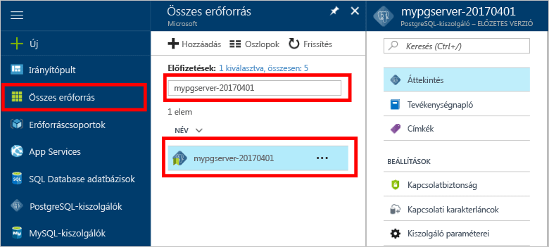

# Hogyan tooBackup és helyreállítását PostgreSQL az Azure-adatbázis egy kiszolgáló hello Azure-portálon

## Automatikusan megtörténik a biztonsági mentés
Ha Azure-adatbázis a PostgreSQL, hello adatbázis-szolgáltatás automatikusan teszi hello szolgáltatás biztonsági másolatot, 5 percenként. 

hello biztonsági mentések esetén érhetők el a 7 napja alapszintű rétegben, és 35 napon Standard csomag használata esetén. További információkért lásd: [PostgreSQL szolgáltatási szinteket az Azure-adatbázis](concepts-service-tiers.md)

Az automatikus biztonsági mentési szolgáltatás használatával állítsa vissza hello kiszolgáló és az adatbázisok egy új kiszolgáló tooan korábbi időpontban be.

## Állítsa vissza a hello Azure-portálon
Azure PostgreSQL-adatbázishoz lehetővé teszi toorestore hello server hátsó tooa pont idő és tooa hello server új példányát. Használhatja az új kiszolgáló toorecover adatait. 

Például ha egy táblázat véletlenül dobva délben ma, akkor sikerült toohello idő előtt déltől visszaállítása, hiányzik a táblázat és adatainak áttelepítését hello kiszolgáló új példányt hello beolvasása.

hello lépések visszaállítási hello minta kiszolgáló tooa pont időpont:
1. Jelentkezzen be a hello [Azure-portálon](https://portal.azure.com/)
2. Keresse meg az Azure-adatbázis PostgreSQL-kiszolgáló. Hello Azure-portálon, kattintson **összes erőforrás** hello bal oldali menüből és hello nevét, írja be például a **mypgserver-20170401**, a meglévő kiszolgáló toosearch. Kattintson a felsorolt hello keresési eredmény hello kiszolgálónevet. Hello **áttekintése** lapon, a kiszolgáló megnyílik, és további konfigurációs lehetőségeket.

   

3. A hello hello server – áttekintés panel felső részén kattintson **visszaállítása** hello eszköztáron. hello visszaállítás panel nyílik meg.

   

4. Töltse ki hello visszaállítási űrlapot hello szükséges információkkal:

   
  - **Visszaállítási pont**: egy pont időponthoz kötött, amely hello server módosítása előtt válasszon
  - **Célkiszolgáló**: Adjon meg egy új kiszolgálónevet azt szeretné, hogy toorestore
  - **Hely**: hello régió nem választhat, alapértelmezés szerint ugyanaz, mint a forráskiszolgálón hello
  - **A tarifacsomag**: Ez az érték nem módosítható, ha egy kiszolgáló visszaállítása. Ugyanaz, mint a forráskiszolgálón hello. 

5. Kattintson a **OK** toorestore hello server toorestore tooa pont időben. 

6. Miután hello visszaállítás befejezését, keresse meg a hello új kiszolgálóra, amely adatok helyreállt a várt módon tooverify hello jön létre.

## Következő lépések
- [Adatkapcsolattárak PostgreSQL Azure-adatbázis](concepts-connection-libraries.md)
