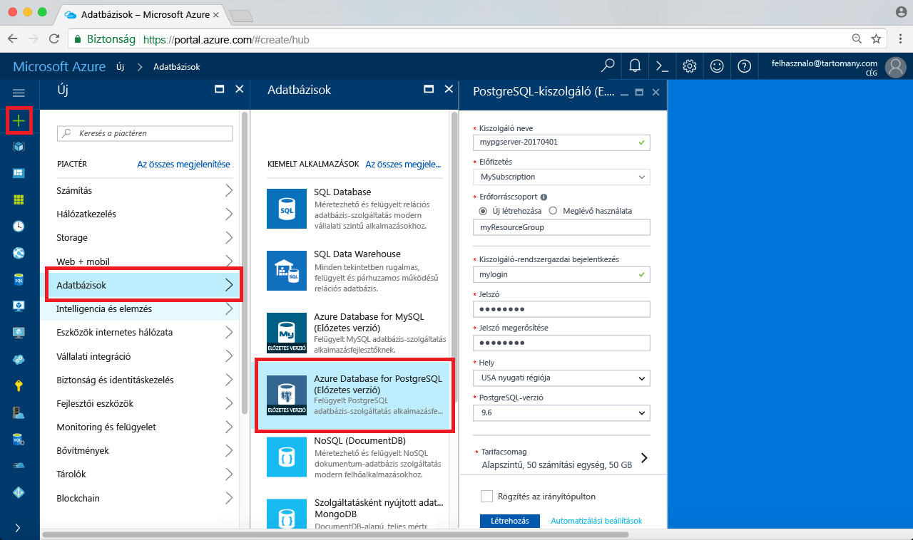
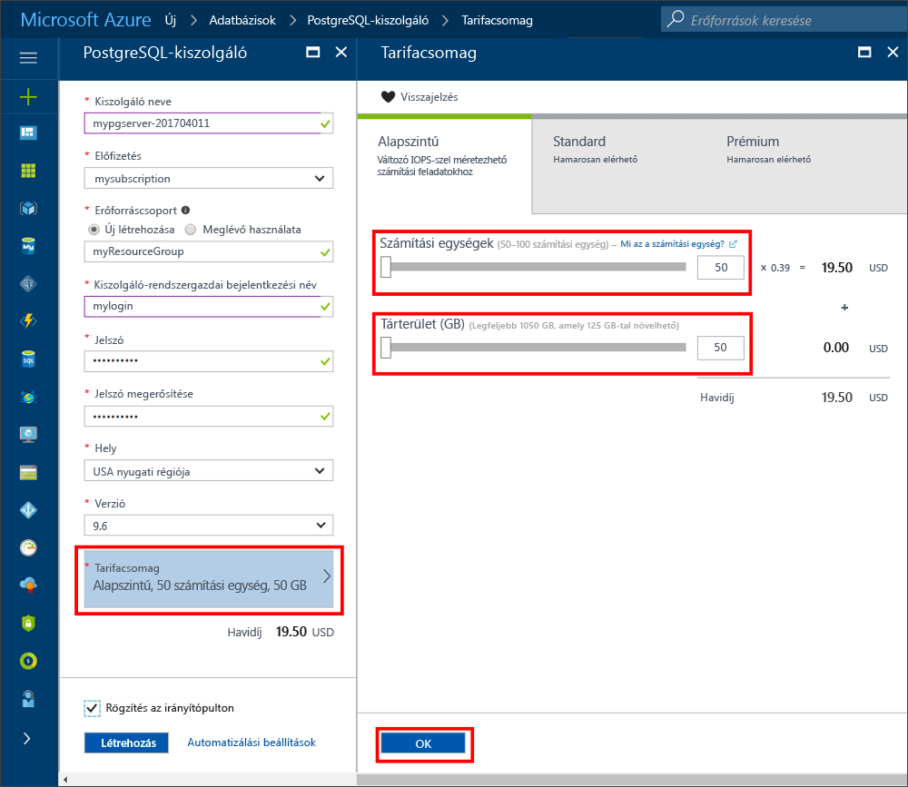
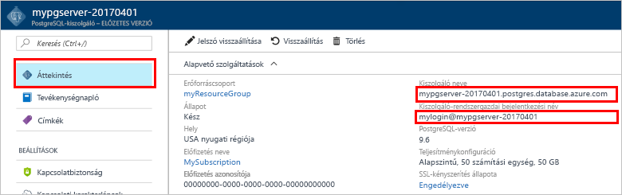
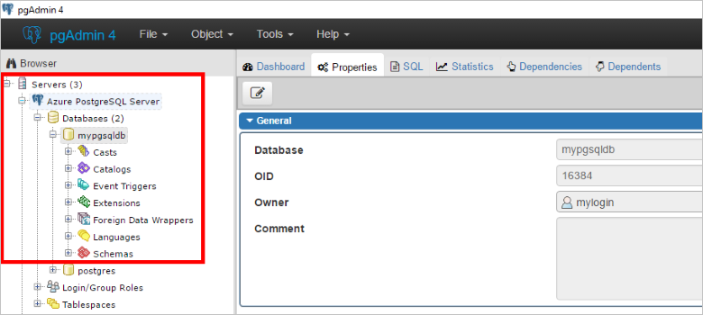
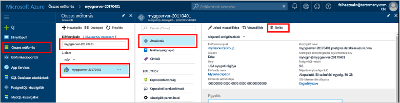

# <a name="create-an-azure-database-for-postgresql-in-hello-azure-portal"></a><span data-ttu-id="8f148-103">Hozzon létre egy Azure-adatbázis PostgreSQL a hello Azure-portálon</span><span class="sxs-lookup"><span data-stu-id="8f148-103">Create an Azure Database for PostgreSQL in hello Azure portal</span></span>

<span data-ttu-id="8f148-104">Azure PostgreSQL-adatbázishoz egy felügyelt szolgáltatás, amely lehetővé teszi toorun, kezeléséhez, és magas rendelkezésre állású PostgreSQL-adatbázisok hello felhőben méretezése.</span><span class="sxs-lookup"><span data-stu-id="8f148-104">Azure Database for PostgreSQL is a managed service that enables you toorun, manage, and scale highly available PostgreSQL databases in hello cloud.</span></span> <span data-ttu-id="8f148-105">A gyors üzembe helyezés bemutatja, hogyan toocreate egy Azure-adatbázis hello Azure-portál használatával KB PostgreSQL-kiszolgáló esetében.</span><span class="sxs-lookup"><span data-stu-id="8f148-105">This quickstart shows you how toocreate an Azure Database for PostgreSQL server using hello Azure portal in about five minutes.</span></span>

<span data-ttu-id="8f148-106">Ha nem rendelkezik Azure-előfizetéssel, első lépésként mindössze néhány perc alatt létrehozhat egy [ingyenes](https://azure.microsoft.com/free/) fiókot.</span><span class="sxs-lookup"><span data-stu-id="8f148-106">If you don't have an Azure subscription, create a [free](https://azure.microsoft.com/free/) account before you begin.</span></span>

## <a name="log-in-toohello-azure-portal"></a><span data-ttu-id="8f148-107">Jelentkezzen be toohello Azure-portálon</span><span class="sxs-lookup"><span data-stu-id="8f148-107">Log in toohello Azure portal</span></span>
<span data-ttu-id="8f148-108">Nyissa meg a webböngészőt, és keresse meg a toohello [Microsoft Azure-portálon](https://portal.azure.com/).</span><span class="sxs-lookup"><span data-stu-id="8f148-108">Open your web browser, and navigate toohello [Microsoft Azure portal](https://portal.azure.com/).</span></span> <span data-ttu-id="8f148-109">Adja meg a hitelesítő adatok toosign toohello portálon.</span><span class="sxs-lookup"><span data-stu-id="8f148-109">Enter your credentials toosign in toohello portal.</span></span> <span data-ttu-id="8f148-110">az alapértelmezett nézet hello a szolgáltatás irányítópultján.</span><span class="sxs-lookup"><span data-stu-id="8f148-110">hello default view is your service dashboard.</span></span>

## <a name="create-an-azure-database-for-postgresql"></a><span data-ttu-id="8f148-111">Azure-adatbázis létrehozása PostgreSQL-hez</span><span class="sxs-lookup"><span data-stu-id="8f148-111">Create an Azure Database for PostgreSQL</span></span>

<span data-ttu-id="8f148-112">Az Azure-adatbázis PostgreSQL-kiszolgálóhoz [számítási és tárolási erőforrások](./concepts-compute-unit-and-storage.md) egy meghatározott készletével együtt jön létre.</span><span class="sxs-lookup"><span data-stu-id="8f148-112">An Azure Database for PostgreSQL server is created with a defined set of [compute and storage resources](./concepts-compute-unit-and-storage.md).</span></span> <span data-ttu-id="8f148-113">hello server belül létrejön egy [Azure erőforráscsoport](../azure-resource-manager/resource-group-overview.md).</span><span class="sxs-lookup"><span data-stu-id="8f148-113">hello server is created within an [Azure resource group](../azure-resource-manager/resource-group-overview.md).</span></span>

<span data-ttu-id="8f148-114">Kövesse ezeket a lépéseket toocreate egy PostgreSQL-kiszolgálóhoz tartozó Azure-adatbázis:</span><span class="sxs-lookup"><span data-stu-id="8f148-114">Follow these steps toocreate an Azure Database for PostgreSQL server:</span></span>
1.  <span data-ttu-id="8f148-115">Kattintson a hello **új** hello bal felső sarkában hello Azure-portálon található (+) gombra.</span><span class="sxs-lookup"><span data-stu-id="8f148-115">Click hello **New** button (+) found on hello upper left-hand corner of hello Azure portal.</span></span>
2.  <span data-ttu-id="8f148-116">Válassza ki **adatbázisok** a hello **új** lapon, és válassza ki **PostgreSQL az Azure-adatbázis** a hello **adatbázisok** lap.</span><span class="sxs-lookup"><span data-stu-id="8f148-116">Select **Databases** from hello **New** page, and select **Azure Database for PostgreSQL** from hello **Databases** page.</span></span>
 <span data-ttu-id="8f148-117"></span><span class="sxs-lookup"><span data-stu-id="8f148-117"></span></span>

3.  <span data-ttu-id="8f148-118">Hello új kiszolgáló részletei űrlap kitöltése a következő információ, hello kép megelőző hello szerint:</span><span class="sxs-lookup"><span data-stu-id="8f148-118">Fill out hello new server details form with hello following information, as shown on hello preceding image:</span></span>

    <span data-ttu-id="8f148-119">Beállítás</span><span class="sxs-lookup"><span data-stu-id="8f148-119">Setting</span></span>|<span data-ttu-id="8f148-120">Ajánlott érték</span><span class="sxs-lookup"><span data-stu-id="8f148-120">Suggested value</span></span>|<span data-ttu-id="8f148-121">Leírás</span><span class="sxs-lookup"><span data-stu-id="8f148-121">Description</span></span>
    ---|---|---
    <span data-ttu-id="8f148-122">Kiszolgálónév</span><span class="sxs-lookup"><span data-stu-id="8f148-122">Server name</span></span> |<span data-ttu-id="8f148-123">*mypgserver-20170401*</span><span class="sxs-lookup"><span data-stu-id="8f148-123">*mypgserver-20170401*</span></span>|<span data-ttu-id="8f148-124">Válasszon egy egyedi nevet, amely azonosítja a PostgreSQL-kiszolgálóhoz készült Azure-adatbázist.</span><span class="sxs-lookup"><span data-stu-id="8f148-124">Choose a unique name that identifies your Azure Database for PostgreSQL server.</span></span> <span data-ttu-id="8f148-125">hello tartománynév *postgres.database.azure.com* ad meg az alkalmazások tooconnect a hozzáfűzött toohello kiszolgálónév.</span><span class="sxs-lookup"><span data-stu-id="8f148-125">hello domain name *postgres.database.azure.com* is appended toohello server name you provide for applications tooconnect to.</span></span> <span data-ttu-id="8f148-126">hello kiszolgálónév csak kisbetűket, számokat és kötőjel (-) karakter hello tartalmazhat, és 3 és 63 karakter kell tartalmaznia.</span><span class="sxs-lookup"><span data-stu-id="8f148-126">hello server name can contain only lowercase letters, numbers, and hello hyphen (-) character, and it must contain from 3 through 63 characters.</span></span>
    <span data-ttu-id="8f148-127">Előfizetés</span><span class="sxs-lookup"><span data-stu-id="8f148-127">Subscription</span></span>|<span data-ttu-id="8f148-128">*Az Ön előfizetése*</span><span class="sxs-lookup"><span data-stu-id="8f148-128">*Your subscription*</span></span>|<span data-ttu-id="8f148-129">hello Azure-előfizetést, amelyet az toouse a kiszolgáló.</span><span class="sxs-lookup"><span data-stu-id="8f148-129">hello Azure subscription that you want toouse for your server.</span></span> <span data-ttu-id="8f148-130">Ha több előfizetéssel rendelkezik, válassza ki a hello amelyben hello erőforrás lesz számlázva, a megfelelő előfizetést.</span><span class="sxs-lookup"><span data-stu-id="8f148-130">If you have multiple subscriptions, choose hello appropriate subscription in which hello resource is billed for.</span></span>
    <span data-ttu-id="8f148-131">Erőforráscsoport</span><span class="sxs-lookup"><span data-stu-id="8f148-131">Resource Group</span></span>|<span data-ttu-id="8f148-132">*myresourcegroup*</span><span class="sxs-lookup"><span data-stu-id="8f148-132">*myresourcegroup*</span></span>| <span data-ttu-id="8f148-133">Meghatározhat egy új erőforráscsoport-nevet, vagy használhat egy meglévőt az előfizetéséből.</span><span class="sxs-lookup"><span data-stu-id="8f148-133">You may make a new resource group name, or use an existing one from your subscription.</span></span>
    <span data-ttu-id="8f148-134">Kiszolgáló-rendszergazdai bejelentkezés</span><span class="sxs-lookup"><span data-stu-id="8f148-134">Server admin login</span></span> |<span data-ttu-id="8f148-135">*mylogin*</span><span class="sxs-lookup"><span data-stu-id="8f148-135">*mylogin*</span></span>| <span data-ttu-id="8f148-136">Ellenőrizze a saját bejelentkezési fiók toouse toohello kiszolgálóhoz kapcsolódáskor.</span><span class="sxs-lookup"><span data-stu-id="8f148-136">Make your own login account toouse when connecting toohello server.</span></span> <span data-ttu-id="8f148-137">hello rendszergazda bejelentkezési név nem lehet "azure_superuser", "azure_pg_admin", "admin", "rendszergazda", "Gyökér", "Vendég" vagy "public", és nem kezdődhet "pg_".</span><span class="sxs-lookup"><span data-stu-id="8f148-137">hello admin login name cannot be 'azure_superuser', 'azure_pg_admin', 'admin', 'administrator', 'root', 'guest', or 'public', and cannot start with 'pg_'.</span></span>
    <span data-ttu-id="8f148-138">Jelszó</span><span class="sxs-lookup"><span data-stu-id="8f148-138">Password</span></span> |<span data-ttu-id="8f148-139">*A választása szerint*</span><span class="sxs-lookup"><span data-stu-id="8f148-139">*Your choice*</span></span> | <span data-ttu-id="8f148-140">Hozzon létre egy új jelszót hello kiszolgáló rendszergazdai fiókot.</span><span class="sxs-lookup"><span data-stu-id="8f148-140">Create a new password for hello server admin account.</span></span> <span data-ttu-id="8f148-141">A 8 too128 karaktereket kell tartalmaznia.</span><span class="sxs-lookup"><span data-stu-id="8f148-141">Must contain from 8 too128 characters.</span></span> <span data-ttu-id="8f148-142">A jelszó tartalmaznia kell legalább hármat a következő kategóriák hello – az angol ábécé betűket, angol ábécé kisbetűi, számok (0-9) és egyéb karakterek (!, $, #, %, stb.).</span><span class="sxs-lookup"><span data-stu-id="8f148-142">Your password must contain characters from three of hello following categories – English uppercase letters, English lowercase letters, numbers (0-9), and non-alphanumeric characters (!, $, #, %, etc.).</span></span>
    <span data-ttu-id="8f148-143">Hely</span><span class="sxs-lookup"><span data-stu-id="8f148-143">Location</span></span>|<span data-ttu-id="8f148-144">*hello régió legközelebbi tooyour felhasználók*</span><span class="sxs-lookup"><span data-stu-id="8f148-144">*hello region closest tooyour users*</span></span>| <span data-ttu-id="8f148-145">Válassza ki a legközelebbi tooyour felhasználók hello helyet.</span><span class="sxs-lookup"><span data-stu-id="8f148-145">Choose hello location that's closest tooyour users.</span></span>
    <span data-ttu-id="8f148-146">PostgreSQL-verzió</span><span class="sxs-lookup"><span data-stu-id="8f148-146">PostgreSQL Version</span></span>|<span data-ttu-id="8f148-147">*Válassza ki a hello legújabb verziója*</span><span class="sxs-lookup"><span data-stu-id="8f148-147">*Choose hello latest version*</span></span>| <span data-ttu-id="8f148-148">Válassza ki hello legújabb verziót, hacsak nem rendelkezik konkrét követelmények.</span><span class="sxs-lookup"><span data-stu-id="8f148-148">Choose hello latest version unless you have specific requirements.</span></span>
    <span data-ttu-id="8f148-149">Tarifacsomag</span><span class="sxs-lookup"><span data-stu-id="8f148-149">Pricing Tier</span></span> | <span data-ttu-id="8f148-150">**Alapszintű**, **50 számítási egység****50 GB**</span><span class="sxs-lookup"><span data-stu-id="8f148-150">**Basic**, **50 Compute Units** **50 GB**</span></span> | <span data-ttu-id="8f148-151">Kattintson a **tarifacsomag** toospecify hello és teljesítményszintet szolgáltatásszint az új adatbázishoz.</span><span class="sxs-lookup"><span data-stu-id="8f148-151">Click **Pricing tier** toospecify hello service tier and performance level for your new database.</span></span> <span data-ttu-id="8f148-152">Adja meg az alapszintű csomag hello lapon hello tetején.</span><span class="sxs-lookup"><span data-stu-id="8f148-152">Choose Basic tier in hello tab at hello top.</span></span> <span data-ttu-id="8f148-153">Kattintson a bal szélső hello hello számítási egység csúszkát tooadjust hello érték toohello legkisebb a gyors üzembe helyezés érhető el.</span><span class="sxs-lookup"><span data-stu-id="8f148-153">Click hello left end of hello Compute Units slider tooadjust hello value toohello least amount available for this quickstart.</span></span> <span data-ttu-id="8f148-154">Kattintson a **Ok** toosave hello tarifacsomag kiválasztása.</span><span class="sxs-lookup"><span data-stu-id="8f148-154">Click **Ok** toosave hello pricing tier selection.</span></span> <span data-ttu-id="8f148-155">Tekintse meg a következő képernyőkép hello.</span><span class="sxs-lookup"><span data-stu-id="8f148-155">See hello following screenshot.</span></span>
    | <span data-ttu-id="8f148-156">PIN-kód toodashboard</span><span class="sxs-lookup"><span data-stu-id="8f148-156">Pin toodashboard</span></span> | <span data-ttu-id="8f148-157">Jelölőnégyzet</span><span class="sxs-lookup"><span data-stu-id="8f148-157">Check</span></span> | <span data-ttu-id="8f148-158">Ellenőrizze a hello **PIN-kód toodashboard** beállítás tooallow könnyű nyomon a kiszolgáló hello első irányítópult oldalán, az Azure-portálon.</span><span class="sxs-lookup"><span data-stu-id="8f148-158">Check hello **Pin toodashboard** option tooallow easy tracking of your server on hello front dashboard page of your Azure portal.</span></span>

  > [!IMPORTANT]
  > <span data-ttu-id="8f148-159">hello kiszolgáló-rendszergazdai bejelentkezés és a jelszót, amely az itt megadott a szükséges toolog toohello Server és az adatbázisok a gyors üzembe helyezési későbbi részében.</span><span class="sxs-lookup"><span data-stu-id="8f148-159">hello server admin login and password that you specify here are required toolog in toohello server and its databases later in this quick start.</span></span> <span data-ttu-id="8f148-160">Jegyezze meg vagy jegyezze fel ezt az információt későbbi használatra.</span><span class="sxs-lookup"><span data-stu-id="8f148-160">Remember or record this information for later use.</span></span>

    

4.  <span data-ttu-id="8f148-162">Kattintson a **létrehozása** tooprovision hello kiszolgáló.</span><span class="sxs-lookup"><span data-stu-id="8f148-162">Click **Create** tooprovision hello server.</span></span> <span data-ttu-id="8f148-163">Kiépítés néhány percet vesz igénybe, mentése too20 perc maximális.</span><span class="sxs-lookup"><span data-stu-id="8f148-163">Provisioning takes a few minutes, up too20 minutes maximum.</span></span>

5.  <span data-ttu-id="8f148-164">Hello eszköztáron kattintson **értesítések** toomonitor hello telepítési folyamat.</span><span class="sxs-lookup"><span data-stu-id="8f148-164">On hello toolbar, click **Notifications** toomonitor hello deployment process.</span></span>
 <span data-ttu-id="8f148-165"></span><span class="sxs-lookup"><span data-stu-id="8f148-165"></span></span>
   
  <span data-ttu-id="8f148-166">Alapértelmezés szerint a **postgres** adatbázis a kiszolgáló alatt jön létre.</span><span class="sxs-lookup"><span data-stu-id="8f148-166">By default, **postgres** database gets created under your server.</span></span> <span data-ttu-id="8f148-167">Hello [postgres](https://www.postgresql.org/docs/9.6/static/app-initdb.html) egy alapértelmezett adatbázis való használatra szolgál, a felhasználók, segédprogramok és harmadik féltől származó alkalmazások.</span><span class="sxs-lookup"><span data-stu-id="8f148-167">hello [postgres](https://www.postgresql.org/docs/9.6/static/app-initdb.html) database is a default database meant for use by users, utilities, and third-party applications.</span></span> 

## <a name="configure-a-server-level-firewall-rule"></a><span data-ttu-id="8f148-168">Kiszolgálószintű tűzfalszabály konfigurálása</span><span class="sxs-lookup"><span data-stu-id="8f148-168">Configure a server-level firewall rule</span></span>

<span data-ttu-id="8f148-169">hello Azure adatbázis PostgreSQL szolgáltatás tűzfal hello kiszolgáló-szintjén hoz létre.</span><span class="sxs-lookup"><span data-stu-id="8f148-169">hello Azure Database for PostgreSQL service creates a firewall at hello server-level.</span></span> <span data-ttu-id="8f148-170">A tűzfal megakadályozza, hogy külső alkalmazások és eszközök csatlakozás toohello kiszolgáló és azon tárolt adatbázisokhoz hello kiszolgáló, kivéve, ha egy tűzfalszabály tooopen hello tűzfal adott IP-címekhez.</span><span class="sxs-lookup"><span data-stu-id="8f148-170">This firewall prevents external applications and tools from connecting toohello server and any databases on hello server, unless a firewall rule is created tooopen hello firewall for specific IP addresses.</span></span> 

1.  <span data-ttu-id="8f148-171">Keresse meg a kiszolgáló, hello központi telepítés befejezése után.</span><span class="sxs-lookup"><span data-stu-id="8f148-171">Locate your server after hello deployment completes.</span></span> <span data-ttu-id="8f148-172">Ha szükséges, használja a keresési funkciót.</span><span class="sxs-lookup"><span data-stu-id="8f148-172">If needed, you can search for it.</span></span> <span data-ttu-id="8f148-173">Kattintson például **összes erőforrás** hello bal oldali menüből és hello kiszolgálónevet írja be (például hello példa *mypgserver-20170401*) az újonnan létrehozott kiszolgáló toosearch.</span><span class="sxs-lookup"><span data-stu-id="8f148-173">For example, click **All Resources** from hello left-hand menu and type in hello server name (such as hello example *mypgserver-20170401*) toosearch for your newly created server.</span></span> <span data-ttu-id="8f148-174">Kattintson a kiszolgáló nevét, a hello keresési eredmény jelenik meg.</span><span class="sxs-lookup"><span data-stu-id="8f148-174">Click on your server name listed in hello search result.</span></span> <span data-ttu-id="8f148-175">Hello **áttekintése** lapon, a kiszolgáló megnyílik, és további konfigurációs lehetőségeket.</span><span class="sxs-lookup"><span data-stu-id="8f148-175">hello **Overview** page for your server opens and provides options for further configuration.</span></span>
 
    

2.  <span data-ttu-id="8f148-177">Hello lapon válassza az **kapcsolatbiztonsági**.</span><span class="sxs-lookup"><span data-stu-id="8f148-177">On hello server page, select **Connection security**.</span></span> 
    <span data-ttu-id="8f148-178"></span><span class="sxs-lookup"><span data-stu-id="8f148-178"></span></span>

3.  <span data-ttu-id="8f148-179">A hello **tűzfal-szabályok** hello üres szövegmezőben a hello elemcsoportban kattintson **szabálynév** oszlop toobegin hello tűzfalszabály létrehozása.</span><span class="sxs-lookup"><span data-stu-id="8f148-179">Under hello **Firewall rules** heading, click in hello blank text box in hello **Rule Name** column toobegin creating hello firewall rule.</span></span> 

    <span data-ttu-id="8f148-180">A gyors üzembe helyezési a most oszthatja az IP-címek hello server kitöltésével hello szövegmezőben az egyes oszlopok a következő értékek hello:</span><span class="sxs-lookup"><span data-stu-id="8f148-180">For this quick start, let's allow all IP addresses into hello server by filling in hello text box in each column with hello following values:</span></span>

    <span data-ttu-id="8f148-181">Szabály neve</span><span class="sxs-lookup"><span data-stu-id="8f148-181">Rule Name</span></span> | <span data-ttu-id="8f148-182">Kezdő IP-cím</span><span class="sxs-lookup"><span data-stu-id="8f148-182">Start IP</span></span> | <span data-ttu-id="8f148-183">Záró IP-cím</span><span class="sxs-lookup"><span data-stu-id="8f148-183">End IP</span></span> 
    ---|---|---
    <span data-ttu-id="8f148-184">AllowAllIps</span><span class="sxs-lookup"><span data-stu-id="8f148-184">AllowAllIps</span></span> |  <span data-ttu-id="8f148-185">0.0.0.0</span><span class="sxs-lookup"><span data-stu-id="8f148-185">0.0.0.0</span></span> | <span data-ttu-id="8f148-186">255.255.255.255</span><span class="sxs-lookup"><span data-stu-id="8f148-186">255.255.255.255</span></span>

4. <span data-ttu-id="8f148-187">A hello felső eszköztárán hello kapcsolat biztonsági beállításait tartalmazó lapot, kattintson **mentése**.</span><span class="sxs-lookup"><span data-stu-id="8f148-187">On hello upper toolbar of hello Connection security page, click **Save**.</span></span> <span data-ttu-id="8f148-188">Várjon néhány percet, és figyelje meg hello értesítést jelenít meg, hogy kapcsolatbiztonsági frissítése sikeresen befejeződött a folytatás előtt.</span><span class="sxs-lookup"><span data-stu-id="8f148-188">Wait for a few moments and notice hello notification showing that updating connection security has finished successfully before continuing.</span></span>

    > [!NOTE]
    > <span data-ttu-id="8f148-189">Kapcsolatok tooyour Azure adatbázis PostgreSQL-kiszolgáló port 5432 protokollt használó kommunikációra.</span><span class="sxs-lookup"><span data-stu-id="8f148-189">Connections tooyour Azure Database for PostgreSQL server communicate over port 5432.</span></span> <span data-ttu-id="8f148-190">Ha a vállalati hálózatból származó tooconnect, a hálózati tűzfal előfordulhat, hogy nem engedélyezett a port 5432 kimenő forgalmát.</span><span class="sxs-lookup"><span data-stu-id="8f148-190">If you are trying tooconnect from within a corporate network, outbound traffic over port 5432 may not be allowed by your network's firewall.</span></span> <span data-ttu-id="8f148-191">Ha igen, csak akkor tudja tooconnect tooyour server kivéve, ha az IT-részleg 5432 portot nyit meg.</span><span class="sxs-lookup"><span data-stu-id="8f148-191">If so, you will not be able tooconnect tooyour server unless your IT department opens port 5432.</span></span>
    >

## <a name="get-hello-connection-information"></a><span data-ttu-id="8f148-192">Hello kapcsolatadatok beolvasása</span><span class="sxs-lookup"><span data-stu-id="8f148-192">Get hello connection information</span></span>

<span data-ttu-id="8f148-193">A PostgreSQL-kiszolgálóhoz készült Azure-adatbázis létrehozásakor egy **postgres** nevű alapértelmezett adatbázis jön létre.</span><span class="sxs-lookup"><span data-stu-id="8f148-193">When we created our Azure Database for PostgreSQL server, a default database named **postgres** gets created.</span></span> <span data-ttu-id="8f148-194">tooconnect tooyour adatbázis-kiszolgáló, tooremember hello teljes kiszolgáló nevét és a rendszergazdai bejelentkezési hitelesítő adatok szükségesek.</span><span class="sxs-lookup"><span data-stu-id="8f148-194">tooconnect tooyour database server, you need tooremember hello full server name and admin login credentials.</span></span> <span data-ttu-id="8f148-195">Előfordulhat, hogy a feljegyzett ezeket az értékeket hello gyors üzembe helyezési cikk korábbi részében.</span><span class="sxs-lookup"><span data-stu-id="8f148-195">You may have noted those values earlier in hello quick start article.</span></span> <span data-ttu-id="8f148-196">Abban az esetben, ha nem, könnyedén megtalálhatja a hello kiszolgáló nevét és a bejelentkezési adatait hello server – áttekintés oldalra a hello Azure-portálon.</span><span class="sxs-lookup"><span data-stu-id="8f148-196">In case you did not, you can easily find hello server name and login information from hello server Overview page in hello Azure portal.</span></span>

1. <span data-ttu-id="8f148-197">Nyissa meg kiszolgáló **Áttekintés** lapját.</span><span class="sxs-lookup"><span data-stu-id="8f148-197">Open your server's **Overview** page.</span></span> <span data-ttu-id="8f148-198">Jegyezze fel a hello **kiszolgálónév** és **kiszolgálói rendszergazda bejelentkezési név**.</span><span class="sxs-lookup"><span data-stu-id="8f148-198">Make a note of hello **Server name** and **Server admin login name**.</span></span>
    <span data-ttu-id="8f148-199">A kurzorral rámutat minden mező, és hello másolás ikon toohello jobb hello szöveg jelenik meg.</span><span class="sxs-lookup"><span data-stu-id="8f148-199">Hover your cursor over each field, and hello copy icon appears toohello right of hello text.</span></span> <span data-ttu-id="8f148-200">Kattintson a hello másolás ikon szükséges toocopy hello értékként.</span><span class="sxs-lookup"><span data-stu-id="8f148-200">Click hello copy icon as needed toocopy hello values.</span></span>

 

## <a name="connect-toopostgresql-database-using-psql-in-cloud-shell"></a><span data-ttu-id="8f148-202">Csatlakozás tooPostgreSQL adatbázis psql felhő rendszerhéj használatával</span><span class="sxs-lookup"><span data-stu-id="8f148-202">Connect tooPostgreSQL database using psql in Cloud Shell</span></span>

<span data-ttu-id="8f148-203">Számos alkalmazás használatával tooconnect tooyour Azure Database PostgreSQL-kiszolgáló.</span><span class="sxs-lookup"><span data-stu-id="8f148-203">There are a number of applications you can use tooconnect tooyour Azure Database for PostgreSQL server.</span></span> <span data-ttu-id="8f148-204">Most először használja hello psql parancssori segédprogram tooillustrate hogyan tooconnect toohello kiszolgáló.</span><span class="sxs-lookup"><span data-stu-id="8f148-204">Let's first use hello psql command-line utility tooillustrate how tooconnect toohello server.</span></span>  <span data-ttu-id="8f148-205">Egy webes böngésző is használhat, és hello Azure Cloud rendszerhéj nélkül hello itt leírt módon kell tooinstall további szoftvereket.</span><span class="sxs-lookup"><span data-stu-id="8f148-205">You can use a web browser and hello Azure Cloud Shell as described here without hello need tooinstall any additional software.</span></span> <span data-ttu-id="8f148-206">Ha helyileg van telepítve, a saját számítógépre hello psql segédprogram, ott is lehet csatlakoztatni.</span><span class="sxs-lookup"><span data-stu-id="8f148-206">If you have hello psql utility installed locally on your own machine, you can connect from there as well.</span></span>

1. <span data-ttu-id="8f148-207">Indítsa el a hello Azure Cloud rendszerhéj hello terminál ikonra a felső navigációs panelen hello keresztül.</span><span class="sxs-lookup"><span data-stu-id="8f148-207">Launch hello Azure Cloud Shell via hello terminal icon on hello top navigation pane.</span></span>

   

2. <span data-ttu-id="8f148-209">hello Azure Cloud rendszerhéj megnyitása a böngészőben, amely lehetővé teszi, tootype bash rendszerhéjat parancsok.</span><span class="sxs-lookup"><span data-stu-id="8f148-209">hello Azure Cloud Shell opens in your browser, enabling you tootype bash shell commands.</span></span>

   

3. <span data-ttu-id="8f148-211">Parancssorba hello felhő rendszerhéj csatlakozás beírásával hello psql parancssori zöld hello tooa adatbázis az Azure-adatbázis PostgreSQL-kiszolgáló.</span><span class="sxs-lookup"><span data-stu-id="8f148-211">At hello Cloud Shell prompt, connect tooa database in your Azure Database for PostgreSQL server by typing hello psql command line at hello green prompt.</span></span>

    <span data-ttu-id="8f148-212">hello következő formátuma használt tooconnect tooan Azure adatbázis hello PostgreSQL kiszolgáló [psql](https://www.postgresql.org/docs/9.6/static/app-psql.html) segédprogram:</span><span class="sxs-lookup"><span data-stu-id="8f148-212">hello following format is used tooconnect tooan Azure Database for PostgreSQL server with hello [psql](https://www.postgresql.org/docs/9.6/static/app-psql.html) utility:</span></span>
    ```bash
    psql --host=<yourserver> --port=<port> --username=<server admin login> --dbname=<database name>
    ```

    <span data-ttu-id="8f148-213">Például a következő parancs hello tooan példa kiszolgáló csatlakozik:</span><span class="sxs-lookup"><span data-stu-id="8f148-213">For example, hello following command connects tooan example server:</span></span>

    ```bash
    psql --host=mypgserver-20170401.postgres.database.azure.com --port=5432 --username=mylogin@mypgserver-20170401 --dbname=postgres
    ```

    <span data-ttu-id="8f148-214">psql paraméter</span><span class="sxs-lookup"><span data-stu-id="8f148-214">psql parameter</span></span> |<span data-ttu-id="8f148-215">Ajánlott érték</span><span class="sxs-lookup"><span data-stu-id="8f148-215">Suggested value</span></span>|<span data-ttu-id="8f148-216">Leírás</span><span class="sxs-lookup"><span data-stu-id="8f148-216">Description</span></span>
    ---|---|---
    <span data-ttu-id="8f148-217">--host</span><span class="sxs-lookup"><span data-stu-id="8f148-217">--host</span></span> | <span data-ttu-id="8f148-218">*kiszolgáló neve*</span><span class="sxs-lookup"><span data-stu-id="8f148-218">*server name*</span></span> | <span data-ttu-id="8f148-219">Adja meg a hello kiszolgálónév hello Azure adatbázis PostgreSQL a korábban létrehozott használt.</span><span class="sxs-lookup"><span data-stu-id="8f148-219">Specify hello server name value that was used when you created hello Azure Database for PostgreSQL earlier.</span></span> <span data-ttu-id="8f148-220">Az itt látható példakiszolgáló a mypgserver-20170401.postgres.database.azure.com. Hello teljesen minősített tartománynevét használja (\*. postgres.database.azure.com) hello példában látható módon.</span><span class="sxs-lookup"><span data-stu-id="8f148-220">Our example server shown is mypgserver-20170401.postgres.database.azure.com. Use hello fully qualified domain name (\*.postgres.database.azure.com) as shown in hello example.</span></span> <span data-ttu-id="8f148-221">Kövesse hello hello előző szakasz tooget hello kapcsolati adatokat, ha nem emlékszik a kiszolgáló nevét.</span><span class="sxs-lookup"><span data-stu-id="8f148-221">Follow hello steps in hello previous section tooget hello connection information if you do not remember your server name.</span></span> 
    <span data-ttu-id="8f148-222">--port</span><span class="sxs-lookup"><span data-stu-id="8f148-222">--port</span></span> | <span data-ttu-id="8f148-223">**5432**</span><span class="sxs-lookup"><span data-stu-id="8f148-223">**5432**</span></span> | <span data-ttu-id="8f148-224">Mindig használjon port 5432 PostgreSQL tooAzure adatbázishoz kapcsolódáskor.</span><span class="sxs-lookup"><span data-stu-id="8f148-224">Always use port 5432 when connecting tooAzure Database for PostgreSQL.</span></span> 
    <span data-ttu-id="8f148-225">--username</span><span class="sxs-lookup"><span data-stu-id="8f148-225">--username</span></span> | <span data-ttu-id="8f148-226">*kiszolgáló-rendszergazdai bejelentkezési név*</span><span class="sxs-lookup"><span data-stu-id="8f148-226">*server admin login name*</span></span> |<span data-ttu-id="8f148-227">Írja be a hello server admin bejelentkezési felhasználónevének megadni, ha az Azure-adatbázis hello PostgreSQL a korábban létrehozott.</span><span class="sxs-lookup"><span data-stu-id="8f148-227">Type in hello  server admin login username supplied when you created hello Azure Database for PostgreSQL earlier.</span></span> <span data-ttu-id="8f148-228">Ha nem emlékszik hello felhasználónév, kövesse a hello előző szakasz tooget hello kapcsolatadatok hello lépéseit.</span><span class="sxs-lookup"><span data-stu-id="8f148-228">Follow hello steps in hello previous section tooget hello connection information if you do not remember hello username.</span></span>  <span data-ttu-id="8f148-229">hello formátuma  *username@servername* .</span><span class="sxs-lookup"><span data-stu-id="8f148-229">hello format is *username@servername*.</span></span>
    <span data-ttu-id="8f148-230">--dbname</span><span class="sxs-lookup"><span data-stu-id="8f148-230">--dbname</span></span> | <span data-ttu-id="8f148-231">**postgres**</span><span class="sxs-lookup"><span data-stu-id="8f148-231">**postgres**</span></span> | <span data-ttu-id="8f148-232">Hello alapértelmezett rendszer által létrehozott adatbázis név használata *postgres* hello első kapcsolathoz.</span><span class="sxs-lookup"><span data-stu-id="8f148-232">Use hello default system generated database name *postgres* for hello first connection.</span></span> <span data-ttu-id="8f148-233">Később létrehozhatja a saját adatbázisát.</span><span class="sxs-lookup"><span data-stu-id="8f148-233">Later you create your own database.</span></span>

    <span data-ttu-id="8f148-234">Futó hello psql parancsot, miután a saját paraméterértékekkel felszólító tootype hello kiszolgáló rendszergazdai jelszavát.</span><span class="sxs-lookup"><span data-stu-id="8f148-234">After running hello psql command, with your own parameter values, you are prompted tootype hello server admin password.</span></span> <span data-ttu-id="8f148-235">Ez a jelszó van hello azonos hello kiszolgáló létrehozásakor megadott.</span><span class="sxs-lookup"><span data-stu-id="8f148-235">This password is hello same that you provided when you created hello server.</span></span> 

    <span data-ttu-id="8f148-236">psql paraméter</span><span class="sxs-lookup"><span data-stu-id="8f148-236">psql parameter</span></span> |<span data-ttu-id="8f148-237">Ajánlott érték</span><span class="sxs-lookup"><span data-stu-id="8f148-237">Suggested value</span></span>|<span data-ttu-id="8f148-238">Leírás</span><span class="sxs-lookup"><span data-stu-id="8f148-238">Description</span></span>
    ---|---|---
    <span data-ttu-id="8f148-239">jelszó</span><span class="sxs-lookup"><span data-stu-id="8f148-239">password</span></span> | <span data-ttu-id="8f148-240">*az Ön rendszergazdai jelszava*</span><span class="sxs-lookup"><span data-stu-id="8f148-240">*your admin password*</span></span> | <span data-ttu-id="8f148-241">Vegye figyelembe, hello karakterek nem látható a hello bash Rákérdezés beírt jelszó.</span><span class="sxs-lookup"><span data-stu-id="8f148-241">Note, hello typed password characters are not shown on hello bash prompt.</span></span> <span data-ttu-id="8f148-242">Nyomja le az enter adta meg az összes hello karakterek tooauthenticate és csatlakozás után.</span><span class="sxs-lookup"><span data-stu-id="8f148-242">Press enter after you have typed all hello characters tooauthenticate and connect.</span></span>

    <span data-ttu-id="8f148-243">A csatlakozás után a hello psql segédprogram sql-parancsok írhatja postgres üzenetet jelenít meg.</span><span class="sxs-lookup"><span data-stu-id="8f148-243">Once connected, hello psql utility displays a postgres prompt where you type sql commands.</span></span> <span data-ttu-id="8f148-244">Hello kezdeti kapcsolat kimenet a figyelmeztetés megjelenhet mivel lehet, hogy az Azure felhőalapú rendszerhéj hello hello psql hello Azure-adatbázis a PostgreSQL-kiszolgáló verziója eltérő verzióval.</span><span class="sxs-lookup"><span data-stu-id="8f148-244">In hello initial connection output, a warning may be displayed since hello psql in hello Azure Cloud Shell may be a different  version than hello Azure Database for PostgreSQL server version.</span></span> 
    
    <span data-ttu-id="8f148-245">Példa psql kimenetre:</span><span class="sxs-lookup"><span data-stu-id="8f148-245">Example psql output:</span></span>
    ```bash
    psql (9.5.7, server 9.6.2)
    WARNING: psql major version 9.5, server major version 9.6.
        Some psql features might not work.
    SSL connection (protocol: TLSv1.2, cipher: ECDHE-RSA-AES256-SHA384, bits: 256, compression: off)
    Type "help" for help.
   
    postgres=> 
    ```

    > [!TIP]
    > <span data-ttu-id="8f148-246">Ha hello tűzfal nincs konfigurálva a tooallow hello IP-címe hello Azure Cloud rendszerhéj, hello alábbi hiba akkor fordul elő:</span><span class="sxs-lookup"><span data-stu-id="8f148-246">If hello firewall is not configured tooallow hello IP address of hello Azure Cloud Shell, hello following error occurs:</span></span>
    > 
    > <span data-ttu-id="8f148-247">"psql: FATAL:  no pg_hba.conf entry for host "138.91.195.82", user "mylogin", database "postgres", SSL on FATAL:  SSL connection is required.</span><span class="sxs-lookup"><span data-stu-id="8f148-247">"psql: FATAL:  no pg_hba.conf entry for host "138.91.195.82", user "mylogin", database "postgres", SSL on FATAL:  SSL connection is required.</span></span> <span data-ttu-id="8f148-248">Please specify SSL options and retry.</span><span class="sxs-lookup"><span data-stu-id="8f148-248">Please specify SSL options and retry.</span></span>
    > 
    > <span data-ttu-id="8f148-249">tooresolve hello hiba, győződjön meg arról, hogy hello kiszolgáló konfigurációja megfelel hello hello szükséges lépések *konfigurálása egy kiszolgálószintű tűzfalszabályt* hello című szakaszban.</span><span class="sxs-lookup"><span data-stu-id="8f148-249">tooresolve hello error, make sure hello server configuration matches hello steps in hello *Configure a server-level firewall rule* section of hello article.</span></span>

4.  <span data-ttu-id="8f148-250">Hozzon létre egy üres adatbázist: hello Rákérdezés hello a következő parancs beírásával:</span><span class="sxs-lookup"><span data-stu-id="8f148-250">Create a blank database at hello prompt by typing hello following command:</span></span>
    ```bash
    CREATE DATABASE mypgsqldb;
    ```
    <span data-ttu-id="8f148-251">Hello parancsot is igénybe vehet néhány percet toocomplete.</span><span class="sxs-lookup"><span data-stu-id="8f148-251">hello command may take a few moments toocomplete.</span></span> 

5.  <span data-ttu-id="8f148-252">Hello parancssorba hajtható végre a következő parancs tooswitch kapcsolat található, újonnan létrehozott toohello adatbázis hello **mypgsqldb**.</span><span class="sxs-lookup"><span data-stu-id="8f148-252">At hello prompt, execute hello following command tooswitch connection toohello newly created database **mypgsqldb**.</span></span>
    ```bash
    \c mypgsqldb
    ```

6.  <span data-ttu-id="8f148-253">Írja be a \q, és nyomja le az ENTER tooquit psql.</span><span class="sxs-lookup"><span data-stu-id="8f148-253">Type \q and then press ENTER tooquit psql.</span></span> <span data-ttu-id="8f148-254">Hello Azure Cloud rendszerhéj bezárhatja, miután befejezte az.</span><span class="sxs-lookup"><span data-stu-id="8f148-254">You can close hello Azure Cloud Shell after you are done.</span></span>

<span data-ttu-id="8f148-255">Most már rendelkezik Azure-adatbázis toohello PostgreSQL a kapcsolat, és létrehozott egy üres felhasználói adatbázist.</span><span class="sxs-lookup"><span data-stu-id="8f148-255">Now you have connected toohello Azure Database for PostgreSQL and created a blank user database.</span></span> <span data-ttu-id="8f148-256">Továbbra is toohello egy másik közös eszközzel, pgAdmin következő szakasz tooconnect.</span><span class="sxs-lookup"><span data-stu-id="8f148-256">Continue toohello next section tooconnect using another common tool, pgAdmin.</span></span>

## <a name="connect-toopostgresql-database-using-pgadmin"></a><span data-ttu-id="8f148-257">Csatlakozás tooPostgreSQL adatbázist pgAdmin használatával</span><span class="sxs-lookup"><span data-stu-id="8f148-257">Connect tooPostgreSQL database using pgAdmin</span></span>

<span data-ttu-id="8f148-258">tooconnect tooAzure PostgreSQL kiszolgáló grafikus felhasználói Felülettel hello eszközzel _pgAdmin_</span><span class="sxs-lookup"><span data-stu-id="8f148-258">tooconnect tooAzure PostgreSQL server using hello GUI tool _pgAdmin_</span></span>
1.  <span data-ttu-id="8f148-259">Indítsa el a hello _pgAdmin_ alkalmazás az ügyfélszámítógépre.</span><span class="sxs-lookup"><span data-stu-id="8f148-259">Launch hello _pgAdmin_ application on your client computer.</span></span> <span data-ttu-id="8f148-260">A _pgAdmin-t_ http://www.pgadmin.org/ oldalról telepítheti.</span><span class="sxs-lookup"><span data-stu-id="8f148-260">You can install _pgAdmin_ from http://www.pgadmin.org/.</span></span>
2.  <span data-ttu-id="8f148-261">Kattintson a hello **új kiszolgáló hozzáadása** hello ikon **Gyorshivatkozások** hello Center szakasza hello irányítópult-oldalon.</span><span class="sxs-lookup"><span data-stu-id="8f148-261">Click hello **Add New Server** icon from hello **Quick Links** section in hello center of hello Dashboard page.</span></span>
3.  <span data-ttu-id="8f148-262">A hello **- kiszolgáló létrehozása** párbeszédpanel **általános** lapra, adja meg egy egyedi nevet a hello kiszolgáló, például **Azure PostgreSQL Server**.</span><span class="sxs-lookup"><span data-stu-id="8f148-262">In hello **Create - Server** dialog box **General** tab, enter a unique friendly Name for hello server, such as **Azure PostgreSQL Server**.</span></span>
<span data-ttu-id="8f148-263"></span><span class="sxs-lookup"><span data-stu-id="8f148-263"></span></span>
4.  <span data-ttu-id="8f148-264">A hello **- kiszolgáló létrehozása** párbeszédpanelen **kapcsolat** lapon megadott hello beállításokkal, kattintson **mentése**.</span><span class="sxs-lookup"><span data-stu-id="8f148-264">In hello **Create - Server** dialog box, **Connection** tab, use hello settings as specified and click **Save**.</span></span>
   <span data-ttu-id="8f148-265"></span><span class="sxs-lookup"><span data-stu-id="8f148-265"></span></span>

    <span data-ttu-id="8f148-266">pgAdmin-paraméter</span><span class="sxs-lookup"><span data-stu-id="8f148-266">pgAdmin parameter</span></span> |<span data-ttu-id="8f148-267">Ajánlott érték</span><span class="sxs-lookup"><span data-stu-id="8f148-267">Suggested value</span></span>|<span data-ttu-id="8f148-268">Leírás</span><span class="sxs-lookup"><span data-stu-id="8f148-268">Description</span></span>
    ---|---|---
    <span data-ttu-id="8f148-269">Gazdagépnév/-cím</span><span class="sxs-lookup"><span data-stu-id="8f148-269">Host Name/Address</span></span> | <span data-ttu-id="8f148-270">*kiszolgáló neve*</span><span class="sxs-lookup"><span data-stu-id="8f148-270">*server name*</span></span> | <span data-ttu-id="8f148-271">Adja meg a hello kiszolgálónév hello Azure adatbázis PostgreSQL a korábban létrehozott használt.</span><span class="sxs-lookup"><span data-stu-id="8f148-271">Specify hello server name value that was used when you created hello Azure Database for PostgreSQL earlier.</span></span> <span data-ttu-id="8f148-272">Az itt látható példakiszolgáló a mypgserver-20170401.postgres.database.azure.com. Hello teljesen minősített tartománynevét használja (\*. postgres.database.azure.com) hello példában látható módon.</span><span class="sxs-lookup"><span data-stu-id="8f148-272">Our example server shown is mypgserver-20170401.postgres.database.azure.com. Use hello fully qualified domain name (\*.postgres.database.azure.com) as shown in hello example.</span></span> <span data-ttu-id="8f148-273">Kövesse hello hello előző szakasz tooget hello kapcsolati adatokat, ha nem emlékszik a kiszolgáló nevét.</span><span class="sxs-lookup"><span data-stu-id="8f148-273">Follow hello steps in hello previous section tooget hello connection information if you do not remember your server name.</span></span> 
    <span data-ttu-id="8f148-274">Port</span><span class="sxs-lookup"><span data-stu-id="8f148-274">Port</span></span> | <span data-ttu-id="8f148-275">**5432**</span><span class="sxs-lookup"><span data-stu-id="8f148-275">**5432**</span></span> | <span data-ttu-id="8f148-276">Mindig használjon port 5432 PostgreSQL tooAzure adatbázishoz kapcsolódáskor.</span><span class="sxs-lookup"><span data-stu-id="8f148-276">Always use port 5432 when connecting tooAzure Database for PostgreSQL.</span></span>  
    <span data-ttu-id="8f148-277">Karbantartási adatbázis</span><span class="sxs-lookup"><span data-stu-id="8f148-277">Maintenance Database</span></span> | <span data-ttu-id="8f148-278">**postgres**</span><span class="sxs-lookup"><span data-stu-id="8f148-278">**postgres**</span></span> | <span data-ttu-id="8f148-279">Hello alapértelmezett rendszer által létrehozott adatbázis név használata *postgres*.</span><span class="sxs-lookup"><span data-stu-id="8f148-279">Use hello default system generated database name *postgres*.</span></span>
    <span data-ttu-id="8f148-280">Felhasználónév</span><span class="sxs-lookup"><span data-stu-id="8f148-280">User Name</span></span> | <span data-ttu-id="8f148-281">*kiszolgáló-rendszergazdai bejelentkezési név*</span><span class="sxs-lookup"><span data-stu-id="8f148-281">*server admin login name*</span></span> | <span data-ttu-id="8f148-282">Írja be a hello server admin bejelentkezési felhasználónevének megadni, ha az Azure-adatbázis hello PostgreSQL a korábban létrehozott.</span><span class="sxs-lookup"><span data-stu-id="8f148-282">Type in hello server admin login username supplied when you created hello Azure Database for PostgreSQL earlier.</span></span> <span data-ttu-id="8f148-283">Ha nem emlékszik hello felhasználónév, kövesse a hello előző szakasz tooget hello kapcsolatadatok hello lépéseit.</span><span class="sxs-lookup"><span data-stu-id="8f148-283">Follow hello steps in hello previous section tooget hello connection information if you do not remember hello username.</span></span> <span data-ttu-id="8f148-284">hello formátuma  *username@servername* .</span><span class="sxs-lookup"><span data-stu-id="8f148-284">hello format is *username@servername*.</span></span>
    <span data-ttu-id="8f148-285">Jelszó</span><span class="sxs-lookup"><span data-stu-id="8f148-285">Password</span></span> | <span data-ttu-id="8f148-286">*az Ön rendszergazdai jelszava*</span><span class="sxs-lookup"><span data-stu-id="8f148-286">*your admin password*</span></span> |  <span data-ttu-id="8f148-287">hello jelszó úgy döntött, hogy a gyors üzembe helyezés során korábban küldje el hello kiszolgáló létrehozásakor.</span><span class="sxs-lookup"><span data-stu-id="8f148-287">hello password you chose when you created hello server earlier in this quickstart.</span></span>
    <span data-ttu-id="8f148-288">Szerepkör</span><span class="sxs-lookup"><span data-stu-id="8f148-288">Role</span></span> | <span data-ttu-id="8f148-289">*hagyja üresen*</span><span class="sxs-lookup"><span data-stu-id="8f148-289">*leave blank*</span></span> | <span data-ttu-id="8f148-290">Nem kell ezen a ponton tooprovide szerepkör neve.</span><span class="sxs-lookup"><span data-stu-id="8f148-290">No need tooprovide a role name at this point.</span></span> <span data-ttu-id="8f148-291">Hello mezőt hagyja üresen.</span><span class="sxs-lookup"><span data-stu-id="8f148-291">Leave hello field blank.</span></span>
    <span data-ttu-id="8f148-292">SSL-mód</span><span class="sxs-lookup"><span data-stu-id="8f148-292">SSL Mode</span></span> | <span data-ttu-id="8f148-293">Kötelező</span><span class="sxs-lookup"><span data-stu-id="8f148-293">Require</span></span> | <span data-ttu-id="8f148-294">Alapértelmezés szerint a rendszer minden Azure PostgreSQL-kiszolgálót az SSL-kényszerítéssel bekapcsolva hoz létre.</span><span class="sxs-lookup"><span data-stu-id="8f148-294">By default, all Azure PostgreSQL servers are created with SSL enforcing turned ON.</span></span> <span data-ttu-id="8f148-295">tooturn ki SSL kényszerítése, a részletek megtekintéséhez [kényszerítése SSL](./concepts-ssl-connection-security.md).</span><span class="sxs-lookup"><span data-stu-id="8f148-295">tooturn OFF SSL enforcing, see details in [Enforcing SSL](./concepts-ssl-connection-security.md).</span></span>
    
5.  <span data-ttu-id="8f148-296">Kattintson a **Save** (Mentés) gombra.</span><span class="sxs-lookup"><span data-stu-id="8f148-296">Click **Save**.</span></span>
6.  <span data-ttu-id="8f148-297">Hello böngésző bal oldali ablaktáblán bontsa ki a hello **kiszolgálók** csomópont.</span><span class="sxs-lookup"><span data-stu-id="8f148-297">In hello Browser left pane, expand hello **Servers** node.</span></span> <span data-ttu-id="8f148-298">Válassza ki például a kiszolgáló **Azure PostgreSQL Server** tooconnect tooit kattintson.</span><span class="sxs-lookup"><span data-stu-id="8f148-298">Choose your server, for example **Azure PostgreSQL Server** and click tooconnect tooit.</span></span>
7. <span data-ttu-id="8f148-299">Bontsa ki hello kiszolgáló csomópontját, és végül **adatbázisok** rajta.</span><span class="sxs-lookup"><span data-stu-id="8f148-299">Expand hello server node, and then expand **Databases** under it.</span></span> <span data-ttu-id="8f148-300">hello lista tartalmaznia kell a meglévő *postgres* adatbázis, és minden új felhasználói adatbázis, például a *mypgsqldb*, hello előző szakaszban létrehozott.</span><span class="sxs-lookup"><span data-stu-id="8f148-300">hello list should include your existing *postgres* database, and any newly created user database, such as *mypgsqldb*, that we created in hello previous section.</span></span> <span data-ttu-id="8f148-301">Vegye figyelembe, hogy a PostgreSQL-hez készült Azure-adatbázis segítségével kiszolgálónként több adatbázist is létrehozhat.</span><span class="sxs-lookup"><span data-stu-id="8f148-301">Notice that you may create multiple databases per server with Azure Database for PostgreSQL.</span></span>
8. <span data-ttu-id="8f148-302">Kattintson a jobb gombbal a **adatbázisok**, válassza ki a hello **létrehozása** menü **adatbázis**.</span><span class="sxs-lookup"><span data-stu-id="8f148-302">Right-click on **Databases**, choose hello **Create** menu, and click **Database**.</span></span>
9.  <span data-ttu-id="8f148-303">Írja be az adatbázis nevét, az Ön által választott hello **adatbázis** mezőjét, többek között *mypgsqldb* hello példában látható módon.</span><span class="sxs-lookup"><span data-stu-id="8f148-303">Type a database name of your choice in hello **Database** field, such as *mypgsqldb* shown in hello example.</span></span> 
10. <span data-ttu-id="8f148-304">Jelölje be hello **tulajdonos** hello adatbázis hello legördülő listából.</span><span class="sxs-lookup"><span data-stu-id="8f148-304">Select hello **Owner** for hello database from hello drop-down box.</span></span> <span data-ttu-id="8f148-305">Válassza ki a kiszolgáló-rendszergazda bejelentkezési nevét (a példánkban ez a *mylogin*).</span><span class="sxs-lookup"><span data-stu-id="8f148-305">Choose your server admin login name, such as our example *mylogin*.</span></span>
10. <span data-ttu-id="8f148-306">Kattintson a **mentése** toocreate új, üres adatbázist.</span><span class="sxs-lookup"><span data-stu-id="8f148-306">Click **Save** toocreate a new blank database.</span></span>
11. <span data-ttu-id="8f148-307">A hello **böngésző** ablaktáblában tekintse meg a kiszolgálónév alatti adatbázisok listája hello létrehozott hello adatbázis.</span><span class="sxs-lookup"><span data-stu-id="8f148-307">In hello **Browser** pane, see hello database you created in hello list of Databases under your server name.</span></span>
 <span data-ttu-id="8f148-308"></span><span class="sxs-lookup"><span data-stu-id="8f148-308"></span></span>


## <a name="clean-up-resources"></a><span data-ttu-id="8f148-309">Az erőforrások eltávolítása</span><span class="sxs-lookup"><span data-stu-id="8f148-309">Clean up resources</span></span>
<span data-ttu-id="8f148-310">Hello gyors üzembe helyezés létrehozott hello erőforrások karbantartása vagy törlésével hello [Azure erőforráscsoport](../azure-resource-manager/resource-group-overview.md), amely erőforrásokat is magában foglalja az összes hello hello erőforráscsoportban vagy egy kiszolgáló-erőforrás hello törlésével, ha azt szeretné tookeep hello egyéb erőforrások változatlanok maradnak.</span><span class="sxs-lookup"><span data-stu-id="8f148-310">Clean up hello resources you created in hello quickstart either by deleting hello [Azure resource group](../azure-resource-manager/resource-group-overview.md), which includes all hello resources in hello resource group, or by deleting hello one server resource if you want tookeep hello other resources intact.</span></span>

> [!TIP]
> <span data-ttu-id="8f148-311">Az ebben a gyűjteményben lévő többi rövid útmutató erre a rövid útmutatóra épül.</span><span class="sxs-lookup"><span data-stu-id="8f148-311">Other quickstarts in this collection build upon this quick start.</span></span> <span data-ttu-id="8f148-312">Ha toocontinue, a következő toowork quickstarts, így nem karbantartáshoz hello a gyors üzembe helyezés a létrejött erőforrásokat.</span><span class="sxs-lookup"><span data-stu-id="8f148-312">If you plan toocontinue on toowork with subsequent quickstarts, do not clean up hello resources created in this quickstart.</span></span> <span data-ttu-id="8f148-313">Ha nem tervezi toocontinue, használja a következő lépéseket toodelete erőforrások hozta létre a hello Azure-portálon található gyors üzembe helyezési hello.</span><span class="sxs-lookup"><span data-stu-id="8f148-313">If you do not plan toocontinue, use hello following steps toodelete resources created by this quickstart in hello Azure portal.</span></span>

<span data-ttu-id="8f148-314">toodelete hello teljes erőforráscsoport található, újonnan létrehozott hello server beleértve:</span><span class="sxs-lookup"><span data-stu-id="8f148-314">toodelete hello entire resource group including hello newly created server:</span></span>
1.  <span data-ttu-id="8f148-315">Keresse meg az erőforráscsoport hello Azure-portálon.</span><span class="sxs-lookup"><span data-stu-id="8f148-315">Locate your resource group in hello Azure portal.</span></span> <span data-ttu-id="8f148-316">A hello hello Azure-portálon a bal oldali menüből, kattintson az **erőforráscsoportok** majd például a fenti példában az erőforráscsoport neve hello **myresourcegroup**.</span><span class="sxs-lookup"><span data-stu-id="8f148-316">From hello left-hand menu in hello Azure portal, click **Resource groups** and then click hello name of your resource group, such as our example **myresourcegroup**.</span></span>
2.  <span data-ttu-id="8f148-317">Az erőforráscsoport oldalán kattintson a **Törlés** parancsra.</span><span class="sxs-lookup"><span data-stu-id="8f148-317">On your resource group page, click **Delete**.</span></span> <span data-ttu-id="8f148-318">Az erőforráscsoport, például a fenti példában majd típusának hello neve **myresourcegroup**, a hello szöveg mezőben tooconfirm törlésre, és kattintson **törlése**.</span><span class="sxs-lookup"><span data-stu-id="8f148-318">Then type hello name of your resource group, such as our example **myresourcegroup**, in hello text box tooconfirm deletion, and then click **Delete**.</span></span>

<span data-ttu-id="8f148-319">Vagy ehelyett toodelete hello az újonnan létrehozott kiszolgálón:</span><span class="sxs-lookup"><span data-stu-id="8f148-319">Or instead, toodelete hello newly created server:</span></span>
1.  <span data-ttu-id="8f148-320">Ha nincs megnyitva, keresse meg a kiszolgáló hello Azure-portálon.</span><span class="sxs-lookup"><span data-stu-id="8f148-320">Locate your server in hello Azure portal, if you do not have it open.</span></span> <span data-ttu-id="8f148-321">A hello Azure-portálon a bal oldali menüből, kattintson az **összes erőforrás**, majd keresse meg a létrehozott hello kiszolgáló.</span><span class="sxs-lookup"><span data-stu-id="8f148-321">From hello left-hand menu in Azure portal, click **All resources**, and then search for hello server you created.</span></span>
2.  <span data-ttu-id="8f148-322">A hello **áttekintése** hello kattintson **törlése** hello felső ablaktábla gombjára.</span><span class="sxs-lookup"><span data-stu-id="8f148-322">On hello **Overview** page, click hello **Delete** button on hello top pane.</span></span>
<span data-ttu-id="8f148-323"></span><span class="sxs-lookup"><span data-stu-id="8f148-323"></span></span>
3.  <span data-ttu-id="8f148-324">Erősítse meg a kiszolgálónév hello toodelete szeretne, és hello tartozó adatbázisok érintett megjelenítése.</span><span class="sxs-lookup"><span data-stu-id="8f148-324">Confirm hello server name you want toodelete, and show hello databases under it that are affected.</span></span> <span data-ttu-id="8f148-325">Adja meg a kiszolgáló nevét hello szövegmezőben, például a fenti példában **mypgserver-20170401**, és kattintson a **törlése**.</span><span class="sxs-lookup"><span data-stu-id="8f148-325">Type your server name in hello text box, such as our example **mypgserver-20170401**, and then click **Delete**.</span></span>

## <a name="next-steps"></a><span data-ttu-id="8f148-326">Következő lépések</span><span class="sxs-lookup"><span data-stu-id="8f148-326">Next steps</span></span>
> [!div class="nextstepaction"]
> [<span data-ttu-id="8f148-327">Adatbázis migrálása exportálással és importálással</span><span class="sxs-lookup"><span data-stu-id="8f148-327">Migrate your database using Export and Import</span></span>](./howto-migrate-using-export-and-import.md)
