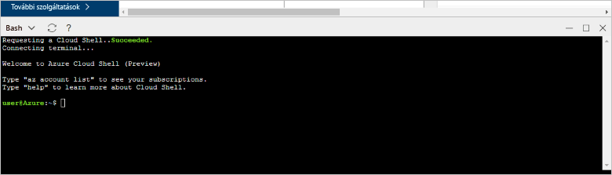

# <a name="create-an-azure-database-for-postgresql-in-the-azure-portal"></a><span data-ttu-id="7d8c4-103">Azure-adatbázis létrehozása PostgreSQL-hez az Azure Portalon</span><span class="sxs-lookup"><span data-stu-id="7d8c4-103">Create an Azure Database for PostgreSQL in the Azure portal</span></span>

<span data-ttu-id="7d8c4-104">A PostgreSQL-hez készült Azure Database felügyelt szolgáltatás, amely lehetővé teszi a magas rendelkezésre állású PostgreSQL-adatbázisok futtatását, kezelését és skálázását a felhőben.</span><span class="sxs-lookup"><span data-stu-id="7d8c4-104">Azure Database for PostgreSQL is a managed service that enables you to run, manage, and scale highly available PostgreSQL databases in the cloud.</span></span> <span data-ttu-id="7d8c4-105">Ez a rövid útmutató bemutatja, hogyan hozhat létre nagyjából öt perc alatt egy Azure-adatbázist PostgreSQL-kiszolgálóhoz az Azure Portal használatával.</span><span class="sxs-lookup"><span data-stu-id="7d8c4-105">This quickstart shows you how to create an Azure Database for PostgreSQL server using the Azure portal in about five minutes.</span></span>

<span data-ttu-id="7d8c4-106">Ha nem rendelkezik Azure-előfizetéssel, első lépésként mindössze néhány perc alatt létrehozhat egy [ingyenes](https://azure.microsoft.com/free/) fiókot.</span><span class="sxs-lookup"><span data-stu-id="7d8c4-106">If you don't have an Azure subscription, create a [free](https://azure.microsoft.com/free/) account before you begin.</span></span>

## <a name="log-in-to-the-azure-portal"></a><span data-ttu-id="7d8c4-107">Jelentkezzen be az Azure portálra.</span><span class="sxs-lookup"><span data-stu-id="7d8c4-107">Log in to the Azure portal</span></span>
<span data-ttu-id="7d8c4-108">Nyissa meg a webböngészőjét, és keresse fel a [Microsoft Azure Portalt](https://portal.azure.com/).</span><span class="sxs-lookup"><span data-stu-id="7d8c4-108">Open your web browser, and navigate to the [Microsoft Azure portal](https://portal.azure.com/).</span></span> <span data-ttu-id="7d8c4-109">Adja meg a hitelesítő adatait a Portalra való bejelentkezéshez.</span><span class="sxs-lookup"><span data-stu-id="7d8c4-109">Enter your credentials to sign in to the portal.</span></span> <span data-ttu-id="7d8c4-110">Az alapértelmezett nézet a szolgáltatási irányítópult.</span><span class="sxs-lookup"><span data-stu-id="7d8c4-110">The default view is your service dashboard.</span></span>

## <a name="create-an-azure-database-for-postgresql"></a><span data-ttu-id="7d8c4-111">Azure-adatbázis létrehozása PostgreSQL-hez</span><span class="sxs-lookup"><span data-stu-id="7d8c4-111">Create an Azure Database for PostgreSQL</span></span>

<span data-ttu-id="7d8c4-112">Az Azure-adatbázis PostgreSQL-kiszolgálóhoz [számítási és tárolási erőforrások](./concepts-compute-unit-and-storage.md) egy meghatározott készletével együtt jön létre.</span><span class="sxs-lookup"><span data-stu-id="7d8c4-112">An Azure Database for PostgreSQL server is created with a defined set of [compute and storage resources](./concepts-compute-unit-and-storage.md).</span></span> <span data-ttu-id="7d8c4-113">A kiszolgáló egy [Azure-erőforráscsoporton](../azure-resource-manager/resource-group-overview.md) belül jön létre.</span><span class="sxs-lookup"><span data-stu-id="7d8c4-113">The server is created within an [Azure resource group](../azure-resource-manager/resource-group-overview.md).</span></span>

<span data-ttu-id="7d8c4-114">Kövesse az alábbi lépéseket az Azure-adatbázis PostgreSQL-kiszolgálóhoz létrehozásához:</span><span class="sxs-lookup"><span data-stu-id="7d8c4-114">Follow these steps to create an Azure Database for PostgreSQL server:</span></span>
1.  <span data-ttu-id="7d8c4-115">Kattintson az Azure Portal bal felső sarkában található **Új** gombra (+).</span><span class="sxs-lookup"><span data-stu-id="7d8c4-115">Click the **New** button (+) found on the upper left-hand corner of the Azure portal.</span></span>
2.  <span data-ttu-id="7d8c4-116">Az **Új** panelen válassza az **Adatbázisok** lehetőséget, majd az **Adatbázisok** panelen válassza az **Azure-adatbázis PostgreSQL-kiszolgálóhoz** lehetőséget.</span><span class="sxs-lookup"><span data-stu-id="7d8c4-116">Select **Databases** from the **New** page, and select **Azure Database for PostgreSQL** from the **Databases** page.</span></span>
 <span data-ttu-id="7d8c4-117"></span><span class="sxs-lookup"><span data-stu-id="7d8c4-117"></span></span>

3.  <span data-ttu-id="7d8c4-118">Töltse ki az új kiszolgáló adatai űrlapot a következő információkkal az előző képen látható módon:</span><span class="sxs-lookup"><span data-stu-id="7d8c4-118">Fill out the new server details form with the following information, as shown on the preceding image:</span></span>

    <span data-ttu-id="7d8c4-119">Beállítás</span><span class="sxs-lookup"><span data-stu-id="7d8c4-119">Setting</span></span>|<span data-ttu-id="7d8c4-120">Ajánlott érték</span><span class="sxs-lookup"><span data-stu-id="7d8c4-120">Suggested value</span></span>|<span data-ttu-id="7d8c4-121">Leírás</span><span class="sxs-lookup"><span data-stu-id="7d8c4-121">Description</span></span>
    ---|---|---
    <span data-ttu-id="7d8c4-122">Kiszolgálónév</span><span class="sxs-lookup"><span data-stu-id="7d8c4-122">Server name</span></span> |<span data-ttu-id="7d8c4-123">*mypgserver-20170401*</span><span class="sxs-lookup"><span data-stu-id="7d8c4-123">*mypgserver-20170401*</span></span>|<span data-ttu-id="7d8c4-124">Válasszon egy egyedi nevet, amely azonosítja a PostgreSQL-kiszolgálóhoz készült Azure-adatbázist.</span><span class="sxs-lookup"><span data-stu-id="7d8c4-124">Choose a unique name that identifies your Azure Database for PostgreSQL server.</span></span> <span data-ttu-id="7d8c4-125">A rendszer hozzáfűzi a *postgres.database.azure.com* tartománynevet ahhoz a kiszolgálónévhez, amelyet az alkalmazások számára megad a csatlakozáshoz.</span><span class="sxs-lookup"><span data-stu-id="7d8c4-125">The domain name *postgres.database.azure.com* is appended to the server name you provide for applications to connect to.</span></span> <span data-ttu-id="7d8c4-126">A kiszolgálónév csak kisbetűket, számokat és a kötőjel (-) karaktert tartalmazhatja, és 3–63 karakter hosszú lehet.</span><span class="sxs-lookup"><span data-stu-id="7d8c4-126">The server name can contain only lowercase letters, numbers, and the hyphen (-) character, and it must contain from 3 through 63 characters.</span></span>
    <span data-ttu-id="7d8c4-127">Előfizetés</span><span class="sxs-lookup"><span data-stu-id="7d8c4-127">Subscription</span></span>|<span data-ttu-id="7d8c4-128">*Az Ön előfizetése*</span><span class="sxs-lookup"><span data-stu-id="7d8c4-128">*Your subscription*</span></span>|<span data-ttu-id="7d8c4-129">A kiszolgálóhoz használni kívánt Azure-előfizetés.</span><span class="sxs-lookup"><span data-stu-id="7d8c4-129">The Azure subscription that you want to use for your server.</span></span> <span data-ttu-id="7d8c4-130">Ha több előfizetéssel rendelkezik, válassza a megfelelő előfizetést, amelyen az erőforrás terhelve van.</span><span class="sxs-lookup"><span data-stu-id="7d8c4-130">If you have multiple subscriptions, choose the appropriate subscription in which the resource is billed for.</span></span>
    <span data-ttu-id="7d8c4-131">Erőforráscsoport</span><span class="sxs-lookup"><span data-stu-id="7d8c4-131">Resource Group</span></span>|<span data-ttu-id="7d8c4-132">*myresourcegroup*</span><span class="sxs-lookup"><span data-stu-id="7d8c4-132">*myresourcegroup*</span></span>| <span data-ttu-id="7d8c4-133">Meghatározhat egy új erőforráscsoport-nevet, vagy használhat egy meglévőt az előfizetéséből.</span><span class="sxs-lookup"><span data-stu-id="7d8c4-133">You may make a new resource group name, or use an existing one from your subscription.</span></span>
    <span data-ttu-id="7d8c4-134">Kiszolgáló-rendszergazdai bejelentkezés</span><span class="sxs-lookup"><span data-stu-id="7d8c4-134">Server admin login</span></span> |<span data-ttu-id="7d8c4-135">*mylogin*</span><span class="sxs-lookup"><span data-stu-id="7d8c4-135">*mylogin*</span></span>| <span data-ttu-id="7d8c4-136">Hozzon létre saját bejelentkezési fiókot a kiszolgálóhoz való csatlakozáshoz.</span><span class="sxs-lookup"><span data-stu-id="7d8c4-136">Make your own login account to use when connecting to the server.</span></span> <span data-ttu-id="7d8c4-137">A rendszergazdai bejelentkezési név nem lehet „azure_superuser”, „azure_pg_admin”, „admin”, „administrator”, „root”, „guest” vagy „public”, és nem kezdődhet a „pg_” előtaggal.</span><span class="sxs-lookup"><span data-stu-id="7d8c4-137">The admin login name cannot be 'azure_superuser', 'azure_pg_admin', 'admin', 'administrator', 'root', 'guest', or 'public', and cannot start with 'pg_'.</span></span>
    <span data-ttu-id="7d8c4-138">Jelszó</span><span class="sxs-lookup"><span data-stu-id="7d8c4-138">Password</span></span> |<span data-ttu-id="7d8c4-139">*A választása szerint*</span><span class="sxs-lookup"><span data-stu-id="7d8c4-139">*Your choice*</span></span> | <span data-ttu-id="7d8c4-140">Hozzon létre egy új jelszót a kiszolgálói rendszergazdai fiók számára.</span><span class="sxs-lookup"><span data-stu-id="7d8c4-140">Create a new password for the server admin account.</span></span> <span data-ttu-id="7d8c4-141">A jelszó 8–128 karakter hosszúságú lehet.</span><span class="sxs-lookup"><span data-stu-id="7d8c4-141">Must contain from 8 to 128 characters.</span></span> <span data-ttu-id="7d8c4-142">A jelszónak tartalmaznia kell karaktereket a következő kategóriák közül legalább háromból: angol nagybetűs karakterek, angol kisbetűs karakterek, számjegyek (0–9) és nem alfanumerikus karakterek (!, $, #, % stb.).</span><span class="sxs-lookup"><span data-stu-id="7d8c4-142">Your password must contain characters from three of the following categories – English uppercase letters, English lowercase letters, numbers (0-9), and non-alphanumeric characters (!, $, #, %, etc.).</span></span>
    <span data-ttu-id="7d8c4-143">Hely</span><span class="sxs-lookup"><span data-stu-id="7d8c4-143">Location</span></span>|<span data-ttu-id="7d8c4-144">*A felhasználókhoz legközelebb eső régió*</span><span class="sxs-lookup"><span data-stu-id="7d8c4-144">*The region closest to your users*</span></span>| <span data-ttu-id="7d8c4-145">Válassza ki a felhasználókhoz legközelebb eső helyet.</span><span class="sxs-lookup"><span data-stu-id="7d8c4-145">Choose the location that's closest to your users.</span></span>
    <span data-ttu-id="7d8c4-146">PostgreSQL-verzió</span><span class="sxs-lookup"><span data-stu-id="7d8c4-146">PostgreSQL Version</span></span>|<span data-ttu-id="7d8c4-147">*Válassza a legújabb verziót*</span><span class="sxs-lookup"><span data-stu-id="7d8c4-147">*Choose the latest version*</span></span>| <span data-ttu-id="7d8c4-148">Válassza a legújabb verziót, ha nincsenek egyedi igényei.</span><span class="sxs-lookup"><span data-stu-id="7d8c4-148">Choose the latest version unless you have specific requirements.</span></span>
    <span data-ttu-id="7d8c4-149">Tarifacsomag</span><span class="sxs-lookup"><span data-stu-id="7d8c4-149">Pricing Tier</span></span> | <span data-ttu-id="7d8c4-150">**Alapszintű**, **50 számítási egység** **50 GB**</span><span class="sxs-lookup"><span data-stu-id="7d8c4-150">**Basic**, **50 Compute Units** **50 GB**</span></span> | <span data-ttu-id="7d8c4-151">Kattintson a **Tarifacsomag** parancsra az új adatbázis szolgáltatás- és teljesítményszintjének megadásához.</span><span class="sxs-lookup"><span data-stu-id="7d8c4-151">Click **Pricing tier** to specify the service tier and performance level for your new database.</span></span> <span data-ttu-id="7d8c4-152">Válassza a felső fülön az Alapszintű tarifacsomagot.</span><span class="sxs-lookup"><span data-stu-id="7d8c4-152">Choose Basic tier in the tab at the top.</span></span> <span data-ttu-id="7d8c4-153">Kattintson a Számítási egységek csúszka bal oldali végére az ebben a rövid útmutatóban elérhető legkisebb mennyiség kiválasztásához.</span><span class="sxs-lookup"><span data-stu-id="7d8c4-153">Click the left end of the Compute Units slider to adjust the value to the least amount available for this quickstart.</span></span> <span data-ttu-id="7d8c4-154">Kattintson az **OK** gombra a tarifacsomag-beállítás mentéséhez.</span><span class="sxs-lookup"><span data-stu-id="7d8c4-154">Click **Ok** to save the pricing tier selection.</span></span> <span data-ttu-id="7d8c4-155">Tekintse meg a következő képernyőképet.</span><span class="sxs-lookup"><span data-stu-id="7d8c4-155">See the following screenshot.</span></span>
    | <span data-ttu-id="7d8c4-156">Rögzítés az irányítópulton</span><span class="sxs-lookup"><span data-stu-id="7d8c4-156">Pin to dashboard</span></span> | <span data-ttu-id="7d8c4-157">Jelölőnégyzet</span><span class="sxs-lookup"><span data-stu-id="7d8c4-157">Check</span></span> | <span data-ttu-id="7d8c4-158">A **Rögzítés az irányítópulton** lehetőség kiválasztásával egyszerűen nyomon követheti a kiszolgálót az Azure Portal irányítópultjának első lapján.</span><span class="sxs-lookup"><span data-stu-id="7d8c4-158">Check the **Pin to dashboard** option to allow easy tracking of your server on the front dashboard page of your Azure portal.</span></span>

  > [!IMPORTANT]
  > <span data-ttu-id="7d8c4-159">A kiszolgáló itt megadott rendszergazdai bejelentkezési nevét és jelszavát kell majd használnia a rövid útmutató későbbi szakaszaiban a kiszolgálóra és az adatbázisaira való bejelentkezéshez.</span><span class="sxs-lookup"><span data-stu-id="7d8c4-159">The server admin login and password that you specify here are required to log in to the server and its databases later in this quick start.</span></span> <span data-ttu-id="7d8c4-160">Jegyezze meg vagy jegyezze fel ezt az információt későbbi használatra.</span><span class="sxs-lookup"><span data-stu-id="7d8c4-160">Remember or record this information for later use.</span></span>

    

4.  <span data-ttu-id="7d8c4-162">A kiszolgáló üzembe helyezéséhez kattintson a **Létrehozás** elemre.</span><span class="sxs-lookup"><span data-stu-id="7d8c4-162">Click **Create** to provision the server.</span></span> <span data-ttu-id="7d8c4-163">Az üzembe helyezés eltarthat néhány percig, de legfeljebb 20 percet vesz igénybe.</span><span class="sxs-lookup"><span data-stu-id="7d8c4-163">Provisioning takes a few minutes, up to 20 minutes maximum.</span></span>

5.  <span data-ttu-id="7d8c4-164">Az eszköztáron kattintson az **Értesítések** parancsra az üzembe helyezési folyamat megfigyeléséhez.</span><span class="sxs-lookup"><span data-stu-id="7d8c4-164">On the toolbar, click **Notifications** to monitor the deployment process.</span></span>
 <span data-ttu-id="7d8c4-165"></span><span class="sxs-lookup"><span data-stu-id="7d8c4-165"></span></span>
   
  <span data-ttu-id="7d8c4-166">Alapértelmezés szerint a **postgres** adatbázis a kiszolgáló alatt jön létre.</span><span class="sxs-lookup"><span data-stu-id="7d8c4-166">By default, **postgres** database gets created under your server.</span></span> <span data-ttu-id="7d8c4-167">A [postgres](https://www.postgresql.org/docs/9.6/static/app-initdb.html) adatbázis egy alapértelmezett adatbázis, amelyet a felhasználók, segédprogramok és külső féltől származó alkalmazások általi használatra szántak.</span><span class="sxs-lookup"><span data-stu-id="7d8c4-167">The [postgres](https://www.postgresql.org/docs/9.6/static/app-initdb.html) database is a default database meant for use by users, utilities, and third-party applications.</span></span> 

## <a name="configure-a-server-level-firewall-rule"></a><span data-ttu-id="7d8c4-168">Kiszolgálószintű tűzfalszabály konfigurálása</span><span class="sxs-lookup"><span data-stu-id="7d8c4-168">Configure a server-level firewall rule</span></span>

<span data-ttu-id="7d8c4-169">Az Azure-adatbázis PostgreSQL-hez szolgáltatás a kiszolgáló szintjén hoz létre tűzfalat.</span><span class="sxs-lookup"><span data-stu-id="7d8c4-169">The Azure Database for PostgreSQL service creates a firewall at the server-level.</span></span> <span data-ttu-id="7d8c4-170">Ez a tűzfal megakadályozza, hogy a külső alkalmazások és eszközök csatlakozzanak a kiszolgálóhoz vagy a kiszolgálón lévő adatbázisokhoz, kivéve, ha olyan tűzfalszabályt hoz létre, amely adott IP-címek számára megnyitja a tűzfalat.</span><span class="sxs-lookup"><span data-stu-id="7d8c4-170">This firewall prevents external applications and tools from connecting to the server and any databases on the server, unless a firewall rule is created to open the firewall for specific IP addresses.</span></span> 

1.  <span data-ttu-id="7d8c4-171">Az üzembe helyezés befejeződése után keresse meg a kiszolgálót.</span><span class="sxs-lookup"><span data-stu-id="7d8c4-171">Locate your server after the deployment completes.</span></span> <span data-ttu-id="7d8c4-172">Ha szükséges, használja a keresési funkciót.</span><span class="sxs-lookup"><span data-stu-id="7d8c4-172">If needed, you can search for it.</span></span> <span data-ttu-id="7d8c4-173">Például kattintson a **Minden erőforrás** lehetőségre a bal oldali menüben, és írja be a kiszolgáló nevét (például: *mypgserver-20170401*) az újonnan létrehozott kiszolgáló megkereséséhez.</span><span class="sxs-lookup"><span data-stu-id="7d8c4-173">For example, click **All Resources** from the left-hand menu and type in the server name (such as the example *mypgserver-20170401*) to search for your newly created server.</span></span> <span data-ttu-id="7d8c4-174">Kattintson a kiszolgálónévre a találatok listájában.</span><span class="sxs-lookup"><span data-stu-id="7d8c4-174">Click on your server name listed in the search result.</span></span> <span data-ttu-id="7d8c4-175">Megnyílik a kiszolgáló **Áttekintés** oldala, amely további konfigurációs lehetőségeket biztosít.</span><span class="sxs-lookup"><span data-stu-id="7d8c4-175">The **Overview** page for your server opens and provides options for further configuration.</span></span>
 
    

2.  <span data-ttu-id="7d8c4-177">A kiszolgáló lapján válassza a **Kapcsolatbiztonság** elemet.</span><span class="sxs-lookup"><span data-stu-id="7d8c4-177">On the server page, select **Connection security**.</span></span> 
    <span data-ttu-id="7d8c4-178"></span><span class="sxs-lookup"><span data-stu-id="7d8c4-178"></span></span>

3.  <span data-ttu-id="7d8c4-179">A **Tűzfalszabályok** szakaszban kattintson az üres mezőbe a **Szabály neve** oszlopban új tűzfalszabály létrehozásának megkezdéséhez.</span><span class="sxs-lookup"><span data-stu-id="7d8c4-179">Under the **Firewall rules** heading, click in the blank text box in the **Rule Name** column to begin creating the firewall rule.</span></span> 

    <span data-ttu-id="7d8c4-180">Ebben a rövid útmutatóban engedélyezzünk minden bemenő IP-címet a kiszolgálón. Ehhez adjuk meg az egyes oszlopokban a következő értékeket:</span><span class="sxs-lookup"><span data-stu-id="7d8c4-180">For this quick start, let's allow all IP addresses into the server by filling in the text box in each column with the following values:</span></span>

    <span data-ttu-id="7d8c4-181">Szabály neve</span><span class="sxs-lookup"><span data-stu-id="7d8c4-181">Rule Name</span></span> | <span data-ttu-id="7d8c4-182">Kezdő IP-cím</span><span class="sxs-lookup"><span data-stu-id="7d8c4-182">Start IP</span></span> | <span data-ttu-id="7d8c4-183">Záró IP-cím</span><span class="sxs-lookup"><span data-stu-id="7d8c4-183">End IP</span></span> 
    ---|---|---
    <span data-ttu-id="7d8c4-184">AllowAllIps</span><span class="sxs-lookup"><span data-stu-id="7d8c4-184">AllowAllIps</span></span> |  <span data-ttu-id="7d8c4-185">0.0.0.0</span><span class="sxs-lookup"><span data-stu-id="7d8c4-185">0.0.0.0</span></span> | <span data-ttu-id="7d8c4-186">255.255.255.255</span><span class="sxs-lookup"><span data-stu-id="7d8c4-186">255.255.255.255</span></span>

4. <span data-ttu-id="7d8c4-187">A Kapcsolatbiztonság lap felső eszköztárában kattintson a **Mentés** gombra.</span><span class="sxs-lookup"><span data-stu-id="7d8c4-187">On the upper toolbar of the Connection security page, click **Save**.</span></span> <span data-ttu-id="7d8c4-188">Várjon néhány pillanatot a Kapcsolatbiztonság frissítésének sikeres befejezését jelző értesítés megjelenéséig, mielőtt folytatná a műveletet.</span><span class="sxs-lookup"><span data-stu-id="7d8c4-188">Wait for a few moments and notice the notification showing that updating connection security has finished successfully before continuing.</span></span>

    > [!NOTE]
    > <span data-ttu-id="7d8c4-189">A PostgreSQL-kiszolgálóhoz készült Azure-adatbázis kapcsolatai az 5432-es porton keresztül kommunikálnak.</span><span class="sxs-lookup"><span data-stu-id="7d8c4-189">Connections to your Azure Database for PostgreSQL server communicate over port 5432.</span></span> <span data-ttu-id="7d8c4-190">Ha vállalati hálózaton belülről próbál csatlakozni, elképzelhető, hogy a hálózati tűzfal nem engedélyezi a kimenő forgalmat az 5432-es porton keresztül.</span><span class="sxs-lookup"><span data-stu-id="7d8c4-190">If you are trying to connect from within a corporate network, outbound traffic over port 5432 may not be allowed by your network's firewall.</span></span> <span data-ttu-id="7d8c4-191">Ebben az esetben addig nem tud csatlakozni a kiszolgálóhoz, amíg az informatikai részleg meg nem nyitja az 5432-es portot.</span><span class="sxs-lookup"><span data-stu-id="7d8c4-191">If so, you will not be able to connect to your server unless your IT department opens port 5432.</span></span>
    >

## <a name="get-the-connection-information"></a><span data-ttu-id="7d8c4-192">Kapcsolatadatok lekérése</span><span class="sxs-lookup"><span data-stu-id="7d8c4-192">Get the connection information</span></span>

<span data-ttu-id="7d8c4-193">A PostgreSQL-kiszolgálóhoz készült Azure-adatbázis létrehozásakor egy **postgres** nevű alapértelmezett adatbázis jön létre.</span><span class="sxs-lookup"><span data-stu-id="7d8c4-193">When we created our Azure Database for PostgreSQL server, a default database named **postgres** gets created.</span></span> <span data-ttu-id="7d8c4-194">Az adatbázis-kiszolgálóhoz való csatlakozáshoz meg kell jegyeznie a teljes kiszolgálónevet és a rendszergazdai bejelentkezési hitelesítő adatokat.</span><span class="sxs-lookup"><span data-stu-id="7d8c4-194">To connect to your database server, you need to remember the full server name and admin login credentials.</span></span> <span data-ttu-id="7d8c4-195">Ezeket a rövid útmutatóban korábban már feljegyezhette.</span><span class="sxs-lookup"><span data-stu-id="7d8c4-195">You may have noted those values earlier in the quick start article.</span></span> <span data-ttu-id="7d8c4-196">Ha nem jegyezte fel, a kiszolgáló nevét és bejelentkezési adatait megtalálhatja a kiszolgáló Áttekintés lapján az Azure Portalon.</span><span class="sxs-lookup"><span data-stu-id="7d8c4-196">In case you did not, you can easily find the server name and login information from the server Overview page in the Azure portal.</span></span>

1. <span data-ttu-id="7d8c4-197">Nyissa meg kiszolgáló **Áttekintés** lapját.</span><span class="sxs-lookup"><span data-stu-id="7d8c4-197">Open your server's **Overview** page.</span></span> <span data-ttu-id="7d8c4-198">Jegyezze fel a **Kiszolgálónevet** és a **Kiszolgáló-rendszergazdai bejelentkezési nevet**.</span><span class="sxs-lookup"><span data-stu-id="7d8c4-198">Make a note of the **Server name** and **Server admin login name**.</span></span>
    <span data-ttu-id="7d8c4-199">Helyezze az egérmutatót az egyes mezők fölé. Ekkor a szövegtől jobbra megjelenik a másolási ikon.</span><span class="sxs-lookup"><span data-stu-id="7d8c4-199">Hover your cursor over each field, and the copy icon appears to the right of the text.</span></span> <span data-ttu-id="7d8c4-200">Az értékek másolásához kattintson igény szerint a másolási ikonra.</span><span class="sxs-lookup"><span data-stu-id="7d8c4-200">Click the copy icon as needed to copy the values.</span></span>

 

## <a name="connect-to-postgresql-database-using-psql-in-cloud-shell"></a><span data-ttu-id="7d8c4-202">Csatlakozás a PostgreSQL-adatbázishoz a psql használatával a Cloud Shell-ben</span><span class="sxs-lookup"><span data-stu-id="7d8c4-202">Connect to PostgreSQL database using psql in Cloud Shell</span></span>

<span data-ttu-id="7d8c4-203">Számos különféle alkalmazással csatlakozhat a PostgreSQL-kiszolgálóhoz készült Azure-adatbázishoz.</span><span class="sxs-lookup"><span data-stu-id="7d8c4-203">There are a number of applications you can use to connect to your Azure Database for PostgreSQL server.</span></span> <span data-ttu-id="7d8c4-204">Először használjuk a psql parancssori segédprogramot a kiszolgálóhoz való csatlakozás bemutatásához.</span><span class="sxs-lookup"><span data-stu-id="7d8c4-204">Let's first use the psql command-line utility to illustrate how to connect to the server.</span></span>  <span data-ttu-id="7d8c4-205">Az itt leírtak szerint használhatja a webböngészőt és az Azure Cloud Shellt, és nem szükséges más szoftvert telepítenie.</span><span class="sxs-lookup"><span data-stu-id="7d8c4-205">You can use a web browser and the Azure Cloud Shell as described here without the need to install any additional software.</span></span> <span data-ttu-id="7d8c4-206">Ha a gépén helyileg telepítve van a psql segédprogram, onnan is csatlakozhat.</span><span class="sxs-lookup"><span data-stu-id="7d8c4-206">If you have the psql utility installed locally on your own machine, you can connect from there as well.</span></span>

1. <span data-ttu-id="7d8c4-207">Indítsa el az Azure Cloud Shell-t a felső navigációs ablakban található terminálikonnal.</span><span class="sxs-lookup"><span data-stu-id="7d8c4-207">Launch the Azure Cloud Shell via the terminal icon on the top navigation pane.</span></span>

   

2. <span data-ttu-id="7d8c4-209">Az Azure Cloud Shell megnyílik a böngészőben, ami lehetővé teszi Bash rendszerhéjparancsok beírását.</span><span class="sxs-lookup"><span data-stu-id="7d8c4-209">The Azure Cloud Shell opens in your browser, enabling you to type bash shell commands.</span></span>

   

3. <span data-ttu-id="7d8c4-211">A Cloud Shell parancssornál csatlakozzon a PostgreSQL-kiszolgálóhoz készült Azure-adatbázisban lévő adatbázishoz. Ehhez írja be a psql parancsot a zöld színű parancssorba.</span><span class="sxs-lookup"><span data-stu-id="7d8c4-211">At the Cloud Shell prompt, connect to a database in your Azure Database for PostgreSQL server by typing the psql command line at the green prompt.</span></span>

    <span data-ttu-id="7d8c4-212">A következő formátum segítségével kapcsolódhat egy [psql](https://www.postgresql.org/docs/9.6/static/app-psql.html) segédprogrammal rendelkező Azure-adatbázis PostgreSQL-kiszolgálóhoz:</span><span class="sxs-lookup"><span data-stu-id="7d8c4-212">The following format is used to connect to an Azure Database for PostgreSQL server with the [psql](https://www.postgresql.org/docs/9.6/static/app-psql.html) utility:</span></span>
    ```bash
    psql --host=<yourserver> --port=<port> --username=<server admin login> --dbname=<database name>
    ```

    <span data-ttu-id="7d8c4-213">Például a következő parancs egy példakiszolgálóhoz csatlakozik:</span><span class="sxs-lookup"><span data-stu-id="7d8c4-213">For example, the following command connects to an example server:</span></span>

    ```bash
    psql --host=mypgserver-20170401.postgres.database.azure.com --port=5432 --username=mylogin@mypgserver-20170401 --dbname=postgres
    ```

    <span data-ttu-id="7d8c4-214">psql paraméter</span><span class="sxs-lookup"><span data-stu-id="7d8c4-214">psql parameter</span></span> |<span data-ttu-id="7d8c4-215">Ajánlott érték</span><span class="sxs-lookup"><span data-stu-id="7d8c4-215">Suggested value</span></span>|<span data-ttu-id="7d8c4-216">Leírás</span><span class="sxs-lookup"><span data-stu-id="7d8c4-216">Description</span></span>
    ---|---|---
    <span data-ttu-id="7d8c4-217">--host</span><span class="sxs-lookup"><span data-stu-id="7d8c4-217">--host</span></span> | <span data-ttu-id="7d8c4-218">*kiszolgáló neve*</span><span class="sxs-lookup"><span data-stu-id="7d8c4-218">*server name*</span></span> | <span data-ttu-id="7d8c4-219">Adja meg azt a kiszolgálónevet, amelyet korábban a PostgreSQL-hez készült Azure-adatbázis létrehozásakor használt.</span><span class="sxs-lookup"><span data-stu-id="7d8c4-219">Specify the server name value that was used when you created the Azure Database for PostgreSQL earlier.</span></span> <span data-ttu-id="7d8c4-220">Az itt látható példakiszolgáló a mypgserver-20170401.postgres.database.azure.com. Használja a teljes tartománynevet (\*.postgres.database.azure.com), ahogyan az a példában látható.</span><span class="sxs-lookup"><span data-stu-id="7d8c4-220">Our example server shown is mypgserver-20170401.postgres.database.azure.com. Use the fully qualified domain name (\*.postgres.database.azure.com) as shown in the example.</span></span> <span data-ttu-id="7d8c4-221">Ha nem emlékszik a kiszolgáló nevére, a kapcsolati adatok lekéréséhez kövesse az előző szakasz lépéseit.</span><span class="sxs-lookup"><span data-stu-id="7d8c4-221">Follow the steps in the previous section to get the connection information if you do not remember your server name.</span></span> 
    <span data-ttu-id="7d8c4-222">--port</span><span class="sxs-lookup"><span data-stu-id="7d8c4-222">--port</span></span> | <span data-ttu-id="7d8c4-223">**5432**</span><span class="sxs-lookup"><span data-stu-id="7d8c4-223">**5432**</span></span> | <span data-ttu-id="7d8c4-224">A PostgreSQL-hez készült Azure-adatbázishoz való csatlakozáskor mindig használja az 5432-es portot.</span><span class="sxs-lookup"><span data-stu-id="7d8c4-224">Always use port 5432 when connecting to Azure Database for PostgreSQL.</span></span> 
    <span data-ttu-id="7d8c4-225">--username</span><span class="sxs-lookup"><span data-stu-id="7d8c4-225">--username</span></span> | <span data-ttu-id="7d8c4-226">*kiszolgáló-rendszergazdai bejelentkezési név*</span><span class="sxs-lookup"><span data-stu-id="7d8c4-226">*server admin login name*</span></span> |<span data-ttu-id="7d8c4-227">Írja be a kiszolgáló-rendszergazdai bejelentkezési felhasználónevet, amelyet korábban a PostgreSQL-hez készült Azure-adatbázis létrehozásakor adott meg.</span><span class="sxs-lookup"><span data-stu-id="7d8c4-227">Type in the  server admin login username supplied when you created the Azure Database for PostgreSQL earlier.</span></span> <span data-ttu-id="7d8c4-228">Ha nem emlékszik a felhasználónévre, a kapcsolati adatok lekéréséhez kövesse az előző szakasz lépéseit.</span><span class="sxs-lookup"><span data-stu-id="7d8c4-228">Follow the steps in the previous section to get the connection information if you do not remember the username.</span></span>  <span data-ttu-id="7d8c4-229">A formátum *username@servername*.</span><span class="sxs-lookup"><span data-stu-id="7d8c4-229">The format is *username@servername*.</span></span>
    <span data-ttu-id="7d8c4-230">--dbname</span><span class="sxs-lookup"><span data-stu-id="7d8c4-230">--dbname</span></span> | <span data-ttu-id="7d8c4-231">**postgres**</span><span class="sxs-lookup"><span data-stu-id="7d8c4-231">**postgres**</span></span> | <span data-ttu-id="7d8c4-232">Az első kapcsolathoz használja a rendszer által létrehozott alapértelmezett *postgres* adatbázisnevet.</span><span class="sxs-lookup"><span data-stu-id="7d8c4-232">Use the default system generated database name *postgres* for the first connection.</span></span> <span data-ttu-id="7d8c4-233">Később létrehozhatja a saját adatbázisát.</span><span class="sxs-lookup"><span data-stu-id="7d8c4-233">Later you create your own database.</span></span>

    <span data-ttu-id="7d8c4-234">Miután a saját paraméterértékeivel futtatta a psql parancsot, a rendszer felkéri, hogy adja meg a kiszolgáló-rendszergazdai jelszót.</span><span class="sxs-lookup"><span data-stu-id="7d8c4-234">After running the psql command, with your own parameter values, you are prompted to type the server admin password.</span></span> <span data-ttu-id="7d8c4-235">Ez ugyanaz az a jelszó, amelyet a kiszolgáló létrehozásakor adott meg.</span><span class="sxs-lookup"><span data-stu-id="7d8c4-235">This password is the same that you provided when you created the server.</span></span> 

    <span data-ttu-id="7d8c4-236">psql paraméter</span><span class="sxs-lookup"><span data-stu-id="7d8c4-236">psql parameter</span></span> |<span data-ttu-id="7d8c4-237">Ajánlott érték</span><span class="sxs-lookup"><span data-stu-id="7d8c4-237">Suggested value</span></span>|<span data-ttu-id="7d8c4-238">Leírás</span><span class="sxs-lookup"><span data-stu-id="7d8c4-238">Description</span></span>
    ---|---|---
    <span data-ttu-id="7d8c4-239">jelszó</span><span class="sxs-lookup"><span data-stu-id="7d8c4-239">password</span></span> | <span data-ttu-id="7d8c4-240">*az Ön rendszergazdai jelszava*</span><span class="sxs-lookup"><span data-stu-id="7d8c4-240">*your admin password*</span></span> | <span data-ttu-id="7d8c4-241">Vegye figyelembe, hogy a beírt jelszókarakterek nem jelennek meg a Bash parancssorban.</span><span class="sxs-lookup"><span data-stu-id="7d8c4-241">Note, the typed password characters are not shown on the bash prompt.</span></span> <span data-ttu-id="7d8c4-242">Írja be az összes karaktert, majd nyomja le az Enter billentyűt a hitelesítéshez és a csatlakozáshoz.</span><span class="sxs-lookup"><span data-stu-id="7d8c4-242">Press enter after you have typed all the characters to authenticate and connect.</span></span>

    <span data-ttu-id="7d8c4-243">Ha csatlakoztatva van, a psql segédprogram postgres parancssort jelenít meg, ahová az SQL-parancsokat beírhatja.</span><span class="sxs-lookup"><span data-stu-id="7d8c4-243">Once connected, the psql utility displays a postgres prompt where you type sql commands.</span></span> <span data-ttu-id="7d8c4-244">A rendszer a kezdeti kapcsolati kimeneten egy figyelmeztetést jeleníthet meg, mivel az Azure Cloud Shell psql-jének verziója eltérhet a PostgreSQL-kiszolgálóhoz készült Azure-adatbázis verziószámától.</span><span class="sxs-lookup"><span data-stu-id="7d8c4-244">In the initial connection output, a warning may be displayed since the psql in the Azure Cloud Shell may be a different  version than the Azure Database for PostgreSQL server version.</span></span> 
    
    <span data-ttu-id="7d8c4-245">Példa psql kimenetre:</span><span class="sxs-lookup"><span data-stu-id="7d8c4-245">Example psql output:</span></span>
    ```bash
    psql (9.5.7, server 9.6.2)
    WARNING: psql major version 9.5, server major version 9.6.
        Some psql features might not work.
    SSL connection (protocol: TLSv1.2, cipher: ECDHE-RSA-AES256-SHA384, bits: 256, compression: off)
    Type "help" for help.
   
    postgres=> 
    ```

    > [!TIP]
    > <span data-ttu-id="7d8c4-246">Ha a tűzfal nincs konfigurálva az Azure Cloud Shell IP-címének engedélyezésére, a következő hiba jelenik meg:</span><span class="sxs-lookup"><span data-stu-id="7d8c4-246">If the firewall is not configured to allow the IP address of the Azure Cloud Shell, the following error occurs:</span></span>
    > 
    > <span data-ttu-id="7d8c4-247">"psql: FATAL:  no pg_hba.conf entry for host "138.91.195.82", user "mylogin", database "postgres", SSL on FATAL:  SSL connection is required.</span><span class="sxs-lookup"><span data-stu-id="7d8c4-247">"psql: FATAL:  no pg_hba.conf entry for host "138.91.195.82", user "mylogin", database "postgres", SSL on FATAL:  SSL connection is required.</span></span> <span data-ttu-id="7d8c4-248">Please specify SSL options and retry.</span><span class="sxs-lookup"><span data-stu-id="7d8c4-248">Please specify SSL options and retry.</span></span>
    > 
    > <span data-ttu-id="7d8c4-249">A hiba elhárításához győződjön meg róla, hogy a kiszolgáló konfigurációja megegyezik a cikk *Kiszolgálószintű tűzfalszabály konfigurálása* részében található lépésekkel.</span><span class="sxs-lookup"><span data-stu-id="7d8c4-249">To resolve the error, make sure the server configuration matches the steps in the *Configure a server-level firewall rule* section of the article.</span></span>

4.  <span data-ttu-id="7d8c4-250">Hozzon létre egy üres adatbázist a következő parancs beírásával a parancssorba:</span><span class="sxs-lookup"><span data-stu-id="7d8c4-250">Create a blank database at the prompt by typing the following command:</span></span>
    ```bash
    CREATE DATABASE mypgsqldb;
    ```
    <span data-ttu-id="7d8c4-251">A parancs teljesítése pár percet is igénybe vehet.</span><span class="sxs-lookup"><span data-stu-id="7d8c4-251">The command may take a few moments to complete.</span></span> 

5.  <span data-ttu-id="7d8c4-252">Amikor a rendszer kéri, hajtsa végre a következő parancsot, a kapcsolat átváltásához az újonnan létrehozott adatbázisra **mypgsqldb**.</span><span class="sxs-lookup"><span data-stu-id="7d8c4-252">At the prompt, execute the following command to switch connection to the newly created database **mypgsqldb**.</span></span>
    ```bash
    \c mypgsqldb
    ```

6.  <span data-ttu-id="7d8c4-253">A psql-ből való kilépéshez írja be a \q karakterláncot, majd nyomja le az ENTER billentyűt.</span><span class="sxs-lookup"><span data-stu-id="7d8c4-253">Type \q and then press ENTER to quit psql.</span></span> <span data-ttu-id="7d8c4-254">Miután végzett, bezárhatja az Azure Cloud Shellt.</span><span class="sxs-lookup"><span data-stu-id="7d8c4-254">You can close the Azure Cloud Shell after you are done.</span></span>

<span data-ttu-id="7d8c4-255">Ezzel csatlakozott a PostgreSQL-hez készült Azure-adatbázishoz, és létrehozott egy üres felhasználói adatbázist.</span><span class="sxs-lookup"><span data-stu-id="7d8c4-255">Now you have connected to the Azure Database for PostgreSQL and created a blank user database.</span></span> <span data-ttu-id="7d8c4-256">Folytassa a következő szakasszal, amelyből megtudhatja, hogyan csatlakozhat egy másik ismert eszköz, a pgAdmin segítségével.</span><span class="sxs-lookup"><span data-stu-id="7d8c4-256">Continue to the next section to connect using another common tool, pgAdmin.</span></span>

## <a name="connect-to-postgresql-database-using-pgadmin"></a><span data-ttu-id="7d8c4-257">Csatlakozás a PostgreSQL-adatbázishoz a pgAdmin használatával</span><span class="sxs-lookup"><span data-stu-id="7d8c4-257">Connect to PostgreSQL database using pgAdmin</span></span>

<span data-ttu-id="7d8c4-258">Kapcsolódás az Azure PostgreSQL-kiszolgálóhoz a _pgAdmin_ GUI-eszköz használatával</span><span class="sxs-lookup"><span data-stu-id="7d8c4-258">To connect to Azure PostgreSQL server using the GUI tool _pgAdmin_</span></span>
1.  <span data-ttu-id="7d8c4-259">Indítsa el a MySQL _pgAdmin_ alkalmazást az ügyfélszámítógépen.</span><span class="sxs-lookup"><span data-stu-id="7d8c4-259">Launch the _pgAdmin_ application on your client computer.</span></span> <span data-ttu-id="7d8c4-260">A _pgAdmin-t_ http://www.pgadmin.org/ oldalról telepítheti.</span><span class="sxs-lookup"><span data-stu-id="7d8c4-260">You can install _pgAdmin_ from http://www.pgadmin.org/.</span></span>
2.  <span data-ttu-id="7d8c4-261">Kattintson az Irányítópult lap közepén lévő **Gyorshivatkozások** szakasz **Új kiszolgáló hozzáadása** ikonjára.</span><span class="sxs-lookup"><span data-stu-id="7d8c4-261">Click the **Add New Server** icon from the **Quick Links** section in the center of the Dashboard page.</span></span>
3.  <span data-ttu-id="7d8c4-262">A **Kiszolgáló létrehozása** párbeszédpanel **Általános** lapján adjon egy egyedi rövid nevet a kiszolgálónak, például **Azure PostgreSQL Server**.</span><span class="sxs-lookup"><span data-stu-id="7d8c4-262">In the **Create - Server** dialog box **General** tab, enter a unique friendly Name for the server, such as **Azure PostgreSQL Server**.</span></span>
<span data-ttu-id="7d8c4-263"></span><span class="sxs-lookup"><span data-stu-id="7d8c4-263"></span></span>
4.  <span data-ttu-id="7d8c4-264">A **Kiszolgáló létrehozása** párbeszédpanel **Kapcsolat** lapján használja a beállításokat, ahogyan meg vannak adva, majd kattintson a **Mentés** gombra.</span><span class="sxs-lookup"><span data-stu-id="7d8c4-264">In the **Create - Server** dialog box, **Connection** tab, use the settings as specified and click **Save**.</span></span>
   <span data-ttu-id="7d8c4-265"></span><span class="sxs-lookup"><span data-stu-id="7d8c4-265"></span></span>

    <span data-ttu-id="7d8c4-266">pgAdmin-paraméter</span><span class="sxs-lookup"><span data-stu-id="7d8c4-266">pgAdmin parameter</span></span> |<span data-ttu-id="7d8c4-267">Ajánlott érték</span><span class="sxs-lookup"><span data-stu-id="7d8c4-267">Suggested value</span></span>|<span data-ttu-id="7d8c4-268">Leírás</span><span class="sxs-lookup"><span data-stu-id="7d8c4-268">Description</span></span>
    ---|---|---
    <span data-ttu-id="7d8c4-269">Gazdagépnév/-cím</span><span class="sxs-lookup"><span data-stu-id="7d8c4-269">Host Name/Address</span></span> | <span data-ttu-id="7d8c4-270">*kiszolgáló neve*</span><span class="sxs-lookup"><span data-stu-id="7d8c4-270">*server name*</span></span> | <span data-ttu-id="7d8c4-271">Adja meg azt a kiszolgálónevet, amelyet korábban a PostgreSQL-hez készült Azure-adatbázis létrehozásakor használt.</span><span class="sxs-lookup"><span data-stu-id="7d8c4-271">Specify the server name value that was used when you created the Azure Database for PostgreSQL earlier.</span></span> <span data-ttu-id="7d8c4-272">Az itt látható példakiszolgáló a mypgserver-20170401.postgres.database.azure.com. Használja a teljes tartománynevet (\*.postgres.database.azure.com), ahogyan az a példában látható.</span><span class="sxs-lookup"><span data-stu-id="7d8c4-272">Our example server shown is mypgserver-20170401.postgres.database.azure.com. Use the fully qualified domain name (\*.postgres.database.azure.com) as shown in the example.</span></span> <span data-ttu-id="7d8c4-273">Ha nem emlékszik a kiszolgáló nevére, a kapcsolati adatok lekéréséhez kövesse az előző szakasz lépéseit.</span><span class="sxs-lookup"><span data-stu-id="7d8c4-273">Follow the steps in the previous section to get the connection information if you do not remember your server name.</span></span> 
    <span data-ttu-id="7d8c4-274">Port</span><span class="sxs-lookup"><span data-stu-id="7d8c4-274">Port</span></span> | <span data-ttu-id="7d8c4-275">**5432**</span><span class="sxs-lookup"><span data-stu-id="7d8c4-275">**5432**</span></span> | <span data-ttu-id="7d8c4-276">A PostgreSQL-hez készült Azure-adatbázishoz való csatlakozáskor mindig használja az 5432-es portot.</span><span class="sxs-lookup"><span data-stu-id="7d8c4-276">Always use port 5432 when connecting to Azure Database for PostgreSQL.</span></span>  
    <span data-ttu-id="7d8c4-277">Karbantartási adatbázis</span><span class="sxs-lookup"><span data-stu-id="7d8c4-277">Maintenance Database</span></span> | <span data-ttu-id="7d8c4-278">**postgres**</span><span class="sxs-lookup"><span data-stu-id="7d8c4-278">**postgres**</span></span> | <span data-ttu-id="7d8c4-279">Használja a rendszer által létrehozott alapértelmezett *postgres* adatbázisnevet.</span><span class="sxs-lookup"><span data-stu-id="7d8c4-279">Use the default system generated database name *postgres*.</span></span>
    <span data-ttu-id="7d8c4-280">Felhasználónév</span><span class="sxs-lookup"><span data-stu-id="7d8c4-280">User Name</span></span> | <span data-ttu-id="7d8c4-281">*kiszolgáló-rendszergazdai bejelentkezési név*</span><span class="sxs-lookup"><span data-stu-id="7d8c4-281">*server admin login name*</span></span> | <span data-ttu-id="7d8c4-282">Írja be a kiszolgáló-rendszergazdai bejelentkezési felhasználónevet, amelyet korábban a PostgreSQL-hez készült Azure-adatbázis létrehozásakor adott meg.</span><span class="sxs-lookup"><span data-stu-id="7d8c4-282">Type in the server admin login username supplied when you created the Azure Database for PostgreSQL earlier.</span></span> <span data-ttu-id="7d8c4-283">Ha nem emlékszik a felhasználónévre, a kapcsolati adatok lekéréséhez kövesse az előző szakasz lépéseit.</span><span class="sxs-lookup"><span data-stu-id="7d8c4-283">Follow the steps in the previous section to get the connection information if you do not remember the username.</span></span> <span data-ttu-id="7d8c4-284">A formátum *username@servername*.</span><span class="sxs-lookup"><span data-stu-id="7d8c4-284">The format is *username@servername*.</span></span>
    <span data-ttu-id="7d8c4-285">Jelszó</span><span class="sxs-lookup"><span data-stu-id="7d8c4-285">Password</span></span> | <span data-ttu-id="7d8c4-286">*az Ön rendszergazdai jelszava*</span><span class="sxs-lookup"><span data-stu-id="7d8c4-286">*your admin password*</span></span> |  <span data-ttu-id="7d8c4-287">A kiszolgáló létrehozásakor választott jelszó.</span><span class="sxs-lookup"><span data-stu-id="7d8c4-287">The password you chose when you created the server earlier in this quickstart.</span></span>
    <span data-ttu-id="7d8c4-288">Szerepkör</span><span class="sxs-lookup"><span data-stu-id="7d8c4-288">Role</span></span> | <span data-ttu-id="7d8c4-289">*hagyja üresen*</span><span class="sxs-lookup"><span data-stu-id="7d8c4-289">*leave blank*</span></span> | <span data-ttu-id="7d8c4-290">Itt nem kell megadni szerepkörnevet.</span><span class="sxs-lookup"><span data-stu-id="7d8c4-290">No need to provide a role name at this point.</span></span> <span data-ttu-id="7d8c4-291">Hagyja üresen ezt a mezőt.</span><span class="sxs-lookup"><span data-stu-id="7d8c4-291">Leave the field blank.</span></span>
    <span data-ttu-id="7d8c4-292">SSL-mód</span><span class="sxs-lookup"><span data-stu-id="7d8c4-292">SSL Mode</span></span> | <span data-ttu-id="7d8c4-293">Kötelező</span><span class="sxs-lookup"><span data-stu-id="7d8c4-293">Require</span></span> | <span data-ttu-id="7d8c4-294">Alapértelmezés szerint a rendszer minden Azure PostgreSQL-kiszolgálót az SSL-kényszerítéssel bekapcsolva hoz létre.</span><span class="sxs-lookup"><span data-stu-id="7d8c4-294">By default, all Azure PostgreSQL servers are created with SSL enforcing turned ON.</span></span> <span data-ttu-id="7d8c4-295">Részletek az SSL-kényszerítés kikapcsolásáról: [SSL kényszerítése](./concepts-ssl-connection-security.md).</span><span class="sxs-lookup"><span data-stu-id="7d8c4-295">To turn OFF SSL enforcing, see details in [Enforcing SSL](./concepts-ssl-connection-security.md).</span></span>
    
5.  <span data-ttu-id="7d8c4-296">Kattintson a **Save** (Mentés) gombra.</span><span class="sxs-lookup"><span data-stu-id="7d8c4-296">Click **Save**.</span></span>
6.  <span data-ttu-id="7d8c4-297">A baloldali böngészőpanelen bontsa ki a **Kiszolgálók** csomópontot.</span><span class="sxs-lookup"><span data-stu-id="7d8c4-297">In the Browser left pane, expand the **Servers** node.</span></span> <span data-ttu-id="7d8c4-298">Válassza ki például az **Azure PostgreSQL Server** kiszolgálót, és kattintson rá a csatlakozáshoz.</span><span class="sxs-lookup"><span data-stu-id="7d8c4-298">Choose your server, for example **Azure PostgreSQL Server** and click to connect to it.</span></span>
7. <span data-ttu-id="7d8c4-299">Bontsa ki a kiszolgáló-csomópontot, majd bontsa ki az abban található **Adatbázisok** csomópontot is.</span><span class="sxs-lookup"><span data-stu-id="7d8c4-299">Expand the server node, and then expand **Databases** under it.</span></span> <span data-ttu-id="7d8c4-300">A listában szerepelnie kell a meglévő *postgres* adatbázisnak, valamint az előző szakaszban esetlegesen újonnan létrehozott felhasználói adatbázisoknak (például a *mypgsqldb* adatbázisnak) is.</span><span class="sxs-lookup"><span data-stu-id="7d8c4-300">The list should include your existing *postgres* database, and any newly created user database, such as *mypgsqldb*, that we created in the previous section.</span></span> <span data-ttu-id="7d8c4-301">Vegye figyelembe, hogy a PostgreSQL-hez készült Azure-adatbázis segítségével kiszolgálónként több adatbázist is létrehozhat.</span><span class="sxs-lookup"><span data-stu-id="7d8c4-301">Notice that you may create multiple databases per server with Azure Database for PostgreSQL.</span></span>
8. <span data-ttu-id="7d8c4-302">Kattintás a jobb gombbal az **Adatbázisok** elemre, majd kattintson a **Létrehozás** menü **Adatbázis** elemére.</span><span class="sxs-lookup"><span data-stu-id="7d8c4-302">Right-click on **Databases**, choose the **Create** menu, and click **Database**.</span></span>
9.  <span data-ttu-id="7d8c4-303">Írja be a választott adatbázisnevet az **Adatbázis** mezőbe (a példánkban ez a *mypgsqldb*).</span><span class="sxs-lookup"><span data-stu-id="7d8c4-303">Type a database name of your choice in the **Database** field, such as *mypgsqldb* shown in the example.</span></span> 
10. <span data-ttu-id="7d8c4-304">A legördülő mezőben válassza ki az adatbázis **Tulajdonosát**.</span><span class="sxs-lookup"><span data-stu-id="7d8c4-304">Select the **Owner** for the database from the drop-down box.</span></span> <span data-ttu-id="7d8c4-305">Válassza ki a kiszolgáló-rendszergazda bejelentkezési nevét (a példánkban ez a *mylogin*).</span><span class="sxs-lookup"><span data-stu-id="7d8c4-305">Choose your server admin login name, such as our example *mylogin*.</span></span>
10. <span data-ttu-id="7d8c4-306">Egy új, üres adatbázis létrehozásához kattintson a **Mentés** gombra.</span><span class="sxs-lookup"><span data-stu-id="7d8c4-306">Click **Save** to create a new blank database.</span></span>
11. <span data-ttu-id="7d8c4-307">A **Böngésző** panelen tekintse meg az Ön által létrehozott adatbázist az adatbázisok listájában, a kiszolgáló nevét viselő területen.</span><span class="sxs-lookup"><span data-stu-id="7d8c4-307">In the **Browser** pane, see the database you created in the list of Databases under your server name.</span></span>
 <span data-ttu-id="7d8c4-308"></span><span class="sxs-lookup"><span data-stu-id="7d8c4-308"></span></span>


## <a name="clean-up-resources"></a><span data-ttu-id="7d8c4-309">Az erőforrások eltávolítása</span><span class="sxs-lookup"><span data-stu-id="7d8c4-309">Clean up resources</span></span>
<span data-ttu-id="7d8c4-310">Távolítsa el az Ön által a rövid útmutató során létrehozott erőforrásokat. Ezt vagy az erőforráscsoportban lévő összes erőforrást magában foglaló [Azure-erőforráscsoport](../azure-resource-manager/resource-group-overview.md), vagy az egyetlen kiszolgáló-erőforrás törlésével teheti meg, ha a többi erőforrást érintetlenül szeretné hagyni.</span><span class="sxs-lookup"><span data-stu-id="7d8c4-310">Clean up the resources you created in the quickstart either by deleting the [Azure resource group](../azure-resource-manager/resource-group-overview.md), which includes all the resources in the resource group, or by deleting the one server resource if you want to keep the other resources intact.</span></span>

> [!TIP]
> <span data-ttu-id="7d8c4-311">Az ebben a gyűjteményben lévő többi rövid útmutató erre a rövid útmutatóra épül.</span><span class="sxs-lookup"><span data-stu-id="7d8c4-311">Other quickstarts in this collection build upon this quick start.</span></span> <span data-ttu-id="7d8c4-312">Ha azt tervezi, hogy az ezt követő rövid útmutatókkal dolgozik tovább, akkor ne törölje az ebben a rövid útmutatóban létrehozott erőforrásokat.</span><span class="sxs-lookup"><span data-stu-id="7d8c4-312">If you plan to continue on to work with subsequent quickstarts, do not clean up the resources created in this quickstart.</span></span> <span data-ttu-id="7d8c4-313">Ha nem folytatja a munkát, akkor a következő lépésekkel törölheti az Azure Portalon a rövid útmutatóhoz létrehozott összes erőforrást.</span><span class="sxs-lookup"><span data-stu-id="7d8c4-313">If you do not plan to continue, use the following steps to delete resources created by this quickstart in the Azure portal.</span></span>

<span data-ttu-id="7d8c4-314">Ha az újonnan létrehozott kiszolgálót is magában foglaló teljes erőforráscsoportot törölni szeretné:</span><span class="sxs-lookup"><span data-stu-id="7d8c4-314">To delete the entire resource group including the newly created server:</span></span>
1.  <span data-ttu-id="7d8c4-315">Keresse meg az erőforráscsoportot az Azure Portalon.</span><span class="sxs-lookup"><span data-stu-id="7d8c4-315">Locate your resource group in the Azure portal.</span></span> <span data-ttu-id="7d8c4-316">Az Azure Portal bal oldali menüjében kattintson az **Erőforráscsoportok** elemre, majd kattintson az erőforráscsoport nevére, ami a példánkban a **myresourcegroup**.</span><span class="sxs-lookup"><span data-stu-id="7d8c4-316">From the left-hand menu in the Azure portal, click **Resource groups** and then click the name of your resource group, such as our example **myresourcegroup**.</span></span>
2.  <span data-ttu-id="7d8c4-317">Az erőforráscsoport oldalán kattintson a **Törlés** parancsra.</span><span class="sxs-lookup"><span data-stu-id="7d8c4-317">On your resource group page, click **Delete**.</span></span> <span data-ttu-id="7d8c4-318">Írja be a törölni kívánt erőforrás nevét (a példánkban: **myresourcegroup**) a szövegmezőbe a törlés megerősítéséhez, majd kattintson a **Törlés** gombra.</span><span class="sxs-lookup"><span data-stu-id="7d8c4-318">Then type the name of your resource group, such as our example **myresourcegroup**, in the text box to confirm deletion, and then click **Delete**.</span></span>

<span data-ttu-id="7d8c4-319">Ha az újonnan létrehozott kiszolgálót szeretné törölni:</span><span class="sxs-lookup"><span data-stu-id="7d8c4-319">Or instead, to delete the newly created server:</span></span>
1.  <span data-ttu-id="7d8c4-320">Keresse meg a kiszolgálóját az Azure Portalon, amennyiben az nincs megnyitva.</span><span class="sxs-lookup"><span data-stu-id="7d8c4-320">Locate your server in the Azure portal, if you do not have it open.</span></span> <span data-ttu-id="7d8c4-321">Az Azure Portal baloldali menüjében kattintson a **Minden erőforrás** elemre, és keressen rá az Ön által létrehozott kiszolgálóra.</span><span class="sxs-lookup"><span data-stu-id="7d8c4-321">From the left-hand menu in Azure portal, click **All resources**, and then search for the server you created.</span></span>
2.  <span data-ttu-id="7d8c4-322">Az **Áttekintés** lap felső paneljén kattintson a **Törlés** gombra.</span><span class="sxs-lookup"><span data-stu-id="7d8c4-322">On the **Overview** page, click the **Delete** button on the top pane.</span></span>
<span data-ttu-id="7d8c4-323"></span><span class="sxs-lookup"><span data-stu-id="7d8c4-323"></span></span>
3.  <span data-ttu-id="7d8c4-324">Erősítse meg a törölni kívánt kiszolgáló nevét, és jelenítse meg az érintett adatbázisokat.</span><span class="sxs-lookup"><span data-stu-id="7d8c4-324">Confirm the server name you want to delete, and show the databases under it that are affected.</span></span> <span data-ttu-id="7d8c4-325">Írja be a kiszolgáló nevét (a példánkban: **mypgserver-20170401**) a szövegmezőbe, majd kattintson a **Törlés** gombra.</span><span class="sxs-lookup"><span data-stu-id="7d8c4-325">Type your server name in the text box, such as our example **mypgserver-20170401**, and then click **Delete**.</span></span>

## <a name="next-steps"></a><span data-ttu-id="7d8c4-326">Következő lépések</span><span class="sxs-lookup"><span data-stu-id="7d8c4-326">Next steps</span></span>
> [!div class="nextstepaction"]
> [<span data-ttu-id="7d8c4-327">Adatbázis migrálása exportálással és importálással</span><span class="sxs-lookup"><span data-stu-id="7d8c4-327">Migrate your database using Export and Import</span></span>](./howto-migrate-using-export-and-import.md)
