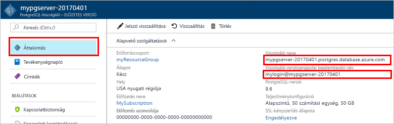

# <a name="design-your-first-azure-database-for-postgresql-using-the-azure-portal"></a><span data-ttu-id="bfe60-103">Az első Azure-adatbázis kialakítása a PostgreSQL az Azure portál használatával</span><span class="sxs-lookup"><span data-stu-id="bfe60-103">Design your first Azure Database for PostgreSQL using the Azure portal</span></span>

<span data-ttu-id="bfe60-104">A PostgreSQL-hez készült Azure Database felügyelt szolgáltatás, amely lehetővé teszi a magas rendelkezésre állású PostgreSQL-adatbázisok futtatását, kezelését és skálázását a felhőben.</span><span class="sxs-lookup"><span data-stu-id="bfe60-104">Azure Database for PostgreSQL is a managed service that enables you to run, manage, and scale highly available PostgreSQL databases in the cloud.</span></span> <span data-ttu-id="bfe60-105">Az Azure portál használatával egyszerűen kezelheti a kiszolgálót, és egy adatbázis tervezése.</span><span class="sxs-lookup"><span data-stu-id="bfe60-105">Using the Azure portal, you can easily manage your server and design a database.</span></span>

<span data-ttu-id="bfe60-106">Ebben az oktatóanyagban, használja az Azure-portálon megtudhatja, hogyan:</span><span class="sxs-lookup"><span data-stu-id="bfe60-106">In this tutorial, you use the Azure portal to learn how to:</span></span>
> [!div class="checklist"]
> * <span data-ttu-id="bfe60-107">Azure-adatbázis létrehozása PostgreSQL-hez</span><span class="sxs-lookup"><span data-stu-id="bfe60-107">Create an Azure Database for PostgreSQL</span></span>
> * <span data-ttu-id="bfe60-108">A kiszolgáló tűzfal konfigurálása</span><span class="sxs-lookup"><span data-stu-id="bfe60-108">Configure the server firewall</span></span>
> * <span data-ttu-id="bfe60-109">Használjon [ **psql** ](https://www.postgresql.org/docs/9.6/static/app-psql.html) segédprogramot az adatbázis létrehozása</span><span class="sxs-lookup"><span data-stu-id="bfe60-109">Use [**psql**](https://www.postgresql.org/docs/9.6/static/app-psql.html) utility to create a database</span></span>
> * <span data-ttu-id="bfe60-110">Mintaadatok betöltése</span><span class="sxs-lookup"><span data-stu-id="bfe60-110">Load sample data</span></span>
> * <span data-ttu-id="bfe60-111">Adatok lekérdezése</span><span class="sxs-lookup"><span data-stu-id="bfe60-111">Query data</span></span>
> * <span data-ttu-id="bfe60-112">Adatok frissítése</span><span class="sxs-lookup"><span data-stu-id="bfe60-112">Update data</span></span>
> * <span data-ttu-id="bfe60-113">Adatok visszaállítása</span><span class="sxs-lookup"><span data-stu-id="bfe60-113">Restore data</span></span>

## <a name="prerequisites"></a><span data-ttu-id="bfe60-114">Előfeltételek</span><span class="sxs-lookup"><span data-stu-id="bfe60-114">Prerequisites</span></span>
<span data-ttu-id="bfe60-115">Ha nem rendelkezik Azure-előfizetéssel, első lépésként mindössze néhány perc alatt létrehozhat egy [ingyenes](https://azure.microsoft.com/free/) fiókot.</span><span class="sxs-lookup"><span data-stu-id="bfe60-115">If you don't have an Azure subscription, create a [free](https://azure.microsoft.com/free/) account before you begin.</span></span>

## <a name="log-in-to-the-azure-portal"></a><span data-ttu-id="bfe60-116">Jelentkezzen be az Azure portálra.</span><span class="sxs-lookup"><span data-stu-id="bfe60-116">Log in to the Azure portal</span></span>
<span data-ttu-id="bfe60-117">Jelentkezzen be az [Azure portálra](https://portal.azure.com).</span><span class="sxs-lookup"><span data-stu-id="bfe60-117">Log in to the [Azure portal](https://portal.azure.com).</span></span>

## <a name="create-an-azure-database-for-postgresql"></a><span data-ttu-id="bfe60-118">Azure-adatbázis létrehozása PostgreSQL-hez</span><span class="sxs-lookup"><span data-stu-id="bfe60-118">Create an Azure Database for PostgreSQL</span></span>

<span data-ttu-id="bfe60-119">Az Azure-adatbázis PostgreSQL-kiszolgálóhoz [számítási és tárolási erőforrások](./concepts-compute-unit-and-storage.md) egy meghatározott készletével együtt jön létre.</span><span class="sxs-lookup"><span data-stu-id="bfe60-119">An Azure Database for PostgreSQL server is created with a defined set of [compute and storage resources](./concepts-compute-unit-and-storage.md).</span></span> <span data-ttu-id="bfe60-120">A kiszolgáló egy [Azure-erőforráscsoporton](../azure-resource-manager/resource-group-overview.md) belül jön létre.</span><span class="sxs-lookup"><span data-stu-id="bfe60-120">The server is created within an [Azure resource group](../azure-resource-manager/resource-group-overview.md).</span></span>

<span data-ttu-id="bfe60-121">Kövesse az alábbi lépéseket az Azure-adatbázis PostgreSQL-kiszolgálóhoz létrehozásához:</span><span class="sxs-lookup"><span data-stu-id="bfe60-121">Follow these steps to create an Azure Database for PostgreSQL server:</span></span>
1.  <span data-ttu-id="bfe60-122">Kattintson a **+ új** gomb az Azure portál bal felső sarkában található.</span><span class="sxs-lookup"><span data-stu-id="bfe60-122">Click the **+ New**  button found on the upper left-hand corner of the Azure portal.</span></span>
2.  <span data-ttu-id="bfe60-123">Az **Új** panelen válassza az **Adatbázisok** lehetőséget, majd az **Adatbázisok** panelen válassza az **Azure-adatbázis PostgreSQL-kiszolgálóhoz** lehetőséget.</span><span class="sxs-lookup"><span data-stu-id="bfe60-123">Select **Databases** from the **New** page, and select **Azure Database for PostgreSQL** from the **Databases** page.</span></span>
 <span data-ttu-id="bfe60-124"></span><span class="sxs-lookup"><span data-stu-id="bfe60-124"></span></span>

3.  <span data-ttu-id="bfe60-125">Töltse ki az új kiszolgáló adatai űrlapot a következő információkkal az előző képen látható módon:</span><span class="sxs-lookup"><span data-stu-id="bfe60-125">Fill out the new server details form with the following information, as shown on the preceding image:</span></span>
    - <span data-ttu-id="bfe60-126">A kiszolgáló neve: **mypgserver-20170401** (a kiszolgáló neve leképez a DNS-névbe, ezért globálisan egyedinek kell lennie)</span><span class="sxs-lookup"><span data-stu-id="bfe60-126">Server name: **mypgserver-20170401** (name of a server maps to DNS name and is thus required to be globally unique)</span></span> 
    - <span data-ttu-id="bfe60-127">Feliratkozás: Ha több előfizetéssel rendelkezik, válassza a megfelelő előfizetést, amelyen az erőforrás megtalálható vagy terhelve van.</span><span class="sxs-lookup"><span data-stu-id="bfe60-127">Subscription: If you have multiple subscriptions, choose the appropriate subscription in which the resource exists or is billed for.</span></span>
    - <span data-ttu-id="bfe60-128">Erőforráscsoport: **myresourcegroup**</span><span class="sxs-lookup"><span data-stu-id="bfe60-128">Resource group: **myresourcegroup**</span></span>
    - <span data-ttu-id="bfe60-129">Az Ön által választott kiszolgálói rendszergazdai bejelentkezési név és jelszó</span><span class="sxs-lookup"><span data-stu-id="bfe60-129">Server admin login and password of your choice</span></span>
    - <span data-ttu-id="bfe60-130">Hely</span><span class="sxs-lookup"><span data-stu-id="bfe60-130">Location</span></span>
    - <span data-ttu-id="bfe60-131">PostgreSQL-verzió</span><span class="sxs-lookup"><span data-stu-id="bfe60-131">PostgreSQL Version</span></span>

  > [!IMPORTANT]
  > <span data-ttu-id="bfe60-132">A kiszolgáló itt megadott rendszergazdai bejelentkezési nevét és jelszavát kell majd használnia a rövid útmutató későbbi szakaszaiban a kiszolgálóra és az adatbázisaira való bejelentkezéshez.</span><span class="sxs-lookup"><span data-stu-id="bfe60-132">The server admin login and password that you specify here are required to log in to the server and its databases later in this quick start.</span></span> <span data-ttu-id="bfe60-133">Jegyezze meg vagy jegyezze fel ezt az információt későbbi használatra.</span><span class="sxs-lookup"><span data-stu-id="bfe60-133">Remember or record this information for later use.</span></span>

4.  <span data-ttu-id="bfe60-134">Kattintson a **Tarifacsomag** parancsra az új adatbázis szolgáltatás- és teljesítményszintjének megadásához.</span><span class="sxs-lookup"><span data-stu-id="bfe60-134">Click **Pricing tier** to specify the service tier and performance level for your new database.</span></span> <span data-ttu-id="bfe60-135">Ehhez a rövid útmutatóhoz válassza az **Alapszintű** szolgáltatásszintet, **50 Számítási egységet**, és a szolgáltatási keretbe foglalt **50 GB** tárterületet.</span><span class="sxs-lookup"><span data-stu-id="bfe60-135">For this quick start, select **Basic** Tier, **50 Compute Units** and **50 GB** of included storage.</span></span>
 <span data-ttu-id="bfe60-136"></span><span class="sxs-lookup"><span data-stu-id="bfe60-136"></span></span>
5.  <span data-ttu-id="bfe60-137">Kattintson az **OK** gombra.</span><span class="sxs-lookup"><span data-stu-id="bfe60-137">Click **Ok**.</span></span>
6.  <span data-ttu-id="bfe60-138">A kiszolgáló üzembe helyezéséhez kattintson a **Létrehozás** elemre.</span><span class="sxs-lookup"><span data-stu-id="bfe60-138">Click **Create** to provision the server.</span></span> <span data-ttu-id="bfe60-139">Az üzembe helyezés eltarthat néhány percig.</span><span class="sxs-lookup"><span data-stu-id="bfe60-139">Provisioning takes a few minutes.</span></span>

  > [!TIP]
  > <span data-ttu-id="bfe60-140">A **Rögzítés az irányítópulton** lehetőséggel egyszerűen nyomon követheti az üzembe helyezést.</span><span class="sxs-lookup"><span data-stu-id="bfe60-140">Check the **Pin to dashboard** option to allow easy tracking of your deployments.</span></span>

7.  <span data-ttu-id="bfe60-141">Az eszköztáron kattintson az **Értesítések** parancsra az üzembe helyezési folyamat megfigyeléséhez.</span><span class="sxs-lookup"><span data-stu-id="bfe60-141">On the toolbar, click **Notifications** to monitor the deployment process.</span></span>
 <span data-ttu-id="bfe60-142"></span><span class="sxs-lookup"><span data-stu-id="bfe60-142"></span></span>
   
  <span data-ttu-id="bfe60-143">Alapértelmezés szerint a **postgres** adatbázis a kiszolgáló alatt jön létre.</span><span class="sxs-lookup"><span data-stu-id="bfe60-143">By default, **postgres** database gets created under your server.</span></span> <span data-ttu-id="bfe60-144">A [postgres](https://www.postgresql.org/docs/9.6/static/app-initdb.html) adatbázis egy alapértelmezett adatbázis, amelyet a felhasználók, segédprogramok és külső féltől származó alkalmazások általi használatra szántak.</span><span class="sxs-lookup"><span data-stu-id="bfe60-144">The [postgres](https://www.postgresql.org/docs/9.6/static/app-initdb.html) database is a default database meant for use by users, utilities, and third-party applications.</span></span> 

## <a name="configure-a-server-level-firewall-rule"></a><span data-ttu-id="bfe60-145">Kiszolgálószintű tűzfalszabály konfigurálása</span><span class="sxs-lookup"><span data-stu-id="bfe60-145">Configure a server-level firewall rule</span></span>

<span data-ttu-id="bfe60-146">Az Azure-adatbázis PostgreSQL-hez szolgáltatás a kiszolgáló szintjén hoz létre tűzfalat.</span><span class="sxs-lookup"><span data-stu-id="bfe60-146">The Azure Database for PostgreSQL service creates a firewall at the server-level.</span></span> <span data-ttu-id="bfe60-147">Ez a tűzfal megakadályozza, hogy a külső alkalmazások és eszközök csatlakozzanak a kiszolgálóhoz vagy a kiszolgálón lévő adatbázisokhoz, kivéve, ha olyan tűzfalszabályt hoz létre, amely adott IP-címek számára megnyitja a tűzfalat.</span><span class="sxs-lookup"><span data-stu-id="bfe60-147">This firewall prevents external applications and tools from connecting to the server and any databases on the server unless a firewall rule is created to open the firewall for specific IP addresses.</span></span> 

1.  <span data-ttu-id="bfe60-148">Miután befejeződött a telepítés, kattintson az **Összes erőforrás** lehetőségre a bal oldali menüben, és írja be az újonnan létrehozott kiszolgáló nevét **mypgserver-20170401**.</span><span class="sxs-lookup"><span data-stu-id="bfe60-148">After the deployment completes, click **All Resources** from the left-hand menu and type in the name **mypgserver-20170401** to search for your newly created server.</span></span> <span data-ttu-id="bfe60-149">Kattintson a keresési eredményekben listázott kiszolgálónévre.</span><span class="sxs-lookup"><span data-stu-id="bfe60-149">Click the server name listed in the search result.</span></span> <span data-ttu-id="bfe60-150">Megnyílik a kiszolgáló **Áttekintés** oldala, amely további konfigurációs lehetőségeket biztosít.</span><span class="sxs-lookup"><span data-stu-id="bfe60-150">The **Overview** page for your server opens and provides options for further configuration.</span></span>
 
 

2.  <span data-ttu-id="bfe60-152">A kiszolgáló panelen válassza a **Kapcsolatbiztonság** elemet.</span><span class="sxs-lookup"><span data-stu-id="bfe60-152">In the server blade, select **Connection Security**.</span></span> 
3.  <span data-ttu-id="bfe60-153">Kattintson a **Szabálynév** alatti szövegmezőbe, és adjon hozzá egy új tűzfalszabályt az IP-címtartomány összekapcsolhatóságának engedélyezéséhez.</span><span class="sxs-lookup"><span data-stu-id="bfe60-153">Click in the text box under **Rule Name,** and add a new firewall rule to whitelist the IP range for connectivity.</span></span> <span data-ttu-id="bfe60-154">Ebben az oktatóanyagban most engedélyezése minden IP-címet írja be a **szabály neve = AllowAllIps**, **kezdő IP-= 0.0.0.0** és **záró IP-Címnél = 255.255.255.255** , majd **mentése** .</span><span class="sxs-lookup"><span data-stu-id="bfe60-154">For this tutorial, let's allow all IPs by typing in **Rule Name = AllowAllIps**, **Start IP = 0.0.0.0** and **End IP = 255.255.255.255** and then click **Save**.</span></span> <span data-ttu-id="bfe60-155">Beállíthat egy olyan tűzfalszabályt, amely lefed egy IP-címtartományt, annak érdekében, hogy csatlakozni tudjon a saját hálózatából.</span><span class="sxs-lookup"><span data-stu-id="bfe60-155">You can set a firewall rule that covers an IP range to be able to connect from your network.</span></span>
 
 

4.  <span data-ttu-id="bfe60-157">Kattintson a **Mentés** gombra, majd kattintson az **X-re** a **Kapcsolatbiztonság** oldal bezárásához.</span><span class="sxs-lookup"><span data-stu-id="bfe60-157">Click **Save** and then click the **X** to close the **Connections Security** page.</span></span>

  > [!NOTE]
  > <span data-ttu-id="bfe60-158">Azure PostgreSQL-kiszolgáló az 5432-es porton keresztül kommunikál.</span><span class="sxs-lookup"><span data-stu-id="bfe60-158">Azure PostgreSQL server communicates over port 5432.</span></span> <span data-ttu-id="bfe60-159">Ha vállalati hálózaton belülről próbál csatlakozni, elképzelhető, hogy a hálózati tűzfal nem engedélyezi a kimenő forgalmat az 5432-es porton keresztül.</span><span class="sxs-lookup"><span data-stu-id="bfe60-159">If you are trying to connect from within a corporate network, outbound traffic over port 5432 may not be allowed by your network's firewall.</span></span> <span data-ttu-id="bfe60-160">Ebben az esetben addig nem tud csatlakozni az Azure SQL Database-kiszolgálóhoz, amíg az informatikai részleg nem nyitja meg az 5432-es portot.</span><span class="sxs-lookup"><span data-stu-id="bfe60-160">If so, you will not be able to connect to your Azure SQL Database server unless your IT department opens port 5432.</span></span>
  >


## <a name="get-the-connection-information"></a><span data-ttu-id="bfe60-161">Kapcsolatadatok lekérése</span><span class="sxs-lookup"><span data-stu-id="bfe60-161">Get the connection information</span></span>

<span data-ttu-id="bfe60-162">Az Azure-adatbázis PostgreSQL-kiszolgálóhoz létrehozásakor, az alapértelmezett **postgres** adatbázis is létrejön.</span><span class="sxs-lookup"><span data-stu-id="bfe60-162">When we created our Azure Database for PostgreSQL server, the default **postgres** database also gets created.</span></span> <span data-ttu-id="bfe60-163">A kiszolgálóhoz való kapcsolódáshoz meg kell adnia a gazdagép adatait és a hozzáférési hitelesítő adatokat.</span><span class="sxs-lookup"><span data-stu-id="bfe60-163">To connect to your database server, you need to provide host information and access credentials.</span></span>

1. <span data-ttu-id="bfe60-164">Az Azure Portal baloldali menüjében kattintson az **Összes erőforrás** lehetőségre, és keressen rá az újonnan létrehozott kiszolgálóra **mypgserver-20170401**.</span><span class="sxs-lookup"><span data-stu-id="bfe60-164">From the left-hand menu in Azure portal, click **All resources** and search for the server you just created **mypgserver-20170401**.</span></span>

  

3. <span data-ttu-id="bfe60-166">Kattintson a **mypgserver-20170401** kiszolgálónévre.</span><span class="sxs-lookup"><span data-stu-id="bfe60-166">Click the server name **mypgserver-20170401**.</span></span>
4. <span data-ttu-id="bfe60-167">Válassza ki a kiszolgáló **Áttekintés** oldalát.</span><span class="sxs-lookup"><span data-stu-id="bfe60-167">Select the server's **Overview** page.</span></span> <span data-ttu-id="bfe60-168">Jegyezze fel a **Kiszolgálónevet** és a **Kiszolgáló-rendszergazdai bejelentkezési nevet**.</span><span class="sxs-lookup"><span data-stu-id="bfe60-168">Make a note of the **Server name** and **Server admin login name**.</span></span>

 


## <a name="connect-to-postgresql-database-using-psql-in-cloud-shell"></a><span data-ttu-id="bfe60-170">Csatlakozás a PostgreSQL-adatbázishoz a psql használatával a Cloud Shell-ben</span><span class="sxs-lookup"><span data-stu-id="bfe60-170">Connect to PostgreSQL database using psql in Cloud Shell</span></span>

<span data-ttu-id="bfe60-171">Használjuk a psql parancssori segédprogramot az Azure-adatbázis PostgreSQL-kiszolgálóhoz való kapcsolódáshoz.</span><span class="sxs-lookup"><span data-stu-id="bfe60-171">Let's now use the psql command-line utility to connect to the Azure Database for PostgreSQL server.</span></span> 
1. <span data-ttu-id="bfe60-172">Indítsa el az Azure Cloud Shell-t a felső navigációs ablakban található terminálikonnal.</span><span class="sxs-lookup"><span data-stu-id="bfe60-172">Launch the Azure Cloud Shell via the terminal icon on the top navigation pane.</span></span>

   

2. <span data-ttu-id="bfe60-174">Az Azure Cloud Shell megnyílik a böngészőben, amely lehetővé teszi a bash-parancsok beírását.</span><span class="sxs-lookup"><span data-stu-id="bfe60-174">The Azure Cloud Shell opens in your browser, enabling you to type bash commands.</span></span>

   

3. <span data-ttu-id="bfe60-176">A Cloud Shell parancssornál csatlakozzon az Azure-adatbázis PostgreSQL-kiszolgálóhoz a psql-parancsok használatával.</span><span class="sxs-lookup"><span data-stu-id="bfe60-176">At the Cloud Shell prompt, connect to your Azure Database for PostgreSQL server using the psql commands.</span></span> <span data-ttu-id="bfe60-177">A következő formátum segítségével kapcsolódhat egy [psql](https://www.postgresql.org/docs/9.6/static/app-psql.html) segédprogrammal rendelkező Azure-adatbázis PostgreSQL-kiszolgálóhoz:</span><span class="sxs-lookup"><span data-stu-id="bfe60-177">The following format is used to connect to an Azure Database for PostgreSQL server with the [psql](https://www.postgresql.org/docs/9.6/static/app-psql.html) utility:</span></span>
   ```bash
   psql --host=<myserver> --port=<port> --username=<server admin login> --dbname=<database name>
   ```

   <span data-ttu-id="bfe60-178">Például a következő parancs a **postgres** nevű alapértelmezett adatbázishoz kapcsolódik a PostgreSQL-kiszolgálón **mypgserver-20170401.postgres.database.azure.com** a hozzáférési hitelesítő adatok használatával.</span><span class="sxs-lookup"><span data-stu-id="bfe60-178">For example, the following command connects to the default database called **postgres** on your PostgreSQL server **mypgserver-20170401.postgres.database.azure.com** using access credentials.</span></span> <span data-ttu-id="bfe60-179">Adja meg a kiszolgáló-rendszergazdai jelszavát, amikor a rendszer kéri.</span><span class="sxs-lookup"><span data-stu-id="bfe60-179">Enter your server admin password when prompted.</span></span>

   ```bash
   psql --host=mypgserver-20170401.postgres.database.azure.com --port=5432 --username=mylogin@mypgserver-20170401 --dbname=postgres
   ```

## <a name="create-a-new-database"></a><span data-ttu-id="bfe60-180">Új adatbázis létrehozása</span><span class="sxs-lookup"><span data-stu-id="bfe60-180">Create a New Database</span></span>
<span data-ttu-id="bfe60-181">Miután csatlakozott a kiszolgálóhoz, hozzon létre egy üres adatbázist, amikor a rendszer kéri.</span><span class="sxs-lookup"><span data-stu-id="bfe60-181">Once you're connected to the server, create a blank database at the prompt.</span></span>
```bash
CREATE DATABASE mypgsqldb;
```

<span data-ttu-id="bfe60-182">Amikor a rendszer kéri, hajtsa végre a következő parancsot, a kapcsolat átváltásához az újonnan létrehozott adatbázisra **mypgsqldb**.</span><span class="sxs-lookup"><span data-stu-id="bfe60-182">At the prompt, execute the following command to switch connection to the newly created database **mypgsqldb**.</span></span>
```bash
\c mypgsqldb
```
## <a name="create-tables-in-the-database"></a><span data-ttu-id="bfe60-183">Hozzon létre táblák az adatbázisban</span><span class="sxs-lookup"><span data-stu-id="bfe60-183">Create tables in the database</span></span>
<span data-ttu-id="bfe60-184">Most, hogy tudja, hogyan PostgreSQL az Azure-adatbázishoz való kapcsolódáshoz, azt is ismerteti, hogyan lehet néhány alapvető műveleteket elvégezni.</span><span class="sxs-lookup"><span data-stu-id="bfe60-184">Now that you know how to connect to the Azure Database for PostgreSQL, we can go over how to complete some basic tasks.</span></span>

<span data-ttu-id="bfe60-185">Először hogy hozzon létre egy táblát, és töltse be adatokkal.</span><span class="sxs-lookup"><span data-stu-id="bfe60-185">First, we can create a table and load it with some data.</span></span> <span data-ttu-id="bfe60-186">Hozzon létre egy táblát, amely nyomon követi a leltáradatokat.</span><span class="sxs-lookup"><span data-stu-id="bfe60-186">Let's create a table that tracks inventory information.</span></span>
```sql
CREATE TABLE inventory (
    id serial PRIMARY KEY, 
    name VARCHAR(50), 
    quantity INTEGER
);
```

<span data-ttu-id="bfe60-187">Írja be a most látható az újonnan létrehozott tábla tabvles közül:</span><span class="sxs-lookup"><span data-stu-id="bfe60-187">You can see the newly created table in the list of tabvles now by typing:</span></span>
```sql
\dt
```

## <a name="load-data-into-the-tables"></a><span data-ttu-id="bfe60-188">Adatok betöltése a táblákba</span><span class="sxs-lookup"><span data-stu-id="bfe60-188">Load data into the tables</span></span>
<span data-ttu-id="bfe60-189">Most, hogy a tábla, azt beilleszthet néhány adat azt.</span><span class="sxs-lookup"><span data-stu-id="bfe60-189">Now that we have a table, we can insert some data into it.</span></span> <span data-ttu-id="bfe60-190">A parancssor megnyitása ablakban futtassa az alábbi lekérdezést, néhány sornyi adatot beszúrása</span><span class="sxs-lookup"><span data-stu-id="bfe60-190">At the open command prompt window, run the following query to insert some rows of data</span></span>
```sql
INSERT INTO inventory (id, name, quantity) VALUES (1, 'banana', 150); 
INSERT INTO inventory (id, name, quantity) VALUES (2, 'orange', 154);
```

<span data-ttu-id="bfe60-191">Lehetősége van a mintaadatok a táblázatba a korábban létrehozott most két sorát.</span><span class="sxs-lookup"><span data-stu-id="bfe60-191">You have now two rows of sample data into the table you created earlier.</span></span>

## <a name="query-and-update-the-data-in-the-tables"></a><span data-ttu-id="bfe60-192">Lekérdezés, és frissítse a táblák adatait</span><span class="sxs-lookup"><span data-stu-id="bfe60-192">Query and update the data in the tables</span></span>
<span data-ttu-id="bfe60-193">A következő lekérdezés futtatásával adatok lekérését a adatbázistábla hajtható végre.</span><span class="sxs-lookup"><span data-stu-id="bfe60-193">Execute the following query to retrieve information from the database table.</span></span> 
```sql
SELECT * FROM inventory;
```

<span data-ttu-id="bfe60-194">Is frissítheti az adatokat a táblában</span><span class="sxs-lookup"><span data-stu-id="bfe60-194">You can also update the data in the tables</span></span>
```sql
UPDATE inventory SET quantity = 200 WHERE name = 'banana';
```

<span data-ttu-id="bfe60-195">A sor ennek megfelelően frissül, az adatok.</span><span class="sxs-lookup"><span data-stu-id="bfe60-195">The row gets updated accordingly when you retrieve data.</span></span>
```sql
SELECT * FROM inventory;
```

## <a name="restore-data-to-a-previous-point-in-time"></a><span data-ttu-id="bfe60-196">A visszaállítás egy korábbi időpontra időben</span><span class="sxs-lookup"><span data-stu-id="bfe60-196">Restore data to a previous point in time</span></span>
<span data-ttu-id="bfe60-197">Képzelje el ezt a táblázatot véletlenül törölt.</span><span class="sxs-lookup"><span data-stu-id="bfe60-197">Imagine you have accidentally deleted this table.</span></span> <span data-ttu-id="bfe60-198">Ebben a helyzetben valami nem egyszerűen állíthat helyre.</span><span class="sxs-lookup"><span data-stu-id="bfe60-198">This situation is something you cannot easily recover from.</span></span> <span data-ttu-id="bfe60-199">Azure-adatbázis PostgreSQL lehetővé teszi bármely-időpontban (a 7 napra (alapszintű), (általános) 35 nap utolsó működési) lépjen vissza, és állítsa vissza a-időpontban egy új kiszolgálóra.</span><span class="sxs-lookup"><span data-stu-id="bfe60-199">Azure Database for PostgreSQL allows you to go back to any point-in-time (in the last up to 7 days (Basic) and 35 days (Standard)) and restore this point-in-time to a new server.</span></span> <span data-ttu-id="bfe60-200">Az új kiszolgáló segítségével helyreállíthatja a törölt adatokat.</span><span class="sxs-lookup"><span data-stu-id="bfe60-200">You can use this new server to recover your deleted data.</span></span> <span data-ttu-id="bfe60-201">Az alábbi lépéseket a a minta kiszolgáló pontra visszaállításához, mielőtt a tábla hozzá lett adva.</span><span class="sxs-lookup"><span data-stu-id="bfe60-201">The following steps restore the sample server to a point before the table was added.</span></span>

1.  <span data-ttu-id="bfe60-202">Az Azure-adatbázisban a kiszolgáló PostgreSQL-lap, kattintson a **visszaállítása** az eszköztáron.</span><span class="sxs-lookup"><span data-stu-id="bfe60-202">On the Azure Database for PostgreSQL page for your server, click **Restore** on the toolbar.</span></span> <span data-ttu-id="bfe60-203">A **visszaállítása** lap megnyitásakor.</span><span class="sxs-lookup"><span data-stu-id="bfe60-203">The **Restore** page opens.</span></span>
  <span data-ttu-id="bfe60-204"></span><span class="sxs-lookup"><span data-stu-id="bfe60-204"></span></span>
2.  <span data-ttu-id="bfe60-205">Töltse ki a **visszaállítása** a szükséges adatokat az űrlap:</span><span class="sxs-lookup"><span data-stu-id="bfe60-205">Fill out the **Restore** form with the required information:</span></span>

  
  - <span data-ttu-id="bfe60-207">**Visszaállítási pont**: Válasszon egy pont időponthoz kötött, amely akkor fordul elő, mielőtt a kiszolgáló megváltozott</span><span class="sxs-lookup"><span data-stu-id="bfe60-207">**Restore point**: Select a point-in-time that occurs before the server was changed</span></span>
  - <span data-ttu-id="bfe60-208">**Célkiszolgáló**: Adjon meg egy új kiszolgálónevet a visszaállítani kívánt</span><span class="sxs-lookup"><span data-stu-id="bfe60-208">**Target server**: Provide a new server name you want to restore to</span></span>
  - <span data-ttu-id="bfe60-209">**Hely**: a régió nem választhat, alapértelmezés szerint ugyanaz, mint a forráskiszolgálón</span><span class="sxs-lookup"><span data-stu-id="bfe60-209">**Location**: You cannot select the region, by default it is same as the source server</span></span>
  - <span data-ttu-id="bfe60-210">**A tarifacsomag**: Ez az érték nem módosítható, ha egy kiszolgáló visszaállítása.</span><span class="sxs-lookup"><span data-stu-id="bfe60-210">**Pricing tier**: You cannot change this value when restoring a server.</span></span> <span data-ttu-id="bfe60-211">Ugyanaz, mint a forráskiszolgálón.</span><span class="sxs-lookup"><span data-stu-id="bfe60-211">It is same as the source server.</span></span> 
3.  <span data-ttu-id="bfe60-212">Kattintson a **OK** visszaállítása a kiszolgáló [állítsa vissza egy-időpontban](./howto-restore-server-portal.md) előtt a táblák törölve lett.</span><span class="sxs-lookup"><span data-stu-id="bfe60-212">Click **OK** to restore the server to [restore to a point-in-time](./howto-restore-server-portal.md) before the tables was deleted.</span></span> <span data-ttu-id="bfe60-213">Egy kiszolgáló helyreállítása egy másik pontra időben ismétlődő új kiszolgáló létrehozása a pont frissítésétől eredeti kiszolgálóként időben ad meg, feltéve, hogy a megőrzési időtartamon belül a [szolgáltatásréteg](./concepts-service-tiers.md).</span><span class="sxs-lookup"><span data-stu-id="bfe60-213">Restoring a server to a different point in time creates a duplicate new server as the original server as of the point in time you specify, provided that it is within the retention period for your [service tier](./concepts-service-tiers.md).</span></span>

## <a name="next-steps"></a><span data-ttu-id="bfe60-214">Következő lépések</span><span class="sxs-lookup"><span data-stu-id="bfe60-214">Next Steps</span></span>
<span data-ttu-id="bfe60-215">Ebben az oktatóprogramban megismerte az Azure-portálon és egyéb segédprogramok használata:</span><span class="sxs-lookup"><span data-stu-id="bfe60-215">In this tutorial, you learned how to use the Azure portal and other utilities to:</span></span>
> [!div class="checklist"]
> * <span data-ttu-id="bfe60-216">Azure-adatbázis létrehozása PostgreSQL-hez</span><span class="sxs-lookup"><span data-stu-id="bfe60-216">Create an Azure Database for PostgreSQL</span></span>
> * <span data-ttu-id="bfe60-217">A kiszolgáló tűzfal konfigurálása</span><span class="sxs-lookup"><span data-stu-id="bfe60-217">Configure the server firewall</span></span>
> * <span data-ttu-id="bfe60-218">Használjon [ **psql** ](https://www.postgresql.org/docs/9.6/static/app-psql.html) segédprogramot az adatbázis létrehozása</span><span class="sxs-lookup"><span data-stu-id="bfe60-218">Use [**psql**](https://www.postgresql.org/docs/9.6/static/app-psql.html) utility to create a database</span></span>
> * <span data-ttu-id="bfe60-219">Mintaadatok betöltése</span><span class="sxs-lookup"><span data-stu-id="bfe60-219">Load sample data</span></span>
> * <span data-ttu-id="bfe60-220">Adatok lekérdezése</span><span class="sxs-lookup"><span data-stu-id="bfe60-220">Query data</span></span>
> * <span data-ttu-id="bfe60-221">Adatok frissítése</span><span class="sxs-lookup"><span data-stu-id="bfe60-221">Update data</span></span>
> * <span data-ttu-id="bfe60-222">Adatok visszaállítása</span><span class="sxs-lookup"><span data-stu-id="bfe60-222">Restore data</span></span>

<span data-ttu-id="bfe60-223">A következő megtudhatja, hogyan használhatja az Azure parancssori felület hasonló feladatokat hajthatnak végre, tekintse át az oktatóanyag: [az első Azure-adatbázis kialakítása a PostgreSQL Azure parancssori felület használatával](tutorial-design-database-using-azure-cli.md)</span><span class="sxs-lookup"><span data-stu-id="bfe60-223">Next, learn how to use Azure CLI to do similar tasks, review this tutorial: [Design your first Azure Database for PostgreSQL using Azure CLI](tutorial-design-database-using-azure-cli.md)</span></span>
