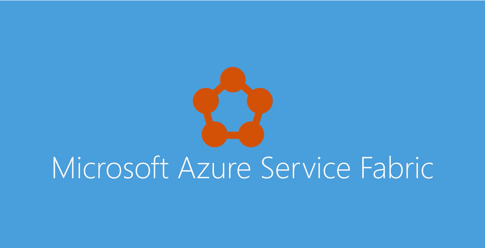

# Az Azure Service Fabric áttekintése
Azure Service Fabric egy elosztottrendszer platform, így könnyen toopackage, telepítése, és méretezhető és megbízható mikroszolgáltatások létrehozására és tárolók kezelése. A Service Fabric is megoldást hello jelentős kihívásaira fejlesztésének és kezelésének natív felhőalkalmazásokhoz. A fejlesztők és a rendszergazdák elkerülhetik az infrastruktúrával kapcsolatos összetett problémákat, és a kritikus fontosságú, nagy erőforrás-igényű, skálázható, megbízható és felügyelhető számítási feladatok megvalósítására koncentrálhatnak. A Service Fabric hello következő generációs platform kialakításához, és a vállalati szintű, 1. rétegbeli, felhőméretű az alkalmazások tárolók kezelése jelöli.

Ez a rövid videó bemutatja a Service Fabric és mikroszolgáltatások létrehozására:

## Alkalmazások mikroszolgáltatások összetevői 
A Service Fabric toobuild lehetővé teszi, és mikroszolgáltatások létrehozására, hogy futtatja a nagy sűrűségű gépek megosztott készletét, amely említett tooas fürt álló méretezhető és megbízható alkalmazások kezelésére. A kifinomult, egyszerűsített futásidejű toobuild elosztott tárolókban lévő futtató méretezhető, az állapot nélküli és állapotalapú mikroszolgáltatások biztosít. Átfogó alkalmazás felügyeleti képességek tooprovision is biztosít, telepítése, figyeléséhez, frissítés/javítás és központilag telepített alkalmazások, beleértve a tárolóalapú szolgáltatások törlése.

A Service Fabric számos Microsoft szolgáltatás ma, beleértve az Azure SQL Database megoldásaira épül, Azure Cosmos DB, Cortana, a Microsoft Power bi-ban, a Microsoft Intune, Azure Event Hubs, Azure IoT Hub, Dynamics 365, a Skype vállalati verzió és számos Azure-szolgáltatásokhoz központi.

A Service Fabric a következőkhöz ideális toocreate natív felhőszolgáltatás, amely kezdje kis lépésekkel, igény szerint, és növekedjen toomassive méretezéssel, több száz vagy ezer gépek.

A mai Internet-skálázási szolgáltatások mikroszolgáltatások létrehozására a beépített. Mikroszolgáltatások például protokoll átjárók, a felhasználói profilok, vásárlás kocsik, készlet feldolgozására, üzenetsorok, és gyorsítótárba helyezi azt. A Service Fabric egy mikroszolgáltatások platform, amely minden mikroszolgáltatási (vagy a tároló) egy egyedi nevet ad, hogy állapot nélküli vagy állapot-nyilvántartó lehet.

A Service Fabric átfogó futásidejű és életciklus felügyeleti képességek tooapplications, amely a mikroszolgáltatások álló biztosít. Telepített és aktivált hello Service Fabric-fürt között tárolókba mikroszolgáltatások rajta. A virtuális gépek toocontainers áthelyezést lehetővé teszi sorrendje a nagyságrendet növelni a sűrűségének. Ehhez hasonlóan egy másik nagyságrendű a sűrűségének kerül lehetséges, ha a tárolók toomicroservices ezekben a tárolókban-védelemről. Az Azure SQL Database egy fürtön például több száz futó tárolók tízezreit üzemeltető akár több ezer adatbázis több száz összesen gépek foglalja magában. Az egyes adatbázisok a Service Fabric állapot-nyilvántartó mikroszolgáltatási. 

További hello mikroszolgáltatások módszer, olvassa el [ezért egy mikroszolgáltatások megközelítés toobuilding alkalmazások?](service-fabric-overview-microservices.md)

## Tároló üzembe helyezési és vezénylési
A Service Fabric a Microsoft [tároló orchestrator](service-fabric-cluster-resource-manager-introduction.md) mikroszolgáltatások telepítése gépet fürtön belül. Mikroszolgáltatások fejleszthetők hello használata az sokféleképpen [programozási modellek Service Fabric](service-fabric-choose-framework.md), [ASP.NET Core](service-fabric-reliable-services-communication-aspnetcore.md), toodeploying [az Ön által választott bármely kód](service-fabric-deploy-existing-app.md). Fontos, mind a folyamatok szolgáltatások és szolgáltatások hello a tárolókban lévő kombinálhatja ugyanahhoz az alkalmazáshoz. Ha csak túl[tárolók telepítése és felügyelete](service-fabric-containers-overview.md), a Service Fabric, a tároló orchestrator tökéletes választás.

## Minden operációs rendszer, a felhő
A Service Fabric everywhere futtatja. A Service Fabric tárolófürtöket hozhat létre, sok környezetben, beleértve az Azure vagy a helyszínen, a Windows Server vagy Linux rendszeren. Fürtök a más nyilvános felhőket is létrehozhat. Ezenkívül hello fejlesztési környezetet a hello SDK is **azonos** toohello éles környezetben, az érintett nem emulátor. Ez azt jelenti mi fut a helyi fejlesztési fürtöt telepít toohello fürtök más környezetekben.

![Service Fabric-platformról][Image1]

A létrehozásáról további információt a helyi fürtök, olvassa el a [fürt létrehozása a Windows Server vagy Linux](service-fabric-deploy-anywhere.md) vagy az Azure-fürt létrehozása [hello Azure-portálon keresztül](service-fabric-cluster-creation-via-portal.md).

## Az állapotmentes és állapotalapú mikroszolgáltatások a Service Fabric
A Service Fabric lehetővé teszi toobuild alkalmazások, amelyek mikroszolgáltatások vagy a tárolókat állnak. Állapot nélküli mikroszolgáltatások (például a protokoll-átjáró és a webes proxykat) nem tartanak egy változtatható állapotot egy kérelem és a hello szolgáltatás válasza kívül. Azure Cloud Services feldolgozói szerepkörök olyan állapotmentes szolgáltatások példát. Állapot-nyilvántartó mikroszolgáltatások (például a felhasználói fiókok, adatbázisok, eszközök, bevásárlási kártyák és a várólisták) hello kérelem és a válaszában változtatható, mérvadó állapotának karbantartása. Napjaink Internet-méretű alkalmazások állapotmentes és állapotalapú mikroszolgáltatások kombinációjából áll. 

A Service Fabric egy kulcs differentation az állapotalapú szolgáltatások, vagy hello erős összpontosít [beépített programozási modellek ](service-fabric-choose-framework.md) vagy indexelése állapotalapú szolgáltatással. Hello [alkalmazás-forgatókönyvekre](service-fabric-application-scenarios.md) hello forgatókönyvek, ahol állapotalapú szolgáltatások használják mutatják be.

## Alkalmazás-életciklus kezelésének
A Service Fabric hello teljes alkalmazás életciklusa és a felhőalapú alkalmazások, beleértve a tárolók CI/CD támogatást nyújt. Ez élettartama fejlesztését a telepítés, a napi felügyeleti és karbantartási tooeventual leszerelése tartalmazza.

A Service Fabric alkalmazás életciklus-kezelési képességek engedélyezése az alkalmazás-rendszergazdák és informatikai operátorok toouse egyszerű, alacsony érintéssel munkafolyamatok tooprovision, telepítheti, javítás, és alkalmazások figyelheti. Ezek a munkafolyamatok beépített jelentősen csökkenti a hello nehezedő IT üzemeltetők tookeep folyamatosan rendelkezésre álló alkalmazások.

A legtöbb alkalmazás állapotmentes és állapotalapú mikroszolgáltatások létrehozására, a tárolók és a más végrehajtható üzembe helyezett együttesen alkotják. Azzal, hogy erős típusok hello kérelmekről, a Service Fabric lehetővé teszi, hogy több alkalmazáspéldányt hello telepítését. Minden példány kezeli, és egymástól függetlenül frissíteni. A Service Fabric fontosabb, telepítheti a tárolók vagy bármilyen végrehajtható fájlok és teszi azokat a megbízható. A Service Fabric telepíthet például .NET, az ASP.NET Core, node.js, a Windows tárolók, Linux tárolók, Java virtuális gépek, parancsfájlok, Angular vagy szó semmit, amely az alkalmazás.

A Service Fabric integrálva van a CI/CD eszközök például [Visual Studio Team Services](https://www.visualstudio.com/team-services/), [Jenkins](https://jenkins.io/index.html), és [Polip telepítése](https://octopus.com/) és bármely egyéb népszerű CI/CD eszközzel együtt is használható.

Alkalmazás-életciklus kezelésével kapcsolatos további információkért olvassa el a [alkalmazás életciklusa](service-fabric-application-lifecycle.md). További információ toodeploy sem kódja, lásd: [központi telepítése egy Vendég végrehajtható](service-fabric-deploy-existing-app.md).

## Főbb képességek
A Service Fabric használatával a következő műveletek végezhetők el:

* Telepítse a nulla kódmódosításokat Windows vagy Linux rendszerű futtató tooAzure vagy tooon helyszíni adatközpontokkal. Egyszeri megírás, majd telepítse bárhol tooany Service Fabric-fürt.
* Méretezhető alkalmazások fejlesztéséhez épülnek, az mikroszolgáltatások hello Service Fabric programozási modellek, a tárolók vagy a kód használatával.
* Az állapotmentes és állapotalapú nagymértékben megbízható mikroszolgáltatások fejlesztéséhez. Az alkalmazás hello tervezési egyszerűsítése állapot-nyilvántartó mikroszolgáltatások használatával. 
* Hello új Reliable Actors programozási modell toocreate felhőobjektumok használható az önkiszolgáló található kód és állapotát.
* Telepítse és levezényelni a Windows-tárolók és a Linux-tárolók tartalmazó tárolók. A Service Fabric data-rendszereket, állapotalapú, tároló orchestrator.
* Alkalmazások telepítése a több száz vagy ezer alkalmazások vagy a tárolókat gépenként nagy sűrűségű másodpercben.
* Az alkalmazás mellett a oldalán, és egymástól függetlenül minden alkalmazás frissítése hello különböző verzióinak telepítése.
* Az alkalmazások leállása, megszakítása és nem törhető frissítések beleértve nélkül hello életciklus kezelése.
* Horizontális felskálázás vagy méretezni a fürtben található csomópontok hello száma. Csomópontok méretezni, mivel az alkalmazások automatikus méretezése.
* Figyelése és diagnosztizálása a futó alkalmazások hello állapotát, és automatikus javítás végrehajtása vonatkozó házirendek beállítása.
* Tekintse meg a hello erőforrás-elosztó alkalmazások hello újraelosztása levezényelni hello fürtön. A Service Fabric helyreállít a hibákat, és optimalizálja a hello terjesztési terhelés elérhető erőforrások alapján.

<!--Every topic should have next steps and links toohello next logical set of content tookeep hello customer engaged-->
## Következő lépések
* További információ:
  * [Miért egy mikroszolgáltatások közelítse toobuilding alkalmazások?](service-fabric-overview-microservices.md)
  * [Terminológia áttekintése](service-fabric-technical-overview.md)
* A Service Fabric beállítása [fejlesztési környezet](service-fabric-get-started.md)  
* A [Service Fabric támogatási lehetőségeinek](service-fabric-support.md) ismertetése

[Image1]: media/service-fabric-overview/Service-Fabric-Overview.png
