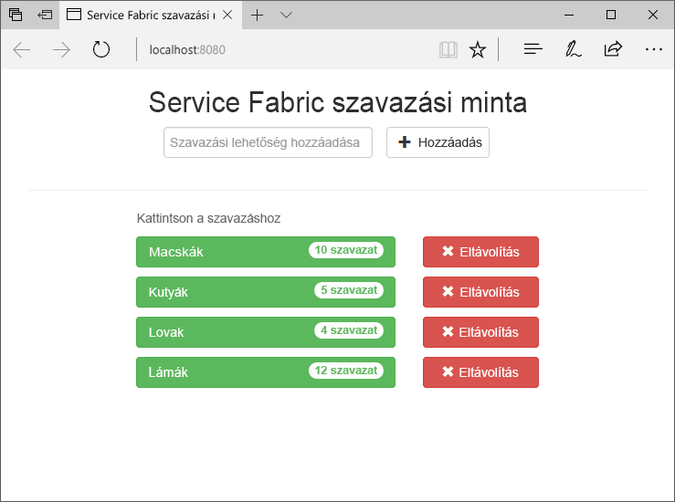
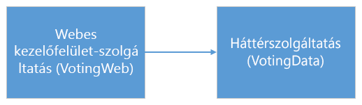
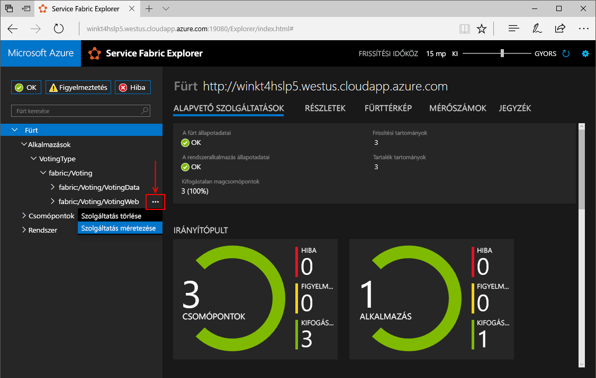
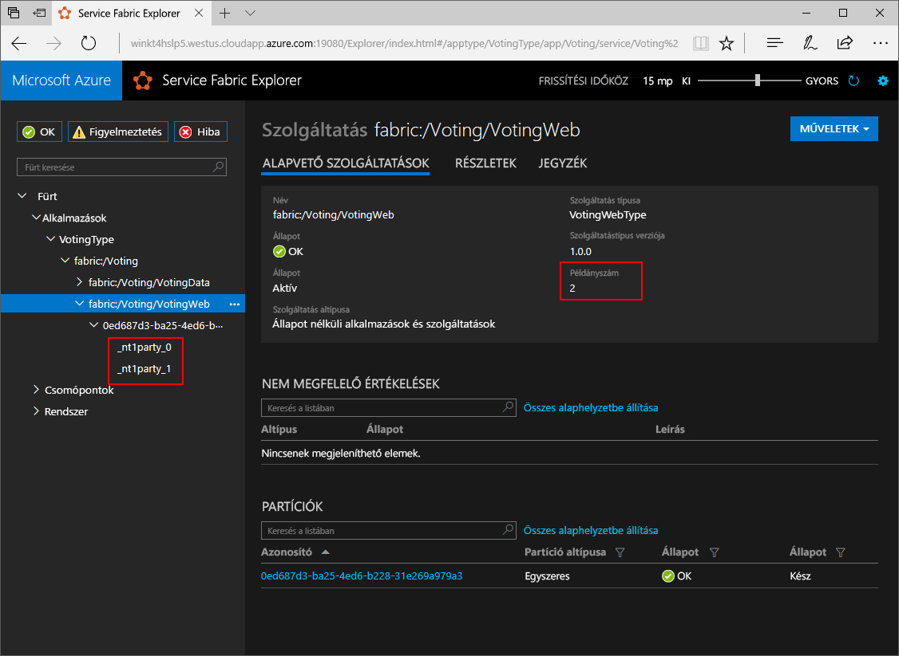
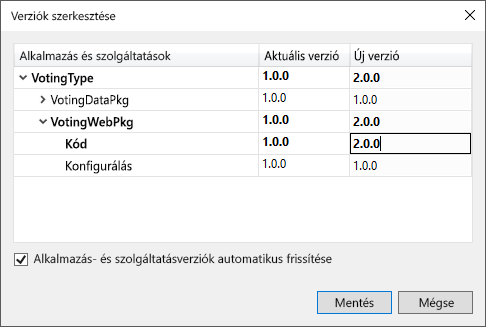
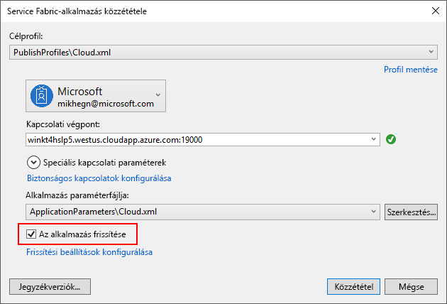
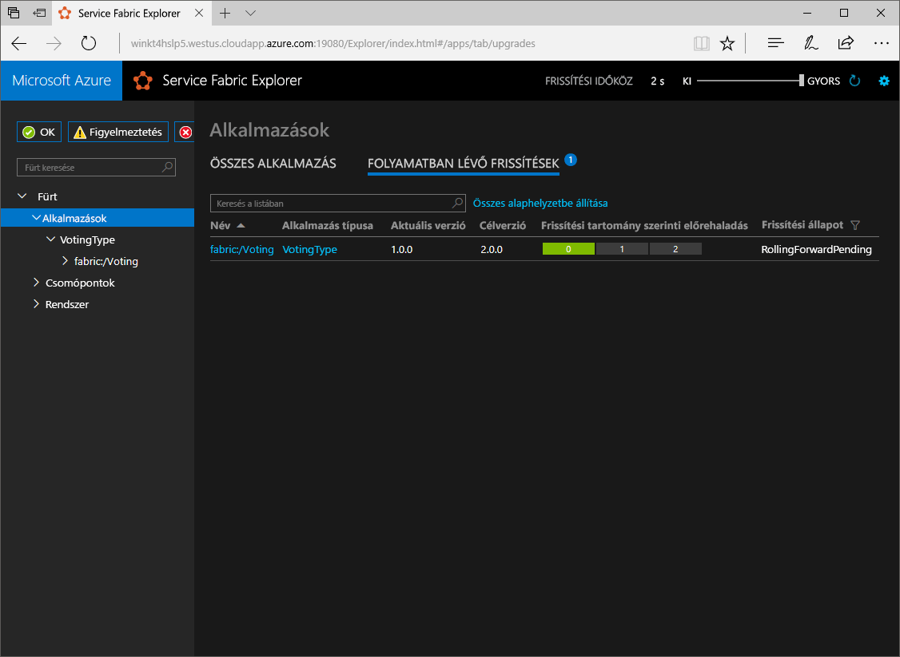

# <a name="create-a-net-service-fabric-application-in-azure"></a><span data-ttu-id="5f992-103">.NET Service Fabric-alkalmazás létrehozása az Azure-ban</span><span class="sxs-lookup"><span data-stu-id="5f992-103">Create a .NET Service Fabric application in Azure</span></span>
<span data-ttu-id="5f992-104">Az Azure Service Fabric egy elosztott rendszerplatform, amely skálázható és megbízható mikroszolgáltatások és tárolók üzembe helyezésére és kezelésére szolgál.</span><span class="sxs-lookup"><span data-stu-id="5f992-104">Azure Service Fabric is a distributed systems platform for deploying and managing scalable and reliable microservices and containers.</span></span> 

<span data-ttu-id="5f992-105">A gyors üzembe helyezés bemutatja, hogyan toodeploy az első .NET alkalmazás tooService háló.</span><span class="sxs-lookup"><span data-stu-id="5f992-105">This quickstart shows how toodeploy your first .NET application tooService Fabric.</span></span> <span data-ttu-id="5f992-106">Amikor végzett, hogy a szavazóalkalmazást az ASP.NET Core webes előtér-egy állapotalapú háttérszolgáltatásnak hello fürt szavazó eredmények takarít meg, amely a.</span><span class="sxs-lookup"><span data-stu-id="5f992-106">When you're finished, you have a voting application with an ASP.NET Core web front-end that saves voting results in a stateful back-end service in hello cluster.</span></span>



<span data-ttu-id="5f992-108">Ezzel az alkalmazással megismerheti, hogyan:</span><span class="sxs-lookup"><span data-stu-id="5f992-108">Using this application you learn how to:</span></span>
> [!div class="checklist"]
> * <span data-ttu-id="5f992-109">Hozzon létre egy alkalmazást a .NET- és a Service Fabric</span><span class="sxs-lookup"><span data-stu-id="5f992-109">Create an application using .NET and Service Fabric</span></span>
> * <span data-ttu-id="5f992-110">Az ASP.NET core használják egy előtér-webkiszolgáló</span><span class="sxs-lookup"><span data-stu-id="5f992-110">Use ASP.NET core as a web front-end</span></span>
> * <span data-ttu-id="5f992-111">Az állapotalapú szolgáltatás alkalmazásadatainak tárolására</span><span class="sxs-lookup"><span data-stu-id="5f992-111">Store application data in a stateful service</span></span>
> * <span data-ttu-id="5f992-112">Az alkalmazás helyi hibakeresése</span><span class="sxs-lookup"><span data-stu-id="5f992-112">Debug your application locally</span></span>
> * <span data-ttu-id="5f992-113">Hello alkalmazás tooa fürt az Azure-ban központi telepítése</span><span class="sxs-lookup"><span data-stu-id="5f992-113">Deploy hello application tooa cluster in Azure</span></span>
> * <span data-ttu-id="5f992-114">Kibővített hello alkalmazás több csomópont között</span><span class="sxs-lookup"><span data-stu-id="5f992-114">Scale-out hello application across multiple nodes</span></span>
> * <span data-ttu-id="5f992-115">Alkalmazás a frissítéshez szükséges</span><span class="sxs-lookup"><span data-stu-id="5f992-115">Perform a rolling application upgrade</span></span>

## <a name="prerequisites"></a><span data-ttu-id="5f992-116">Előfeltételek</span><span class="sxs-lookup"><span data-stu-id="5f992-116">Prerequisites</span></span>
<span data-ttu-id="5f992-117">toocomplete a gyors üzembe helyezés:</span><span class="sxs-lookup"><span data-stu-id="5f992-117">toocomplete this quickstart:</span></span>
1. <span data-ttu-id="5f992-118">[Telepítse a Visual Studio 2017](https://www.visualstudio.com/) a hello **Azure fejlesztési** és **ASP.NET és a webes fejlesztési** munkaterhelések.</span><span class="sxs-lookup"><span data-stu-id="5f992-118">[Install Visual Studio 2017](https://www.visualstudio.com/) with hello **Azure development** and **ASP.NET and web development** workloads.</span></span>
2. [<span data-ttu-id="5f992-119">A Git telepítése</span><span class="sxs-lookup"><span data-stu-id="5f992-119">Install Git</span></span>](https://git-scm.com/)
3. [<span data-ttu-id="5f992-120">Telepítse a Microsoft Azure Service Fabric SDK hello</span><span class="sxs-lookup"><span data-stu-id="5f992-120">Install hello Microsoft Azure Service Fabric SDK</span></span>](http://www.microsoft.com/web/handlers/webpi.ashx?command=getinstallerredirect&appid=MicrosoftAzure-ServiceFabric-CoreSDK)
4. <span data-ttu-id="5f992-121">Futtassa a következő parancs tooenable Visual Studio toodeploy toohello helyi Service Fabric-fürt hello:</span><span class="sxs-lookup"><span data-stu-id="5f992-121">Run hello following command tooenable Visual Studio toodeploy toohello local Service Fabric cluster:</span></span>
    ```powershell
    Set-ExecutionPolicy -ExecutionPolicy Unrestricted -Force -Scope CurrentUser
    ```

## <a name="download-hello-sample"></a><span data-ttu-id="5f992-122">Hello minta letöltése</span><span class="sxs-lookup"><span data-stu-id="5f992-122">Download hello sample</span></span>
<span data-ttu-id="5f992-123">A parancs-ablakban futtassa a következő parancs tooclone hello sample app tárház tooyour helyi számítógép hello.</span><span class="sxs-lookup"><span data-stu-id="5f992-123">In a command window, run hello following command tooclone hello sample app repository tooyour local machine.</span></span>
```
git clone https://github.com/Azure-Samples/service-fabric-dotnet-quickstart
```

## <a name="run-hello-application-locally"></a><span data-ttu-id="5f992-124">Hello alkalmazás helyileg történő futtatása</span><span class="sxs-lookup"><span data-stu-id="5f992-124">Run hello application locally</span></span>
<span data-ttu-id="5f992-125">Kattintson a jobb gombbal a Start menü hello hello Visual Studio ikonjára, és válassza a **Futtatás rendszergazdaként**.</span><span class="sxs-lookup"><span data-stu-id="5f992-125">Right-click hello Visual Studio icon in hello Start Menu and choose **Run as administrator**.</span></span> <span data-ttu-id="5f992-126">A sorrend tooattach hello hibakereső tooyour szolgáltatások toorun Visual Studio rendszergazdaként kell.</span><span class="sxs-lookup"><span data-stu-id="5f992-126">In order tooattach hello debugger tooyour services, you need toorun Visual Studio as administrator.</span></span>

<span data-ttu-id="5f992-127">Nyissa meg hello **Voting.sln** hello klónozott tárház a Visual Studio-megoldáshoz.</span><span class="sxs-lookup"><span data-stu-id="5f992-127">Open hello **Voting.sln** Visual Studio solution from hello repository you cloned.</span></span>

<span data-ttu-id="5f992-128">toodeploy hello alkalmazás, nyomja meg az **F5**.</span><span class="sxs-lookup"><span data-stu-id="5f992-128">toodeploy hello application, press **F5**.</span></span>

> [!NOTE]
> <span data-ttu-id="5f992-129">hello első alkalommal futtatja, és telepítse központilag hello alkalmazást, a Visual Studio hibakeresési egy helyi fürtöt hoz létre.</span><span class="sxs-lookup"><span data-stu-id="5f992-129">hello first time you run and deploy hello application, Visual Studio creates a local cluster for debugging.</span></span> <span data-ttu-id="5f992-130">Ez a művelet eltarthat egy ideig.</span><span class="sxs-lookup"><span data-stu-id="5f992-130">This operation may take some time.</span></span> <span data-ttu-id="5f992-131">hello fürt létrehozási állapota hello Visual Studio kimeneti ablakában jelenik meg.</span><span class="sxs-lookup"><span data-stu-id="5f992-131">hello cluster creation status is displayed in hello Visual Studio output window.</span></span>

<span data-ttu-id="5f992-132">Hello telepítés befejeződése után elindít egy böngészőt, és nyissa meg az ezen a lapon: `http://localhost:8080` -hello webes előtér-hello alkalmazás.</span><span class="sxs-lookup"><span data-stu-id="5f992-132">When hello deployment is complete, launch a browser and open this page: `http://localhost:8080` - hello web front-end of hello application.</span></span>


<span data-ttu-id="5f992-134">Ezután hozzáadhat egy szavazás beállításainak, és indítsa el a szavazatok véve.</span><span class="sxs-lookup"><span data-stu-id="5f992-134">You can now add a set of voting options, and start taking votes.</span></span> <span data-ttu-id="5f992-135">hello alkalmazás fut, és az összes adatot tárol a Service Fabric-fürt egy másik adatbázist hello nélkül.</span><span class="sxs-lookup"><span data-stu-id="5f992-135">hello application runs and stores all data in your Service Fabric cluster, without hello need for a separate database.</span></span>

## <a name="walk-through-hello-voting-sample-application"></a><span data-ttu-id="5f992-136">Szavazás mintaalkalmazás hello bízná</span><span class="sxs-lookup"><span data-stu-id="5f992-136">Walk through hello voting sample application</span></span>
<span data-ttu-id="5f992-137">hello szavazás alkalmazás két szolgáltatásból áll:</span><span class="sxs-lookup"><span data-stu-id="5f992-137">hello voting application consists of two services:</span></span>
- <span data-ttu-id="5f992-138">Webes előtér-szolgáltatás (VotingWeb) – az ASP.NET Core webes előtér-szolgáltatás, hello weblap szolgál, és tesz elérhetővé webes API-k toocommunicate a hello háttérszolgáltatásban.</span><span class="sxs-lookup"><span data-stu-id="5f992-138">Web front-end service (VotingWeb)- An ASP.NET Core web front-end service, which serves hello web page and exposes web APIs toocommunicate with hello backend service.</span></span>
- <span data-ttu-id="5f992-139">Háttér-szolgáltatás (VotingData)-az ASP.NET Core a webszolgáltatást tesz elérhetővé, az API toostore hello szavazattal megbízható dictionary eredményezi a lemezen maradnak.</span><span class="sxs-lookup"><span data-stu-id="5f992-139">Back-end service (VotingData)- An ASP.NET Core web service, which exposes an API toostore hello vote results in a reliable dictionary persisted on disk.</span></span>



<span data-ttu-id="5f992-141">Amikor szavaz a hello alkalmazás hello a következő események következnek be:</span><span class="sxs-lookup"><span data-stu-id="5f992-141">When you vote in hello application hello following events occur:</span></span>
1. <span data-ttu-id="5f992-142">JavaScript hello webes előtér-szolgáltatás hello szavazattal kérelem toohello webes API-t, egy HTTP PUT-kérelmet küld.</span><span class="sxs-lookup"><span data-stu-id="5f992-142">A JavaScript sends hello vote request toohello web API in hello web front-end service as an HTTP PUT request.</span></span>

2. <span data-ttu-id="5f992-143">hello webes előtér-szolgáltatás egy proxy toolocate használ, és továbbítja a HTTP PUT kérés toohello háttér-szolgáltatásnak.</span><span class="sxs-lookup"><span data-stu-id="5f992-143">hello web front-end service uses a proxy toolocate and forward an HTTP PUT request toohello back-end service.</span></span>

3. <span data-ttu-id="5f992-144">hello háttérszolgáltatásnak hello bejövő kérelem vesz igénybe, és a tárolók hello frissítve megbízható szótár, amely hello fürt csomópontja replikált toomultiple kap, és a lemezen tárolt eredményt.</span><span class="sxs-lookup"><span data-stu-id="5f992-144">hello back-end service takes hello incoming request, and stores hello updated result in a reliable dictionary, which gets replicated toomultiple nodes within hello cluster and persisted on disk.</span></span> <span data-ttu-id="5f992-145">Minden hello alkalmazásadatok hello fürt tárolja, így nincs adatbázis szükséges.</span><span class="sxs-lookup"><span data-stu-id="5f992-145">All hello application's data is stored in hello cluster, so no database is needed.</span></span>

## <a name="debug-in-visual-studio"></a><span data-ttu-id="5f992-146">A Visual Studio hibakeresési</span><span class="sxs-lookup"><span data-stu-id="5f992-146">Debug in Visual Studio</span></span>
<span data-ttu-id="5f992-147">A Visual Studio alkalmazás nyomkövetésére használ egy helyi Service Fabric-fejlesztési fürtöt.</span><span class="sxs-lookup"><span data-stu-id="5f992-147">When debugging application in Visual Studio, you are using a local Service Fabric development cluster.</span></span> <span data-ttu-id="5f992-148">A hibakeresési élmény tooyour környezettel rendelkezik hello beállítás tooadjust.</span><span class="sxs-lookup"><span data-stu-id="5f992-148">You have hello option tooadjust your debugging experience tooyour scenario.</span></span> <span data-ttu-id="5f992-149">Ebben az alkalmazásban tároljuk adatok a háttér-szolgáltatásban egy megbízható szótár használatával.</span><span class="sxs-lookup"><span data-stu-id="5f992-149">In this application, we store data in our back-end service, using a reliable dictionary.</span></span> <span data-ttu-id="5f992-150">A Visual Studio hello alkalmazás alapértelmezés szerint eltávolítja a hello hibakereső leállítása.</span><span class="sxs-lookup"><span data-stu-id="5f992-150">Visual Studio removes hello application per default when you stop hello debugger.</span></span> <span data-ttu-id="5f992-151">Hello adatok hello alkalmazás eltávolítása hatására a hello háttér-szolgáltatás tooalso el kell távolítani.</span><span class="sxs-lookup"><span data-stu-id="5f992-151">Removing hello application causes hello data in hello back-end service tooalso be removed.</span></span> <span data-ttu-id="5f992-152">toopersist hello adatok hibakeresés a munkamenetek között, módosíthatja hello **alkalmazás hibakeresési módban** hello meg tulajdonságként **Voting** projektre a Visual Studióban.</span><span class="sxs-lookup"><span data-stu-id="5f992-152">toopersist hello data between debugging sessions, you can change hello **Application Debug Mode** as a property on hello **Voting** project in Visual Studio.</span></span>

<span data-ttu-id="5f992-153">toolook, mi történik, a lépéseket követve teljes hello hello kódban:</span><span class="sxs-lookup"><span data-stu-id="5f992-153">toolook at what happens in hello code, complete hello following steps:</span></span>
1. <span data-ttu-id="5f992-154">Nyissa meg hello **VotesController.cs** fájlt, és állítson be egy töréspontot hello webes API **Put** metódus (sor: 47) – hello fájlra a Visual Studio Solution Explorer hello kereshet.</span><span class="sxs-lookup"><span data-stu-id="5f992-154">Open hello **VotesController.cs** file and set a breakpoint in hello web API's **Put** method (line 47) - You can search for hello file in hello Solution Explorer in Visual Studio.</span></span>

2. <span data-ttu-id="5f992-155">Nyissa meg hello **VoteDataController.cs** fájlt, és állítson be egy töréspontot ezen webes API **Put** metódus (sor 50).</span><span class="sxs-lookup"><span data-stu-id="5f992-155">Open hello **VoteDataController.cs** file and set a breakpoint in this web API's **Put** method (line 50).</span></span>

3. <span data-ttu-id="5f992-156">Lépjen vissza toohello böngésző és szavazó lehetőségre, vagy adja hozzá egy új szavazó beállítás.</span><span class="sxs-lookup"><span data-stu-id="5f992-156">Go back toohello browser and click a voting option or add a new voting option.</span></span> <span data-ttu-id="5f992-157">Kattintson az első töréspont hello hello webes első-end api-vezérlőben.</span><span class="sxs-lookup"><span data-stu-id="5f992-157">You hit hello first breakpoint in hello web front-end's api controller.</span></span>
    - <span data-ttu-id="5f992-158">Ez azért, ahol hello böngészőjében JavaScript hello küldi hello előtér-szolgáltatás egy kérelem toohello webes API-vezérlőben.</span><span class="sxs-lookup"><span data-stu-id="5f992-158">This is where hello JavaScript in hello browser sends a request toohello web API controller in hello front-end service.</span></span>
    
    

    - <span data-ttu-id="5f992-160">Először a háttér-szolgáltatás hello URL-cím toohello ReverseProxy azt összeállításához **(1)**.</span><span class="sxs-lookup"><span data-stu-id="5f992-160">First we construct hello URL toohello ReverseProxy for our back-end service **(1)**.</span></span>
    - <span data-ttu-id="5f992-161">Ezt követően kapni hello HTTP PUT kérés toohello ReverseProxy **(2)**.</span><span class="sxs-lookup"><span data-stu-id="5f992-161">Then we send hello HTTP PUT Request toohello ReverseProxy **(2)**.</span></span>
    - <span data-ttu-id="5f992-162">Végül hello a rendszer visszaadja a hello válasz hello háttérszolgáltatásnak toohello ügyfélről **(3)**.</span><span class="sxs-lookup"><span data-stu-id="5f992-162">Finally hello we return hello response from hello back-end service toohello client **(3)**.</span></span>

4. <span data-ttu-id="5f992-163">Nyomja le az **F5** toocontinue</span><span class="sxs-lookup"><span data-stu-id="5f992-163">Press **F5** toocontinue</span></span>
    - <span data-ttu-id="5f992-164">Ekkor a számítógép hello töréspontot hello háttér-szolgáltatás.</span><span class="sxs-lookup"><span data-stu-id="5f992-164">You are now at hello break point in hello back-end service.</span></span>
    
    

    - <span data-ttu-id="5f992-166">Hello metódus első sorában hello **(1)** hello használjuk `StateManager` tooget nevű megbízható szótár felvétele vagy `counts`.</span><span class="sxs-lookup"><span data-stu-id="5f992-166">In hello first line in hello method **(1)** we are using hello `StateManager` tooget or add a reliable dictionary called `counts`.</span></span>
    - <span data-ttu-id="5f992-167">A megbízható szótárban értékek minden interakció tranzakció, a használatával szükséges utasítás **(2)** hoz létre, hogy a tranzakció.</span><span class="sxs-lookup"><span data-stu-id="5f992-167">All interactions with values in a reliable dictionary require a transaction, this using statement **(2)** creates that transaction.</span></span>
    - <span data-ttu-id="5f992-168">Hello tranzakcióban, majd frissítjük hello megfelelő kulcs a szavazás beállítás hello hello értékét, és véglegesíti hello művelet **(3)**.</span><span class="sxs-lookup"><span data-stu-id="5f992-168">In hello transaction, we then update hello value of hello relevant key for hello voting option and commits hello operation **(3)**.</span></span> <span data-ttu-id="5f992-169">Hello véglegesítése után metódus ad vissza, hello adatok hello szótárban frissül, és a replikált tooother hello fürt csomópontja.</span><span class="sxs-lookup"><span data-stu-id="5f992-169">Once hello commit method returns, hello data is updated in hello dictionary and replicated tooother nodes in hello cluster.</span></span> <span data-ttu-id="5f992-170">hello adatok immár biztonságosan tárolja hello fürtben, és hello háttérszolgáltatásnak átveheti tooother csomópontok, adatok hello továbbra is fennáll.</span><span class="sxs-lookup"><span data-stu-id="5f992-170">hello data is now safely stored in hello cluster, and hello back-end service can fail over tooother nodes, still having hello data available.</span></span>
5. <span data-ttu-id="5f992-171">Nyomja le az **F5** toocontinue</span><span class="sxs-lookup"><span data-stu-id="5f992-171">Press **F5** toocontinue</span></span>

<span data-ttu-id="5f992-172">hibakeresési munkamenetben, nyomja meg az toostop hello **Shift + F5**.</span><span class="sxs-lookup"><span data-stu-id="5f992-172">toostop hello debugging session, press **Shift+F5**.</span></span>

## <a name="deploy-hello-application-tooazure"></a><span data-ttu-id="5f992-173">Hello alkalmazás tooAzure telepítése</span><span class="sxs-lookup"><span data-stu-id="5f992-173">Deploy hello application tooAzure</span></span>
<span data-ttu-id="5f992-174">toodeploy hello alkalmazás tooa fürt az Azure-ban, vagy dönthet úgy toocreate saját fürt, vagy fél fürt használatát.</span><span class="sxs-lookup"><span data-stu-id="5f992-174">toodeploy hello application tooa cluster in Azure, you can either choose toocreate your own cluster, or use a Party Cluster.</span></span>

<span data-ttu-id="5f992-175">Entitás fürtök ingyenes, a korlátozott idejű Service Fabric-fürtök Azure-platformon futó, és indítsa el hello Service Fabric team ahol bárki alkalmazások központi telepítése és hello platform megismerése.</span><span class="sxs-lookup"><span data-stu-id="5f992-175">Party clusters are free, limited-time Service Fabric clusters hosted on Azure and run by hello Service Fabric team where anyone can deploy applications and learn about hello platform.</span></span> <span data-ttu-id="5f992-176">tooget hozzáférés tooa fél fürt [hello utasítások](http://aka.ms/tryservicefabric).</span><span class="sxs-lookup"><span data-stu-id="5f992-176">tooget access tooa Party Cluster, [follow hello instructions](http://aka.ms/tryservicefabric).</span></span> 

<span data-ttu-id="5f992-177">További információk saját fürtök létrehozásáról: [Az első saját Service Fabric-fürt létrehozása az Azure-on](service-fabric-get-started-azure-cluster.md).</span><span class="sxs-lookup"><span data-stu-id="5f992-177">For information about creating your own cluster, see [Create your first Service Fabric cluster on Azure](service-fabric-get-started-azure-cluster.md).</span></span>

> [!Note]
> <span data-ttu-id="5f992-178">hello webes előtér-szolgáltatás a 8080-as portot a bejövő forgalmat konfigurált toolisten.</span><span class="sxs-lookup"><span data-stu-id="5f992-178">hello web front-end service is configured toolisten on port 8080 for incoming traffic.</span></span> <span data-ttu-id="5f992-179">Győződjön meg róla, hogy a port nyitva van a fürtön.</span><span class="sxs-lookup"><span data-stu-id="5f992-179">Make sure that port is open in your cluster.</span></span> <span data-ttu-id="5f992-180">Ha hello fél fürtöt használ, ez a port meg nyitva.</span><span class="sxs-lookup"><span data-stu-id="5f992-180">If you are using hello Party Cluster, this port is open.</span></span>
>

### <a name="deploy-hello-application-using-visual-studio"></a><span data-ttu-id="5f992-181">Visual Studio használatával hello alkalmazás központi telepítése</span><span class="sxs-lookup"><span data-stu-id="5f992-181">Deploy hello application using Visual Studio</span></span>
<span data-ttu-id="5f992-182">Most, hogy hello alkalmazás készen áll, ezután telepítheti azt közvetlenül a Visual Studio tooa fürt.</span><span class="sxs-lookup"><span data-stu-id="5f992-182">Now that hello application is ready, you can deploy it tooa cluster directly from Visual Studio.</span></span>

1. <span data-ttu-id="5f992-183">Kattintson a jobb gombbal **Voting** a hello a Megoldáskezelőben, és válassza a **közzététel**.</span><span class="sxs-lookup"><span data-stu-id="5f992-183">Right-click **Voting** in hello Solution Explorer and choose **Publish**.</span></span> <span data-ttu-id="5f992-184">hello közzététel párbeszédpanel jelenik meg.</span><span class="sxs-lookup"><span data-stu-id="5f992-184">hello Publish dialog appears.</span></span>

    

2. <span data-ttu-id="5f992-186">A csatlakozási végpont hello típusú hello hello fürt **csatlakozási végpont** mezőben, majd kattintson a **közzététel**.</span><span class="sxs-lookup"><span data-stu-id="5f992-186">Type in hello Connection Endpoint of hello cluster in hello **Connection Endpoint** field and click **Publish**.</span></span> <span data-ttu-id="5f992-187">Amikor regisztrál a hello fél fürt, hello csatlakozási végpont hello böngészőben valósul meg.</span><span class="sxs-lookup"><span data-stu-id="5f992-187">When signing up for hello Party Cluster, hello Connection Endpoint is provided in hello browser.</span></span> <span data-ttu-id="5f992-188">– például `winh1x87d1d.westus.cloudapp.azure.com:19000`.</span><span class="sxs-lookup"><span data-stu-id="5f992-188">- for example, `winh1x87d1d.westus.cloudapp.azure.com:19000`.</span></span>

3. <span data-ttu-id="5f992-189">Nyisson meg egy böngészőt, és írja be a fürt címe hello - például `http://winh1x87d1d.westus.cloudapp.azure.com`.</span><span class="sxs-lookup"><span data-stu-id="5f992-189">Open a browser and type in hello cluster address - for example, `http://winh1x87d1d.westus.cloudapp.azure.com`.</span></span> <span data-ttu-id="5f992-190">Meg kell jelennie az Azure-ban hello fürt hello alkalmazást.</span><span class="sxs-lookup"><span data-stu-id="5f992-190">You should now see hello application running in hello cluster in Azure.</span></span>


## <a name="scale-applications-and-services-in-a-cluster"></a><span data-ttu-id="5f992-192">Alkalmazások és szolgáltatások méretezése a fürtökben</span><span class="sxs-lookup"><span data-stu-id="5f992-192">Scale applications and services in a cluster</span></span>
<span data-ttu-id="5f992-193">A Service Fabric-szolgáltatások könnyen hello szolgáltatások hello terhelése változás esetén a fürt tooaccommodate között lehet méretezni.</span><span class="sxs-lookup"><span data-stu-id="5f992-193">Service Fabric services can easily be scaled across a cluster tooaccommodate for a change in hello load on hello services.</span></span> <span data-ttu-id="5f992-194">A szolgáltatások méretezéséhez a hello fürtben futó példányok hello száma módosításával.</span><span class="sxs-lookup"><span data-stu-id="5f992-194">You scale a service by changing hello number of instances running in hello cluster.</span></span> <span data-ttu-id="5f992-195">A szolgáltatások skálázás több módja van, használhatja a parancsfájlokat vagy parancsokat a PowerShell vagy a Service Fabric CLI (sfctl).</span><span class="sxs-lookup"><span data-stu-id="5f992-195">You have multiple ways of scaling your services, you can use scripts or commands from PowerShell or Service Fabric CLI (sfctl).</span></span> <span data-ttu-id="5f992-196">A jelen példában használjuk Service Fabric Explorerben talál.</span><span class="sxs-lookup"><span data-stu-id="5f992-196">In this example, we are using Service Fabric Explorer.</span></span>

<span data-ttu-id="5f992-197">Service Fabric Explorer összes Service Fabric-fürt fut, és keresse meg azt toohello fürtök HTTP felügyeleti portja (19080), például egy böngészőből elérhető `http://winh1x87d1d.westus.cloudapp.azure.com:19080`.</span><span class="sxs-lookup"><span data-stu-id="5f992-197">Service Fabric Explorer runs in all Service Fabric clusters and can be accessed from a browser, by browsing toohello clusters HTTP management port (19080), for example, `http://winh1x87d1d.westus.cloudapp.azure.com:19080`.</span></span>

<span data-ttu-id="5f992-198">tooscale hello webes előtér-szolgáltatás, a következő lépéseket hello:</span><span class="sxs-lookup"><span data-stu-id="5f992-198">tooscale hello web front-end service, do hello following steps:</span></span>

1. <span data-ttu-id="5f992-199">Nyissa meg a Service Fabric Explorert a fürtben – például: `http://winh1x87d1d.westus.cloudapp.azure.com:19080`.</span><span class="sxs-lookup"><span data-stu-id="5f992-199">Open Service Fabric Explorer in your cluster - for example,`http://winh1x87d1d.westus.cloudapp.azure.com:19080`.</span></span>
2. <span data-ttu-id="5f992-200">Kattintson a három pont (három ponttal jelölt) következő toohello hello **fabric: / Voting/VotingWeb** csomópont a TreeView vezérlő hello, és válassza a **méretezési szolgáltatás**.</span><span class="sxs-lookup"><span data-stu-id="5f992-200">Click on hello ellipsis (three dots) next toohello **fabric:/Voting/VotingWeb** node in hello treeview and choose **Scale Service**.</span></span>

    

    <span data-ttu-id="5f992-202">Ezután eldöntheti, tooscale hello több példányban hello webes előtér-szolgáltatás.</span><span class="sxs-lookup"><span data-stu-id="5f992-202">You can now choose tooscale hello number of instances of hello web front-end service.</span></span>

3. <span data-ttu-id="5f992-203">Hello száma túl módosítása**2** kattintson **méretezési szolgáltatás**.</span><span class="sxs-lookup"><span data-stu-id="5f992-203">Change hello number too**2** and click **Scale Service**.</span></span>
4. <span data-ttu-id="5f992-204">Kattintson a hello **fabric: / Voting/VotingWeb** csomópontja fanézetben hello és hello partíció csomópontot (GUID képviseli).</span><span class="sxs-lookup"><span data-stu-id="5f992-204">Click on hello **fabric:/Voting/VotingWeb** node in hello tree-view and expand hello partition node (represented by a GUID).</span></span>

    

    <span data-ttu-id="5f992-206">Láthatja, hogy hello szolgáltatás két példánya van, és hello fanézetben hello példányok futtassa mely csomópontok látható.</span><span class="sxs-lookup"><span data-stu-id="5f992-206">You can now see that hello service has two instances, and in hello tree view you see which nodes hello instances run on.</span></span>

<span data-ttu-id="5f992-207">Ez egyszerű fájlkezelési feladat által az előtér-szolgáltatás tooprocess felhasználói terhelést azt kettőzni hello forrásanyag is elérhető.</span><span class="sxs-lookup"><span data-stu-id="5f992-207">By this simple management task, we doubled hello resources available for our front-end service tooprocess user load.</span></span> <span data-ttu-id="5f992-208">Fontos, hogy nem kell több példánya a service toohave megbízhatóan futtatni toounderstand.</span><span class="sxs-lookup"><span data-stu-id="5f992-208">It's important toounderstand that you do not need multiple instances of a service toohave it run reliably.</span></span> <span data-ttu-id="5f992-209">Ha a szolgáltatás nem sikerül, a Service Fabric biztosítja, hogy hello fürtben fut egy új szolgáltatáspéldány.</span><span class="sxs-lookup"><span data-stu-id="5f992-209">If a service fails, Service Fabric makes sure a new service instance runs in hello cluster.</span></span>

## <a name="perform-a-rolling-application-upgrade"></a><span data-ttu-id="5f992-210">Alkalmazás a frissítéshez szükséges</span><span class="sxs-lookup"><span data-stu-id="5f992-210">Perform a rolling application upgrade</span></span>
<span data-ttu-id="5f992-211">Új frissítések tooyour alkalmazás telepítésekor a Service Fabric bevezeti a hello frissítés biztonságos módon.</span><span class="sxs-lookup"><span data-stu-id="5f992-211">When deploying new updates tooyour application, Service Fabric rolls out hello update in a safe way.</span></span> <span data-ttu-id="5f992-212">Működés közbeni frissítés lehetővé teszi az állásidő nélkül hibákról kell és automatikus visszaállítási frissítése közben.</span><span class="sxs-lookup"><span data-stu-id="5f992-212">Rolling upgrades gives you no downtime while upgrading as well as automated rollback should errors occur.</span></span>

<span data-ttu-id="5f992-213">tooupgrade hello alkalmazás, a következő hello:</span><span class="sxs-lookup"><span data-stu-id="5f992-213">tooupgrade hello application, do hello following:</span></span>

1. <span data-ttu-id="5f992-214">Nyissa meg hello **Index.cshtml** fájlt a Visual Studio - hello fájlra a Visual Studio Solution Explorer hello is kereshet.</span><span class="sxs-lookup"><span data-stu-id="5f992-214">Open hello **Index.cshtml** file in Visual Studio - You can search for hello file in hello Solution Explorer in Visual Studio.</span></span>
2. <span data-ttu-id="5f992-215">Néhány szöveget – például hello címsor hello oldalon módosítása</span><span class="sxs-lookup"><span data-stu-id="5f992-215">Change hello heading on hello page by adding some text - for example.</span></span>
    ```html
        <div class="col-xs-8 col-xs-offset-2 text-center">
            <h2>Service Fabric Voting Sample v2</h2>
        </div>
    ```
3. <span data-ttu-id="5f992-216">Hello fájl mentéséhez.</span><span class="sxs-lookup"><span data-stu-id="5f992-216">Save hello file.</span></span>
4. <span data-ttu-id="5f992-217">Kattintson a jobb gombbal **Voting** a hello a Megoldáskezelőben, és válassza a **közzététel**.</span><span class="sxs-lookup"><span data-stu-id="5f992-217">Right-click **Voting** in hello Solution Explorer and choose **Publish**.</span></span> <span data-ttu-id="5f992-218">hello közzététel párbeszédpanel jelenik meg.</span><span class="sxs-lookup"><span data-stu-id="5f992-218">hello Publish dialog appears.</span></span>
5. <span data-ttu-id="5f992-219">Kattintson a hello **Manifest verzió** gomb toochange hello verziója hello szolgáltatást és alkalmazást.</span><span class="sxs-lookup"><span data-stu-id="5f992-219">Click hello **Manifest Version** button toochange hello version of hello service and application.</span></span>
6. <span data-ttu-id="5f992-220">Hello verziójának módosítása hello **kód** elem alatt **VotingWebPkg** túl "2.0.0", és kattintson **mentése**.</span><span class="sxs-lookup"><span data-stu-id="5f992-220">Change hello version of hello **Code** element under **VotingWebPkg** too"2.0.0", for example, and click **Save**.</span></span>

    
7. <span data-ttu-id="5f992-222">A hello **Fabric-alkalmazás közzététele** párbeszédpanelt, ellenőrzés hello frissítési hello alkalmazás jelölőnégyzetet, majd **közzététel**.</span><span class="sxs-lookup"><span data-stu-id="5f992-222">In hello **Publish Service Fabric Application** dialog, check hello Upgrade hello Application checkbox, and click **Publish**.</span></span>

    
8. <span data-ttu-id="5f992-224">Nyissa meg a böngészőt, és keresse meg például toohello fürt címe 19080 - porton `http://winh1x87d1d.westus.cloudapp.azure.com:19080`.</span><span class="sxs-lookup"><span data-stu-id="5f992-224">Open your browser and browse toohello cluster address on port 19080 - for example, `http://winh1x87d1d.westus.cloudapp.azure.com:19080`.</span></span>
9. <span data-ttu-id="5f992-225">Kattintson a hello **alkalmazások** hello fanézetben, csomópontot, majd **folyamatban lévő frissítések** hello jobb oldali ablaktáblában.</span><span class="sxs-lookup"><span data-stu-id="5f992-225">Click on hello **Applications** node in hello tree view, and then **Upgrades in Progress** in hello right-hand pane.</span></span> <span data-ttu-id="5f992-226">Látni hogyan hello frissítés áthalad hello frissítési tartományt a fürt meggyőződött arról, hogy minden egyes tartományhoz mellett állapota kifogástalan toohello a folytatás előtt.</span><span class="sxs-lookup"><span data-stu-id="5f992-226">You see how hello upgrade rolls through hello upgrade domains in your cluster, making sure each domain is healthy before proceeding toohello next.</span></span>
    <span data-ttu-id="5f992-227"></span><span class="sxs-lookup"><span data-stu-id="5f992-227"></span></span>

    <span data-ttu-id="5f992-228">A Service Fabric teszi frissítések biztonságos hello fürt mindegyik csomópontján hello szolgáltatás a frissítés után két percet várakozik.</span><span class="sxs-lookup"><span data-stu-id="5f992-228">Service Fabric makes upgrades safe by waiting two minutes after upgrading hello service on each node in hello cluster.</span></span> <span data-ttu-id="5f992-229">Hello teljes frissítés tootake körülbelül nyolc percet vár.</span><span class="sxs-lookup"><span data-stu-id="5f992-229">Expect hello entire update tootake approximately eight minutes.</span></span>

10. <span data-ttu-id="5f992-230">Hello frissítés közben hello alkalmazás továbbra is használhatja.</span><span class="sxs-lookup"><span data-stu-id="5f992-230">While hello upgrade is running, you can still use hello application.</span></span> <span data-ttu-id="5f992-231">Hello szolgáltatást futtató hello fürt két példánya van, mert a kérelmek egy részénél kaphat hello alkalmazás, egy frissített verziója, míg mások továbbra is kaphat hello régi verzióját.</span><span class="sxs-lookup"><span data-stu-id="5f992-231">Because you have two instances of hello service running in hello cluster, some of your requests may get an upgraded version of hello application, while others may still get hello old version.</span></span>

## <a name="next-steps"></a><span data-ttu-id="5f992-232">Következő lépések</span><span class="sxs-lookup"><span data-stu-id="5f992-232">Next steps</span></span>
<span data-ttu-id="5f992-233">Ennek a rövid útmutatónak a segítségével megtanulta a következőket:</span><span class="sxs-lookup"><span data-stu-id="5f992-233">In this quickstart, you learned how to:</span></span>

> [!div class="checklist"]
> * <span data-ttu-id="5f992-234">Hozzon létre egy alkalmazást a .NET- és a Service Fabric</span><span class="sxs-lookup"><span data-stu-id="5f992-234">Create an application using .NET and Service Fabric</span></span>
> * <span data-ttu-id="5f992-235">Az ASP.NET core használják egy előtér-webkiszolgáló</span><span class="sxs-lookup"><span data-stu-id="5f992-235">Use ASP.NET core as a web front-end</span></span>
> * <span data-ttu-id="5f992-236">Az állapotalapú szolgáltatás alkalmazásadatainak tárolására</span><span class="sxs-lookup"><span data-stu-id="5f992-236">Store application data in a stateful service</span></span>
> * <span data-ttu-id="5f992-237">Az alkalmazás helyi hibakeresése</span><span class="sxs-lookup"><span data-stu-id="5f992-237">Debug your application locally</span></span>
> * <span data-ttu-id="5f992-238">Hello alkalmazás tooa fürt az Azure-ban központi telepítése</span><span class="sxs-lookup"><span data-stu-id="5f992-238">Deploy hello application tooa cluster in Azure</span></span>
> * <span data-ttu-id="5f992-239">Kibővített hello alkalmazás több csomópont között</span><span class="sxs-lookup"><span data-stu-id="5f992-239">Scale-out hello application across multiple nodes</span></span>
> * <span data-ttu-id="5f992-240">Alkalmazás a frissítéshez szükséges</span><span class="sxs-lookup"><span data-stu-id="5f992-240">Perform a rolling application upgrade</span></span>

<span data-ttu-id="5f992-241">További információ a Service Fabric és a .NET, toolearn vessen egy pillantást az oktatóanyag:</span><span class="sxs-lookup"><span data-stu-id="5f992-241">toolearn more about Service Fabric and .NET, take a look at this tutorial:</span></span>
> [!div class="nextstepaction"]
> [<span data-ttu-id="5f992-242">A Service Fabric .NET alkalmazás</span><span class="sxs-lookup"><span data-stu-id="5f992-242">.NET application on Service Fabric</span></span>](service-fabric-tutorial-create-dotnet-app.md)