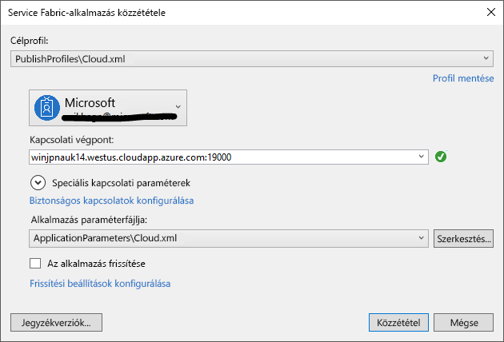

# <a name="deploy-an-application-tooa-party-cluster-in-azure"></a><span data-ttu-id="568a8-103">Egy alkalmazás tooa az Azure-ban fél fürt telepítése</span><span class="sxs-lookup"><span data-stu-id="568a8-103">Deploy an application tooa Party Cluster in Azure</span></span>
<span data-ttu-id="568a8-104">Ez az oktatóanyag két egy sor és bemutatja, hogyan toodeploy egy Azure Service Fabric-alkalmazás tooa fél fürt az Azure-ban.</span><span class="sxs-lookup"><span data-stu-id="568a8-104">This tutorial is part two of a series and shows you how toodeploy an Azure Service Fabric application tooa Party Cluster in Azure.</span></span>

<span data-ttu-id="568a8-105">A második rész hello útmutató-sorozat, megismerheti, hogyan:</span><span class="sxs-lookup"><span data-stu-id="568a8-105">In part two of hello tutorial series, you learn how to:</span></span>
> [!div class="checklist"]
> * <span data-ttu-id="568a8-106">Fürt üzembe helyezése alkalmazás tooa távoli Visual Studio használatával</span><span class="sxs-lookup"><span data-stu-id="568a8-106">Deploy an application tooa remote cluster using Visual Studio</span></span>
> * <span data-ttu-id="568a8-107">Az alkalmazás eltávolítása egy fürtről Service Fabric Explorerrel</span><span class="sxs-lookup"><span data-stu-id="568a8-107">Remove an application from a cluster using Service Fabric Explorer</span></span>

<span data-ttu-id="568a8-108">Az oktatóanyag adatsorozat elsajátíthatja, hogyan:</span><span class="sxs-lookup"><span data-stu-id="568a8-108">In this tutorial series you learn how to:</span></span>
> [!div class="checklist"]
> * [<span data-ttu-id="568a8-109">A .NET Service Fabric-alkalmazás létrehozása</span><span class="sxs-lookup"><span data-stu-id="568a8-109">Build a .NET Service Fabric application</span></span>](service-fabric-tutorial-create-dotnet-app.md)
> * <span data-ttu-id="568a8-110">Hello alkalmazás tooa távoli fürt központi telepítése</span><span class="sxs-lookup"><span data-stu-id="568a8-110">Deploy hello application tooa remote cluster</span></span>
> * [<span data-ttu-id="568a8-111">Konfigurálja a CI/CD Visual Studio Team Services használatával</span><span class="sxs-lookup"><span data-stu-id="568a8-111">Configure CI/CD using Visual Studio Team Services</span></span>](service-fabric-tutorial-deploy-app-with-cicd-vsts.md)

## <a name="prerequisites"></a><span data-ttu-id="568a8-112">Előfeltételek</span><span class="sxs-lookup"><span data-stu-id="568a8-112">Prerequisites</span></span>
<span data-ttu-id="568a8-113">Ez az oktatóanyag elkezdéséhez:</span><span class="sxs-lookup"><span data-stu-id="568a8-113">Before you begin this tutorial:</span></span>
- <span data-ttu-id="568a8-114">Ha nem rendelkezik Azure-előfizetéssel, hozzon létre egy [ingyenes fiókot](https://azure.microsoft.com/free/?WT.mc_id=A261C142F)</span><span class="sxs-lookup"><span data-stu-id="568a8-114">If you don't have an Azure subscription, create a [free account](https://azure.microsoft.com/free/?WT.mc_id=A261C142F)</span></span>
- <span data-ttu-id="568a8-115">[Telepítse a Visual Studio 2017](https://www.visualstudio.com/) és hello telepítése **Azure fejlesztési** és **ASP.NET és a webes fejlesztési** munkaterhelések.</span><span class="sxs-lookup"><span data-stu-id="568a8-115">[Install Visual Studio 2017](https://www.visualstudio.com/) and install hello **Azure development** and **ASP.NET and web development** workloads.</span></span>
- [<span data-ttu-id="568a8-116">Hello Service Fabric SDK telepítése</span><span class="sxs-lookup"><span data-stu-id="568a8-116">Install hello Service Fabric SDK</span></span>](service-fabric-get-started.md)

## <a name="download-hello-voting-sample-application"></a><span data-ttu-id="568a8-117">Hello Voting mintaalkalmazás letöltése</span><span class="sxs-lookup"><span data-stu-id="568a8-117">Download hello Voting sample application</span></span>
<span data-ttu-id="568a8-118">Ha Ön nem build hello Voting mintaalkalmazást [rész az oktatóanyag adatsorozat](service-fabric-tutorial-create-dotnet-app.md), tölthető le.</span><span class="sxs-lookup"><span data-stu-id="568a8-118">If you did not build hello Voting sample application in [part one of this tutorial series](service-fabric-tutorial-create-dotnet-app.md), you can download it.</span></span> <span data-ttu-id="568a8-119">A parancs-ablakban futtassa a következő parancs tooclone hello sample app tárház tooyour helyi számítógép hello.</span><span class="sxs-lookup"><span data-stu-id="568a8-119">In a command window, run hello following command tooclone hello sample app repository tooyour local machine.</span></span>

```
git clone https://github.com/Azure-Samples/service-fabric-dotnet-quickstart
```

## <a name="set-up-a-party-cluster"></a><span data-ttu-id="568a8-120">Egy entitás fürt beállítása</span><span class="sxs-lookup"><span data-stu-id="568a8-120">Set up a Party Cluster</span></span>
<span data-ttu-id="568a8-121">Entitás fürtök ingyenes, a korlátozott idejű Service Fabric-fürtök Azure-platformon futó, és indítsa el hello Service Fabric team ahol bárki alkalmazások központi telepítése és hello platform megismerése.</span><span class="sxs-lookup"><span data-stu-id="568a8-121">Party clusters are free, limited-time Service Fabric clusters hosted on Azure and run by hello Service Fabric team where anyone can deploy applications and learn about hello platform.</span></span> <span data-ttu-id="568a8-122">Az ingyenes!</span><span class="sxs-lookup"><span data-stu-id="568a8-122">For free!</span></span>

<span data-ttu-id="568a8-123">tooget hozzáférés tooa fél fürt Tallózás toothis webhely: http://aka.ms/tryservicefabric és követi hello utasításokat tooget hozzáférés tooa fürt.</span><span class="sxs-lookup"><span data-stu-id="568a8-123">tooget access tooa Party Cluster, browse toothis site: http://aka.ms/tryservicefabric and follow hello instructions tooget access tooa cluster.</span></span> <span data-ttu-id="568a8-124">A Facebook-on vagy a Githubon fiók tooget hozzáférés tooa fél fürt van szüksége.</span><span class="sxs-lookup"><span data-stu-id="568a8-124">You need a Facebook or GitHub account tooget access tooa Party Cluster.</span></span>

> [!NOTE]
> <span data-ttu-id="568a8-125">Entitás fürtök nem biztonságosak, ezért az alkalmazások és azok helyezett adatok látható tooothers lehet.</span><span class="sxs-lookup"><span data-stu-id="568a8-125">Party clusters are not secured, so your applications and any data you put in them may be visible tooothers.</span></span> <span data-ttu-id="568a8-126">Nem telepítése semmit nem szeretné, hogy mások toosee.</span><span class="sxs-lookup"><span data-stu-id="568a8-126">Don't deploy anything you don't want others toosee.</span></span> <span data-ttu-id="568a8-127">A használati feltételek minden hello részletekért meg arról, hogy tooread lehetnek.</span><span class="sxs-lookup"><span data-stu-id="568a8-127">Be sure tooread over our Terms of Use for all hello details.</span></span>

## <a name="configure-hello-listening-port"></a><span data-ttu-id="568a8-128">Hello figyelőportja konfigurálása</span><span class="sxs-lookup"><span data-stu-id="568a8-128">Configure hello listening port</span></span>
<span data-ttu-id="568a8-129">Hello VotingWeb előtér-szolgáltatás létrehozásakor, a Visual Studio véletlenszerűen választ hello szolgáltatás toolisten port a.</span><span class="sxs-lookup"><span data-stu-id="568a8-129">When hello VotingWeb front-end service is created, Visual Studio randomly selects a port for hello service toolisten on.</span></span>  <span data-ttu-id="568a8-130">hello VotingWeb szolgáltatás úgy működik, mint az alkalmazás előtér-hello és elfogadja a külső forgalom, így érdemes kötése adott szolgáltatás tooa rögzített és jól ismeri port.</span><span class="sxs-lookup"><span data-stu-id="568a8-130">hello VotingWeb service acts as hello front-end for this application and accepts external traffic, so let's bind that service tooa fixed and well-know port.</span></span> <span data-ttu-id="568a8-131">A Solution Explorerben nyissa meg a *VotingWeb/PackageRoot/ServiceManifest.xml*.</span><span class="sxs-lookup"><span data-stu-id="568a8-131">In Solution Explorer, open  *VotingWeb/PackageRoot/ServiceManifest.xml*.</span></span>  <span data-ttu-id="568a8-132">Hello található **végpont** hello erőforrás **erőforrások** szakaszt, és módosítsa a hello **Port** érték too80.</span><span class="sxs-lookup"><span data-stu-id="568a8-132">Find hello **Endpoint** resource in hello **Resources** section and change hello **Port** value too80.</span></span>

```xml
<Resources>
    <Endpoints>
      <!-- This endpoint is used by hello communication listener tooobtain hello port on which too
           listen. Please note that if your service is partitioned, this port is shared with 
           replicas of different partitions that are placed in your code. -->
      <Endpoint Protocol="http" Name="ServiceEndpoint" Type="Input" Port="80" />
    </Endpoints>
  </Resources>
```

<span data-ttu-id="568a8-133">Hello alkalmazás URL-Címének tulajdonság értéke hello Voting projektben frissíteni, egy webböngésző toohello megfelelő portot nyit meg hibakeresése "F5" használatával.</span><span class="sxs-lookup"><span data-stu-id="568a8-133">Also update hello Application URL property value in hello Voting project so a web browser opens toohello correct port when you debug using 'F5'.</span></span>  <span data-ttu-id="568a8-134">A Megoldáskezelőben, válassza ki a hello **Voting** projektet és a frissítés hello **alkalmazás URL-Címének** tulajdonság.</span><span class="sxs-lookup"><span data-stu-id="568a8-134">In Solution Explorer, select hello **Voting** project and update hello **Application URL** property.</span></span>


## <a name="deploy-hello-app-toohello-azure"></a><span data-ttu-id="568a8-136">Hello app toohello Azure telepítéséhez</span><span class="sxs-lookup"><span data-stu-id="568a8-136">Deploy hello app toohello Azure</span></span>
<span data-ttu-id="568a8-137">Most, hogy hello alkalmazás készen áll, ezután telepítheti azt közvetlenül a Visual Studio fél fürt toohello.</span><span class="sxs-lookup"><span data-stu-id="568a8-137">Now that hello application is ready, you can deploy it toohello Party Cluster direct from Visual Studio.</span></span>

1. <span data-ttu-id="568a8-138">Kattintson a jobb gombbal **Voting** a hello a Megoldáskezelőben, és válassza a **közzététel**.</span><span class="sxs-lookup"><span data-stu-id="568a8-138">Right-click **Voting** in hello Solution Explorer and choose **Publish**.</span></span>

    

2. <span data-ttu-id="568a8-140">A csatlakozási végpont hello típusú hello fél fürt a hello **csatlakozási végpont** mezőben, majd kattintson a **közzététel**.</span><span class="sxs-lookup"><span data-stu-id="568a8-140">Type in hello Connection Endpoint of hello Party Cluster in hello **Connection Endpoint** field and click **Publish**.</span></span>

    <span data-ttu-id="568a8-141">Miután hello közzététele van kész, meg kell tudni toosend egy kérelem toohello alkalmazást böngésző használatával.</span><span class="sxs-lookup"><span data-stu-id="568a8-141">Once hello publish has finished, you should be able toosend a request toohello application via a browser.</span></span>

3. <span data-ttu-id="568a8-142">Nyissa meg azt az előnyben részesített böngésző és írja be a hello fürt címe (csatlakozási végpont hello hello port adatok, például win1kw5649s.westus.cloudapp.azure.com nélkül).</span><span class="sxs-lookup"><span data-stu-id="568a8-142">Open you preferred browser and type in hello cluster address (hello connection endpoint without hello port information - for example, win1kw5649s.westus.cloudapp.azure.com).</span></span>

    <span data-ttu-id="568a8-143">Meg kell jelennie hello azonos vezethet, ahogy azt hello alkalmazás a helyi futtatás során.</span><span class="sxs-lookup"><span data-stu-id="568a8-143">You should now see hello same result as you saw when running hello application locally.</span></span>

    

## <a name="remove-hello-application-from-a-cluster-using-service-fabric-explorer"></a><span data-ttu-id="568a8-145">Hello alkalmazás eltávolítása egy fürtről Service Fabric Explorerrel</span><span class="sxs-lookup"><span data-stu-id="568a8-145">Remove hello application from a cluster using Service Fabric Explorer</span></span>
<span data-ttu-id="568a8-146">Service Fabric Explorer egy grafikus felhasználói felület tooexplore, és a Service Fabric-fürt alkalmazásokat kezeléséhez.</span><span class="sxs-lookup"><span data-stu-id="568a8-146">Service Fabric Explorer is a graphical user interface tooexplore and manage applications in a Service Fabric cluster.</span></span>

<span data-ttu-id="568a8-147">hello alkalmazás tooremove hello fél fürt:</span><span class="sxs-lookup"><span data-stu-id="568a8-147">tooremove hello application from hello Party Cluster:</span></span>

1. <span data-ttu-id="568a8-148">Keresse meg a Service Fabric Explorer hello fél fürt regisztrációs oldalon által biztosított hello hivatkozással toohello.</span><span class="sxs-lookup"><span data-stu-id="568a8-148">Browse toohello Service Fabric Explorer, using hello link provided by hello Party Cluster sign-up page.</span></span> <span data-ttu-id="568a8-149">Például http://win1kw5649s.westus.cloudapp.azure.com:19080/Explorer/index.html.</span><span class="sxs-lookup"><span data-stu-id="568a8-149">For example, http://win1kw5649s.westus.cloudapp.azure.com:19080/Explorer/index.html.</span></span>

2. <span data-ttu-id="568a8-150">A Service Fabric Explorerben nyissa meg a toohello **fabric://Voting** hello treeview hello bal oldali csomópontjában.</span><span class="sxs-lookup"><span data-stu-id="568a8-150">In Service Fabric Explorer, navigate toohello **fabric://Voting** node in hello treeview on hello left-hand side.</span></span>

3. <span data-ttu-id="568a8-151">Hello kattintson **művelet** gombra a jobb oldali hello **Essentials** ablaktáblán, és válassza a **alkalmazás törlése**.</span><span class="sxs-lookup"><span data-stu-id="568a8-151">Click hello **Action** button in hello right-hand **Essentials** pane, and choose **Delete Application**.</span></span> <span data-ttu-id="568a8-152">Erősítse meg törlése hello alkalmazáspéldányt, amely eltávolítja a hello fürtben futó alkalmazás hello példányát.</span><span class="sxs-lookup"><span data-stu-id="568a8-152">Confirm deleting hello application instance, which removes hello instance of our application running in hello cluster.</span></span>


## <a name="remove-hello-application-type-from-a-cluster-using-service-fabric-explorer"></a><span data-ttu-id="568a8-154">Hello alkalmazástípus eltávolítása egy fürtről Service Fabric Explorerrel</span><span class="sxs-lookup"><span data-stu-id="568a8-154">Remove hello application type from a cluster using Service Fabric Explorer</span></span>
<span data-ttu-id="568a8-155">Alkalmazástípusok a Service Fabric-fürt, amely lehetővé teszi, hogy Ön toohave több példányát és hello alkalmazás hello fürtön belül futó alkalmazások üzemelnek.</span><span class="sxs-lookup"><span data-stu-id="568a8-155">Applications are deployed as application types in a Service Fabric cluster, which enables you toohave multiple instances and versions of hello application running within hello cluster.</span></span> <span data-ttu-id="568a8-156">Miután eltávolította az alkalmazás példányát futtató hello, azt is eltávolíthatja hello típusa, toocomplete hello tisztítás hello központi telepítés.</span><span class="sxs-lookup"><span data-stu-id="568a8-156">After having removed hello running instance of our application, we can also remove hello type, toocomplete hello cleanup of hello deployment.</span></span>

<span data-ttu-id="568a8-157">A Service Fabric hello alkalmazásmodell kapcsolatos további információkért lásd: [egy alkalmazás a Service Fabric modell](service-fabric-application-model.md).</span><span class="sxs-lookup"><span data-stu-id="568a8-157">For more information about hello application model in Service Fabric, see [Model an application in Service Fabric](service-fabric-application-model.md).</span></span>

1. <span data-ttu-id="568a8-158">Keresse meg a toohello **VotingType** hello treeview csomópontja.</span><span class="sxs-lookup"><span data-stu-id="568a8-158">Navigate toohello **VotingType** node in hello treeview.</span></span>

2. <span data-ttu-id="568a8-159">Hello kattintson **művelet** gombra a jobb oldali hello **Essentials** ablaktáblán, és válassza a **Unprovision típus**.</span><span class="sxs-lookup"><span data-stu-id="568a8-159">Click hello **Action** button in hello right-hand **Essentials** pane, and choose **Unprovision Type**.</span></span> <span data-ttu-id="568a8-160">Erősítse meg leépítése hello alkalmazás típusa.</span><span class="sxs-lookup"><span data-stu-id="568a8-160">Confirm unprovisioning hello application type.</span></span>


<span data-ttu-id="568a8-162">Ennyi lenne hello oktatóanyag.</span><span class="sxs-lookup"><span data-stu-id="568a8-162">This concludes hello tutorial.</span></span>

## <a name="next-steps"></a><span data-ttu-id="568a8-163">Következő lépések</span><span class="sxs-lookup"><span data-stu-id="568a8-163">Next steps</span></span>
<span data-ttu-id="568a8-164">Ez az oktatóanyag bemutatta, hogyan végezheti el az alábbi műveleteket:</span><span class="sxs-lookup"><span data-stu-id="568a8-164">In this tutorial, you learned how to:</span></span>

> [!div class="checklist"]
> * <span data-ttu-id="568a8-165">Fürt üzembe helyezése alkalmazás tooa távoli Visual Studio használatával</span><span class="sxs-lookup"><span data-stu-id="568a8-165">Deploy an application tooa remote cluster using Visual Studio</span></span>
> * <span data-ttu-id="568a8-166">Az alkalmazás eltávolítása egy fürtről Service Fabric Explorerrel</span><span class="sxs-lookup"><span data-stu-id="568a8-166">Remove an application from a cluster using Service Fabric Explorer</span></span>

<span data-ttu-id="568a8-167">Előzetes toohello következő oktatóanyaga:</span><span class="sxs-lookup"><span data-stu-id="568a8-167">Advance toohello next tutorial:</span></span>
> [!div class="nextstepaction"]
> [<span data-ttu-id="568a8-168">Beállíthat folyamatos integrációt, a Visual Studio Team Services használatával</span><span class="sxs-lookup"><span data-stu-id="568a8-168">Set up continuous integration using Visual Studio Team Services</span></span>](service-fabric-tutorial-deploy-app-with-cicd-vsts.md)