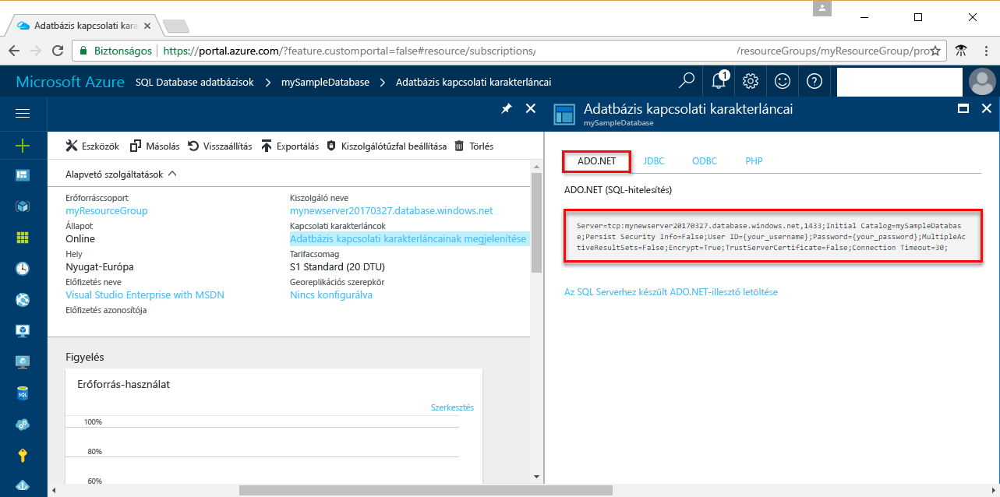

# <a name="use-net-c-with-visual-studio-tooconnect-and-query-an-azure-sql-database"></a>Visual Studio tooconnect .NET (C#) használjon, és egy Azure SQL-adatbázis lekérdezése

Gyors üzembe helyezési oktatóanyag bemutatja, hogyan toouse hello [.NET-keretrendszer](https://www.microsoft.com/net/) toocreate egy C# Visual Studio tooconnect tooan Azure SQL Database programot, és a Transact-SQL utasítás tooquery adatok felhasználásával.

## <a name="prerequisites"></a>Előfeltételek

toocomplete a gyors üzembe helyezési útmutató, győződjön meg arról, hogy a következő hello:

- Azure SQL Database-adatbázis. A gyors üzembe helyezési hoznak létre az egyik a gyors üzembe helyezések hello erőforrást használ: 

   - [DB létrehozása – portál](sql-database-get-started-portal.md)
   - [DB létrehozása – CLI](sql-database-get-started-cli.md)
   - [DB létrehozása – PowerShell](sql-database-get-started-powershell.md)

- A [kiszolgálószintű tűzfalszabály](sql-database-get-started-portal.md#create-a-server-level-firewall-rule) hello nyilvános IP-cím hello számítógép használja a gyors üzembe helyezési útmutató.
- A [Visual Studio Community 2017, a Visual Studio Professional 2017 vagy a Visual Studio Enterprise 2017](https://www.visualstudio.com/downloads/) telepítése.

## <a name="sql-server-connection-information"></a>Az SQL-kiszolgáló kapcsolatadatai

Hello kapcsolat szükséges információkat tooconnect toohello Azure SQL adatbázis beolvasása. Hello teljes kiszolgálónév, az adatbázisnév és a bejelentkezési adatok a következő eljárások hello kell.

1. Jelentkezzen be toohello [Azure-portálon](https://portal.azure.com/).
2. Válassza ki **SQL-adatbázisok** hello bal oldali menüben kattintson a hello adatbázis **SQL-adatbázisok** lap. 
3. A hello **áttekintése** lap az adatbázishoz, tekintse át hello teljesen minősített kiszolgáló neve, ahogy az a következő kép hello. Hello server name toobring hello másolatot is mutat **toocopy kattintson** lehetőséget. 

    

4. Ha az Azure SQL Database kiszolgáló bejelentkezési adatok, keresse meg a toohello SQL adatbázis-kiszolgáló lapon tooview hello server admin neve. Szükség esetén alaphelyzetbe állíthatja a hello jelszót.

5. Kattintson az: **Adatbázis-kapcsolati karakterláncok megjelenítése** elemre.

6. Felülvizsgálati hello teljes **ADO.NET** kapcsolati karakterláncot.

    

> [!IMPORTANT]
> Rendelkeznie kell egy tűzfalszabályt hello nyilvános IP-cím hello számítógép, amelyen ez az oktatóanyag végrehajtása helyen. Ha egy másik számítógépen vagy egy másik nyilvános IP-címet, hozzon létre egy [kiszolgálószintű tűzfal szabály használatával hello Azure-portálon](sql-database-get-started-portal.md#create-a-server-level-firewall-rule). 
>
  
## <a name="create-a-new-visual-studio-project"></a>Új Visual Studio-projekt létrehozása

1. A Visual Studióban válassza a **Fájl**, **Új**, **Projekt** lehetőséget. 
2. A hello **új projekt** párbeszédpanel, és bontsa ki a **Visual C#**.
3. Válassza ki **Konzolalkalmazás** , és írja be *sqltest* hello projekt neve.
4. Kattintson a **OK** toocreate és a nyitott hello a Visual Studio új projekt
4. A Megoldáskezelőben kattintson a jobb gombbal az **sqltest** elemre, majd kattintson a **Manage NuGet Packages** (NuGet-csomagok kezelése) parancsra. 
5. A hello **Tallózás**, keressen ```System.Data.SqlClient``` és, ha található, válassza ki azt.
6. A hello **System.Data.SqlClient** kattintson **telepítése**.
7. Hello telepítés befejezése után tekintse át hello módosításokat, és kattintson a **OK** tooclose hello **előzetes** ablak. 
8. Ha megjelenik egy **License Acceptance** (Licenc elfogadása) ablak, kattintson az **I Accept** (Elfogadom) gombra.

## <a name="insert-code-tooquery-sql-database"></a>Helyezze be a kódját tooquery SQL-adatbázis
1. Váltás túl (vagy ha szükséges) **Program.cs**

2. Cserélje le a hello tartalmát **Program.cs** az alábbi kód, és adja hozzá a megfelelő értékeket hello a kiszolgálóhoz, az adatbázis, a felhasználó és a jelszó hello.

```csharp
using System;
using System.Data.SqlClient;
using System.Text;

namespace sqltest
{
    class Program
    {
        static void Main(string[] args)
        {
            try 
            { 
                SqlConnectionStringBuilder builder = new SqlConnectionStringBuilder();
                builder.DataSource = "your_server.database.windows.net"; 
                builder.UserID = "your_user";            
                builder.Password = "your_password";     
                builder.InitialCatalog = "your_database";

                using (SqlConnection connection = new SqlConnection(builder.ConnectionString))
                {
                    Console.WriteLine("\nQuery data example:");
                    Console.WriteLine("=========================================\n");
                    
                    connection.Open();       
                    StringBuilder sb = new StringBuilder();
                    sb.Append("SELECT TOP 20 pc.Name as CategoryName, p.name as ProductName ");
                    sb.Append("FROM [SalesLT].[ProductCategory] pc ");
                    sb.Append("JOIN [SalesLT].[Product] p ");
                    sb.Append("ON pc.productcategoryid = p.productcategoryid;");
                    String sql = sb.ToString();

                    using (SqlCommand command = new SqlCommand(sql, connection))
                    {
                        using (SqlDataReader reader = command.ExecuteReader())
                        {
                            while (reader.Read())
                            {
                                Console.WriteLine("{0} {1}", reader.GetString(0), reader.GetString(1));
                            }
                        }
                    }                    
                }
            }
            catch (SqlException e)
            {
                Console.WriteLine(e.ToString());
            }
            Console.ReadLine();
        }
    }
}
```

## <a name="run-hello-code"></a>Hello kód futtatása

1. Nyomja le az **F5** toorun hello alkalmazás.
2. Győződjön meg arról, hogy hello felső 20 sorokat ad vissza, és zárja be hello alkalmazás ablak.

## <a name="next-steps"></a>Következő lépések

- Ismerje meg, hogyan túl[kapcsolódás és lekérdezés az Azure SQL-adatbázis használata a .NET core](sql-database-connect-query-dotnet-core.md) a Windows/Linux/macOS.  
- További tudnivalók [Ismerkedés a Windows/Linux/macOS hello parancssor használatával a .NET Core](/dotnet/core/tutorials/using-with-xplat-cli).
- Ismerje meg, hogyan túl[tervezése az első Azure SQL-adatbázis SSMS használatával](sql-database-design-first-database.md) vagy [tervezése az első Azure SQL Database adatbázishoz .NET használatával](sql-database-design-first-database-csharp.md).
- A .NET-ről a [.NET dokumentációjában](https://docs.microsoft.com/dotnet/) talál további információt.
