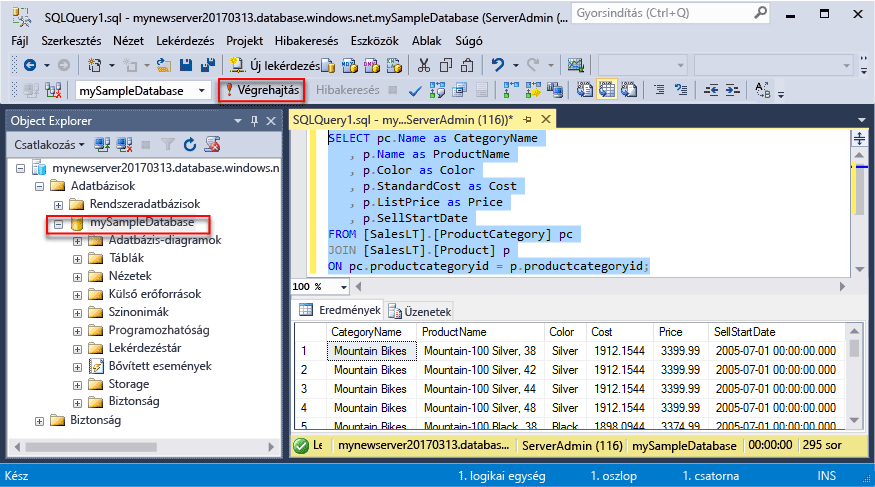
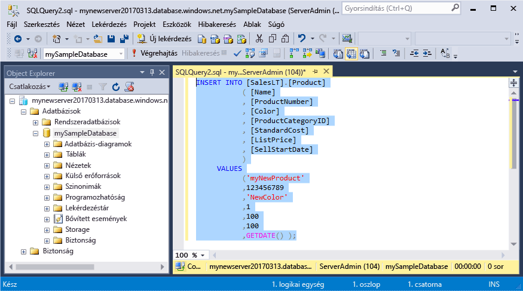
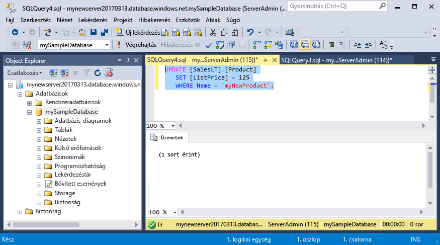
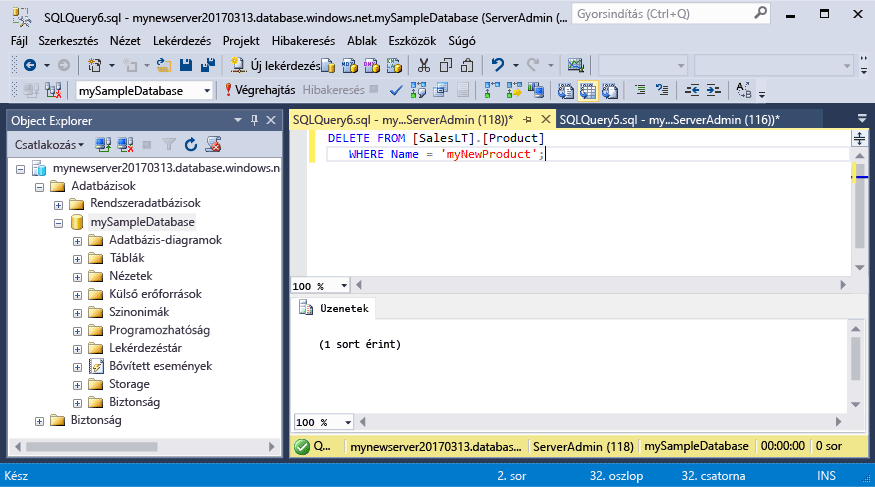

# <a name="azure-sql-database-use-sql-server-management-studio-tooconnect-and-query-data"></a><span data-ttu-id="b91aa-105">Az Azure SQL Database: Használja az SQL Server Management Studio tooconnect és lekérdezési adatok</span><span class="sxs-lookup"><span data-stu-id="b91aa-105">Azure SQL Database: Use SQL Server Management Studio tooconnect and query data</span></span>

<span data-ttu-id="b91aa-106">[SQL Server Management Studio](https://msdn.microsoft.com/library/ms174173.aspx) (SSMS) bármilyen SQL infrastruktúra kezelése az SQL Server tooSQL adatbázis a Microsoft Windows integrált környezetet.</span><span class="sxs-lookup"><span data-stu-id="b91aa-106">[SQL Server Management Studio](https://msdn.microsoft.com/library/ms174173.aspx) (SSMS) is an integrated environment for managing any SQL infrastructure, from SQL Server tooSQL Database for Microsoft Windows.</span></span> <span data-ttu-id="b91aa-107">A gyors üzembe helyezési bemutatja, hogyan toouse SSMS tooconnect tooan Azure SQL-adatbázist, és használja a Transact-SQL utasítás tooquery, beszúrási, frissítési és törlési hello adatbázis adatait.</span><span class="sxs-lookup"><span data-stu-id="b91aa-107">This quick start demonstrates how toouse SSMS tooconnect tooan Azure SQL database, and then use Transact-SQL statements tooquery, insert, update, and delete data in hello database.</span></span> 

## <a name="prerequisites"></a><span data-ttu-id="b91aa-108">Előfeltételek</span><span class="sxs-lookup"><span data-stu-id="b91aa-108">Prerequisites</span></span>

<span data-ttu-id="b91aa-109">A gyors üzembe helyezési használja, mint a kiindulási pont hoznak létre az egyik a gyors üzembe helyezések hello erőforrások:</span><span class="sxs-lookup"><span data-stu-id="b91aa-109">This quick start uses as its starting point hello resources created in one of these quick starts:</span></span>

- [<span data-ttu-id="b91aa-110">DB létrehozása – portál</span><span class="sxs-lookup"><span data-stu-id="b91aa-110">Create DB - Portal</span></span>](sql-database-get-started-portal.md)
- [<span data-ttu-id="b91aa-111">DB létrehozása – CLI</span><span class="sxs-lookup"><span data-stu-id="b91aa-111">Create DB - CLI</span></span>](sql-database-get-started-cli.md)
- [<span data-ttu-id="b91aa-112">DB létrehozása – PowerShell</span><span class="sxs-lookup"><span data-stu-id="b91aa-112">Create DB - PowerShell</span></span>](sql-database-get-started-powershell.md)

<span data-ttu-id="b91aa-113">Mielőtt elkezdené, győződjön meg arról, hello legújabb verziója van telepítve [SSMS](https://msdn.microsoft.com/library/mt238290.aspx).</span><span class="sxs-lookup"><span data-stu-id="b91aa-113">Before you start, make sure you have installed hello newest version of [SSMS](https://msdn.microsoft.com/library/mt238290.aspx).</span></span> 

## <a name="sql-server-connection-information"></a><span data-ttu-id="b91aa-114">Az SQL-kiszolgáló kapcsolatadatai</span><span class="sxs-lookup"><span data-stu-id="b91aa-114">SQL server connection information</span></span>

<span data-ttu-id="b91aa-115">Hello kapcsolat szükséges információkat tooconnect toohello Azure SQL adatbázis beolvasása.</span><span class="sxs-lookup"><span data-stu-id="b91aa-115">Get hello connection information needed tooconnect toohello Azure SQL database.</span></span> <span data-ttu-id="b91aa-116">Hello teljes kiszolgálónév, az adatbázisnév és a bejelentkezési adatok a következő eljárások hello kell.</span><span class="sxs-lookup"><span data-stu-id="b91aa-116">You will need hello fully qualified server name, database name, and login information in hello next procedures.</span></span>

1. <span data-ttu-id="b91aa-117">Jelentkezzen be toohello [Azure-portálon](https://portal.azure.com/).</span><span class="sxs-lookup"><span data-stu-id="b91aa-117">Log in toohello [Azure portal](https://portal.azure.com/).</span></span>
2. <span data-ttu-id="b91aa-118">Válassza ki **SQL-adatbázisok** hello bal oldali menüben kattintson a hello adatbázis **SQL-adatbázisok** lap.</span><span class="sxs-lookup"><span data-stu-id="b91aa-118">Select **SQL Databases** from hello left-hand menu, and click your database on hello **SQL databases** page.</span></span> 
3. <span data-ttu-id="b91aa-119">A hello **áttekintése** az adatbázis lapján tekintse át a hello teljes kiszolgálónév, az alábbi hello ábrán látható módon.</span><span class="sxs-lookup"><span data-stu-id="b91aa-119">On hello **Overview** page for your database, review hello fully qualified server name as shown in hello image below.</span></span> <span data-ttu-id="b91aa-120">Hello server name toobring hello másolatot is mutat **toocopy kattintson** lehetőséget.</span><span class="sxs-lookup"><span data-stu-id="b91aa-120">You can hover over hello server name toobring up hello **Click toocopy** option.</span></span>

    

4. <span data-ttu-id="b91aa-122">Ha elfelejtette a hello bejelentkezési adatok az Azure SQL Database-kiszolgáló, keresse meg a toohello SQL adatbázis-kiszolgáló lapon tooview hello server admin neve és, ha szükséges, állítsa vissza a hello jelszót.</span><span class="sxs-lookup"><span data-stu-id="b91aa-122">If you have forgotten hello login information for your Azure SQL Database server, navigate toohello SQL Database server page tooview hello server admin name and, if necessary, reset hello password.</span></span> 

## <a name="connect-tooyour-database"></a><span data-ttu-id="b91aa-123">Csatlakozás tooyour adatbázis</span><span class="sxs-lookup"><span data-stu-id="b91aa-123">Connect tooyour database</span></span>

<span data-ttu-id="b91aa-124">SQL Server Management Studio tooestablish kapcsolat tooyour Azure SQL adatbázis-kiszolgálót használja.</span><span class="sxs-lookup"><span data-stu-id="b91aa-124">Use SQL Server Management Studio tooestablish a connection tooyour Azure SQL Database server.</span></span> 

> [!IMPORTANT]
> <span data-ttu-id="b91aa-125">Egy Azure SQL Database logikai kiszolgáló figyel az 1433-as porton.</span><span class="sxs-lookup"><span data-stu-id="b91aa-125">An Azure SQL Database logical server listens on port 1433.</span></span> <span data-ttu-id="b91aa-126">Próbált tooconnect tooan Azure SQL Database logikai kiszolgáló a vállalati tűzfalon belül, ha ezt a portot kell megnyitni hello vállalati tűzfal az Ön toosuccessfully csatlakozzon.</span><span class="sxs-lookup"><span data-stu-id="b91aa-126">If you are attempting tooconnect tooan Azure SQL Database logical server from within a corporate firewall, this port must be open in hello corporate firewall for you toosuccessfully connect.</span></span>
>

1. <span data-ttu-id="b91aa-127">Nyissa meg az SQL Server Management Studiót.</span><span class="sxs-lookup"><span data-stu-id="b91aa-127">Open SQL Server Management Studio.</span></span>

2. <span data-ttu-id="b91aa-128">A hello **tooServer csatlakozás** párbeszédpanelen adja meg a következő információ hello:</span><span class="sxs-lookup"><span data-stu-id="b91aa-128">In hello **Connect tooServer** dialog box, enter hello following information:</span></span>

   | <span data-ttu-id="b91aa-129">Beállítás</span><span class="sxs-lookup"><span data-stu-id="b91aa-129">Setting</span></span>       | <span data-ttu-id="b91aa-130">Ajánlott érték</span><span class="sxs-lookup"><span data-stu-id="b91aa-130">Suggested value</span></span> | <span data-ttu-id="b91aa-131">Leírás</span><span class="sxs-lookup"><span data-stu-id="b91aa-131">Description</span></span> | 
   | ------------ | ------------------ | ------------------------------------------------- | 
   | <span data-ttu-id="b91aa-132">**Kiszolgáló típusa**</span><span class="sxs-lookup"><span data-stu-id="b91aa-132">**Server type**</span></span> | <span data-ttu-id="b91aa-133">Adatbázismotor</span><span class="sxs-lookup"><span data-stu-id="b91aa-133">Database engine</span></span> | <span data-ttu-id="b91aa-134">Kötelezően megadandó érték.</span><span class="sxs-lookup"><span data-stu-id="b91aa-134">This value is required.</span></span> |
   | <span data-ttu-id="b91aa-135">**Kiszolgálónév**</span><span class="sxs-lookup"><span data-stu-id="b91aa-135">**Server name**</span></span> | <span data-ttu-id="b91aa-136">hello teljes kiszolgálónév</span><span class="sxs-lookup"><span data-stu-id="b91aa-136">hello fully qualified server name</span></span> | <span data-ttu-id="b91aa-137">hello neve legyen például ehhez hasonló: **mynewserver20170313.database.windows.net**.</span><span class="sxs-lookup"><span data-stu-id="b91aa-137">hello name should be something like this: **mynewserver20170313.database.windows.net**.</span></span> |
   | <span data-ttu-id="b91aa-138">**Hitelesítés**</span><span class="sxs-lookup"><span data-stu-id="b91aa-138">**Authentication**</span></span> | <span data-ttu-id="b91aa-139">SQL Server-hitelesítés</span><span class="sxs-lookup"><span data-stu-id="b91aa-139">SQL Server Authentication</span></span> | <span data-ttu-id="b91aa-140">SQL-hitelesítés ebben az esetben az oktatóanyag hello egyetlen hitelesítési típus.</span><span class="sxs-lookup"><span data-stu-id="b91aa-140">SQL Authentication is hello only authentication type that we have configured in this tutorial.</span></span> |
   | <span data-ttu-id="b91aa-141">**Bejelentkezés**</span><span class="sxs-lookup"><span data-stu-id="b91aa-141">**Login**</span></span> | <span data-ttu-id="b91aa-142">hello server rendszergazdai fiók</span><span class="sxs-lookup"><span data-stu-id="b91aa-142">hello server admin account</span></span> | <span data-ttu-id="b91aa-143">Ez az hello kiszolgáló létrehozásakor megadott hello fiókhoz.</span><span class="sxs-lookup"><span data-stu-id="b91aa-143">This is hello account that you specified when you created hello server.</span></span> |
   | <span data-ttu-id="b91aa-144">**Jelszó**</span><span class="sxs-lookup"><span data-stu-id="b91aa-144">**Password**</span></span> | <span data-ttu-id="b91aa-145">a kiszolgáló rendszergazdai fiókjának hello jelszó</span><span class="sxs-lookup"><span data-stu-id="b91aa-145">hello password for your server admin account</span></span> | <span data-ttu-id="b91aa-146">Ez a hello hello kiszolgáló létrehozásakor megadott jelszót.</span><span class="sxs-lookup"><span data-stu-id="b91aa-146">This is hello password that you specified when you created hello server.</span></span> |

     

3. <span data-ttu-id="b91aa-148">Kattintson a **beállítások** a hello **tooserver csatlakozás** párbeszédpanel megnyitásához.</span><span class="sxs-lookup"><span data-stu-id="b91aa-148">Click **Options** in hello **Connect tooserver** dialog box.</span></span> <span data-ttu-id="b91aa-149">A hello **toodatabase csatlakozás** területen adja meg **mySampleDatabase** tooconnect toothis adatbázis.</span><span class="sxs-lookup"><span data-stu-id="b91aa-149">In hello **Connect toodatabase** section, enter **mySampleDatabase** tooconnect toothis database.</span></span>

     

4. <span data-ttu-id="b91aa-151">Kattintson a **Connect** (Csatlakozás) gombra.</span><span class="sxs-lookup"><span data-stu-id="b91aa-151">Click **Connect**.</span></span> <span data-ttu-id="b91aa-152">SSMS hello Object Explorer ablak nyílik meg.</span><span class="sxs-lookup"><span data-stu-id="b91aa-152">hello Object Explorer window opens in SSMS.</span></span> 

     

5. <span data-ttu-id="b91aa-154">Az Object Explorerben bontsa ki a **adatbázisok** majd **mySampleDatabase** tooview hello objektumok hello mintaadatbázis.</span><span class="sxs-lookup"><span data-stu-id="b91aa-154">In Object Explorer, expand **Databases** and then expand **mySampleDatabase** tooview hello objects in hello sample database.</span></span>

## <a name="query-data"></a><span data-ttu-id="b91aa-155">Adatok lekérdezése</span><span class="sxs-lookup"><span data-stu-id="b91aa-155">Query data</span></span>

<span data-ttu-id="b91aa-156">Használjon hello következő hello első 20 termékeknél tooquery kódot hello segítségével kategória szerint [válasszon](https://msdn.microsoft.com/library/ms189499.aspx) Transact-SQL-utasításban.</span><span class="sxs-lookup"><span data-stu-id="b91aa-156">Use hello following code tooquery for hello top 20 products by category using hello [SELECT](https://msdn.microsoft.com/library/ms189499.aspx) Transact-SQL statement.</span></span>

1. <span data-ttu-id="b91aa-157">Az Object Explorerben kattintson a jobb gombbal a **mySampleDatabase** adatbázisra, majd kattintson a **New Query** (Új lekérdezés) elemre.</span><span class="sxs-lookup"><span data-stu-id="b91aa-157">In Object Explorer, right-click **mySampleDatabase** and click **New Query**.</span></span> <span data-ttu-id="b91aa-158">Üres lekérdezés megnyílik egy ablak, amely csatlakoztatott tooyour adatbázis.</span><span class="sxs-lookup"><span data-stu-id="b91aa-158">A blank query window opens that is connected tooyour database.</span></span>
2. <span data-ttu-id="b91aa-159">Adja meg a következő lekérdezés hello hello lekérdezési ablakban:</span><span class="sxs-lookup"><span data-stu-id="b91aa-159">In hello query window, enter hello following query:</span></span>

   ```sql
   SELECT pc.Name as CategoryName, p.name as ProductName
   FROM [SalesLT].[ProductCategory] pc
   JOIN [SalesLT].[Product] p
   ON pc.productcategoryid = p.productcategoryid;
   ```

3. <span data-ttu-id="b91aa-160">Hello eszköztáron kattintson **Execute** hello termék- és a ProductCategory táblázatok tooretrieve adatait.</span><span class="sxs-lookup"><span data-stu-id="b91aa-160">On hello toolbar, click **Execute** tooretrieve data from hello Product and ProductCategory tables.</span></span>

    

## <a name="insert-data"></a><span data-ttu-id="b91aa-162">Adat beszúrása</span><span class="sxs-lookup"><span data-stu-id="b91aa-162">Insert data</span></span>

<span data-ttu-id="b91aa-163">Használjon hello következő kódot tooinsert egy új terméken hello segítségével hello SalesLT.Product táblába [BESZÚRÁSA](https://msdn.microsoft.com/library/ms174335.aspx) Transact-SQL-utasításban.</span><span class="sxs-lookup"><span data-stu-id="b91aa-163">Use hello following code tooinsert a new product into hello SalesLT.Product table using hello [INSERT](https://msdn.microsoft.com/library/ms174335.aspx) Transact-SQL statement.</span></span>

1. <span data-ttu-id="b91aa-164">Hello lekérdezési ablakban cserélje le a következő lekérdezés hello hello előző lekérdezést:</span><span class="sxs-lookup"><span data-stu-id="b91aa-164">In hello query window, replace hello previous query with hello following query:</span></span>

   ```sql
   INSERT INTO [SalesLT].[Product]
           ( [Name]
           , [ProductNumber]
           , [Color]
           , [ProductCategoryID]
           , [StandardCost]
           , [ListPrice]
           , [SellStartDate]
           )
     VALUES
           ('myNewProduct'
           ,123456789
           ,'NewColor'
           ,1
           ,100
           ,100
           ,GETDATE() );
   ```

2. <span data-ttu-id="b91aa-165">Hello eszköztáron kattintson **Execute** tooinsert hello termék tábla új sort.</span><span class="sxs-lookup"><span data-stu-id="b91aa-165">On hello toolbar, click **Execute**  tooinsert a new row in hello Product table.</span></span>

    

## <a name="update-data"></a><span data-ttu-id="b91aa-166">Adatok frissítése</span><span class="sxs-lookup"><span data-stu-id="b91aa-166">Update data</span></span>

<span data-ttu-id="b91aa-167">Használjon hello következő tooupdate hello új terméket, hogy korábban hozzáadott hello segítségével kódot [frissítés](https://msdn.microsoft.com/library/ms177523.aspx) Transact-SQL-utasításban.</span><span class="sxs-lookup"><span data-stu-id="b91aa-167">Use hello following code tooupdate hello new product that you previously added using hello [UPDATE](https://msdn.microsoft.com/library/ms177523.aspx) Transact-SQL statement.</span></span>

1. <span data-ttu-id="b91aa-168">Hello lekérdezési ablakban cserélje le a következő lekérdezés hello hello előző lekérdezést:</span><span class="sxs-lookup"><span data-stu-id="b91aa-168">In hello query window, replace hello previous query with hello following query:</span></span>

   ```sql
   UPDATE [SalesLT].[Product]
   SET [ListPrice] = 125
   WHERE Name = 'myNewProduct';
   ```

2. <span data-ttu-id="b91aa-169">Hello eszköztáron kattintson **Execute** tooupdate hello a megadott sor hello termék táblában.</span><span class="sxs-lookup"><span data-stu-id="b91aa-169">On hello toolbar, click **Execute** tooupdate hello specified row in hello Product table.</span></span>

    

## <a name="delete-data"></a><span data-ttu-id="b91aa-170">Adat törlése</span><span class="sxs-lookup"><span data-stu-id="b91aa-170">Delete data</span></span>

<span data-ttu-id="b91aa-171">Használjon hello következő toodelete hello új terméket, hogy korábban hozzáadott hello segítségével kódot [törlése](https://msdn.microsoft.com/library/ms189835.aspx) Transact-SQL-utasításban.</span><span class="sxs-lookup"><span data-stu-id="b91aa-171">Use hello following code toodelete hello new product that you previously added using hello [DELETE](https://msdn.microsoft.com/library/ms189835.aspx) Transact-SQL statement.</span></span>

1. <span data-ttu-id="b91aa-172">Hello lekérdezési ablakban cserélje le a következő lekérdezés hello hello előző lekérdezést:</span><span class="sxs-lookup"><span data-stu-id="b91aa-172">In hello query window, replace hello previous query with hello following query:</span></span>

   ```sql
   DELETE FROM [SalesLT].[Product]
   WHERE Name = 'myNewProduct';
   ```

2. <span data-ttu-id="b91aa-173">Hello eszköztáron kattintson **Execute** toodelete hello a megadott sor hello termék táblában.</span><span class="sxs-lookup"><span data-stu-id="b91aa-173">On hello toolbar, click **Execute** toodelete hello specified row in hello Product table.</span></span>

    

## <a name="next-steps"></a><span data-ttu-id="b91aa-174">Következő lépések</span><span class="sxs-lookup"><span data-stu-id="b91aa-174">Next steps</span></span>

- <span data-ttu-id="b91aa-175">Tekintse meg a kiszolgálók és a Transact-SQL-adatbázisok létrehozására és kezelésére vonatkozó toolearn [tudnivalók Azure SQL Database-kiszolgálók és adatbázisok](sql-database-servers-databases.md).</span><span class="sxs-lookup"><span data-stu-id="b91aa-175">toolearn about creating and managing servers and databases with Transact-SQL, see [Learn about Azure SQL Database servers and databases](sql-database-servers-databases.md).</span></span>
- <span data-ttu-id="b91aa-176">Az SSMS eszközről további információt [az SQL Server Management Studio használatát ismertető cikkben talál](https://msdn.microsoft.com/library/ms174173.aspx).</span><span class="sxs-lookup"><span data-stu-id="b91aa-176">For information about SSMS, see [Use SQL Server Management Studio](https://msdn.microsoft.com/library/ms174173.aspx).</span></span>
- <span data-ttu-id="b91aa-177">tooconnect és a lekérdezés segítségével a Visual Studio Code [kapcsolódás és lekérdezés Visual Studio Code](sql-database-connect-query-vscode.md).</span><span class="sxs-lookup"><span data-stu-id="b91aa-177">tooconnect and query using Visual Studio Code, see [Connect and query with Visual Studio Code](sql-database-connect-query-vscode.md).</span></span>
- <span data-ttu-id="b91aa-178">tooconnect és lekérdezés használata a .NET, lásd: [kapcsolódás és lekérdezés .NET](sql-database-connect-query-dotnet.md).</span><span class="sxs-lookup"><span data-stu-id="b91aa-178">tooconnect and query using .NET, see [Connect and query with .NET](sql-database-connect-query-dotnet.md).</span></span>
- <span data-ttu-id="b91aa-179">tooconnect és a PHP-lekérdezésre [csatlakozás és a PHP lekérdezés](sql-database-connect-query-php.md).</span><span class="sxs-lookup"><span data-stu-id="b91aa-179">tooconnect and query using PHP, see [Connect and query with PHP](sql-database-connect-query-php.md).</span></span>
- <span data-ttu-id="b91aa-180">tooconnect és lekérdezés használata Node.js-t, tekintse meg [kapcsolódás és lekérdezés Node.js](sql-database-connect-query-nodejs.md).</span><span class="sxs-lookup"><span data-stu-id="b91aa-180">tooconnect and query using Node.js, see [Connect and query with Node.js](sql-database-connect-query-nodejs.md).</span></span>
- <span data-ttu-id="b91aa-181">tooconnect és lekérdezés javás környezetekben, lásd: [kapcsolódás és lekérdezés Java](sql-database-connect-query-java.md).</span><span class="sxs-lookup"><span data-stu-id="b91aa-181">tooconnect and query using Java, see [Connect and query with Java](sql-database-connect-query-java.md).</span></span>
- <span data-ttu-id="b91aa-182">tooconnect és lekérdezés pythonos környezetekben, lásd: [kapcsolódás és lekérdezés Python](sql-database-connect-query-python.md).</span><span class="sxs-lookup"><span data-stu-id="b91aa-182">tooconnect and query using Python, see [Connect and query with Python](sql-database-connect-query-python.md).</span></span>
- <span data-ttu-id="b91aa-183">tooconnect és lekérdezésre Ruby, lásd: [kapcsolódás és lekérdezés Ruby](sql-database-connect-query-ruby.md).</span><span class="sxs-lookup"><span data-stu-id="b91aa-183">tooconnect and query using Ruby, see [Connect and query with Ruby](sql-database-connect-query-ruby.md).</span></span>
