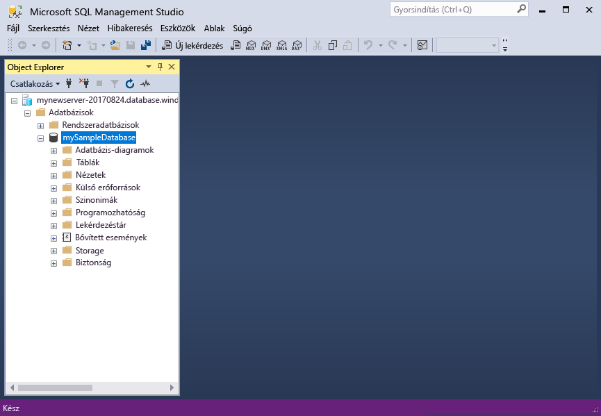

# <a name="azure-sql-database-use-sql-server-management-studio-tooconnect-and-query-data"></a>Az Azure SQL Database: Használja az SQL Server Management Studio tooconnect és lekérdezési adatok

[SQL Server Management Studio](https://msdn.microsoft.com/library/ms174173.aspx) (SSMS) bármilyen SQL infrastruktúra kezelése az SQL Server tooSQL adatbázis a Microsoft Windows integrált környezetet. A gyors üzembe helyezési bemutatja, hogyan toouse SSMS tooconnect tooan Azure SQL-adatbázist, és használja a Transact-SQL utasítás tooquery, beszúrási, frissítési és törlési hello adatbázis adatait. 

## <a name="prerequisites"></a>Előfeltételek

A gyors üzembe helyezési használja, mint a kiindulási pont hoznak létre az egyik a gyors üzembe helyezések hello erőforrások:

- [DB létrehozása – portál](sql-database-get-started-portal.md)
- [DB létrehozása – CLI](sql-database-get-started-cli.md)
- [DB létrehozása – PowerShell](sql-database-get-started-powershell.md)

Mielőtt elkezdené, győződjön meg arról, hello legújabb verziója van telepítve [SSMS](https://msdn.microsoft.com/library/mt238290.aspx). 

## <a name="sql-server-connection-information"></a>Az SQL-kiszolgáló kapcsolatadatai

Hello kapcsolat szükséges információkat tooconnect toohello Azure SQL adatbázis beolvasása. Hello teljes kiszolgálónév, az adatbázisnév és a bejelentkezési adatok a következő eljárások hello kell.

1. Jelentkezzen be toohello [Azure-portálon](https://portal.azure.com/).
2. Válassza ki **SQL-adatbázisok** hello bal oldali menüben kattintson a hello adatbázis **SQL-adatbázisok** lap. 
3. A hello **áttekintése** az adatbázis lapján tekintse át a hello teljes kiszolgálónév, az alábbi hello ábrán látható módon. Hello server name toobring hello másolatot is mutat **toocopy kattintson** lehetőséget.

    

4. Ha elfelejtette a hello bejelentkezési adatok az Azure SQL Database-kiszolgáló, keresse meg a toohello SQL adatbázis-kiszolgáló lapon tooview hello server admin neve és, ha szükséges, állítsa vissza a hello jelszót. 

## <a name="connect-tooyour-database"></a>Csatlakozás tooyour adatbázis

SQL Server Management Studio tooestablish kapcsolat tooyour Azure SQL adatbázis-kiszolgálót használja. 

> [!IMPORTANT]
> Egy Azure SQL Database logikai kiszolgáló figyel az 1433-as porton. Próbált tooconnect tooan Azure SQL Database logikai kiszolgáló a vállalati tűzfalon belül, ha ezt a portot kell megnyitni hello vállalati tűzfal az Ön toosuccessfully csatlakozzon.
>

1. Nyissa meg az SQL Server Management Studiót.

2. A hello **tooServer csatlakozás** párbeszédpanelen adja meg a következő információ hello:

   | Beállítás       | Ajánlott érték | Leírás | 
   | ------------ | ------------------ | ------------------------------------------------- | 
   | **Kiszolgáló típusa** | Adatbázismotor | Kötelezően megadandó érték. |
   | **Kiszolgálónév** | hello teljes kiszolgálónév | hello neve legyen például ehhez hasonló: **mynewserver20170313.database.windows.net**. |
   | **Hitelesítés** | SQL Server-hitelesítés | SQL-hitelesítés ebben az esetben az oktatóanyag hello egyetlen hitelesítési típus. |
   | **Bejelentkezés** | hello server rendszergazdai fiók | Ez az hello kiszolgáló létrehozásakor megadott hello fiókhoz. |
   | **Jelszó** | a kiszolgáló rendszergazdai fiókjának hello jelszó | Ez a hello hello kiszolgáló létrehozásakor megadott jelszót. |

     

3. Kattintson a **beállítások** a hello **tooserver csatlakozás** párbeszédpanel megnyitásához. A hello **toodatabase csatlakozás** területen adja meg **mySampleDatabase** tooconnect toothis adatbázis.

     

4. Kattintson a **Connect** (Csatlakozás) gombra. SSMS hello Object Explorer ablak nyílik meg. 

     

5. Az Object Explorerben bontsa ki a **adatbázisok** majd **mySampleDatabase** tooview hello objektumok hello mintaadatbázis.

## <a name="query-data"></a>Adatok lekérdezése

Használjon hello következő hello első 20 termékeknél tooquery kódot hello segítségével kategória szerint [válasszon](https://msdn.microsoft.com/library/ms189499.aspx) Transact-SQL-utasításban.

1. Az Object Explorerben kattintson a jobb gombbal a **mySampleDatabase** adatbázisra, majd kattintson a **New Query** (Új lekérdezés) elemre. Üres lekérdezés megnyílik egy ablak, amely csatlakoztatott tooyour adatbázis.
2. Adja meg a következő lekérdezés hello hello lekérdezési ablakban:

   ```sql
   SELECT pc.Name as CategoryName, p.name as ProductName
   FROM [SalesLT].[ProductCategory] pc
   JOIN [SalesLT].[Product] p
   ON pc.productcategoryid = p.productcategoryid;
   ```

3. Hello eszköztáron kattintson **Execute** hello termék- és a ProductCategory táblázatok tooretrieve adatait.

    

## <a name="insert-data"></a>Adat beszúrása

Használjon hello következő kódot tooinsert egy új terméken hello segítségével hello SalesLT.Product táblába [BESZÚRÁSA](https://msdn.microsoft.com/library/ms174335.aspx) Transact-SQL-utasításban.

1. Hello lekérdezési ablakban cserélje le a következő lekérdezés hello hello előző lekérdezést:

   ```sql
   INSERT INTO [SalesLT].[Product]
           ( [Name]
           , [ProductNumber]
           , [Color]
           , [ProductCategoryID]
           , [StandardCost]
           , [ListPrice]
           , [SellStartDate]
           )
     VALUES
           ('myNewProduct'
           ,123456789
           ,'NewColor'
           ,1
           ,100
           ,100
           ,GETDATE() );
   ```

2. Hello eszköztáron kattintson **Execute** tooinsert hello termék tábla új sort.

    

## <a name="update-data"></a>Adatok frissítése

Használjon hello következő tooupdate hello új terméket, hogy korábban hozzáadott hello segítségével kódot [frissítés](https://msdn.microsoft.com/library/ms177523.aspx) Transact-SQL-utasításban.

1. Hello lekérdezési ablakban cserélje le a következő lekérdezés hello hello előző lekérdezést:

   ```sql
   UPDATE [SalesLT].[Product]
   SET [ListPrice] = 125
   WHERE Name = 'myNewProduct';
   ```

2. Hello eszköztáron kattintson **Execute** tooupdate hello a megadott sor hello termék táblában.

    

## <a name="delete-data"></a>Adat törlése

Használjon hello következő toodelete hello új terméket, hogy korábban hozzáadott hello segítségével kódot [törlése](https://msdn.microsoft.com/library/ms189835.aspx) Transact-SQL-utasításban.

1. Hello lekérdezési ablakban cserélje le a következő lekérdezés hello hello előző lekérdezést:

   ```sql
   DELETE FROM [SalesLT].[Product]
   WHERE Name = 'myNewProduct';
   ```

2. Hello eszköztáron kattintson **Execute** toodelete hello a megadott sor hello termék táblában.

    

## <a name="next-steps"></a>Következő lépések

- Tekintse meg a kiszolgálók és a Transact-SQL-adatbázisok létrehozására és kezelésére vonatkozó toolearn [tudnivalók Azure SQL Database-kiszolgálók és adatbázisok](sql-database-servers-databases.md).
- Az SSMS eszközről további információt [az SQL Server Management Studio használatát ismertető cikkben talál](https://msdn.microsoft.com/library/ms174173.aspx).
- tooconnect és a lekérdezés segítségével a Visual Studio Code [kapcsolódás és lekérdezés Visual Studio Code](sql-database-connect-query-vscode.md).
- tooconnect és lekérdezés használata a .NET, lásd: [kapcsolódás és lekérdezés .NET](sql-database-connect-query-dotnet.md).
- tooconnect és a PHP-lekérdezésre [csatlakozás és a PHP lekérdezés](sql-database-connect-query-php.md).
- tooconnect és lekérdezés használata Node.js-t, tekintse meg [kapcsolódás és lekérdezés Node.js](sql-database-connect-query-nodejs.md).
- tooconnect és lekérdezés javás környezetekben, lásd: [kapcsolódás és lekérdezés Java](sql-database-connect-query-java.md).
- tooconnect és lekérdezés pythonos környezetekben, lásd: [kapcsolódás és lekérdezés Python](sql-database-connect-query-python.md).
- tooconnect és lekérdezésre Ruby, lásd: [kapcsolódás és lekérdezés Ruby](sql-database-connect-query-ruby.md).
