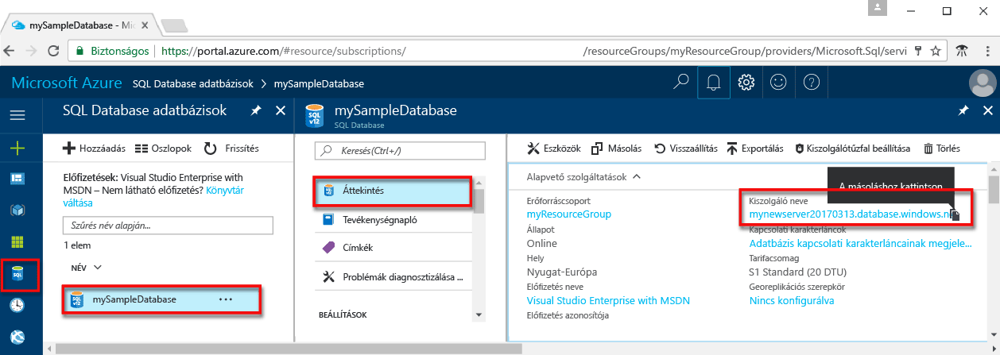

# <a name="azure-sql-database-use-visual-studio-code-tooconnect-and-query-data"></a><span data-ttu-id="523f8-105">Az Azure SQL Database: Használja a Visual Studio Code tooconnect és lekérdezési adatok</span><span class="sxs-lookup"><span data-stu-id="523f8-105">Azure SQL Database: Use Visual Studio Code tooconnect and query data</span></span>

<span data-ttu-id="523f8-106">[A Visual Studio Code](https://code.visualstudio.com/docs) egy grafikus kód szerkesztő Linux, macOS, és, amely támogatja a kiterjesztések, beleértve a Windows hello [mssql bővítmény](https://aka.ms/mssql-marketplace) Microsoft SQL Server, az Azure SQL Database és az SQL Data Warehouse lekérdezése.</span><span class="sxs-lookup"><span data-stu-id="523f8-106">[Visual Studio Code](https://code.visualstudio.com/docs) is a graphical code editor for Linux, macOS, and Windows that supports extensions, including hello [mssql extension](https://aka.ms/mssql-marketplace) for querying Microsoft SQL Server, Azure SQL Database, and SQL Data Warehouse.</span></span> <span data-ttu-id="523f8-107">A gyors üzembe helyezési bemutatja, hogyan toouse Visual Studio Code tooconnect tooan Azure SQL-adatbázist, és használja a Transact-SQL utasítás tooquery, beszúrási, frissítési és törlési hello adatbázis adatait.</span><span class="sxs-lookup"><span data-stu-id="523f8-107">This quick start demonstrates how toouse Visual Studio Code tooconnect tooan Azure SQL database, and then use Transact-SQL statements tooquery, insert, update, and delete data in hello database.</span></span>

## <a name="prerequisites"></a><span data-ttu-id="523f8-108">Előfeltételek</span><span class="sxs-lookup"><span data-stu-id="523f8-108">Prerequisites</span></span>

<span data-ttu-id="523f8-109">A gyors üzembe helyezési használja, mint a kiindulási pont hoznak létre az egyik a gyors üzembe helyezések hello erőforrások:</span><span class="sxs-lookup"><span data-stu-id="523f8-109">This quick start uses as its starting point hello resources created in one of these quick starts:</span></span>

- [<span data-ttu-id="523f8-110">DB létrehozása – portál</span><span class="sxs-lookup"><span data-stu-id="523f8-110">Create DB - Portal</span></span>](sql-database-get-started-portal.md)
- [<span data-ttu-id="523f8-111">DB létrehozása – CLI</span><span class="sxs-lookup"><span data-stu-id="523f8-111">Create DB - CLI</span></span>](sql-database-get-started-cli.md)
- [<span data-ttu-id="523f8-112">DB létrehozása – PowerShell</span><span class="sxs-lookup"><span data-stu-id="523f8-112">Create DB - PowerShell</span></span>](sql-database-get-started-powershell.md)

<span data-ttu-id="523f8-113">Mielőtt elkezdené, győződjön meg arról, hello legújabb verziója van telepítve [Visual Studio Code](https://code.visualstudio.com/Download) és betöltött hello [mssql bővítmény](https://aka.ms/mssql-marketplace).</span><span class="sxs-lookup"><span data-stu-id="523f8-113">Before you start, make sure you have installed hello newest version of [Visual Studio Code](https://code.visualstudio.com/Download) and loaded hello [mssql extension](https://aka.ms/mssql-marketplace).</span></span> <span data-ttu-id="523f8-114">Hello mssql bővítmény telepítési útmutatásért lásd: [Visual STUDIO Code telepítése](https://docs.microsoft.com/sql/linux/sql-server-linux-develop-use-vscode#install-vs-code) és [a Visual Studio Code mssql](https://marketplace.visualstudio.com/items?itemName=ms-mssql.mssql).</span><span class="sxs-lookup"><span data-stu-id="523f8-114">For installation guidance for hello mssql extension, see [Install VS Code](https://docs.microsoft.com/sql/linux/sql-server-linux-develop-use-vscode#install-vs-code) and see [mssql for Visual Studio Code](https://marketplace.visualstudio.com/items?itemName=ms-mssql.mssql).</span></span> 

## <a name="configure-vs-code"></a><span data-ttu-id="523f8-115">A VS Code konfigurálása</span><span class="sxs-lookup"><span data-stu-id="523f8-115">Configure VS Code</span></span> 

### <a name="mac-os"></a><span data-ttu-id="523f8-116">**Mac OS**</span><span class="sxs-lookup"><span data-stu-id="523f8-116">**Mac OS**</span></span>
<span data-ttu-id="523f8-117">MacOS kell tooinstall OpenSSL, amely egy előfeltétel, hogy mssql kiterjesztés DotNet Core célokra.</span><span class="sxs-lookup"><span data-stu-id="523f8-117">For macOS, you need tooinstall OpenSSL which is a prerequiste for DotNet Core that mssql extention uses.</span></span> <span data-ttu-id="523f8-118">Nyissa meg a terminált, és írja be a következő parancsok tooinstall hello **brew** és **OpenSSL**.</span><span class="sxs-lookup"><span data-stu-id="523f8-118">Open your terminal and enter hello following commands tooinstall **brew** and **OpenSSL**.</span></span> 

```bash
ruby -e "$(curl -fsSL https://raw.githubusercontent.com/Homebrew/install/master/install)"
brew update
brew install openssl
mkdir -p /usr/local/lib
ln -s /usr/local/opt/openssl/lib/libcrypto.1.0.0.dylib /usr/local/lib/
ln -s /usr/local/opt/openssl/lib/libssl.1.0.0.dylib /usr/local/lib/
```

### <a name="linux-ubuntu"></a><span data-ttu-id="523f8-119">**Linux (Ubuntu)**</span><span class="sxs-lookup"><span data-stu-id="523f8-119">**Linux (Ubuntu)**</span></span>

<span data-ttu-id="523f8-120">Nincs szükség különleges konfigurációra.</span><span class="sxs-lookup"><span data-stu-id="523f8-120">No special configuration needed.</span></span>

### <a name="windows"></a><span data-ttu-id="523f8-121">**Windows**</span><span class="sxs-lookup"><span data-stu-id="523f8-121">**Windows**</span></span>

<span data-ttu-id="523f8-122">Nincs szükség különleges konfigurációra.</span><span class="sxs-lookup"><span data-stu-id="523f8-122">No special configuration needed.</span></span>

## <a name="sql-server-connection-information"></a><span data-ttu-id="523f8-123">Az SQL-kiszolgáló kapcsolatadatai</span><span class="sxs-lookup"><span data-stu-id="523f8-123">SQL server connection information</span></span>

<span data-ttu-id="523f8-124">Hello kapcsolat szükséges információkat tooconnect toohello Azure SQL adatbázis beolvasása.</span><span class="sxs-lookup"><span data-stu-id="523f8-124">Get hello connection information needed tooconnect toohello Azure SQL database.</span></span> <span data-ttu-id="523f8-125">Hello teljes kiszolgálónév, az adatbázisnév és a bejelentkezési adatok a következő eljárások hello kell.</span><span class="sxs-lookup"><span data-stu-id="523f8-125">You will need hello fully qualified server name, database name, and login information in hello next procedures.</span></span>

1. <span data-ttu-id="523f8-126">Jelentkezzen be toohello [Azure-portálon](https://portal.azure.com/).</span><span class="sxs-lookup"><span data-stu-id="523f8-126">Log in toohello [Azure portal](https://portal.azure.com/).</span></span>
2. <span data-ttu-id="523f8-127">Válassza ki **SQL-adatbázisok** hello bal oldali menüben kattintson a hello adatbázis **SQL-adatbázisok** lap.</span><span class="sxs-lookup"><span data-stu-id="523f8-127">Select **SQL Databases** from hello left-hand menu, and click your database on hello **SQL databases** page.</span></span> 
3. <span data-ttu-id="523f8-128">A hello **áttekintése** lap az adatbázishoz, tekintse át hello teljesen minősített kiszolgáló neve, ahogy az a következő kép hello.</span><span class="sxs-lookup"><span data-stu-id="523f8-128">On hello **Overview** page for your database, review hello fully qualified server name as shown in hello following image.</span></span> <span data-ttu-id="523f8-129">Hello server name toobring hello másolatot is mutat **toocopy kattintson** lehetőséget.</span><span class="sxs-lookup"><span data-stu-id="523f8-129">You can hover over hello server name toobring up hello **Click toocopy** option.</span></span>

    

4. <span data-ttu-id="523f8-131">Ha elfelejtette a hello bejelentkezési adatok az Azure SQL Database-kiszolgáló, keresse meg a toohello SQL adatbázis-kiszolgáló lapon tooview hello server admin neve és, ha szükséges, állítsa vissza a hello jelszót.</span><span class="sxs-lookup"><span data-stu-id="523f8-131">If you have forgotten hello login information for your Azure SQL Database server, navigate toohello SQL Database server page tooview hello server admin name and, if necessary, reset hello password.</span></span> 

## <a name="set-language-mode-toosql"></a><span data-ttu-id="523f8-132">Set language mód tooSQL</span><span class="sxs-lookup"><span data-stu-id="523f8-132">Set language mode tooSQL</span></span>

<span data-ttu-id="523f8-133">Hello nyelvi mód beállítása értéke túl**SQL** a Visual Studio Code tooenable mssql parancsok és a T-SQL IntelliSense.</span><span class="sxs-lookup"><span data-stu-id="523f8-133">Set hello language mode is set too**SQL** in Visual Studio Code tooenable mssql commands and T-SQL IntelliSense.</span></span>

1. <span data-ttu-id="523f8-134">Nyisson meg egy új Visual Studio Code-ablakot.</span><span class="sxs-lookup"><span data-stu-id="523f8-134">Open a new Visual Studio Code window.</span></span> 

2. <span data-ttu-id="523f8-135">Kattintson a **egyszerű szöveges** a hello jobb alsó sarkában hello állapotsor.</span><span class="sxs-lookup"><span data-stu-id="523f8-135">Click **Plain Text** in hello lower right-hand corner of hello status bar.</span></span>
3. <span data-ttu-id="523f8-136">A hello **nyelv kijelölését mód** megnyíló legördülő menü, írja be **SQL**, majd nyomja le az **ENTER** tooset hello nyelvi mód tooSQL.</span><span class="sxs-lookup"><span data-stu-id="523f8-136">In hello **Select language mode** drop-down menu that opens, type **SQL**, and then press **ENTER** tooset hello language mode tooSQL.</span></span> 

   

## <a name="connect-tooyour-database"></a><span data-ttu-id="523f8-138">Csatlakozás tooyour adatbázis</span><span class="sxs-lookup"><span data-stu-id="523f8-138">Connect tooyour database</span></span>

<span data-ttu-id="523f8-139">Visual Studio Code tooestablish kapcsolat tooyour Azure SQL adatbázis-kiszolgálót használja.</span><span class="sxs-lookup"><span data-stu-id="523f8-139">Use Visual Studio Code tooestablish a connection tooyour Azure SQL Database server.</span></span>

> [!IMPORTANT]
> <span data-ttu-id="523f8-140">A folytatás előtt győződjön meg arról, hogy rendelkezésére állnak a kiszolgálóval és az adatbázissal kapcsolatos, valamint a bejelentkezési adatok.</span><span class="sxs-lookup"><span data-stu-id="523f8-140">Before continuing, make sure that you have your server, database, and login information ready.</span></span> <span data-ttu-id="523f8-141">Kezdés belépés hello kapcsolati profil adatait, ha módosítja a fókusz a Visual Studio Code követően toorestart hello kapcsolati profil létrehozása.</span><span class="sxs-lookup"><span data-stu-id="523f8-141">Once you begin entering hello connection profile information, if you change your focus from Visual Studio Code, you have toorestart creating hello connection profile.</span></span>
>

1. <span data-ttu-id="523f8-142">A Visual STUDIO Code, nyomja le a **CTRL + SHIFT + P** (vagy **F1**) tooopen hello parancs palettát.</span><span class="sxs-lookup"><span data-stu-id="523f8-142">In VS Code, press **CTRL+SHIFT+P** (or **F1**) tooopen hello Command Palette.</span></span>

2. <span data-ttu-id="523f8-143">Írja be az **sqlcon** parancsot, és nyomja le az **ENTER** billentyűt.</span><span class="sxs-lookup"><span data-stu-id="523f8-143">Type **sqlcon** and press **ENTER**.</span></span>

3. <span data-ttu-id="523f8-144">Nyomja le az **ENTER** tooselect **kapcsolatprofil létrehozása**.</span><span class="sxs-lookup"><span data-stu-id="523f8-144">Press **ENTER** tooselect **Create Connection Profile**.</span></span> <span data-ttu-id="523f8-145">Ezzel létrehoz egy kapcsolati profilt az SQL Server-példányhoz.</span><span class="sxs-lookup"><span data-stu-id="523f8-145">This creates a connection profile for your SQL Server instance.</span></span>

4. <span data-ttu-id="523f8-146">Hajtsa végre a hello kér toospecify hello kapcsolat tulajdonságai hello új kapcsolati profil számára.</span><span class="sxs-lookup"><span data-stu-id="523f8-146">Follow hello prompts toospecify hello connection properties for hello new connection profile.</span></span> <span data-ttu-id="523f8-147">Adja meg az egyes értékek, nyomja le az **ENTER** toocontinue.</span><span class="sxs-lookup"><span data-stu-id="523f8-147">After specifying each value, press **ENTER** toocontinue.</span></span> 

   | <span data-ttu-id="523f8-148">Beállítás</span><span class="sxs-lookup"><span data-stu-id="523f8-148">Setting</span></span>       | <span data-ttu-id="523f8-149">Ajánlott érték</span><span class="sxs-lookup"><span data-stu-id="523f8-149">Suggested value</span></span> | <span data-ttu-id="523f8-150">Leírás</span><span class="sxs-lookup"><span data-stu-id="523f8-150">Description</span></span> |
   | ------------ | ------------------ | ------------------------------------------------- | 
   | <span data-ttu-id="523f8-151">**Kiszolgálónév</span><span class="sxs-lookup"><span data-stu-id="523f8-151">**Server name</span></span> | <span data-ttu-id="523f8-152">hello teljes kiszolgálónév</span><span class="sxs-lookup"><span data-stu-id="523f8-152">hello fully qualified server name</span></span> | <span data-ttu-id="523f8-153">hello neve legyen például ehhez hasonló: **mynewserver20170313.database.windows.net**.</span><span class="sxs-lookup"><span data-stu-id="523f8-153">hello name should be something like this: **mynewserver20170313.database.windows.net**.</span></span> |
   | <span data-ttu-id="523f8-154">**Adatbázis neve**</span><span class="sxs-lookup"><span data-stu-id="523f8-154">**Database name**</span></span> | <span data-ttu-id="523f8-155">mySampleDatabase</span><span class="sxs-lookup"><span data-stu-id="523f8-155">mySampleDatabase</span></span> | <span data-ttu-id="523f8-156">hello adatbázis toowhich tooconnect hello neve.</span><span class="sxs-lookup"><span data-stu-id="523f8-156">hello name of hello database toowhich tooconnect.</span></span> |
   | <span data-ttu-id="523f8-157">**Hitelesítés**</span><span class="sxs-lookup"><span data-stu-id="523f8-157">**Authentication**</span></span> | <span data-ttu-id="523f8-158">SQL-bejelentkezés</span><span class="sxs-lookup"><span data-stu-id="523f8-158">SQL Login</span></span>| <span data-ttu-id="523f8-159">SQL-hitelesítés ebben az esetben az oktatóanyag hello egyetlen hitelesítési típus.</span><span class="sxs-lookup"><span data-stu-id="523f8-159">SQL Authentication is hello only authentication type that we have configured in this tutorial.</span></span> |
   | <span data-ttu-id="523f8-160">**Felhasználónév**</span><span class="sxs-lookup"><span data-stu-id="523f8-160">**User name**</span></span> | <span data-ttu-id="523f8-161">hello server rendszergazdai fiók</span><span class="sxs-lookup"><span data-stu-id="523f8-161">hello server admin account</span></span> | <span data-ttu-id="523f8-162">Ez az hello kiszolgáló létrehozásakor megadott hello fiókhoz.</span><span class="sxs-lookup"><span data-stu-id="523f8-162">This is hello account that you specified when you created hello server.</span></span> |
   | <span data-ttu-id="523f8-163">**Jelszó (SQL-bejelentkezés)**</span><span class="sxs-lookup"><span data-stu-id="523f8-163">**Password (SQL Login)**</span></span> | <span data-ttu-id="523f8-164">a kiszolgáló rendszergazdai fiókjának hello jelszó</span><span class="sxs-lookup"><span data-stu-id="523f8-164">hello password for your server admin account</span></span> | <span data-ttu-id="523f8-165">Ez a hello hello kiszolgáló létrehozásakor megadott jelszót.</span><span class="sxs-lookup"><span data-stu-id="523f8-165">This is hello password that you specified when you created hello server.</span></span> |
   | <span data-ttu-id="523f8-166">**Menti a jelszót?**</span><span class="sxs-lookup"><span data-stu-id="523f8-166">**Save Password?**</span></span> | <span data-ttu-id="523f8-167">Igen vagy Nem</span><span class="sxs-lookup"><span data-stu-id="523f8-167">Yes or No</span></span> | <span data-ttu-id="523f8-168">Ha nem szeretné, hogy tooenter hello jelszó minden alkalommal, amikor, válassza az Igen gombra.</span><span class="sxs-lookup"><span data-stu-id="523f8-168">Select Yes if you do not want tooenter hello password each time.</span></span> |
   | <span data-ttu-id="523f8-169">**Adja meg a profil kívánt nevét**</span><span class="sxs-lookup"><span data-stu-id="523f8-169">**Enter a name for this profile**</span></span> | <span data-ttu-id="523f8-170">Egy profilnév, például: **mySampleDatabase**</span><span class="sxs-lookup"><span data-stu-id="523f8-170">A profile name, such as **mySampleDatabase**</span></span> | <span data-ttu-id="523f8-171">A mentett profilnév felgyorsítja a csatlakozást a későbbi bejelentkezések során.</span><span class="sxs-lookup"><span data-stu-id="523f8-171">A saved profile name speeds your connection on subsequent logins.</span></span> | 

5. <span data-ttu-id="523f8-172">Nyomja le az hello **ESC** kulcs tooclose hello tájékoztató üzenet értesíti arról, hogy hello-profil létrehozása és csatlakoztatva van.</span><span class="sxs-lookup"><span data-stu-id="523f8-172">Press hello **ESC** key tooclose hello info message that informs you that hello profile is created and connected.</span></span>

6. <span data-ttu-id="523f8-173">A kapcsolat ellenőrzése hello állapotsorban.</span><span class="sxs-lookup"><span data-stu-id="523f8-173">Verify your connection in hello status bar.</span></span>

   

## <a name="query-data"></a><span data-ttu-id="523f8-175">Adatok lekérdezése</span><span class="sxs-lookup"><span data-stu-id="523f8-175">Query data</span></span>

<span data-ttu-id="523f8-176">Használjon hello következő hello első 20 termékeknél tooquery kódot hello segítségével kategória szerint [válasszon](https://msdn.microsoft.com/library/ms189499.aspx) Transact-SQL-utasításban.</span><span class="sxs-lookup"><span data-stu-id="523f8-176">Use hello following code tooquery for hello top 20 products by category using hello [SELECT](https://msdn.microsoft.com/library/ms189499.aspx) Transact-SQL statement.</span></span>

1. <span data-ttu-id="523f8-177">A hello **szerkesztő** ablak, írja be a következő lekérdezés hello üres lekérdezési ablakban hello:</span><span class="sxs-lookup"><span data-stu-id="523f8-177">In hello **Editor** window, enter hello following query in hello empty query window:</span></span>

   ```sql
   SELECT pc.Name as CategoryName, p.name as ProductName
   FROM [SalesLT].[ProductCategory] pc
   JOIN [SalesLT].[Product] p
   ON pc.productcategoryid = p.productcategoryid;
   ```

2. <span data-ttu-id="523f8-178">Nyomja le az **CTRL + SHIFT + E** hello termék- és a ProductCategory táblázatok tooretrieve adatait.</span><span class="sxs-lookup"><span data-stu-id="523f8-178">Press **CTRL+SHIFT+E** tooretrieve data from hello Product and ProductCategory tables.</span></span>

    

## <a name="insert-data"></a><span data-ttu-id="523f8-180">Adat beszúrása</span><span class="sxs-lookup"><span data-stu-id="523f8-180">Insert data</span></span>

<span data-ttu-id="523f8-181">Használjon hello következő kódot tooinsert egy új terméken hello segítségével hello SalesLT.Product táblába [BESZÚRÁSA](https://msdn.microsoft.com/library/ms174335.aspx) Transact-SQL-utasításban.</span><span class="sxs-lookup"><span data-stu-id="523f8-181">Use hello following code tooinsert a new product into hello SalesLT.Product table using hello [INSERT](https://msdn.microsoft.com/library/ms174335.aspx) Transact-SQL statement.</span></span>

1. <span data-ttu-id="523f8-182">A hello **szerkesztő** ablakban hello előző lekérdezés törlése, és írja be a következő lekérdezés hello:</span><span class="sxs-lookup"><span data-stu-id="523f8-182">In hello **Editor** window, delete hello previous query and enter hello following query:</span></span>

   ```sql
   INSERT INTO [SalesLT].[Product]
           ( [Name]
           , [ProductNumber]
           , [Color]
           , [ProductCategoryID]
           , [StandardCost]
           , [ListPrice]
           , [SellStartDate]
           )
     VALUES
           ('myNewProduct'
           ,123456789
           ,'NewColor'
           ,1
           ,100
           ,100
           ,GETDATE() );
   ```

2. <span data-ttu-id="523f8-183">Nyomja le az **CTRL + SHIFT + E** tooinsert hello termék tábla új sort.</span><span class="sxs-lookup"><span data-stu-id="523f8-183">Press **CTRL+SHIFT+E** tooinsert a new row in hello Product table.</span></span>

## <a name="update-data"></a><span data-ttu-id="523f8-184">Adatok frissítése</span><span class="sxs-lookup"><span data-stu-id="523f8-184">Update data</span></span>

<span data-ttu-id="523f8-185">Használjon hello következő tooupdate hello új terméket, hogy korábban hozzáadott hello segítségével kódot [frissítés](https://msdn.microsoft.com/library/ms177523.aspx) Transact-SQL-utasításban.</span><span class="sxs-lookup"><span data-stu-id="523f8-185">Use hello following code tooupdate hello new product that you previously added using hello [UPDATE](https://msdn.microsoft.com/library/ms177523.aspx) Transact-SQL statement.</span></span>

1.  <span data-ttu-id="523f8-186">A hello **szerkesztő** ablakban hello előző lekérdezés törlése, és írja be a következő lekérdezés hello:</span><span class="sxs-lookup"><span data-stu-id="523f8-186">In hello **Editor** window, delete hello previous query and enter hello following query:</span></span>

   ```sql
   UPDATE [SalesLT].[Product]
   SET [ListPrice] = 125
   WHERE Name = 'myNewProduct';
   ```

2. <span data-ttu-id="523f8-187">Nyomja le az **CTRL + SHIFT + E** tooupdate hello a megadott sor hello termék táblában.</span><span class="sxs-lookup"><span data-stu-id="523f8-187">Press **CTRL+SHIFT+E** tooupdate hello specified row in hello Product table.</span></span>

## <a name="delete-data"></a><span data-ttu-id="523f8-188">Adat törlése</span><span class="sxs-lookup"><span data-stu-id="523f8-188">Delete data</span></span>

<span data-ttu-id="523f8-189">Használjon hello következő toodelete hello új terméket, hogy korábban hozzáadott hello segítségével kódot [törlése](https://msdn.microsoft.com/library/ms189835.aspx) Transact-SQL-utasításban.</span><span class="sxs-lookup"><span data-stu-id="523f8-189">Use hello following code toodelete hello new product that you previously added using hello [DELETE](https://msdn.microsoft.com/library/ms189835.aspx) Transact-SQL statement.</span></span>

1. <span data-ttu-id="523f8-190">A hello **szerkesztő** ablakban hello előző lekérdezés törlése, és írja be a következő lekérdezés hello:</span><span class="sxs-lookup"><span data-stu-id="523f8-190">In hello **Editor** window, delete hello previous query and enter hello following query:</span></span>

   ```sql
   DELETE FROM [SalesLT].[Product]
   WHERE Name = 'myNewProduct';
   ```

2. <span data-ttu-id="523f8-191">Nyomja le az **CTRL + SHIFT + E** toodelete hello a megadott sor hello termék táblában.</span><span class="sxs-lookup"><span data-stu-id="523f8-191">Press **CTRL+SHIFT+E** toodelete hello specified row in hello Product table.</span></span>

## <a name="next-steps"></a><span data-ttu-id="523f8-192">Következő lépések</span><span class="sxs-lookup"><span data-stu-id="523f8-192">Next steps</span></span>

- <span data-ttu-id="523f8-193">tooconnect és az SQL Server Management Studio használatával lekérdezés [kapcsolódás és lekérdezés ssms alkalmazásával](sql-database-connect-query-ssms.md).</span><span class="sxs-lookup"><span data-stu-id="523f8-193">tooconnect and query using SQL Server Management Studio, see [Connect and query with SSMS](sql-database-connect-query-ssms.md).</span></span>
- <span data-ttu-id="523f8-194">Az MSDN magazin Visual Studio Code használatáról szóló cikkéhez lásd az [Adatbázis IDE létrehozása az MSSQL bővítménnyel blogbejegyzést](https://msdn.microsoft.com/magazine/mt809115).</span><span class="sxs-lookup"><span data-stu-id="523f8-194">For an MSDN magazine article on using Visual Studio Code, see [Create a database IDE with MSSQL extension blog post](https://msdn.microsoft.com/magazine/mt809115).</span></span>
