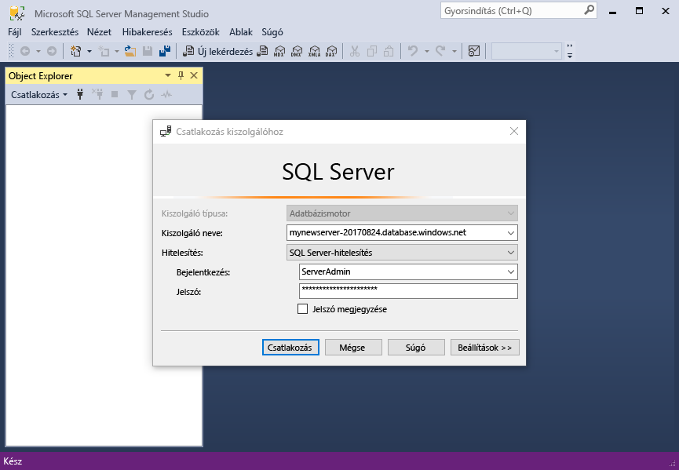
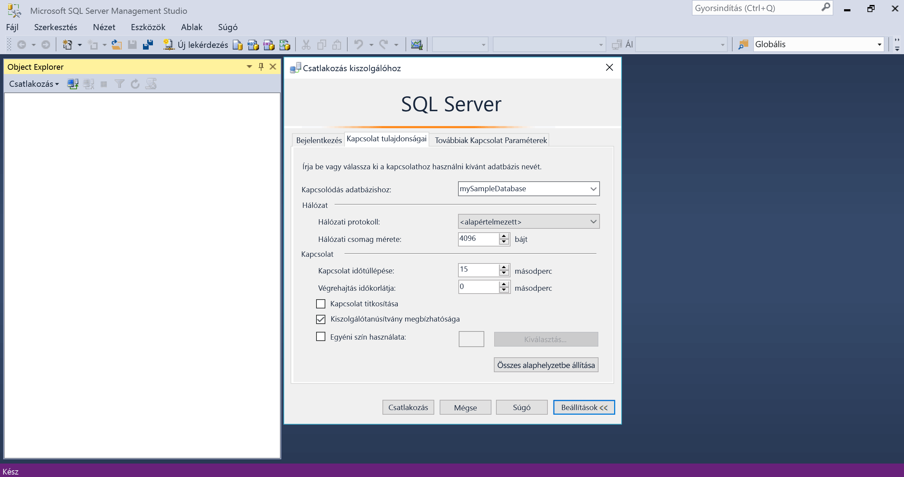
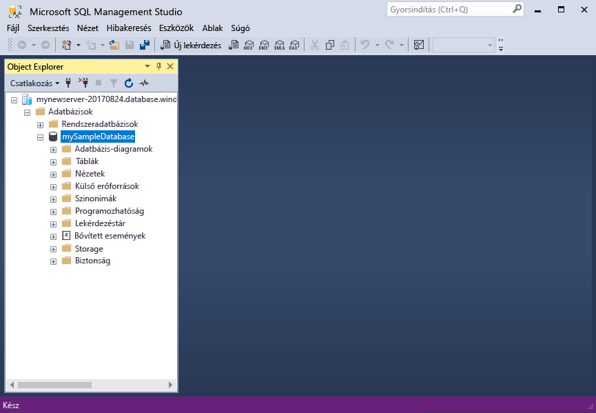

# <a name="design-your-first-azure-sql-database"></a>Az első Azure SQL-adatbázis megtervezése

Az Azure SQL-adatbázis egy relációs adatbázis-mint – a szolgáltatás, a Microsoft Cloud ("Azure") hello. Ebben az oktatóanyagban elsajátíthatja, hogyan toouse hello Azure-portálon és [SQL Server Management Studio](https://msdn.microsoft.com/library/ms174173.aspx) (SSMS) számára: 

> [!div class="checklist"]
> * Hozzon létre egy adatbázist hello Azure-portálon
> * Állítson be egy kiszolgálószintű tűzfalszabályt hello Azure-portálon
> * Csatlakozás toohello adatbázis ssms alkalmazásával
> * Táblázatok létrehozása az ssms alkalmazásával
> * A tömeges adatok betöltése a BCP-vel
> * Lekérdezés ssms alkalmazásával adatok
> * Állítsa vissza az előző hello adatbázis tooa [időponthoz kötött visszaállítás](sql-database-recovery-using-backups.md#point-in-time-restore) a hello Azure-portálon

Ha nem rendelkezik Azure-előfizetéssel, [ingyenes fiók létrehozását](https://azure.microsoft.com/free/) megkezdése előtt.

## <a name="prerequisites"></a>Előfeltételek

toocomplete ezen oktatóanyag, győződjön meg arról, hogy telepítette:
- hello legújabb verziójának [SQL Server Management Studio](https://msdn.microsoft.com/library/ms174173.aspx) (SSMS).
- hello legújabb verziójának [BCP és SQLCMD](https://www.microsoft.com/download/details.aspx?id=36433).

## <a name="log-in-toohello-azure-portal"></a>Jelentkezzen be toohello Azure-portálon

Jelentkezzen be toohello [Azure-portálon](https://portal.azure.com/).

## <a name="create-a-blank-sql-database"></a>Üres SQL-adatbázis létrehozása

Az Azure SQL-adatbázis [számítási és tárolási erőforrások](sql-database-service-tiers.md) egy meghatározott készletével együtt jön létre. hello adatbázist a rendszer létrehoz egy [Azure erőforráscsoport](../azure-resource-manager/resource-group-overview.md) és az egy [Azure SQL Database logikai kiszolgáló](sql-database-features.md). 

Kövesse ezeket a lépéseket toocreate üres SQL-adatbázis. 

1. Kattintson a hello **új** hello bal felső sarkában hello Azure-portálon található gombra.

2. Válassza ki **adatbázisok** a hello **új** lapon, és válassza ki **SQL-adatbázis** a hello **adatbázisok** lap. 

   

3. Hello SQL-adatbázis űrlap kitöltése a következő információ, hello kép megelőző hello szerint:   

   | Beállítás       | Ajánlott érték | Leírás | 
   | ------------ | ------------------ | ------------------------------------------------- | 
   | **Adatbázis neve** | mySampleDatabase | Az érvényes adatbázisnevekkel kapcsolatban lásd az [adatbázis-azonosítókat](https://docs.microsoft.com/sql/relational-databases/databases/database-identifiers) ismertető cikket. | 
   | **Előfizetés** | Az Ön előfizetése  | Az előfizetései részleteivel kapcsolatban lásd az [előfizetéseket](https://account.windowsazure.com/Subscriptions) ismertető cikket. |
   | **Erőforráscsoport** | myResourceGroup | Az érvényes erőforráscsoport-nevekkel kapcsolatban lásd az [elnevezési szabályokat és korlátozásokat](https://docs.microsoft.com/azure/architecture/best-practices/naming-conventions) ismertető cikket. |
   | **Forrás kiválasztása** | Az üres adatbázis | Meghatározza, hogy egy üres adatbázist kell létrehozni. |

4. Kattintson a **Server** toocreate és az új adatbázis új kiszolgáló konfigurálása. Töltse ki a hello **új kiszolgáló űrlap** a következő információ hello: 

   | Beállítás       | Ajánlott érték | Leírás | 
   | ------------ | ------------------ | ------------------------------------------------- | 
   | **Kiszolgálónév** | Bármely globálisan egyedi név | Az érvényes kiszolgálónevekkel kapcsolatban lásd az [elnevezési szabályokat és korlátozásokat](https://docs.microsoft.com/azure/architecture/best-practices/naming-conventions) ismertető cikket. | 
   | **Kiszolgálói rendszergazdai bejelentkezés** | Bármely érvényes név | Az érvényes bejelentkezési nevekkel kapcsolatban lásd az [adatbázis-azonosítókat](https://docs.microsoft.com/sql/relational-databases/databases/database-identifiers) ismertető cikket.|
   | **Jelszó** | Bármely érvényes jelszó | A jelszó legalább 8 karakterből kell állnia, és a következő kategóriák hello hármat tartalmaznia kell: nagybetűk, kisbetűk, számok és nem alfanumerikus karakterek száma. |
   | **Hely** | Bármely érvényes hely | A régiókkal kapcsolatos információkért lásd [az Azure régióit](https://azure.microsoft.com/regions/) ismertető cikket. |

   

5. Kattintson a **Kiválasztás** gombra.

6. Kattintson a **tarifacsomag** toospecify hello és teljesítményszintet szolgáltatásszint az új adatbázishoz. A jelen oktatóanyag esetében válassza ki a **20 Dtu** és **250** GB tárhelyet.

   

7. Kattintson az **Alkalmaz** gombra.  

8. Válassza ki a **rendezés** hello üres adatbázis (a jelen oktatóanyag esetében használja hello alapértelmezett érték). Rendezések kapcsolatos további információkért lásd: [rendezések](https://docs.microsoft.com/sql/t-sql/statements/collations)

9. Kattintson a **létrehozása** tooprovision hello adatbázis. Kiépítés kapcsolatos egy perc és fél toocomplete vesz igénybe. 

10. Hello eszköztáron kattintson **értesítések** toomonitor hello telepítési folyamat.

   

## <a name="create-a-server-level-firewall-rule"></a>Kiszolgálószintű tűzfalszabály létrehozása

SQL Database szolgáltatás hello tűzfal hello kiszolgálói szinten-, amely megakadályozza, hogy a külső alkalmazások és eszközök toohello kiszolgáló vagy hello kiszolgálón lévő összes adatbázis csatlakozzon, kivéve, ha egy tűzfalszabály tooopen hello tűzfal adott IP-címekhez hoz létre. Kövesse az alábbi lépéseket toocreate egy [SQL-adatbázis kiszolgálószintű tűzfalszabály](sql-database-firewall-configure.md) az ügyfél IP-cím, és engedélyezze a külső kapcsolatot csak az IP-cím hello SQL-adatbázis tűzfalon keresztül. 

> [!NOTE]
> Az SQL Database az 1433-as porton kommunikál. Ha a vállalati hálózatból származó tooconnect, a hálózati tűzfal előfordulhat, hogy nem engedélyezett a 1433-as port kimenő forgalmát. Ha igen, kivéve, ha az IT-részleg megnyitja az 1433-as port tooyour Azure SQL adatbázis-kiszolgáló nem lehet csatlakoztatni.
>

1. Hello központi telepítés befejezése után kattintson **SQL-adatbázisok** hello bal oldali menüből, és kattintson a **mySampleDatabase** a hello **SQL-adatbázisok** lap. hello áttekintő lapjára jut a adatbázis megnyílik, teljes mértékben hello megjelenítő minősített kiszolgáló neve (például **mynewserver20170313.database.windows.net**) és további konfigurációs lehetőségeket. Későbbi felhasználás céljára másolja ki ezt a teljes kiszolgálónevet.

   > [!IMPORTANT]
   > A teljesen minősített neve tooconnect tooyour kiszolgálók és a későbbi gyors üzembe helyezések adatbázisainak van szükség.
   > 

    

2. Kattintson a **kiszolgáló tűzfalának beállítása** hello eszköztár hello előző ábrának megfelelően. Hello **tűzfalbeállítások** hello SQL Database-kiszolgálóhoz tartozó lapon nyílik meg. 

    


3. Kattintson a **ügyfél IP-cím hozzáadása** hello eszköztár tooadd meg az aktuális IP-cím tooa Új tűzfalszabály. A tűzfalszabály az 1433-as portot egy egyedi IP-cím vagy egy IP-címtartomány számára nyithatja meg.

4. Kattintson a **Save** (Mentés) gombra. Az aktuális IP-címek hello logikai kiszolgálón 1433-as port megnyitása egy kiszolgálószintű tűzfalszabályt jön létre.

    

4. Kattintson a **OK** , majd zárja be a hello **tűzfalbeállítások** lap.

Csatlakoztathatja toohello SQL adatbázis-kiszolgáló és az adatbázisok, SQL Server Management Studio vagy az Ön által választott, a korábban létrehozott hello kiszolgáló rendszergazdai fiókjának használatával IP-címről egy másik eszköz használatával.

> [!IMPORTANT]
> Az összes Azure-szolgáltatások alapértelmezés szerint engedélyezve van a hozzáférés hello SQL-adatbázis tűzfalon keresztül. Kattintson a **OFF** meg a lap toodisable az összes Azure-szolgáltatásokhoz.

## <a name="sql-server-connection-information"></a>Az SQL-kiszolgáló kapcsolatadatai

Az Azure SQL Database-kiszolgálóhoz hello kiszolgáló teljesen minősített nevet lekérése hello Azure-portálon. Használhat hello teljesen minősített neve tooconnect tooyour kiszolgálók SQL Server Management Studio használatával.

1. Jelentkezzen be toohello [Azure-portálon](https://portal.azure.com/).
2. Válassza ki **SQL-adatbázisok** hello bal oldali menüben kattintson a hello adatbázis **SQL-adatbázisok** lap. 
3. A hello **Essentials** hello Azure portálon az adatbázis paneljén található, és másolja hello **kiszolgálónév**.

   

## <a name="connect-toohello-database-with-ssms"></a>Csatlakozás toohello adatbázis ssms alkalmazásával

Használjon [SQL Server Management Studio](https://docs.microsoft.com/sql/ssms/sql-server-management-studio-ssms) tooestablish kapcsolat tooyour Azure SQL adatbázis-kiszolgálót.

1. Nyissa meg az SQL Server Management Studiót.

2. A hello **tooServer csatlakozás** párbeszédpanelen adja meg a következő információ hello:

   | Beállítás       | Ajánlott érték | Leírás | 
   | ------------ | ------------------ | ------------------------------------------------- | 
   | Kiszolgáló típusa | Adatbázismotor | Ez értékének megadása kötelező. |
   | Kiszolgálónév | hello teljes kiszolgálónév | hello neve legyen például ehhez hasonló: **mynewserver20170313.database.windows.net**. |
   | Authentication | SQL Server-hitelesítés | SQL-hitelesítés ebben az esetben az oktatóanyag hello egyetlen hitelesítési típus. |
   | Bejelentkezés | hello server rendszergazdai fiók | Ez az hello kiszolgáló létrehozásakor megadott hello fiókhoz. |
   | Jelszó | a kiszolgáló rendszergazdai fiókjának hello jelszó | Ez a hello hello kiszolgáló létrehozásakor megadott jelszót. |

   

3. Kattintson a **beállítások** a hello **tooserver csatlakozás** párbeszédpanel megnyitásához. A hello **toodatabase csatlakozás** területen adja meg **mySampleDatabase** tooconnect toothis adatbázis.

     

4. Kattintson a **Connect** (Csatlakozás) gombra. SSMS hello Object Explorer ablak nyílik meg. 

5. Az Object Explorerben bontsa ki a **adatbázisok** majd **mySampleDatabase** tooview hello objektumok hello mintaadatbázis.

     

## <a name="create-tables-in-hello-database"></a>Táblázatok létrehozása hello adatbázis 

Hozzon létre egy adatbázis-séma négy-táblázatot, amely a modell használatával felsőoktatási student felügyeleti rendszer [Transact-SQL](https://docs.microsoft.com/sql/t-sql/language-reference):

- Személy
- Működés során
- Student
- A modell felsőoktatási student felügyeleti rendszer jóváírása

hello alábbi ábrán látható, hogyan ezek a táblázatok egyéb kapcsolódó tooeach. Ezek a táblázatok némelyike hivatkozhat, más táblák oszlopaira. Például a hello Student tábla hivatkozik a hello **PersonId** hello oszlopa **személy** tábla. Vizsgálat hello diagram toounderstand hogyan hello táblák ebben az oktatóanyagban kapcsolódó tooone egy másik. Az útmutató részletes nézze meg a toocreate hatékony adatbázistáblák, lásd: [hatékony adatbázistáblák létrehozása](https://msdn.microsoft.com/library/cc505842.aspx). Adattípusok kiválasztására vonatkozó további információkért lásd: [adattípusok](https://docs.microsoft.com/sql/t-sql/data-types/data-types-transact-sql).

> [!NOTE]
> Is használhatja a hello [tábla designer az SQL Server Management Studio](https://msdn.microsoft.com/library/hh272695.aspx) toocreate és a táblák tervezéséhez. 


1. Az Object Explorerben kattintson a jobb gombbal a **mySampleDatabase** adatbázisra, majd kattintson a **New Query** (Új lekérdezés) elemre. Üres lekérdezés megnyílik egy ablak, amely csatlakoztatott tooyour adatbázis.

2. Hello lekérdezési ablakban hajtható végre a következő lekérdezés toocreate négy táblák az adatbázisban hello: 

   ```sql 
   -- Create Person table

   CREATE TABLE Person
   (
   PersonId   INT IDENTITY PRIMARY KEY,
   FirstName   NVARCHAR(128) NOT NULL,
   MiddelInitial NVARCHAR(10),
   LastName   NVARCHAR(128) NOT NULL,
   DateOfBirth   DATE NOT NULL
   )
   
   -- Create Student table
 
   CREATE TABLE Student
   (
   StudentId INT IDENTITY PRIMARY KEY,
   PersonId  INT REFERENCES Person (PersonId),
   Email   NVARCHAR(256)
   )
   
   -- Create Course table
 
   CREATE TABLE Course
   (
   CourseId  INT IDENTITY PRIMARY KEY,
   Name   NVARCHAR(50) NOT NULL,
   Teacher   NVARCHAR(256) NOT NULL
   ) 

   -- Create Credit table
 
   CREATE TABLE Credit
   (
   StudentId   INT REFERENCES Student (StudentId),
   CourseId   INT REFERENCES Course (CourseId),
   Grade   DECIMAL(5,2) CHECK (Grade <= 100.00),
   Attempt   TINYINT,
   CONSTRAINT  [UQ_studentgrades] UNIQUE CLUSTERED
   (
   StudentId, CourseId, Grade, Attempt
   )
   )
   ```

   

3. Bontsa ki a hello "tábla" csomópont hello SQL Server Management Studio objektum explorer toosee hello táblában létrehozott.

   

## <a name="load-data-into-hello-tables"></a>Adatok betöltése az hello táblák

1. Hozzon létre egy nevű **SampleTableData** Letöltések mappába toostore minta tartozó adatok az adatbázis. 

2. Kattintson a jobb gombbal hello következő csatolja, és mentse őket az hello **SampleTableData** mappa. 

   - [SampleCourseData](https://sqldbtutorial.blob.core.windows.net/tutorials/SampleCourseData)
   - [SamplePersonData](https://sqldbtutorial.blob.core.windows.net/tutorials/SamplePersonData)
   - [SampleStudentData](https://sqldbtutorial.blob.core.windows.net/tutorials/SampleStudentData)
   - [SampleCreditData](https://sqldbtutorial.blob.core.windows.net/tutorials/SampleCreditData)

3. Nyisson meg egy parancssori ablakot, és keresse meg a toohello SampleTableData mappa.

4. Hajtsa végre a következő parancsok tooinsert mintaadatok hello értékek cseréje hello táblákba hello **kiszolgálónév**, **DatabaseName**, **felhasználónév**, és **Jelszó** hello értékek környezetnek.
  
   ```bcp
   bcp Course in SampleCourseData -S <ServerName>.database.windows.net -d <DatabaseName> -U <Username> -P <password> -q -c -t ","
   bcp Person in SamplePersonData -S <ServerName>.database.windows.net -d <DatabaseName> -U <Username> -P <password> -q -c -t ","
   bcp Student in SampleStudentData -S <ServerName>.database.windows.net -d <DatabaseName> -U <Username> -P <password> -q -c -t ","
   bcp Credit in SampleCreditData -S <ServerName>.database.windows.net -d <DatabaseName> -U <Username> -P <password> -q -c -t ","
   ```

Most már betöltött mintaadatok korábban létrehozott hello táblákba.

## <a name="query-data"></a>Adatok lekérdezése

Hajtható végre a következő lekérdezések tooretrieve információ a hello adatbázistáblák hello. Lásd: [SQL-lekérdezések írása](https://technet.microsoft.com/library/bb264565.aspx) toolearn további SQL-lekérdezések írása. hello első lekérdezés összes négy táblák toofind hello diákok tanított által "Dominick Pope" a osztály egy besorolási 75 %-nál nagyobb rendelkező csatlakozik. hello második lekérdezés összes négy táblák, és megkeresi, amelyben "Noe Coleman" legalább egyszer regisztrált összes tanfolyamokat.

1. Egy SQL Server Management Studio lekérdezési ablakban hajtható végre a következő lekérdezés hello:

   ```sql 
   -- Find hello students taught by Dominick Pope who have a grade higher than 75%

   SELECT  person.FirstName,
   person.LastName,
   course.Name,
   credit.Grade
   FROM  Person AS person
   INNER JOIN Student AS student ON person.PersonId = student.PersonId
   INNER JOIN Credit AS credit ON student.StudentId = credit.StudentId
   INNER JOIN Course AS course ON credit.CourseId = course.courseId
   WHERE course.Teacher = 'Dominick Pope' 
   AND Grade > 75
   ```

2. Egy SQL Server Management Studio lekérdezési ablakban hajtható végre a következő lekérdezést:

   ```sql
   -- Find all hello courses in which Noe Coleman has ever enrolled

   SELECT  course.Name,
   course.Teacher,
   credit.Grade
   FROM  Course AS course
   INNER JOIN Credit AS credit ON credit.CourseId = course.CourseId
   INNER JOIN Student AS student ON student.StudentId = credit.StudentId
   INNER JOIN Person AS person ON person.PersonId = student.PersonId
   WHERE person.FirstName = 'Noe'
   AND person.LastName = 'Coleman'
   ```

## <a name="restore-a-database-tooa-previous-point-in-time"></a>Egy adatbázis tooa korábbi időpontra időbeli visszaállítása

Tegyük fel, hogy véletlenül törölt egy tábla. Ez a valami nem egyszerűen állíthat helyre. Azure SQL Database lehetővé teszi toogo hátsó tooany pont hello időpont utolsó too35 nap mentése és visszaállítása ezen a pontján idő tooa új adatbázis. Az adatbázis toorecover Ön is a törölt adatokat. hello lépések visszaállítási hello minta adatbázis tooa pont előtt hello táblák lettek hozzáadva.

1. Az adatbázis hello SQL-adatbázis lapján kattintson **visszaállítása** hello eszköztáron. Hello **visszaállítása** lap megnyitásakor.

   

2. Töltse ki a hello **visszaállítása** hello szükséges információt a képernyőn:
    * Adatbázis neve: Adjon meg egy adatbázisnevet 
    * Időpontban: Select hello **-időpontban** hello visszaállítási képernyőn lapja. 
    * Visszaállítási pont: válassza ki a megfelelő hello adatbázis módosítása előtt kerül
    * Célkiszolgáló: Ez az érték nem módosítható, ha az adatbázis visszaállítása 
    * A rugalmas adatbáziskészlet: válasszon **nincs**  
    * A tarifacsomag: válasszon **20 dtu-k** és **250 GB** tárolási.

   

3. Kattintson a **OK** toorestore hello adatbázis túl[visszaállítási tooa pont időben](sql-database-recovery-using-backups.md#point-in-time-restore) előtt hello táblák lettek hozzáadva. Tooa különböző ponttá adatbázis időbeli visszaállítása adatbázist hoz létre duplikált hello ugyanarra a kiszolgálóra hello eredeti adatbázis frissítésétől hello pont időben ad meg, mindaddig, amíg a hello megőrzési időtartamon belül van a [szolgáltatásréteg](sql-database-service-tiers.md).

## <a name="next-steps"></a>Következő lépések 
Ebben az oktatóanyagban megismerte az alapvető adatbázis-feladatok például egy adatbázis és a táblák létrehozása, betölteni és kérdezhet le adatokat, és hello adatbázis tooa korábbi időpontra visszaállítása időben. Megismerte, hogyan végezheti el az alábbi műveleteket:
> [!div class="checklist"]
> * Adatbázis létrehozása
> * A tűzfalszabályok beállítása
> * Csatlakozás toohello adatbázis [SQL Server Management Studio](https://msdn.microsoft.com/library/ms174173.aspx) (SSMS)
> * Táblázatok létrehozása
> * Tömeges betöltési adatok
> * Adatok lekérdezése
> * Hello adatbázis tooa korábbi időpontra, amikor az SQL-adatbázis visszaállítása [időponthoz kötött visszaállítás](sql-database-recovery-using-backups.md#point-in-time-restore) képességek

Előzetes toohello oktatóanyag következő toolearn tervezése a Visual Studio és a C# egy adatbázist.

> [!div class="nextstepaction"]
>[Azure SQL-adatbázis megtervezése és C# és ADO.NET](sql-database-design-first-database-csharp.md)
