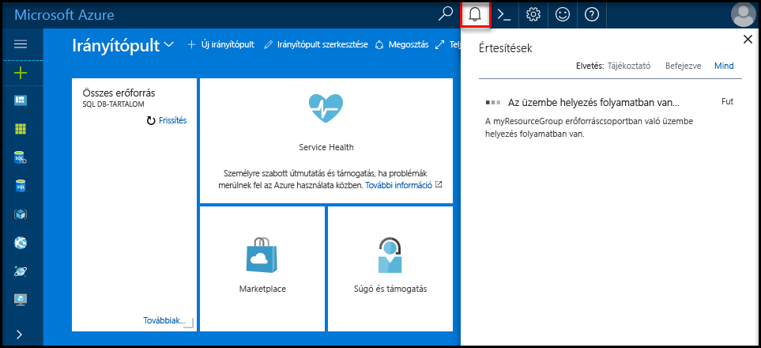

# <a name="design-your-first-azure-sql-database"></a><span data-ttu-id="e5dc8-103">Az első Azure SQL-adatbázis megtervezése</span><span class="sxs-lookup"><span data-stu-id="e5dc8-103">Design your first Azure SQL database</span></span>

<span data-ttu-id="e5dc8-104">Az Azure SQL-adatbázis egy relációs adatbázis-mint – a szolgáltatás, a Microsoft Cloud ("Azure") hello.</span><span class="sxs-lookup"><span data-stu-id="e5dc8-104">Azure SQL Database is a relational database-as-a service (DBaaS) in hello Microsoft Cloud ("Azure").</span></span> <span data-ttu-id="e5dc8-105">Ebben az oktatóanyagban elsajátíthatja, hogyan toouse hello Azure-portálon és [SQL Server Management Studio](https://msdn.microsoft.com/library/ms174173.aspx) (SSMS) számára:</span><span class="sxs-lookup"><span data-stu-id="e5dc8-105">In this tutorial, you learn how toouse hello Azure portal and [SQL Server Management Studio](https://msdn.microsoft.com/library/ms174173.aspx) (SSMS) to:</span></span> 

> [!div class="checklist"]
> * <span data-ttu-id="e5dc8-106">Hozzon létre egy adatbázist hello Azure-portálon</span><span class="sxs-lookup"><span data-stu-id="e5dc8-106">Create a database in hello Azure portal</span></span>
> * <span data-ttu-id="e5dc8-107">Állítson be egy kiszolgálószintű tűzfalszabályt hello Azure-portálon</span><span class="sxs-lookup"><span data-stu-id="e5dc8-107">Set up a server-level firewall rule in hello Azure portal</span></span>
> * <span data-ttu-id="e5dc8-108">Csatlakozás toohello adatbázis ssms alkalmazásával</span><span class="sxs-lookup"><span data-stu-id="e5dc8-108">Connect toohello database with SSMS</span></span>
> * <span data-ttu-id="e5dc8-109">Táblázatok létrehozása az ssms alkalmazásával</span><span class="sxs-lookup"><span data-stu-id="e5dc8-109">Create tables with SSMS</span></span>
> * <span data-ttu-id="e5dc8-110">A tömeges adatok betöltése a BCP-vel</span><span class="sxs-lookup"><span data-stu-id="e5dc8-110">Bulk load data with BCP</span></span>
> * <span data-ttu-id="e5dc8-111">Lekérdezés ssms alkalmazásával adatok</span><span class="sxs-lookup"><span data-stu-id="e5dc8-111">Query that data with SSMS</span></span>
> * <span data-ttu-id="e5dc8-112">Állítsa vissza az előző hello adatbázis tooa [időponthoz kötött visszaállítás](sql-database-recovery-using-backups.md#point-in-time-restore) a hello Azure-portálon</span><span class="sxs-lookup"><span data-stu-id="e5dc8-112">Restore hello database tooa previous [point in time restore](sql-database-recovery-using-backups.md#point-in-time-restore) in hello Azure portal</span></span>

<span data-ttu-id="e5dc8-113">Ha nem rendelkezik Azure-előfizetéssel, [ingyenes fiók létrehozását](https://azure.microsoft.com/free/) megkezdése előtt.</span><span class="sxs-lookup"><span data-stu-id="e5dc8-113">If you don't have an Azure subscription, [create a free account](https://azure.microsoft.com/free/) before you begin.</span></span>

## <a name="prerequisites"></a><span data-ttu-id="e5dc8-114">Előfeltételek</span><span class="sxs-lookup"><span data-stu-id="e5dc8-114">Prerequisites</span></span>

<span data-ttu-id="e5dc8-115">toocomplete ezen oktatóanyag, győződjön meg arról, hogy telepítette:</span><span class="sxs-lookup"><span data-stu-id="e5dc8-115">toocomplete this tutorial, make sure you have installed:</span></span>
- <span data-ttu-id="e5dc8-116">hello legújabb verziójának [SQL Server Management Studio](https://msdn.microsoft.com/library/ms174173.aspx) (SSMS).</span><span class="sxs-lookup"><span data-stu-id="e5dc8-116">hello newest version of [SQL Server Management Studio](https://msdn.microsoft.com/library/ms174173.aspx) (SSMS).</span></span>
- <span data-ttu-id="e5dc8-117">hello legújabb verziójának [BCP és SQLCMD](https://www.microsoft.com/download/details.aspx?id=36433).</span><span class="sxs-lookup"><span data-stu-id="e5dc8-117">hello newest version of [BCP and SQLCMD](https://www.microsoft.com/download/details.aspx?id=36433).</span></span>

## <a name="log-in-toohello-azure-portal"></a><span data-ttu-id="e5dc8-118">Jelentkezzen be toohello Azure-portálon</span><span class="sxs-lookup"><span data-stu-id="e5dc8-118">Log in toohello Azure portal</span></span>

<span data-ttu-id="e5dc8-119">Jelentkezzen be toohello [Azure-portálon](https://portal.azure.com/).</span><span class="sxs-lookup"><span data-stu-id="e5dc8-119">Log in toohello [Azure portal](https://portal.azure.com/).</span></span>

## <a name="create-a-blank-sql-database"></a><span data-ttu-id="e5dc8-120">Üres SQL-adatbázis létrehozása</span><span class="sxs-lookup"><span data-stu-id="e5dc8-120">Create a blank SQL database</span></span>

<span data-ttu-id="e5dc8-121">Az Azure SQL-adatbázis [számítási és tárolási erőforrások](sql-database-service-tiers.md) egy meghatározott készletével együtt jön létre.</span><span class="sxs-lookup"><span data-stu-id="e5dc8-121">An Azure SQL database is created with a defined set of [compute and storage resources](sql-database-service-tiers.md).</span></span> <span data-ttu-id="e5dc8-122">hello adatbázist a rendszer létrehoz egy [Azure erőforráscsoport](../azure-resource-manager/resource-group-overview.md) és az egy [Azure SQL Database logikai kiszolgáló](sql-database-features.md).</span><span class="sxs-lookup"><span data-stu-id="e5dc8-122">hello database is created within an [Azure resource group](../azure-resource-manager/resource-group-overview.md) and in an [Azure SQL Database logical server](sql-database-features.md).</span></span> 

<span data-ttu-id="e5dc8-123">Kövesse ezeket a lépéseket toocreate üres SQL-adatbázis.</span><span class="sxs-lookup"><span data-stu-id="e5dc8-123">Follow these steps toocreate a blank SQL database.</span></span> 

1. <span data-ttu-id="e5dc8-124">Kattintson a hello **új** hello bal felső sarkában hello Azure-portálon található gombra.</span><span class="sxs-lookup"><span data-stu-id="e5dc8-124">Click hello **New** button found on hello upper left-hand corner of hello Azure portal.</span></span>

2. <span data-ttu-id="e5dc8-125">Válassza ki **adatbázisok** a hello **új** lapon, és válassza ki **SQL-adatbázis** a hello **adatbázisok** lap.</span><span class="sxs-lookup"><span data-stu-id="e5dc8-125">Select **Databases** from hello **New** page, and select **SQL Database** from hello **Databases** page.</span></span> 

   

3. <span data-ttu-id="e5dc8-127">Hello SQL-adatbázis űrlap kitöltése a következő információ, hello kép megelőző hello szerint:</span><span class="sxs-lookup"><span data-stu-id="e5dc8-127">Fill out hello SQL Database form with hello following information, as shown on hello preceding image:</span></span>   

   | <span data-ttu-id="e5dc8-128">Beállítás</span><span class="sxs-lookup"><span data-stu-id="e5dc8-128">Setting</span></span>       | <span data-ttu-id="e5dc8-129">Ajánlott érték</span><span class="sxs-lookup"><span data-stu-id="e5dc8-129">Suggested value</span></span> | <span data-ttu-id="e5dc8-130">Leírás</span><span class="sxs-lookup"><span data-stu-id="e5dc8-130">Description</span></span> | 
   | ------------ | ------------------ | ------------------------------------------------- | 
   | <span data-ttu-id="e5dc8-131">**Adatbázis neve**</span><span class="sxs-lookup"><span data-stu-id="e5dc8-131">**Database name**</span></span> | <span data-ttu-id="e5dc8-132">mySampleDatabase</span><span class="sxs-lookup"><span data-stu-id="e5dc8-132">mySampleDatabase</span></span> | <span data-ttu-id="e5dc8-133">Az érvényes adatbázisnevekkel kapcsolatban lásd az [adatbázis-azonosítókat](https://docs.microsoft.com/sql/relational-databases/databases/database-identifiers) ismertető cikket.</span><span class="sxs-lookup"><span data-stu-id="e5dc8-133">For valid database names, see [Database Identifiers](https://docs.microsoft.com/sql/relational-databases/databases/database-identifiers).</span></span> | 
   | <span data-ttu-id="e5dc8-134">**Előfizetés**</span><span class="sxs-lookup"><span data-stu-id="e5dc8-134">**Subscription**</span></span> | <span data-ttu-id="e5dc8-135">Az Ön előfizetése</span><span class="sxs-lookup"><span data-stu-id="e5dc8-135">Your subscription</span></span>  | <span data-ttu-id="e5dc8-136">Az előfizetései részleteivel kapcsolatban lásd az [előfizetéseket](https://account.windowsazure.com/Subscriptions) ismertető cikket.</span><span class="sxs-lookup"><span data-stu-id="e5dc8-136">For details about your subscriptions, see [Subscriptions](https://account.windowsazure.com/Subscriptions).</span></span> |
   | <span data-ttu-id="e5dc8-137">**Erőforráscsoport**</span><span class="sxs-lookup"><span data-stu-id="e5dc8-137">**Resource group**</span></span> | <span data-ttu-id="e5dc8-138">myResourceGroup</span><span class="sxs-lookup"><span data-stu-id="e5dc8-138">myResourceGroup</span></span> | <span data-ttu-id="e5dc8-139">Az érvényes erőforráscsoport-nevekkel kapcsolatban lásd az [elnevezési szabályokat és korlátozásokat](https://docs.microsoft.com/azure/architecture/best-practices/naming-conventions) ismertető cikket.</span><span class="sxs-lookup"><span data-stu-id="e5dc8-139">For valid resource group names, see [Naming rules and restrictions](https://docs.microsoft.com/azure/architecture/best-practices/naming-conventions).</span></span> |
   | <span data-ttu-id="e5dc8-140">**Forrás kiválasztása**</span><span class="sxs-lookup"><span data-stu-id="e5dc8-140">**Select source**</span></span> | <span data-ttu-id="e5dc8-141">Az üres adatbázis</span><span class="sxs-lookup"><span data-stu-id="e5dc8-141">Blank database</span></span> | <span data-ttu-id="e5dc8-142">Meghatározza, hogy egy üres adatbázist kell létrehozni.</span><span class="sxs-lookup"><span data-stu-id="e5dc8-142">Specifies that a blank database should be created.</span></span> |

4. <span data-ttu-id="e5dc8-143">Kattintson a **Server** toocreate és az új adatbázis új kiszolgáló konfigurálása.</span><span class="sxs-lookup"><span data-stu-id="e5dc8-143">Click **Server** toocreate and configure a new server for your new database.</span></span> <span data-ttu-id="e5dc8-144">Töltse ki a hello **új kiszolgáló űrlap** a következő információ hello:</span><span class="sxs-lookup"><span data-stu-id="e5dc8-144">Fill out hello **New server form** with hello following information:</span></span> 

   | <span data-ttu-id="e5dc8-145">Beállítás</span><span class="sxs-lookup"><span data-stu-id="e5dc8-145">Setting</span></span>       | <span data-ttu-id="e5dc8-146">Ajánlott érték</span><span class="sxs-lookup"><span data-stu-id="e5dc8-146">Suggested value</span></span> | <span data-ttu-id="e5dc8-147">Leírás</span><span class="sxs-lookup"><span data-stu-id="e5dc8-147">Description</span></span> | 
   | ------------ | ------------------ | ------------------------------------------------- | 
   | <span data-ttu-id="e5dc8-148">**Kiszolgálónév**</span><span class="sxs-lookup"><span data-stu-id="e5dc8-148">**Server name**</span></span> | <span data-ttu-id="e5dc8-149">Bármely globálisan egyedi név</span><span class="sxs-lookup"><span data-stu-id="e5dc8-149">Any globally unique name</span></span> | <span data-ttu-id="e5dc8-150">Az érvényes kiszolgálónevekkel kapcsolatban lásd az [elnevezési szabályokat és korlátozásokat](https://docs.microsoft.com/azure/architecture/best-practices/naming-conventions) ismertető cikket.</span><span class="sxs-lookup"><span data-stu-id="e5dc8-150">For valid server names, see [Naming rules and restrictions](https://docs.microsoft.com/azure/architecture/best-practices/naming-conventions).</span></span> | 
   | <span data-ttu-id="e5dc8-151">**Kiszolgálói rendszergazdai bejelentkezés**</span><span class="sxs-lookup"><span data-stu-id="e5dc8-151">**Server admin login**</span></span> | <span data-ttu-id="e5dc8-152">Bármely érvényes név</span><span class="sxs-lookup"><span data-stu-id="e5dc8-152">Any valid name</span></span> | <span data-ttu-id="e5dc8-153">Az érvényes bejelentkezési nevekkel kapcsolatban lásd az [adatbázis-azonosítókat](https://docs.microsoft.com/sql/relational-databases/databases/database-identifiers) ismertető cikket.</span><span class="sxs-lookup"><span data-stu-id="e5dc8-153">For valid login names, see [Database Identifiers](https://docs.microsoft.com/sql/relational-databases/databases/database-identifiers).</span></span>|
   | <span data-ttu-id="e5dc8-154">**Jelszó**</span><span class="sxs-lookup"><span data-stu-id="e5dc8-154">**Password**</span></span> | <span data-ttu-id="e5dc8-155">Bármely érvényes jelszó</span><span class="sxs-lookup"><span data-stu-id="e5dc8-155">Any valid password</span></span> | <span data-ttu-id="e5dc8-156">A jelszó legalább 8 karakterből kell állnia, és a következő kategóriák hello hármat tartalmaznia kell: nagybetűk, kisbetűk, számok és nem alfanumerikus karakterek száma.</span><span class="sxs-lookup"><span data-stu-id="e5dc8-156">Your password must have at least 8 characters and must contain characters from three of hello following categories: upper case characters, lower case characters, numbers, and non-alphanumeric characters.</span></span> |
   | <span data-ttu-id="e5dc8-157">**Hely**</span><span class="sxs-lookup"><span data-stu-id="e5dc8-157">**Location**</span></span> | <span data-ttu-id="e5dc8-158">Bármely érvényes hely</span><span class="sxs-lookup"><span data-stu-id="e5dc8-158">Any valid location</span></span> | <span data-ttu-id="e5dc8-159">A régiókkal kapcsolatos információkért lásd [az Azure régióit](https://azure.microsoft.com/regions/) ismertető cikket.</span><span class="sxs-lookup"><span data-stu-id="e5dc8-159">For information about regions, see [Azure Regions](https://azure.microsoft.com/regions/).</span></span> |

   

5. <span data-ttu-id="e5dc8-161">Kattintson a **Kiválasztás** gombra.</span><span class="sxs-lookup"><span data-stu-id="e5dc8-161">Click **Select**.</span></span>

6. <span data-ttu-id="e5dc8-162">Kattintson a **tarifacsomag** toospecify hello és teljesítményszintet szolgáltatásszint az új adatbázishoz.</span><span class="sxs-lookup"><span data-stu-id="e5dc8-162">Click **Pricing tier** toospecify hello service tier and performance level for your new database.</span></span> <span data-ttu-id="e5dc8-163">A jelen oktatóanyag esetében válassza ki a **20 Dtu** és **250** GB tárhelyet.</span><span class="sxs-lookup"><span data-stu-id="e5dc8-163">For this tutorial, select **20 DTUs** and **250** GB of storage.</span></span>

   

7. <span data-ttu-id="e5dc8-165">Kattintson az **Alkalmaz** gombra.</span><span class="sxs-lookup"><span data-stu-id="e5dc8-165">Click **Apply**.</span></span>  

8. <span data-ttu-id="e5dc8-166">Válassza ki a **rendezés** hello üres adatbázis (a jelen oktatóanyag esetében használja hello alapértelmezett érték).</span><span class="sxs-lookup"><span data-stu-id="e5dc8-166">Select a **collation** for hello blank database (for this tutorial, use hello default value).</span></span> <span data-ttu-id="e5dc8-167">Rendezések kapcsolatos további információkért lásd: [rendezések](https://docs.microsoft.com/sql/t-sql/statements/collations)</span><span class="sxs-lookup"><span data-stu-id="e5dc8-167">For more information about collations, see [Collations](https://docs.microsoft.com/sql/t-sql/statements/collations)</span></span>

9. <span data-ttu-id="e5dc8-168">Kattintson a **létrehozása** tooprovision hello adatbázis.</span><span class="sxs-lookup"><span data-stu-id="e5dc8-168">Click **Create** tooprovision hello database.</span></span> <span data-ttu-id="e5dc8-169">Kiépítés kapcsolatos egy perc és fél toocomplete vesz igénybe.</span><span class="sxs-lookup"><span data-stu-id="e5dc8-169">Provisioning takes about a minute and a half toocomplete.</span></span> 

10. <span data-ttu-id="e5dc8-170">Hello eszköztáron kattintson **értesítések** toomonitor hello telepítési folyamat.</span><span class="sxs-lookup"><span data-stu-id="e5dc8-170">On hello toolbar, click **Notifications** toomonitor hello deployment process.</span></span>

   

## <a name="create-a-server-level-firewall-rule"></a><span data-ttu-id="e5dc8-172">Kiszolgálószintű tűzfalszabály létrehozása</span><span class="sxs-lookup"><span data-stu-id="e5dc8-172">Create a server-level firewall rule</span></span>

<span data-ttu-id="e5dc8-173">SQL Database szolgáltatás hello tűzfal hello kiszolgálói szinten-, amely megakadályozza, hogy a külső alkalmazások és eszközök toohello kiszolgáló vagy hello kiszolgálón lévő összes adatbázis csatlakozzon, kivéve, ha egy tűzfalszabály tooopen hello tűzfal adott IP-címekhez hoz létre.</span><span class="sxs-lookup"><span data-stu-id="e5dc8-173">hello SQL Database service creates a firewall at hello server-level that prevents external applications and tools from connecting toohello server or any databases on hello server unless a firewall rule is created tooopen hello firewall for specific IP addresses.</span></span> <span data-ttu-id="e5dc8-174">Kövesse az alábbi lépéseket toocreate egy [SQL-adatbázis kiszolgálószintű tűzfalszabály](sql-database-firewall-configure.md) az ügyfél IP-cím, és engedélyezze a külső kapcsolatot csak az IP-cím hello SQL-adatbázis tűzfalon keresztül.</span><span class="sxs-lookup"><span data-stu-id="e5dc8-174">Follow these steps toocreate a [SQL Database server-level firewall rule](sql-database-firewall-configure.md) for your client's IP address and enable external connectivity through hello SQL Database firewall for your IP address only.</span></span> 

> [!NOTE]
> <span data-ttu-id="e5dc8-175">Az SQL Database az 1433-as porton kommunikál.</span><span class="sxs-lookup"><span data-stu-id="e5dc8-175">SQL Database communicates over port 1433.</span></span> <span data-ttu-id="e5dc8-176">Ha a vállalati hálózatból származó tooconnect, a hálózati tűzfal előfordulhat, hogy nem engedélyezett a 1433-as port kimenő forgalmát.</span><span class="sxs-lookup"><span data-stu-id="e5dc8-176">If you are trying tooconnect from within a corporate network, outbound traffic over port 1433 may not be allowed by your network's firewall.</span></span> <span data-ttu-id="e5dc8-177">Ha igen, kivéve, ha az IT-részleg megnyitja az 1433-as port tooyour Azure SQL adatbázis-kiszolgáló nem lehet csatlakoztatni.</span><span class="sxs-lookup"><span data-stu-id="e5dc8-177">If so, you cannot connect tooyour Azure SQL Database server unless your IT department opens port 1433.</span></span>
>

1. <span data-ttu-id="e5dc8-178">Hello központi telepítés befejezése után kattintson **SQL-adatbázisok** hello bal oldali menüből, és kattintson a **mySampleDatabase** a hello **SQL-adatbázisok** lap.</span><span class="sxs-lookup"><span data-stu-id="e5dc8-178">After hello deployment completes, click **SQL databases** from hello left-hand menu and then click **mySampleDatabase** on hello **SQL databases** page.</span></span> <span data-ttu-id="e5dc8-179">hello áttekintő lapjára jut a adatbázis megnyílik, teljes mértékben hello megjelenítő minősített kiszolgáló neve (például **mynewserver20170313.database.windows.net**) és további konfigurációs lehetőségeket.</span><span class="sxs-lookup"><span data-stu-id="e5dc8-179">hello overview page for your database opens, showing you hello fully qualified server name (such as **mynewserver20170313.database.windows.net**) and provides options for further configuration.</span></span> <span data-ttu-id="e5dc8-180">Későbbi felhasználás céljára másolja ki ezt a teljes kiszolgálónevet.</span><span class="sxs-lookup"><span data-stu-id="e5dc8-180">Copy this fully qualified server name for use later.</span></span>

   > [!IMPORTANT]
   > <span data-ttu-id="e5dc8-181">A teljesen minősített neve tooconnect tooyour kiszolgálók és a későbbi gyors üzembe helyezések adatbázisainak van szükség.</span><span class="sxs-lookup"><span data-stu-id="e5dc8-181">You need this fully qualified server name tooconnect tooyour server and its databases in subsequent quick starts.</span></span>
   > 

    

2. <span data-ttu-id="e5dc8-183">Kattintson a **kiszolgáló tűzfalának beállítása** hello eszköztár hello előző ábrának megfelelően.</span><span class="sxs-lookup"><span data-stu-id="e5dc8-183">Click **Set server firewall** on hello toolbar as shown in hello previous image.</span></span> <span data-ttu-id="e5dc8-184">Hello **tűzfalbeállítások** hello SQL Database-kiszolgálóhoz tartozó lapon nyílik meg.</span><span class="sxs-lookup"><span data-stu-id="e5dc8-184">hello **Firewall settings** page for hello SQL Database server opens.</span></span> 

    


3. <span data-ttu-id="e5dc8-186">Kattintson a **ügyfél IP-cím hozzáadása** hello eszköztár tooadd meg az aktuális IP-cím tooa Új tűzfalszabály.</span><span class="sxs-lookup"><span data-stu-id="e5dc8-186">Click **Add client IP** on hello toolbar tooadd your current IP address tooa new firewall rule.</span></span> <span data-ttu-id="e5dc8-187">A tűzfalszabály az 1433-as portot egy egyedi IP-cím vagy egy IP-címtartomány számára nyithatja meg.</span><span class="sxs-lookup"><span data-stu-id="e5dc8-187">A firewall rule can open port 1433 for a single IP address or a range of IP addresses.</span></span>

4. <span data-ttu-id="e5dc8-188">Kattintson a **Save** (Mentés) gombra.</span><span class="sxs-lookup"><span data-stu-id="e5dc8-188">Click **Save**.</span></span> <span data-ttu-id="e5dc8-189">Az aktuális IP-címek hello logikai kiszolgálón 1433-as port megnyitása egy kiszolgálószintű tűzfalszabályt jön létre.</span><span class="sxs-lookup"><span data-stu-id="e5dc8-189">A server-level firewall rule is created for your current IP address opening port 1433 on hello logical server.</span></span>

    

4. <span data-ttu-id="e5dc8-191">Kattintson a **OK** , majd zárja be a hello **tűzfalbeállítások** lap.</span><span class="sxs-lookup"><span data-stu-id="e5dc8-191">Click **OK** and then close hello **Firewall settings** page.</span></span>

<span data-ttu-id="e5dc8-192">Csatlakoztathatja toohello SQL adatbázis-kiszolgáló és az adatbázisok, SQL Server Management Studio vagy az Ön által választott, a korábban létrehozott hello kiszolgáló rendszergazdai fiókjának használatával IP-címről egy másik eszköz használatával.</span><span class="sxs-lookup"><span data-stu-id="e5dc8-192">You can now connect toohello SQL Database server and its databases using SQL Server Management Studio or another tool of your choice from this IP address using hello server admin account created previously.</span></span>

> [!IMPORTANT]
> <span data-ttu-id="e5dc8-193">Az összes Azure-szolgáltatások alapértelmezés szerint engedélyezve van a hozzáférés hello SQL-adatbázis tűzfalon keresztül.</span><span class="sxs-lookup"><span data-stu-id="e5dc8-193">By default, access through hello SQL Database firewall is enabled for all Azure services.</span></span> <span data-ttu-id="e5dc8-194">Kattintson a **OFF** meg a lap toodisable az összes Azure-szolgáltatásokhoz.</span><span class="sxs-lookup"><span data-stu-id="e5dc8-194">Click **OFF** on this page toodisable for all Azure services.</span></span>

## <a name="sql-server-connection-information"></a><span data-ttu-id="e5dc8-195">Az SQL-kiszolgáló kapcsolatadatai</span><span class="sxs-lookup"><span data-stu-id="e5dc8-195">SQL server connection information</span></span>

<span data-ttu-id="e5dc8-196">Az Azure SQL Database-kiszolgálóhoz hello kiszolgáló teljesen minősített nevet lekérése hello Azure-portálon.</span><span class="sxs-lookup"><span data-stu-id="e5dc8-196">Get hello fully qualified server name for your Azure SQL Database server in hello Azure portal.</span></span> <span data-ttu-id="e5dc8-197">Használhat hello teljesen minősített neve tooconnect tooyour kiszolgálók SQL Server Management Studio használatával.</span><span class="sxs-lookup"><span data-stu-id="e5dc8-197">You use hello fully qualified server name tooconnect tooyour server using SQL Server Management Studio.</span></span>

1. <span data-ttu-id="e5dc8-198">Jelentkezzen be toohello [Azure-portálon](https://portal.azure.com/).</span><span class="sxs-lookup"><span data-stu-id="e5dc8-198">Log in toohello [Azure portal](https://portal.azure.com/).</span></span>
2. <span data-ttu-id="e5dc8-199">Válassza ki **SQL-adatbázisok** hello bal oldali menüben kattintson a hello adatbázis **SQL-adatbázisok** lap.</span><span class="sxs-lookup"><span data-stu-id="e5dc8-199">Select **SQL Databases** from hello left-hand menu, and click your database on hello **SQL databases** page.</span></span> 
3. <span data-ttu-id="e5dc8-200">A hello **Essentials** hello Azure portálon az adatbázis paneljén található, és másolja hello **kiszolgálónév**.</span><span class="sxs-lookup"><span data-stu-id="e5dc8-200">In hello **Essentials** pane in hello Azure portal page for your database, locate and then copy hello **Server name**.</span></span>

   

## <a name="connect-toohello-database-with-ssms"></a><span data-ttu-id="e5dc8-202">Csatlakozás toohello adatbázis ssms alkalmazásával</span><span class="sxs-lookup"><span data-stu-id="e5dc8-202">Connect toohello database with SSMS</span></span>

<span data-ttu-id="e5dc8-203">Használjon [SQL Server Management Studio](https://docs.microsoft.com/sql/ssms/sql-server-management-studio-ssms) tooestablish kapcsolat tooyour Azure SQL adatbázis-kiszolgálót.</span><span class="sxs-lookup"><span data-stu-id="e5dc8-203">Use [SQL Server Management Studio](https://docs.microsoft.com/sql/ssms/sql-server-management-studio-ssms) tooestablish a connection tooyour Azure SQL Database server.</span></span>

1. <span data-ttu-id="e5dc8-204">Nyissa meg az SQL Server Management Studiót.</span><span class="sxs-lookup"><span data-stu-id="e5dc8-204">Open SQL Server Management Studio.</span></span>

2. <span data-ttu-id="e5dc8-205">A hello **tooServer csatlakozás** párbeszédpanelen adja meg a következő információ hello:</span><span class="sxs-lookup"><span data-stu-id="e5dc8-205">In hello **Connect tooServer** dialog box, enter hello following information:</span></span>

   | <span data-ttu-id="e5dc8-206">Beállítás</span><span class="sxs-lookup"><span data-stu-id="e5dc8-206">Setting</span></span>       | <span data-ttu-id="e5dc8-207">Ajánlott érték</span><span class="sxs-lookup"><span data-stu-id="e5dc8-207">Suggested value</span></span> | <span data-ttu-id="e5dc8-208">Leírás</span><span class="sxs-lookup"><span data-stu-id="e5dc8-208">Description</span></span> | 
   | ------------ | ------------------ | ------------------------------------------------- | 
   | <span data-ttu-id="e5dc8-209">Kiszolgáló típusa</span><span class="sxs-lookup"><span data-stu-id="e5dc8-209">Server type</span></span> | <span data-ttu-id="e5dc8-210">Adatbázismotor</span><span class="sxs-lookup"><span data-stu-id="e5dc8-210">Database engine</span></span> | <span data-ttu-id="e5dc8-211">Ez értékének megadása kötelező.</span><span class="sxs-lookup"><span data-stu-id="e5dc8-211">This value is required</span></span> |
   | <span data-ttu-id="e5dc8-212">Kiszolgálónév</span><span class="sxs-lookup"><span data-stu-id="e5dc8-212">Server name</span></span> | <span data-ttu-id="e5dc8-213">hello teljes kiszolgálónév</span><span class="sxs-lookup"><span data-stu-id="e5dc8-213">hello fully qualified server name</span></span> | <span data-ttu-id="e5dc8-214">hello neve legyen például ehhez hasonló: **mynewserver20170313.database.windows.net**.</span><span class="sxs-lookup"><span data-stu-id="e5dc8-214">hello name should be something like this: **mynewserver20170313.database.windows.net**.</span></span> |
   | <span data-ttu-id="e5dc8-215">Authentication</span><span class="sxs-lookup"><span data-stu-id="e5dc8-215">Authentication</span></span> | <span data-ttu-id="e5dc8-216">SQL Server-hitelesítés</span><span class="sxs-lookup"><span data-stu-id="e5dc8-216">SQL Server Authentication</span></span> | <span data-ttu-id="e5dc8-217">SQL-hitelesítés ebben az esetben az oktatóanyag hello egyetlen hitelesítési típus.</span><span class="sxs-lookup"><span data-stu-id="e5dc8-217">SQL Authentication is hello only authentication type that we have configured in this tutorial.</span></span> |
   | <span data-ttu-id="e5dc8-218">Bejelentkezés</span><span class="sxs-lookup"><span data-stu-id="e5dc8-218">Login</span></span> | <span data-ttu-id="e5dc8-219">hello server rendszergazdai fiók</span><span class="sxs-lookup"><span data-stu-id="e5dc8-219">hello server admin account</span></span> | <span data-ttu-id="e5dc8-220">Ez az hello kiszolgáló létrehozásakor megadott hello fiókhoz.</span><span class="sxs-lookup"><span data-stu-id="e5dc8-220">This is hello account that you specified when you created hello server.</span></span> |
   | <span data-ttu-id="e5dc8-221">Jelszó</span><span class="sxs-lookup"><span data-stu-id="e5dc8-221">Password</span></span> | <span data-ttu-id="e5dc8-222">a kiszolgáló rendszergazdai fiókjának hello jelszó</span><span class="sxs-lookup"><span data-stu-id="e5dc8-222">hello password for your server admin account</span></span> | <span data-ttu-id="e5dc8-223">Ez a hello hello kiszolgáló létrehozásakor megadott jelszót.</span><span class="sxs-lookup"><span data-stu-id="e5dc8-223">This is hello password that you specified when you created hello server.</span></span> |

   

3. <span data-ttu-id="e5dc8-225">Kattintson a **beállítások** a hello **tooserver csatlakozás** párbeszédpanel megnyitásához.</span><span class="sxs-lookup"><span data-stu-id="e5dc8-225">Click **Options** in hello **Connect tooserver** dialog box.</span></span> <span data-ttu-id="e5dc8-226">A hello **toodatabase csatlakozás** területen adja meg **mySampleDatabase** tooconnect toothis adatbázis.</span><span class="sxs-lookup"><span data-stu-id="e5dc8-226">In hello **Connect toodatabase** section, enter **mySampleDatabase** tooconnect toothis database.</span></span>

     

4. <span data-ttu-id="e5dc8-228">Kattintson a **Connect** (Csatlakozás) gombra.</span><span class="sxs-lookup"><span data-stu-id="e5dc8-228">Click **Connect**.</span></span> <span data-ttu-id="e5dc8-229">SSMS hello Object Explorer ablak nyílik meg.</span><span class="sxs-lookup"><span data-stu-id="e5dc8-229">hello Object Explorer window opens in SSMS.</span></span> 

5. <span data-ttu-id="e5dc8-230">Az Object Explorerben bontsa ki a **adatbázisok** majd **mySampleDatabase** tooview hello objektumok hello mintaadatbázis.</span><span class="sxs-lookup"><span data-stu-id="e5dc8-230">In Object Explorer, expand **Databases** and then expand **mySampleDatabase** tooview hello objects in hello sample database.</span></span>

     

## <a name="create-tables-in-hello-database"></a><span data-ttu-id="e5dc8-232">Táblázatok létrehozása hello adatbázis</span><span class="sxs-lookup"><span data-stu-id="e5dc8-232">Create tables in hello database</span></span> 

<span data-ttu-id="e5dc8-233">Hozzon létre egy adatbázis-séma négy-táblázatot, amely a modell használatával felsőoktatási student felügyeleti rendszer [Transact-SQL](https://docs.microsoft.com/sql/t-sql/language-reference):</span><span class="sxs-lookup"><span data-stu-id="e5dc8-233">Create a database schema with four tables that model a student management system for universities using [Transact-SQL](https://docs.microsoft.com/sql/t-sql/language-reference):</span></span>

- <span data-ttu-id="e5dc8-234">Személy</span><span class="sxs-lookup"><span data-stu-id="e5dc8-234">Person</span></span>
- <span data-ttu-id="e5dc8-235">Működés során</span><span class="sxs-lookup"><span data-stu-id="e5dc8-235">Course</span></span>
- <span data-ttu-id="e5dc8-236">Student</span><span class="sxs-lookup"><span data-stu-id="e5dc8-236">Student</span></span>
- <span data-ttu-id="e5dc8-237">A modell felsőoktatási student felügyeleti rendszer jóváírása</span><span class="sxs-lookup"><span data-stu-id="e5dc8-237">Credit that model a student management system for universities</span></span>

<span data-ttu-id="e5dc8-238">hello alábbi ábrán látható, hogyan ezek a táblázatok egyéb kapcsolódó tooeach.</span><span class="sxs-lookup"><span data-stu-id="e5dc8-238">hello following diagram shows how these tables are related tooeach other.</span></span> <span data-ttu-id="e5dc8-239">Ezek a táblázatok némelyike hivatkozhat, más táblák oszlopaira.</span><span class="sxs-lookup"><span data-stu-id="e5dc8-239">Some of these tables reference columns in other tables.</span></span> <span data-ttu-id="e5dc8-240">Például a hello Student tábla hivatkozik a hello **PersonId** hello oszlopa **személy** tábla.</span><span class="sxs-lookup"><span data-stu-id="e5dc8-240">For example, hello Student table references hello **PersonId** column of hello **Person** table.</span></span> <span data-ttu-id="e5dc8-241">Vizsgálat hello diagram toounderstand hogyan hello táblák ebben az oktatóanyagban kapcsolódó tooone egy másik.</span><span class="sxs-lookup"><span data-stu-id="e5dc8-241">Study hello diagram toounderstand how hello tables in this tutorial are related tooone another.</span></span> <span data-ttu-id="e5dc8-242">Az útmutató részletes nézze meg a toocreate hatékony adatbázistáblák, lásd: [hatékony adatbázistáblák létrehozása](https://msdn.microsoft.com/library/cc505842.aspx).</span><span class="sxs-lookup"><span data-stu-id="e5dc8-242">For an in-depth look at how toocreate effective database tables, see [Create effective database tables](https://msdn.microsoft.com/library/cc505842.aspx).</span></span> <span data-ttu-id="e5dc8-243">Adattípusok kiválasztására vonatkozó további információkért lásd: [adattípusok](https://docs.microsoft.com/sql/t-sql/data-types/data-types-transact-sql).</span><span class="sxs-lookup"><span data-stu-id="e5dc8-243">For information about choosing data types, see [Data types](https://docs.microsoft.com/sql/t-sql/data-types/data-types-transact-sql).</span></span>

> [!NOTE]
> <span data-ttu-id="e5dc8-244">Is használhatja a hello [tábla designer az SQL Server Management Studio](https://msdn.microsoft.com/library/hh272695.aspx) toocreate és a táblák tervezéséhez.</span><span class="sxs-lookup"><span data-stu-id="e5dc8-244">You can also use hello [table designer in SQL Server Management Studio](https://msdn.microsoft.com/library/hh272695.aspx) toocreate and design your tables.</span></span> 


1. <span data-ttu-id="e5dc8-246">Az Object Explorerben kattintson a jobb gombbal a **mySampleDatabase** adatbázisra, majd kattintson a **New Query** (Új lekérdezés) elemre.</span><span class="sxs-lookup"><span data-stu-id="e5dc8-246">In Object Explorer, right-click **mySampleDatabase** and click **New Query**.</span></span> <span data-ttu-id="e5dc8-247">Üres lekérdezés megnyílik egy ablak, amely csatlakoztatott tooyour adatbázis.</span><span class="sxs-lookup"><span data-stu-id="e5dc8-247">A blank query window opens that is connected tooyour database.</span></span>

2. <span data-ttu-id="e5dc8-248">Hello lekérdezési ablakban hajtható végre a következő lekérdezés toocreate négy táblák az adatbázisban hello:</span><span class="sxs-lookup"><span data-stu-id="e5dc8-248">In hello query window, execute hello following query toocreate four tables in your database:</span></span> 

   ```sql 
   -- Create Person table

   CREATE TABLE Person
   (
   PersonId   INT IDENTITY PRIMARY KEY,
   FirstName   NVARCHAR(128) NOT NULL,
   MiddelInitial NVARCHAR(10),
   LastName   NVARCHAR(128) NOT NULL,
   DateOfBirth   DATE NOT NULL
   )
   
   -- Create Student table
 
   CREATE TABLE Student
   (
   StudentId INT IDENTITY PRIMARY KEY,
   PersonId  INT REFERENCES Person (PersonId),
   Email   NVARCHAR(256)
   )
   
   -- Create Course table
 
   CREATE TABLE Course
   (
   CourseId  INT IDENTITY PRIMARY KEY,
   Name   NVARCHAR(50) NOT NULL,
   Teacher   NVARCHAR(256) NOT NULL
   ) 

   -- Create Credit table
 
   CREATE TABLE Credit
   (
   StudentId   INT REFERENCES Student (StudentId),
   CourseId   INT REFERENCES Course (CourseId),
   Grade   DECIMAL(5,2) CHECK (Grade <= 100.00),
   Attempt   TINYINT,
   CONSTRAINT  [UQ_studentgrades] UNIQUE CLUSTERED
   (
   StudentId, CourseId, Grade, Attempt
   )
   )
   ```

   

3. <span data-ttu-id="e5dc8-250">Bontsa ki a hello "tábla" csomópont hello SQL Server Management Studio objektum explorer toosee hello táblában létrehozott.</span><span class="sxs-lookup"><span data-stu-id="e5dc8-250">Expand hello 'tables' node in hello SQL Server Management Studio Object explorer toosee hello tables you created.</span></span>

   

## <a name="load-data-into-hello-tables"></a><span data-ttu-id="e5dc8-252">Adatok betöltése az hello táblák</span><span class="sxs-lookup"><span data-stu-id="e5dc8-252">Load data into hello tables</span></span>

1. <span data-ttu-id="e5dc8-253">Hozzon létre egy nevű **SampleTableData** Letöltések mappába toostore minta tartozó adatok az adatbázis.</span><span class="sxs-lookup"><span data-stu-id="e5dc8-253">Create a folder called **SampleTableData** in your Downloads folder toostore sample data for your database.</span></span> 

2. <span data-ttu-id="e5dc8-254">Kattintson a jobb gombbal hello következő csatolja, és mentse őket az hello **SampleTableData** mappa.</span><span class="sxs-lookup"><span data-stu-id="e5dc8-254">Right-click hello following links and save them into hello **SampleTableData** folder.</span></span> 

   - [<span data-ttu-id="e5dc8-255">SampleCourseData</span><span class="sxs-lookup"><span data-stu-id="e5dc8-255">SampleCourseData</span></span>](https://sqldbtutorial.blob.core.windows.net/tutorials/SampleCourseData)
   - [<span data-ttu-id="e5dc8-256">SamplePersonData</span><span class="sxs-lookup"><span data-stu-id="e5dc8-256">SamplePersonData</span></span>](https://sqldbtutorial.blob.core.windows.net/tutorials/SamplePersonData)
   - [<span data-ttu-id="e5dc8-257">SampleStudentData</span><span class="sxs-lookup"><span data-stu-id="e5dc8-257">SampleStudentData</span></span>](https://sqldbtutorial.blob.core.windows.net/tutorials/SampleStudentData)
   - [<span data-ttu-id="e5dc8-258">SampleCreditData</span><span class="sxs-lookup"><span data-stu-id="e5dc8-258">SampleCreditData</span></span>](https://sqldbtutorial.blob.core.windows.net/tutorials/SampleCreditData)

3. <span data-ttu-id="e5dc8-259">Nyisson meg egy parancssori ablakot, és keresse meg a toohello SampleTableData mappa.</span><span class="sxs-lookup"><span data-stu-id="e5dc8-259">Open a command prompt window and navigate toohello SampleTableData folder.</span></span>

4. <span data-ttu-id="e5dc8-260">Hajtsa végre a következő parancsok tooinsert mintaadatok hello értékek cseréje hello táblákba hello **kiszolgálónév**, **DatabaseName**, **felhasználónév**, és **Jelszó** hello értékek környezetnek.</span><span class="sxs-lookup"><span data-stu-id="e5dc8-260">Execute hello following commands tooinsert sample data into hello tables replacing hello values for **ServerName**, **DatabaseName**, **UserName**, and **Password** with hello values for your environment.</span></span>
  
   ```bcp
   bcp Course in SampleCourseData -S <ServerName>.database.windows.net -d <DatabaseName> -U <Username> -P <password> -q -c -t ","
   bcp Person in SamplePersonData -S <ServerName>.database.windows.net -d <DatabaseName> -U <Username> -P <password> -q -c -t ","
   bcp Student in SampleStudentData -S <ServerName>.database.windows.net -d <DatabaseName> -U <Username> -P <password> -q -c -t ","
   bcp Credit in SampleCreditData -S <ServerName>.database.windows.net -d <DatabaseName> -U <Username> -P <password> -q -c -t ","
   ```

<span data-ttu-id="e5dc8-261">Most már betöltött mintaadatok korábban létrehozott hello táblákba.</span><span class="sxs-lookup"><span data-stu-id="e5dc8-261">You have now loaded sample data into hello tables you created earlier.</span></span>

## <a name="query-data"></a><span data-ttu-id="e5dc8-262">Adatok lekérdezése</span><span class="sxs-lookup"><span data-stu-id="e5dc8-262">Query data</span></span>

<span data-ttu-id="e5dc8-263">Hajtható végre a következő lekérdezések tooretrieve információ a hello adatbázistáblák hello.</span><span class="sxs-lookup"><span data-stu-id="e5dc8-263">Execute hello following queries tooretrieve information from hello database tables.</span></span> <span data-ttu-id="e5dc8-264">Lásd: [SQL-lekérdezések írása](https://technet.microsoft.com/library/bb264565.aspx) toolearn további SQL-lekérdezések írása.</span><span class="sxs-lookup"><span data-stu-id="e5dc8-264">See [Writing SQL Queries](https://technet.microsoft.com/library/bb264565.aspx) toolearn more about writing SQL queries.</span></span> <span data-ttu-id="e5dc8-265">hello első lekérdezés összes négy táblák toofind hello diákok tanított által "Dominick Pope" a osztály egy besorolási 75 %-nál nagyobb rendelkező csatlakozik.</span><span class="sxs-lookup"><span data-stu-id="e5dc8-265">hello first query joins all four tables toofind all hello students taught by 'Dominick Pope' who have a grade higher than 75% in his class.</span></span> <span data-ttu-id="e5dc8-266">hello második lekérdezés összes négy táblák, és megkeresi, amelyben "Noe Coleman" legalább egyszer regisztrált összes tanfolyamokat.</span><span class="sxs-lookup"><span data-stu-id="e5dc8-266">hello second query joins all four tables and finds all courses in which 'Noe Coleman' has ever enrolled.</span></span>

1. <span data-ttu-id="e5dc8-267">Egy SQL Server Management Studio lekérdezési ablakban hajtható végre a következő lekérdezés hello:</span><span class="sxs-lookup"><span data-stu-id="e5dc8-267">In a SQL Server Management Studio query window, execute hello following query:</span></span>

   ```sql 
   -- Find hello students taught by Dominick Pope who have a grade higher than 75%

   SELECT  person.FirstName,
   person.LastName,
   course.Name,
   credit.Grade
   FROM  Person AS person
   INNER JOIN Student AS student ON person.PersonId = student.PersonId
   INNER JOIN Credit AS credit ON student.StudentId = credit.StudentId
   INNER JOIN Course AS course ON credit.CourseId = course.courseId
   WHERE course.Teacher = 'Dominick Pope' 
   AND Grade > 75
   ```

2. <span data-ttu-id="e5dc8-268">Egy SQL Server Management Studio lekérdezési ablakban hajtható végre a következő lekérdezést:</span><span class="sxs-lookup"><span data-stu-id="e5dc8-268">In a SQL Server Management Studio query window, execute following query:</span></span>

   ```sql
   -- Find all hello courses in which Noe Coleman has ever enrolled

   SELECT  course.Name,
   course.Teacher,
   credit.Grade
   FROM  Course AS course
   INNER JOIN Credit AS credit ON credit.CourseId = course.CourseId
   INNER JOIN Student AS student ON student.StudentId = credit.StudentId
   INNER JOIN Person AS person ON person.PersonId = student.PersonId
   WHERE person.FirstName = 'Noe'
   AND person.LastName = 'Coleman'
   ```

## <a name="restore-a-database-tooa-previous-point-in-time"></a><span data-ttu-id="e5dc8-269">Egy adatbázis tooa korábbi időpontra időbeli visszaállítása</span><span class="sxs-lookup"><span data-stu-id="e5dc8-269">Restore a database tooa previous point in time</span></span>

<span data-ttu-id="e5dc8-270">Tegyük fel, hogy véletlenül törölt egy tábla.</span><span class="sxs-lookup"><span data-stu-id="e5dc8-270">Imagine you have accidentally deleted a table.</span></span> <span data-ttu-id="e5dc8-271">Ez a valami nem egyszerűen állíthat helyre.</span><span class="sxs-lookup"><span data-stu-id="e5dc8-271">This is something you cannot easily recover from.</span></span> <span data-ttu-id="e5dc8-272">Azure SQL Database lehetővé teszi toogo hátsó tooany pont hello időpont utolsó too35 nap mentése és visszaállítása ezen a pontján idő tooa új adatbázis.</span><span class="sxs-lookup"><span data-stu-id="e5dc8-272">Azure SQL Database allows you toogo back tooany point in time in hello last up too35 days and restore this point in time tooa new database.</span></span> <span data-ttu-id="e5dc8-273">Az adatbázis toorecover Ön is a törölt adatokat.</span><span class="sxs-lookup"><span data-stu-id="e5dc8-273">You can you this database toorecover your deleted data.</span></span> <span data-ttu-id="e5dc8-274">hello lépések visszaállítási hello minta adatbázis tooa pont előtt hello táblák lettek hozzáadva.</span><span class="sxs-lookup"><span data-stu-id="e5dc8-274">hello following steps restore hello sample database tooa point before hello tables were added.</span></span>

1. <span data-ttu-id="e5dc8-275">Az adatbázis hello SQL-adatbázis lapján kattintson **visszaállítása** hello eszköztáron.</span><span class="sxs-lookup"><span data-stu-id="e5dc8-275">On hello SQL Database page for your database, click **Restore** on hello toolbar.</span></span> <span data-ttu-id="e5dc8-276">Hello **visszaállítása** lap megnyitásakor.</span><span class="sxs-lookup"><span data-stu-id="e5dc8-276">hello **Restore** page opens.</span></span>

   

2. <span data-ttu-id="e5dc8-278">Töltse ki a hello **visszaállítása** hello szükséges információt a képernyőn:</span><span class="sxs-lookup"><span data-stu-id="e5dc8-278">Fill out hello **Restore** form with hello required information:</span></span>
    * <span data-ttu-id="e5dc8-279">Adatbázis neve: Adjon meg egy adatbázisnevet</span><span class="sxs-lookup"><span data-stu-id="e5dc8-279">Database name: Provide a database name</span></span> 
    * <span data-ttu-id="e5dc8-280">Időpontban: Select hello **-időpontban** hello visszaállítási képernyőn lapja.</span><span class="sxs-lookup"><span data-stu-id="e5dc8-280">Point-in-time: Select hello **Point-in-time** tab on hello Restore form</span></span> 
    * <span data-ttu-id="e5dc8-281">Visszaállítási pont: válassza ki a megfelelő hello adatbázis módosítása előtt kerül</span><span class="sxs-lookup"><span data-stu-id="e5dc8-281">Restore point: Select a time that occurs before hello database was changed</span></span>
    * <span data-ttu-id="e5dc8-282">Célkiszolgáló: Ez az érték nem módosítható, ha az adatbázis visszaállítása</span><span class="sxs-lookup"><span data-stu-id="e5dc8-282">Target server: You cannot change this value when restoring a database</span></span> 
    * <span data-ttu-id="e5dc8-283">A rugalmas adatbáziskészlet: válasszon **nincs**</span><span class="sxs-lookup"><span data-stu-id="e5dc8-283">Elastic database pool: Select **None**</span></span>  
    * <span data-ttu-id="e5dc8-284">A tarifacsomag: válasszon **20 dtu-k** és **250 GB** tárolási.</span><span class="sxs-lookup"><span data-stu-id="e5dc8-284">Pricing tier: Select **20 DTUs** and **250 GB** of storage.</span></span>

   

3. <span data-ttu-id="e5dc8-286">Kattintson a **OK** toorestore hello adatbázis túl[visszaállítási tooa pont időben](sql-database-recovery-using-backups.md#point-in-time-restore) előtt hello táblák lettek hozzáadva.</span><span class="sxs-lookup"><span data-stu-id="e5dc8-286">Click **OK** toorestore hello database too[restore tooa point in time](sql-database-recovery-using-backups.md#point-in-time-restore) before hello tables were added.</span></span> <span data-ttu-id="e5dc8-287">Tooa különböző ponttá adatbázis időbeli visszaállítása adatbázist hoz létre duplikált hello ugyanarra a kiszolgálóra hello eredeti adatbázis frissítésétől hello pont időben ad meg, mindaddig, amíg a hello megőrzési időtartamon belül van a [szolgáltatásréteg](sql-database-service-tiers.md).</span><span class="sxs-lookup"><span data-stu-id="e5dc8-287">Restoring a database tooa different point in time creates a duplicate database in hello same server as hello original database as of hello point in time you specify, as long as it is within hello retention period for your [service tier](sql-database-service-tiers.md).</span></span>

## <a name="next-steps"></a><span data-ttu-id="e5dc8-288">Következő lépések</span><span class="sxs-lookup"><span data-stu-id="e5dc8-288">Next Steps</span></span> 
<span data-ttu-id="e5dc8-289">Ebben az oktatóanyagban megismerte az alapvető adatbázis-feladatok például egy adatbázis és a táblák létrehozása, betölteni és kérdezhet le adatokat, és hello adatbázis tooa korábbi időpontra visszaállítása időben.</span><span class="sxs-lookup"><span data-stu-id="e5dc8-289">In this tutorial, you learned basic database tasks such as create a database and tables, load and query data, and restore hello database tooa previous point in time.</span></span> <span data-ttu-id="e5dc8-290">Megismerte, hogyan végezheti el az alábbi műveleteket:</span><span class="sxs-lookup"><span data-stu-id="e5dc8-290">You learned how to:</span></span>
> [!div class="checklist"]
> * <span data-ttu-id="e5dc8-291">Adatbázis létrehozása</span><span class="sxs-lookup"><span data-stu-id="e5dc8-291">Create a database</span></span>
> * <span data-ttu-id="e5dc8-292">A tűzfalszabályok beállítása</span><span class="sxs-lookup"><span data-stu-id="e5dc8-292">Set up a firewall rule</span></span>
> * <span data-ttu-id="e5dc8-293">Csatlakozás toohello adatbázis [SQL Server Management Studio](https://msdn.microsoft.com/library/ms174173.aspx) (SSMS)</span><span class="sxs-lookup"><span data-stu-id="e5dc8-293">Connect toohello database with [SQL Server Management Studio](https://msdn.microsoft.com/library/ms174173.aspx) (SSMS)</span></span>
> * <span data-ttu-id="e5dc8-294">Táblázatok létrehozása</span><span class="sxs-lookup"><span data-stu-id="e5dc8-294">Create tables</span></span>
> * <span data-ttu-id="e5dc8-295">Tömeges betöltési adatok</span><span class="sxs-lookup"><span data-stu-id="e5dc8-295">Bulk load data</span></span>
> * <span data-ttu-id="e5dc8-296">Adatok lekérdezése</span><span class="sxs-lookup"><span data-stu-id="e5dc8-296">Query that data</span></span>
> * <span data-ttu-id="e5dc8-297">Hello adatbázis tooa korábbi időpontra, amikor az SQL-adatbázis visszaállítása [időponthoz kötött visszaállítás](sql-database-recovery-using-backups.md#point-in-time-restore) képességek</span><span class="sxs-lookup"><span data-stu-id="e5dc8-297">Restore hello database tooa previous point in time using SQL Database [point in time restore](sql-database-recovery-using-backups.md#point-in-time-restore) capabilities</span></span>

<span data-ttu-id="e5dc8-298">Előzetes toohello oktatóanyag következő toolearn tervezése a Visual Studio és a C# egy adatbázist.</span><span class="sxs-lookup"><span data-stu-id="e5dc8-298">Advance toohello next tutorial toolearn about designing a database using Visual Studio and C#.</span></span>

> [!div class="nextstepaction"]
>[<span data-ttu-id="e5dc8-299">Azure SQL-adatbázis megtervezése és C# és ADO.NET</span><span class="sxs-lookup"><span data-stu-id="e5dc8-299">Design an Azure SQL database and connect with C# and ADO.NET</span></span>](sql-database-design-first-database-csharp.md)
