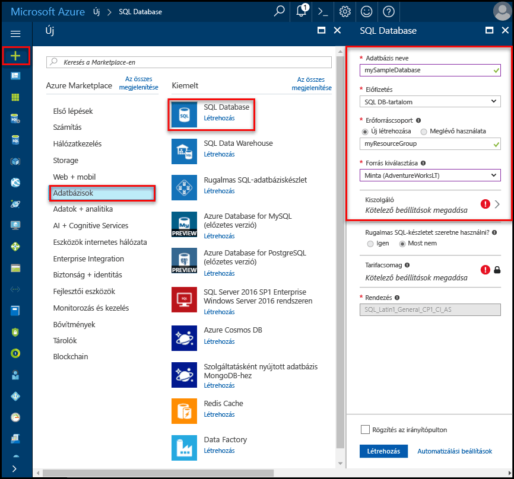
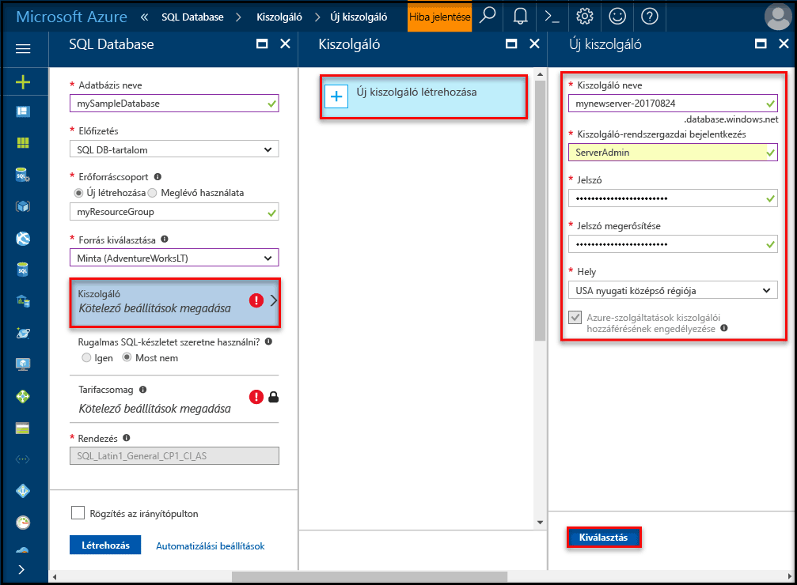
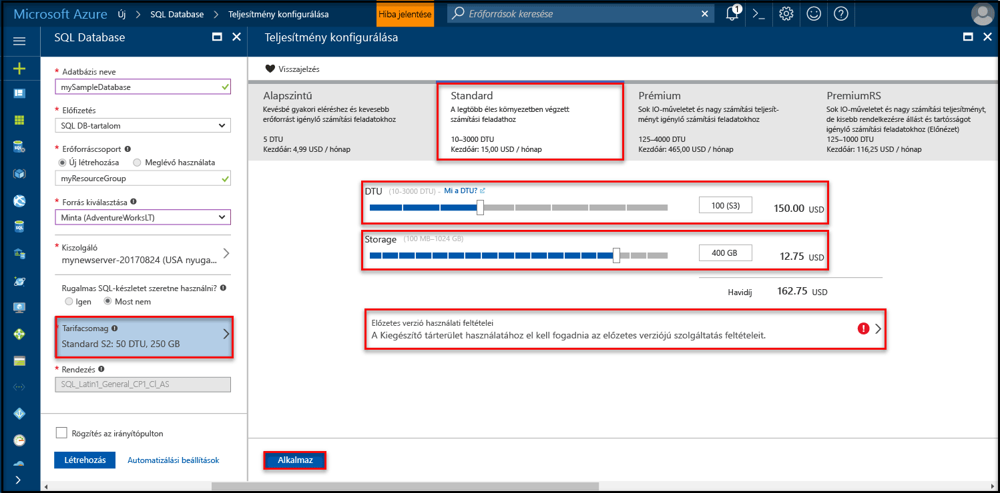
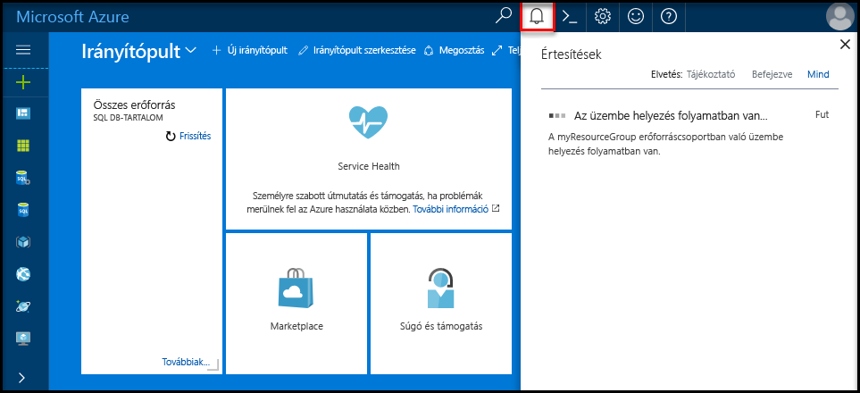
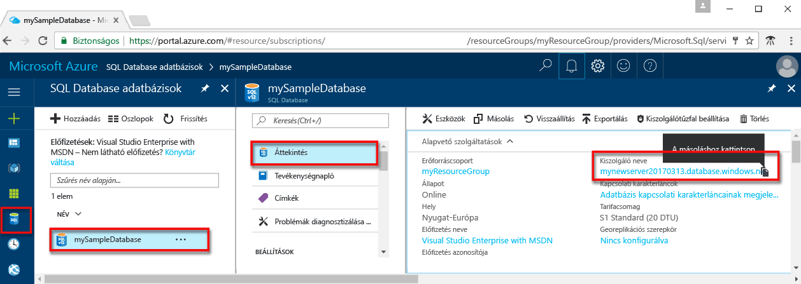
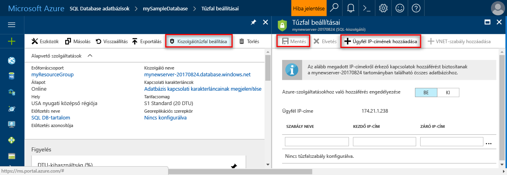

# <a name="create-an-azure-sql-database-in-the-azure-portal"></a><span data-ttu-id="113e8-105">Azure SQL Database létrehozása az Azure Portalon</span><span class="sxs-lookup"><span data-stu-id="113e8-105">Create an Azure SQL database in the Azure portal</span></span>

<span data-ttu-id="113e8-106">Ez a rövid útmutató végigvezeti azon, hogyan hozhat létre SQL Database adatbázist az Azure-ban.</span><span class="sxs-lookup"><span data-stu-id="113e8-106">This quick start tutorial walks through how to create a SQL database in Azure.</span></span> <span data-ttu-id="113e8-107">Az Azure SQL Database egy adatbázis-szolgáltatási ajánlat, amellyel magas rendelkezésre állású SQL Server-adatbázisokat futtathat és méretezhet a felhőben.</span><span class="sxs-lookup"><span data-stu-id="113e8-107">Azure SQL Database is a “Database-as-a-Service” offering that enables you to run and scale highly available SQL Server databases in the cloud.</span></span> <span data-ttu-id="113e8-108">Ez a rövid útmutató bemutatja, hogyan teheti meg az SQL Database adatbázisok létrehozásának első lépéseit az Azure Portalon.</span><span class="sxs-lookup"><span data-stu-id="113e8-108">This quick start shows you how to get started by creating a SQL database using the Azure portal.</span></span>

<span data-ttu-id="113e8-109">Ha nem rendelkezik Azure-előfizetéssel, első lépésként mindössze néhány perc alatt létrehozhat egy [ingyenes](https://azure.microsoft.com/free/) fiókot.</span><span class="sxs-lookup"><span data-stu-id="113e8-109">If you don't have an Azure subscription, create a [free](https://azure.microsoft.com/free/) account before you begin.</span></span>

## <a name="log-in-to-the-azure-portal"></a><span data-ttu-id="113e8-110">Jelentkezzen be az Azure portálra.</span><span class="sxs-lookup"><span data-stu-id="113e8-110">Log in to the Azure portal</span></span>

<span data-ttu-id="113e8-111">Jelentkezzen be az [Azure portálra](https://portal.azure.com/).</span><span class="sxs-lookup"><span data-stu-id="113e8-111">Log in to the [Azure portal](https://portal.azure.com/).</span></span>

## <a name="create-a-sql-database"></a><span data-ttu-id="113e8-112">SQL-adatbázis létrehozása</span><span class="sxs-lookup"><span data-stu-id="113e8-112">Create a SQL database</span></span>

<span data-ttu-id="113e8-113">Az Azure SQL-adatbázis [számítási és tárolási erőforrások](sql-database-service-tiers.md) egy meghatározott készletével együtt jön létre.</span><span class="sxs-lookup"><span data-stu-id="113e8-113">An Azure SQL database is created with a defined set of [compute and storage resources](sql-database-service-tiers.md).</span></span> <span data-ttu-id="113e8-114">Az adatbázis egy [Azure-erőforráscsoporton](../azure-resource-manager/resource-group-overview.md) belül egy [Azure SQL Database logikai kiszolgálón](sql-database-features.md) jön létre.</span><span class="sxs-lookup"><span data-stu-id="113e8-114">The database is created within an [Azure resource group](../azure-resource-manager/resource-group-overview.md) and in an [Azure SQL Database logical server](sql-database-features.md).</span></span> 

<span data-ttu-id="113e8-115">Kövesse az alábbi lépéseket az Adventure Works LT mintaadatokat tartalmazó SQL-adatbázis létrehozásához.</span><span class="sxs-lookup"><span data-stu-id="113e8-115">Follow these steps to create a SQL database containing the Adventure Works LT sample data.</span></span> 

1. <span data-ttu-id="113e8-116">Kattintson az Azure Portal bal felső sarkában található **Új** gombra.</span><span class="sxs-lookup"><span data-stu-id="113e8-116">Click the **New** button found on the upper left-hand corner of the Azure portal.</span></span>

2. <span data-ttu-id="113e8-117">Az **Új** panelen válassza az **Adatbázisok** lehetőséget, majd az **Adatbázisok** panelen válassza az **SQL Database** lehetőséget.</span><span class="sxs-lookup"><span data-stu-id="113e8-117">Select **Databases** from the **New** page, and select **SQL Database** from the **Databases** page.</span></span>

   

3. <span data-ttu-id="113e8-119">Töltse ki az SQL Database űrlapját a következő információkkal az előző képen látható módon:</span><span class="sxs-lookup"><span data-stu-id="113e8-119">Fill out the SQL Database form with the following information, as shown on the preceding image:</span></span>   

   | <span data-ttu-id="113e8-120">Beállítás</span><span class="sxs-lookup"><span data-stu-id="113e8-120">Setting</span></span>       | <span data-ttu-id="113e8-121">Ajánlott érték</span><span class="sxs-lookup"><span data-stu-id="113e8-121">Suggested value</span></span> | <span data-ttu-id="113e8-122">Leírás</span><span class="sxs-lookup"><span data-stu-id="113e8-122">Description</span></span> | 
   | ------------ | ------------------ | ------------------------------------------------- | 
   | <span data-ttu-id="113e8-123">**Adatbázis neve**</span><span class="sxs-lookup"><span data-stu-id="113e8-123">**Database name**</span></span> | <span data-ttu-id="113e8-124">mySampleDatabase</span><span class="sxs-lookup"><span data-stu-id="113e8-124">mySampleDatabase</span></span> | <span data-ttu-id="113e8-125">Az érvényes adatbázisnevekkel kapcsolatban lásd az [adatbázis-azonosítókat](https://docs.microsoft.com/en-us/sql/relational-databases/databases/database-identifiers) ismertető cikket.</span><span class="sxs-lookup"><span data-stu-id="113e8-125">For valid database names, see [Database Identifiers](https://docs.microsoft.com/en-us/sql/relational-databases/databases/database-identifiers).</span></span> | 
   | <span data-ttu-id="113e8-126">**Előfizetés**</span><span class="sxs-lookup"><span data-stu-id="113e8-126">**Subscription**</span></span> | <span data-ttu-id="113e8-127">Az Ön előfizetése</span><span class="sxs-lookup"><span data-stu-id="113e8-127">Your subscription</span></span>  | <span data-ttu-id="113e8-128">Az előfizetései részleteivel kapcsolatban lásd az [előfizetéseket](https://account.windowsazure.com/Subscriptions) ismertető cikket.</span><span class="sxs-lookup"><span data-stu-id="113e8-128">For details about your subscriptions, see [Subscriptions](https://account.windowsazure.com/Subscriptions).</span></span> |
   | <span data-ttu-id="113e8-129">**Erőforráscsoport**</span><span class="sxs-lookup"><span data-stu-id="113e8-129">**Resource group**</span></span>  | <span data-ttu-id="113e8-130">myResourceGroup</span><span class="sxs-lookup"><span data-stu-id="113e8-130">myResourceGroup</span></span> | <span data-ttu-id="113e8-131">Az érvényes erőforráscsoport-nevekkel kapcsolatban lásd az [elnevezési szabályokat és korlátozásokat](https://docs.microsoft.com/azure/architecture/best-practices/naming-conventions) ismertető cikket.</span><span class="sxs-lookup"><span data-stu-id="113e8-131">For valid resource group names, see [Naming rules and restrictions](https://docs.microsoft.com/azure/architecture/best-practices/naming-conventions).</span></span> |
   | <span data-ttu-id="113e8-132">**Forrás forrása**</span><span class="sxs-lookup"><span data-stu-id="113e8-132">**Source source**</span></span> | <span data-ttu-id="113e8-133">Minta (AdventureWorksLT)</span><span class="sxs-lookup"><span data-stu-id="113e8-133">Sample (AdventureWorksLT)</span></span> | <span data-ttu-id="113e8-134">Betölti az AdventureWorksLT sémát és adatokat az új adatbázisba.</span><span class="sxs-lookup"><span data-stu-id="113e8-134">Loads the AdventureWorksLT schema and data into your new database</span></span> |

   > [!IMPORTANT]
   > <span data-ttu-id="113e8-135">Az űrlapon a mintaadatbázist kell kiválasztania, mivel a rövid útmutató hátralévő részében ezt használjuk majd.</span><span class="sxs-lookup"><span data-stu-id="113e8-135">You must select the sample database on this form because it is used in the remainder of this quick start.</span></span>
   > 

4. <span data-ttu-id="113e8-136">A **Server** (Kiszolgáló) területen kattintson a **Configure required settings** (Kötelező beállítások konfigurálása) elemre, majd töltse ki az SQL-kiszolgáló (logikai kiszolgáló) űrlapját a következő adatokkal a következő képen látható módon:</span><span class="sxs-lookup"><span data-stu-id="113e8-136">Under **Server**, click **Configure required settings** and fill out the SQL server (logical server) form with the following information, as shown on the following image:</span></span>   

   | <span data-ttu-id="113e8-137">Beállítás</span><span class="sxs-lookup"><span data-stu-id="113e8-137">Setting</span></span>       | <span data-ttu-id="113e8-138">Ajánlott érték</span><span class="sxs-lookup"><span data-stu-id="113e8-138">Suggested value</span></span> | <span data-ttu-id="113e8-139">Leírás</span><span class="sxs-lookup"><span data-stu-id="113e8-139">Description</span></span> | 
   | ------------ | ------------------ | ------------------------------------------------- | 
   | <span data-ttu-id="113e8-140">**Kiszolgálónév**</span><span class="sxs-lookup"><span data-stu-id="113e8-140">**Server name**</span></span> | <span data-ttu-id="113e8-141">Bármely globálisan egyedi név</span><span class="sxs-lookup"><span data-stu-id="113e8-141">Any globally unique name</span></span> | <span data-ttu-id="113e8-142">Az érvényes kiszolgálónevekkel kapcsolatban lásd az [elnevezési szabályokat és korlátozásokat](https://docs.microsoft.com/azure/architecture/best-practices/naming-conventions) ismertető cikket.</span><span class="sxs-lookup"><span data-stu-id="113e8-142">For valid server names, see [Naming rules and restrictions](https://docs.microsoft.com/azure/architecture/best-practices/naming-conventions).</span></span> | 
   | <span data-ttu-id="113e8-143">**Kiszolgálói rendszergazdai bejelentkezés**</span><span class="sxs-lookup"><span data-stu-id="113e8-143">**Server admin login**</span></span> | <span data-ttu-id="113e8-144">Bármely érvényes név</span><span class="sxs-lookup"><span data-stu-id="113e8-144">Any valid name</span></span> | <span data-ttu-id="113e8-145">Az érvényes bejelentkezési nevekkel kapcsolatban lásd az [adatbázis-azonosítókat](https://docs.microsoft.com/en-us/sql/relational-databases/databases/database-identifiers) ismertető cikket.</span><span class="sxs-lookup"><span data-stu-id="113e8-145">For valid login names, see [Database Identifiers](https://docs.microsoft.com/en-us/sql/relational-databases/databases/database-identifiers).</span></span> |
   | <span data-ttu-id="113e8-146">**Jelszó**</span><span class="sxs-lookup"><span data-stu-id="113e8-146">**Password**</span></span> | <span data-ttu-id="113e8-147">Bármely érvényes jelszó</span><span class="sxs-lookup"><span data-stu-id="113e8-147">Any valid password</span></span> | <span data-ttu-id="113e8-148">A jelszónak legalább 8 karakter hosszúságúnak kell lennie, és tartalmaznia kell karaktereket a következő kategóriák közül legalább háromból: nagybetűs karakterek, kisbetűs karakterek, számjegyek és nem alfanumerikus karakterek.</span><span class="sxs-lookup"><span data-stu-id="113e8-148">Your password must have at least 8 characters and must contain characters from three of the following categories: upper case characters, lower case characters, numbers, and and non-alphanumeric characters.</span></span> |
   | <span data-ttu-id="113e8-149">**Előfizetés**</span><span class="sxs-lookup"><span data-stu-id="113e8-149">**Subscription**</span></span> | <span data-ttu-id="113e8-150">Az Ön előfizetése</span><span class="sxs-lookup"><span data-stu-id="113e8-150">Your subscription</span></span> | <span data-ttu-id="113e8-151">Az előfizetései részleteivel kapcsolatban lásd az [előfizetéseket](https://account.windowsazure.com/Subscriptions) ismertető cikket.</span><span class="sxs-lookup"><span data-stu-id="113e8-151">For details about your subscriptions, see [Subscriptions](https://account.windowsazure.com/Subscriptions).</span></span> |
   | <span data-ttu-id="113e8-152">**Erőforráscsoport**</span><span class="sxs-lookup"><span data-stu-id="113e8-152">**Resource group**</span></span> | <span data-ttu-id="113e8-153">myResourceGroup</span><span class="sxs-lookup"><span data-stu-id="113e8-153">myResourceGroup</span></span> | <span data-ttu-id="113e8-154">Az érvényes erőforráscsoport-nevekkel kapcsolatban lásd az [elnevezési szabályokat és korlátozásokat](https://docs.microsoft.com/azure/architecture/best-practices/naming-conventions) ismertető cikket.</span><span class="sxs-lookup"><span data-stu-id="113e8-154">For valid resource group names, see [Naming rules and restrictions](https://docs.microsoft.com/azure/architecture/best-practices/naming-conventions).</span></span> |
   | <span data-ttu-id="113e8-155">**Hely**</span><span class="sxs-lookup"><span data-stu-id="113e8-155">**Location**</span></span> | <span data-ttu-id="113e8-156">Bármely érvényes hely</span><span class="sxs-lookup"><span data-stu-id="113e8-156">Any valid location</span></span> | <span data-ttu-id="113e8-157">A régiókkal kapcsolatos információkért lásd [az Azure régióit](https://azure.microsoft.com/regions/) ismertető cikket.</span><span class="sxs-lookup"><span data-stu-id="113e8-157">For information about regions, see [Azure Regions](https://azure.microsoft.com/regions/).</span></span> |

   > [!IMPORTANT]
   > <span data-ttu-id="113e8-158">A kiszolgáló itt megadott rendszergazdai bejelentkezési nevét és jelszavát kell majd használnia a rövid útmutató későbbi szakaszaiban a kiszolgálóra és az adatbázisaira való bejelentkezéshez.</span><span class="sxs-lookup"><span data-stu-id="113e8-158">The server admin login and password that you specify here are required to log in to the server and its databases later in this quick start.</span></span> <span data-ttu-id="113e8-159">Jegyezze meg vagy jegyezze fel ezt az információt későbbi használatra.</span><span class="sxs-lookup"><span data-stu-id="113e8-159">Remember or record this information for later use.</span></span> 
   >  

   

5. <span data-ttu-id="113e8-161">Miután végzett az űrlappal, kattintson a **Kiválasztás** gombra.</span><span class="sxs-lookup"><span data-stu-id="113e8-161">When you have completed the form, click **Select**.</span></span>

6. <span data-ttu-id="113e8-162">Kattintson a **Tarifacsomag** parancsra az új adatbázis szolgáltatás- és teljesítményszintjének megadásához.</span><span class="sxs-lookup"><span data-stu-id="113e8-162">Click **Pricing tier** to specify the service tier and performance level for your new database.</span></span> <span data-ttu-id="113e8-163">A csúszka használatával állítson be **20 DTU** egységet, illetve **250** GB tárhelyet.</span><span class="sxs-lookup"><span data-stu-id="113e8-163">Use the slider to select **20 DTUs** and **250** GB of storage.</span></span> <span data-ttu-id="113e8-164">További információ a DTU-król: [Mi a DTU?](sql-database-what-is-a-dtu.md)</span><span class="sxs-lookup"><span data-stu-id="113e8-164">For more information on DTUs, see [What is a DTU?](sql-database-what-is-a-dtu.md).</span></span>

   

7. <span data-ttu-id="113e8-166">A DTU-mennyiség kiválasztását követően kattintson az **Alkalmaz** gombra.</span><span class="sxs-lookup"><span data-stu-id="113e8-166">After selected the amount of DTUs, click **Apply**.</span></span>  

8. <span data-ttu-id="113e8-167">Most, hogy kitöltötte az SQL Database űrlapját, kattintson a **Létrehozás** gombra az adatbázis létrehozásához.</span><span class="sxs-lookup"><span data-stu-id="113e8-167">Now that you have completed the SQL Database form, click **Create** to provision the database.</span></span> <span data-ttu-id="113e8-168">Az üzembe helyezés eltarthat néhány percig.</span><span class="sxs-lookup"><span data-stu-id="113e8-168">Provisioning takes a few minutes.</span></span> 

9. <span data-ttu-id="113e8-169">Az eszköztáron kattintson az **Értesítések** parancsra az üzembe helyezési folyamat megfigyeléséhez.</span><span class="sxs-lookup"><span data-stu-id="113e8-169">On the toolbar, click **Notifications** to monitor the deployment process.</span></span>

   

## <a name="create-a-server-level-firewall-rule"></a><span data-ttu-id="113e8-171">Kiszolgálószintű tűzfalszabály létrehozása</span><span class="sxs-lookup"><span data-stu-id="113e8-171">Create a server-level firewall rule</span></span>

<span data-ttu-id="113e8-172">Az SQL Database szolgáltatás egy tűzfalat hoz létre a kiszolgáló szintjén, amely megakadályozza, hogy a külső alkalmazások és eszközök csatlakozzanak a kiszolgálóhoz vagy a kiszolgálón lévő adatbázisokhoz, kivéve, ha létrehoz tűzfalszabályt, hogy adott IP-címek számára megnyissa a tűzfalat.</span><span class="sxs-lookup"><span data-stu-id="113e8-172">The SQL Database service creates a firewall at the server-level that prevents external applications and tools from connecting to the server or any databases on the server unless a firewall rule is created to open the firewall for specific IP addresses.</span></span> <span data-ttu-id="113e8-173">A következő lépésekkel hozzon létre egy [kiszolgálószintű SQL Database-tűzfalszabályt](sql-database-firewall-configure.md) az ügyfél IP-címéhez, és engedélyezze a külső kapcsolatokat csak az Ön IP-címéhez az SQL Database-tűzfalon keresztül.</span><span class="sxs-lookup"><span data-stu-id="113e8-173">Follow these steps to create a [SQL Database server-level firewall rule](sql-database-firewall-configure.md) for your client's IP address and enable external connectivity through the SQL Database firewall for your IP address only.</span></span> 

> [!NOTE]
> <span data-ttu-id="113e8-174">Az SQL Database az 1433-as porton kommunikál.</span><span class="sxs-lookup"><span data-stu-id="113e8-174">SQL Database communicates over port 1433.</span></span> <span data-ttu-id="113e8-175">Ha vállalati hálózaton belülről próbál csatlakozni, elképzelhető, hogy a hálózati tűzfal nem engedélyezi a kimenő forgalmat az 1433-as porton keresztül.</span><span class="sxs-lookup"><span data-stu-id="113e8-175">If you are trying to connect from within a corporate network, outbound traffic over port 1433 may not be allowed by your network's firewall.</span></span> <span data-ttu-id="113e8-176">Ebben az esetben nem tud csatlakozni az Azure SQL Database-kiszolgálóhoz, ha az informatikai részleg nem nyitja meg az 1433-as portot.</span><span class="sxs-lookup"><span data-stu-id="113e8-176">If so, you cannot connect to your Azure SQL Database server unless your IT department opens port 1433.</span></span>
>

1. <span data-ttu-id="113e8-177">Az üzembe helyezés befejezése után kattintson az **SQL-adatbázisok** elemre a bal oldali menüben, majd kattintson a **mySampleDatabase** adatbázisra az **SQL-adatbázisok** lapon.</span><span class="sxs-lookup"><span data-stu-id="113e8-177">After the deployment completes, click **SQL databases** from the left-hand menu and then click **mySampleDatabase** on the **SQL databases** page.</span></span> <span data-ttu-id="113e8-178">Megnyílik az adatbázis áttekintő oldala, amelyen látható a teljes kiszolgálónév (például: **mynewserver20170313.database.windows.net**), valamint a további konfigurálható beállítások.</span><span class="sxs-lookup"><span data-stu-id="113e8-178">The overview page for your database opens, showing you the fully qualified server name (such as **mynewserver20170313.database.windows.net**) and provides options for further configuration.</span></span> <span data-ttu-id="113e8-179">Későbbi felhasználás céljára másolja ki ezt a teljes kiszolgálónevet.</span><span class="sxs-lookup"><span data-stu-id="113e8-179">Copy this fully qualified server name for use later.</span></span>

   > [!IMPORTANT]
   > <span data-ttu-id="113e8-180">A későbbi rövid útmutatók során szüksége lesz erre a teljes kiszolgálónévre a kiszolgálóhoz és az adatbázisokhoz való csatlakozáshoz.</span><span class="sxs-lookup"><span data-stu-id="113e8-180">You need this fully qualified server name to connect to your server and its databases in subsequent quick starts.</span></span>
   > 

    

2. <span data-ttu-id="113e8-182">Kattintson a **Kiszolgálótűzfal beállítása** lehetőségre az eszköztáron az előző képen látható módon.</span><span class="sxs-lookup"><span data-stu-id="113e8-182">Click **Set server firewall** on the toolbar as shown in the previous image.</span></span> <span data-ttu-id="113e8-183">Megnyílik az SQL Database kiszolgálóhoz tartozó **Tűzfalbeállítások** oldal.</span><span class="sxs-lookup"><span data-stu-id="113e8-183">The **Firewall settings** page for the SQL Database server opens.</span></span> 

    

3. <span data-ttu-id="113e8-185">Az eszköztár **Ügyfél IP-címének hozzáadása** elemére kattintva vegye fel aktuális IP-címét egy új tűzfalszabályba.</span><span class="sxs-lookup"><span data-stu-id="113e8-185">Click **Add client IP** on the toolbar to add your current IP address to a new firewall rule.</span></span> <span data-ttu-id="113e8-186">A tűzfalszabály az 1433-as portot egy egyedi IP-cím vagy egy IP-címtartomány számára nyithatja meg.</span><span class="sxs-lookup"><span data-stu-id="113e8-186">A firewall rule can open port 1433 for a single IP address or a range of IP addresses.</span></span>

4. <span data-ttu-id="113e8-187">Kattintson a **Save** (Mentés) gombra.</span><span class="sxs-lookup"><span data-stu-id="113e8-187">Click **Save**.</span></span> <span data-ttu-id="113e8-188">A rendszer létrehoz egy kiszolgálószintű tűzfalszabályt az aktuális IP-címhez, és megnyitja az 1433-as portot a logikai kiszolgálón.</span><span class="sxs-lookup"><span data-stu-id="113e8-188">A server-level firewall rule is created for your current IP address opening port 1433 on the logical server.</span></span>

    

4. <span data-ttu-id="113e8-190">Kattintson az **OK** gombra, majd zárja be a **Tűzfalbeállítások** lapot.</span><span class="sxs-lookup"><span data-stu-id="113e8-190">Click **OK** and then close the **Firewall settings** page.</span></span>

<span data-ttu-id="113e8-191">Mostantól csatlakozhat az SQL Database-kiszolgálóhoz és annak adatbázisaihoz erről az IP-címről az SQL Server Management Studióval vagy más választott eszközzel, az előzőekben létrehozott kiszolgálói rendszergazdai fiókkal.</span><span class="sxs-lookup"><span data-stu-id="113e8-191">You can now connect to the SQL Database server and its databases using SQL Server Management Studio or another tool of your choice from this IP address using the server admin account created previously.</span></span>

> [!IMPORTANT]
> <span data-ttu-id="113e8-192">Alapértelmezés szerint az összes Azure-szolgáltatás számára engedélyezett a hozzáférés az SQL Database tűzfalán keresztül.</span><span class="sxs-lookup"><span data-stu-id="113e8-192">By default, access through the SQL Database firewall is enabled for all Azure services.</span></span> <span data-ttu-id="113e8-193">Kattintson a **KI** gombra ezen az oldalon az összes Azure-szolgáltatás hozzáférésének letiltásához.</span><span class="sxs-lookup"><span data-stu-id="113e8-193">Click **OFF** on this page to disable for all Azure services.</span></span>
>

## <a name="query-the-sql-database"></a><span data-ttu-id="113e8-194">Az SQL-adatbázis lekérdezése</span><span class="sxs-lookup"><span data-stu-id="113e8-194">Query the SQL database</span></span>

<span data-ttu-id="113e8-195">Most, miután létrehozott egy mintaadatbázist az Azure-ban, az Azure Portalon található beépített lekérdezési eszközzel ellenőrizzük, hogy tud-e csatlakozni az adatbázishoz, és le tudja-e kérdezni az adatokat.</span><span class="sxs-lookup"><span data-stu-id="113e8-195">Now that you have created a sample database in Azure, let’s use the built-in query tool within the Azure portal to confirm that you can connect to the database and query the data.</span></span> 

1. <span data-ttu-id="113e8-196">Az adatbázishoz tartozó SQL Database oldalon kattintson az **Eszközök** elemre az eszköztárban.</span><span class="sxs-lookup"><span data-stu-id="113e8-196">On the SQL Database page for your database, click **Tools** on the toolbar.</span></span> <span data-ttu-id="113e8-197">Megnyílik az **Eszközök** lap.</span><span class="sxs-lookup"><span data-stu-id="113e8-197">The **Tools** page opens.</span></span>

    

2. <span data-ttu-id="113e8-199">Kattintson a **Lekérdezésszerkesztő (előzetes verzió)** lehetőségre, kattintson az **Előzetes verziójú szolgáltatás feltételei** jelölőnégyzetre, majd az **OK** gombra.</span><span class="sxs-lookup"><span data-stu-id="113e8-199">Click **Query editor (preview)**, click the **Preview terms** checkbox, and then click **OK**.</span></span> <span data-ttu-id="113e8-200">Megnyílik a Lekérdezésszerkesztő lapja.</span><span class="sxs-lookup"><span data-stu-id="113e8-200">The Query editor page opens.</span></span>

3. <span data-ttu-id="113e8-201">Kattintson a **Bejelentkezés** elemre, majd amikor a rendszer kéri, válassza ki az **SQL Server-hitelesítés** lehetőséget, és adja meg a kiszolgáló korábban létrehozott rendszergazdai bejelentkezési nevét és jelszavát.</span><span class="sxs-lookup"><span data-stu-id="113e8-201">Click **Login** and then, when prompted, select **SQL server authentication** and then provide the server admin login and password that you created earlier.</span></span>

    

4. <span data-ttu-id="113e8-203">A bejelentkezéshez kattintson az **OK** gombra.</span><span class="sxs-lookup"><span data-stu-id="113e8-203">Click **OK** to log in.</span></span>

5. <span data-ttu-id="113e8-204">A hitelesítés után írja be a következő lekérdezést a lekérdezésszerkesztő panelén.</span><span class="sxs-lookup"><span data-stu-id="113e8-204">After you are authenticated, type the following query in the query editor pane.</span></span>

   ```sql
   SELECT TOP 20 pc.Name as CategoryName, p.name as ProductName
   FROM SalesLT.ProductCategory pc
   JOIN SalesLT.Product p
   ON pc.productcategoryid = p.productcategoryid;
   ```

6. <span data-ttu-id="113e8-205">Kattintson a **Futtatás** gombra, majd tekintse át a lekérdezési eredményeket az **Eredmények** ablaktáblán.</span><span class="sxs-lookup"><span data-stu-id="113e8-205">Click **Run** and then review the query results in the **Results** pane.</span></span>

   

7. <span data-ttu-id="113e8-207">Zárja be a **Lekérdezésszerkesztő** lapot és az **Eszközök** lapot.</span><span class="sxs-lookup"><span data-stu-id="113e8-207">Close the **Query editor** page and the **Tools** page.</span></span>

## <a name="clean-up-resources"></a><span data-ttu-id="113e8-208">Az erőforrások eltávolítása</span><span class="sxs-lookup"><span data-stu-id="113e8-208">Clean up resources</span></span>

<span data-ttu-id="113e8-209">Ha ezekre az erőforrásokra már nincs szüksége más útmutatókhoz/oktatóanyagokhoz (lásd [Következő lépések](#next-steps)), az alábbiak szerint törölheti azokat:</span><span class="sxs-lookup"><span data-stu-id="113e8-209">If you don't need these resources for another quickstart/tutorial (see [Next steps](#next-steps)), you can delete them by doing the following:</span></span>


1. <span data-ttu-id="113e8-210">Az Azure Portal bal oldali menüjében kattintson az **Erőforráscsoportok** lehetőségre, majd kattintson a **myResourceGroup** elemre.</span><span class="sxs-lookup"><span data-stu-id="113e8-210">From the left-hand menu in the Azure portal, click **Resource groups** and then click **myResourceGroup**.</span></span> 
2. <span data-ttu-id="113e8-211">Az erőforráscsoport oldalán kattintson a **Törlés** elemre, írja be a **myResourceGroup** szöveget a szövegmezőbe, majd kattintson a **Törlés** gombra.</span><span class="sxs-lookup"><span data-stu-id="113e8-211">On your resource group page, click **Delete**, type **myResourceGroup** in the text box, and then click **Delete**.</span></span>

## <a name="next-steps"></a><span data-ttu-id="113e8-212">Következő lépések</span><span class="sxs-lookup"><span data-stu-id="113e8-212">Next steps</span></span>

<span data-ttu-id="113e8-213">Most, hogy rendelkezik egy adatbázissal, csatlakoztathatja a kedvenc eszközeit, és lekérdezéseket hajthat végre velük.</span><span class="sxs-lookup"><span data-stu-id="113e8-213">Now that you have a database, you can connect and query using your favorite tools.</span></span> <span data-ttu-id="113e8-214">További információkért válassza ki az eszközt az alábbiak közül:</span><span class="sxs-lookup"><span data-stu-id="113e8-214">Learn more by choosing your tool below:</span></span>

- [<span data-ttu-id="113e8-215">SQL Server Management Studio</span><span class="sxs-lookup"><span data-stu-id="113e8-215">SQL Server Management Studio</span></span>](sql-database-connect-query-ssms.md)
- [<span data-ttu-id="113e8-216">Visual Studio Code</span><span class="sxs-lookup"><span data-stu-id="113e8-216">Visual Studio Code</span></span>](sql-database-connect-query-vscode.md)
- [<span data-ttu-id="113e8-217">.NET</span><span class="sxs-lookup"><span data-stu-id="113e8-217">.NET</span></span>](sql-database-connect-query-dotnet.md)
- [<span data-ttu-id="113e8-218">PHP</span><span class="sxs-lookup"><span data-stu-id="113e8-218">PHP</span></span>](sql-database-connect-query-php.md)
- [<span data-ttu-id="113e8-219">Node.js</span><span class="sxs-lookup"><span data-stu-id="113e8-219">Node.js</span></span>](sql-database-connect-query-nodejs.md)
- [<span data-ttu-id="113e8-220">Java</span><span class="sxs-lookup"><span data-stu-id="113e8-220">Java</span></span>](sql-database-connect-query-java.md)
- [<span data-ttu-id="113e8-221">Python</span><span class="sxs-lookup"><span data-stu-id="113e8-221">Python</span></span>](sql-database-connect-query-python.md)
- [<span data-ttu-id="113e8-222">Ruby</span><span class="sxs-lookup"><span data-stu-id="113e8-222">Ruby</span></span>](sql-database-connect-query-ruby.md)
