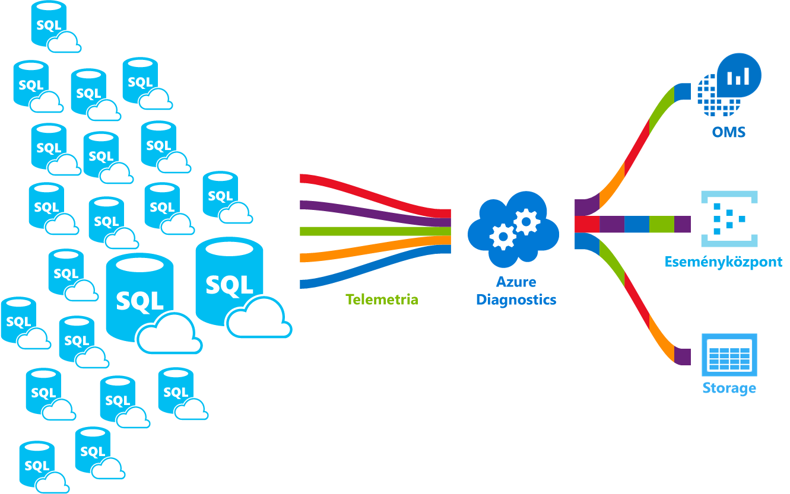

# <a name="azure-sql-database-metrics-and-diagnostics-logging"></a><span data-ttu-id="1cf55-103">Az Azure SQL Database metrikák és diagnosztikai naplózás</span><span class="sxs-lookup"><span data-stu-id="1cf55-103">Azure SQL Database metrics and diagnostics logging</span></span> 
<span data-ttu-id="1cf55-104">Az Azure SQL-adatbázis el tudná küldeni, metrikákat és egyszerűbb figyelési diagnosztikai naplókat.</span><span class="sxs-lookup"><span data-stu-id="1cf55-104">Azure SQL Database can emit metrics and diagnostic logs for easier monitoring.</span></span> <span data-ttu-id="1cf55-105">Az Azure SQL Database toostore erőforrás-használat, a munkavállalók és a munkamenetek és a kapcsolat egy Azure erőforrásainak konfigurálhatja:</span><span class="sxs-lookup"><span data-stu-id="1cf55-105">You can configure Azure SQL Database toostore resource usage, workers and sessions, and connectivity into one of these Azure resources:</span></span>
- <span data-ttu-id="1cf55-106">**Azure Storage**: Nagy tömegű telemetriai adat alacsony költségű archiválására</span><span class="sxs-lookup"><span data-stu-id="1cf55-106">**Azure Storage**: For archiving vast amounts of telemetry for a small price</span></span>
- <span data-ttu-id="1cf55-107">**Az Azure Event Hubs**: az Azure SQL Database telemetriai integrálása a figyelési megoldást igényelnek egyéni vagy a működés közbeni folyamatok</span><span class="sxs-lookup"><span data-stu-id="1cf55-107">**Azure Event Hub**: For integrating Azure SQL Database telemetry with your custom monitoring solution or hot pipelines</span></span>
- <span data-ttu-id="1cf55-108">**Az Azure Naplóelemzés**: A felügyeleti megoldás reporting, riasztás és képességek kiküszöböléséhez hello kezdő verzióról</span><span class="sxs-lookup"><span data-stu-id="1cf55-108">**Azure Log Analytics**: For out of hello box monitoring solution with reporting, alerting, and mitigating capabilities</span></span> 

    

## <a name="enable-logging"></a><span data-ttu-id="1cf55-110">Naplózás engedélyezése</span><span class="sxs-lookup"><span data-stu-id="1cf55-110">Enable logging</span></span>

<span data-ttu-id="1cf55-111">Metrikák és diagnosztikai naplózás alapértelmezés szerint nincs engedélyezve.</span><span class="sxs-lookup"><span data-stu-id="1cf55-111">Metrics and diagnostics logging is not enabled by default.</span></span> <span data-ttu-id="1cf55-112">Engedélyezi, és kezelheti a metrikák és diagnosztikai naplózás hello a következő módszerek egyikével:</span><span class="sxs-lookup"><span data-stu-id="1cf55-112">You can enable and manage metrics and diagnostics logging using one of hello following methods:</span></span>
- <span data-ttu-id="1cf55-113">Azure Portal</span><span class="sxs-lookup"><span data-stu-id="1cf55-113">Azure portal</span></span>
- <span data-ttu-id="1cf55-114">PowerShell</span><span class="sxs-lookup"><span data-stu-id="1cf55-114">PowerShell</span></span>
- <span data-ttu-id="1cf55-115">Azure CLI</span><span class="sxs-lookup"><span data-stu-id="1cf55-115">Azure CLI</span></span>
- <span data-ttu-id="1cf55-116">REST API</span><span class="sxs-lookup"><span data-stu-id="1cf55-116">REST API</span></span> 
- <span data-ttu-id="1cf55-117">Resource Manager-sablon</span><span class="sxs-lookup"><span data-stu-id="1cf55-117">Resource Manager template</span></span>

<span data-ttu-id="1cf55-118">Metrikák és diagnosztikai naplózás engedélyezéséhez meg kell toospecify hello Azure erőforráscsoport, ahol a kijelölt adatok gyűjtése.</span><span class="sxs-lookup"><span data-stu-id="1cf55-118">When you enable metrics and diagnostics logging, you need toospecify hello Azure resource where selected data is collected.</span></span> <span data-ttu-id="1cf55-119">Elérhető lehetőségek:</span><span class="sxs-lookup"><span data-stu-id="1cf55-119">Options available:</span></span>
- <span data-ttu-id="1cf55-120">Log Analytics</span><span class="sxs-lookup"><span data-stu-id="1cf55-120">Log analytics</span></span>
- <span data-ttu-id="1cf55-121">Eseményközpont</span><span class="sxs-lookup"><span data-stu-id="1cf55-121">Event Hub</span></span>
- <span data-ttu-id="1cf55-122">Azure Storage</span><span class="sxs-lookup"><span data-stu-id="1cf55-122">Azure Storage</span></span> 

<span data-ttu-id="1cf55-123">Új Azure-erőforrás kiépítése, vagy jelöljön ki egy meglévő erőforrást.</span><span class="sxs-lookup"><span data-stu-id="1cf55-123">You can provision a new Azure resource or select an existing resource.</span></span> <span data-ttu-id="1cf55-124">Hello tárolási erőforrások kijelölése, után kell toospecify mely adatok toocollect.</span><span class="sxs-lookup"><span data-stu-id="1cf55-124">After selecting hello storage resource, you need toospecify which data toocollect.</span></span> <span data-ttu-id="1cf55-125">Elérhető lehetőségek a következők:</span><span class="sxs-lookup"><span data-stu-id="1cf55-125">Options available include:</span></span>

- <span data-ttu-id="1cf55-126">**[1 perces metrikák](sql-database-metrics-diag-logging.md#1-minute-metrics)**  -DTU százaléka, a DTU határt, a Processzor százalékban tartalmaz napló írása fizikai adatot olvasott a következő százalékos aránya, százalékos, sikeres vagy sikertelen/letiltott tűzfalkapcsolatok, munkamenetek százalékos, munkavállalók százalékos, tárolási, tárolási százalékos, XTP tárolási százalékos aránya</span><span class="sxs-lookup"><span data-stu-id="1cf55-126">**[1-minute metrics](sql-database-metrics-diag-logging.md#1-minute-metrics)** - contains DTU percentage, DTU limit, CPU percentage, Physical data read percentage, Log write percentage, Successful/Failed/Blocked by firewall connections, sessions percentage, workers percentage, storage, storage percentage, XTP storage percentage</span></span>

<span data-ttu-id="1cf55-127">Az Event Hubs vagy AzureStorage fiók megadása esetén is megadhat egy megőrzési házirend toospecify régebbi, mint egy kiválasztott időszakban törlése adatok.</span><span class="sxs-lookup"><span data-stu-id="1cf55-127">If you specify Event Hub or an AzureStorage account, you can specify a retention policy toospecify that data that is older than a selected time period is deleted.</span></span> <span data-ttu-id="1cf55-128">A Naplóelemzési ad meg, ha hello adatmegőrzési hello kijelölt tarifacsomag függ.</span><span class="sxs-lookup"><span data-stu-id="1cf55-128">If you specify Log Analytics, hello retention policy depends on hello selected pricing tier.</span></span> <span data-ttu-id="1cf55-129">Tudjon meg többet az [Naplóelemzési árképzési](https://azure.microsoft.com/pricing/details/log-analytics/).</span><span class="sxs-lookup"><span data-stu-id="1cf55-129">Read more about [Log Analytics pricing](https://azure.microsoft.com/pricing/details/log-analytics/).</span></span> 

<span data-ttu-id="1cf55-130">Azt javasoljuk, hogy olvassa el a mindkét hello [áttekintése a Microsoft Azure-ban mérőszámok](../monitoring-and-diagnostics/monitoring-overview-metrics.md) és [áttekintés az Azure diagnosztikai naplók](../monitoring-and-diagnostics/monitoring-overview-of-diagnostic-logs.md) cikkek toogain megismerhesse, nem csak hogyan tooenable naplózást is, de hello metrikák és a napló kategóriák hello által támogatott különböző Azure-szolgáltatásokhoz.</span><span class="sxs-lookup"><span data-stu-id="1cf55-130">We recommend that you read both hello [Overview of metrics in Microsoft Azure](../monitoring-and-diagnostics/monitoring-overview-metrics.md) and [Overview of Azure Diagnostic Logs](../monitoring-and-diagnostics/monitoring-overview-of-diagnostic-logs.md) articles toogain an understanding of not only how tooenable logging, but hello metrics and log categories supported by hello various Azure services.</span></span>

### <a name="azure-portal"></a><span data-ttu-id="1cf55-131">Azure Portal</span><span class="sxs-lookup"><span data-stu-id="1cf55-131">Azure portal</span></span>

<span data-ttu-id="1cf55-132">tooenable metrikák és diagnosztikai naplók gyűjtemény hello Azure-portálon lépjen a tooyour Azure SQL adatbázis vagy a rugalmas készlet lap, és kattintson **diagnosztikai beállítások**.</span><span class="sxs-lookup"><span data-stu-id="1cf55-132">tooenable metrics and diagnostic logs collection in hello Azure portal, navigate tooyour Azure SQL database or elastic pool page, and then click **Diagnostic settings**.</span></span>

   

### <a name="powershell"></a><span data-ttu-id="1cf55-134">PowerShell</span><span class="sxs-lookup"><span data-stu-id="1cf55-134">PowerShell</span></span>

<span data-ttu-id="1cf55-135">tooenable metrikákat és naplózási diagnosztikai PowerShell, a használatával a következő parancsok hello:</span><span class="sxs-lookup"><span data-stu-id="1cf55-135">tooenable metrics and diagnostics logging using PowerShell, use hello following commands:</span></span>

- <span data-ttu-id="1cf55-136">egy Tárfiókot, a diagnosztikai naplók tárolására tooenable használja ezt a parancsot:</span><span class="sxs-lookup"><span data-stu-id="1cf55-136">tooenable storage of Diagnostic Logs in a Storage Account, use this command:</span></span>

   ```powershell
   Set-AzureRmDiagnosticSetting -ResourceId [your resource id] -StorageAccountId [your storage account id] -Enabled $true
   ```

   <span data-ttu-id="1cf55-137">Tárfiók azonosítója hello hello tárolási fiók toowhich toosend hello kívánt naplók hello erőforrás-azonosító.</span><span class="sxs-lookup"><span data-stu-id="1cf55-137">hello Storage Account ID is hello resource id for hello storage account toowhich you want toosend hello logs.</span></span>

- <span data-ttu-id="1cf55-138">tooenable streaming diagnosztikai naplók tooan Eseményközpontot, az alábbi parancsot használja:</span><span class="sxs-lookup"><span data-stu-id="1cf55-138">tooenable streaming of Diagnostic Logs tooan Event Hub, use this command:</span></span>

   ```powershell
   Set-AzureRmDiagnosticSetting -ResourceId [your resource id] -ServiceBusRuleId [your service bus rule id] -Enabled $true
   ```

   <span data-ttu-id="1cf55-139">Service Bus Szabályazonosító hello egy ilyen formátumú karakterláncot:</span><span class="sxs-lookup"><span data-stu-id="1cf55-139">hello Service Bus Rule ID is a string with this format:</span></span>

   ```powershell
   {service bus resource ID}/authorizationrules/{key name}
   ``` 

- <span data-ttu-id="1cf55-140">Diagnosztikai naplók tooa Naplóelemzési munkaterület küldése tooenable használja ezt a parancsot:</span><span class="sxs-lookup"><span data-stu-id="1cf55-140">tooenable sending of Diagnostic Logs tooa Log Analytics workspace, use this command:</span></span>

   ```powershell
   Set-AzureRmDiagnosticSetting -ResourceId [your resource id] -WorkspaceId [resource id of hello log analytics workspace] -Enabled $true
   ```

- <span data-ttu-id="1cf55-141">Ezt úgy szerezheti be a Naplóelemzési munkaterület használatával a következő parancs hello hello erőforrás-azonosító:</span><span class="sxs-lookup"><span data-stu-id="1cf55-141">You can obtain hello resource id of your Log Analytics workspace using hello following command:</span></span>

   ```powershell
   (Get-AzureRmOperationalInsightsWorkspace).ResourceId
   ```

<span data-ttu-id="1cf55-142">Ezek a paraméterek tooenable kombinálhatja több kimenet beállításai.</span><span class="sxs-lookup"><span data-stu-id="1cf55-142">You can combine these parameters tooenable multiple output options.</span></span>

### <a name="cli"></a><span data-ttu-id="1cf55-143">parancssori felület</span><span class="sxs-lookup"><span data-stu-id="1cf55-143">CLI</span></span>

<span data-ttu-id="1cf55-144">tooenable metrikák és diagnosztikai naplózás használatával hello Azure parancssori felület, a következő parancsok használata hello:</span><span class="sxs-lookup"><span data-stu-id="1cf55-144">tooenable metrics and diagnostics logging using hello Azure CLI, use hello following commands:</span></span>

- <span data-ttu-id="1cf55-145">egy Tárfiókot, a diagnosztikai naplók tárolására tooenable használja ezt a parancsot:</span><span class="sxs-lookup"><span data-stu-id="1cf55-145">tooenable storage of Diagnostic Logs in a Storage Account, use this command:</span></span>

   ```azurecli-interactive
   azure insights diagnostic set --resourceId <resourceId> --storageId <storageAccountId> --enabled true
   ```

   <span data-ttu-id="1cf55-146">Tárfiók azonosítója hello hello tárolási fiók toowhich toosend hello kívánt naplók hello erőforrás-azonosító.</span><span class="sxs-lookup"><span data-stu-id="1cf55-146">hello Storage Account ID is hello resource id for hello storage account toowhich you want toosend hello logs.</span></span>

- <span data-ttu-id="1cf55-147">tooenable streaming diagnosztikai naplók tooan Eseményközpontot, az alábbi parancsot használja:</span><span class="sxs-lookup"><span data-stu-id="1cf55-147">tooenable streaming of Diagnostic Logs tooan Event Hub, use this command:</span></span>

   ```azurecli-interactive
   azure insights diagnostic set --resourceId <resourceId> --serviceBusRuleId <serviceBusRuleId> --enabled true
   ```

   <span data-ttu-id="1cf55-148">Service Bus Szabályazonosító hello egy ilyen formátumú karakterláncot:</span><span class="sxs-lookup"><span data-stu-id="1cf55-148">hello Service Bus Rule ID is a string with this format:</span></span>

   ```azurecli-interactive
   {service bus resource ID}/authorizationrules/{key name}
   ```

- <span data-ttu-id="1cf55-149">Diagnosztikai naplók tooa Naplóelemzési munkaterület küldése tooenable használja ezt a parancsot:</span><span class="sxs-lookup"><span data-stu-id="1cf55-149">tooenable sending of Diagnostic Logs tooa Log Analytics workspace, use this command:</span></span>

   ```azurecli-interactive
   azure insights diagnostic set --resourceId <resourceId> --workspaceId <resource id of hello log analytics workspace> --enabled true
   ```

<span data-ttu-id="1cf55-150">Ezek a paraméterek tooenable kombinálhatja több kimenet beállításai.</span><span class="sxs-lookup"><span data-stu-id="1cf55-150">You can combine these parameters tooenable multiple output options.</span></span>

### <a name="rest-api"></a><span data-ttu-id="1cf55-151">REST API</span><span class="sxs-lookup"><span data-stu-id="1cf55-151">REST API</span></span>

<span data-ttu-id="1cf55-152">Megtudhatja, hogyan túl[hello Azure figyelő REST API használatával diagnosztikai beállítások módosításához](https://msdn.microsoft.com/library/azure/dn931931.aspx).</span><span class="sxs-lookup"><span data-stu-id="1cf55-152">Read about how too[change Diagnostic settings using hello Azure Monitor REST API](https://msdn.microsoft.com/library/azure/dn931931.aspx).</span></span> 

### <a name="resource-manager-template"></a><span data-ttu-id="1cf55-153">Resource Manager-sablon</span><span class="sxs-lookup"><span data-stu-id="1cf55-153">Resource Manager template</span></span>

<span data-ttu-id="1cf55-154">Megtudhatja, hogyan túl[engedélyezze a diagnosztikát a Resource Manager sablonnal erőforrás létrehozásakor](../monitoring-and-diagnostics/monitoring-enable-diagnostic-logs-using-template.md).</span><span class="sxs-lookup"><span data-stu-id="1cf55-154">Read about how too[enable Diagnostic settings at resource creation using Resource Manager template](../monitoring-and-diagnostics/monitoring-enable-diagnostic-logs-using-template.md).</span></span> 

## <a name="stream-into-log-analytics"></a><span data-ttu-id="1cf55-155">A Naplóelemzési adatfolyam</span><span class="sxs-lookup"><span data-stu-id="1cf55-155">Stream into Log Analytics</span></span> 
<span data-ttu-id="1cf55-156">Az Azure SQL Database metrikák és diagnosztikai naplók továbbítható a Log Analyticshez hello beépített "küldési tooLog Analytics" kapcsoló használatával hello portálon, vagy egy diagnosztikai beállításban Azure PowerShell parancsmagok, Azure CLI vagy a figyelő többi Azure Log Analytics engedélyezésével API-T.</span><span class="sxs-lookup"><span data-stu-id="1cf55-156">Azure SQL Database metrics and diagnostic logs can be streamed into Log Analytics using hello built-in “Send tooLog Analytics” option in hello portal, or by enabling Log Analytics in a diagnostic setting via Azure PowerShell cmdlets, Azure CLI, or Azure Monitor REST API.</span></span>

### <a name="installation-overview"></a><span data-ttu-id="1cf55-157">Telepítés – áttekintés</span><span class="sxs-lookup"><span data-stu-id="1cf55-157">Installation overview</span></span>

<span data-ttu-id="1cf55-158">Figyelése Azure SQL Database járműflotta a Naplóelemzési egyszerű.</span><span class="sxs-lookup"><span data-stu-id="1cf55-158">Monitoring Azure SQL Database fleet is simple with Log Analytics.</span></span> <span data-ttu-id="1cf55-159">Három lépésre szükség:</span><span class="sxs-lookup"><span data-stu-id="1cf55-159">Three steps are required:</span></span>

1.  <span data-ttu-id="1cf55-160">Log Analytics-erőforrás létrehozása</span><span class="sxs-lookup"><span data-stu-id="1cf55-160">Create Log Analytics resource</span></span>
2.  <span data-ttu-id="1cf55-161">A Naplóelemzési létrehozott hello adatbázisok toorecord metrikák és diagnosztikai naplók konfigurálása</span><span class="sxs-lookup"><span data-stu-id="1cf55-161">Configure databases toorecord metrics and diagnostic logs into hello created Log Analytics</span></span>
3.  <span data-ttu-id="1cf55-162">Telepítés **Azure SQL elemzés** Log Analytics-galériából megoldás</span><span class="sxs-lookup"><span data-stu-id="1cf55-162">Install **Azure SQL Analytics** solution from gallery in Log Analytics</span></span>

### <a name="create-log-analytics-resource"></a><span data-ttu-id="1cf55-163">Log Analytics-erőforrás létrehozása</span><span class="sxs-lookup"><span data-stu-id="1cf55-163">Create Log Analytics resource</span></span>

1. <span data-ttu-id="1cf55-164">Kattintson a **új** hello bal oldali menüben.</span><span class="sxs-lookup"><span data-stu-id="1cf55-164">Click **New** in hello left-hand menu.</span></span>
2. <span data-ttu-id="1cf55-165">Kattintson a **figyelési + kezelése**</span><span class="sxs-lookup"><span data-stu-id="1cf55-165">Click **Monitoring + Management**</span></span>
3. <span data-ttu-id="1cf55-166">Kattintson a **Analytics naplózása**</span><span class="sxs-lookup"><span data-stu-id="1cf55-166">Click **Log Analytics**</span></span>
4. <span data-ttu-id="1cf55-167">Töltse ki hello Naplóelemzési űrlapot hello szükséges további információt: munkaterület nevét, előfizetés, erőforráscsoportot, helyét és IP-címek.</span><span class="sxs-lookup"><span data-stu-id="1cf55-167">Fill in hello Log Analytics form with hello additional information required: workspace name, subscription, resource group, location, and pricing tier.</span></span>

   

### <a name="configure-databases-toorecord-metrics-and-diagnostic-logs"></a><span data-ttu-id="1cf55-169">Adatbázisok toorecord metrikák és diagnosztikai naplók konfigurálása</span><span class="sxs-lookup"><span data-stu-id="1cf55-169">Configure databases toorecord metrics and diagnostic logs</span></span>

<span data-ttu-id="1cf55-170">hello ahol adatbázisok jegyezze fel a metrikák legegyszerűbb módja tooconfigure hello Azure-portálon keresztül történik.</span><span class="sxs-lookup"><span data-stu-id="1cf55-170">hello easiest way tooconfigure where databases record their metrics is through hello Azure portal.</span></span> <span data-ttu-id="1cf55-171">A hello Azure-portálon, keresse meg az Azure SQL Database erőforrás tooyour, és kattintson **diagnosztikai beállítások**.</span><span class="sxs-lookup"><span data-stu-id="1cf55-171">In hello Azure portal, navigate tooyour Azure SQL Database resource and click **Diagnostics settings**.</span></span> 

### <a name="install-hello-azure-sql-analytics-solution-from-gallery"></a><span data-ttu-id="1cf55-172">Gyűjteményből hello Azure SQL elemzési megoldás telepítése</span><span class="sxs-lookup"><span data-stu-id="1cf55-172">Install hello Azure SQL Analytics solution from gallery</span></span>  

1. <span data-ttu-id="1cf55-173">Miután hello Naplóelemzési erőforrás jön létre, és az adatok áramlik bele, telepítse az Azure SQL elemzési megoldások.</span><span class="sxs-lookup"><span data-stu-id="1cf55-173">Once hello Log Analytics resource is created and your data is flowing into it, install Azure SQL Analytics solution.</span></span> <span data-ttu-id="1cf55-174">Ezt rábízhatja a hello **megoldások gyűjtemény** , amely a hello OMS kezdőlap és hello oldalsó menüben található.</span><span class="sxs-lookup"><span data-stu-id="1cf55-174">This can be done through hello **Solutions Gallery** that you can find on hello OMS homepage and in hello side menu.</span></span> <span data-ttu-id="1cf55-175">Hello gyűjteményben található, és kattintson a **Azure SQL elemzés** megoldás, és kattintson **Hozzáadás**.</span><span class="sxs-lookup"><span data-stu-id="1cf55-175">In hello gallery, find and click **Azure SQL Analytics** solution and click **Add**.</span></span>

   

2. <span data-ttu-id="1cf55-177">A kezdőlapon OMS, egy új csempe nevű **Azure SQL elemzés** jelenik meg.</span><span class="sxs-lookup"><span data-stu-id="1cf55-177">On your OMS homepage, a new tile called **Azure SQL Analytics** appears.</span></span> <span data-ttu-id="1cf55-178">Ez a csempe kiválasztásával megnyílik a hello Azure SQL-elemzések irányítópultján.</span><span class="sxs-lookup"><span data-stu-id="1cf55-178">Selecting this tile opens hello Azure SQL Analytics dashboard.</span></span>

### <a name="using-azure-sql-analytics-solution"></a><span data-ttu-id="1cf55-179">Az Azure SQL elemzés megoldással</span><span class="sxs-lookup"><span data-stu-id="1cf55-179">Using Azure SQL Analytics Solution</span></span>

<span data-ttu-id="1cf55-180">Az Azure SQL elemzés, amely lehetővé teszi az Azure SQL Database erőforrások hello hierarchia keresztül toonavigate hierarchikus irányítópult.</span><span class="sxs-lookup"><span data-stu-id="1cf55-180">Azure SQL Analytics is a hierarchical dashboard that allows you toonavigate through hello hierarchy of Azure SQL Database resources.</span></span> <span data-ttu-id="1cf55-181">A funkció lehetővé teszi, hogy Ön toodo magas szintű figyelési azonban azt is lehetővé teszi a tooscope a megfelelő figyelési toojust hello beállítása az erőforrások.</span><span class="sxs-lookup"><span data-stu-id="1cf55-181">This capability enables you toodo high-level monitoring but it also enables you tooscope your monitoring toojust hello right set of resources.</span></span>
<span data-ttu-id="1cf55-182">Az irányítópulton kiválasztott hello erőforrás a különböző erőforrások hello listája.</span><span class="sxs-lookup"><span data-stu-id="1cf55-182">Dashboard contains hello lists of different resources under hello selected resource.</span></span> <span data-ttu-id="1cf55-183">Például a kiválasztott előfizetéshez láthatja hello összes kiszolgáló, a rugalmas készletek és a toohello tartozó adatbázis kiválasztott előfizetéshez.</span><span class="sxs-lookup"><span data-stu-id="1cf55-183">For example, for a selected subscription you can see hello all servers, elastic pools and databases that belong toohello selected subscription.</span></span> <span data-ttu-id="1cf55-184">Emellett a rugalmas készletek és adatbázisokat, láthatja hello erőforrás-használati metrikák erőforrás.</span><span class="sxs-lookup"><span data-stu-id="1cf55-184">Additionally, for Elastic Pools and databases, you can see hello resource usage metrics of that resource.</span></span> <span data-ttu-id="1cf55-185">Ez magában foglalja diagramok DTU, Processzor, IO, napló, munkamenetek, dolgozók, kapcsolatok, valamint tárolási GB-ban.</span><span class="sxs-lookup"><span data-stu-id="1cf55-185">This includes charts for DTU, CPU, IO, LOG, sessions, workers, connections, and storage in GB.</span></span>

## <a name="stream-into-azure-event-hub"></a><span data-ttu-id="1cf55-186">Az Azure Event Hubs adatfolyam</span><span class="sxs-lookup"><span data-stu-id="1cf55-186">Stream into Azure Event Hub</span></span>

<span data-ttu-id="1cf55-187">Az Azure SQL Database metrikák és diagnosztikai naplók továbbítható az Event Hubs hello beépített "adatfolyam tooan eseményközpont" kapcsoló használatával hello portálon, vagy a Service Bus szabály azonosítója az Azure PowerShell-parancsmagok, az Azure parancssori felület vagy a Azure figyelő REST diagnosztikai beállítás engedélyezésével API-T.</span><span class="sxs-lookup"><span data-stu-id="1cf55-187">Azure SQL Database metrics and diagnostic logs can be streamed into Event Hub using hello built-in “Stream tooan event hub” option in hello portal, or by enabling Service Bus Rule Id in a diagnostic setting via Azure PowerShell Cmdlets, Azure CLI, or Azure Monitor REST API.</span></span> 

### <a name="what-toodo-with-metrics-and-diagnostic-logs-in-event-hub"></a><span data-ttu-id="1cf55-188">Milyen toodo metrikák és diagnosztikai naplófájlok az Event Hubs?</span><span class="sxs-lookup"><span data-stu-id="1cf55-188">What toodo with metrics and diagnostic logs in Event Hub?</span></span>
<span data-ttu-id="1cf55-189">Miután kijelölt hello adatokat az Event Hubs továbbítja adatfolyamként, egy lépéssel közelebb tooenabling speciális megfigyelési forgatókönyvekhez áll.</span><span class="sxs-lookup"><span data-stu-id="1cf55-189">Once hello selected data is streamed into Event Hub, you are one step closer tooenabling advanced monitoring scenarios.</span></span> <span data-ttu-id="1cf55-190">Az Event Hubs úgy működik, mint egy eseményfolyamat számára "bejárati ajtón" hello, és amennyiben az eseményközpontnak összegyűjtött adatok átalakíthatók, és bármilyen valós idejű elemzési szolgáltató vagy kötegelési/tárolóadapter segítségével tárolják.</span><span class="sxs-lookup"><span data-stu-id="1cf55-190">Event Hubs acts as hello "front door" for an event pipeline, and once data is collected into an Event Hub, it can be transformed and stored using any real-time analytics provider or batching/storage adapters.</span></span> <span data-ttu-id="1cf55-191">Az Event Hubs hello éles tartozó események hello felhasználásától, az adatfolyam leválasztja az, hogy az eseményfelhasználók férhetnek hozzá a saját ütemezésüknek hello események.</span><span class="sxs-lookup"><span data-stu-id="1cf55-191">Event Hubs decouples hello production of a stream of events from hello consumption of those events, so that event consumers can access hello events on their own schedule.</span></span> <span data-ttu-id="1cf55-192">Az Event Hubs további információkért lásd:</span><span class="sxs-lookup"><span data-stu-id="1cf55-192">For more information on Event Hub, see:</span></span>

- <span data-ttu-id="1cf55-193">[Mik az Azure Event Hubs](../event-hubs/event-hubs-what-is-event-hubs.md)?</span><span class="sxs-lookup"><span data-stu-id="1cf55-193">[What are Azure Event Hubs](../event-hubs/event-hubs-what-is-event-hubs.md)?</span></span>
- [<span data-ttu-id="1cf55-194">Bevezetés az Event Hubs használatába</span><span class="sxs-lookup"><span data-stu-id="1cf55-194">Get started with Event Hubs</span></span>](../event-hubs/event-hubs-csharp-ephcs-getstarted.md)


<span data-ttu-id="1cf55-195">Az alábbiakban néhány módokon használhatja a streaming funkció hello:</span><span class="sxs-lookup"><span data-stu-id="1cf55-195">Here are just a few ways you might use hello streaming capability:</span></span>

-   <span data-ttu-id="1cf55-196">Szolgáltatás állapotának megtekintéséhez folyamatos "forró path" adatok tooPowerBI - Event Hubs használatával, a Stream Analytics és a Power BI, könnyen alakíthatja a metrikák és diagnosztikai adatokat közel valós idejű elemzése az Azure-szolgáltatásoknak.</span><span class="sxs-lookup"><span data-stu-id="1cf55-196">View service health by streaming “hot path” data tooPowerBI - Using Event Hubs, Stream Analytics, and PowerBI, you can easily transform your metrics and diagnostics data into near real-time insights on your Azure services.</span></span> <span data-ttu-id="1cf55-197">Egy megtudhatja, hogyan tooset fel az Event Hubs feldolgozni az adatokat az Stream Analytics használ, és kimenetként használata a Power bi [Stream Analytics és a Power BI](../stream-analytics/stream-analytics-power-bi-dashboard.md).</span><span class="sxs-lookup"><span data-stu-id="1cf55-197">For an overview of how tooset up an Event Hubs, process data with Stream Analytics, and use PowerBI as an output, see [Stream Analytics and Power BI](../stream-analytics/stream-analytics-power-bi-dashboard.md).</span></span>
-   <span data-ttu-id="1cf55-198">Stream naplók toothird féltől naplózása és telemetriai adatfolyamok – használatával az Event Hubs streaming, kérheti le a metrikák és diagnosztikai naplókat a toodifferent külső figyelése és a naplófájlok elemzési megoldásokat.</span><span class="sxs-lookup"><span data-stu-id="1cf55-198">Stream logs toothird-party logging and telemetry streams – Using Event Hubs streaming you can get your metrics and diagnostic logs in toodifferent third-party monitoring and log analytics solutions.</span></span> 
-   <span data-ttu-id="1cf55-199">És hozhat létre egy egyéni telemetria naplózási platform – Ha már rendelkezik egy egyedi telemetriai platform vagy a rendszer csak a gondolat egy kiválóan méretezhető hello közzétételi-feliratkozási épület jellegétől függően az Event Hubs lehetővé teszi a tooflexibly betöltési diagnosztikai naplók.</span><span class="sxs-lookup"><span data-stu-id="1cf55-199">Build a custom telemetry and logging platform – If you already have a custom-built telemetry platform or are just thinking about building one, hello highly scalable publish-subscribe nature of Event Hubs allows you tooflexibly ingest diagnostic logs.</span></span> <span data-ttu-id="1cf55-200">Lásd: [Dan Rosanova útmutató toousing Event Hubs egy globális méretű telemetriai Platform](https://azure.microsoft.com/documentation/videos/build-2015-designing-and-sizing-a-global-scale-telemetry-platform-on-azure-event-Hubs/).</span><span class="sxs-lookup"><span data-stu-id="1cf55-200">See [Dan Rosanova’s guide toousing Event Hubs in a global scale telemetry platform](https://azure.microsoft.com/documentation/videos/build-2015-designing-and-sizing-a-global-scale-telemetry-platform-on-azure-event-Hubs/).</span></span>

## <a name="stream-into-azure-storage"></a><span data-ttu-id="1cf55-201">Az Azure Storage adatfolyam</span><span class="sxs-lookup"><span data-stu-id="1cf55-201">Stream into Azure Storage</span></span>

<span data-ttu-id="1cf55-202">Az Azure SQL Database metrikák és diagnosztikai naplók tárolhatja az Azure Storage hello beépített "Archiválására tooa storage-fiók" beállítás használatával hello Azure-portálon vagy az Azure Storage engedélyezése az Azure PowerShell-parancsmagok, az Azure parancssori felület vagy a Azure diagnosztikai beállítás A figyelő REST API-t.</span><span class="sxs-lookup"><span data-stu-id="1cf55-202">Azure SQL Database metrics and diagnostic logs can be stored into Azure Storage using hello built-in "Archive tooa storage account” option in hello Azure portal, or by enabling Azure Storage in a diagnostic setting via Azure PowerShell Cmdlets, Azure CLI, or Azure Monitor REST API.</span></span>

### <a name="schema-of-metrics-and-diagnostic-logs-in-hello-storage-account"></a><span data-ttu-id="1cf55-203">A metrikák és diagnosztikai naplók hello tárfiókban lévő séma</span><span class="sxs-lookup"><span data-stu-id="1cf55-203">Schema of metrics and diagnostic logs in hello storage account</span></span>

<span data-ttu-id="1cf55-204">Ha metrikák és diagnosztikai naplók gyűjtemény áll, tárolót választotta, mikor érhetők el adatok első sora hello hello tárfiók jön létre.</span><span class="sxs-lookup"><span data-stu-id="1cf55-204">Once you have set up metrics and diagnostic logs collection, a storage container is created in hello storage account you selected when hello first rows of data are available.</span></span> <span data-ttu-id="1cf55-205">a blobok hello szerkezete van:</span><span class="sxs-lookup"><span data-stu-id="1cf55-205">hello structure of these blobs is:</span></span>

```powershell
insights-{metrics|logs}-{category name}/resourceId=/SUBSCRIPTIONS/{subscription ID}/ RESOURCEGROUPS/{resource group name}/PROVIDERS/Microsoft.SQL/servers/{resource_server}/ databases/{database_name}/y={four-digit numeric year}/m={two-digit numeric month}/d={two-digit numeric day}/h={two-digit 24-hour clock hour}/m=00/PT1H.json
```
    
<span data-ttu-id="1cf55-206">Vagy egyszerűen több:</span><span class="sxs-lookup"><span data-stu-id="1cf55-206">Or, more simply:</span></span>

```powershell
insights-{metrics|logs}-{category name}/resourceId=/{resource Id}/y={four-digit numeric year}/m={two-digit numeric month}/d={two-digit numeric day}/h={two-digit 24-hour clock hour}/m=00/PT1H.json
```

<span data-ttu-id="1cf55-207">A blob nevének 1 perces metrikáihoz lehet, például:</span><span class="sxs-lookup"><span data-stu-id="1cf55-207">For example, a blob name for 1-minute metrics might be:</span></span>

```powershell
insights-metrics-minute/resourceId=/SUBSCRIPTIONS/s1id1234-5679-0123-4567-890123456789/RESOURCEGROUPS/TESTRESOURCEGROUP/PROVIDERS/MICROSOFT.SQL/ servers/Server1/databases/database1/y=2016/m=08/d=22/h=18/m=00/PT1H.json
```

<span data-ttu-id="1cf55-208">Abban az esetben, ha azt szeretné, hogy a rugalmas készlet hello toorecord hello adatait, blob neve a következő kissé eltérő:</span><span class="sxs-lookup"><span data-stu-id="1cf55-208">In case you want toorecord hello data from hello Elastic Pool, blob name is a bit different:</span></span>

```powershell
insights-{metrics|logs}-{category name}/resourceId=/SUBSCRIPTIONS/{subscription ID}/ RESOURCEGROUPS/{resource group name}/PROVIDERS/Microsoft.SQL/servers/{resource_server}/ elasticPools/{elastic_pool_name}/y={four-digit numeric year}/m={two-digit numeric month}/d={two-digit numeric day}/h={two-digit 24-hour clock hour}/m=00/PT1H.json
```

### <a name="download-metrics-and-logs-from-azure-storage"></a><span data-ttu-id="1cf55-209">Az Azure storage metrikák és a naplók letöltése</span><span class="sxs-lookup"><span data-stu-id="1cf55-209">Download metrics and logs from Azure storage</span></span>

<span data-ttu-id="1cf55-210">Lásd: [metrikák és diagnosztikai naplók letöltése Azure Storage-ból](../storage/blobs/storage-dotnet-how-to-use-blobs.md#download-blobs)</span><span class="sxs-lookup"><span data-stu-id="1cf55-210">See [Download metrics and diagnostic logs from Azure Storage](../storage/blobs/storage-dotnet-how-to-use-blobs.md#download-blobs)</span></span>

## <a name="1-minute-metrics"></a><span data-ttu-id="1cf55-211">1 perces metrikák</span><span class="sxs-lookup"><span data-stu-id="1cf55-211">1-minute metrics</span></span>

| |  |
|---|---|
|<span data-ttu-id="1cf55-212">**Erőforrás**</span><span class="sxs-lookup"><span data-stu-id="1cf55-212">**Resource**</span></span>|<span data-ttu-id="1cf55-213">**Metrikák**</span><span class="sxs-lookup"><span data-stu-id="1cf55-213">**Metrics**</span></span>|
|<span data-ttu-id="1cf55-214">Adatbázis</span><span class="sxs-lookup"><span data-stu-id="1cf55-214">Database</span></span>|<span data-ttu-id="1cf55-215">DTU százalékos DTU használt, DTU határt, a processzor, a fizikai adatáttelepítések olvasási százalékos, napló írása százalékos, sikeres vagy sikertelen/letiltott tűzfalkapcsolatok, munkamenetek százalékos, munkavállalók százalékos, tárolási, tárolási százalékos, XTP tárolási százalékos, holtpont</span><span class="sxs-lookup"><span data-stu-id="1cf55-215">DTU percentage, DTU used, DTU limit, CPU percentage, Physical data read percentage, Log write percentage, Successful/Failed/Blocked by firewall connections, sessions percentage, workers percentage, storage, storage percentage, XTP storage percentage, deadlocks</span></span> |
|<span data-ttu-id="1cf55-216">A rugalmas készlet</span><span class="sxs-lookup"><span data-stu-id="1cf55-216">Elastic pool</span></span>|<span data-ttu-id="1cf55-217">eDTU százalékos eDTU használt, eDTU határt, a processzor, a fizikai adatáttelepítések olvasási százalékos, napló írása százalékos, munkamenetek százalékos, munkavállalók százalékos, tárolási, tárolási százalékos, tárolási kapacitás, XTP tárolási százalékos aránya</span><span class="sxs-lookup"><span data-stu-id="1cf55-217">eDTU percentage, eDTU used, eDTU limit, CPU percentage, Physical data read percentage, Log write percentage, sessions percentage, workers percentage, storage, storage percentage, storage limit, XTP storage percentage</span></span> |
|||

## <a name="next-steps"></a><span data-ttu-id="1cf55-218">Következő lépések</span><span class="sxs-lookup"><span data-stu-id="1cf55-218">Next steps</span></span>

- <span data-ttu-id="1cf55-219">Mindkét hello olvasási [áttekintése a Microsoft Azure-ban mérőszámok](../monitoring-and-diagnostics/monitoring-overview-metrics.md) és [áttekintés az Azure diagnosztikai naplók](../monitoring-and-diagnostics/monitoring-overview-of-diagnostic-logs.md) toogain nem csak hogyan metrikák hello azonban a naplózás tooenable és kategóriák jelentkezzen cikkek hello által támogatott különböző Azure-szolgáltatásokhoz.</span><span class="sxs-lookup"><span data-stu-id="1cf55-219">Read both hello [Overview of metrics in Microsoft Azure](../monitoring-and-diagnostics/monitoring-overview-metrics.md) and [Overview of Azure Diagnostic Logs](../monitoring-and-diagnostics/monitoring-overview-of-diagnostic-logs.md) articles toogain an understanding of not only how tooenable logging, but hello metrics and log categories supported by hello various Azure services.</span></span>
- <span data-ttu-id="1cf55-220">Olvassa el ezeket az event hubs vonatkozó cikkek toolearn:</span><span class="sxs-lookup"><span data-stu-id="1cf55-220">Read these articles toolearn about event hubs:</span></span>
   - <span data-ttu-id="1cf55-221">[Mik az Azure Event Hubs](../event-hubs/event-hubs-what-is-event-hubs.md)?</span><span class="sxs-lookup"><span data-stu-id="1cf55-221">[What are Azure Event Hubs](../event-hubs/event-hubs-what-is-event-hubs.md)?</span></span>
   - [<span data-ttu-id="1cf55-222">Bevezetés az Event Hubs használatába</span><span class="sxs-lookup"><span data-stu-id="1cf55-222">Get started with Event Hubs</span></span>](../event-hubs/event-hubs-csharp-ephcs-getstarted.md)
- <span data-ttu-id="1cf55-223">Lásd: [metrikák és diagnosztikai naplók letöltése Azure Storage-ból](../storage/blobs/storage-dotnet-how-to-use-blobs.md#download-blobs)</span><span class="sxs-lookup"><span data-stu-id="1cf55-223">See [Download metrics and diagnostic logs from Azure Storage](../storage/blobs/storage-dotnet-how-to-use-blobs.md#download-blobs)</span></span>
