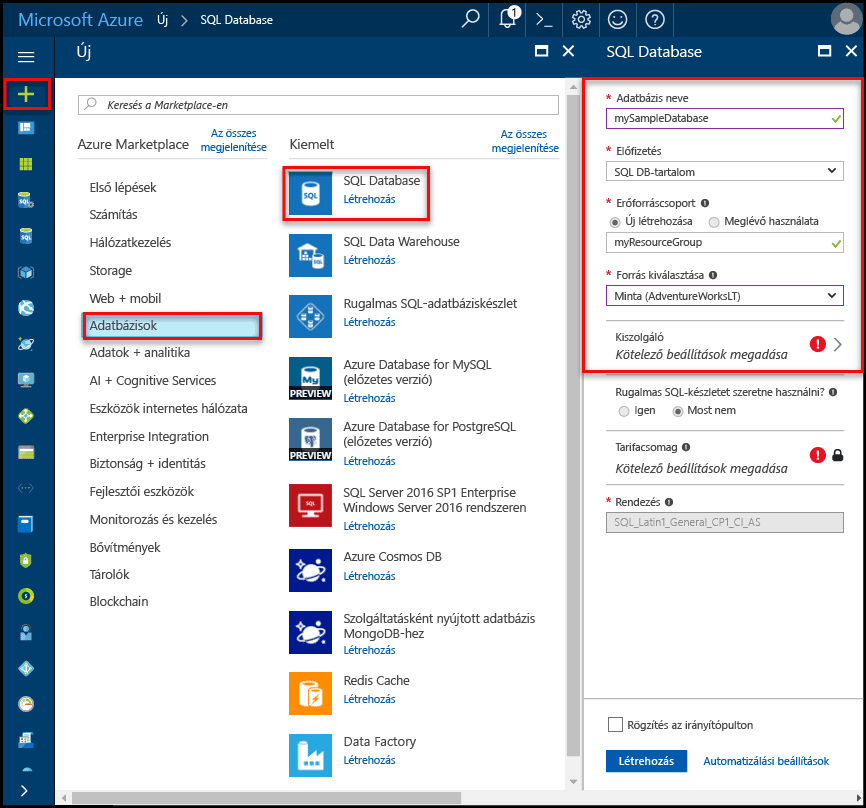

# Azure SQL Database-kiszolgálók és adatbázisok létrehozása és kezeléseCreate and manage Azure SQL Database servers and databases

Azure SQL-adatbázis egy olyan felügyelt adatbázis a Microsoft Azure rendszerben, a rendszer létrehoz egy [Azure erőforráscsoport](../azure-resource-manager/resource-group-overview.md) meghatározott számú [számítási és tárolási erőforrásokat a különböző munkaterhelések](sql-database-service-tiers.md).An Azure SQL database is a managed database in Microsoft Azure that is created within an [Azure resource group](../azure-resource-manager/resource-group-overview.md) with a defined set of [compute and storage resources for different workloads](sql-database-service-tiers.md). Azure SQL-adatbázis nem tartozik egy Azure SQL Database logikai kiszolgáló, ami a rendszer létrehoz egy adott Azure-régiót.An Azure SQL database is associated with an Azure SQL Database logical server, which is created within a specific Azure region. 

## Azure SQL-adatbázis egyetlen, a készletezett vagy a particionált adatbázis is lehet.An Azure SQL database can be a single, pooled, or partitioned database

Egy Azure SQL adatbázis lehet:An Azure SQL database can be:

- lehetnek önálló, [saját erőforráskészlettel](sql-database-what-is-a-dtu.md#what-are-database-transaction-units-dtus) rendelkező adatbázisok (DTU);A single database with its [own set of resources](sql-database-what-is-a-dtu.md#what-are-database-transaction-units-dtus) (DTUs)
- Része egy [SQL rugalmas készlet](sql-database-elastic-pool.md) , amely [közösen használja az erőforráscsoport](sql-database-what-is-a-dtu.md#what-are-elastic-database-transaction-units-edtus) (edtu-k)Part of a [SQL elastic pool](sql-database-elastic-pool.md) that [shares a set of resources](sql-database-what-is-a-dtu.md#what-are-elastic-database-transaction-units-edtus) (eDTUs)
- részét képezhetik [horizontálisan skálázott adatbázisok kibővíthető készletének](sql-database-elastic-scale-introduction.md#horizontal-and-vertical-scaling), amely önálló vagy készletezett adatbázisokból állhat;Part of a [scaled-out set of sharded databases](sql-database-elastic-scale-introduction.md#horizontal-and-vertical-scaling), which can be either single or pooled databases
- részét képezhetik egy [több-bérlős SaaS kialakítási mintában](sql-database-design-patterns-multi-tenancy-saas-applications.md) szereplő adatbáziskészletnek, mely adatbázisok lehetnek önálló, készletezett vagy mindkétféle adatbázisok.Part of a set of databases participating in a [multitenant SaaS design pattern](sql-database-design-patterns-multi-tenancy-saas-applications.md), and whose databases can either be single or pooled databases (or both) 

> [!TIP]
> Az érvényes adatbázisnevekkel kapcsolatban lásd az [adatbázis-azonosítókat](https://docs.microsoft.com/en-us/sql/relational-databases/databases/database-identifiers) ismertető cikket.For valid database names, see [Database Identifiers](https://docs.microsoft.com/en-us/sql/relational-databases/databases/database-identifiers). 
>
 
- A Microsoft Azure SQL Database által alapértelmezés szerint használt adatbázisrendezés az **SQL_LATIN1_GENERAL_CP1_CI_AS**, amelyben a **LATIN1_GENERAL** az angol (Egyesült Államok), a **CP1** az 1252-es kódlap, a **CI** a kis- és nagybetűk meg nem különböztetése, az **AS** pedig az ékezetérzékenység.The default database collation used by Microsoft Azure SQL Database is **SQL_LATIN1_GENERAL_CP1_CI_AS**, where **LATIN1_GENERAL** is English (United States), **CP1** is code page 1252, **CI** is case-insensitive, and **AS** is accent-sensitive. További információk a rendezés beállításáról: [COLLATE (Transact-SQL)](https://msdn.microsoft.com/library/ms184391.aspx).For more information about how to set the collation, see [COLLATE (Transact-SQL)](https://msdn.microsoft.com/library/ms184391.aspx).
- A Microsoft Azure SQL Database 7.3 vagy újabb tabulált adatfolyam (TDS) protokoll ügyfél verziója támogatja.Microsoft Azure SQL Database supports tabular data stream (TDS) protocol client version 7.3 or later.
- Csak a TCP/IP-kapcsolatok engedélyezve vannak.Only TCP/IP connections are allowed.

## Mi az az Azure SQL logikai kiszolgálóra?What is an Azure SQL logical server?

Több adatbázis, beleértve a központi felügyeleti pontként működik a logikai kiszolgáló [SQL rugalmas készletek](sql-database-elastic-pool.md) [bejelentkezések](sql-database-manage-logins.md), [tűzfal-szabályok](sql-database-firewall-configure.md), [szabályok naplózás](sql-database-auditing.md), [szabályzatok fenyegetés](sql-database-threat-detection.md), és [feladatátvételi csoportok](sql-database-geo-replication-overview.md).A logical server acts as a central administrative point for multiple databases, including [SQL elastic pools](sql-database-elastic-pool.md) [logins](sql-database-manage-logins.md), [firewall rules](sql-database-firewall-configure.md), [auditing rules](sql-database-auditing.md), [threat detection policies](sql-database-threat-detection.md), and [failover groups](sql-database-geo-replication-overview.md). Egy logikai kiszolgáló lehet egy másik régióban, mint az erőforráscsoportot.A logical server can be in a different region than its resource group. A logikai kiszolgáló léteznie kell az Azure SQL-adatbázis létrehozása előtt.The logical server must exist before you can create the Azure SQL database. A kiszolgálón lévő összes adatbázis belül és a logikai kiszolgáló ugyanabban a régióban jönnek létre.All databases on a server are created within the same region as the logical server. 

> [!IMPORTANT]
> Az SQL Database-ben a kiszolgáló egy logikai szerkezet, amely nem azonos a helyszíni SQL Server-példánnyal.In SQL Database, a server is a logical construct that is distinct from a SQL Server instance that you may be familiar with in the on-premises world. Az SQL Database szolgáltatás nem garantálja az adatbázisok helyét a logikai kiszolgálójukhoz képest, valamint nem kínál példányszintű hozzáférést és funkciókat.Specifically, the SQL Database service makes no guarantees regarding location of the databases in relation to their logical servers, and exposes no instance-level access or features.
> 

Logikai kiszolgáló létrehozása, ha a kiszolgáló megadta bejelentkezési fiókot és jelszót, amely rendszergazdai jogosultságokkal ezen a kiszolgálón a master adatbázis és az összes adatbázis létrehozása ezen a kiszolgálón.When you create a logical server, you provide a server login account and password that has administrative rights to the master database on that server and all databases created on that server. A kezdeti egy egy SQL-bejelentkezési fiók.This initial account is a SQL login account. Az Azure SQL Database hitelesítéshez támogatja az SQL-hitelesítést és az Azure Active Directory-hitelesítéssel.Azure SQL Database supports SQL authentication and Azure Active Directory Authentication for authentication. További információ a bejelentkezési és hitelesítési: [kezelése adatbázisok és bejelentkezések az Azure SQL Database](sql-database-manage-logins.md).For information about logins and authentication, see [Managing Databases and Logins in Azure SQL Database](sql-database-manage-logins.md). A Windows-hitelesítés nem támogatott.Windows Authentication is not supported. 

> [!TIP]
> Érvényes erőforrás csoport és a kiszolgáló nevét, lásd: [elnevezési szabályokat és korlátozásokat](https://docs.microsoft.com/azure/architecture/best-practices/naming-conventions).For valid resource group and server names, see [Naming rules and restrictions](https://docs.microsoft.com/azure/architecture/best-practices/naming-conventions).
>

Az Azure Database logikai kiszolgáló:An Azure Database logical server:

- Egy Azure-előfizetésen belül jön létre, de az erőforrásaival együtt áthelyezhető másik előfizetésre.Is created within an Azure subscription, but can be moved with its contained resources to another subscription
- Az adatbázisok, rugalmas készletek és adattárházak szülőerőforrása.Is the parent resource for databases, elastic pools, and data warehouses
- Egy névtér biztosít az adatraktárak, adatbázisok és rugalmas készletekProvides a namespace for databases, elastic pools, and data warehouses
- Egy olyan logikai tároló erős élettartama szemantikájú - kiszolgáló törlése, és törli a tartalmazott adatbázisok rugalmas készletek és az adatraktárakIs a logical container with strong lifetime semantics - delete a server and it deletes the contained databases, elastic pools, and data warehouses
- Részt vesz [Azure szerepköralapú hozzáférés-vezérlés (RBAC)](/active-directory/role-based-access-control-what-is) -adatbázisok rugalmas készletek és az adatraktárak belül a kiszolgáló hozzáférési jogosultsága öröklése a kiszolgálórólParticipates in [Azure role-based access control (RBAC)](/active-directory/role-based-access-control-what-is) - databases, elastic pools, and data warehouses within a server inherit access rights from the server
- Esetén az adatbázist, a rugalmas készletek és a adatraktárak az Azure-erőforrás identitás magasrendű tényező (lásd az URL-séma, adatbázisok és a készletek) felügyeleti célokraIs a high-order element of the identity of databases, elastic pools, and data warehouses for Azure resource management purposes (see the URL scheme for databases and pools)
- Közösen helyezi el egy adott régió erőforrásait.Collocates resources in a region
- Kapcsolódási végpontot biztosít az adatbázis-hozzáféréshez (<serverName>.database.windows.net)Provides a connection endpoint for database access (<serverName>.database.windows.net)
- Egy master adatbázishoz való kapcsolódással hozzáférést biztosít a tárolt erőforrásokra vonatkozó metaadatokhoz a DMV-ken keresztülProvides access to metadata regarding contained resources via DMVs by connecting to a master database 
- Itt a hatókört felügyeleti házirendek, hogy az adatbázis - bejelentkezések vonatkozik, tűzfal, naplózni, a fenyegetés észlelési stb.Provides the scope for management policies that apply to its databases - logins, firewall, audit, threat detection, etc. 
- A szülő előfizetésen belül a kvóta által korlátozott (alapértelmezés szerint - előfizetésenként hat kiszolgáló [lásd itt korlátozza előfizetés](../azure-subscription-service-limits.md))Is restricted by a quota within the parent subscription (six servers per subscription by default - [see Subscription limits here](../azure-subscription-service-limits.md))
- A hatókör adatbázis kvóta és a DTU-kvótát biztosít az erőforrások (például 45 000 DTU) tartalmazProvides the scope for database quota and DTU quota for the resources it contains (such as 45,000 DTU)
- Engedélyezve van az abban található erőforrás képességeinek versioning hatóköreIs the versioning scope for capabilities enabled on contained resources 
- Kiszolgálószintű rendszerbiztonsági tagként bejelentkezve a kiszolgáló minden adatbázisa felügyelhető.Server-level principal logins can manage all databases on a server
- Képes az olyan helyszíni SQL Server-példányokhoz hasonló bejelentkezések kezelésére, amelyek a kiszolgáló egy vagy több adatbázisához hozzáféréssel rendelkeznek, és korlátozott rendszergazdai jogosultságokkal ruházhatók fel.Can contain logins similar to those in instances of SQL Server on your premises that are granted access to one or more databases on the server, and can be granted limited administrative rights. További információk: [Bejelentkezések](sql-database-manage-logins.md).For more information, see [Logins](sql-database-manage-logins.md).

## Az Azure SQL Database-tűzfal által védett SQL-adatbázisokAzure SQL databases protected by SQL Database firewall

Az adatok védelme érdekében a [SQL Database-tűzfal](sql-database-firewall-configure.md) megakadályozza, hogy minden hozzáférés meg az adatbázis-kiszolgáló vagy bármely olyan az adatbázisok kívül a kapcsolatot az Azure-előfizetés-kapcsolaton keresztül közvetlenül a kiszolgálóhoz.To help protect your data, a [SQL Database firewall](sql-database-firewall-configure.md) prevents all access to your database server or any of its databases from outside of your connection to the server directly through your Azure subscription connection. Ahhoz, hogy további kapcsolatot, kell [hozzon létre egy vagy több tűzfalszabályok](sql-database-firewall-configure.md#creating-and-managing-firewall-rules).To enable additional connectivity, you must [create one or more firewall rules](sql-database-firewall-configure.md#creating-and-managing-firewall-rules). Létrehozása és kezelése SQL rugalmas készletek: [rugalmas készletek](sql-database-elastic-pool.md).For creating and managing SQL elastic pools, see [Elastic pools](sql-database-elastic-pool.md).

## Kezelheti az Azure SQL kiszolgáló, adatbázisok, és tűzfal az Azure portál használatávalManage Azure SQL servers, databases, and firewalls using the Azure portal

Az Azure SQL-adatbázis erőforráscsoport időben vagy magán a kiszolgálón létrehozásakor is létrehozhat.You can create the Azure SQL database's resource group ahead of time or while creating the server itself. Több módon lekérhesse az új SQL server űrlapokhoz, hozzon létre egy új SQL-kiszolgáló vagy egy új adatbázis létrehozásának részeként.There are multiple methods for getting to a new SQL server form, either by creating a new SQL server or as part of creating a new database. 

### Hozzon létre egy üres SQL-kiszolgáló (logikai kiszolgáló)Create a blank SQL server (logical server)

Létrehozása az Azure SQL Database-kiszolgáló (adatbázis) nélkül használja a [Azure-portálon](https://portal.azure.com), keresse meg az SQL server (a logikai kiszolgáló) üres űrlapból.To create an Azure SQL Database server (without a database) using the [Azure portal](https://portal.azure.com), navigate to a blank SQL server (logical server) form. Az alábbi képernyőfelvételen látható nyithatók meg egy üres logikai SQL-kiszolgáló létrehozása egy metódust.The following screenshot shows one method for opening a form to create a blank logical SQL server. 

   

Ha az űrlap egy másik módszerrel, az adatokat az űrlap megegyezik.If you get to this form using another method, the information on the form is identical.

### Üres, vagy a minta SQL-adatbázis létrehozásaCreate a blank or sample SQL database

Egy Azure SQL adatbázis használatával létrehozásához a [Azure-portálon](https://portal.azure.com)üres SQL Database űrlap váltson, és adja meg a kért információkat.To create an Azure SQL database using the [Azure portal](https://portal.azure.com), navigate to a blank SQL Database form and provide the requested information. Az Azure SQL-adatbázis erőforráscsoport és logikai kiszolgáló időben, vagy maga az adatbázis létrehozásakor is létrehozhat.You can create the Azure SQL database's resource group and logical server ahead of time or while creating the database itself. Hozzon létre egy üres adatbázist, vagy az Adventure Works LT. alapú minta-adatbázis létrehozásaYou can create a blank database or create a sample database based on Adventure Works LT. 

  

> [FONTOS] Az adatbázis árképzési szint kiválasztásával további információkért lásd: [szolgáltatásszintek](sql-database-service-tiers.md).[IMPORTANT] For information on selecting the pricing tier for your database, see [Service tiers](sql-database-service-tiers.md).
>

### Meglévő SQL server kezeléseManage an existing SQL server

Egy meglévő kiszolgáló kezeléséhez, keresse fel a kiszolgálót, számos módszer – például adott SQL-adatbázis oldal, használja a **SQL Server-kiszolgálók** lap, vagy a **összes erőforrás** lap.To manage an existing server, navigate to the server using a number of methods - such as from specific SQL database page, the **SQL servers** page, or the **All resources** page. Az alábbi képernyőfelvételen látható, hogy hogyan kezdheti meg a kiszolgálószintű tűzfal beállítása a **áttekintése** a kiszolgálóhoz tartozó lapon.The following screenshot shows how to begin setting a server-level firewall from the **Overview** page for a server. 

   

Kezelheti egy meglévő adatbázist, navigáljon a **SQL-adatbázisok** lapon, majd kattintson a kezelni kívánt adatbázist.To manage an existing database, navigate to the **SQL databases** page and click the database you wish to manage. Az alábbi képernyőfelvételen látható, hogy hogyan kezdheti meg az adatbázis egy kiszolgálószintű tűzfal beállítása a **áttekintése** adatbázis lap.The following screenshot shows how to begin setting a server-level firewall for a database from the **Overview** page for a database. 

    

> [!IMPORTANT]
> Adatbázis teljesítménye tulajdonságok beállítása: [szolgáltatásszintek](sql-database-service-tiers.md).To configure performance properties for a database, see [Service tiers](sql-database-service-tiers.md).
>

> [!TIP]
> Tekintse meg az Azure portál – gyors üzembe helyezési oktatóanyag [Azure SQL-adatbázis létrehozása az Azure portálon](sql-database-get-started-portal.md).For an Azure portal quick start tutorial, see [Create an Azure SQL database in the Azure portal](sql-database-get-started-portal.md).
>

## Azure SQL-kiszolgálók, a adatbázisok és a PowerShell-lel tűzfalak kezeléseManage Azure SQL servers, databases, and firewalls using PowerShell

Létrehozása és kezelése az Azure SQL server, adatbázisok és tűzfalak az Azure PowerShell, a következő PowerShell-parancsmagokat használja.To create and manage Azure SQL server, databases, and firewalls with Azure PowerShell, use the following PowerShell cmdlets. Ha szeretné telepíteni vagy frissíteni a PowerShell, lásd: [telepítése Azure PowerShell modul](/powershell/azure/install-azurerm-ps).If you need to install or upgrade PowerShell, see [Install Azure PowerShell module](/powershell/azure/install-azurerm-ps). Létrehozása és kezelése SQL rugalmas készletek: [rugalmas készletek](sql-database-elastic-pool.md).For creating and managing SQL elastic pools, see [Elastic pools](sql-database-elastic-pool.md).

| ParancsmagCmdlet | LeírásDescription |
| --- | --- |
|[New-AzureRmSqlDatabaseNew-AzureRmSqlDatabase](/powershell/module/azurerm.sql/new-azurermsqldatabase)|Létrehoz egy adatbázisCreates a database |
|[Get-AzureRmSqlDatabaseGet-AzureRmSqlDatabase](/powershell/module/azurerm.sql/get-azurermsqldatabase)|Egy vagy több adatbázis beolvasásaGets one or more databases|
|[Set-AzureRmSqlDatabaseSet-AzureRmSqlDatabase](/powershell/module/azurerm.sql/set-azurermsqldatabase)|Az adatbázis tulajdonságainak megadása, vagy a meglévő adatbázis áthelyezése rugalmas készletbeSets properties for a database, or moves an existing database into an elastic pool|
|[Remove-AzureRmSqlDatabaseRemove-AzureRmSqlDatabase](/powershell/module/azurerm.sql/remove-azurermsqldatabase)|Egy adatbázis eltávolításaRemoves a database|
|[Új-AzureRmResourceGroupNew-AzureRmResourceGroup](/powershell/module/azurerm.resources/new-azurermresourcegroup)|Létrehoz egy erőforráscsoport]Creates a resource group]
|[Új AzureRmSqlServerNew-AzureRmSqlServer](/powershell/module/azurerm.sql/new-azurermsqlserver)|A kiszolgáló létrehozásaCreates a  server|
|[Get-AzureRmSqlServerGet-AzureRmSqlServer](/powershell/module/azurerm.sql/get-azurermsqlserver)|Kiszolgálók adatait adja visszaReturns information about servers|
|[Set-AzureRmSqlServerSet-AzureRmSqlServer](https://docs.microsoft.com/en-us/powershell/module/azurerm.sql/set-azurermsqlserver)|Kiszolgáló tulajdonságainak módosításaModifies properties of a server|
|[Remove-AzureRmSqlServerRemove-AzureRmSqlServer](/powershell/module/azurerm.sql/remove-azurermsqlserver)|Eltávolít egy kiszolgálótRemoves a server|
|[New-AzureRmSqlServerFirewallRuleNew-AzureRmSqlServerFirewallRule](/powershell/module/azurerm.sql/new-azurermsqlserverfirewallrule)|Létrehoz egy kiszolgálószintű tűzfalszabálytCreates a server-level firewall rule |
|[Get-AzureRmSqlServerFirewallRuleGet-AzureRmSqlServerFirewallRule](/powershell/module/azurerm.sql/get-azurermsqlserverfirewallrule)|Kiszolgáló tűzfalszabályainak beolvasásaGets firewall rules for a server|
|[Set-AzureRmSqlServerFirewallRuleSet-AzureRmSqlServerFirewallRule](/powershell/module/azurerm.sql/set-azurermsqlserverfirewallrule)|Egy tűzfalszabály módosításaModifies a firewall rule in a server|
|[Remove-AzureRmSqlServerFirewallRuleRemove-AzureRmSqlServerFirewallRule](/powershell/module/azurerm.sql/remove-azurermsqlserverfirewallrule)|Egy tűzfalszabály törlése a kiszolgálóról.Deletes a firewall rule from a server.|

> [!TIP]
> Tekintse meg a PowerShell gyors üzembe helyezési útmutató [PowerShell használatával egyetlen Azure SQL-adatbázis létrehozása](sql-database-get-started-portal.md).For a PowerShell quick start tutorial, see [Create a single Azure SQL database using PowerShell](sql-database-get-started-portal.md). PowerShell-példa parancsfájlok, lásd: [a PowerShell szolgáltatás használatával hozzon létre egy Azure SQL-adatbázis és a tűzfalszabályok konfigurálása](scripts/sql-database-create-and-configure-database-powershell.md) és [figyelő és a skála egyetlen SQL adatbázis-PowerShell-lel](scripts/sql-database-monitor-and-scale-database-powershell.md).For PowerShell example scripts, see [Use PowerShell to create a single Azure SQL database and configure a firewall rule](scripts/sql-database-create-and-configure-database-powershell.md) and [Monitor and scale a single SQL database using PowerShell](scripts/sql-database-monitor-and-scale-database-powershell.md).
>

## Kezelheti az Azure SQL kiszolgáló, adatbázisok, és tűzfal az Azure parancssori felület használatávalManage Azure SQL servers, databases, and firewalls using the Azure CLI

Létrehozásához és kezeléséhez az Azure SQL server, adatbázisok és a tűzfalon a [Azure CLI](/cli/azure/overview), használja a következő [Azure CLI SQL Database](/cli/azure/sql/db) parancsok.To create and manage Azure SQL server, databases, and firewalls with the [Azure CLI](/cli/azure/overview), use the following [Azure CLI SQL Database](/cli/azure/sql/db) commands. A [Cloud Shell-lel](/azure/cloud-shell/overview) futtassa a parancssori felületet a böngészőben, vagy [telepítse](/cli/azure/install-azure-cli) macOS, Linux, illetve Windows rendszeren.Use the [Cloud Shell](/azure/cloud-shell/overview) to run the CLI in your browser, or [install](/cli/azure/install-azure-cli) it on macOS, Linux, or Windows. Létrehozása és kezelése SQL rugalmas készletek: [rugalmas készletek](sql-database-elastic-pool.md).For creating and managing SQL elastic pools, see [Elastic pools](sql-database-elastic-pool.md).

| ParancsmagCmdlet | LeírásDescription |
| --- | --- |
|[az sql-adatbázis létrehozásaaz sql db create](/cli/azure/sql/db#create) |Létrehoz egy adatbázisCreates a database|
|[az sql db listájaaz sql db list](/cli/azure/sql/db#list)|Felsorolja az összes adatbázist és az adatraktárak egy kiszolgálón, vagy minden adatbázisok rugalmas készlethezLists all databases and data warehouses in a server, or all databases in an elastic pool|
|[az sql db lista-verziókaz sql db list-editions](/cli/azure/sql/db#list-editions)|Listák elérhető szolgáltatási célkitűzések és tárolási korlátaiLists available service objectives and storage limits|
|[az sql db lista-módjaitaz sql db list-usages](/cli/azure/sql/db#list-usages)|Adatbázis-módjait beolvasásaReturns database usages|
|[az sql db megjelenítéseaz sql db show](/cli/azure/sql/db#show)|Egy adatbázis vagy adatraktár beolvasásaGets a database or data warehouse|
|[az sql-adatbázis frissítéseaz sql db update](/cli/azure/sql/db#update)|Frissíti az adatbázistUpdates a database|
|[az sql-adatbázis törléseaz sql db delete](/cli/azure/sql/db#delete)|Egy adatbázis eltávolításaRemoves a database|
|[az csoport létrehozásaaz group create](/cli/azure/group#create)|Létrehoz egy erőforráscsoportotCreates a resource group|
|[az sql-kiszolgáló létrehozásaaz sql server create](/cli/azure/sql/server#create)|A kiszolgáló létrehozásaCreates a server|
|[az sql server listájaaz sql server list](/cli/azure/sql/server#list)|Kiszolgálók listájaLists servers|
|[az sql server lista-módjaitaz sql server list-usages](/cli/azure/sql/server#list-usages)|Kiszolgáló módjait adja visszaReturns  server usages|
|[az sql server megjelenítéseaz sql server show](/cli/azure/sql/server#show)|A kiszolgáló beolvasásaGets a server|
|[az sql server frissítéseaz sql server update](/cli/azure/sql/server#update)|A kiszolgáló frissítéseUpdates a server|
|[az sql server törléseaz sql server delete](/cli/azure/sql/server#delete)|Kiszolgáló törléseDeletes a server|
|[az sql server-tűzfalszabály létrehozásaaz sql server firewall-rule create](/cli/azure/sql/server/firewall-rule#create)|Létrehoz egy tűzfalszabály létrehozásaCreates a server firewall rule|
|[az sql server tűzfal-szabályok listájaaz sql server firewall-rule list](/cli/azure/sql/server/firewall-rule#list)|A kiszolgálón a tűzfalszabályok listájaLists the firewall rules on a server|
|[az sql server-tűzfalszabály megjelenítéseaz sql server firewall-rule show](/cli/azure/sql/server/firewall-rule#show)|A tűzfalszabályok részleteit tartalmazzaShows the detail of a firewall rule|
|[az sql server tűzfal-szabály frissítéseaz sql server firewall-rule update](/cli/azure/sql/server/firewall-rule#update)|A tűzfal szabály frissítéseUpdates a firewall rule|
|[az sql server-tűzfalszabály törléseaz sql server firewall-rule delete](/cli/azure/sql/server/firewall-rule#delete)|Egy tűzfalszabály törléseDeletes a firewall rule|

> [!TIP]
> Tekintse meg az Azure CLI gyors üzembe helyezési útmutató [az Azure parancssori felület használatával egyetlen Azure SQL-adatbázis létrehozása](sql-database-get-started-cli.md).For an Azure CLI quick start tutorial, see [Create a single Azure SQL database using the Azure CLI](sql-database-get-started-cli.md). Az Azure parancssori felület parancsfájlpéldákat, lásd: [használata CLI egy Azure SQL-adatbázis létrehozása és konfigurálása a tűzfalszabályok](scripts/sql-database-create-and-configure-database-cli.md) és [használata CLI figyelését, valamint egy SQL-adatbázis méretezése](scripts/sql-database-monitor-and-scale-database-cli.md).For Azure CLI example scripts, see [Use CLI to create a single Azure SQL database and configure a firewall rule](scripts/sql-database-create-and-configure-database-cli.md) and [Use CLI to monitor and scale a single SQL database](scripts/sql-database-monitor-and-scale-database-cli.md).
>

## Azure SQL-kiszolgálók, a adatbázisok és a tűzfalak Transact-SQL használatával kezeléseManage Azure SQL servers, databases, and firewalls using Transact-SQL

Létrehozása és kezelése az Azure SQL kiszolgáló, adatbázisok és tűzfalak a Transact-SQL, használja a következő T-SQL-parancsokat.To create and manage Azure SQL server, databases, and firewalls with Transact-SQL, use the following T-SQL commands. Ezek a parancsok használata az Azure-portálon kiadhatja [SQL Server Management Studio](/sql/ssms/use-sql-server-management-studio), [Visual Studio Code](https://code.visualstudio.com/docs), vagy bármely más programot, amely egy Azure SQL Database-kiszolgálóhoz csatlakozhat, és adja át a Transact-SQL-parancsokat.You can issue these commands using the Azure portal, [SQL Server Management Studio](/sql/ssms/use-sql-server-management-studio), [Visual Studio Code](https://code.visualstudio.com/docs), or any other program that can connect to an Azure SQL Database server and pass Transact-SQL commands. SQL rugalmas készletek kezelése, lásd: [rugalmas készletek](sql-database-elastic-pool.md).For managing SQL elastic pools, see [Elastic pools](sql-database-elastic-pool.md).

> [!IMPORTANT]
> Nem hozható létre vagy Transact-SQL használatával kiszolgáló törlése.You cannot create or delete a server using Transact-SQL.
>

| ParancsCommand | LeírásDescription |
| --- | --- |
|[ADATBÁZIS (az Azure SQL Database) létrehozásaCREATE DATABASE (Azure SQL Database)](/sql/t-sql/statements/create-database-azure-sql-database)|Egy új adatbázist hoz létre.Creates a new database. Kell csatlakoznia a főadatbázison való futtatásával hozzon létre egy új adatbázist.You must be connected to the master database to create a new database.|
| [Az ALTER DATABASE (Azure SQL Database)ALTER DATABASE (Azure SQL Database)](/sql/t-sql/statements/alter-database-azure-sql-database) |Azure SQL-adatbázis módosítása.Modifies an Azure SQL database. |
|[Az ALTER DATABASE (Azure SQL Data Warehouse)ALTER DATABASE (Azure SQL Data Warehouse)](/sql/t-sql/statements/alter-database-azure-sql-data-warehouse)|Egy Azure SQL Data Warehouse módosítja.Modifies an Azure SQL Data Warehouse.|
|[ADATBÁZIS (Transact-SQL)DROP DATABASE (Transact-SQL)](/sql/t-sql/statements/drop-database-transact-sql)|Adatbázis törlése.Deletes a database.|
|[sys.database_service_objectives (az Azure SQL Database)sys.database_service_objectives (Azure SQL Database)](/sql/relational-databases/system-catalog-views/sys-database-service-objectives-azure-sql-database)|Egy Azure SQL database vagy az Azure SQL Data Warehouse esetében adja vissza a edition (szolgáltatási réteg), a szolgáltatási cél (IP-címek) és a rugalmas készlet nevét.Returns the edition (service tier), service objective (pricing tier), and elastic pool name, if any, for an Azure SQL database or an Azure SQL Data Warehouse. Ha be van jelentkezve a főadatbázishoz egy Azure SQL adatbázis-kiszolgáló, az összes adatbázis ad vissza adatokat.If logged on to the master database in an Azure SQL Database server, returns information on all databases. Az Azure SQL Data Warehouse kell csatlakoznia a fő adatbázist.For Azure SQL Data Warehouse, you must be connected to the master database.|
|[sys.dm_db_resource_stats (az Azure SQL Database)sys.dm_db_resource_stats (Azure SQL Database)](/sql/relational-databases/system-dynamic-management-views/sys-dm-db-resource-stats-azure-sql-database)| Az Azure SQL Database adatbázishoz CPU, a i/o és a memória-felhasználás adja vissza.Returns CPU, I/O, and memory consumption for an Azure SQL Database database. Egy sor létezik 15 másodpercenként akkor is, ha nincs az adatbázisban nem tevékenység.One row exists for every 15 seconds, even if there is no activity in the database.|
|[sys.resource_stats (az Azure SQL Database)sys.resource_stats (Azure SQL Database)](/sql/relational-databases/system-catalog-views/sys-resource-stats-azure-sql-database)|CPU használatát és a tároló adatait jeleníti meg az Azure SQL-adatbázis.Returns CPU usage and storage data for an Azure SQL Database. Az adatok gyűjtése és 5 perces időközönként belül.The data is collected and aggregated within five-minute intervals.|
|[sys.database_connection_stats (az Azure SQL Database)sys.database_connection_stats (Azure SQL Database)](/sql/relational-databases/system-catalog-views/sys-database-connection-stats-azure-sql-database)|SQL-adatbázis adatbázis csatlakozási eseményeket, és adatbázis-kapcsolat sikeres és sikertelen áttekintést nyújt a statisztikákat tartalmaz.Contains statistics for SQL Database database connectivity events, providing an overview of database connection successes and failures. |
|[sys.event_log (az Azure SQL Database)sys.event_log (Azure SQL Database)](/sql/relational-databases/system-catalog-views/sys-event-log-azure-sql-database)|Sikeres Azure SQL Database adatbázis-kapcsolatok, a csatlakozási hibák és a holtpontok adja vissza.Returns successful Azure SQL Database database connections, connection failures, and deadlocks. Ezek az információk segítségével nyomon követése, vagy az adatbázis-tevékenység az SQL Database hibaelhárítása.You can use this information to track or troubleshoot your database activity with SQL Database.|
|[sp_set_firewall_rule (az Azure SQL Database)sp_set_firewall_rule (Azure SQL Database)](/sql/relational-databases/system-stored-procedures/sp-set-firewall-rule-azure-sql-database)|Létrehozza vagy frissíti az SQL Database-kiszolgálóhoz kiszolgálószintű tűzfal beállításait.Creates or updates the server-level firewall settings for your SQL Database server. Ez a tárolt eljárás csak érhető el a főadatbázison való futtatásával a kiszolgálószintű fő bejelentkezéssel.This stored procedure is only available in the master database to the server-level principal login. Egy kiszolgálószintű tűzfalszabályt csak segítségével hozhatók létre Transact-SQL Azure-szintű engedélyekkel rendelkező felhasználó az első kiszolgálószintű tűzfalszabály létrehozása utánA server-level firewall rule can only be created using Transact-SQL after the first server-level firewall rule has been created by a user with Azure-level permissions|
|[sys.firewall_rules (az Azure SQL Database)sys.firewall_rules (Azure SQL Database)](/sql/relational-databases/system-catalog-views/sys-firewall-rules-azure-sql-database)|A kiszolgálószintű tűzfal beállításai a Microsoft Azure SQL Database társított információt ad vissza.Returns information about the server-level firewall settings associated with your Microsoft Azure SQL Database.|
|[sp_delete_firewall_rule (az Azure SQL Database)sp_delete_firewall_rule (Azure SQL Database)](/sql/relational-databases/system-stored-procedures/sp-delete-firewall-rule-azure-sql-database)|Az SQL Database-kiszolgálóhoz kiszolgálószintű tűzfal beállításainak eltávolítása.Removes server-level firewall settings from your SQL Database server. Ez a tárolt eljárás csak érhető el a főadatbázison való futtatásával a kiszolgálószintű fő bejelentkezéssel.This stored procedure is only available in the master database to the server-level principal login.|
|[sp_set_database_firewall_rule (az Azure SQL Database)sp_set_database_firewall_rule (Azure SQL Database)](/sql/relational-databases/system-stored-procedures/sp-set-database-firewall-rule-azure-sql-database)|Létrehozza vagy frissíti az adatbázis-szintű tűzfalszabályok az Azure SQL Database vagy az SQL Data Warehouse.Creates or updates the database-level firewall rules for your Azure SQL Database or SQL Data Warehouse. Adatbázis tűzfalszabályainak konfigurálható a master adatbázis, valamint az SQL Database felhasználói adatbázisokat.Database firewall rules can be configured for the master database, and for user databases on SQL Database. Adatbázis tűzfalszabályainak használatával tartalmazott adatbázis-felhasználók esetén hasznos.Database firewall rules are useful when using contained database users. |
|[sys.database_firewall_rules (az Azure SQL Database)sys.database_firewall_rules (Azure SQL Database)](/sql/relational-databases/system-catalog-views/sys-database-firewall-rules-azure-sql-database)|Az adatbázis-szintű tűzfal beállításait a Microsoft Azure SQL Database társított információt ad vissza.Returns information about the database-level firewall settings associated with your Microsoft Azure SQL Database. |
|[sp_delete_database_firewall_rule (az Azure SQL Database)sp_delete_database_firewall_rule (Azure SQL Database)](/sql/relational-databases/system-stored-procedures/sp-delete-database-firewall-rule-azure-sql-database)|Az Azure SQL Database vagy az SQL Data Warehouse adatbázis szintű tűzfal beállítást eltávolítja.Removes database-level firewall setting from your Azure SQL Database or SQL Data Warehouse. |

> [!TIP]
> Gyors üzembe helyezési útmutató a Microsoft Windows SQL Server Management Studio használatával, lásd: [Azure SQL Database: használható SQL Server Management Studio való kapcsolódás és lekérdezés az adatok](sql-database-connect-query-ssms.md).For quick start tutorial using SQL Server Management Studio on Microsoft Windows, see [Azure SQL Database: Use SQL Server Management Studio to connect and query data](sql-database-connect-query-ssms.md). A gyors üzembe helyezési útmutató az macOS, a Linux vagy a Windows Visual Studio Code használatával, lásd: [Azure SQL Database: használja a Visual Studio Code való kapcsolódás és lekérdezés az adatok](sql-database-connect-query-vscode.md).For a quick start tutorial using Visual Studio Code on the macOS, Linux, or Windows, see [Azure SQL Database: Use Visual Studio Code to connect and query data](sql-database-connect-query-vscode.md).

## Azure SQL kiszolgáló, adatbázisok és a REST API használatával tűzfalak kezeléseManage Azure SQL servers, databases, and firewalls using the REST API

Létrehozása és kezelése az Azure SQL server, adatbázisok és a REST API használatával tűzfalak [Azure SQL Database REST API](/rest/api/sql/).To create and manage Azure SQL server, databases, and firewalls using the REST API, see [Azure SQL Database REST API](/rest/api/sql/).

## Következő lépésekNext steps

- SQL rugalmas készleteket használó adatbázisok készletezését kapcsolatos további tudnivalókért lásd: [rugalmas készletek](sql-database-elastic-pool.md).To learn about pooling databases using SQL elastic pools, see [Elastic pools](sql-database-elastic-pool.md).
- Az Azure SQL Database szolgáltatással kapcsolatos további információkért lásd: [Mi az SQL Database?](sql-database-technical-overview.md).For information about the Azure SQL Database service, see [What is SQL Database?](sql-database-technical-overview.md).
- SQL Server-adatbázis migrálása az Azure-ba, lásd: [áttelepítése az Azure SQL Database](sql-database-cloud-migrate.md).To learn about migrating a SQL Server database to Azure, see [Migrate to Azure SQL Database](sql-database-cloud-migrate.md).
- A támogatott funkciókkal kapcsolatos tudnivalókat lásd: [Funkciók](sql-database-features.md).For information about supported features, see [Features](sql-database-features.md).
