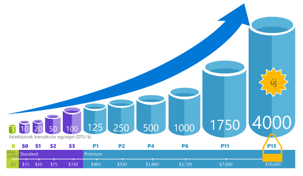
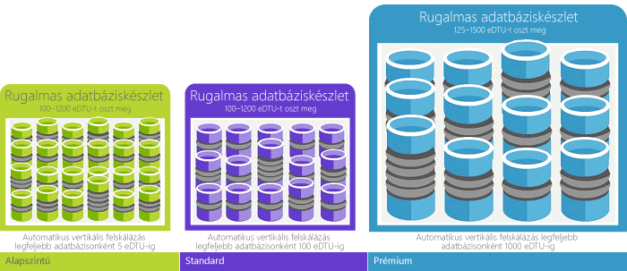
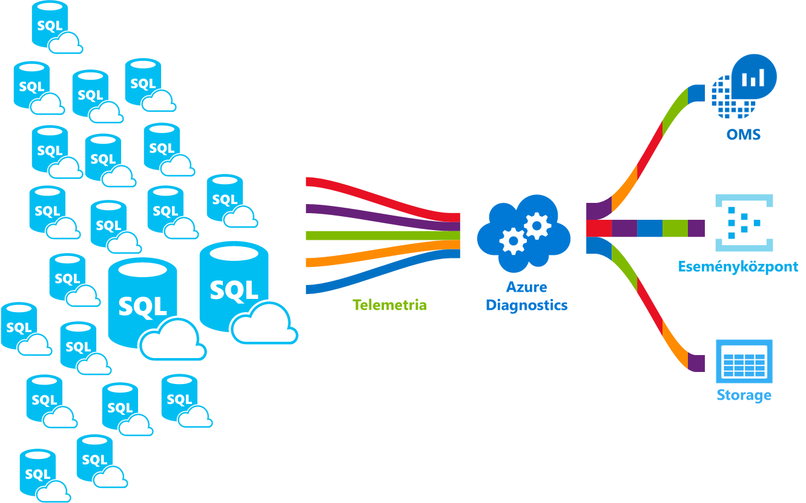

# Mi az hello Azure SQL Database szolgáltatás?What is hello Azure SQL Database service? 

Az SQL Database általános célú relációs adatbázis-szolgáltatás a Microsoft Azure-ban, amely egyebek mellett relációs, JSON-, térbeli és XML-struktúrákat is támogat.SQL Database is a general-purpose relational database service in Microsoft Azure that supports structures such as relational data, JSON, spatial, and XML. [Dinamikusan méretezhető teljesítményt](sql-database-service-tiers.md) nyújt és olyan lehetőségeket kínál, mint az [oszlopcentrikus indexelés](https://docs.microsoft.com/sql/relational-databases/indexes/columnstore-indexes-overview) kivételes mélységű elemzéshez és jelentéskészítéshez, és a [memóriabeli OLTP](sql-database-in-memory.md) a kivételesen nagy teljesítményű tranzakció-feldolgozáshoz.It delivers [dynamically scalable performance](sql-database-service-tiers.md) and provides options such as [columnstore indexes](https://docs.microsoft.com/sql/relational-databases/indexes/columnstore-indexes-overview) for extreme analytic analysis and reporting, and [in-memory OLTP](sql-database-in-memory.md) for extreme transactional processing. A Microsoft kezeli az összes javítását és zökkenőmentesen hello SQL kódbázis frissítése, és kivonatolja számítógépnél az alapul szolgáló infrastruktúra hello az összes felügyeleti.Microsoft handles all patching and updating of hello SQL code base seamlessly and abstracts away all management of hello underlying infrastructure. 

SQL-adatbázis a kódbázis osztanak meg hello [Microsoft SQL Server adatbázismotor](https://docs.microsoft.com/sql/sql-server/sql-server-technical-documentation).SQL Database shares its code base with hello [Microsoft SQL Server database engine](https://docs.microsoft.com/sql/sql-server/sql-server-technical-documentation). A Microsoft cloud-első stratégia hello elérhető legújabb képességeket az SQL Server áll kiadott első tooSQL adatbázis, és tooSQL kiszolgálójának nevével.With Microsoft's cloud-first strategy, hello newest capabilities of SQL Server are released first tooSQL Database, and then tooSQL Server itself. Ez a megközelítés lehetővé teszi hello legújabb SQL Server funkciói a javítás céljából nincs terhelés, vagy frissíti - és az új funkciók vizsgálni több millió adatbázisok között.This approach provides you with hello newest SQL Server capabilities with no overhead for patching or upgrading - and with these new features tested across millions of databases. A bejelentett új funkciókról az alábbi helyeken kaphat tájékoztatást:For information about new capabilities as they are announced, see:

- **[SQL adatbázis Azure menetrend](https://azure.microsoft.com/roadmap/?category=databases)**: egy sor toofind újdonságok, és mi várható tovább.**[Azure Roadmap for SQL Database](https://azure.microsoft.com/roadmap/?category=databases)**: A place toofind out what’s new and what’s coming next. 
- **[Azure SQL Database blog](https://azure.microsoft.com/blog/topics/database)**: Itt az SQL Server csapatának tagjai írnak az SQL Database újdonságairól és funkcióiról.**[Azure SQL Database blog](https://azure.microsoft.com/blog/topics/database)**: A place where SQL Server product team members blog about SQL Database news and features. 

A több szolgáltatási szinten is kiszámítható teljesítményt nyújtó SQL Database dinamikus méretezhetőséget kínál állásidő nélkül, beépített intelligens optimalizálással, globális méretezhetőséggel és rendelkezésre állással és fejlett biztonsági beállításokkal – mindezt szinte adminisztráció nélkül.SQL Database delivers predictable performance at multiple service levels that provides dynamic scalability with no downtime, built-in intelligent optimization, global scalability and availability, and advanced security options — all with near-zero administration. Ezek a képességek lehetővé teszik az alkalmazások gyors fejlesztésére és az idő toomarket felgyorsítása, hanem értékes időt és erőforrásokat toomanaging virtuális gépek és infrastruktúra toofocus.These capabilities allow you toofocus on rapid app development and accelerating your time toomarket, rather than allocating precious time and resources toomanaging virtual machines and infrastructure. hello szolgáltatás jelenleg 38 adatokat az SQL-adatbázis erőforrásokból hello világ további adatközpontok online állapotba kerüljön, amely lehetővé teszi toorun az adatbázis egy adott adatközpont környéken.hello SQL Database service is currently in 38 data centers around hello world, with more data centers coming online regularly, which enables you toorun your database in a data center near you.

> [!NOTE]
> Az Azure platformbiztonságáról az [Azure biztonsági és adatkezelési központ](https://azure.microsoft.com/support/trust-center/security/) részben talál információkat.See [Azure Trust Center](https://azure.microsoft.com/support/trust-center/security/) for information about Azure's platform security.
>

## Méretezhető teljesítmény és készletekScalable performance and pools

Az SQL Database-zel minden adatbázis önálló, hordozható, és saját garantált teljesítményt nyújtó [szolgáltatásszinttel](sql-database-service-tiers.md) rendelkezik.With SQL Database, each database is isolated from each other and portable, each with its own [service tier](sql-database-service-tiers.md) with a guaranteed performance level. SQL-adatbázis különböző teljesítményszintet biztosít a különböző igényeinek, és lehetővé teszi, hogy a adatbázisok toobe készletezett toomaximize hello erőforrások használatát és költségtakarékosabb munkavégzésben.SQL Database provides different performance levels for different needs, and enables databases toobe pooled toomaximize hello use of resources and save money.

### Teljesítmény módosítása és skálázása leállási idő nélkülAdjust performance and scale without downtime

SQL-adatbázis kínál négy szolgáltatásszintek toosupport egyszerűsített tooheavyweight adatbázis számítási feladatait: Basic, Standard, Premium és prémium RS.SQL Database offers four service tiers toosupport lightweight tooheavyweight database workloads: Basic, Standard, Premium, and Premium RS. Kisméretű, egyetlen adatbázison alacsony költséggel havonta az első alkalmazás elkészítésére, és módosítsa a szolgáltatási rétegben manuálisan vagy programon keresztül, a megoldás bármely idő toomeet hello igényeinek.You can build your first app on a small, single database at a low cost per month and then change its service tier manually or programmatically at any time toomeet hello needs of your solution. Módosíthatja a teljesítmény tooyour alkalmazás vagy tooyour ügyfelek állásidő nélkül.You can adjust performance without downtime tooyour app or tooyour customers. Dinamikus méretezhetőség lehetővé teszi, hogy az adatbázis tootransparently válaszolni toorapidly erőforrás-követelmények és lehetővé teszi, hogy Ön tooonly díj ellenében hello erőforrásokat kell, amikor szüksége van rájuk.Dynamic scalability enables your database tootransparently respond toorapidly changing resource requirements and enables you tooonly pay for hello resources that you need when you need them.

   

### Rugalmas készletek toomaximize erőforrás-használatElastic pools toomaximize resource utilization

Számos vállalkozás és alkalmazás képes toocreate önálló adatbázisok alatt, és igény szerinti teljesítmény felfelé vagy lefelé van elegendő, különösen ha használati minták viszonylag jól jelezhetők előre.For many businesses and applications, being able toocreate single databases and dial performance up or down on demand is enough, especially if usage patterns are relatively predictable. De ha előre nem látható használati minták, azt teheti, hogy rögzített toomanage költségek és az üzleti modell.But if you have unpredictable usage patterns, it can make it hard toomanage costs and your business model. [Rugalmas készletek](sql-database-elastic-pool.md) tervezett toosolve van probléma.[Elastic pools](sql-database-elastic-pool.md) are designed toosolve this problem. hello fogalma egyszerű.hello concept is simple. Egyedi adatbázis helyett a teljesítmény erőforrások tooa készletet foglal le, és fizessen hello teljesítményéért erőforrások hello készlet, nem pedig az önálló adatbázisok teljesítményét.You allocate performance resources tooa pool rather than an individual database, and pay for hello collective performance resources of hello pool rather than for single database performance. 

   

A rugalmas készletek toofocus a tárcsázás adatbázis teljesítményének növekszik és csökken, igény szerinti erőforrások ingadozik, nincs szükség.With elastic pools, you don’t need toofocus on dialing database performance up and down as demand for resources fluctuates. hello készletezett adatbázisok erőforrást hello teljesítmény hello rugalmas készlet igény szerint.hello pooled databases consume hello performance resources of hello elastic pool as needed. Készletezett adatbázisok felhasználását, de nem lépik túl hello készlet hello korlátai által megszabott, a költség marad előre jelezhető, még akkor is, ha egyes adatbázis-használat nem.Pooled databases consume but don’t exceed hello limits of hello pool, so your cost remains predictable even if individual database usage doesn’t. Mi az további, akkor [hozzá és távolíthat el az adatbázisok toohello készlet](sql-database-elastic-pool-manage-portal.md), skálázás adatbázisok toothousands költségvetést, amelyek belül az összes adatbázisra skálázhatja az alkalmazást.What’s more, you can [add and remove databases toohello pool](sql-database-elastic-pool-manage-portal.md), scaling your app from a handful of databases toothousands, all within a budget that you control. Is vezérlő hello minimális és maximális erőforrások elérhető toodatabases a hello készlet tooensure hello készletben adatbázis a teljes alkalmazáskészlet-erőforrásokat, és hogy minden készletezett adatbázis garantált minimális mennyiségű erőforrást hello.You can also control hello minimum and maximum resources available toodatabases in hello pool tooensure that no database in hello pool uses all hello pool resources and that every pooled database has a guaranteed minimum amount of resources. További információ a rugalmas készleteket használó SaaS-alkalmazások szerkezeti kialakításainak toolearn lásd [Tervminták több-bérlős SaaS-alkalmazásokhoz az SQL Database](sql-database-design-patterns-multi-tenancy-saas-applications.md).toolearn more about design patterns for SaaS applications using elastic pools, see [Design Patterns for Multi-tenant SaaS Applications with SQL Database](sql-database-design-patterns-multi-tenancy-saas-applications.md).

### Önálló adatbázisok beolvasztása a készletezett adatbázisokbaBlend single databases with pooled databases

Akár önálló adatbázisokat, akár rugalmas készleteket választ, a későbbiekben is sok mindent megváltoztathat.Either way you go — single databases or elastic pools — you are not locked in. Önálló adatbázisokat rugalmas készletek, és módosítsa a hello szolgáltatási szinteket az önálló adatbázisok és rugalmas készletek gyors és egyszerű tooadapt tooyour helyzet.You can blend single databases with elastic pools, and change hello service tiers of single databases and elastic pools quickly and easily tooadapt tooyour situation. Hello teljesítménye és elérése révén az Azure, az lehetővé teszi a vegyes és-egyezést más Azure SQL Database toomeet az egyedi alkalmazás tervezési igények, a meghajtó költségeket, és a erőforrás hatékonyság szolgáltatásokhoz, és új üzleti lehetőségek kiaknázása.With hello power and reach of Azure, you can mix-and-match other Azure services with SQL Database toomeet your unique app design needs, drive cost and resource efficiencies, and unlock new business opportunities.

### Széles körű figyelési és riasztási funkciókExtensive monitoring and alerting capabilities

De hogyan is összehasonlítja hello önálló adatbázisok és rugalmas készletek relatív teljesítménye?But how can you compare hello relative performance of single databases and elastic pools? Honnan tudhatja hello kattintson a jobb gombbal-stop felfelé és lefelé tárcsázás?How do you know hello right click-stop when you dial up and down? Hello használata [beépített teljesítményfigyelési](sql-database-performance.md) és [riasztási](sql-database-insights-alerts-portal.md) eszközök hello teljesítmény értékelések alapján együtt [az önálló adatbázisok adatbázis-tranzakciós egységek (dtu-k) és rugalmas dtu-i (edtu-k) rugalmas készletek](sql-database-what-is-a-dtu.md).You use hello [built-in performance monitoring](sql-database-performance.md) and [alerting](sql-database-insights-alerts-portal.md) tools, combined with hello performance ratings based on [Database Transaction Units (DTUs) for single databases and elastic DTUs (eDTUs) for elastic pools](sql-database-what-is-a-dtu.md). Ezen eszközök segítségével gyorsan felmérheti hello hatása skálázás felfelé vagy lefelé alapján a jelenlegi vagy a teljesítményigény projektre.Using these tools, you can quickly assess hello impact of scaling up or down based on your current or project performance needs. A részletekért olvassa el [Az SQL Database beállításai és teljesítménye: mi érhető el az egyes szolgáltatásszinteken](sql-database-service-tiers.md) című részt.See [SQL Database options and performance: Understand what's available in each service tier](sql-database-service-tiers.md) for details.

Az SQL Database emellett [metrikák és diagnosztikai naplók kibocsátásával](sql-database-metrics-diag-logging.md) is képes megkönnyíteni a felügyeletet.Additionally, SQL Database can [emit metrics and diagnostic logs](sql-database-metrics-diag-logging.md) for easier monitoring. SQL-adatbázis toostore erőforrás-használat, a munkavállalók és a munkamenetek és a kapcsolat egy Azure erőforrásainak konfigurálhatja:You can configure SQL Database toostore resource usage, workers and sessions, and connectivity into one of these Azure resources:

- **Azure Storage**: Nagy tömegű telemetriai adat alacsony költségű archiválására**Azure Storage**: For archiving vast amounts of telemetry for a small price
- **Azure Event Hub**: Az SQL Database telemetriai adatainak integrálásra saját egyedi figyelési megoldásokkal vagy élő adatfolyamatokkal**Azure Event Hub**: For integrating SQL Database telemetry with your custom monitoring solution or hot pipelines
- **Azure Log Analytics**: Beépített figyelési megoldás jelentéskészítő, riasztó és a hibák következményeit enyhítő funkciókkal**Azure Log Analytics**: For built-in monitoring solution with reporting, alerting, and mitigating capabilities

    

## Rendelkezésre állásAvailability capabilities

Az Azure szolgáltatói szerződésében [(SLA)](http://azure.microsoft.com/support/legal/sla/) az ágazatban élenjáró módon 99,99 százalékos elérhetőséget biztosítunk – a Microsoft által kezelt adatbázisok globális hálózata teszi lehetővé, hogy alkalmazása a hét mind a 7 napján, napi 24 órában fusson.Azure's industry leading 99.99% availability service level agreement [(SLA)](http://azure.microsoft.com/support/legal/sla/), powered by a global network of Microsoft-managed datacenters, helps keep your app running 24/7. Az SQL Database ezen felül olyan beépített funkciókkal szolgálja [az üzletmenet folytonosságát és a globális méretezhetőséget](sql-database-business-continuity.md), mint például a következők:In addition, SQL Database provides built-in [business continuity and global scalability](sql-database-business-continuity.md) features, including:

- **[Automatikus biztonsági mentések](sql-database-automated-backups.md)**: Az SQL Database automatikusan készít teljes, differenciális és tranzakciónapló-alapú biztonsági mentéseket.**[Automatic backups](sql-database-automated-backups.md)**: SQL Database automatically performs full, differential, and transaction log backups.
- **[Időpontban visszaállítások](sql-database-recovery-using-backups.md)**: SQL-adatbázis helyreállítási tooany pont támogatja hello automatikus biztonsági mentés megőrzési időn belül.**[Point-in-time restores](sql-database-recovery-using-backups.md)**: SQL Database supports recovery tooany point in time within hello automatic backup retention period.
- **[Aktív georeplikáció](sql-database-geo-replication-overview.md)**: SQL-adatbázis lehetővé teszi, hogy tooconfigure toofour olvasható másodlagos mentése vagy hello adatbázisok azonos vagy globálisan elosztott az Azure-adatközpont.**[Active geo-replication](sql-database-geo-replication-overview.md)**: SQL Database allows you tooconfigure up toofour readable secondary databases in either hello same or globally distributed Azure data centers.  Például ha nagyszámú egyidejű olvasási tranzakciókat tartalmazó adatbázissal katalógus egy SaaS-alkalmazáshoz, használjon aktív georeplikáció tooenable globális olvasható méretezési és szűk keresztmetszeteinek megszüntetéséhez hello elsődleges, amelyek miatt tooread munkaterhelések.For example, if you have a SaaS application with a catalog database that has a high volume of concurrent read-only transactions, use active geo-replication tooenable global read scale and remove bottlenecks on hello primary that are due tooread workloads. 
- **[Feladatátvételi csoportok](sql-database-geo-replication-overview.md)**: SQL-adatbázis lehetővé teszi a tooenable magas rendelkezésre állás és a terheléselosztási globális léptékű, többek között a transzparens georeplikáció és a nagy adatbázisok és rugalmas készletek feladatátvételi.**[Failover groups](sql-database-geo-replication-overview.md)**: SQL Database allows you tooenable high availability and load balancing at global scale, including transparent geo-replication and failover of large sets of databases and elastic pools. Feladatátvételi csoportok és aktív georeplikáció lehetővé teszi, hogy létrehozása adminisztrációs terhet hagyja az összes hello összetett figyeléséhez, Útválasztás és feladatátvételi vezénylési tooSQL adatbázis globálisan elosztott SaaS-alkalmazásokhoz.Failover groups and active geo-replication enables creation of globally distributed SaaS applications with minimal administration overhead leaving all hello complex monitoring, routing, and failover orchestration tooSQL Database.

## Beépített intelligenciaBuilt-in intelligence

Az SQL Database beépített funkciói, amely segít jelentősen csökkenti futtatásáért és felügyeletéért felelős adatbázisok hello költségeit, és a lehető legnagyobbra növeli a teljesítményt és a az alkalmazás biztonsági beolvasása.With SQL Database, you get built-in intelligence that helps you dramatically reduce hello costs of running and managing databases and maximizes both performance and security of your application. Több millió felhasználói 24 órás munkaterheket futtatnak, SQL-adatbázis gyűjt, és teljes mértékben betartása mellett az ügyfelek adatvédelmének hello háttérben dolgozza fel a telemetriai adatokat, a nagy mennyiségű.Running millions of customer workloads around-the-clock, SQL Database collects and processes a massive amount of telemetry data, while also fully respecting customer privacy behind hello scenes. Különböző algoritmusokat folyamatosan értékelése hello telemetriai adatokat, hogy hello szolgáltatás ismerje meg, és alkalmazkodnak az alkalmazással.Various algorithms are continuously evaluating hello telemetry data so that hello service can learn and adapt with your application. Az elemzés alapján, hello szolgáltatás felmerül és a teljesítmény javítása a következőkhöz ideális tooyour adott munkaterhelés javaslatok.Based on this analysis, hello service comes up with performance improving recommendations tailored tooyour specific workload. 

### A teljesítmény automatikus finomhangolásaAutomatic performance tuning

SQL Database hello részletes betekintést lekérdezi, hogy kell-e toomonitor is tartalmaz.SQL Database provides detailed insight into hello queries that you need toomonitor. SQL-adatbázis az adatbázis-minták értesül, és lehetővé teszi, hogy a hogy tooadapt az adatbázis-séma tooyour munkaterhelés.SQL Database's learns about your database patterns and enables you tooadapt your database schema tooyour workload. Az SQL Database az [SQL Database Advisor](sql-database-advisor.md) segítségével javaslatokat tesz a teljesítmény finomhangolására, amelyeket Ön felülvizsgálhat és alkalmazhat.SQL Database provides performance tuning recommendations using  [SQL Database Advisor](sql-database-advisor.md), where you can review tuning actions and apply them. Az adatbázisok folyamatos figyelése azonban nehéz, fárasztó feladat, különösen akkor, ha sok adatbázisról van szó.However, constantly monitoring database is a hard and tedious task, especially when dealing with many databases. Adatbázisok hatalmas számú kezelése lehet lehetetlen toodo hatékonyan még az összes elérhető eszközöket és jelentéseket SQL Database és az Azure-portálon.Managing a huge number of databases might be impossible toodo efficiently even with all available tools and reports that SQL Database and Azure portal provide. Helyett figyelése, és az adatbázis manuálisan beállítása, érdemes lehet néhány hello figyelése és műveletek tooSQL beállítása delegálása adatbázis automatikus hangolási funkció használata.Instead of monitoring and tuning your database manually, you might consider delegating some of hello monitoring and tuning actions tooSQL Database using automatic tuning feature. SQL-adatbázis automatikusan alkalmazza a javaslatok, teszteket, és ellenőrzi az egyes műveletek tooensure hangolási hello teljesítményének javítása tartja.SQL Database automatically apply recommendations, tests, and verifies each of its tuning actions tooensure hello performance keeps improving. Ezzel a módszerrel SQL-adatbázis automatikusan alkalmazkodik tooyour munkaterhelés ellenőrzött és biztonságos módon.This way, SQL Database automatically adapts tooyour workload in controlled and safe way. Automatikus hangolása azt jelenti, hogy az adatbázis teljesítményét hello gondosan ellenőrzött és előtt és után minden hangolási művelet képest, hello teljesítmény nem javul, ha hello hangolása művelet van-e vissza.Automatic tuning means that hello performance of your database is carefully monitored and compared before and after every tuning action, and if hello performance doesn’t improve, hello tuning action is reverted.

A partnerek futtató ma, több [több-bérlős Szolgáltatottszoftver-alkalmazásoknál](sql-database-design-patterns-multi-tenancy-saas-applications.md) automatikus teljesítményhangolás, az alkalmazások mindig rendelkezik-e stabil és kiszámítható teljesítmény toomake vannak függő SQL-adatbázis felett.Today, many of our partners running [SaaS multi-tenant apps](sql-database-design-patterns-multi-tenancy-saas-applications.md) on top of SQL Database are relying on automatic performance tuning toomake sure their applications always have stable and predictable performance. A számukra Ez a szolgáltatás rendkívüli mértékben csökkenti a hello kockázatot a teljesítmény, amelyhez hello éjszakai hello közepén.For them, this feature tremendously reduces hello risk of having a performance incident in hello middle of hello night. Ezenkívül, mivel a vásárlói bázisunk részét is használja az SQL Server, használják hello SQL-adatbázis toohelp által biztosított azonos indexelési javaslatok az SQL Server-ügyfeleknek.In addition, since part of their customer base also uses SQL Server, they are using hello same indexing recommendations provided by SQL Database toohelp their SQL Server customers.

Az SQL Database két szempont alapján képes automatikus finomhangolást végezni:There are two automatic tuning aspects that are available in SQL Database:

- **[Automatikus indexkezelés](sql-database-automatic-tuning.md#automatic-index-management)**: Azonosítja az adatbázishoz hozzáadandó és az abból eltávolítandó indexeket.**[Automatic index management](sql-database-automatic-tuning.md#automatic-index-management)**: Identifies indexes that should be added in your database, and indexes that should be removed.
- **[Automatikus terv-korrekció](sql-database-automatic-tuning.md#automatic-plan-choice-correction)**: Azonosítja a hibás terveket és javítja az SQL tervek teljesítmény-problémáit (hamarosan megjelenik, az SQL Server 2017-ben már elérhető).**[Automatic plan correction](sql-database-automatic-tuning.md#automatic-plan-choice-correction)**: Identifies problematic plans and fixes SQL plan performance problems (coming soon, already available in SQL Server 2017).

### Adaptív lekérdezés-feldolgozásAdaptive query processing

Azt is való felvételekor hello [adaptív lekérdezés feldolgozása](/sql/relational-databases/performance/adaptive-query-processing) operációsrendszer-funkciókat tooSQL adatbázis, beleértve több utasításból álló táblázat értékű függvények kihagyásos végrehajtási kötegelt módban memória adjon visszajelzést, és kötegelt módban adaptív illesztések .We are also adding hello [adaptive query processing](/sql/relational-databases/performance/adaptive-query-processing) family of features tooSQL Database, including interleaved execution for multi-statement table-valued functions, batch mode memory grant feedback, and batch mode adaptive joins. További útmutatás nyújtása a cím problémák kapcsolódó toohistorically intractable lekérdezés optimalizálási teljesítményproblémákat hasonló "ismerje meg, és alkalmazkodáshoz" technikák egyes adaptív lekérdezés feldolgozása szolgáltatásokról vonatkozik.Each of these adaptive query processing features applies similar “learn and adapt” techniques, helping further address performance issues related toohistorically intractable query optimization problems.

### Intelligens fenyegetésészlelésIntelligent threat detection

 [SQL Fenyegetésészlelés](sql-database-threat-detection.md) kihasználja [SQL Database auditing](sql-database-auditing.md) toocontinuously figyelése Azure SQL-adatbázisok a potenciálisan káros kísérletek tooaccess bizalmas adatokat.[SQL Threat Detection](sql-database-threat-detection.md) leverages [SQL Database auditing](sql-database-auditing.md) toocontinuously monitor Azure SQL databases for potentially harmful attempts tooaccess sensitive data. A fenyegetésészlelés SQL biztonsági, amely lehetővé teszi, hogy az ügyfelek toodetect és toopotential fenyegetések válaszol, a rendellenes tevékenységek adja meg a biztonsági riasztások előforduló egy új réteget biztosít.SQL threat detection provides a new layer of security, which enables customers toodetect and respond toopotential threats as they occur by providing security alerts on anomalous activities. A felhasználók riasztást kapnak a gyanús adatbázis-tevékenységekről, a lehetséges biztonsági résekről, az SQL-injektálásos támadásokról, valamint a rendellenes adatbázis-hozzáférési mintákról.Users receive alerts upon suspicious database activities, potential vulnerabilities, and SQL injection attacks, and anomalous database access patterns. SQL fenyegetés észlelési riasztásokat gyanús tevékenység részleteinek megadása, és hogyan művelet javasolja tooinvestigate és hello fenyegetést.SQL threat detection alerts provide details of suspicious activity and recommend action on how tooinvestigate and mitigate hello threat. Felhasználók hello gyanús események toodetermine felfedezheti, ha hello esemény eredményei egy kísérlet tooaccess megsértik, vagy kihasznál hello adatbázis adatait.Users can explore hello suspicious events toodetermine if hello event results from an attempt tooaccess, breach, or exploit data in hello database. A fenyegetésészlelés teszi egyszerű tooaddress potenciális fenyegetések toohello adatbázis hello kell toobe egy biztonsági szakértő nélkül, vagy speciális biztonsági rendszerek figyelése kezelése.Threat detection makes it simple tooaddress potential threats toohello database without hello need toobe a security expert or manage advanced security monitoring systems.

## Magas szintű biztonság és megfelelőségAdvanced security and compliance

SQL Database is tartalmaz számos [beépített biztonsági és megfelelőségi szolgáltatásokat](sql-database-security-overview.md) toohelp az alkalmazás megfelelő különféle biztonsági és megfelelőségi követelményeknek.SQL Database provides a range of [built-in security and compliance features](sql-database-security-overview.md) toohelp your application meet various security and compliance requirements. 

### Naplózás a megfelelőség és biztonság szolgálatábanAuditing for compliance and security

[SQL Database Auditing](sql-database-auditing.md) követi az adatbázisban, és beírja őket az Azure-tárfiókot tooan naplót.[SQL Database Auditing](sql-database-auditing.md) tracks database events and writes them tooan audit log in your Azure storage account. A naplózás segíthet a jogszabályi megfelelőség fenntartásában és az adatbázison végzett tevékenység megértésében, valamint az esetleg üzleti veszélyeket vagy biztonsági problémákat jelző rendellenességek feltárásában.Auditing can help you maintain regulatory compliance, understand database activity, and gain insight into discrepancies and anomalies that could indicate business concerns or suspected security violations.

### Adat-titkosítás inaktív állapotbanData encryption at rest

SQL-adatbázis [átlátható adattitkosítás](https://docs.microsoft.com/sql/relational-databases/security/encryption/transparent-data-encryption-with-azure-sql-database) tranzakció naplófájlok nyugalmi és valós idejű titkosítási és visszafejtési hello adatbázis, a társított biztonsági másolatok, kártevő szándékú tevékenységek hello fenyegetés elleni segítségével anélkül, hogy a módosítások toohello alkalmazás.SQL Database [transparent data encryption](https://docs.microsoft.com/sql/relational-databases/security/encryption/transparent-data-encryption-with-azure-sql-database) helps protect against hello threat of malicious activity by performing real-time encryption and decryption of hello database, associated backups, and transaction log files at rest without requiring changes toohello application. 2017 májusától minden újonnan létrehozott Azure SQL adatbázis automatikusan transzparens adattitkosítás (TDE) védelmet kap.Starting in May 2017, all newly created Azure SQL databases are automatically protected with transparent data encryption (TDE). TDE SQL bizonyítása nyugalmi titkosítási technológia, amely sok megfelelőségi szabványok tooprotect adathordozók lopás elleni szükséges.TDE is SQL’s proven encryption-at-rest technology that is required by many compliance standards tooprotect against theft of storage media. Az ügyfelek hello TDE titkosítási kulcsokat és más titkos adatokat is kezelheti az Azure Key Vault segítségével biztonságos és megfelelő módon.Customers can manage hello TDE encryption keys and other secrets in a secure and compliant manner using Azure Key Vault.

### Adattitkosítás menet közbenData encryption in motion

SQL-adatbázis hello csak adatbázis toooffer Rendszervédelem útban, inaktív és feldolgozására lekérdezés során a bizalmas adatok [mindig titkosítja](https://docs.microsoft.com/sql/relational-databases/security/encryption/always-encrypted-database-engine).SQL Database is hello only database system toooffer protection of sensitive data in flight, at rest and during query processing with [Always Encrypted](https://docs.microsoft.com/sql/relational-databases/security/encryption/always-encrypted-database-engine). Mindig titkosított egy iparági-első unparalleled adatok kínál hello lopás a kulcsfontosságú adatokat érintő problémák elleni biztonsági.Always Encrypted is an industry-first that offers unparalleled data security against breaches involving hello theft of critical data. Például mindig titkosítja, az ügyfelek hitelkártyaszámok tárolja titkosított formában hello adatbázis mindig, még akkor is, a lekérdezés feldolgozása közben lehetővé visszafejtési használati hello ponton engedélyezett személyzeti vagy tooprocess igénylő alkalmazások adatokat.For example, with Always Encrypted, customers’ credit card numbers are stored encrypted in hello database always, even during query processing, allowing decryption at hello point of use by authorized staff or applications that need tooprocess that data.

### Dinamikus adatmaszkolásDynamic data masking

[SQL-adatbázis dinamikus adatmaszkolási](sql-database-dynamic-data-masking-get-started.md) bizalmas adatok veszélyeztetettségének korlátozása maszkolás azt toonon jogosultságú felhasználók által.[SQL Database dynamic data masking](sql-database-dynamic-data-masking-get-started.md) limits sensitive data exposure by masking it toonon-privileged users. Dinamikus adatmaszkolási megakadályozza, hogy jogosulatlan hozzáférés toosensitive adatokat azáltal, hogy az ügyfelek toodesignate mennyi hello bizalmas adatok tooreveal hello alkalmazás réteg gyakorolt minimális hatás mellett.Dynamic data masking helps prevent unauthorized access toosensitive data by enabling customers toodesignate how much of hello sensitive data tooreveal with minimal impact on hello application layer. Egy csoportházirend-alapú biztonsági funkció, hello bizalmas adatok hello eredménykészletben lekérdezés elrejti a kijelölt adatbázis mezők keresztül közben hello adatbázis hello adatai nem változik.It’s a policy-based security feature that hides hello sensitive data in hello result set of a query over designated database fields, while hello data in hello database is not changed.

### Sorszintű biztonságRow-level security

[A sorszintű biztonsági](https://docs.microsoft.com/sql/relational-databases/security/row-level-security) lehetővé teszi, hogy az ügyfelek toocontrol hozzáférés toorows egy adatbázis tábláinak hello jellemzők hello felhasználó lekérdezése alapján (például a csoport tagságát vagy végrehajtási környezet által).[Row-level security](https://docs.microsoft.com/sql/relational-databases/security/row-level-security) enables customers toocontrol access toorows in a database table based on hello characteristics of hello user executing a query (such as by group membership or execution context). A sorszintű biztonságot (RLS) egyszerűbbé teszi a hello tervezési és az alkalmazás biztonsági kódolása.Row-level security (RLS) simplifies hello design and coding of security in your application. RLS lehetővé teszi sor adatelérési tooimplement korlátozásait.RLS enables you tooimplement restrictions on data row access. Például annak érdekében, hogy munkavállalók férhessenek hozzá csak ezen adatok sorokat, amelyek a megfelelő tootheir részleg, vagy a felhasználói adatok hozzáférés tooonly hello adatok vonatkozó tootheir vállalati korlátozása.For example ensuring that workers can access only those data rows that are pertinent tootheir department, or restricting a customer's data access tooonly hello data relevant tootheir company.

### Azure Active Directory-integráció és többtényezős hitelesítésAzure Active Directory integration and multi-factor authentication

SQL-adatbázis lehetővé teszi, hogy akkor toocentrally adatbázis-felhasználó és más Microsoft-szolgáltatásokban az identitások kezeléséhez [Azure Active Directory-integráció](sql-database-aad-authentication.md).SQL Database enables you toocentrally manage identities of database user and other Microsoft services with [Azure Active Directory integration](sql-database-aad-authentication.md). Ez a funkció egyszerűsíti az engedélyek kezelését és fokozza a biztonságot.This capability simplified permission management and enhances security. Az Azure Active Directory támogatja [a multi-factor authentication](sql-database-ssms-mfa-authentication.md) (MFA) tooincrease adat és alkalmazás támogatása egyetlen rang a folyamat közben biztonsági.Azure Active Directory supports [multi-factor authentication](sql-database-ssms-mfa-authentication.md) (MFA) tooincrease data and application security while supporting a single sing-in process.

### Megfelelőségi tanúsítványCompliance certification

Az SQL Database rendszeres ellenőrzéseken vesz részt és számos megfelelőségi szabványnak tesz eleget tanúsított módon.SQL Database participates in regular audits and has been certified against several compliance standards. További információkért lásd: hello [Microsoft Azure Trust Center](https://azure.microsoft.com/support/trust-center/), ahol hello legfrissebb listáját megtalálja [SQL-adatbázis megfelelőségi minősítései közül](https://azure.microsoft.com/support/trust-center/services/).For more information, see hello [Microsoft Azure Trust Center](https://azure.microsoft.com/support/trust-center/), where you can find hello most current list of [SQL Database compliance certifications](https://azure.microsoft.com/support/trust-center/services/).

## Egyszerűen használható eszközökEasy-to-use tools

Az SQL Database egyszerűbbé és hatékonyabbá teszi az alkalmazások létrehozását és karbantartását.SQL Database makes building and maintaining applications easier and more productive. SQL-adatbázis lehetővé teszi a legjobb toofocus: kiváló alkalmazások készítését.SQL Database allows you toofocus on what you do best: building great apps. Az SQL Database-ben a már meglévő eszközeivel és szakértelmével dolgozhat és fejleszthet.You can manage and develop in SQL Database using tools and skills you already have.

- **[Azure-portálon hello](https://portal.azure.com/)**: egy webalapú alkalmazást az összes Azure-szolgáltatások kezelése**[hello Azure portal](https://portal.azure.com/)**: A web-based application for managing all Azure services 
- **[SQL Server Management Studio](https://docs.microsoft.com/sql/ssms/download-sql-server-management-studio-ssms)**: egy ingyenes, letölthető ügyfél-alkalmazást az SQL Server tooSQL adatbázis bármely SQL infrastruktúra kezelése**[SQL Server Management Studio](https://docs.microsoft.com/sql/ssms/download-sql-server-management-studio-ssms)**: A free, downloadable client application for managing any SQL infrastructure, from SQL Server tooSQL Database
- **[SQL Server Data Tools a Visual Studióban](https://docs.microsoft.com/sql/ssdt/download-sql-server-data-tools-ssdt)**: Ingyenes, letölthető ügyféloldali alkalmazás SQL Server relációs adatbázisok, Azure SQL adatbázisok, Integration Services csomagok, Analysis Services adatmodellek, és Reporting Services-jelentések fejlesztéséhez.**[SQL Server Data Tools in Visual Studio](https://docs.microsoft.com/sql/ssdt/download-sql-server-data-tools-ssdt)**: A free, downloadable client application for developing SQL Server relational databases, Azure SQL databases, Integration Services packages, Analysis Services data models, and Reporting Services reports.
- **[A Visual Studio Code](https://code.visualstudio.com/docs)**: egy ingyenes, letölthető, nyissa meg a forrás, a kód szerkesztése a Windows, a macOS és a Linux, amely támogatja a bővítményeket, ezek közé tartoznak a hello [mssql bővítmény](https://aka.ms/mssql-marketplace) Microsoft SQL Server lekérdezése Az Azure SQL Database, és az SQL Data Warehouse.**[Visual Studio Code](https://code.visualstudio.com/docs)**: a free, downloadable, open source, code editor for Windows, macOS, and Linux that supports extensions, including hello [mssql extension](https://aka.ms/mssql-marketplace) for querying Microsoft SQL Server, Azure SQL Database, and SQL Data Warehouse.

SQL-adatbázis támogatja a Python, Java, Node.js, PHP, Ruby, és a hello MacOS .NET, Linux és Windows épület-alkalmazásokat.SQL Database supports building applications with Python, Java, Node.js, PHP, Ruby, and .NET on hello MacOS, Linux, and Windows. SQL-adatbázis által támogatott hello azonos [adatkapcsolattárak](sql-database-libraries.md) és SQL Server.SQL Database supports hello same [connection libraries](sql-database-libraries.md) as SQL Server.

## Az SQL Server mérnöki csapathoz hello megszólításaEngage with hello SQL Server engineering team

- [DBA-veremcsere](https://dba.stackexchange.com/questions/tagged/sql-server): Kérdések az adatbázis rendszergazdájának[DBA Stack Exchange](https://dba.stackexchange.com/questions/tagged/sql-server): Ask database administration questions
- [Veremtúlcsordulás](http://stackoverflow.com/questions/tagged/sql-server): Kérdések a fejlesztőknek[Stack Overflow](http://stackoverflow.com/questions/tagged/sql-server): Ask development questions
- [MSDN fórumok](https://social.msdn.microsoft.com/Forums/en-US/home?category=sqlserver): Műszaki kérdések[MSDN Forums](https://social.msdn.microsoft.com/Forums/en-US/home?category=sqlserver): Ask technical questions
- [Microsoft Connect](https://connect.microsoft.com/SQLServer/Feedback): Hibák jelentése és funkciók kérése[Microsoft Connect](https://connect.microsoft.com/SQLServer/Feedback): Report bugs and request feature
- [Reddit](https://www.reddit.com/r/SQLServer/): Az SQL Server megvitatása[Reddit](https://www.reddit.com/r/SQLServer/): Discuss SQL Server

## Következő lépésekNext steps

- Lásd: hello [árképzést ismertető oldalra](https://azure.microsoft.com/pricing/details/sql-database/) önálló adatbázisok és rugalmas készletek költségeinek összehasonlításáért és számító eszközét.See hello [pricing page](https://azure.microsoft.com/pricing/details/sql-database/) for single database and elastic pools cost comparisons and calculators.

- Tekintse meg a quick elindul használatba tooget:See these quick starts tooget you started:

  - [SQL-adatbázis létrehozása hello Azure-portálonCreate a SQL database in hello Azure portal](sql-database-get-started-portal.md)  
  - [Hozzon létre egy SQL-adatbázis hello Azure parancssori felületCreate a SQL database with hello Azure CLI](sql-database-get-started-cli.md)
  - [SQL Database létrehozása PowerShell használatávalCreate a SQL database using PowerShell](sql-database-get-started-powershell.md)

- Több Azure CLI és PowerShell-mintát talál itt:For a set of Azure CLI and PowerShell samples, see:
  - [Azure CLI-minták az SQL Database-hezAzure CLI samples for SQL Database](sql-database-cli-samples.md)
  - [Azure PowerShell-minták az SQL Database-hezAzure PowerShell samples for SQL Database](sql-database-powershell-samples.md)
